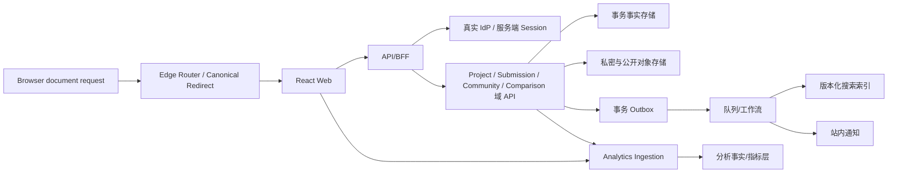

# VibeCheck 首期 MVP 开发级 PRD

**版本：v1.10｜状态：已批准开发基线（WP-00）｜文档日期：2026-08-10｜内容母版：Markdown**

本文档是前端、后端、设计、测试和 Codex 执行技术设计与开发的已批准产品需求基线。v1.10 关闭 v1.9 复审 V19-01—V19-04，并记录 2026-08-10 产品负责人对登录方式、P0 外部能力边界、P19/P20 范围和开发启动的批准；正式 Git commit、PRD SHA-256 与代码基线在独立基线记录中绑定。本文档定义逻辑实体、数据所有权和接口契约，不设计数据库物理表；技术设计不得用现有 Mock 或字段缺失反向降低冻结需求。

## 目录

1. 文档信息与版本记录

2. PRD输入与需求基线

3. 版本目标与MVP范围

4. 需求优先级和Requirement ID规则

5. 用户角色与权限

6. 信息架构和页面地图

7. 全局产品规则

8. P01作品广场

9. P02—P03分类与专题

10. P04最新动态

11. P05—P07搜索、意图确认与同类分析

12. P08作品详情

13. P09作品比较

14. P10—P13发布、身份验证与作品更新

15. P14作者主页

16. P15个人中心

17. P16通知中心

18. P17登录注册

19. P18关于与可信机制

20. A01—A14运营后台

21. 开发级字段字典

22. 状态机

23. 权限与鉴权规则

24. 搜索、匹配、排序与推荐规则

25. 异常流程

26. 消息与反馈文案规则

27. 埋点事件字典

28. 指标计算口径

29. 非功能需求

30. Given/When/Then验收用例

31. 需求—页面—代码—接口—埋点—测试追踪矩阵

32. 当前代码差距及开发范围摘要

33. 上线前检查清单

# 一、文档信息与版本记录

| 项 | 内容 |
| --- | --- |
| 文档名称 | 《VibeCheck 首期 MVP 开发级 PRD》 |
| 版本 | v1.10 |
| 状态 | 已批准开发基线（WP-00）；V19-01—V19-04 已形成唯一规范 |
| 适用范围 | P01–P18 前台 P0、A01–A14 后台、逻辑数据模型、接口契约、埋点、指标与验收 |
| 不适用范围 | P19/P20 开发验收、物理数据库设计、供应商选型、部署实现、P1/P2 功能 |
| 代码基线 | GitHub `jiadianyan112/VibeCheck`；提交 `3c1c4ef54f1a24368ef9d2f25bc52432556ad488` |
| 质量基线 | v1.8 再复审核验：60 个测试文件、285 项测试通过；TypeScript 检查通过；Lint 0 error/14 warning；Playwright 72 项为49 passed/2 failed/21 skipped，失败仍因旧 DecisionForm；build 通过但主 JS 721.92 kB（gzip 211.11 kB）并有大包 warning。以上仅证明原型现状，不证明生产需求或性能达标。 |
| 交付物 | `docs/VibeCheck首期MVP开发级PRD-v1.10.md`；不生成 DOCX。旧 `v1.0.md` 保留为历史工作母版，不再作为开发唯一基线。Git commit、PRD SHA-256 与技术文档版本见独立基线记录。 |

| 版本 | 日期 | 作者角色 | 变更 |
| --- | --- | --- | --- |
| v1.0 | 2026-08-10 | 高级产品经理/产品架构师/开发交付负责人 | 汇总全部指定资料、最终原型与代码审计，建立双品类工程基线。 |
| v1.1 | 2026-08-10 | 高级产品经理/产品架构师/开发交付负责人 | 根据《VibeCheck开发级PRD技术可实现性审查报告》闭环 55 项问题；重构 Submission/Project/Update 边界、生产架构、权限、隐私、接口、事件、指标和验收口径。 |
| v1.2 | 2026-08-10 | 高级产品经理/产品架构师/开发交付负责人 | 根据《VibeCheck开发级PRD技术可实现性复审报告-v1.1》处理 26 项残留问题；冻结新作品平台首发、私密验证材料协议、工作流实体、媒体/AI 工具语义、高风险协议、查询快照、状态机、Outbox、埋点批次及指标主体口径。 |
| v1.3 | 2026-08-10 | 高级产品经理/产品架构师/开发交付负责人 | 根据《VibeCheck开发级PRD技术可实现性复审报告-v1.2》处理 19 项残留问题；补齐验证草稿、确认令牌、媒体引用、修订链、工作项、查询续接、登录合并、后台建档/关系/角色审批及争议案件完整调用链。 |
| v1.4 | 2026-08-10 | 高级产品经理/产品架构师/开发交付负责人 | 根据《VibeCheck开发级PRD技术可实现性复审报告-v1.3》处理 22 项问题；冻结 AuthorRelation、ProjectUpdate 工作项、再认证 grant、争议撤案、Evidence 有效性、搜索归因、角色变更语义及原型替换门禁。 |
| v1.5 | 2026-08-10 | 高级产品经理/产品架构师/开发交付负责人 | 根据《VibeCheck开发级PRD技术可实现性复审报告-v1.4》处理 17 项问题；补齐 CreatorAccountLink、EvidenceDraft 提升链、条件式再认证、撤案请求历史、媒体暂存、一次性搜索归因、不可变历史边界与角色/路由责任。 |
| v1.6 | 2026-08-10 | 高级产品经理/产品架构师/开发交付负责人 | 根据《VibeCheck开发级PRD技术可实现性复审报告-v1.5》处理 17 项问题；冻结证据一对一晋级、Link 权限档案、证据附件、Creator Profile 交接、争议终局、Creator 合并碰撞、Event 排序、搜索归因、分析主体、私密材料扫描与媒体删除任务。 |
| v1.7 | 2026-08-10 | 高级产品经理/产品架构师/开发交付负责人 | 根据《VibeCheck开发级PRD技术可实现性复审报告-v1.6》处理 13 项问题；冻结完整 Evidence 晋级与决定引用、owner Link 并发唯一性、争议主体冲突集合、附件/资料状态、Creator Profile 修订和失败矩阵、服务证明型搜索事件、推进主体以及媒体删除 Saga。 |
| v1.8 | 2026-08-10 | 高级产品经理/产品架构师/开发交付负责人 | 根据《VibeCheck开发级PRD技术可实现性复审报告-v1.7》处理 9 项问题；冻结 Version 带类型决定来源、Creator Profile 执行决定与三方重基线、申请人材料粗粒度投影、P0 固定权限档案、争议队列完全过滤、project_updated 判别联合、统一 metric subject 与 Evidence 规范请求 Key。 |
| v1.9 | 2026-08-10 | 高级产品经理/产品架构师/开发交付负责人 | 根据《VibeCheck开发级PRD技术可实现性复审报告-v1.8》处理 8 项问题；补齐唯一 ReviewDecision Schema、Profile 重基线令牌、固定权限档案哈希夹具、争议案件双投影白名单，并统一 Analytics 主体字段、客户端身份责任与 bridge snapshot 指标重算规则。 |
| v1.10 | 2026-08-10 | 产品负责人批准；高级产品经理/产品架构师/开发交付负责人执行 | 根据《VibeCheck开发级PRD技术可实现性复审报告-v1.9》关闭 V19-01—V19-04；冻结 Recheck Version 决定链、多角色 Ownership 投影、ClientAnalyticsInput.v1 精确 Schema、Analytics 读写控制面；确认邮箱验证码、P19/P20 不进 P0、P0 仅站内通知、静态安全抓取且不含 JS/截图，并批准启动 WP-00/WP-01。 |

# 二、PRD输入与需求基线

## 2.1 输入资料

| 输入 | 使用方式 | 结论 |
| --- | --- | --- |
| 《产品规划》 | 版本目标和长期供给/需求路径 | 只约束方向，不扩张本版 P0 |
| 《VibeCheck 产品定位》 | 战略边界、可信机制和长期原则 | 事实、证据与状态优先；不输出资料外商业结论 |
| 《VibeCheck 首期 MVP 产品方案》及已确认双品类基线 | 功能范围与优先级 | P01–P18 为 P0；双品类并行 |
| 《VibeCheck 产品结构设计》及 Portfolio 品类结构补充 | Page ID、流程、字段、状态、权限、异常 | 冻结 ID 和核心规则；品类字段进入版本化 Schema |
| 最终原型、自动化最终验收 | 布局、主路径和交互证据 | P01–P18 原型路径可运行；自动化证据不等于真人测试 |
| 合成评估/风险材料 | 发现潜在风险 | 仅作风险提示，不陈述为真实用户结论 |
| 《VibeCheck现有代码实现审计与开发级PRD输入报告》 | 技术事实、差距和 A–E 初判 | 关键结论已用仓库代码与测试复核 |
| 《VibeCheck开发级PRD技术可实现性审查报告》 | 对 v1.0 的 55 项可实现性审查 | 7 个 S0、41 个 S1、7 个 S2 全部进入 v1.1 闭环表和对应规范章节 |
| 《VibeCheck开发级PRD技术可实现性复审报告-v1.1》 | 对 v1.1 的复审 | 2 个 S0、16 个 S1、8 个 S2 进入 v1.2 闭环表；其中 25 项转为规范，R-26 的 Git 提交动作保留为发布前置 |
| 《VibeCheck开发级PRD技术可实现性复审报告-v1.2》 | 对 v1.2 的复审 | 2 个 S0、12 个 S1、5 个 S2 进入 v1.3 闭环表；V12-01–V12-18 转为规范，V12-19 保留为待授权发布动作 |
| 《VibeCheck开发级PRD技术可实现性复审报告-v1.3》 | 对 v1.3 的复审 | 4 个 S0、14 个 S1、4 个 S2 进入 v1.4 闭环表；V13-01–V13-21 转为唯一规范或 E 级替换门禁，V13-22 保留为待授权发布动作 |
| 《VibeCheck开发级PRD技术可实现性复审报告-v1.4》 | 对 v1.4 的复审 | 2 个 S0、12 个 S1、3 个 S2 进入 v1.5 闭环表；V14-01–V14-16 转为唯一规范，V14-17 保留为待授权发布动作；代码门禁继续保持未实施状态 |
| 《VibeCheck开发级PRD技术可实现性复审报告-v1.5》 | 对 v1.5 的复审 | 2 个 S0、12 个 S1、3 个 S2 进入 v1.6 闭环表；V15-01–V15-16 转为唯一规范，V15-17 保留为待授权发布动作；代码门禁继续保持未实施状态 |
| 《VibeCheck开发级PRD技术可实现性复审报告-v1.6》 | 对 v1.6 的复审 | 3 个 S0、7 个 S1、3 个 S2 进入 v1.7 闭环表；V16-01–V16-12 转为唯一规范，V16-13 保留为待授权发布动作；代码门禁继续保持未实施状态 |
| 《VibeCheck开发级PRD技术可实现性复审报告-v1.7》 | 对 v1.7 的再复审 | 0 个内容级 S0、7 个 S1、2 个 S2 进入 v1.8 闭环表；V17-01–V17-08 转为唯一规范，V17-09 保留为待授权发布动作；7 组代码实施门禁继续保持未实施状态 |
| 《VibeCheck开发级PRD技术可实现性复审报告-v1.8》 | 对 v1.8 的再复审 | 0 个内容级 S0、7 个 S1、1 个 S2 进入 v1.9 闭环表；V18-01–V18-07 转为唯一规范，V18-08 保留为待授权发布动作；7 组代码实施门禁继续保持未实施状态 |
| 《VibeCheck开发级PRD技术可实现性复审报告-v1.9》 | 对 v1.9 的再复审 | 0 个 S0、4 个 S1、1 个 S2；V19-01—V19-04 经产品负责人批准转为 v1.10 唯一规范，V19-05 通过版本化文件和 Git 基线记录执行 |
| 已连接 GitHub 仓库 | 验证路由、页面、类型、Mock、存储、测试和后台 | 不修改业务代码；代码事实不反向修改冻结需求 |

## 2.2 资料优先级与判定规则

1. 战略边界与长期原则以产品定位为准。

2. 本版本功能范围与优先级以首期 MVP 方案和本次已确认基线为准。

3. Page ID、信息架构、字段、状态、权限和异常以结构设计为准。

4. 已通过最终原型确定页面布局和路径；自动化验收是原型证据。

5. 代码与审计报告只说明当前技术事实；任何冲突进入下表，不得反向删改冻结需求。

## 2.3 需求冲突与处理记录

| 编号 | 冲突主题 | 冲突事实 | 处理决定 | 状态 | 影响 |
| --- | --- | --- | --- | --- | --- |
| C-001 | 首期品类范围 | 原始结构/原型以 AI 学习答题为主；Portfolio 重设计曾要求首期切换为个人主页与作品集；本次已确认双品类同时上线。 | 采用统一 ProjectCore，并并行启用 `ai_learning_quiz/learning.v1` 与 `personal_site_portfolio/portfolio.v1`。 | 已确认 | 全篇、代码需 E 级模型重构 |
| C-002 | P09 决策记录 | 旧方案/代码存在 DecisionRecord、显式决策表单及 decision_submitted；冻结基线明确删除。 | P09 不创建 DecisionRecord，不出现显式决策表单；`decision_submitted` 废弃且不得产生。 | 已确认 | P09、埋点、指标；旧代码 E/待清理 |
| C-003 | 比较数量 | 部分历史材料/实现以 3–5 才能开始；冻结基线为 2–5。 | 0 隐藏、1 禁用开始、2–5 可开始、第 6 个替换；后端同样校验。 | 已确认 | 全局比较、P09、接口、测试；旧逻辑 E |
| C-004 | 跨品类比较 | 现有原型缺少可靠品类隔离，理论上可混入。 | P0 只允许同品类作品比较，登录合并也不得突破。 | 已确认 | VC-GLOB-003、P09、IF-COMP-001 |
| C-005 | 比较完成口径 | 历史事件名存在但没有可计算的维度深度与停留定义。 | 同一 comparison_id 的 2–5 个有效同品类作品，≥4 不同维度组且累计可见聚焦≥30 秒时一次触发。 | 已确认 | 事件、指标、P09 |
| C-006 | Project 字段位置 | 代码把 Learning 专属字段固定在 Project 根级；双品类统一模型要求扩展 Schema。 | 逻辑模型采用 ProjectCore+category_id+category_schema_version+category_data；Learning 字段迁入 LearningSchemaV1。 | 已确认 | 数据模型；现有实现 E |
| C-007 | P19/P20 优先级 | Portfolio 文档分别为 P1/P0.5；双品类基线未重新冻结。 | 保留 ID、路由和职责；P01–P18 为 P0，P19/P20 在确认前不纳入开发验收。 | 已确认（优先级仍待产品确认，TBC-002） | 页面地图、范围、上线清单 |
| C-008 | 原型测试证据 | 仓库含自动化验收和合成评估；不能表述为真人可用性测试。 | 自动化最终验收作为通过证据；合成评估仅作为风险提示；真人证据待补。 | 已确认 | 输入基线、验收、风险 |
| C-009 | 代码实现等级 | 页面可运行但大量数据、认证、搜索和后台能力为 Mock/localStorage。 | Mock 一律 C；局部 UI 可沿用为 B；无生产服务不得标 A。 | 已确认 | 追踪矩阵与差距摘要 |
| C-010 | 新作品作者首发 | v1.1 曾允许“已验证作者提交”在 Project 尚不存在时直接生成 `published_author`，但 AuthorRelation 必须引用已存在 Project，形成不可实现的循环前置。 | 所有新 Submission（包括已验证作者账户提交）审核发布后统一创建 `published_platform` 且 `creator_ids=[]`；Project 已存在后，P12/A06 验证事务建立有效 AuthorRelation，才迁移为 `published_author`。身份关联继续是低频分支。 | 已确认；取代 v1.1 口径 | P11、P12、P14、A05/A06、VC-SM-001/003、数据不变量、夹具 |
| C-011 | Portfolio P0 字段数 | `portfolio.v1` 有 17 个建模字段，但必填清单仅 15 个，v1.1 又把 17 个都称为完整必填。 | 冻结为 17 个 P0 建模字段，其中 15 个提交必填；`navigation_pattern`、`homepage_sequence` 为可空可选。标量只接受单值枚举，数组只接受去重集合。 | 已确认 | P11、字段字典、指标、夹具 |
| C-012 | 后台高风险协议 | v1.1 把 preview、claim、heartbeat、release、decision 组合为所有高风险操作的统一四阶段协议，导致直接配置/编辑操作也必须领取不存在的队列任务。 | 队列型 ReviewWorkItem 使用 claim/heartbeat/release/decision；直接管理操作使用 preview→confirm→execute+乐观锁，不领取任务。适用范围见 20.1/21.13。 | 已确认 | A03/A05/A07/A09/A12/A14、接口契约、权限 |
| C-013 | 身份申请与材料先后 | v1.2 要求材料 prepare 已有 verification_id，同时创建申请又要求 ready 材料，形成循环依赖。 | 先创建 VerificationRequest(status=draft) 获得 verification_id，再上传稳定 material_id；submit 校验材料 ready/归属/未撤销。opaque_ref/签名 URL 仅用于短期读取授权，不写长期快照。 | 已确认 | P12/A06、VerificationRequest/Material、IF-VER-001、IF-VER-002、IF-VER-MATERIAL-001、夹具 |
| C-014 | 后台确认令牌 | v1.2 要求所有高风险写入携带 confirm_token，却没有服务端签发操作。 | preview 后调用 OP-ADMIN-CONFIRM；服务端校验近期再认证并签发绑定 actor/session/roles/target/operation/preview_hash/diff_hash 的一次性 confirm_token。 | 已确认 | 20.1、23.2、IF-ADMIN-AUTH-001、所有后台写操作 |
| C-015 | 媒体资源与引用命名 | 全局、字段字典和接口使用两套 MediaResource/MediaReference Key，且只有资源上传没有引用写接口。 | 统一使用 media_resource_id/status/checksum_sha256 与 media_reference_id/media_resource_id/target_type/target_id/role/alt_text/sort_order；资源和引用分属 IF-MEDIA-001、IF-MEDIA-REF-001。 | 已确认 | VC-GLOB-008、21.10.1、P11、接口契约 |
| C-016 | 工作流状态轴 | SubmissionDraft、ProjectUpdate、Comment、ReviewWorkItem、RecheckTask 和 VerificationRequest 在字典、状态机与接口中存在状态别名或重复事实源。 | 每个聚合只保留一套状态：草稿用 editing；更新含 applying；评论统一 moderation_state 七态；WorkItem 独占领取/租约；RecheckTask 不存 claim；VerificationRequest 终态不可变，争议另建 OwnershipCase。 | 已确认 | 21.10.2、VC-SM-001–004/007、接口与夹具 |
| C-017 | 匿名查询与登录续接 | owner_subject 不可转移与“登录后合并主体”冲突，query_id 分支鉴权不一致。 | owner_subject 保持不变；认证域生成一次性 identity_link，OP-QUERY-LINK 只增加审计后的 authorized_subject_hash 且不延长 TTL；所有 query_id 读取强制 owner/authorized 鉴权，可撤销链接或失效整个快照。 | 已确认 | VC-GLOB-009、P05–P07、QuerySnapshot、IF-QUERY-001 |
| C-018 | 后台执行入口 | 通用 execute 与资源专用 PATCH/PUBLISH 同时可公开执行，造成双幂等和双审计入口。 | OP-ADMIN-EXECUTE 是直接管理高风险事实写入的唯一 Web/BFF 公开入口；资源专用 handler 仅为服务内实现，不列入公开 Operation。起草/校验仍可使用资源接口。 | 已确认 | 20.1、A03/A04/A07/A12/A14、21.13 |
| C-019 | 管理员角色提升 | “双管理员或等价审批待确认”无法形成安全实现和验收。 | P0 冻结为双主体：请求管理员不得审批自己的请求；至少一名独立管理员批准后才能执行。RoleChangeRequest/Approval 全链路审计，执行后撤销目标会话；bootstrap 仅走书面 break-glass。 | 已确认 | A12、权限、RoleChangeRequest、IF-USER-ADMIN-001 |
| C-020 | P0 关注对象 | Interaction 枚举包含 creator follow，但所有入口、级联、通知和个人中心只定义 Project follow。 | P0 的 favorite/like/follow target_type 仅为 project；creator follow 移出 P0，未来版本另行定义完整入口和指标。 | 已确认 | VC-GLOB-004、Interaction、P14/P15、权限/埋点 |
| C-021 | 作者归属事实模型 | 既有 Relation 只表达 Project–Project，不能承载作者端点、验证来源、权限和暂停/终止状态。 | 作者归属采用独立 `AuthorRelation` 逻辑实体；`Relation` 继续只表达 Project–Project。验证决定只能创建 AuthorRelation，OwnershipCase 只能引用 author_relation_id。 | 已确认 | P08/P12/P14/P15/A06、AuthorRelation、VC-SM-001/003 |
| C-022 | ProjectUpdate 审核队列 | ProjectUpdate 会创建 WorkItem，但 work_type 缺少 project_update。 | ReviewWorkItem 增加唯一 `work_type=project_update`、`target_type=project_update`；A05 同时承载 Submission 与 ProjectUpdate 两类审核，不得复用 submission 类型。 | 已确认 | P13/A05、ReviewWorkItem、VC-SM-001/004、接口 |
| C-023 | 后台再认证与主会话 | preview 绑定主 session，而通用认证回调轮换 session 会让原 preview 必然失效。 | purpose=admin_confirm 使用独立、一次性 `AdminReauthGrant` 提升原主 session 的 recent_auth_at，不轮换主 session_id/roles_version；是否必须携带 grant 后由 C-035 收紧。 | 已确认；条件式携带由 C-035 取代 | 20.1、23.2、IF-AUTH-001、IF-ADMIN-AUTH-001 |
| C-024 | 争议撤案 | OwnershipCase 有 withdrawn 终态但无可执行撤案链。 | 立案人/管理员先提交 withdrawal request；管理员仍须领取 Case WorkItem并最终 decision=withdraw；请求的物理承载与重提历史由 C-036 收紧为独立子对象。 | 已确认；请求存储由 C-036 取代 | P12/A06、OwnershipCase、IF-OWNERSHIP-001、VC-SM-003 |
| C-025 | Evidence 有效性 | freshness/dispute 不能表达人工失效、暂停、恢复或撤销。 | 新增独立 validity_status=`pending_review｜valid｜suspended｜invalid｜revoked`；freshness_status 与 dispute_status 保持正交；增加 VC-SM-008。 | 已确认 | Evidence、A08、VC-SM-008、指标/接口 |
| C-026 | Creator 资料编辑范围 | P14 暗示作者可编辑，媒体又引用不存在的 creator_draft。 | P0 的 P14 保持只读且无作者自助写；A12 内部草稿/发布角色和媒体暂存由 C-039/C-046 进一步收紧。 | 已确认；A12 草稿细节由 C-039/C-046 取代 | P14、Creator、MediaReference、A12 |
| C-027 | Event 创建责任 | Event 有独立草稿状态机，但没有任何创建/审核 Operation。 | P0 不接受独立 Event 投稿；Event 仅由父事务创建；纠错采用替代链，旧 Event 是否写状态由 C-044 收紧为纯派生。 | 已确认；不可变细节由 C-044 取代 | Event、P13/A03/A05、VC-SM-005 |
| C-028 | 搜索到详情归因 | project_viewed 不含 query_id，无法按同一查询计算到达率。 | 搜索归因必须由服务端上下文解析，客户端裸 query_id 无效；结果预签 context 的旧方案由 C-040 取代为点击时签发一次性 attempt。 | 已确认；签发时机由 C-040 取代 | P05/P07/P08、QuerySnapshot、事件、指标 |
| C-029 | 角色变更语义 | requested_roles 未说明全集、增量或替换。 | RoleChangeRequest 使用 `change_set.add_roles/remove_roles`，服务端冻结 before_roles/after_roles 与 expected_role_version；执行前重算，保护最后一名 active 管理员。 | 已确认 | A12、RoleChangeRequest、接口与验收 |
| C-030 | 后台建档类型同名 | 代码 `AdminProjectDraft` 是 A03 UI 编辑投影，PRD 同名对象是 A02 新建领域草稿。 | A02 规范实体改名 `AdminProjectCreationDraft`/admin_creation_draft_id；现有 A03 类型迁移命名为 `AdminProjectEditFormState`，只按 UI 层 B 复用。 | 已确认 | A02/A03、字段字典、接口、32 |
| C-031 | A03 旧路由 | 没有证据表明 `/admin/projects/:projectId` 曾对外发布，且 SPA 不能承诺真实 HTTP 301。 | 不新增旧路由兼容；唯一后台路由为 `/admin/project/:id`。旧路径返回后台 404 并不得泄露对象；若未来发现真实外部流量，另立边缘迁移需求。 | 已确认 | 页面地图、A03、路由测试 |
| C-032 | ProjectUpdate 撤回事件 | 复用 submission_withdrawn 会污染发布漏斗。 | 使用专用领域/分析事件 `project_update_withdrawn`，以 update_id+operation_id 去重；不得产生 submission_withdrawn。 | 已确认 | P13、VC-SM-001、事件字典 |
| C-033 | 账户—Creator—作品授权链 | AuthorRelation 有 creator_id，但 VerificationRequest 只有 applicant_user_id，无法从会话唯一解析 Creator 与字段权限。 | 新增独立 `CreatorAccountLink`；VerificationRequest 冻结 creator_resolution_mode=`use_existing_link｜create_new_creator｜claim_existing_creator`。审核通过事务先解析/创建 active CreatorAccountLink，再创建 AuthorRelation；P13/P15 权限只按 session user→active link→canonical Creator→active AuthorRelation 连接。 | 已确认 | P12/P13/P15/A06/A12、CreatorAccountLink、AuthorRelation、接口/验收 |
| C-034 | Evidence 建档前置链 | 草稿/关系候选要求 evidence_ids，但最终 Evidence 只能指向已存在公开对象且没有创建 Operation。 | 新增 `EvidenceDraft` 作为建档/更新/关系候选阶段的 append-only 暂存对象；父审核事务把 ready EvidenceDraft 原子提升为新的最终 Evidence，保存 source_evidence_draft_id，绝不改写草稿或既有 Evidence。 | 已确认 | P11/P13/A02/A10、EvidenceDraft、IF-EVID-001、状态/验收 |
| C-035 | 后台近期认证 | recent_auth_at≤5 分钟的主会话没有 grant，但 confirm 又把 grant 设为无条件必填。 | reauth_grant_id 改为条件必填：主会话 recent_auth_at≤5 分钟可直接 confirm；超过 5 分钟才进入 step-up 并消费一次性 AdminReauthGrant。step-up 成功更新 recent_auth_at，随后 5 分钟内的新 preview 可直接确认。 | 已确认 | 20.1、23.2、IF-ADMIN-AUTH-001、固定用例 |
| C-036 | 撤案请求历史 | OwnershipCase 单组撤案标量会在拒绝后重提时覆盖历史。 | 新增 append-only `OwnershipWithdrawalRequest`；Case 只保存 active/latest request_id 投影。拒绝、接受、重提均引用稳定 withdrawal_request_id；同 Case 同时最多一条 requested，新请求通过 supersedes_request_id 连接上一条 rejected。 | 已确认 | P12/A06、OwnershipCase、VC-SM-003、接口/验收 |
| C-037 | Project 封面校验 | Project 要求不存在的 placeholder，并把可选 variant 当成必填。 | 封面只校验持久字段与资源解析：role=cover、alt_text 1–200、sort_order 唯一、MediaResource ready+clean；variant 可空，存在时须为版本化 rendition key；placeholder 仅由尺寸/比例和设计 token 派生，永不进入 Schema。 | 已确认 | VC-GLOB-008、Project、MediaReference、P11 |
| C-038 | 媒体扫描中间态 | scanning 时既不能 clean，也被禁止 not_scanned。 | 冻结 status×scan_result 矩阵：created/uploading/uploaded/scanning 只能 not_scanned；processing/ready 只能 clean；rejected 按 reason 可为 not_scanned/clean/malicious/unscannable；deleted 保留删除前结果。 | 已确认 | VC-GLOB-008、MediaResource、IF-MEDIA-001 |
| C-039 | 媒体编辑暂存 | A03/P13/A12 在正式 Version/ProfileVersion 尚不存在时无法绑定 MediaReference。 | 增加 target_type=`admin_project_edit_draft｜project_update｜creator_profile_draft`；正式事务从草稿引用创建不可变 project_version/creator_profile_version 引用并记录 source_media_reference_id，失败保留草稿引用且不创建半版本。 | 已确认 | A03/P13/A12、MediaReference、AdminProjectEditDraft、CreatorProfileDraft |
| C-040 | 搜索点击归因 | 可重复 context、consumed 状态和 click_id 无法形成确定链。 | SearchNavigationContext 冻结为一次导航 attempt：结果只返回 result_item_token；每次点击由 OP-SEARCH-NAV-CREATE 签发 context/click_id 并写 feed_item_clicked；首次成功 P08 读取原子 consume 并用同 click_id 写 project_viewed，刷新/重复读取不重复归因。 | 已确认 | P05/P07/P08、SearchNavigationContext、事件/指标/验收 |
| C-041 | Evidence 覆盖指标 | 指标没有过滤 validity_status，也未固定可见性主体。 | 公开证据覆盖率仅计 validity=valid、freshness≠expired、dispute≠in_review、visibility=public 且 field_path 匹配的 Evidence；计算主体固定为 metric_service/public_metric，private/reviewer_only 全部排除。 | 已确认 | VC-SM-008、指标、A13、固定夹具 |
| C-042 | Verification 创建迁移归属 | Request 创建行被误放入作品访问状态机。 | `不存在→VerificationRequest/draft` 仅归 VC-SM-003；VC-SM-002 只处理 Project.access_status 与 RecheckTask。 | 已确认 | VC-SM-002/003、状态追踪 |
| C-043 | Event 时间字段 | 领域 event_time、接口 occurred_at 和代码 happenedAt 混用。 | 领域/API 统一 `event_time` 与 `time_precision`；服务端派生 `event_sort_at` 供稳定游标，游标为 event_sort_at+event_id。Analytics `occurred_at` 只表示埋点发生时间；旧 happenedAt 仅迁移到 event_time。 | 已确认 | Event、IF-EVENT-001、P04、迁移/验收 |
| C-044 | 不可变历史边界 | Version/Event 不可覆写与治理状态、Event superseded 写回冲突。 | Version payload 全部不可变；每次 restricted/archived/restored 均创建治理 Version。Event 内容不可变，lifecycle_status=superseded 由替代链派生，不更新旧 Event；并发更正只允许当前 chain head 成功。 | 已确认 | Version/Event、VC-SM-001/005、A03 |
| C-045 | P08 作者争议投影 | 公共页面要求 suspended relation，但公共关系接口只允许 active。 | 公共 P08 只返回 active AuthorRelation 最小投影和 Project 级通用 author_link_status；不返回 suspended/terminated 的 ID、Creator、原因或时间。当事人只见本人争议摘要，授权审核者按字段 ACL 见完整案件。 | 已确认 | P08/P12、IF-AUTHOR-REL-001、权限/验收 |
| C-046 | CreatorProfileVersion 权限 | P14、A12 与字段字典对平台编辑能否起草/发布不一致。 | 平台编辑可起草但不得发布；跨角色交接的具体协议由 C-053 收紧为 submit-review→管理员本人 preview/confirm/execute。 | 已确认；由 C-053 收紧 | P14/A12、CreatorProfileDraft/Version、权限矩阵 |
| C-047 | 原始查询恢复 | P05 要求恢复原文，但 QuerySnapshot 恢复接口不返回原文。 | 原文只在当前页面内存存在；同一 SPA 文档返回可保留，完整刷新/崩溃/跨标签恢复时输入框为空，仅展示结构化筛选与“已恢复搜索条件”提示，OP-QUERY-GET 永不返回原文或可逆摘要。 | 已确认 | P05、VC-GLOB-009、查询验收 |
| C-048 | 专题旧 slug 责任 | “HTTP 301/前端 replace”混淆网络层与 SPA。 | 已知旧专题 slug 的文档请求由 Edge/BFF 返回 HTTP 308；内部导航只生成 canonical slug。SPA 收到字典 alias 时仅 replace 地址，不宣称 HTTP 重定向；未知/隐藏 slug 返回 404。 | 已确认 | P02/P03、IF-TAX-001、路由验收 |
| C-049 | v1.5 发布治理 | 文内版本、文件名、Git/评审提交仍未绑定。 | 文内升至 v1.5 候选；文件改名、Git 纳管、评审签字和 PRD/代码 SHA 绑定仍需独立授权，未完成前不是唯一生效基线。 | 内容已确认；发布动作待授权 | 第一章、V14-17、33、自检 |
| C-050 | EvidenceDraft 晋级基数 | v1.5 的 field_paths 为复数，最终 Evidence.field_path 与 promoted_evidence_id 为单值，且缺最终对象映射。 | 冻结为一对一晋级：每条 Draft 仅一个 `field_path` 与一个 `final_target_kind`；父事务按映射表解析最终 object_id；一个 Draft 恰好产生零或一条 Evidence，以 `(parent_transaction_id,evidence_draft_id)` 幂等。 | 已确认 | P11/P13/A02/A03/A10、EvidenceDraft/Evidence、IF-EVID-001、状态/验收 |
| C-051 | Link 角色与权限来源 | 验证审核输入只有 AuthorRelation 权限，新 Link 必填角色/权限没有唯一来源。 | Link 权限使用服务端版本化 `LinkPermissionProfile`；create_new 固定 owner/OWNER_V1，claim_existing 按是否已有非终态 owner 冻结默认及审核可选范围，use_existing 不改 Link；客户端和审核者均不得提交任意权限数组。 | 已确认 | P12/P13/A06、VerificationRequest/CreatorAccountLink、IF-VERIFY-002、权限 |
| C-052 | 证据附件承载 | EvidenceDraft 引用普通 MediaReference，但 target 与最终 Evidence 均无法承载。 | 新增隔离的 EvidenceAttachmentDraft/EvidenceAttachment；只复用已扫描 MediaResource 二进制，不创建普通 MediaReference；附件 ACL、晋级、撤回和删除独立。 | 已确认 | VC-GLOB-008、EvidenceDraft、媒体/证据接口、验收 |
| C-053 | Creator 资料跨角色交接 | 编辑 preview 的令牌绑定本人会话，管理员无法 confirm；draft.previewed 又没有事实写入口。 | 编辑提交 `CreatorProfileDraft` 进入 `awaiting_admin_review` 并创建 creator_profile WorkItem；管理员领取后必须生成自己的 preview/confirm/execute。preview 不写草稿状态，所有 `previewed` 草稿状态删除。 | 已确认 | A12、ReviewWorkItem、CreatorProfileDraft、后台协议/验收 |
| C-054 | 争议终局与撤案子请求 | Case 可在 requested 撤案仍存在时直接终局，且裁定者利益冲突条件不具体。 | uphold/revoke 同事务把 active request 写 `closed_by_case_decision` 并清投影；opened_by、active request requested_by 均不得领取或裁定该 Case。 | 已确认 | A06、OwnershipCase/WithdrawalRequest、VC-SM-003、接口/验收 |
| C-055 | Creator 合并唯一键碰撞 | 逐条 replacement 会与 Link/AuthorRelation 非终态唯一约束冲突。 | preview 生成 collision matrix；仅完全相同且无 active Case 的碰撞可折叠到 canonical survivor，任何角色/权限/状态差异或 active Case 均为 blocking collision，禁止自动并集、交集或提权；execute 全对象锁复检。 | 已确认 | A12、IF-MERGE-001、Link/Relation、验收 |
| C-056 | Event partial_date 排序 | event_sort_at 宣称冻结但未给 UTC 锚点、estimated、迁移和升级规则。 | 冻结 `event_sort.v1`：day/month/year 分别锚定其 UTC 区间起点；estimated 必须有 full-date event_time 并锚定当日 00:00Z；同值 event_id 降序；值与 rule_version 持久化且规则升级不静默重算旧数据。 | 已确认 | P04、Event、IF-EVENT-001、NFR/验收 |
| C-057 | 页面投影 Key | P01/P04/P12 混用旧 camelCase/不存在字段。 | 新增并冻结 PublicFeedEventProjection、ProjectCardProjection、VerificationSelfProjection；领域/API 只用规范 Key，旧代码 Key 仅限迁移适配器。 | 已确认 | P01/P04/P12、21.10.4、接口/验收 |
| C-058 | 搜索点击事件字段 | token/context 未绑定 position/channel/ranking_version，服务端不能合法生成 feed_item_clicked。 | Search result item token 必须签名绑定 result_item_id、position、channel、group_id、ranking_version；NAV-CREATE 只收 token，服务端解析后写事件。 | 已确认 | P05/P07/P08、SearchNavigationContext、埋点/指标 |
| C-059 | Analytics 主体联合类型 | 全局 session 必填与 Outbox/worker 服务事件冲突。 | Envelope 冻结 actor_type=`client｜service` 判别联合：client 必须 session，service 必须 service_actor_id+transaction_id 且不得伪造 session；事件表按主体类型声明。 | 已确认 | 埋点、IF-ANALYTICS-002、指标/隐私 |
| C-060 | Creator 当前资料与头像 | Draft 头像复数、Version 单值，Creator 无当前版本权威指针。 | Draft 头像改为 0/1 `avatar_media_reference_id`；Creator 增加 `current_profile_version_id`；Version 状态纯派生，发布按 expected current pointer 原子更新。 | 已确认 | Creator/ProfileDraft/ProfileVersion、A12、验收 |
| C-061 | VerificationMaterial 扫描 | scan_result 为 object，缺状态组合、重试、失败和删除表现。 | 私密材料独立冻结四值扫描结果、reason code、重试预算与状态矩阵；扫描服务故障可回 uploaded 重试，恶意/不可扫描进入 rejected；法定保全只延迟物理删除，不恢复读取。 | 已确认 | P12/A06、VerificationMaterial、接口/验收 |
| C-062 | 专题旧 slug 责任 | `/categories/:slug` 实际命中 P03，但 308 规则与用例写在 P02。 | P02 仅生成 canonical 链接；P03/Edge 负责 old_slug 308、SPA replace、缓存、参数白名单和 404。 | 已确认 | P02/P03、IF-TAX-001、29.13、验收 |
| C-063 | MediaResource 异步删除 | 202 删除无任务对象、查询接口、失败态和引用并发锁。 | 新增 MediaDeletionJob 与资源 deletion_guard；接受删除与 guard 同事务，引用创建同锁检查；提供 GET/retry/cancel，成功后资源 deleted，失败保持 guard 直到重试或取消。 | 已确认 | VC-GLOB-008、MediaResource、IF-MEDIA-DELETE-001、验收 |
| C-064 | Version 历史 Schema 身份 | 历史 snapshot 依赖 Project 当前 Schema，无法独立验证。 | Version 显式持久化不可变 category_id/category_schema_version，snapshot 必须由该版本自描述并按对应 Schema 校验。 | 已确认 | Version、不变量、状态机/验收 |
| C-065 | A–E 总结粒度 | 32.2 把已有 Version/Evidence/审计投影和 UI 整体误列 D。 | 现有类型、Mock 展示、差异/证据/审计 UI 按 B/C 适配；只有生产服务、持久化、新字段与状态轴按 D；不兼容旧字段仍为 E。 | 已确认 | 32.2、估算与追踪 |
| C-066 | v1.6 发布治理 | 文内版本、文件名、Git/评审提交仍未绑定。 | 文内升至 v1.6 候选；文件改名、Git 纳管、评审签字和 PRD/代码 SHA 绑定仍需独立授权，未完成前不是唯一生效基线。 | 内容已确认；发布动作待授权 | 第一章、V15-17、33、自检 |
| C-067 | Evidence 完整晋级与决定引用 | Draft 已能唯一定位 target/field，但不能生成 final Evidence 的 source_summary/captured_at/collected_by/confidence/source_channel；A03 又无 ReviewDecision。 | EvidenceDraft 冻结 collector_actor_type、completed_at 与来源；按证据类型和 URL/摘要/附件逐字段确定性生成最终字段。有效性决定改为 `validity_decision_type+validity_decision_id`；A03 execute 同事务创建不可变 AdminFactDecision。 | 已确认 | Evidence/EvidenceDraft/AdminFactDecision、A03、接口/验收 |
| C-068 | owner Link 并发唯一性 | 两个 claim_existing 审批可同时在“无 owner”快照上创建 owner，且接口引用不存在的 Creator.version。 | P0 冻结同 canonical Creator 最多一条 active/suspended owner Link；Creator 新增 aggregate_version 与 owner_link_set_version。策略快照保存负条件版本，approve 在同一聚合锁和条件唯一约束下 CAS 重检并递增版本。 | 已确认 | Creator/Link、P12/A06、IF-VERIFY-002、并发夹具 |
| C-069 | EvidenceAttachment 状态 | Draft 的 active/ready/promoted 与 MediaResource clean 混为同一状态轴。 | Draft 仅有 active/withdrawn/promoted/expired；可晋级谓词固定为 Draft.active 且关联 Resource.ready+clean+guard=null。final Attachment 不保存业务 status，仅为不可变记录。 | 已确认 | VC-GLOB-008、21.10.1/2、IF-EVID-ATTACH-001、验收 |
| C-070 | Creator Profile 修订与失败恢复 | P14 残留编辑 preview；changes_requested 后“新 revision”无承载；execute 失败回退不唯一。 | P14 只允许 submit-review。每次退回修订创建新 CreatorProfileDraft，带 draft_chain_id/revision_number/supersedes_draft_id；旧 Draft 保持 changes_requested。execute 失败按预条件、事务回滚、未知提交结果三类固定 Draft/WorkItem/token/重试结果。 | 已确认 | P14/A12、CreatorProfileDraft、Operation、状态/验收 |
| C-071 | Creator 首版资料 | create_new_creator 产生公开资料却不创建 ProfileVersion，与 current pointer 唯一事实冲突。 | create_new_creator 的验证通过事务必须创建首个不可变 CreatorProfileVersion 并原子设置 current_profile_version_id；持久化可公开 Creator 不允许空指针，旧数据空指针进入迁移隔离队列。 | 已确认 | P12、Creator/ProfileVersion、A12、验收 |
| C-072 | 归属案件利益冲突主体 | 仅排除开案人和当前撤案人，兼具管理员角色的关系当事账户仍可自我裁定。 | 每个 Case 维护版本化 conflict_principal_set：开案人、全部撤案人、原验证申请人、争议 Creator 全部非终态 Link 用户、案件证据提交方和被申诉账户。queue/claim/preview/confirm/decision/break-glass 全链重算并 403。 | 已确认 | A06、OwnershipCase/WorkItem、权限/接口/验收 |
| C-073 | VerificationMaterial 过期与申请人反馈 | upload 凭证、扫描期限、内容保留混用 expires_at，prepared/uploaded/scanning 无确定出口，reason_key 未冻结。 | 拆 upload_expires_at、processing_deadline_at、content_retention_until；增加 abandoned，冻结超时清理与配额释放；申请人 reason_key 仅 upload_expired/file_rejected/processing_unavailable，并返回 next_action。 | 已确认 | VerificationMaterial、IF-VER-MATERIAL-001、P12/验收 |
| C-074 | 搜索归因事件生产者 | 搜索点击/曝光由服务端原子证明，却被定义成必须 session 的 client Envelope。 | 同一冻结 event_name 使用版本区分：普通入口 v1=client；搜索归因 v2=service_attested，由 NAV-CREATE/Context consume 产生，payload 必带服务解析的 metric_subject_id/归因维度。搜索到达指标只消费 v2 链。 | 已确认 | P05/P07/P08、AnalyticsEnvelope、事件/指标/验收 |
| C-075 | project_updated 推进主体 | service Envelope 禁止 user_id，北极星却按 user_id 计作者推进。 | service project_updated 必带业务 `initiator_type`；仅 verified_author 分支必带由 ProjectUpdate.owner_user_id 服务端映射的 metric_subject_id。编辑纠错、管理员执行和 system 更新不进入用户推进分子。 | 已确认 | project_updated、北极星/转化率、隐私/验收 |
| C-076 | MediaDeletion 跨系统事务 | 对象存储删除与数据库终态被要求同一提交，且 Job 无重试策略快照。 | 改为幂等 Saga：DB guard/Job 提交→对象删除/NotFound receipt→DB finalize；补 phase、receipt、max_attempts、retry/retention policy version、对账与 reconciliation_required，禁止宣称跨系统原子提交。 | 已确认 | VC-GLOB-008、MediaDeletionJob、架构/接口/验收 |
| C-077 | LinkPermissionProfile 版本外键 | 规则允许发布新版，但 Link 字段只枚举 OWNER_V1/MANAGER_V1。 | v1.7 曾改为版本化外键与生命周期状态；v1.8 依据最小 P0 边界改为仅部署两条不可变 V1 配置且不提供运行时生命周期，具体由 C-083 取代。 | 已由 C-083 取代 | LinkPermissionProfile、P12、IF-VERIFY-002 |
| C-078 | Ownership 状态命名 | 领域使用 resolved_upheld/resolved_revoked，异常文案和事件却使用 upheld/revoked。 | decision 仅为 uphold/revoke；Case.status 和事件 case_status 仅为 resolved_upheld/resolved_revoked；旧短值只允许迁移适配器输入。 | 已确认 | VC-SM-003、异常流程、事件/验收 |
| C-079 | v1.7 发布治理 | 文内版本、文件名、Git/评审提交仍未绑定。 | 文内升至 v1.7 候选；后续版本治理由 C-088 继续承接。 | 已由 C-088 取代 | 第一章、V16-13、33、自检 |
| C-080 | Version 决定引用 | 单一 review_decision_id 混装 ReviewDecision、AdminFactDecision 或 AdminOperation ID，无法建立外键。 | Version 改用 `source_decision_type+source_decision_id` 判别引用：Submission/ProjectUpdate=review_decision，A03/管理员治理=admin_fact_decision，白名单系统事实更新=system_fact_decision；三类决定对象都不可变。 | 已确认 | Version、AdminFactDecision/SystemFactDecision、A03、状态/验收 |
| C-081 | Creator Profile 发布决定与重基线 | 通用 WorkItem 要求 ReviewDecision，但 Profile 发布直接 execute；REVISE 未定义字段来源和 current pointer 冲突。 | creator_profile 退回仍用 ReviewDecision(changes_requested)，发布只创建 CreatorProfileExecutionDecision；REVISE 以 base/local/current 做逐字段三方合并，冲突须显式 resolution，头像引用重新复制并校验。 | 已确认 | A12、CreatorProfileDraft/WorkItem、Operation、状态/验收 |
| C-082 | 申请人材料投影 | VerificationSelfProjection 暴露内部 scan_result 且 processing_state 未定义。 | 申请人只接收 `applicant_scan_state=pending｜accepted｜rejected`、三类 reason_key 与 next_action；精细 status/scan_result/rejection code 只在 reviewer 内部投影，processing_state 删除。 | 已确认 | P12、VerificationMaterial/Projection、接口/验收 |
| C-083 | P0 权限档案生命周期 | Profile 有 published/deprecated/disabled 却无草稿、发布、停用和 Link 迁移 Operation。 | 首期不引入权限档案运营生命周期；仅部署不可变 OWNER_V1/MANAGER_V1 两条配置，Profile ID/version/hash 任一不匹配即阻断。V2、弃用、停用、迁移属于后续独立版本，不得由 A12/A14 临时实现。 | 已确认 | LinkPermissionProfile、P12/A12、权限/验收 |
| C-084 | 争议队列可见性 | 冲突主体既被要求 queue 不可见，又被返回 actor_conflicted 占位。 | A06 staff queue 在计数、过滤、排序、游标、分页和摘要解析前完全排除冲突 Case；不返回占位、flag 或目标摘要。案件当事人只从 P12 自有入口读取 party 最小投影；直接管理动作仍 403。 | 已确认 | A06、OwnershipCase/WorkItem、Operation、状态/验收 |
| C-085 | project_updated 联合类型 | update_id 被所有来源必填，A03 与 system 无法合法产生事件。 | payload 冻结为 source_type 判别联合：project_update 必带 update_id；admin_project_edit 必带 admin_operation_id+draft_id；system_job 必带 system_job_id+job_type；分支外字段必须缺失，update_type/initiator_type 逐分支固定。 | 已确认 | 事件字典、P13/A03、Analytics/验收 |
| C-086 | 指标身份唯一口径 | 跨设备、比较保存和双品类总计仍使用 user_id，与 opaque metric_subject_id 冲突。 | 所有分析去重、跨设备/品类合并和 client/service 连接只使用 `metric_subject_id+subject_kind+bridge_version`；user_id 只在接收端认证 enrichment 瞬时使用，不进入指标事实和 SQL 分组。 | 已确认 | AnalyticsIdentityBridge、指标、A13/验收 |
| C-087 | Evidence 请求 Key | Operation 使用 requested_evidence_type/visibility，而领域字段为 evidence_type/requested_visibility。 | 所有创建命令直接使用 `evidence_type` 与 `requested_visibility`；旧 Key 不设别名且返回 422 UNKNOWN_FIELD，防止 OpenAPI/SDK 双轨。 | 已确认 | IF-EVID-001/ATTACH、Operation/验收 |
| C-088 | v1.8 发布治理 | 文内版本、v1.0 文件名和 Git/评审基线仍未绑定。 | 该问题由 v1.9 发布治理 C-096 继续承接。 | 已由 C-096 取代 | 第一章、V17-09、33、自检 |
| C-089 | ReviewDecision 可验证外键 | Version 已使用 `source_decision_type=review_decision`，但 v1.8 未定义该决定实体，Submission 首发与 ProjectUpdate 更新也不能套用同一 project/base/transaction 校验。 | 新增唯一不可变 ReviewDecision Schema 与 work_type/target_type/decision 条件矩阵；Submission 分支无既存 project/base，ProjectUpdate 分支必须锁定 project/base；Version 以领域父对象和 WorkItem typed ref 验证，不要求发布/应用事务与审核决定事务相同。 | 已确认 | ReviewDecision、Version、Evidence、WorkItem、接口/夹具 |
| C-090 | Creator Profile 重基线令牌 | 409 返回 retry_token，但请求没有令牌字段，也未定义快照绑定、TTL、消费与 current 再变行为。 | REVISE 分为初始计算与冲突重试；重试必须提交服务端签名的一次性 retry_token 和完整 resolution，令牌 TTL=10 分钟并绑定 base/local/current/冲突路径/actor；过期、消费、快照变化均有唯一 409/410 结果。 | 已确认 | CreatorProfileDraft、IF-USER-ADMIN-001、OP-CREATOR-PROFILE-DRAFT-REVISE、状态/夹具 |
| C-091 | 固定权限档案哈希 | OWNER_V1/MANAGER_V1 要求 fail closed，但 config_hash 仅为占位文本。 | 冻结 RFC 8785/JCS UTF-8 规范序列化、数组排序去重、SHA-256 小写十六进制算法、参与字段与两个期望值；配置、迁移、服务和测试必须逐字一致。 | 已确认 | LinkPermissionProfile、P12/P13、IF-VERIFY-002、夹具 |
| C-092 | Ownership 案件投影 | party/reviewer 仅写“最小/完整投影”，无法生成唯一 OpenAPI 或验证最小披露。 | 冻结 OwnershipPartyCaseProjection 与 OwnershipReviewerCaseProjection 的精确字段白名单、禁止字段和分离的证据正文读取授权；scope 仅由路由/会话决定。 | 已确认 | P12/A06、Projection、IF-OWNERSHIP-001、OP-OWNERSHIP-GET、权限/夹具 |
| C-093 | Analytics 主体字段与搜索桥版本 | `subject_kind` 与 `metric_subject_kind` 并存，SearchNavigationContext 与搜索 v2 事件缺 bridge_version。 | 唯一规范 Key 为 `subject_kind`；旧名仅允许迁移 adapter 输入。SearchNavigationContext 创建时冻结完整 `metric_subject_id+subject_kind+bridge_version`，两条 v2 证明事件逐值复制且不一致即拒绝。 | 已确认 | AnalyticsIdentityBridge、SearchNavigationContext、事件/指标/夹具 |
| C-094 | client 身份生产责任 | v1.8 同时要求客户端上报 user_id 和接收端 enrichment，扩大隐私面且无法唯一鉴权。 | 浏览器只提交受同站会话约束的 client input，禁止提交 user_id/anonymous_id/主体三元组；collector 强校验 session 并写入完整三元组。user_id 只存在于不可持久化的请求期 enrichment context。 | 已确认 | AnalyticsEnvelope、IF-ANALYTICS-002、事件身份列、安全夹具 |
| C-095 | 指标桥接快照与三元组 | 若按事件 bridge_version、最新 bridge 或不完整去重 Key 实现，会在匿名归并、版本升级和删除时产生不同 SQL。 | 每条事件保留事件时三元组；每次指标运行固定 `metric_bridge_snapshot_version`，按该快照确定性映射并以完整规范三元组去重/连接；换快照必须生成新 metric_version，不覆盖旧结果。 | 已确认 | 第28章、A13、AnalyticsIdentityBridge、指标夹具 |
| C-096 | v1.9 发布治理 | 文内 v1.9、沿用 v1.0 文件名和 Git/评审基线仍未绑定。 | 生成完整 `v1.10.md`，旧 v1.0 工作母版保留但不再作为唯一基线；v1.10 与五份技术设计纳入专用开发分支，并以独立基线记录绑定评审提交、PRD SHA-256 和代码起点。 | 已批准执行；由 V19-05 闭环 | 第一章、V18-08、V19-05、33、自检 |
| C-097 | Recheck apply 的 Version 决定来源 | v1.9 要求复检 apply 创建 Version，但 review_decision 分支仅允许 Submission/ProjectUpdate，导致直接修改 Project 或外键不合法。 | `source_decision_type=review_decision` 增加唯一 `target_type=recheck_task` 分支；ReviewDecision、Version、Project current pointer、Event、RecheckTask、WorkItem 与 Outbox 同事务，project/base 必须与任务和前序 Version 精确一致。 | 已确认；关闭 V19-01 | Version、ReviewDecision、IF-MON-001、VC-SM-002、固定用例 |
| C-098 | Ownership 当事人重叠角色 | 单值 party_role 无法表达同一用户同时为立案人、申诉账户、关系主体和证据提交者。 | 改为排序去重 `party_roles[]`，固定顺序 `opened_by,appealed_account,relation_principal,evidence_submitter`；`allowed_actions` 每次从来源事实和案件状态派生，禁止依赖展示角色鉴权。 | 已确认；关闭 V19-02 | OwnershipPartyCaseProjection、IF-OWNERSHIP-001、权限夹具 |
| C-099 | ClientAnalyticsInput wire schema | v1.9 只列禁止身份字段，无法唯一生成 SDK、collector、OpenAPI 和部分失败用例。 | 冻结 `BatchEnvelope.v1` 与 `ClientAnalyticsInput.v1` 的精确字段、类型、长度、unknown-key 拒绝、事件 payload 判别联合和 header/item session 规则；身份、环境、actor、received_at、consent 与 bridge 均由 collector 派生。 | 已确认；关闭 V19-03 | IF-ANALYTICS-002、OP-ANALYTICS-INGEST、事件字典、固定用例 |
| C-100 | Analytics 快照/指标读写控制面 | v1.9 既要求 GET 只读，又允许查询创建或替换 metric_version。 | AnalyticsBridgeSnapshot、MetricRecomputeOperation、MetricVersion 与 MetricResult 均为版本资源；GET list/get 只读，POST build/recompute/publish 创建或推进资源；已发布版本不可覆盖，发布由独立管理员确认。 | 已确认；关闭 V19-04 | A13、IF-ANALYTICS-001、Operation、状态机、指标夹具 |
| C-101 | P0 登录方式 | P17 冻结真实认证流程但未指定登录凭据方式。 | P0 仅提供邮箱一次性验证码登录/注册；不显示密码、固定角色选择器或客户端自报角色。验证码单次、短时有效、尝试次数受限；管理员由受控后台预置/授权，敏感后台操作仍需独立短时再认证。 | 已确认 | P17、IF-AUTH-001、VC-NFR-013 |
| C-102 | P0 外部能力与部署边界 | AI/抓取/截图/站外通知和部署方式未冻结，可能阻断首期快速闭环。 | 部署候选采用 Render Singapore Blueprint：静态 Web、API、Worker、托管 PostgreSQL 18；搜索先做结构化/FTS 和可替换语义 adapter；P0 抓取只做安全 HTTP/HTML 与手工回退，不做 JS 渲染/自动截图；P0 仅站内通知；P19/P20 不进 P0。供应商与生产合规仍受相应上线门禁。 | 已确认 | 技术方案、P05—P11、P16、范围、NFR |

## 2.4 技术可实现性审查闭环记录

下表是 v1.1 的强制闭环索引；“已转规范”表示问题已在所列章节形成唯一工程规则，不表示当前代码已经实现。开发任务不得绕过对应规范。

| 审查编号 | 等级 | v1.1 处理决定 | 规范位置 | 闭环状态 |
| --- | --- | --- | --- | --- |
| A-01 | S0 | SubmissionDraft/Submission 与公共 Project 分离；提交阶段不创建 Project，`project_submitted` 不再要求 project_id | 21.10、21.13、VC-SM-001、P11 | 已转规范 |
| A-02 | S0 | v1.2 进一步收紧：所有新提交只创建 `published_platform`；验证作者也须在 Project 存在后另建 AuthorRelation 才迁移 `published_author` | C-010、P11、VC-SM-001/003 | 已由 R-01 取代并转规范 |
| A-03 | S0 | ProjectUpdate 独立保存 `origin_review_status`；审核期间公共 Project 保持原发布态，退回/拒绝不改公开对象 | P13、21.10、VC-SM-001 | 已转规范 |
| A-04 | S1 | 作者关系争议/撤销后无其他有效作者时回到 `published_platform`；保留历史归属，不删除旧决定 | VC-SM-001/003、25.1 | 已转规范 |
| A-05 | S1 | RecheckTask 与 Project.access_status 分离；paused/ended 仅新增复查任务，不被技术检查覆盖 | VC-SM-002、21.10 | 已转规范 |
| A-06 | S2 | `recovered` 仅作为 Event/旧数据兼容值；当前状态在恢复事务中直接写 `normal` | VC-SM-002、字段迁移规则 | 已转规范 |
| A-07 | S1 | `asset_url`/web contact 仅 HTTP(S)；新增隔离的 `contact_uri`，仅 mailto/tel 白名单且不抓取 | VC-GLOB-006、VC-DM-ASSET-001 | 已转规范 |
| A-08 | S1 | `asset_clicked` 只记录 attempt/allowed/blocked；不宣称跨域页面加载成功 | VC-GLOB-006、事件字典、指标 | 已转规范 |
| A-09 | S1 | 关系统一使用冻结值 `fork`；`fork_of` 仅作旧输入别名并迁移 | A10、VC-DM-RELATION-001 | 已转规范 |
| A-10 | S1 | 作者审核事件拆为 `decision` 与 `resulting_status`；所有页面、通知和指标使用同一 Schema | 事件字典、VC-SM-003 | 已转规范 |
| A-11 | S2 | 通用错误视图定义为系统视图 `SYS-404`，不占用 P01–P20 | VC-GLOB-002、页面地图 | 已转规范 |
| B-01 | S1 | `one_line_definition` 是唯一规范字段；旧 `summary/oneLineDefinition` 经兼容层迁移，禁止双写 | VC-DM-PROJECT-001、32.2 | 已转规范 |
| B-02 | S1 | Version 现有代码映射降为 D/E；补 `effective_at` 和逐字段迁移矩阵 | VC-DM-VERSION-001 | 已转规范 |
| B-03 | S1 | Creator 只存公开资料；VerificationRequest 持有七态工作流；修正 displayName/slug/createdAt 映射 | VC-DM-CREATOR-001、21.10 | 已转规范 |
| B-04 | S1 | Learning 根字段迁移被定义为跨域 E 级工作包，需类型、Mock、搜索、比较、表单、更新和测试共同迁移 | 21.1、32.2/32.3 | 已转规范 |
| B-05 | S1 | Portfolio 17 个 P0 字段逐项确定标量/多选、unknown 和跨字段校验；旧六字段 E2E 标记待重写 | 字段字典、P11、30.5 | 已转规范 |
| B-06 | S1 | 媒体拆为 MediaResource 与 MediaReference，补元数据、扫描、处理、EXIF 和上传状态 | VC-GLOB-008、21.10、IF-MEDIA-001 | 已转规范 |
| B-07 | S1 | Asset 补 acquisition/contact/price/核验快照；禁止更新流程无 Evidence 直接写 available | VC-DM-ASSET-001、VC-SM-006 | 已转规范 |
| B-08 | S1 | Evidence 使用 object_type/object_id/field_path/visibility/private_ref；Project 根级 evidence_ids 标 D | VC-DM-EVIDENCE-001 | 已转规范 |
| B-09 | S1 | Comparison 明确为 E 级领域重构；移除 Decision、同品类、版本化完成口径 | P09、VC-DM-COMPARISON-001、32.2 | 已转规范 |
| B-10 | S1 | `approved` 只属于 Submission；新公共 Project 创建固定为 published_platform，后续验证可迁移 published_author | 21.10、VC-SM-001 | 已由 R-01 收紧并转规范 |
| B-11 | S1 | 新 ID 使用 UUID/ULID；旧前缀 ID 建 alias/tombstone 迁移，不直接强转 | VC-GLOB-005、32.3 | 已转规范 |
| B-12 | S2 | 修正 Comparison/Creator/Version A–E 及 React 19.1.1 代码事实 | 字段字典、32.1/32.2 | 已更正 |
| B-13 | S1 | Interaction 只承载 favorite/like/follow 最终状态；Comment 与 Notification 是独立事实 | VC-GLOB-004、VC-DM-INTERACTION-001、21.10 | 已转规范 |
| C-01 | S1 | A03 规范路由采用现有 `/admin/project/:id`；旧 PRD 路径仅兼容 replace 一个版本 | A03、页面地图 | 已转规范 |
| C-02 | S1 | 修正后台现有代码路径；A08 明确仅占位壳，A07/A10–A14 为 D | A01–A14、追踪矩阵 | 已更正 |
| C-03 | S1 | 对外统一 `return_to`；兼容读取旧 `from` 一个版本但不再生成，回调 state 绑定签名与 allowlist | VC-GLOB-001、P17、IF-AUTH-001 | 已转规范 |
| C-04 | S0 | 真实 IdP、服务端 Session、角色签发、对象/字段 ACL 是任何生产写接口开发前置 | 23、29.13、上线清单 | 已转规范 |
| C-05 | S1 | 游客点赞等全部由服务端拒绝；前端 AuthGate 只改善体验 | VC-GLOB-004、权限矩阵、验收 | 已转规范 |
| C-06 | S0 | 私密验证材料不进入浏览器持久状态；独立私密对象存储、短期引用、任务级 ACL 和访问审计 | P12、A06、VC-NFR-004、IF-VER-MATERIAL-001 | 已由 R-02 补齐操作协议 |
| C-07 | S1 | 通知归属和目标权限由服务端先校验；允许“目标失效但本人通知可标已读”，禁止他人通知写入 | P16、IF-NOTIF-002 | 已转规范 |
| C-08 | S1 | 页面禁止直接读 mocks；统一 repository/service/query 层，Mock 仅注入测试适配器 | 29.13、32.3 | 已转规范 |
| C-09 | S0 | 明确 Web/BFF、领域 API、事务库、对象存储、索引、队列/Outbox、Analytics 和 IdP 边界 | 29.13、32.3 | 已转规范 |
| C-10 | S2 | 本文档仅为候选基线；纳入 Git、绑定评审提交后生效 | 第一章、上线清单 | 已转发布前置 |
| D-01 | S2 | 移除审查指出的重复“作者验证申请”接口编号；申请统一 IF-VER-001、IF-VER-002，后台决定使用 IF-VERIFY-002 | 21.11–21.13 | 已转规范 |
| D-02 | S1 | 新增媒体上传会话、完成、扫描/处理查询和删除契约 | IF-MEDIA-001、P11、VC-GLOB-008 | 已转规范 |
| D-03 | S1 | “保存查询”不属于冻结 P0，P07 移除该动作和跨设备持久化 | P07、范围 | 已移出 P0 |
| D-04 | S1 | 评论列表/创建/回复/报告/作者撤回及限频分别定义 operation_id、响应与失败态 | IF-COMM-001、IF-COMM-003、IF-COMM-004、P08 | 已转规范 |
| D-05 | S1 | 新增 Analytics 批量接收、Schema 拒绝、离线重试和服务端事实回执接口 | IF-ANALYTICS-002、27.1–27.3 | 已转规范 |
| D-06 | S1 | 高风险操作统一 preview→confirm；审核统一 claim/heartbeat/release/decision；定义令牌失效与部分失败 | 20.1、21.13、23.2 | 已转规范 |
| D-07 | S1 | URL check TTL=30 分钟；URL/品类/重定向/DNS 风险变化或提交时过期必须复检 | P10/P11、IF-SUB-001 | 已转规范 |
| D-08 | S1 | 409 统一引用 21.12 的 canonical ConflictResponse；本地值由客户端保留，不建立第二套冲突字段 | 21.12、IF-SUB-002、IF-UPD-001 | 已转规范 |
| D-09 | S1 | 摘要接口表降为索引；新增逐方法 path、operation_id、状态码和 Schema 契约 | 21.11–21.13 | 已转规范 |
| D-10 | S1 | 登录比较合并新增 `merge_conflict`；定义取消、刷新、集合变化和 PendingAction 顺序 | VC-GLOB-001/003、P17、IF-COMP-001 | 已转规范 |
| D-11 | S1 | 数据库内原子创建 Project/Version/Event/Outbox；索引与通知异步，区分 retry/dead_letter，不新增公开半状态 | VC-SM-001、29.13 | 已转规范 |
| E-01 | S1 | 定义版本化 AnalyticsEnvelope，补公共字段和服务端事实事件来源 | 27.1、IF-ANALYTICS-002 | 已转规范 |
| E-02 | S0 | 原始 query/idea 不进入 URL、事件、sessionStorage/localStorage；URL 只含 query_id，服务端加密快照 24 小时且绑定主体 | VC-GLOB-009、P05–P07、24.4、27.1 | 已转规范 |
| E-03 | S1 | `comparison_completed` 去重键改为 comparison_id+comparison_version；成员或顺序变化递增版本并重置完成进度 | P09、Comparison、事件字典 | 已转规范 |
| E-04 | S1 | 北极星明确为人数、无分母；新增 cohort 转化率并以比较启动周+7 日观察窗计算 | 28 | 已转规范 |
| E-05 | S1 | 资产访问率分子改为至少一次 allowed 的主体数，分母为上游主体数，保证≤100% | 28 | 已转规范 |
| E-06 | S2 | 新增 comment_moderation_changed；互动指标按事实表在观察窗关闭时重算 | 27、28 | 已转规范 |
| E-07 | S1 | `project_updated` 统一 update_type/category_change_type；P10 不触发 verification_started；验证使用 resulting_status | 27、追踪矩阵 | 已转规范 |
| E-08 | S1 | Search/Intent/Discover 全部返回 query_id、intent_version、parser_version、result_version | 接口契约、24.4 | 已转规范 |
| E-09 | S1 | 增加固定夹具、初始状态、输入、响应、副作用和旧 E2E 重写清单；泛化用例不作为上线证据 | 30.6–30.10 | 已转规范 |
| E-10 | S2 | 冻结性能数据量、并发、缓存、区域、设备、采样和错误预算；RPO/RTO 保留上线阻断 | 29.14、上线清单 | 已转规范 |

## 2.5 技术可实现性复审闭环记录

下表以《VibeCheck开发级PRD技术可实现性复审报告-v1.1》为输入。复审项关闭只表示本文已形成唯一可实现规范，不表示当前 Mock 代码已具备生产能力。

| 复审编号 | 等级 | v1.2 唯一处理决定 | 规范位置 | 闭环状态 |
| --- | --- | --- | --- | --- |
| R-01 | S0 | 新作品不再依赖发布前 AuthorRelation；所有新提交统一 `published_platform`，项目存在后才经验证建立 AuthorRelation 并迁移 `published_author` | C-010、P11/P12/P14、VC-SM-001/003、21.10 | 已转规范 |
| R-02 | S0 | 私密验证材料采用独立 VerificationMaterial 对象与 prepare/complete/read-grant/revoke 协议；禁止复用公共媒体接口 | P12/A06、21.10.3、IF-VER-MATERIAL-001 | 已转规范 |
| R-03 | S1 | 为 SubmissionDraft、Submission、ProjectUpdate、VerificationRequest、VerificationMaterial、RecheckTask、Comment、Report、Notification、ReviewWorkItem、QuerySnapshot、MediaResource 补齐开发级实体字典 | 21.10.2–21.10.3 | 已转规范 |
| R-04 | S1 | Portfolio 固定 17 个建模字段、15 个提交必填、2 个可选；标量和集合校验分离 | C-011、P11、21.1、28、30.6 | 已转规范 |
| R-05 | S1 | Project/Creator 只引用 MediaReference；Asset 仅表示外部复用资产，禁止兼作封面或头像 | VC-GLOB-008、Project/Creator、21.10.1 | 已转规范 |
| R-06 | S1 | `ai_coding_tools` 改为 `FieldFact<array<string>>`，区分 known_values/known_empty/unknown | Project、24、28 | 已转规范 |
| R-07 | S1 | 外链风险冻结为 allowed/uncertain/blocked；仅 uncertain 可确认继续，blocked 永不提供继续按钮 | VC-GLOB-006、P01、错误码、验收 | 已转规范 |
| R-08 | S1 | 关注 true 原子蕴含收藏 true；取消收藏原子取消关注；接口返回两项最终态和计数差量 | VC-GLOB-004、IF-INTERACT-001、Interaction、事件/验收 | 已转规范 |
| R-09 | S1 | 队列审核与直接管理操作分用两套高风险协议，不再强制所有操作 claim | C-012、20.1、21.13、23.2 | 已转规范 |
| R-10 | S1 | 字典/配置发布均要求 operation_id；配置草稿使用 draft_id，发布路径绑定 draft_id/base_version | IF-TAX-002、IF-CONFIG-002、A07/A14 | 已转规范 |
| R-11 | S1 | v1.1 要求补齐复检工作流；v1.3 最终由 ReviewWorkItem 提供领取、心跳、释放、预览和决定，RecheckTask 只保存复检领域状态 | A09、IF-MON-001、ReviewWorkItem、VC-SM-002/004 | 已由 V12-07 取代并转规范 |
| R-12 | S1 | QuerySnapshot 仅绑定 owner_subject，P0 不分享；增加读取和失效操作，过期/清除后返回 410 | VC-GLOB-009、P05/P07、IF-QUERY-001 | 已转规范 |
| R-13 | S1 | PendingAction 增加 pending/consumed/cancelled/expired 终态与时间字段；取消/关闭不回放 | VC-GLOB-001、P17、IF-AUTH-001、21.10.2 | 已转规范 |
| R-14 | S1 | 补齐 publish_failed、apply_failed 及 restricted/archived 的可达退出；治理状态保存 origin_publication_status | VC-SM-001/002/004、ProjectUpdate | 已转规范 |
| R-15 | S1 | 数据库事务只覆盖 Project/Version/Event/Outbox；索引和通知异步失败不得回滚已提交事实 | P11/P13、25、VC-NFR-007、29.13 | 已转规范 |
| R-16 | S1 | 登录比较固定夹具改为精确 5 项无冲突和去重后 6 项冲突两组 | 30.7 | 已转规范 |
| R-17 | S1 | 自动保存唯一静默窗口为停止输入 2 秒；失焦/显式离页立即 flush | VC-GLOB-007、P11、用例索引 | 已转规范 |
| R-18 | S1 | 比较漏斗统一以 comparison_id+comparison_version 为分析单元；游客/登录资产覆盖率分报，仅经确定身份拼接 | 27、28 | 已转规范 |
| R-19 | S2 | P03 字典读取改为 IF-TAX-001；系统 404 统一 SYS-404 | P03、追踪矩阵 | 已更正 |
| R-20 | S2 | P04 公共事件过滤改为 lifecycle_status=published；Evidence 核验时间独立表达 | P04、Event/Evidence | 已更正 |
| R-21 | S2 | 所有并发冲突只引用 canonical ConflictResponse，不再定义第二套字段 | 21.12、全局/页面/验收 | 已转规范 |
| R-22 | S2 | P13 通知仅由 Outbox 异步创建，不进入公开更新数据库事务 | P13、30.6、VC-NFR-007 | 已更正 |
| R-23 | S2 | Analytics 合法批次统一 HTTP 202 并逐项 accepted/deduplicated/rejected；整批结构非法才 400/422 | IF-ANALYTICS-002、27、30.9 | 已转规范 |
| R-24 | S2 | P10 登录前原始 URL 只通过加密、一次性 PendingInput 引用跨认证；不得进 URL/浏览器持久存储/普通日志 | P10、VC-GLOB-001、21.10.2、IF-AUTH-001 | 已转规范 |
| R-25 | S2 | Web 旧路由 308 到 canonical；JSON API 返回 200 canonical 对象与 alias 元数据；循环/墓碑/受限分别 409/410/403 | VC-GLOB-005、IF-PROJ-001 | 已转规范 |
| R-26 | S2 | 文内版本后续按复审递增；文件改名和 Git 提交必须由明确的版本发布动作完成，本任务未获提交授权 | 第一章、33、完成度自检 | 规范已闭环；由 V12-19 继续跟踪发布动作 |

## 2.6 技术可实现性复审 v1.2 闭环记录

下表以《VibeCheck开发级PRD技术可实现性复审报告-v1.2》为输入。“已转规范”表示问题已经传播到字段、状态、Operation、权限和验收；不表示当前 Mock 代码已经实现。

| 复审编号 | 等级 | v1.3 唯一处理决定 | 规范位置 | 闭环状态 |
| --- | --- | --- | --- | --- |
| V12-01 | S0 | 增加 VerificationRequest draft create/get/patch/submit；先获 verification_id，再上传稳定 material_id；长期快照不保存 opaque_ref | P12、21.10.2/3、IF-VER-001、30.7 | 已转规范 |
| V12-02 | S0 | 增加 OP-ADMIN-CONFIRM 与近期再认证挑战；所有 confirm_token 只能由服务端签发且一次使用；v1.4 进一步以 AdminReauthGrant 解决 session 绑定冲突 | 20.1、23.2、IF-ADMIN-AUTH-001、30.7 | 已转规范；由 V13-03 补齐 |
| V12-03 | S1 | 统一 MediaResource/MediaReference Schema，增加引用 create/list/patch/delete 操作；v1.4 冻结复数封面、派生 placeholder 与 scan_result 枚举 | VC-GLOB-008、21.10.1、IF-MEDIA-REF-001、P11 | 已转规范；由 V13-06 补齐 |
| V12-04 | S1 | SubmissionDraft 统一 editing；submitted 不重开，changes_requested 后创建带 supersedes/base 的新 draft revision | P11、SubmissionDraft、IF-SUB-002、VC-SM-001 | 已转规范 |
| V12-05 | S1 | ProjectUpdate 统一 update_id 与 editing→update_pending→approved→applying→applied/apply_failed 状态轴；v1.4 增加独立 project_update WorkItem | P13、ProjectUpdate、IF-UPD-001、IF-UPD-002、VC-SM-001 | 已转规范；由 V13-02 补齐 |
| V12-06 | S1 | Comment 统一 moderation_state 七态；明确公开、计数、默认创建态和事件迁移；审核工作项统一为 work_type=community | P08、Comment、VC-SM-007、事件字典 | 已转规范；由 V13-08 补齐 |
| V12-07 | S1 | ReviewWorkItem 独占 queue/claim/lease；RecheckTask 不保存 claim 状态或令牌；领域决定留在领域对象；当前决定态不含 resolved | 20.1、21.10.2、VC-SM-002/004 | 已转规范；由 V13-07 补齐 |
| V12-08 | S1 | QuerySnapshot owner 不转移；认证后使用可审计、可撤销且不延长 TTL 的 authorized subject 链接；query_id 全部鉴权 | VC-GLOB-009、P05–P07、IF-QUERY-001 | 已转规范 |
| V12-09 | S1 | 补 PendingAction create/get/consume/cancel 和 merge-conflict get/resolve/cancel 方法级契约 | VC-GLOB-001、P17、IF-AUTH-001 | 已转规范 |
| V12-10 | S1 | OP-ADMIN-EXECUTE 冻结为直接管理事实写入唯一公开入口；移除专用重复执行 Operation | 20.1、21.13、A03/A04/A07/A14 | 已转规范 |
| V12-11 | S1 | 后台建档草稿增加 get/patch/preview/submit；submit 创建 Submission 和 WorkItem，并执行职责分离；v1.4 规范名为 AdminProjectCreationDraft | A02/A05、21.10.2、IF-ADMIN-PROJ-001 | 已转规范；由 V13-14 消除同名冲突 |
| V12-12 | S1 | RelationCandidate 增加 preview/create，冻结端点、方向、证据、重复/环校验及 WorkItem 结果 | A10、RelationCandidate、IF-REL-002 | 已转规范 |
| V12-13 | S1 | 角色提升采用双主体 RoleChangeRequest/Approval；补请求、读取、审批、取消和执行失败态 | A12、21.10.2、IF-USER-ADMIN-001、权限 | 已转规范 |
| V12-14 | S1 | VerificationRequest 决定后不可变；争议/撤销另建 OwnershipCase 与替代决定链，并统一引用 AuthorRelation/撤案 Operation | P12/A06、OwnershipCase、VC-SM-003 | 已转规范；由 V13-01/V13-04 补齐 |
| V12-15 | S2 | author_verification_completed 只表示首次申请决定；争议结果只发 ownership_dispute_resolved，枚举与去重键分离 | VC-SM-003、事件字典、P12 | 已转规范 |
| V12-16 | S2 | P14 作者时间线只聚合 lifecycle_status=published 的 Event；Relation.confirmed 不受影响 | P14、IF-EVENT-001 | 已更正 |
| V12-17 | S2 | 审核接口响应统一为 decision/status/outbox_status；Notification 只由通知读取接口最终可见 | 21.11、IF-REVIEW-001、IF-COMM-002 | 已更正 |
| V12-18 | S2 | P0 删除 creator follow；Interaction 仅允许 project 目标 | C-020、Interaction、P14/P15、埋点 | 已移出 P0 |
| V12-19 | S2 | 文内版本已继续升至 v1.4 候选；文件改名、Git 纳管和评审提交仍需明确发布授权 | 第一章、33、完成度自检 | 内容已闭环；由 V13-22 继续跟踪发布动作 |

## 2.7 技术可实现性复审 v1.3 闭环记录

下表以《VibeCheck开发级PRD技术可实现性复审报告-v1.3》为输入。“已转规范”表示字段、Operation、状态、权限和验收已形成唯一产品契约；“E 级替换门禁”表示当前原型代码必须被替换且不得兼容为生产事实源。代码尚未实施，不把文档闭环误报为开发完成。

| 复审编号 | 等级 | v1.4 唯一处理决定 | 规范位置 | 闭环状态 |
| --- | --- | --- | --- | --- |
| V13-01 | S0 | 新增独立 AuthorRelation；Relation 仅保留 Project–Project；验证、主页聚合、争议与权限统一引用 author_relation_id | C-021、P08/P12/P14/P15/A06、21.10.2、VC-SM-001/003 | 已转规范 |
| V13-02 | S0 | ReviewWorkItem 增加 project_update work_type/target_type；A05 队列、决定与职责分离覆盖 ProjectUpdate | C-022、P13/A05、ReviewWorkItem、VC-SM-001/004 | 已转规范 |
| V13-03 | S1 | admin_confirm 使用不轮换主 session 的一次性 AdminReauthGrant；正常登录仍轮换会话 | C-023、20.1、23.2、IF-AUTH-001/IF-ADMIN-AUTH-001 | 已转规范 |
| V13-04 | S1 | 增加撤案请求 Operation；最终 withdraw 仍由管理员领取、确认并经 OP-ADMIN-DECISION 执行 | C-024、P12/A06、OwnershipCase、IF-OWNERSHIP-001 | 已转规范 |
| V13-05 | S1 | 失败/撤回后创建新验证草稿必须显式携带 latest supersedes_verification_id；并发、越权和非最新链返回 403/409/422 | P12、VerificationRequest、OP-VER-DRAFT-CREATE、30.7 | 已转规范 |
| V13-06 | S1 | 封面统一复数引用；placeholder 为前端派生非存储字段；scan_result 冻结最小枚举及状态映射 | VC-GLOB-008、Project、MediaResource/Reference、P11 | 已转规范 |
| V13-07 | S1 | RecheckTask 当前态只使用 needs_review/applied/dismissed，删除 resolved 残留别名 | RecheckTask、VC-SM-002/004、A09 | 已更正 |
| V13-08 | S1 | 评论/举报统一 work_type=community，并以 target_type=comment/report 区分目标 | ReviewWorkItem、VC-SM-007、IF-COMM-002、固定用例 | 已转规范 |
| V13-09 | S1 | Evidence 增加独立 validity_status 与 VC-SM-008；有效性、时效、争议三轴正交 | C-025、Evidence、A08、VC-SM-008 | 已转规范 |
| V13-10 | S1 | 作者自助资料编辑移出 P0；A12 管理公开资料 | C-026、P14、Creator、MediaReference、A12 | 作者自助边界保留；内部 CreatorProfileDraft 由 V14-07/V14-14 取代 |
| V13-11 | S1 | Event 不独立投稿；仅由父事务派生，纠错采用替代链 | C-027、Event、VC-SM-005、IF-EVENT-001 | 创建责任保留；旧 Event 不写状态由 V14-12 取代 |
| V13-12 | S1 | 搜索点击与详情曝光服务端解析 query_id/result_version | C-028、P05/P07/P08、事件字典、指标、30.9 | 归因目标保留；结果预签 context 由 V14-08 取代 |
| V13-13 | S2 | 角色变更改为 add/remove change_set，冻结 before/after 集合并保护最后管理员 | C-029、A12、RoleChangeRequest、接口/夹具 | 已转规范 |
| V13-14 | S1 | A02 领域实体改名 AdminProjectCreationDraft；现有 A03 同名类型只作为 AdminProjectEditFormState UI 适配输入 | C-030、A02/A03、21.10.2、32 | 已转规范 |
| V13-15 | S0 | 真实 IdP/Session/RBAC/ACL/CSRF/撤销/再认证作为任何生产写 API 的前置包；固定身份选择器只允许 test adapter，生产构建静态阻断 | VC-NFR-013、29.13/29.15、32、上线清单 | E 级替换门禁 |
| V13-16 | S0 | raw query/idea、resumeUrl、privateMaterialReference 旧 URL/存储键不得兼容导入；切换服务后清理并重写正向测试 | VC-NFR-014、VC-GLOB-001/009、P10/P12、29.15、32 | E 级替换门禁 |
| V13-17 | S1 | 所有入口改用单一 return_to 适配器；生产代码不再生成 from，旧 from 只在一次兼容窗口读取 | VC-GLOB-001、P17、VC-NFR-014、固定用例 | E 级替换门禁 |
| V13-18 | S1 | Submission/ProjectUpdate/后台公开写入只以服务端工作流为事实；本地 reducer/mutation 仅保留测试适配器 | VC-NFR-015、29.13/29.15、32 | E 级替换门禁 |
| V13-19 | S1 | 删除 DecisionRecord/DecisionForm/decision_submitted 与 slice(0,5)；比较超限必须返回冲突或进入 ComparisonMergeConflict | C-002/C-003、P09、VC-NFR-015、32 | E 级替换门禁 |
| V13-20 | S2 | 无已发布旧路由证据，不新增 `/admin/projects/:projectId`；规范路由唯一为 `/admin/project/:id` | C-031、A03、路由验收 | 已转规范 |
| V13-21 | S2 | ProjectUpdate 撤回使用 project_update_withdrawn，不复用 submission_withdrawn | C-032、P13、VC-SM-001、事件字典 | 已转规范 |
| V13-22 | S2 | 文内版本升至 v1.4；文件改名、Git 纳管和评审提交仍需明确发布授权 | 第一章、33、完成度自检 | 内容已闭环；发布动作待执行 |

## 2.8 技术可实现性复审 v1.4 闭环记录

下表以《VibeCheck开发级PRD技术可实现性复审报告-v1.4》为输入。“已转规范”表示字段、Operation、状态、权限、指标和验收已形成唯一产品契约；不表示当前 E 级原型代码已经实现。

| 复审编号 | 等级 | v1.5 唯一处理决定 | 规范位置 | 闭环状态 |
| --- | --- | --- | --- | --- |
| V14-01 | S0 | 新增 CreatorAccountLink；VerificationRequest 显式选择已有 link、新建 Creator 或申领现有 Creator；P13/P15 权限只沿 session→link→Creator→AuthorRelation 解析 | C-033、P12/P13/P15/A06/A12、21.10.2、接口/验收 | 已转规范 |
| V14-02 | S0 | 新增 EvidenceDraft create/get/patch/complete/withdraw/attach；父事务把 ready 草稿提升为不可变 Evidence | C-034、P11/P13/A02/A10、EvidenceDraft、IF-EVID-001、固定用例 | 已转规范 |
| V14-03 | S1 | recent_auth_at≤5 分钟可不带 grant 直接 confirm；过期才 step-up，首个 confirm 消费 grant并刷新 recent_auth_at | C-035、20.1、23.2、IF-ADMIN-AUTH-001、固定用例 | 已转规范 |
| V14-04 | S1 | 撤案请求改为 append-only OwnershipWithdrawalRequest；拒绝/接受/重提引用稳定 request_id 与 supersedes 链 | C-036、P12/A06、VC-SM-003、接口/验收 | 已转规范 |
| V14-05 | S1 | Project 封面不再校验 placeholder；variant 条件可选；alt/role/order/ready+clean 为唯一提交校验 | C-037、VC-GLOB-008、Project、MediaReference | 已更正 |
| V14-06 | S1 | 冻结 MediaResource status×scan_result 合法组合、扫描超时/重试/拒绝迁移 | C-038、VC-GLOB-008、MediaResource、IF-MEDIA-001 | 已转规范 |
| V14-07 | S1 | 新增 A03/P13/A12 受控媒体暂存目标与 source_media_reference_id 提升链 | C-039、A03/P13/A12、MediaReference、相关草稿实体/接口 | 已转规范 |
| V14-08 | S1 | SearchNavigationContext 改为一次导航 attempt；点击签发 context/click_id，首次详情成功读取原子消费 | C-040、P05/P07/P08、SearchNavigationContext、事件/指标/验收 | 已转规范 |
| V14-09 | S1 | 公开覆盖指标谓词补 validity=valid 与 visibility=public，固定 metric_service/public_metric 主体 | C-041、VC-SM-008、28、固定夹具 | 已更正 |
| V14-10 | S1 | VerificationRequest 创建迁移移入 VC-SM-003，VC-SM-002 删除身份流程 | C-042、VC-SM-002/003、追踪矩阵 | 已更正 |
| V14-11 | S1 | Event 统一 event_time/time_precision；游标使用派生 event_sort_at+event_id；Analytics occurred_at 独立 | C-043、Event、IF-EVENT-001、P04 | 已转规范 |
| V14-12 | S1 | Version 每次治理变更新建；Event superseded 为替代链派生投影，不更新旧 Event 内容 | C-044、Version/Event、VC-SM-001/005、固定用例 | 已转规范 |
| V14-13 | S1 | P08 公共响应不返回 suspended/terminated AuthorRelation；争议只显示项目级通用提示，当事人/审核者分层返回 | C-045、P08/P12、IF-AUTHOR-REL-001、权限/验收 | 已转规范 |
| V14-14 | S1 | 平台编辑只起草 CreatorProfileDraft/preview；管理员 confirm/execute/merge；作者无 P0 自助写权限 | C-046、P14/A12、CreatorProfileDraft/Version、权限矩阵 | 已转规范 |
| V14-15 | S2 | 原始查询仅当前页面内存保留；完整恢复输入框为空且只恢复结构化条件 | C-047、P05、VC-GLOB-009、固定用例 | 已转规范 |
| V14-16 | S2 | 旧专题 slug 文档请求由 Edge/BFF 返回 308；SPA replace 仅作已加载应用内规范化 | C-048、P02/P03、IF-TAX-001、路由验收 | 已转规范 |
| V14-17 | S2 | 文内版本升至 v1.5；版本化文件名、Git 纳管、评审和 SHA 绑定继续待授权 | C-049、第一章、33、自检 | 内容已闭环；发布动作待执行 |

## 2.9 技术可实现性复审 v1.5 闭环记录

下表以《VibeCheck开发级PRD技术可实现性复审报告-v1.5》为输入。“已转规范”只表示本 PRD 已形成唯一契约，不表示当前原型代码已经实现。

| 复审编号 | 等级 | v1.6 唯一处理决定 | 规范位置 | 闭环状态 |
| --- | --- | --- | --- | --- |
| V15-01 | S0 | EvidenceDraft 改为单 target、单 field_path、一对一晋级；父事务映射 object_id 并直接产生 valid Evidence 与审核决定关联 | C-050、Evidence/EvidenceDraft、IF-EVID-001、固定用例 | 已转规范 |
| V15-02 | S0 | 新 Link 只从版本化权限档案产生；三种 resolution 的 role/profile 来源、可选范围、版本重检和响应回显全部冻结 | C-051、P12/A06、CreatorAccountLink、IF-VERIFY-002 | 已转规范 |
| V15-03 | S1 | 新增隔离 EvidenceAttachmentDraft/Attachment，不再让证据附件复用普通 MediaReference target | C-052、VC-GLOB-008、21.10.1/2、接口/验收 | 已转规范 |
| V15-04 | S1 | 编辑提交资料草稿进入 creator_profile WorkItem；管理员领取并重新 preview，自有令牌完成 confirm/execute；删除 previewed 状态 | C-053、A12、ReviewWorkItem、后台 Operation/验收 | 已转规范 |
| V15-05 | S1 | Case 非 withdraw 终局原子关闭 active WithdrawalRequest；开案人/请求人不得领取或裁定 | C-054、OwnershipCase、VC-SM-003、接口/夹具 | 已转规范 |
| V15-06 | S1 | Creator merge 预览碰撞矩阵；仅完全相同无争议对象折叠，其他碰撞阻断；全对象锁复检 | C-055、A12、IF-MERGE-001、固定用例 | 已转规范 |
| V15-07 | S1 | 冻结 event_sort.v1 UTC 起点锚定算法、estimated、tie-break、持久化、迁移与升级规则 | C-056、P04、Event、IF-EVENT-001、夹具 | 已转规范 |
| V15-08 | S1 | 页面展示字段统一为三类显式 Projection Schema；旧 type/summary/role Key 不进入规范 API | C-057、P01/P04/P12、21.10.4 | 已转规范 |
| V15-09 | S1 | 搜索结果 token 签名 position/channel/group/ranking_version；NAV-CREATE 服务端解析写点击事件 | C-058、SearchNavigationContext、Operation、事件/指标 | 已转规范 |
| V15-10 | S1 | AnalyticsEnvelope 改为 client/service 判别联合，分别校验 session 或 service_actor+transaction | C-059、事件字典、IF-ANALYTICS-002、验收 | 已转规范 |
| V15-11 | S1 | Creator 增 current_profile_version_id；Draft 头像改 0/1；Version 当前态纯派生并以指针乐观锁发布 | C-060、Creator/ProfileDraft/ProfileVersion、A12 | 已转规范 |
| V15-12 | S1 | VerificationMaterial 独立扫描枚举、矩阵、重试预算、粗细错误投影、撤销/删除/保全规则 | C-061、材料字典/接口/固定用例 | 已转规范 |
| V15-13 | S1 | old_slug 的 HTTP 308 与 SPA replace 全部迁至 P03/Edge；P02 只产 canonical 链接 | C-062、P02/P03、29.13、路由验收 | 已转规范 |
| V15-14 | S1 | 新增 MediaDeletionJob/deletion_guard 与 GET/retry/cancel；删除和引用创建同锁互斥 | C-063、媒体字典/接口/固定用例 | 已转规范 |
| V15-15 | S2 | Version 显式保存 category_id/category_schema_version 并以其校验自描述 snapshot | C-064、Version、不变量/验收 | 已转规范 |
| V15-16 | S2 | 32.2 分开评级现有 DTO/UI 与生产服务/新状态轴 | C-065、32.2 | 已更正 |
| V15-17 | S2 | 文内版本升至 v1.6；文件改名、Git 纳管、评审与 SHA 绑定仍待明确授权 | C-066、第一章、33、自检 | 内容已闭环；发布动作待执行 |

## 2.10 技术可实现性复审 v1.6 闭环记录

下表以《VibeCheck开发级PRD技术可实现性复审报告-v1.6》为输入。“已转规范”只表示本 PRD 已形成唯一契约，不表示当前原型代码已经实现。

| 复审编号 | 等级 | v1.7 唯一处理决定 | 规范位置 | 闭环状态 |
| --- | --- | --- | --- | --- |
| V16-01 | S0 | 冻结 Evidence 全部必填字段逐字段晋级算法和带类型决定引用；A03 execute 原子创建 AdminFactDecision | C-067、Evidence/EvidenceDraft、A03、接口/夹具 | 已转规范 |
| V16-02 | S0 | owner Link 对 canonical Creator 条件唯一；新增 aggregate/owner set version，快照与审批同锁 CAS 重检负条件 | C-068、Creator/Link、P12/A06、并发夹具 | 已转规范 |
| V16-03 | S1 | Attachment Draft 四态与 Resource 扫描轴分离；final Attachment 不存业务 status | C-069、媒体/附件字典、接口/验收 | 已转规范 |
| V16-04 | S1 | P14 删除编辑 preview；CreatorProfile 每次退回创建新 Draft revision，并冻结 execute 失败矩阵 | C-070、P14/A12、ProfileDraft、Operation/状态 | 已转规范 |
| V16-05 | S1 | create_new_creator 同事务创建首个 CreatorProfileVersion/current pointer；公开 Creator 不允许空 pointer | C-071、P12、Creator/ProfileVersion、验收 | 已转规范 |
| V16-06 | S0 | OwnershipCase 使用版本化 conflict_principal_set，覆盖真实当事账户并贯穿 queue/claim/preview/confirm/decision | C-072、A06、OwnershipCase、权限/夹具 | 已转规范 |
| V16-07 | S1 | VerificationMaterial 拆三类期限，增加 abandoned 清理出口，冻结三类申请人 reason_key/next_action | C-073、Material 字典/接口/验收 | 已转规范 |
| V16-08 | S1 | 普通 client v1 与搜索 service_attested v2 事件 Schema 分离；搜索指标只消费 v2 | C-074、事件字典、搜索 Operation/指标 | 已转规范 |
| V16-09 | S1 | project_updated 以 initiator_type+metric_subject_id 归因；只计 verified_author，排除编辑/管理员/system | C-075、事件/北极星/固定夹具 | 已转规范 |
| V16-10 | S1 | 媒体删除改为 guard+Job+对象 receipt+DB finalize Saga，补策略快照、崩溃恢复和对账态 | C-076、VC-GLOB-008、MediaDeletionJob、架构/验收 | 已转规范 |
| V16-11 | S2 | v1.7 曾改为版本化 Profile 外键；v1.8 按 P0 最小边界收紧为两条不可变 V1 Profile，不提供未定义生命周期 | C-077/C-083、LinkPermissionProfile、IF-VERIFY-002 | 已由 V17-04 收紧 |
| V16-12 | S2 | Case.status/event case_status 统一 resolved_upheld/resolved_revoked；decision 保持 uphold/revoke | C-078、VC-SM-003、异常/事件字典 | 已转规范 |
| V16-13 | S2 | 文内版本曾升至 v1.7；后续候选版本与发布动作由 V17-09/C-088 承接 | C-079/C-088、第一章、33、自检 | 内容持续闭环；发布动作待执行 |

## 2.11 技术可实现性再复审 v1.7 闭环记录

下表以《VibeCheck开发级PRD技术可实现性复审报告-v1.7》为输入。“已转规范”只表示本 PRD 已形成唯一内容契约，不表示当前原型代码已经实现，也不替代报告所列 7 组代码实施门禁。

| 再复审编号 | 等级 | v1.8 唯一处理决定 | 规范位置 | 闭环状态 |
| --- | --- | --- | --- | --- |
| V17-01 | S1 | Version 使用三类带类型决定引用；A03 即使无 Evidence 也创建 AdminFactDecision，系统 Version 仅能引用白名单 SystemFactDecision | C-080/C-089、Version、决定实体、A03/状态/夹具 | 已由 V18-01 补齐并转规范 |
| V17-02 | S1 | creator_profile 退回与发布分别使用 ReviewDecision/CreatorProfileExecutionDecision；REVISE 冻结三方重基线、头像复制和重试令牌再校验 | C-081/C-090、A12、ProfileDraft/WorkItem、Operation/夹具 | 已由 V18-02 补齐并转规范 |
| V17-03 | S1 | 申请人材料投影删除内部 scan_result/processing_state，改为三态 applicant_scan_state；reviewer 使用独立内部投影 | C-082、P12、材料/Projection、接口/夹具 | 已转规范 |
| V17-04 | S1 | P0 只部署 OWNER_V1/MANAGER_V1 两条不可变权限档案；删除新版/弃用/停用/迁移运行时声明 | C-083/C-091、LinkPermissionProfile、P12/A12、权限/夹具 | 已由 V18-03 补齐并转规范 |
| V17-05 | S1 | 冲突 Case 在 A06 staff queue 计数与分页前完全过滤，不返回占位或 flag；party 自有读取与后台队列分离 | C-084/C-092、A06、OwnershipCase/WorkItem、接口/夹具 | 已由 V18-04 补齐并转规范 |
| V17-06 | S1 | project_updated 改为 project_update/admin_project_edit/system_job 三分支判别联合，逐分支冻结必填与禁止字段 | C-085、事件字典、P13/A03、夹具 | 已转规范 |
| V17-07 | S1 | 指标统一使用 metric_subject_id+subject_kind+bridge_version，user_id 只参与接收端 enrichment，不进入指标去重/合并 | C-086/C-093–C-095、AnalyticsIdentityBridge、事件/指标/A13/夹具 | 已由 V18-05–V18-07 补齐并转规范 |
| V17-08 | S2 | Evidence 创建请求统一 evidence_type/requested_visibility，旧 Key 无别名且 422 | C-087、IF-EVID-001/ATTACH、Operation/夹具 | 已转规范 |
| V17-09 | S2 | 文内版本升至 v1.8；文件改名、Git 纳管、评审与 SHA 绑定仍待明确授权 | C-088/C-096、第一章、33、自检 | 已由 V18-08 继续承接 |

## 2.12 技术可实现性再复审 v1.8 闭环记录

下表以《VibeCheck开发级PRD技术可实现性复审报告-v1.8》为输入。“已转规范”表示本 PRD 已形成唯一、可生成 Schema/SQL/夹具的内容契约，不表示当前原型代码已经实现，也不替代报告所列 7 组代码实施门禁。

| 再复审编号 | 等级 | v1.9 唯一处理决定 | 规范位置 | 闭环状态 |
| --- | --- | --- | --- | --- |
| V18-01 | S1 | 新增不可变 ReviewDecision Schema、target 条件矩阵和 WorkItem 唯一引用；分别冻结 Submission 首发与 ProjectUpdate 更新的 Version 外键校验 | C-089、ReviewDecision、Version、Evidence、Operation/夹具 | 已转规范 |
| V18-02 | S1 | REVISE 增加仅冲突重试必填 retry_token；冻结签名绑定、10 分钟 TTL、一次消费、幂等回放及快照变化 409/410 行为 | C-090、CreatorProfileDraft、IF-USER-ADMIN-001、OP-CREATOR-PROFILE-DRAFT-REVISE、状态/夹具 | 已转规范 |
| V18-03 | S1 | 固定两条 LinkPermissionProfile 的 RFC 8785/JCS+SHA-256 算法、参与字段和期望 hash，增加跨服务一致性安全夹具 | C-091、LinkPermissionProfile、IF-VERIFY-002、夹具 | 已转规范 |
| V18-04 | S1 | 冻结 party/reviewer 两套 Ownership CaseProjection 精确白名单、禁止字段和证据正文分离读取授权 | C-092、P12/A06、Projection、IF-OWNERSHIP-001、OP-OWNERSHIP-GET、夹具 | 已转规范 |
| V18-05 | S1 | 唯一主体类型 Key 改为 subject_kind；SearchNavigationContext 与搜索 v2 事件冻结完整三元组并逐值一致 | C-093、Context、P05/P08、事件/指标/夹具 | 已转规范 |
| V18-06 | S1 | 浏览器禁止自报 user_id/anonymous_id/主体三元组；collector 强校验会话并 enrichment，user_id 只存在请求期内存上下文 | C-094、AnalyticsEnvelope、IF-ANALYTICS-002、事件身份列/夹具 | 已转规范 |
| V18-07 | S1 | 每次指标运行固定 bridge snapshot；所有人级公式和 join 使用该快照解析后的完整三元组，换快照生成新 metric_version | C-095、第28章、A13、指标夹具 | 已转规范 |
| V18-08 | S2 | 文内版本升至 v1.9；文件改名、Git 纳管、评审与 SHA 绑定仍待明确授权 | C-096、第一章、33、自检 | 内容已闭环；发布动作待执行 |

## 2.13 技术可实现性再复审 v1.9 闭环记录

下表以《VibeCheck开发级PRD技术可实现性复审报告-v1.9》为输入。2026-08-10 产品负责人已批准四项技术决定、邮箱验证码、P0 外部能力边界和开发启动；“已转规范”表示可进入 Schema、数据库和接口冻结。

| 再复审编号 | 等级 | v1.10 唯一处理决定 | 规范位置 | 闭环状态 |
| --- | --- | --- | --- | --- |
| V19-01 | S1 | Recheck `apply` 的 ReviewDecision 成为 Version 第三个合法 review_decision target 分支；决定、版本、当前指针、事件、任务、工作项和 Outbox 同事务 | C-097、Version、ReviewDecision、IF-MON-001、VC-SM-002 | 已批准并转规范 |
| V19-02 | S1 | Ownership party 使用排序去重的 `party_roles[]`；动作从来源事实和案件状态派生 | C-098、OwnershipPartyCaseProjection、IF-OWNERSHIP-001、权限夹具 | 已批准并转规范 |
| V19-03 | S1 | 冻结 `BatchEnvelope.v1`/`ClientAnalyticsInput.v1` 精确 Schema 和字段责任 | C-099、IF-ANALYTICS-002、事件字典、Analytics 固定用例 | 已批准并转规范 |
| V19-04 | S1 | Snapshot/Metric 建模为资源；GET 只读，POST build/recompute/publish；published 不可覆盖 | C-100、A13、IF-ANALYTICS-001、Operation、状态机 | 已批准并转规范 |
| V19-05 | S2 | 生成版本化 v1.10 文件并纳入专用开发分支；独立基线记录绑定批准信息、PRD SHA 和代码起点 | C-096、第一章、33、自检 | 执行中；以 Git 基线记录关闭 |

## 2.14 待产品确认事项表

| 编号 | 待确认事项 | 影响章节 | 是否阻断 | 确认角色 | 最晚节点 |
| --- | --- | --- | --- | --- | --- |
| TBC-001 | 双品类首页/频道权重与冷启动配额 | P01、P02、A14 | 否：工程先实现版本化配置与无个性化策展；上线数值阻断运营验收 | 产品负责人+运营 | 上线配置冻结前 |
| TBC-002 | P19/P20 在双品类版本的最终优先级 | 范围、页面地图、A10 | 已关闭：P19/P20 不进入首期 P0，后续迭代重新立项 | 产品负责人 | 2026-08-10 已确认 |
| TBC-003 | 语义解析、安全检测供应商、成本与正式 SLA | P05–P11、NFR | 是：adapter/FTS 可开发；阻断生产语义集成和容量验收 | 技术负责人+产品负责人 | 语义集成评审前 |
| TBC-004 | URL 抓取 robots、版权与合规策略 | P10、VC-GLOB-006、A09 | 部分关闭：P0 不做 JS 渲染/自动截图，只做安全 HTTP/HTML；robots/版权策略仍阻断生产抓取启用 | 法务/安全/技术负责人 | 抓取服务上线前 |
| TBC-005 | 站外通知渠道、用户订阅、重试期限 | P16、VC-GLOB-010 | 已关闭首期范围：P0 仅站内；站外渠道未来另立项 | 产品负责人+运营+技术负责人 | 2026-08-10 已确认 |
| TBC-006 | 部署环境、备份周期、RPO/RTO、数据保留期与密钥方案 | NFR、上线清单 | 部分关闭：首期平台为 Render Singapore/PostgreSQL 18；备份、RPO/RTO、保留期和密钥细则仍阻断生产上线 | 技术负责人+安全/法务 | 上线评审前 |
| TBC-007 | 搜索评估集、上线阈值、权重调参责任人 | P05–P07、搜索规则、指标 | 是：不阻断接口开发，阻断搜索质量验收 | 产品负责人+算法/搜索负责人 | 搜索灰度前 |
| TBC-008 | 仓库外真人可用性测试证据 | 输入基线、验收 | 否：不否定自动化原型通过；阻断“真人验证完成”表述 | 产品/设计研究 | 公开宣称前 |
| TBC-009 | 表单草稿、匿名比较、登录比较和证据的正式保留期限 | 全局规则、数据模型、隐私 | 是：可开发可配置保留策略，阻断生产数据治理签字 | 产品负责人+法务+技术负责人 | 上线评审前 |
| TBC-010 | A13 小样本指标保护阈值与导出最小分组人数 | A13、指标、权限 | 否：工程先支持版本化阈值配置并默认不导出小样本；阻断后台数据运营 SOP | 安全负责人+数据负责人+产品负责人 | 后台上线前 |
| TBC-011 | 前端 initial/route chunk 的压缩体积预算、三方依赖拆分白名单与超限豁免审批人 | VC-NFR-001、29.14/29.15、上线清单 | 否：不阻断路由级 lazy loading、资源图隔离和真实设备测试；阻断以“包体达标”签字 | 前端负责人+架构负责人+性能负责人 | 前端生产构建基线冻结前 |
| TBC-012 | 生产最终 SLA/SLO、错误预算、告警阈值、值班响应时限与责任人 | VC-NFR-002/008、29.14、上线清单 | 是：不阻断候选目标下的压测/监控开发；阻断生产可用性与运维签字 | 技术负责人+SRE+业务负责人 | 上线评审前 |
| TBC-013 | 数据主体删除/导出流程、处理时限、跨境策略与例外保留依据 | VC-NFR-004、隐私、上线清单 | 是：不阻断最小化和接口契约开发；阻断生产隐私/法务签字 | 法务+安全负责人+数据负责人+产品负责人 | 隐私评审前 |

# 三、版本目标与MVP范围

**版本目标**：首期用可核验的作品档案、搜索/查同类、同品类比较、复用资产和发布回流，验证用户能从发现事实推进到创作动作；不建立显式决策记录。

| 范围层 | 纳入 | 不纳入 |
| --- | --- | --- |
| 品类 | `ai_learning_quiz/learning.v1`；`personal_site_portfolio/portfolio.v1` | 第三品类、跨品类比较 |
| 前台 | P01–P18 全部 P0 | P19 状态报告/纠错、P20 声明复用关系在优先级确认前不验收 |
| 后台 | A01–A14 的生产级管理要求 | 自动生成商业结论、无审核直接改公开事实 |
| 推进动作 | 保存比较、成功访问资产、开始/提交发布、公开更新 | DecisionRecord、显式决策表单、decision_submitted |
| 数据 | 九类逻辑实体、双 Schema、版本/证据/审计 | 数据库物理表、供应商专属实现 |

## 3.1 成功边界

- 功能成功：用户能完成广场→详情→互动→搜索/查同类→同品类比较→复用资产→推进动作→发布→更新回流，且每步有失败恢复。

- 数据成功：每个公开事实可定位版本、来源、状态和适用证据；失效/合并不破坏历史链接。

- 工程成功：所有 P0 Requirement 有接口、埋点和 Given/When/Then；生产能力不使用 Mock/localStorage 冒充服务端事实。

# 四、需求优先级和Requirement ID规则

| 前缀 | 格式 | 用途 | 本版示例 |
| --- | --- | --- | --- |
| 全局 | VC-GLOB-### | 跨页面强制规则 | VC-GLOB-003 |
| 前台 | VC-P01-###…VC-P18-### | 页面需求 | VC-P09-001 |
| 后台 | VC-A01-###…VC-A14-### | 后台页面需求 | VC-A04-001 |
| 数据 | VC-DM-{ENTITY}-### | 实体字段/约束 | VC-DM-PROJECT-001 |
| 状态 | VC-SM-### | 状态机 | VC-SM-003 |
| 非功能 | VC-NFR-### | 性能安全等 | VC-NFR-001 |
| 验收 | VC-AC-{SCOPE}-{N/E}## | 正常/异常用例 | VC-AC-P09-E01 |

优先级定义：P0 是首期上线前必须满足且必须验收；P1/P2 不得进入 P0 表单、接口强依赖或上线阻断项。A01–A14 是运营生产化必需后台，但可按依赖拆迭代；缺失页面仍按 D 级进入开发范围。任何编号弃用必须保留记录，不复用原 ID。

# 五、用户角色与权限

| 角色 | 身份来源 | 主要权限 | 禁止事项 |
| --- | --- | --- | --- |
| 游客 | 匿名 session/anonymous_id | 浏览公开数据、搜索、临时比较、打开允许外链 | 写互动、发布、保存云端比较、访问后台 |
| 注册用户 | 真实认证会话 | 游客能力+互动、评论、发布草稿、身份申请、本人通知 | 自授角色、直接发布、编辑他人事实 |
| 已验证作者 | 注册用户+active AuthorRelation/字段能力 | 管理该关系授权字段的更新建议 | 绕过审核、处理归属争议、改其他作品 |
| 平台编辑 | 管理员授予的服务端角色 | 建档、普通事实编辑、审核、字典起草和运营 | 审核自己提交、高风险合并/角色/争议裁定 |
| 管理员 | 受控授权的服务端角色 | 高风险状态、合并、争议、角色和系统配置 | 绕过二次确认、原因、乐观锁和审计 |

前端可见性只用于减少误操作；后端必须独立校验会话角色、对象可见性、对象归属、字段级权限、职责分离、请求幂等和并发版本。完整矩阵见第二十三章。

# 六、信息架构和页面地图

| Page ID | 页面 | 路由 | 优先级 | 核心职责 | 代码基线 |
| --- | --- | --- | --- | --- | --- |
| P01 | 作品广场 | /projects | P0 | 在一个首屏内让用户理解可浏览的双品类作品、统一搜索入口和发布入口，并进入详情、分类、查同类或比较。 | B（页面可沿用，数据和互动为 Mock）。 |
| P02 | 分类总览 | /categories | P0 | 按双品类和可解释专题展示可进入的作品集合，不把运营专题写入 Category 枚举。 | B（双品类内容存在，正式字典服务缺失）。 |
| P03 | 分类／专题详情 | /categories/:slug | P0 | 在指定专题内组合筛选、排序、查看代表路径、作品流和资产，并完整恢复状态。 | B（交互骨架和恢复存在，正式索引/字典缺失）。 |
| P04 | 最新动态 | /activity | P0 | 按时间倒序展示可公开生命周期事件，并定位到作品详情的对应事件。 | C（事件流为 Mock，本地更新可演示）。 |
| P05 | 统一搜索结果 | /search | P0 | 接收作品名、关键词或完整想法，明确路由到搜作品或查同类，并展示可解释结果。 | C（浏览器字符串匹配，非正式搜索）。 |
| P06 | 意图确认 | /discover | P0 | 将完整想法解析为当前品类的可编辑结构化意图，低置信字段经确认后才用于严格匹配。 | C（正则解析，仅覆盖部分双品类字段）。 |
| P07 | 同类分析 | /discover/result | P0 | 基于已确认 SearchIntent 分区展示精确、相邻、方案分组、状态和资产事实，供用户选择同品类比较对象。 | C（浏览器内计算）。 |
| P08 | 作品详情 | /project/:id | P0 | 以稳定 project_id 统一承载作品展示、双品类结构化档案、来源时效、生命周期、资产、关系和讨论。 | B/C（页面丰富，评论与数据为本地 Mock）。 |
| P09 | 作品比较 | /compare/:sessionId | P0 | 对 2–5 个同品类作品按结构化维度、证据、时效和资产进行比较；不创建 DecisionRecord。 | 直接读 Mock、跨品类和 Decision 残留需 E 级重构。 |
| P10 | 发布入口 | /submit | P0 | 以公开 URL 为唯一首步完成格式、安全、可访问性、品类和重复检查，并分流新建或已有档案。 | C（检查、风险、提取和重复均为固定 Mock）。 |
| P11 | 发布编辑 | /submit/new | P0 | 确认自动提取的 ProjectCore 和对应 Category Schema P0 字段，保存草稿、预览并提交不可变审核快照。 | B/C（双表单原型存在，正式草稿/上传/审核后端缺失）。 |
| P12 | 作者身份验证 | /project/:id/verify-author | P0 | 让已有档案的真实作者在需要管理时提交私有材料并查看人工审核状态，不改变供给主流程。 | C/E（流程为本地 Mock，私有材料进入 localStorage 与正式要求冲突）。 |
| P13 | 作品更新 | /project/:id/update | P0 | 由已验证作者提交版本、地址、状态、资产或说明更新，保留前后值、证据和审核边界。 | B/E（本地流程可演示，Version/事件语义和高风险审核不完整）。 |
| P14 | 作者主页 | /creator/:id | P0 | 展示已确认作者身份、已关联作品、公开资产、更新和被复用关系，不建设粉丝等级。 | C/B（页面存在但直接读取 Mock，新发布 Creator 关联不稳定）。 |
| P15 | 个人中心 | /me | P0 | 按账户隔离管理收藏、关注、比较、最近浏览、草稿、审核、作品和身份验证记录。 | B/E（本地资产可演示，直接读 Mock 且仍有 Decision 残留）。 |
| P16 | 通知中心 | /notifications | P0 | 展示作品更新、评论回复、审核、身份和异常等高价值站内通知，并安全定位目标。 | C/B（本地通知可演示，直接读取 Mock）。 |
| P17 | 登录／注册 | /auth | P0 | 完成真实认证后安全回到原页面，并只回放一次待执行动作和合并匿名比较。 | C/E（固定身份选择器，不是真实认证，可选择管理员）。 |
| P18 | 关于与可信机制 | /about | P0 | 公开说明双品类收录边界、事实与推断、状态、证据、作者关联、纠错和比较判断边界。 | B（静态页存在，正式配置版本服务缺失）。 |
| P19 | 状态报告/纠错 | /project/:id/report | 待产品确认（TBC-002）；本版不验收 | 提交失效、迁移、重复和字段错误 | 无路由；D |
| P20 | 声明复用关系 | /project/:id/reuse | 待产品确认（TBC-002）；本版不验收 | 声明参考、Fork、模板、组件、源码及 Evidence 关系 | 无路由；D |

## 6.1 一级导航

冻结一级导航保持最终原型：作品广场、分类/专题、最新动态、搜索/查同类、发布、个人入口；比较栏为跨页上下文而非一级导航。后台使用独立受保护布局，不向未授权角色输出入口或路由元数据。

## 6.2 主路径

P01 → P08 → 收藏/关注 → P05/P06/P07 → P09 → Asset 外链/保存比较 → P10/P11 → A05 → P08/P14 → P13 → P04/P16。已有档案分支：P10 → P08；‘我是作者’低频分支：P10/P08 → P12 → A06。

# 七、全局产品规则

## VC-GLOB-001 全局登录与回跳

游客触发收藏、点赞、关注、评论、发布、保存比较等受限动作时，前端先调用 OP-AUTH-PENDING-CREATE 保存同源相对路径 `return_to` 和至多一条 PendingAction；再把服务端返回的 pending_action_id、anonymous_id 绑定到 OP-AUTH-START 的签名登录 state。PendingAction 状态只能为 `pending|consumed|cancelled|expired`：OP-AUTH-PENDING-GET 仅向当前 owner_subject 或持本认证流 purpose=`pending_action_replay` IdentityLink 的登录用户返回脱敏投影；业务写成功后由动作执行服务携带不可伪造 execution_receipt 调用 OP-AUTH-PENDING-CONSUME；用户取消调用 OP-AUTH-PENDING-CANCEL；到 expires_at 由服务端写 expired；后三种终态永不自动回放。把首个全量生成 return_to 的生产发布记为 Release N：仅 Release N 的服务端兼容层可读取旧参数 `from` 并经同一 allowlist 转换，客户端与服务端均不得生成 `from`；Release N+1 删除读取逻辑，只有 from 的请求按无回跳目标处理并进入 P15。认证成功后顺序固定为：建立服务端 Session→按实际需要分别创建 purpose=`pending_action_replay`、`query_continuation`、`comparison_merge` 的一次性 IdentityLink（不得共用同一 ID）→若 auth state 绑定 query_id 则先完成 OP-QUERY-LINK→读取账户比较版本→处理 ComparisonMergeConflict→验证 return_to→回跳→以原 client_request_id 回放一次仍为 pending 的动作。

比较并集超过 5 时服务端创建 ComparisonMergeConflict，保存 conflict_id、account_comparison_id/version、anonymous_comparison_id/version、candidate_project_ids、purpose=comparison_merge 的 identity_link_id、status=pending 和 expires_at。页面以 OP-AUTH-MERGE-GET 恢复；用户通过 OP-AUTH-MERGE-RESOLVE 明确提交 0–5 个同品类 selected_project_ids，服务端再次校验两端 version、对象可见性和集合完整性后创建新 ComparisonVersion；账户集合变化返回 canonical `ConflictResponse`，禁止截断。取消/关闭调用 OP-AUTH-MERGE-CANCEL，保留原两端集合并把关联 PendingAction 写 cancelled；浏览器进程强制关闭未送达取消时冲突保持 pending 至过期，但后续回调不得绕过。确认合并成功后才回跳和回放。return_to 含协议、域名、`//`、后台路径或不可见对象时转 P15。认证取消或失败不得写业务互动。

P10 游客点击发布并输入原始 URL 后进入登录时，不得把 raw_url 写入 return_to、浏览器持久存储、Analytics 或普通日志。认证域先创建加密、一次性 `PendingInput`，返回只含随机 `pending_input_ref` 的签名 state；对象绑定 anonymous_id、auth_state_hash，默认 15 分钟过期且最多领取一次。认证成功后 P10 以同一主体领取，立即撤销引用；认证取消、失败、退出或过期均销毁密文。URL 安全预检只在登录后开始。

验收 **VC-AC-GLOB-001-N01**：Given 游客在 P08 对 P1 触发收藏且 return_to 为同源可见路径；When OP-AUTH-PENDING-CREATE、OP-AUTH-START、认证回调和动作执行依次成功；Then服务端建立会话、无冲突时合并比较、回跳 P08，并用原 client_request_id 仅设置一次 favorite=true；execution_receipt 消费 PendingAction 后重复 consume 返回同一 consumed 终态。

异常验收 **VC-AC-GLOB-001-E01**：Given return_to 为外域或比较合并超过 5；When 认证回调完成；Then外域转 P15；超限进入 merge_conflict、暂停 PendingAction；显式取消写 cancelled，刷新不截断集合，任何 cancelled/expired 动作均不写收藏。

## VC-GLOB-002 全局反馈状态

超过 200ms 的请求显示等高 Loading；列表 Empty 必须说明当前筛选并提供可执行出口；Error 显示稳定 error_code、重试和已成功数据；Toast 仅反馈非阻断结果且同一 dedup_key 3 秒内一次；Modal 阻断焦点并支持 Esc，破坏性 Confirm 必须明确对象、影响、原因与不可撤销性。未知路由进入系统错误视图 `SYS-404`；SYS-404 不是 Page ID，不占用 P01–P20，也不得重定向到 P20。网络离线保留允许持久化的草稿与重试；原始搜索 query、私密验证材料和凭据禁止进入离线持久化。

验收 **VC-AC-GLOB-002-N01**：Given 列表请求超过 200ms 后成功返回空数组；When 页面渲染；Then先显示等高骨架，再显示含当前筛选与清空/发布出口的 Empty，不同时显示 Error。

异常验收 **VC-AC-GLOB-002-E01**：Given P08 主数据请求网络失败且有已成功的非敏感缓存；When 重试仍失败；Then保留缓存并标时间、显示 error_code/重试；未知路由进入 SYS-404，不进入 P20，私密材料/查询不写离线缓存。

## VC-GLOB-003 全局比较栏

P01、P03、P05、P07、P08 可加入比较，P09 可加入/移除/排序；比较集合按 category_id 隔离且单个激活集合为 0–5 个稳定 project_id：0 不显示栏；1 显示继续添加且比较按钮禁用；2–5 可开始；第 6 个打开替换选择而不自动删除。重复加入只定位原项。游客集合保存在 localStorage 并带 anonymous_id；登录后按 VC-GLOB-001 合并，重复去重、超 5 进入 merge_conflict，禁止静默截断。页面切换和刷新保留 7 天；同品类约束由前后端同时执行；review_status 为 restricted/archived/deleted 的项失效，merged 旧 ID 解析主档。

Comparison 的成员或顺序每次变化都原子递增 `comparison_version`，并将该版本的 dimension_groups_viewed、visible_duration_ms、completed_at 重置；筛选“仅看差异”、维度折叠和 saved 状态不改变成员版本。`comparison_completed` 以 `comparison_id+comparison_version` 去重一次；已完成版本继续可读，编辑集合即产生新版本并重新计算，不沿用旧完成状态。

验收 **VC-AC-GLOB-003-N01**：Given 空集合；When 依次加入同品类 P1、P2、重复 P2、再加入 P3–P5；Then计数依次为 1/2/2/5，2–5 可开始、重复定位原项且顺序稳定，页面切换后仍保留。

异常验收 **VC-AC-GLOB-003-E01**：Given 已有 5 项或尝试加入跨品类/受限对象；When 写集合；Then第 6 项打开替换选择而不自动删除，跨类/受限返回 422/403；并发旧 version 返回 ConflictResponse，不静默截断。

## VC-GLOB-004 互动幂等与计数

Interaction 仅承载 target_type=project 的 `favorite/like/follow` 三类可撤销用户状态，使用 `set_state=true|false` 的最终状态语义；P0 不创建 creator follow。Comment 与 Notification 分别是独立事实，不写入 Interaction。作品级不变量为：设置 `follow=true` 的同一数据库事务必须确保 `favorite=true`；设置 `favorite=false` 的同一事务必须同时设置 `follow=false`；设置 `follow=false` 不自动取消收藏。IF-INTERACT-001 无论目标操作是否 no_change，都返回 favorite/follow/like 三项最终态、各自 count 和本次 count_delta。由级联产生的事实变化必须写对应业务事件，并带 `change_source=follow_cascade|favorite_cascade`；重复请求不得重复计数或事件。评论创建以 client_request_id 幂等；通知已读由 Notification.read_at 的专用接口维护。前端对收藏/关注作为一个乐观状态组更新，任一服务端失败时整体回滚；评论和通知采用服务端确认后更新。服务端按 user_id+project_id+interaction_type 唯一，并在单事务中更新互动事实与派生计数；计数不得小于 0。游客写请求即使绕过 AuthGate，服务端仍返回 401；账户限制、target_type 非 project 或目标下架分别返回 403/422/410。

验收 **VC-AC-GLOB-004-N01**：Given U1 对 P1 的 favorite=false/follow=false；When以同一 client_request_id 两次设置 follow=true，再设置 favorite=false；Then首次事务同时得到 favorite=true/follow=true 且两项计数各加 1，重复请求均 no_change；取消收藏事务同时得到 favorite=false/follow=false 且两项计数各减 1。

异常验收 **VC-AC-GLOB-004-E01**：Given 游客、受限 U2 或 U1 对下架 P2 直接调用写接口；When请求到达；Then分别返回 401/403/410，乐观 UI 回滚，Interaction/Comment/Notification 与计数均不写。

## VC-GLOB-005 稳定 ID 与 URL

新建 Project 使用服务端生成、运行时校验的 UUID/ULID 型 project_id；TypeScript 品牌强转不构成校验。公开 URL 为冻结路由 `/project/{project_id}`，slug 仅可读别名且不参与身份。现有业务前缀 ID 通过 `ProjectAlias(legacy_id, canonical_project_id, migration_version)` 迁移：浏览器文档路由命中公开 alias 时服务端返回 HTTP 308 与 canonical Location，`Cache-Control: public,max-age=3600`，客户端导航兼容层可 `history.replaceState`；JSON API 命中旧 ID 时返回 HTTP 200 canonical 对象，并带 requested_id、canonical_id、alias_resolved=true，不用 301/308 迫使 API 客户端追跳。别名最多解析 5 跳；环返回 409 `ALIAS_CYCLE`，tombstone 返回 410；restricted 主档在输出 Location 或正文前先鉴权，返回 403、`Cache-Control: no-store` 且不泄露 canonical ID。合并/删除绝不重新分配旧 ID。重命名不改稳定 URL；未知 ID 返回 SYS-404。外部 public_url 不能作为内部主键。

验收 **VC-AC-GLOB-005-N01**：Given 旧 ID L1 已迁移到 UUID/ULID P1；When以浏览器请求 `/project/L1` 且 API 请求 L1；Then浏览器得到 308 到 `/project/P1`，API 得到 200 canonical 对象及 alias 元数据，收藏/比较解析为 P1 且不重复计数。

异常验收 **VC-AC-GLOB-005-E01**：Given ID 格式无效、未知、restricted、deleted/tombstone 或 alias 循环；When读取详情；Then分别返回 400、SYS-404/404、403、410、409；restricted 响应不泄露 canonical ID/Location，任何旧 ID 永不复用。

## VC-GLOB-006 外部作品与复用资产跳转

Project.public_url、Asset.asset_url 和 Creator 的 website/github/social 统一为 `safe_web_url`，只允许 HTTP/HTTPS；前端显示目标域名，以 noopener/noreferrer 新窗口打开。联系信息单独使用 `contact_uri`：只允许规范化的 `mailto:`/`tel:`，不得抓取、预取或拼入公开日志；HTTPS 联系表单仍使用 safe_web_url。每次解析冻结 `risk_result=allowed|uncertain|blocked`：allowed 可直接打开；uncertain 必须显示域名与原因，用户显式确认后才打开；blocked（含本机、私网、链路本地、危险协议、凭据、异常端口、DNS 重绑定或高风险命中）不得提供继续按钮且不得发出目标请求。last_verified_at 过期先复检，复检超时只能得到 uncertain，不能降为 allowed。

`asset_clicked` 只允许 `result=attempt|allowed|blocked`：用户点击时记录 attempt，安全解析允许并调用 `window.open` 时记录 allowed，被策略/状态阻断时记录 blocked。浏览器不得推断跨域页面实际加载成功；指标中的资产访问统一指 allowed，不使用 success。失效资产不可计为可复用。

验收 **VC-AC-GLOB-006-N01**：Given Asset A1.safe_web_url=https 且 risk_result=allowed、A2=uncertain；When用户点击 A1 并在 A2 风险框显式确认；Then两者分别产生 attempt/allowed，调用新窗口且带 noopener/noreferrer，不记录跨域加载成功。

异常验收 **VC-AC-GLOB-006-E01**：Given A2 为私网/危险协议、A3 已 removed、A4.contact_uri 为非法 scheme；When点击；Then均记录 blocked 与原因，不发危险请求、不执行打开；mailto/tel 只走 contact_uri 白名单。

## VC-GLOB-007 表单草稿与自动保存

P10/P11/P12/P13 表单按 user_id+form_type+draft_id 保存；每次输入立即更新内存态并标记 dirty，停止输入 2 秒发送一次合并 patch；字段失焦、显式下一步或站内离页时立即 flush，不再等待 2 秒；活跃编辑最长 30 秒强制同步一次。前端显示 dirty/saving/saved/error 与 saved_at；服务端使用 version 乐观锁和 Idempotency-Key。网络失败时内容仅留当前内存并明确提示，敏感字段不得写 localStorage；冲突统一返回 canonical `ConflictResponse`，保留本地值并要求选择，不静默覆盖。草稿默认保留期限待产品确认（TBC-009）；提交成功后只关闭草稿，不删除审核快照。

验收 **VC-AC-GLOB-007-N01**：Given U1 编辑 draft D1.version=4；When停止输入满 2 秒自动保存同一 patch；Then按钮显示未保存→保存中→已保存，服务端返回 version=5/saved_at，重复键不新增版本；若 2 秒前失焦则立即发送且不再补发重复 patch。

异常验收 **VC-AC-GLOB-007-E01**：Given远端已到 version=6；When客户端以 expected_version=5 保存；Then返回 canonical ConflictResponse，前端保留 local 值，用户确认合并前不覆盖远端。

## VC-GLOB-008 图片视频与媒体失败

媒体采用两层模型且全篇只使用以下 Key。MediaResource 保存 `media_resource_id、owner_user_id、storage_key（仅服务端）、declared_mime、detected_mime、byte_size、width、height、duration_ms、checksum_sha256、source、status、scan_result、rejection_reason_code、pre_delete_scan_result、scan_attempt_count、next_scan_at、exif_removed、deletion_guard_job_id、deletion_guard_at、version、created_at、updated_at`。合法组合冻结为：created/uploading/uploaded/scanning 只能配 `not_scanned`；processing/ready 只能配 `clean`；rejected 可按原因配 `not_scanned｜clean｜malicious｜unscannable`；deleted 必须保留删除前结果到 `pre_delete_scan_result`，`scan_result` 不被重写。`uploaded→scanning` 由扫描任务领取；扫描成功写 `scanning/not_scanned→processing/clean`；超时在预算内回 uploaded/not_scanned 并增加 attempt/next_scan_at，预算耗尽写 rejected/unscannable；恶意命中写 rejected/malicious；处理失败写 rejected/clean。只有 `status=ready 且 scan_result=clean 且 deletion_guard_job_id=null` 可创建可晋级引用或 EvidenceAttachmentDraft。

MediaReference 保存 `media_reference_id、media_resource_id、target_type、target_id、role、alt_text、sort_order、crop_focus、variant、source_media_reference_id、version、created_at、updated_at`；target_type 仅为 submission_draft｜admin_project_creation_draft｜admin_project_edit_draft｜project_update｜creator_profile_draft｜project_version｜creator_profile_version。submission/admin_creation/admin_edit/project_update/creator_profile_draft 为可编辑暂存目标；project_version/creator_profile_version 只允许父级发布事务创建。父事务逐项从暂存引用复制出正式不可变引用并写 `source_media_reference_id`；任一资源不再 ready+clean、归属不符、排序冲突或复制失败，整个 Version/ProfileVersion/Evidence/Event 事务回滚，草稿引用保留且不生成半版本。Project.cover_media_reference_ids 与 Creator.avatar_media_reference_id 只能引用正式 MediaReference，不得引用 Asset。证据附件不进入 MediaReference：EvidenceAttachmentDraft/EvidenceAttachment 只复用 ready+clean 的 MediaResource 二进制并使用独立 ACL、role 和晋级链；VerificationMaterial 不复用公共媒体或证据附件接口。

MediaResource 异步删除使用独立 `MediaDeletionJob`，不增加 pending_delete 媒体状态，也不宣称对象存储与数据库可跨系统原子提交。DELETE 接受时只在数据库事务中校验引用/LEGAL_HOLD、写 `deletion_guard_job_id/deletion_guard_at` 与 Job，并冻结 `max_attempts、retry_policy_version、retention_policy_version`；OP-MEDIA-REF-CREATE 与 EvidenceAttachmentDraft 创建在同一资源聚合锁下检查 guard。引用先获锁则删除返回 409；guard 先获锁则新引用返回 409 `MEDIA_DELETE_IN_PROGRESS`。

删除唯一采用三阶段幂等 Saga：① `phase=object_delete` 的 worker 使用稳定 `object_delete_attempt_id` 调用对象存储 DeleteObject；返回 `deleted` 或 `not_found` 都视为对象侧成功，并先把不可变 `object_delete_receipt_id/result/observed_at` 落库；结果未知则进入 `reconciliation_required`，不得推断成功。② `phase=db_finalize` 仅凭已落库 receipt 把 Resource 写 `deleted`、保留 `pre_delete_scan_result`、Job 写 `succeeded`，不再调用对象存储。③ 对账器处理 `reconciliation_required`：以受审计的 HEAD/Delete 重查对象，得到确定 deleted/not_found receipt 后回到 db_finalize；持续未知时保持 guard 并告警，管理员只能调用受控 repair，不能手工把 Job 标成功。

Job 状态迁移冻结为：`accepted→running｜cancelled`；`running→retry_wait｜reconciliation_required｜succeeded｜failed`；`retry_wait→running｜accepted（显式 retry）｜cancelled`；`reconciliation_required→running｜failed`；`failed→accepted（显式 retry）`；`succeeded/cancelled` 无出口。worker lease 超时且未耗尽快照预算写 `retry_wait/next_retry_at`，耗尽写 `failed`；显式 retry 复用原 `deletion_job_id` 并递增 version。若对象已删除但 receipt 落库前崩溃，重试 DeleteObject 得到 not_found 后生成 receipt；若 receipt 已落库但 Resource finalize 前崩溃，重试只执行 db_finalize。Resource 在 created/uploading 时先失效上传会话，在 uploaded/scanning/processing 时以 version+guard 使扫描/处理 worker 丢弃结果，ready/rejected 可进入删除；deleted 幂等返回原 succeeded Job。仅 owner/管理员可在 `accepted/retry_wait` 且尚无 receipt、无进行中对象操作且 HEAD 确认对象存在时 cancel；running/reconciliation_required/failed 不允许 cancel，避免清 guard 后遗留未知或已删除对象。重复 DELETE 返回同一未终结 Job；状态读取不得仅凭 Resource.status 猜测删除结果。

列表先占位再懒加载，详情关键媒体可预加载。单项失败使用由 width/height 和设计 token 派生的同尺寸占位、显示重试；`placeholder` 不是 MediaResource 或 MediaReference 的持久字段。视频自动播放必须静音且非首屏不自动加载。服务端限制 MIME、大小、像素/时长和恶意文件，异步转码/缩略图；失败不阻断已存在的文本事实，但正式新作品的 `cover_media_reference_ids` 缺少至少一项 role=cover 且解析到 ready/clean MediaResource 的引用时不能提交。私有上传使用短期签名 URL；EXIF 隐私字段默认移除。

验收 **VC-AC-GLOB-008-N01**：Given U1 上传符合 MIME/配额的图片；When分片完成、病毒扫描通过、处理与 EXIF 清理完成；Then返回 media_resource_id 且 status=ready；U1 通过 OP-MEDIA-REF-CREATE 创建含 role=cover、alt_text、sort_order 的 media_reference_id 并用于 P11 预览。Given另一未引用资源 R2；When DELETE 被接受、对象存储返回 deleted、receipt 落库且 db_finalize 完成；Then guard 阻止并发新引用，R2 最终为 deleted、Job=succeeded，重复 DELETE 返回相同 Job。

异常验收 **VC-AC-GLOB-008-E01**：Given资源 status=rejected/processing/deleted、scan_result=malicious/unscannable/not_scanned、存在 deletion guard 或属于 U2；When U1 引用并提交；Then返回 403/409/422 字段错误，不创建 Submission。Given DeleteObject 结果未知或对象已删但数据库 finalize 失败；Then Job 分别为 reconciliation_required 或保留 db_finalize receipt，guard 始终有效、Resource 不被伪报成功；对账/重试最终以 deleted/not_found receipt 完成，running/reconciliation_required 不允许取消。列表图片解码失败显示等高派生占位并保留文字操作。

## VC-GLOB-009 搜索筛选与返回恢复

原始 keyword query 和自然语言 idea 只在当前 HTTPS 请求内提交，不写入 URL、埋点、sessionStorage、localStorage、日志或错误对象。搜索服务创建随机 `query_id` 和加密 QuerySnapshot，绑定 anonymous_id 或 user_id，默认 24 小时过期；URL 只允许 query_id、mode、category_id、非敏感枚举 filters、sort 和 cursor 起点。P01/P02/P03/P04/P05 的滚动位置与已加载页可写 history.state，但不得包含 raw_query。

进入详情再返回时由 IF-QUERY-001 按有权访问且未过期的 query_id 恢复结构化意图/筛选/排序/版本，不重新解释意图。原始输入仅可由当前仍存活的同一 SPA 文档内存保留：站内返回可继续显示；完整刷新、崩溃恢复、新标签或跨设备恢复时输入框必须为空，并显示“已恢复搜索条件”；OP-QUERY-GET 永不返回原文、密文、可逆摘要或可重建 token。QuerySnapshot 的 owner_subject 永不改写；游客登录时认证服务可生成一次性 identity_link_id，OP-QUERY-LINK 只增加授权主体且不得延长 expires_at。所有携带 query_id 的操作执行 owner/authorized 鉴权。分享查询不在 P0。显式清除幂等返回 204；此后读取与自然过期均 410。Analytics 只保存 query_id、不可逆 hash、长度分桶、结构化标签与版本。

验收 **VC-AC-GLOB-009-N01**：Given 匿名主体 A 创建 Q1，结果页已滚动并设置两个结构化筛选；When在同一 SPA 文档进入 P08 后返回；Then query_id、intent/result version、筛选、排序、滚动和当前内存原文恢复，URL/history.state 不含 raw query。When完整刷新；Then仅结构化状态恢复，输入框为空并显示“已恢复搜索条件”。Given A 随后登录为 U1；When OP-QUERY-LINK 使用有效 identity_link_id；Then U1 可在 Q1 原 expires_at 前续接，owner_subject 仍为 A、expires_at 不延长。

异常验收 **VC-AC-GLOB-009-E01**：Given Q1 已过期、跨主体或索引版本变化；When返回结果页；Then分别 410/403/显示“结果已更新”，不得读取原文快照或静默展示旧计数，允许用户重新输入/重算。

## VC-GLOB-010 通知

P16 仅向事件涉及且具权限的用户生成站内通知；同 user_id+type+target_id+event_id 使用 dedup_key 去重，自己触发的普通互动不通知自己。通知创建与业务事实通过 Outbox 关联。读取/已读接口先按 recipient_user_id 校验通知归属，再解析目标：目标可访问则导航并标已读；目标失效/无权但通知属于本人时，返回 target_status 并允许用户显式标已读；不得在目标校验前自动标已读，更不得修改他人通知。目标合并解析主档。站外渠道、重试期限与 SLA 待产品确认（TBC-005），站外失败不得回滚站内通知或业务事实。

验收 **VC-AC-GLOB-010-N01**：Given Outbox 两次投递同一 dedup_key 给 U1；When通知消费者处理；Then只创建一条 Notification，未读数加 1；U1 打开可见目标后 read_at 写一次且未读数减 1。

异常验收 **VC-AC-GLOB-010-E01**：Given N1 属于 U2 或目标 restricted；When U1 按 ID 标已读/打开；Then他人通知返回 403；restricted 目标不泄露正文且默认保持未读，只有收件人显式选择才可写 read_at。

# 八、P01作品广场

### P01 作品广场

#### ① Requirement ID

VC-P01-001

#### ② Page ID 与路由

P01；路由 `/projects`。

#### ③ 页面目标

在一个首屏内让用户理解可浏览的双品类作品、统一搜索入口和发布入口，并进入详情、分类、查同类或比较。

#### ④ 用户角色和访问权限

游客及以上可访问；收藏、点赞、关注和评论由后端要求注册用户；平台编辑和管理员无额外前台特权。

#### ⑤ 页面入口

根路由 `/` 重定向、一级导航、外部分享、登录回跳、404 返回。

#### ⑥ 页面出口

P02/P03、P05/P06、P08、P09、P10、P14；外部作品和资产必须经过外链规则。

#### ⑦ 页面模块

首屏价值区；统一搜索；品类入口；编辑精选；最新发布；最近更新；开源/可复用；按问题或网站类型探索；已结束但仍可复用；全局比较栏。

#### ⑧ 展示字段及数据来源

`ProjectCardProjection{project_id,current_name,cover_media_reference_ids,one_line_definition,category_id,access_status,review_status,last_verified_at,creator_summaries,ai_coding_tools:FieldFact[],interaction_summary,latest_event_summary?}`；其中 `latest_event_summary={event_id,event_type,event_time,time_precision,event_summary}`，不是 Event.latest 领域字段；Asset.availability_status。来源：IF-PROJ-001、IF-EVENT-001、IF-ASSET-001。

#### ⑨ 默认值

未登录公共频道；双品类并列但运营权重由 A14 配置；默认只展示 review_status 为 published_platform/published_author 的作品，restricted/archived/deleted 不进入公共频道；无个性化时使用编辑策展。

#### ⑩ 用户操作

提交搜索；切换品类；打开作品；设置收藏/点赞/关注最终状态；加入比较；打开资产；进入发布。

#### ⑪ 每个操作的触发条件

搜索词去除首尾空格后非空；互动需登录；加入比较需同品类且当前少于 5 个；外链 risk_result=allowed 可打开，uncertain 仅在用户明确确认后打开，blocked 不提供继续按钮。

#### ⑫ 前端响应

搜索按模式路由；卡片把收藏/关注作为同一乐观状态组并遵守“关注蕴含收藏、取消收藏取消关注”，服务端失败整体回滚；加入比较后显示比较栏；返回时恢复频道、筛选和滚动；区块失败不阻断其他区块。

#### ⑬ 后端行为

返回频道化游标列表及策展原因；校验公开可见性；互动使用最终状态写接口；比较对象只返回稳定 ID；禁止用热度替代可信与匹配排序。

#### ⑭ 数据写入/更新

Interaction、匿名 Comparison 草稿、搜索 Query 上下文；页面浏览仅写埋点，不修改作品事实。

#### ⑮ Loading

导航和首屏框架立即可用；超过 200ms 的频道请求显示等高骨架；每个频道独立加载并保留已成功频道。

#### ⑯ Empty

单频道为空显示原因和“查看全部作品/切换品类”；全站无公开作品时只显示搜索、收录边界和发布入口，不显示伪造统计。

#### ⑰ Error

频道错误显示稳定 error_code、重试和其他频道；搜索提交失败保留查询；互动失败回滚按钮状态与计数。

#### ⑱ 未登录

浏览、搜索、临时比较和外链开放；收藏/点赞/关注/评论/发布打开登录层并保存 return_to 与一条 pending_action。

#### ⑲ 无权限

受限作品不出现在公共频道；收到已失效对象权限时移除该卡片并提示“作品当前不可公开查看”。

#### ⑳ 异常流程

作品合并后旧 ID 跳主档；媒体失败使用占位；比较重复只定位已选项；第五个后再加入打开替换选择；下架作品不继续曝光。

#### ㉑ 埋点事件

home_viewed、feed_item_clicked、search_submitted、project_favorited、project_liked、project_followed、comparison_added、asset_clicked。

#### ㉒ 性能要求

移动网络 p75 LCP≤2.5s、INP≤200ms、CLS≤0.1；首屏只请求当前频道必要字段，媒体懒加载。

#### ㉓ Given / When / Then 验收标准

**VC-P01-001 / VC-AC-P01-N01（正常）**：Given 已有双品类公开作品；When 用户进入 `/projects` 并打开一张卡片；Then 页面展示来源一致的卡片并进入该 project_id 的 P08，返回后恢复原滚动位置。

**VC-P01-001 / VC-AC-P01-E01（异常）**：Given 编辑精选接口失败但最新发布成功；When 页面加载完成；Then 仅精选区显示 error_code 与重试，最新发布仍可浏览，页面不整体报错。

#### 代码实现基线

src/pages/ProjectsHomePage.tsx；src/components/domain/ProjectCard.tsx；B（页面可沿用，数据和互动为 Mock）。

# 九、P02—P03分类与专题

### P02 分类总览

#### ① Requirement ID

VC-P02-001

#### ② Page ID 与路由

P02；路由 `/categories`。

#### ③ 页面目标

按双品类和可解释专题展示可进入的作品集合，不把运营专题写入 Category 枚举。

#### ④ 用户角色和访问权限

公共访问；订阅专题不进入 P0；编辑配置仅在 A07。

#### ⑤ 页面入口

一级导航、P01 品类入口、P05 无结果相关专题、P18 收录说明。

#### ⑥ 页面出口

P03、P05、P08、P10。

#### ⑦ 页面模块

一级品类；学习问题专题；Portfolio 网站类型/作者身份/视觉/资产专题；代表作品；最近事件；工具和资产统计。

#### ⑧ 展示字段及数据来源

Category.id/schema_version/name/description/order/status；Topic.slug/config/filter_snapshot；Project 计数；来源：IF-TAX-001、IF-PROJ-001。

#### ⑨ 默认值

按 A07 配置顺序；仅 active 分类/专题；无登录个性化；统计仅基于当前公开可检索作品。

#### ⑩ 用户操作

选择品类或专题；打开代表作品；从专题资产进入外链；清空当前品类。

#### ⑪ 每个操作的触发条件

slug 与配置存在且 active；代表作品需满足公开、完整度和证据门槛。

#### ⑫ 前端响应

站内切换品类/专题只使用 IF-TAX-001 返回的 canonical slug 生成链接；卡片展示统计口径说明；不可用专题不显示入口。P02 不解析 old_slug，也不负责 HTTP 重定向。

#### ⑬ 后端行为

返回版本化字典和专题配置，并为每个入口返回唯一 canonical slug；统计带 calculated_at；不把作品数量转换成竞争结论。old_slug、HTTP 308、缓存与参数白名单由实际命中 `/categories/:slug` 的 P03/Edge 处理。

#### ⑭ 数据写入/更新

仅埋点；无业务对象写入。

#### ⑮ Loading

分类骨架不覆盖导航；统计慢时先显示分类文本，统计位置显示加载状态。

#### ⑯ Empty

品类无专题时显示“该品类正在整理”及进入全部作品/发布入口。

#### ⑰ Error

字典版本获取失败时使用最近一次已校验缓存并标记更新时间；无缓存则显示重试。

#### ⑱ 未登录

完整可用；受限动作按全局登录规则。

#### ⑲ 无权限

后台未发布字典项前端不可见；直接访问隐藏专题返回 404。

#### ⑳ 异常流程

P02 取得字典缓存中的 alias 时不得生成旧链接，只使用 canonical slug；计数为 0 不隐藏专题但显示空态。别名解析异常统一交由 P03。

#### ㉑ 埋点事件

page_viewed（补充事件）、feed_item_clicked。

#### ㉒ 性能要求

p75 LCP≤2.5s；字典响应 p95≤500ms；统计可缓存 5 分钟。

#### ㉓ Given / When / Then 验收标准

**VC-P02-001 / VC-AC-P02-N01（正常）**：Given A07 已发布双品类字典；When 用户进入分类总览并选择 Portfolio；Then URL 保存 category_id，页面只展示对应专题并可进入 P03。

**VC-P02-001 / VC-AC-P02-E01（异常）**：Given 字典中专题已 hidden、无可见权限或只剩 old_slug alias；When P02 渲染入口；Then hidden/无权限项不出现，alias 只生成 canonical URL，不产生 `/categories/{old_slug}` 链接；分类统计失败时保留文字入口并显示独立重试。

#### 代码实现基线

src/pages/CategoriesPage.tsx；src/features/categories/catalog.ts；B（参数路由与双品类内容存在）；旧 slug 的 Edge/BFF HTTP 308、allowlist 和缓存规则为 D。

### P03 分类／专题详情

#### ① Requirement ID

VC-P03-001

#### ② Page ID 与路由

P03；路由 `/categories/:slug`。

#### ③ 页面目标

在指定专题内组合筛选、排序、查看代表路径、作品流和资产，并完整恢复状态。

#### ④ 用户角色和访问权限

公共访问；收藏、关注等写操作需登录。

#### ⑤ 页面入口

P01、P02、P05/P07 相关专题、P08 同类入口。

#### ⑥ 页面出口

P05、P08、P09、外部资产。

#### ⑦ 页面模块

面包屑；专题说明；结构化筛选；排序；路径分组；代表作品；结果流；最近事件；资产。

#### ⑧ 展示字段及数据来源

Topic 配置；ProjectCore；对应 LearningSchemaV1/PortfolioSchemaV1；match_reason；Asset；Event。来源：IF-TAX-001、IF-SEARCH-001。

#### ⑨ 默认值

相关性排序；筛选为空；每页 24 个；仅同品类；URL 是筛选、排序和游标前一页的事实来源。

#### ⑩ 用户操作

组合筛选；排序；翻页；打开作品；加入比较；清空筛选；访问资产。

#### ⑪ 每个操作的触发条件

筛选值必须存在于当前 schema 版本；比较遵循同品类 2–5 规则。

#### ⑫ 前端响应

每次筛选写入 URL 并取消前一请求；返回恢复滚动；移动端筛选使用抽屉且应用后聚焦结果标题。

#### ⑬ 后端行为

校验 slug/schema/filter；返回 total、cursor、匹配原因和 applied_filter_version；弃用枚举映射到当前值。文档请求先由 Edge/BFF 查询已发布 alias 投影：old_slug 命中 active canonical 时返回 HTTP 308 与 canonical `Location`，仅保留 allowlist 参数：`source_page` 为 P01–P18、`campaign` 匹配 `[A-Za-z0-9._-]{1,64}`；重复参数取首个合法值，其余丢弃。canonical 响应使用 `Cache-Control: public,max-age=3600` 与版本化 ETag；SPA 已加载后收到 `alias_resolved=true` 只执行 `history.replaceState`，不伪装 HTTP 状态。

#### ⑭ 数据写入/更新

匿名/用户 Comparison 草稿和互动；筛选本身仅埋点。

#### ⑮ Loading

结果区骨架，专题说明与已选筛选保持；重复请求只采用最后一次响应。

#### ⑯ Empty

展示已选条件、逐项移除、清空全部、相邻专题；不自动扩大而不告知。

#### ⑰ Error

保留筛选和上一成功结果；重试携带相同 query_id；非法筛选返回可移除字段。

#### ⑱ 未登录

浏览筛选和临时比较开放；互动触发登录回跳。

#### ⑲ 无权限

隐藏专题或受限作品由服务端过滤；非法 slug 返回系统视图 SYS-404。

#### ⑳ 异常流程

结果中的作品在翻页前下架则不补写旧页，返回 `excluded_count`；被合并 ID 解析主档。old_slug 别名环、目标非 active、跨域字典、hidden/restricted/未知目标统一 404 并告警，不泄露真实状态；alias 链最多 5 跳。

#### ㉑ 埋点事件

search_filter_changed（补充事件）、feed_item_clicked、comparison_added、asset_clicked。

#### ㉒ 性能要求

筛选响应 p95≤800ms；切换筛选 100ms 内显示反馈；列表不发生页面级横向滚动。

#### ㉓ Given / When / Then 验收标准

**VC-P03-001 / VC-AC-P03-N01（正常）**：Given 专题存在且有 8 个结果；When 用户组合两个筛选并返回上一页；Then URL、结果、排序和滚动位置与离开前一致。

**VC-P03-001 / VC-AC-P03-E01（异常）**：Given `old-a` 指向 active `new-a` 且文档请求带 `source_page=P01&campaign=c1&token=x&foo=y`；When 请求 `/categories/old-a`；Then Edge/BFF 返回 HTTP 308，Location 恰为 `/categories/new-a?source_page=P01&campaign=c1`。When同一 SPA 文档内解析到该 alias；Then只 replace 为同一 canonical URL。Given目标 hidden/restricted/未知或 alias 成环；Then统一 404 且不泄露状态。Given canonical 专题筛选结果为 0；Then保留条件并提供逐项移除、清空和相邻专题，不显示“该方向不存在”。

#### 代码实现基线

src/pages/CategoryDetailPage.tsx；B（参数路由、交互骨架和恢复存在）；正式索引/字典、Edge HTTP 308、allowlist 与缓存规则为 D。

# 十、P04最新动态

### P04 最新动态

#### ① Requirement ID

VC-P04-001

#### ② Page ID 与路由

P04；路由 `/activity`。

#### ③ 页面目标

按时间倒序展示可公开生命周期事件，并定位到作品详情的对应事件。

#### ④ 用户角色和访问权限

公共访问；仅已确认公开事件可见。

#### ⑤ 页面入口

一级导航、P01 最近更新、P16 通知回流。

#### ⑥ 页面出口

P08 事件锚点、P14、外部资产。

#### ⑦ 页面模块

事件类型筛选；品类筛选；事件流；来源/时间精度；空态；分页。

#### ⑧ 展示字段及数据来源

`PublicFeedEventProjection{event_id,project_id,event_type,category_change_type?,event_time,time_precision,event_summary,evidence_summary[],evidence_dispute_summary,source_actor,lifecycle_status}` 与 Project 摘要。`evidence_dispute_summary` 是对当前 viewer 可见、关联该 Event 的 Evidence.dispute_status 聚合，只允许 `none｜has_in_review｜has_resolved｜has_insufficient_evidence`，不是 Event 字段。来源：IF-EVENT-001。

#### ⑨ 默认值

`event_sort_at DESC,event_id DESC`；event_sort_at 由服务端按 `event_sort.v1` 派生并持久化：day=`YYYY-MM-DDT00:00:00.000Z`，month=`YYYY-MM-01T00:00:00.000Z`，year=`YYYY-01-01T00:00:00.000Z`，estimated 要求 event_time 为完整日期并锚定该日 00:00Z；全部品类；每页 30；restricted 项不进入公共流。

#### ⑩ 用户操作

筛选事件；打开详情锚点；打开作者；访问新增资产。

#### ⑪ 每个操作的触发条件

事件 lifecycle_status=published 且作品公开；若需要表达证据已核验，单独使用 Evidence.verified_at，不复用事件状态；外链需安全检查。

#### ⑫ 前端响应

估算日期、推断和争议使用文字标签；点击后携带 event_id 定位。

#### ⑬ 后端行为

按事件可见性而非仅作品可见性鉴权；同一业务事件不重复生成动态。

#### ⑭ 数据写入/更新

点击埋点；无事实写入。

#### ⑮ Loading

保留筛选，时间线使用定高骨架。

#### ⑯ Empty

当前筛选无事件时可清空筛选或进入作品广场。

#### ⑰ Error

显示 error_code 和重试；已加载页保留。

#### ⑱ 未登录

完整浏览；互动按登录规则。

#### ⑲ 无权限

事件或作品变为 restricted 时不返回摘要；已打开链接显示无权限页。

#### ⑳ 异常流程

事件被争议时仍保留但标记处理中；估算日期不显示精确时分。

#### ㉑ 埋点事件

page_viewed、feed_item_clicked、asset_clicked。

#### ㉒ 性能要求

首屏 p75≤2.5s；分页 p95≤800ms。

#### ㉓ Given / When / Then 验收标准

**VC-P04-001 / VC-AC-P04-N01（正常）**：Given 存在 month 精度事件及关联 in_review Evidence；When P04 加载并点击动态；Then响应只含 event_type/event_summary 等规范 Key，按 event_sort.v1+event_id DESC 排序，争议投影为 has_in_review，进入 P08 并聚焦 event_id；不出现旧 type/summary/dispute_status Key。

**VC-P04-001 / VC-AC-P04-E01（异常）**：Given 事件对应作品已限制展示；When 用户通过旧链接打开；Then 服务端返回 403，页面不泄露事件摘要并提供返回公开动态。

#### 代码实现基线

src/pages/ActivityPage.tsx；C（事件流为 Mock，本地更新可演示）。

# 十一、P05—P07搜索、意图确认与同类分析

### P05 统一搜索结果

#### ① Requirement ID

VC-P05-001

#### ② Page ID 与路由

P05；路由 `/search`。

#### ③ 页面目标

接收作品名、关键词或完整想法，明确路由到搜作品或查同类，并展示可解释结果。

#### ④ 用户角色和访问权限

公共访问。

#### ⑤ 页面入口

所有公共页全局搜索、P01 首屏、P03 筛选、当前主体浏览器历史中的 query_id URL；P0 不承诺把查询链接分享给其他主体。

#### ⑥ 页面出口

P06、P07、P08、P09、P10、P03。

#### ⑦ 页面模块

查询输入（仅当前页面内存原文）；模式切换；路由说明；结果数；双品类筛选；排序；匹配理由；精确/相邻；结果卡片；结构化恢复提示。

#### ⑧ 展示字段及数据来源

query_id、mode、original_query_hash、intent_version、parser_version、result_version、filters、sort、Project 摘要、match_fields/match_reason/score_version，以及每个结果项短期 `result_item_token`。来源：IF-SEARCH-001、IF-QUERY-001；完整查询只存在本次请求与当前 SPA 文档输入控件内存态，QuerySnapshot GET 不返回原文。

#### ⑨ 默认值

手动模式优先；URL/精确名称进入搜作品；包含目标、功能与条件的自然语言进入 P06；相关性排序；每页 24。

#### ⑩ 用户操作

提交/修改查询；手动切换模式；筛选排序；打开结果；加入比较；转查同类；显式清除当前查询快照。

#### ⑪ 每个操作的触发条件

去空格后至少 1 个可检索字符；手动切换不清空查询；加入比较需同品类。

#### ⑫ 前端响应

立即在当前输入控件显示 query；提交成功后 URL 只写 `query_id`、结构化筛选和排序，不写 query/idea；同一 SPA 文档返回可保留内存原文，完整刷新后输入框为空并显示结构化恢复提示；模式识别可撤销；点击结果先调用 OP-SEARCH-NAV-CREATE，成功后才按其 navigation_url 导航；匹配理由展示字段名和命中值，不展示不可解释总分。

#### ⑬ 后端行为

关键词搜索中文分词、同义词和精确字段召回；首次请求创建 owner-bound QuerySnapshot，并返回 query_id/intent_version/parser_version/result_version/ranking_version。每个结果项返回 result_item_id、group_id、channel、1-based position 与短期 result_item_token；token 签名绑定这些字段及 page_cursor_hash，不预创建 SearchNavigationContext。每次点击由 OP-SEARCH-NAV-CREATE 解析 token、当前授权主体，一次冻结 `metric_subject_id+subject_kind+bridge_version` 后原子签发 context/click_id，并通过同事务 Outbox 逐值复制三元组写一次 `feed_item_clicked/v2 service-attested`；P08 首次成功读取 consume 并以同 click_id、同三元组写一次 `project_viewed/v2 service-attested`。排序/筛选变化生成新 result_version，旧 token 不补写新位置；同项目跨组有不同 result_item_id。刷新、后退重开、并发重复读取或 context 失效只按普通详情的 v1 client 曝光处理，不重复搜索归因。

#### ⑭ 数据写入/更新

Analytics/普通日志仅存 query_id、hash、长度分桶、结构化标签数和版本；完整自由文本只存于加密 QuerySnapshot，禁止进入 URL、sessionStorage/localStorage、Analytics 和普通请求日志。

#### ⑮ Loading

300ms 内显示旧结果淡化和进度；新请求取消旧请求。

#### ⑯ Empty

保留查询与筛选，提供修改、清空、相关专题、发布；不推断需求不存在。

#### ⑰ Error

索引不可用降级名称/定义基础检索并标记结果可能不完整；输入保留。

#### ⑱ 未登录

搜索和临时比较开放。

#### ⑲ 无权限

服务端不返回 review_status 为 restricted/archived/deleted 的正文；命中旧别名时返回主档和别名原因。

#### ⑳ 异常流程

精确结果 1–2 与相邻结果分区；跨品类结果可并列浏览但不能混合比较。

#### ㉑ 埋点事件

search_submitted、search_routed（补充）、search_results_viewed（补充）、comparison_added。

#### ㉒ 性能要求

关键词结果 p95≤800ms；提交后 100ms 内有反馈；首屏结果≤3s。

#### ㉓ Given / When / Then 验收标准

**VC-P05-001 / VC-AC-P05-N01（正常）**：Given 查询 Q1 命中多个同品类作品且当前桥映射为 M1/user/v5；When 用户以 click_request_id=C1 点击 P1；Then结果项仅有 owner-bound result_item_token，OP-SEARCH-NAV-CREATE 创建 N1/click_id=K1并冻结M1/user/v5，写一次 `feed_item_clicked/v2 service`；P08 首次成功读取 N1 后原子 consume，并以同 K1 和同一完整三元组产生一次 `project_viewed/v2 service`，刷新不重复；结果可加入比较。

**VC-P05-001 / VC-AC-P05-E01（异常）**：Given 搜索索引服务不可用；When 用户提交查询；Then 系统降级基础检索、保留查询并显示降级说明，不返回商业判断。

#### 代码实现基线

src/pages/SearchPage.tsx；src/services/searchService.ts；C（浏览器字符串匹配，非正式搜索）。

### P06 意图确认

#### ① Requirement ID

VC-P06-001

#### ② Page ID 与路由

P06；路由 `/discover`。

#### ③ 页面目标

将完整想法解析为当前品类的可编辑结构化意图，低置信字段经确认后才用于严格匹配。

#### ④ 用户角色和访问权限

公共访问。

#### ⑤ 页面入口

一级导航查同类、P05 自动/手动切换、P01 快捷入口。

#### ⑥ 页面出口

P07、P05 关键词降级、P03 相关专题。

#### ⑦ 页面模块

原始文本；品类选择；解析状态；结构化标签；置信提示；手动字段；恢复解析；继续按钮。

#### ⑧ 展示字段及数据来源

query_id、SearchIntent.original_query_hash/category_id/field_values/confidence_level/user_confirmed、intent_version、parser_version、result_version。来源：IF-INTENT-001。

#### ⑨ 默认值

未选品类时先解析候选品类并要求确认；low 字段不选中；至少一个已确认标签才可进入 P07。

#### ⑩ 用户操作

提交解析；修改/删除/新增标签；确认品类；恢复原解析；降级关键词；继续。

#### ⑪ 每个操作的触发条件

文本非空；解析软超时 5s；硬超时 10s；继续需 category_id 和至少一个确认字段。

#### ⑫ 前端响应

5s 未完成先展示关键词结果入口；低置信标签标“请确认”；解析失败只在当前内存输入控件保留全文和手动编辑，不写浏览器持久存储；页面 URL 仅含 query_id。

#### ⑬ 后端行为

规则+语义解析返回 query_id、intent_version、parser_version、result_version、字段级 high/medium/low 与 duration_ms；确认修改生成新 intent_version，不覆盖旧版；禁止生成资料中不存在的商业结论。

#### ⑭ 数据写入/更新

服务端加密 QuerySnapshot 与匿名 query_id，默认 24 小时过期且绑定 anonymous_id/user_id；完整原文仅在请求体和快照密文中，不进入分析事件或客户端持久化。

#### ⑮ Loading

显示解析中步骤，但关键词降级可操作；重复提交禁用。

#### ⑯ Empty

没有可解析字段时进入手动标签状态，不显示空白页。

#### ⑰ Error

超时/失败给出关键词搜索和手动标签两条出口；已编辑标签不丢失。

#### ⑱ 未登录

完整可用；意图保存在绑定 anonymous_id 的服务端 QuerySnapshot，客户端仅保存 query_id；登录合并不延长原 expires_at。

#### ⑲ 无权限

无角色差异；后台停用字段不能提交。

#### ⑳ 异常流程

跨品类意图要求用户选一个主品类；弃用枚举映射但需提示；低置信字段默认不严格过滤。

#### ㉑ 埋点事件

search_submitted、intent_parse_completed（补充）、intent_confirmed。

#### ㉒ 性能要求

软超时 5s、硬超时 10s；手动编辑响应≤100ms。

#### ㉓ Given / When / Then 验收标准

**VC-P06-001 / VC-AC-P06-N01（正常）**：Given 用户输入包含明确品类和多个条件；When 解析返回中高置信字段且用户确认；Then P07 获得版本化 SearchIntent，低置信未确认字段不进入严格筛选。

**VC-P06-001 / VC-AC-P06-E01（异常）**：Given 解析服务超过 5 秒；When 软超时发生；Then 页面保留原文并开放关键词结果和手动标签；10 秒后停止等待并记录失败。

#### 代码实现基线

src/pages/DiscoverPage.tsx；src/services/intentService.ts；C（正则解析，仅覆盖部分双品类字段）。

### P07 同类分析

#### ① Requirement ID

VC-P07-001

#### ② Page ID 与路由

P07；路由 `/discover/result`。

#### ③ 页面目标

基于已确认 SearchIntent 分区展示精确、相邻、方案分组、状态和资产事实，供用户选择同品类比较对象。

#### ④ 用户角色和访问权限

公共访问。

#### ⑤ 页面入口

P06 确认、P05 转查同类、同一主体在 QuerySnapshot 有效期内的返回恢复。

#### ⑥ 页面出口

P08、P09、P03、P10、P06 修改意图。

#### ⑦ 页面模块

意图摘要；精确/相邻结果；方案分组；代表作品；状态分布；资产分布；方法边界；比较栏。

#### ⑧ 展示字段及数据来源

query_id、intent_version、result_version、SearchIntent、exact_count/relaxed_count、grouping_version、distribution、Project 摘要、match_reason、每个结果项的 result_item_token。来源：IF-DISC-001。

#### ⑨ 默认值

只分析一个 category_id；精确≥3开放完整分析；1–2 分区显示；0 显示相关专题和编辑入口。

#### ⑩ 用户操作

编辑意图；切换分组；点击分布反查作品；打开详情；加入比较。

#### ⑪ 每个操作的触发条件

分组和统计必须可反查 project_id 集合；加入比较需同品类且≤5。

#### ⑫ 前端响应

任何统计显示样本数和计算时间；分布点击写入筛选；方法说明固定声明数量不等于竞争强度。

#### ⑬ 后端行为

结构化规则+语义召回；每条匹配原因返回字段路径和命中值；排序版本可审计；每个项返回服务端冻结的 result_item_id/group_id/channel/position/ranking_version 与签名 token；用户点击再调用 OP-SEARCH-NAV-CREATE，P07 不自行拼接 query_id、project_id、position、channel 或 navigation context。

#### ⑭ 数据写入/更新

只更新 QuerySnapshot 的已确认 intent_version 和比较草稿；认证续接可写 authorized_subject_hashes/identity_link_id 审计，但不改 owner_subject/expires_at；P0 不创建 SavedQuery、不提供任意跨设备保存/分享查询。

#### ⑮ Loading

先显示意图摘要和结果骨架；统计模块独立加载。

#### ⑯ Empty

0 精确结果保留意图，显示可修改字段、相关专题和发布入口。

#### ⑰ Error

统计失败不影响作品结果；检索失败回 P06 且保留意图。

#### ⑱ 未登录

分析和临时比较开放；QuerySnapshot owner_subject 保持当前 anonymous_id，登录后只能在同次认证通过 OP-QUERY-LINK 增加该 user_id 的授权 hash，不能转移 owner 或延长 24 小时有效期。

#### ⑲ 无权限

受限作品不参与计数、分组或代表作品。

#### ⑳ 异常流程

结果不足不把相邻伪装为精确；数据过期仍展示但计入 freshness 分布；合并对象只计主档一次。

#### ㉑ 埋点事件

discover_results_viewed（补充）、comparison_added、feed_item_clicked、asset_clicked。

#### ㉒ 性能要求

作品首屏≤3s；统计 p95≤2s，超时可独立重试。

#### ㉓ Given / When / Then 验收标准

**VC-P07-001 / VC-AC-P07-N01（正常）**：Given 已确认意图有 5 个精确结果；When 用户进入分析并点击状态分布；Then 页面展示可反查的作品集合并允许选 2–5 个同品类作品。

**VC-P07-001 / VC-AC-P07-E01（异常）**：Given 精确结果为 0；When 分析完成；Then 保留意图并显示相关专题、编辑字段和发布入口，不生成“没有市场”结论。

#### 代码实现基线

src/pages/DiscoverResultPage.tsx；src/features/discovery/analysis.ts；C（浏览器内计算）。

# 十二、P08作品详情

### P08 作品详情

#### ① Requirement ID

VC-P08-001

#### ② Page ID 与路由

P08；路由 `/project/:id`。

#### ③ 页面目标

以稳定 project_id 统一承载作品展示、双品类结构化档案、来源时效、生命周期、资产、关系和讨论。

#### ④ 用户角色和访问权限

公共作品游客可读；注册用户可互动；已验证作者仅可更新被授权字段；编辑/管理员按后台权限处理事实。

#### ⑤ 页面入口

P01–P07、P09、P14–P16、外部分享、旧 ID/旧 URL 重定向。

#### ⑥ 页面出口

外部作品、外部资产、P03/P07 同类、P09、P12、P13、P14、P17。

#### ⑦ 页面模块

媒体摘要；当前状态；作者与来源；ProjectCore；Category Schema；开发信息；证据抽屉；资产；时间线；关系；评论；相关推荐。

#### ⑧ 展示字段及数据来源

Project 全量可公开字段、Creator 公开字段、仅 `status=active` 且当前有效的 AuthorRelation 公共署名投影、Version、Event、Asset、Project–Project Relation、Evidence 摘要、InteractionSummary、ProjectComment，以及服务端解析的可选 SearchNavigationContext。普通公共响应对 suspended/terminated 关系既不返回身份字段，也不返回可枚举的关系状态；关系当事人会话可另得本人争议通用摘要，已领取审核者可得完整内部投影。来源：IF-PROJ-001、IF-AUTHOR-REL-001、IF-COMM-001、IF-COMM-003、IF-COMM-004。

#### ⑨ 默认值

默认打开摘要；Category 仅渲染当前 schema_version；来源抽屉收起；评论按创建时间正序并分页；未知/过期/争议不隐藏。

#### ⑩ 用户操作

立即体验；收藏/点赞/关注；加入比较；打开证据；访问资产；评论/回复/举报；撤回本人评论；查看同类/作者；我是作者；有权限时更新。

#### ⑪ 每个操作的触发条件

外链经过安全检查；互动需登录；评论/回复正文去空白后 1–2000 字；创建和举报分别使用 A14 版本化限频策略，429 必须返回 Retry-After；同一用户对同一评论同一 reason_code 仅一条 active Report；撤回仅限评论作者且不在合规保全锁定中；作者入口仅在 unlinked/pending/failed；更新需 linked 且后端授权。

#### ⑫ 前端响应

收藏/关注按同一状态组乐观更新：follow=true 同时显示 favorite=true，favorite=false 同时显示 follow=false；以服务端返回的最终态/count_delta 校准，失败整体回滚。评论不做公开计数的乐观更新：创建成功只在作者视图插入 pending“审核中”，自动/人工审核进入 visible/collapsed 后才出现在公众列表并按事件 count_delta 更新。证据展示类型、验证时间和争议；受限高风险动作不因按钮隐藏而缺失后端鉴权。

#### ⑬ 后端行为

解析主档/别名；作者身份只从 active AuthorRelation 投影。viewer_schema 固定为 public/party/reviewer：public 只返回 active 署名及 Project 级 `author_link_status=disputed` 通用提示；party 仅对当前账户经 CreatorAccountLink 关联的本人关系返回 suspended 状态与 Case 最小摘要；reviewer 还必须有有效 WorkItem/字段 ACL 才返回完整对象。若请求含 navigation_context_id，BFF 校验当前主体、project_id、result_version、TTL 与 QuerySnapshot 状态并以 compare-and-set 首次 consume；首次成功读取用 context 的同一 click_id 写一次 project_viewed，随后刷新/重放仅返回普通详情且不重复归因；校验失败不携带 query_id。Comment/Report 状态、公开计数和外链规则保持本章定义。

#### ⑭ 数据写入/更新

Interaction（仅 favorite/like/follow）、Comment、Report、Comparison 草稿；Notification 不写 Interaction。浏览不改事实；作者更新跳 P13 后由更新事务写入。

#### ⑮ Loading

摘要骨架优先；档案、时间线、评论分区加载；切换证据只加载所需详情。

#### ⑯ Empty

资产、关系、评论分别显示明确空态；Category 数据缺失显示“未知/待补充”及原因，不隐藏整区。

#### ⑰ Error

分区错误局部重试；主档 404 显示未找到；403 不泄露；外链/评论失败保留输入。

#### ⑱ 未登录

阅读和外链开放；互动与举报打开登录层并在成功后只回放一次。

#### ⑲ 无权限

非作者看不到更新入口，但直接请求仍由后端 403；disputed 冻结地址、状态和归属等高风险写。

#### ⑳ 异常流程

archived/restricted 使用稳定 ID 说明页；旧 ID 跳主档；作品 ended 仍保留有效资产；证据冲突并列展示。

#### ㉑ 埋点事件

project_viewed、project_favorited、project_liked、project_followed、comparison_added、asset_clicked、comment_created、comment_reported、comment_withdrawn；审核结果由 comment_moderation_changed 记录。普通详情曝光仅上报 `project_viewed/v1 client`；经有效 SearchNavigationContext 首次消费到达时由详情服务原子写 `project_viewed/v2 service`，payload 必须逐值复制 Context 冻结的 `metric_subject_id+subject_kind+bridge_version` 及 query_id/result_version/navigation_context_id/click_id；客户端、刷新或重放不得伪造或重复 v2。

#### ㉒ 性能要求

p75 LCP≤2.5s；首屏摘要接口 p95≤800ms；媒体懒加载；评论提交 p95≤1s。

#### ㉓ Given / When / Then 验收标准

**VC-P08-001 / VC-AC-P08-N01（正常）**：Given 作品公开且档案部分字段未知；When 游客打开详情并展开来源；Then 已知事实、未知原因、证据类型和最后验证时间分别正确展示。

**VC-P08-001 / VC-AC-P08-E01（异常）**：Given 作品已合并到主档；When 浏览器访问旧 project_id；Then 文档路由经鉴权返回 308 到稳定 canonical URL；同 ID 的 JSON API 返回 200 canonical 对象与 alias 元数据，互动和比较只写 canonical project_id。

**VC-AC-P08-E02 / VC-P08-001（异常/隐私）**：Given P1 的唯一 AR1=suspended 且游客、关系当事人 U1、已领取审核者 E1 分别读取；When调用 OP-PROJ-GET/OP-AUTHOR-REL-GET；Then游客只见 Project 级通用 disputed 提示且响应中无 creator_id/author_relation_id/status=suspended，U1 仅见本人关系与案件最小摘要，E1 仅在 claim/ACL 有效时见完整关系；对不存在与无权的任意关系 ID 响应不允许形成状态枚举侧信道。

#### 代码实现基线

src/pages/ProjectDetailPage.tsx；src/components/domain/StatusAndEvidence.tsx；B/C（页面丰富，评论与数据为本地 Mock）。

# 十三、P09作品比较

### P09 作品比较

#### ① Requirement ID

VC-P09-001

#### ② Page ID 与路由

P09；路由 `/compare/:sessionId`。

#### ③ 页面目标

对 2–5 个同品类作品按结构化维度、证据、时效和资产进行比较；不创建 DecisionRecord。

#### ④ 用户角色和访问权限

游客可临时比较；注册用户可保存会话；所有对象仍按公开权限过滤。

#### ⑤ 页面入口

全局比较栏、P03/P05/P07/P08、P15 已保存会话。

#### ⑥ 页面出口

P08、外部资产、P15、P10；返回来源页时会话不丢失。

#### ⑦ 页面模块

对象管理；同品类校验；维度导航；仅看差异/查看全部；证据时效；资产快捷区；保存会话；完成提示。

#### ⑧ 展示字段及数据来源

Comparison.comparison_id/comparison_version/category_id/ordered_project_ids/dimension_groups_viewed/visible_duration_ms/saved_at/completed_at；Project 比较投影；Evidence/Asset。来源：IF-COMP-001。

#### ⑨ 默认值

按加入顺序；仅看差异关闭；证据摘要显示；游客写本地会话；2 个起可比较，5 个为上限；跨品类加入直接拒绝。

#### ⑩ 用户操作

移除/替换/排序；切换维度；仅看差异；打开详情/证据/资产；保存会话；清空。

#### ⑪ 每个操作的触发条件

可用同品类作品≥2；替换后仍≤5；保存需登录；comparison_completed 需当前 comparison_version 含 2–5 个有效作品、≥4 个不同维度组、累计可见≥30 秒，且该版本尚未完成。

#### ⑫ 前端响应

重复加入定位；超限打开替换 Modal；缺失标未知；下架项保留 tombstone 可替换/移除；完成事件按 comparison_id+comparison_version 一次性触发。

#### ⑬ 后端行为

验证所有权/匿名会话签名、category_id、2–5 上限和作品可见性；成员/顺序变化创建递增 comparison_version 并重置该版本进度；保存使用乐观锁。

#### ⑭ 数据写入/更新

Comparison 版本及浏览维度聚合；不得写 DecisionRecord。成员或顺序变化保留旧版本、创建新版本；资产点击只写安全解析结果和埋点，不写 Interaction。

#### ⑮ Loading

对象头先显示；维度数据骨架；切换维度取消旧请求。

#### ⑯ Empty

0 个返回选择作品；1 个提示再选一个；有效作品不足 2 个不进入正式矩阵。

#### ⑰ Error

会话不存在返回可重建入口；409 显示远端版本和本地顺序；局部证据错误不阻断矩阵。

#### ⑱ 未登录

会话保存在当前浏览器；点击保存打开登录；登录后按“用户会话优先+匿名追加去重，超过 5 人工选择”合并。

#### ⑲ 无权限

受限作品不返回字段；会话保留 tombstone；用户不得读取他人私有保存会话。

#### ⑳ 异常流程

重复不新增；第六个不静默替换；跨品类明确提示；合并作品替换为主档并保持原顺序。

#### ㉑ 埋点事件

comparison_started、comparison_dimension_viewed、comparison_completed、comparison_saved、asset_clicked；全部 comparison 事件必带 comparison_version；decision_submitted 不产生。

#### ㉒ 性能要求

2–5 项首个维度 p75≤2.5s；维度切换 p95≤500ms；计时只累计 document.visible 且页面聚焦时间。

#### ㉓ Given / When / Then 验收标准

**VC-P09-001 / VC-AC-P09-N01（正常）**：Given comparison_id=C1、comparison_version=3 含 3 个同品类公开作品且未完成；When 用户查看 4 个不同维度组且页面可见累计 30 秒；Then 系统仅一次记录键为 C1+3 的 comparison_completed。When 用户随后替换一个作品；Then 服务端生成 version=4、重置完成进度且不删除 version=3 的完成记录。

**VC-P09-001 / VC-AC-P09-E01（异常）**：Given 当前已有 5 个作品；When 用户从详情加入第六个；Then 系统不改变原会话，打开替换选择并记录失败原因，不发 comparison_added 成功事件。

#### 代码实现基线

src/pages/CompareSessionPage.tsx；src/features/comparison/*；B/E（2–5 交互可沿用；直接读 Mock、跨品类和 Decision 残留需重构）。

# 十四、P10—P13发布、身份验证与作品更新

### P10 发布入口

#### ① Requirement ID

VC-P10-001

#### ② Page ID 与路由

P10；路由 `/submit`。

#### ③ 页面目标

以公开 URL 为唯一首步完成格式、安全、可访问性、品类和重复检查，并分流新建或已有档案。

#### ④ 用户角色和访问权限

注册用户及以上；游客点击发布先登录并回跳；身份验证不是默认供给流程。

#### ⑤ 页面入口

全局发布、P01/P05/P07 无结果、P15、登录回跳。

#### ⑥ 页面出口

P11 新建、P08 已有档案、P12 我是作者、P18 边界。

#### ⑦ 页面模块

品类选择；URL 输入；检查说明；五项检查进度；取消/重试；重复候选；分流；入口草稿。

#### ⑧ 展示字段及数据来源

category_id、raw_url、canonical_url、risk_result、access_result、redirect_chain、duplicate_candidates、extract_job_id、check_id、input_hash、checked_at、expires_at。来源：IF-SUB-001。

#### ⑨ 默认值

无品类不检查；只接受 http/https；去首尾空格；无协议可补 `https://` 并要求确认；登录用户入口值保存在 SubmissionDraft，游客值只存在内存或一次性加密 PendingInput。

#### ⑩ 用户操作

选择品类；输入/粘贴 URL；开始/取消/重试检查；查看已有；我是作者；提交非同一作品证据；继续新建。

#### ⑪ 每个操作的触发条件

URL≤2048、无凭据、非私网/本机、DNS 解析安全；新建仅在无确定重复且基础可访问/有可运行仓库证据。URL check 自 checked_at 起 30 分钟有效；raw_url 规范值、category_id、最终重定向 URL、DNS 风险结论任一变化立即失效。

#### ⑫ 前端响应

逐项展示 format/security/access/category/duplicate；取消后不创建草稿；重复默认主按钮“查看已有档案”。

#### ⑬ 后端行为

规范化 URL；SSRF 防护、DNS 重绑定防护、最多 5 次重定向；查当前/历史 URL、仓库、域名与作者候选；返回可审计 check_id、input_hash、redirect_chain、risk_reasons、checked_at、expires_at。P11 提交时服务端再次校验 check 未过期且输入哈希一致；DNS/重定向风险变化则强制复检。

#### ⑭ 数据写入/更新

成功且无重复时创建 SubmissionDraft；重复命中不创建 Project；原始 URL 仅保存于权限隔离草稿密文，安全检查日志只保存规范化 origin、path 哈希、check_id 与风险摘要，不保存 query/fragment 或认证参数。

#### ⑮ Loading

显示当前检查项和取消；单次检查硬超时 15s；客户端断开不重复创建检查单。

#### ⑯ Empty

初始态解释收录范围和示例，不显示错误。

#### ⑰ Error

格式/安全错误阻止；访问超时允许保存入口草稿但不能提交公开；服务错误保留 URL 和品类。

#### ⑱ 未登录

raw_url 不写 URL/localStorage/sessionStorage；只创建绑定匿名主体与认证 state、15 分钟过期且一次领取的加密 PendingInput，return_to 仅含 `pending_input_ref`。登录后领取到内存并要求用户确认，再开始检查；取消、失败、退出或过期立即撤销引用。

#### ⑲ 无权限

被限制账户不能提交，服务端返回原因和申诉入口；不能通过直接调用跳过查重。

#### ⑳ 异常流程

确定重复→P08；本人且需管理→P12；不属于品类→保存不公开线索；提取失败不等于 URL 检查失败。

#### ㉑ 埋点事件

submission_url_checked（补充）、duplicate_branch_selected（补充）。`author_verification_started` 仅在 P12 成功创建 VerificationRequest 后触发，P10 展示分支不触发。

#### ㉒ 性能要求

格式校验即时；安全/可访问/查重整体 p95≤10s、硬超时 15s；每项状态可感知。

#### ㉓ Given / When / Then 验收标准

**VC-P10-001 / VC-AC-P10-N01（正常）**：Given URL 安全、可访问且无重复；When 登录用户完成检查；Then 创建一个 draft_id 并进入 P11，保存 canonical_url、check_id、input_hash 和 30 分钟 expires_at。Given 用户在 expires_at 后提交；When P11 校验；Then 返回 URL_CHECK_EXPIRED 并回到可保留输入的复检状态，不创建 Submission。

**VC-P10-001 / VC-AC-P10-E01（异常）**：Given canonical/historical URL 命中已有作品；When 用户执行检查；Then 不创建新 Project 或草稿，默认展示已有档案并仅提供低频作者验证分支。

#### 代码实现基线

src/pages/SubmitEntryPage.tsx；src/services/submissionService.ts；C（检查、风险、提取和重复均为固定 Mock）。

### P11 发布编辑

#### ① Requirement ID

VC-P11-001

#### ② Page ID 与路由

P11；路由 `/submit/new`。

#### ③ 页面目标

确认自动提取的 ProjectCore 和对应 Category Schema P0 字段，保存草稿、预览并提交不可变审核快照。

#### ④ 用户角色和访问权限

草稿所有者、平台编辑或管理员；其他用户后端 403。

#### ⑤ 页面入口

P10 无重复检查成功、P15 草稿/退回记录。

#### ⑥ 页面出口

预览、P15 审核状态、审核通过后的 P08、撤回后 P10。

#### ⑦ 页面模块

四步表单：基础/Category/开发与资产/预览；提取来源；自动保存；完整度；审核意见；状态。

#### ⑧ 展示字段及数据来源

SubmissionDraft、Submission、ProjectCandidateSnapshot、EvidenceDraft/EvidenceAttachmentDraft、MediaResource/MediaReference、可选 AssetDraft、extraction_snapshot、submission_review_status。草稿和审核对象只使用 draft_id/submission_id，发布事务成功前 project_id 必须为空。来源：IF-SUB-002、IF-SUB-003、IF-EVID-001、IF-EVID-ATTACH-001、IF-MEDIA-001、IF-MEDIA-REF-001。

#### ⑨ 默认值

加载 draft_id；提取值标“待确认”；资产可跳过；P1 Category 字段不进入 P0；每次失焦或 2 秒无输入自动保存。

#### ⑩ 用户操作

编辑/确认字段；创建/编辑/完成/撤回并绑定 EvidenceDraft；上传/替换媒体并创建/更新草稿 MediaReference；增删资产；上一步/下一步；预览；提交；撤回；按审核意见创建新 draft revision 后重提。

#### ⑪ 每个操作的触发条件

每步校验通过才进入下一步；Learning 提交需其 P0 必填，Portfolio 提交需 15 个必填字段类型合法，`navigation_pattern` 与 `homepage_sequence` 可为空；必需证据必须是 parent_type=submission_draft/parent_id=draft_id 的 ready EvidenceDraft；所有提交的 `cover_media_reference_ids` 至少包含一项 role=cover、alt_text 1–200、sort_order 唯一且解析到 ready/clean MediaResource 的引用，variant 可空但非空须合法；URL check 未过 30 分钟且 input_hash 一致、同意公开信息声明；重复提交使用同一 Idempotency-Key。

#### ⑫ 前端响应

字段级错误和来源；保存中/已保存时间；离页前刷新未保存；预览与正式卡片/摘要同组件。

#### ⑬ 后端行为

草稿所有权、schema_version、EvidenceDraft 单 target/field/parent/status、EvidenceAttachmentDraft、MediaReference/Resource 与 URL check 均有效；提交冻结稳定 ID 快照。发布事务锁定全部 ready EvidenceDraft、status=active 的 AttachmentDraft 及其 ready+clean+guard=null Resource、媒体引用，生成 Project、含显式 category_id/schema 的 Version、first_published Event/Asset 后按 target 映射创建完整 `valid` Evidence 与无 status 的 final Attachment，复制正式 MediaReference并写 Outbox；任一步失败整体回滚，EvidenceDraft 仍 ready、AttachmentDraft 仍 active，不产生半对象；不创建 AuthorRelation。

#### ⑭ 数据写入/更新

SubmissionDraft 版本/修订链、EvidenceDraft、MediaResource、草稿 MediaReference、AssetDraft、Submission/提交链、ReviewWorkItem；通过审核前不创建最终 Evidence/正式 MediaReference/Project，`project_submitted` 只关联 draft_id/submission_id/submission_chain_id/category_id；发布事务才写最终对象和 source 追溯字段。

#### ⑮ Loading

读取草稿骨架；局部自动保存不锁全页；提交时按钮禁用并显示 request_id。

#### ⑯ Empty

draft_id 不存在回 P10；无资产显示可跳过说明。

#### ⑰ Error

自动保存失败保留本地 dirty 字段并重试；409 展示远端与本地差异；提交失败不生成重复审核单。

#### ⑱ 未登录

会话失效时停止服务端保存并保留当前标签页内存 dirty 字段，重新登录后验证 draft 所有权再 flush；不得把草稿正文或媒体引用写入 localStorage，也不可将内存值提交到其他账户草稿。

#### ⑲ 无权限

非所有者不返回草稿内容；审核中只读，撤回后才可编辑；restricted 用户不能重提。

#### ⑳ 异常流程

提取部分失败可手填；审核退回定位字段并保留旧快照，用户必须创建新 draft revision。所有新作品审核通过结果一律为 published_platform，不自动建立 AuthorRelation；“我是作者”只在 Project 存在后进入 P12，不能在首发事务创建 AuthorRelation 或 published_author。

#### ㉑ 埋点事件

submission_step_completed（补充）、project_submitted；project_submitted 必填 draft_id/submission_id/category_id，不要求 project_id，成功以 Submission.review_status=pending_review 为准。

#### ㉒ 性能要求

草稿读取 p95≤800ms；自动保存 p95≤1s；提交 p95≤2s；媒体上传显示进度并可取消。

#### ㉓ Given / When / Then 验收标准

**VC-P11-001 / VC-AC-P11-N01（正常）**：Given draft_id=D1 的 URL check 未过期、P0 字段完整，ED1=ready 且绑定 D1、媒体均 ready+clean；When普通用户提交；Then冻结 S1/pending_review 和 ED1/MR1 ID，只产生一次不含 project_id 的 project_submitted。When S1 发布事务提交；Then创建唯一 project_id、published_platform Project、Version、Evidence EV1(source_evidence_draft_id=ED1)、正式 MediaReference(source_media_reference_id=MR1)、first_published Event 和 Outbox，不创建 AuthorRelation。

**VC-P11-001 / VC-AC-P11-E01（异常）**：Given 同一草稿在另一设备已更新；When 本设备自动保存携带旧 version；Then 服务端返回 409，页面展示差异并禁止静默覆盖。Given S1=changes_requested 且原 D1=submitted；When用户继续修改；Then必须由 OP-DRAFT-REVISE 创建 D2(editing,draft_revision=2,supersedes_draft_id=D1)，D1 保持只读。Given发布锁定后 ED1 被撤回、MR1 不再 ready+clean 或复制第 2 项失败；When发布 worker 执行；Then事务整体回滚，S1=publish_failed，D1/ED1/MR1 历史保留且最终 Project/Version/Evidence/Reference/Event 均为 0。

#### 代码实现基线

src/pages/SubmitFormPage.tsx；src/features/submission/form.ts；B/C（双表单原型存在，正式草稿/上传/审核后端缺失）。

### P12 作者身份验证

#### ① Requirement ID

VC-P12-001

#### ② Page ID 与路由

P12；路由 `/project/:id/verify-author`。

#### ③ 页面目标

让已有档案的真实作者在需要管理时提交私有材料并查看人工审核状态，不改变供给主流程。

#### ④ 用户角色和访问权限

注册用户可申请；已关联作者查看关联结果；编辑受限审核，管理员处理争议与最终裁决。

#### ⑤ 页面入口

P10 重复分支、P08 来源区“我是作者”、P15 验证记录。

#### ⑥ 页面出口

P08、P15、P13（通过后）、A06。

#### ⑦ 页面模块

作品摘要；验证方式；公开材料摘要；私有材料；隐私说明；状态历史；补充/撤回；争议说明。

#### ⑧ 展示字段及数据来源

`VerificationSelfProjection{verification_id,project_id,creator_resolution_mode,creator_account_link_id?,target_creator_id?,requested_link_role?,link_policy_snapshot?,method,public_summary,material_summaries[{material_id,applicant_scan_state=pending｜accepted｜rejected,reason_key?,next_action=complete_upload｜wait｜continue_submission｜upload_new_material｜none,upload_expires_at?}],status,status_history,latest_public_review_message?,supersedes_verification_id,resulting_creator_id?,resulting_link_id?,resulting_author_relation_id?,resulting_profile_version_id?,version}`；申请人对象不含内部 Material.status、scan_result、rejection_reason_code、attempt、next_scan_at、processing_deadline/content_retention 或未定义 processing_state。`latest_public_review_message={message_key,field_paths[],created_at}` 由本 Request 最新可向申请人披露的 ReviewDecision 派生。安全审核使用独立 VerificationMaterialReviewerProjection。OwnershipCase 只经 P12 party 路由返回21.10.4精确的 OwnershipPartyCaseProjection；不返回其他当事人身份、WorkItem、冲突集合或私密证据。CreatorAccountLink、AuthorRelation 与 WithdrawalRequest 使用规范字段。长期对象只保存稳定 material_id；opaque_ref/签名 URL 不进入申请人长期 Projection，授权 expires_at 仅存在一次读取响应。来源：IF-VER-001、IF-VER-002、IF-VER-MATERIAL-001、IF-CREATOR-LINK-001、IF-AUTHOR-REL-001、IF-OWNERSHIP-001。

#### ⑨ 默认值

进入页面先读取该 applicant+project 的申请链和本人 active CreatorAccountLink。无历史时 OP-VER-DRAFT-CREATE 不传 supersedes；最新终态为 failed/withdrawn 时必须显式传该最新 verification_id；最新终态为 verified 时禁止新建。本人仅一条 active link 时预选 use_existing_link；多条时必须选择；无 active link 时默认 create_new_creator 并要求 display_name，用户也可显式选择 claim_existing_creator/target_creator_id。create_new 的 Link 固定 `owner+OWNER_V1` 并创建首个 CreatorProfileVersion；claim_existing 由服务端返回 link_policy_snapshot：目标 owner 集合（active/suspended）为空时默认 owner、审核可保持 owner或降为 manager；已有 owner 时只允许 manager。snapshot 同时返回 Creator.aggregate_version、owner_link_set_version 和 exact Profile ref；use_existing 不创建或改写 Link。材料不公开；同一申请链仅一条 draft/pending/changes_requested。

#### ⑩ 用户操作

创建/读取申请草稿；选择 creator_resolution_mode；选择本人 active CreatorAccountLink、填写新 Creator 最小资料，或搜索并申领已有 Creator；选择验证方式；填写公开摘要；prepare/complete 私有材料；保存草稿；以稳定 material_ids 提交；按 changes_requested 补充；撤回；失败/撤回后创建后继申请；查看 CreatorAccountLink、AuthorRelation 和 OwnershipCase/撤案请求历史；立案人可发起撤案请求但不能自行恢复权限。

#### ⑪ 每个操作的触发条件

公开摘要 10–1000 字；材料 prepare 前 verification_id 必须存在且 status=draft/changes_requested；提交时至少一项 material_id 属于该申请和申请人、status=ready、scan_result=clean、未撤销/未过期。use_existing_link 必须传属于当前 user、status=active 的 creator_account_link_id；create_new_creator 必须传 display_name 1–80 且不传 Creator/link ID；claim_existing_creator 必须传公开可见 target_creator_id 且不得已有本人 active link。三种模式互斥；客户端不得提交 user_id、link permissions 或 permission_profile_id；项目已通过同一 canonical Creator 建立 active AuthorRelation 时返回 409；存在 open/investigating OwnershipCase 时禁止新增高风险权限。

#### ⑫ 前端响应

字段明确写“仅供审核，不公开”；草稿创建成功后才能启用材料上传；提交后显示 pending；补充意见定位字段；不在 URL/日志/埋点携带材料、opaque_ref 或签名 URL。

#### ⑬ 后端行为

调用链固定为：OP-VER-DRAFT-CREATE（首次 supersedes=null；重提显式传 latest failed/withdrawn ID）→DRAFT-PATCH（冻结 creator resolution）→MATERIAL-PREPARE/COMPLETE→OP-VER-SUBMIT。读取材料要求已领取 WorkItem、有效 claim_token 和材料字段 ACL。submit 时服务端冻结 `link_policy_snapshot{policy_version,target_creator_aggregate_version?,owner_link_set_version?,observed_owner_link_id?,observed_owner_link_version?,allowed_link_roles,default_link_role,allowed_permission_profile_refs[]}`，其中 exact ref 只能是部署基线中的 OWNER_V1/MANAGER_V1。approve 事务按模式唯一执行：use_existing_link 校验并复用 active link，其 role/profile 不变；create_new_creator 创建 Creator、首个 CreatorProfileVersion/current pointer 与固定 owner/OWNER_V1 Link；claim_existing_creator 由审核者在 snapshot 允许的两条 exact Profile 中选择。owner 分支锁 canonical Creator/owner 条件唯一键并 CAS aggregate/owner set version；manager 分支也重检 aggregate 与 Profile ID/version/hash。随后创建 active AuthorRelation并迁移 published_author；任一步失败整体回滚。P0 没有 Profile 发布、弃用、停用或 Link 迁移 Operation；部署记录缺失或 hash/version 不匹配一律 fail closed。有效字段权限=`Profile.field_path_ceiling∩AuthorRelation.field_permissions`，能力还须在 profile.capabilities；禁止回查 PrototypeUser.creatorId。争议/撤案按独立对象处理。

#### ⑭ 数据写入/更新

VerificationRequest 草稿/快照、稳定 material_ids、VerificationMaterial、ReviewWorkItem、Creator（create_new_creator 时）、CreatorAccountLink、AuthorRelation、OwnershipCase/OwnershipWithdrawalRequest/Decision、AdminWorkflowLog；公开 Evidence 不复制私有材料原文、签名 URL或读取令牌。

#### ⑮ Loading

仅摘要骨架；材料引用按权限单独加载。

#### ⑯ Empty

无申请显示说明与新建；项目不存在返回 404；已关联显示无需重复验证。

#### ⑰ Error

上传失败保留已完成且未过期的 material_id 与页面内存文本；过期/撤销引用要求重传；审核服务异常不创建第二申请。

#### ⑱ 未登录

登录回跳保留 project_id，不保留尚未安全上传的私有原文到 URL/localStorage。

#### ⑲ 无权限

申请人只能读本人申请；编辑不得查看超出职责的材料；争议最终裁决仅管理员。

#### ⑳ 异常流程

已有管理者/冲突证据→创建 OwnershipCase(status=open) 并将目标 AuthorRelation 原子写 suspended、冻结其敏感权限；若作品因此无其他 active AuthorRelation，则 Project.author_link_status=disputed 且 review_status=published_platform，否则保留 active 作者投影并仅显示项目级通用核验提示。原 VerificationRequest 与 CreatorAccountLink 不变。失败/撤回重提必须携带最新终态 supersedes_verification_id；过旧链返回 409、他人申请返回 403、verified 返回 422。Creator resolution 的 link 被暂停/终止、Creator 被合并、claim 冲突或审批中发生版本变化均返回 409 并要求重新加载；不得自动切到另一个 Creator。撤案请求按稳定 request_id 幂等，最终撤案只有管理员决定可执行。

#### ㉑ 埋点事件

author_verification_started、author_verification_completed、ownership_dispute_opened、ownership_dispute_resolved、ownership_dispute_withdrawn。作者/争议事件统一使用 author_relation_id 与 resulting_author_relation_status；`author_verification_completed` 只表示首次申请决定。撤案请求本身只写安全/操作审计，管理员 decision=withdraw 成功后才产生 ownership_dispute_withdrawn。

#### ㉒ 性能要求

摘要 p95≤800ms；材料上传显示进度；状态提交 p95≤2s。

#### ㉓ Given / When / Then 验收标准

**VC-P12-001 / VC-AC-P12-N01（正常）**：Given P1=published_platform、U1 无 Link 且有官方证据；When U1 选择 create_new、完成 clean 材料并获批；Then同事务创建 C1、L1(owner,OWNER_V1)、AR1，回显有效 capabilities/field paths，R1=verified、P1=published_author。Given U1 已有 active L2；When use_existing；Then复用且不改 L2 role/profile/version。Given claim_existing 目标已有 owner；Then snapshot 只允许 manager/MANAGER_V1，按该档案获批。

**VC-P12-001 / VC-AC-P12-E01（异常）**：Given M1 不属本申请/未 ready+clean、重提链错误、resolution 互斥字段冲突，或客户端提交 permissions/profile_id；When prepare/submit/create；Then 403/409/422且零部分对象。Given审核传超出 link_policy_snapshot 的 owner/profile、expected Creator/owner Link version 已变或 reused Link suspended；When approve；Then 409/422，R1 保持 pending，Creator/Link/Relation/Project 不变。唯一 Relation 立案后公共端不返回 suspended 身份。

#### 代码实现基线

src/pages/AuthorVerificationPage.tsx；src/features/authorVerification/*；C/E（流程为本地 Mock，私有材料进入 localStorage 与正式要求冲突）。

### P13 作品更新

#### ① Requirement ID

VC-P13-001

#### ② Page ID 与路由

P13；路由 `/project/:id/update`。

#### ③ 页面目标

由已验证作者提交版本、地址、状态、资产或说明更新，保留前后值、证据和审核边界。

#### ④ 用户角色和访问权限

已验证且同时具备 active CreatorAccountLink 与同 canonical Creator 的 active AuthorRelation/字段能力者、平台编辑、管理员；仅有 verified Request 或仅有其中一条关系均无权。

#### ⑤ 页面入口

P08、P15、P16 状态提醒、作者主页。

#### ⑥ 页面出口

P08 时间线、P04 动态、P15、P16。

#### ⑦ 页面模块

权限摘要；更新类型；Category 子类型；字段表单；来源证据；变更预览；草稿；提交结果。

#### ⑧ 展示字段及数据来源

ProjectUpdate、update_id、project_id、origin_review_status、base_version_id、status、before_after、update_type/category_change_type、evidence_draft_ids、CreatorAccountLink/AuthorRelation 能力交集、绑定 target_type=project_update 的 MediaReference、Project.current_version_id（只读）。来源：IF-UPD-001、IF-UPD-002、IF-CREATOR-LINK-001、IF-AUTHOR-REL-001、IF-EVID-001。接口和前端不再使用 ProjectUpdateDraft/draft_id 别名。

#### ⑨ 默认值

新建 ProjectUpdate.status=editing；每次只提交一个主更新类型；创建时固化 origin_review_status 与 base_version_id；提交后 status=update_pending，并创建 work_type=project_update/target_type=project_update 的唯一 ReviewWorkItem。审核通过必须依次 approved→applying→applied/apply_failed；公开 Project 的发布状态和当前版本在 applied 前保持不变。

#### ⑩ 用户操作

选择类型；编辑；添加证据；预览；保存草稿；提交；冲突合并；撤回待审核更新。

#### ⑪ 每个操作的触发条件

后端以当前 session user→active CreatorAccountLink→P0 部署基线中 ID/version/hash 精确匹配的固定 LinkPermissionProfile→canonical Creator→active AuthorRelation 解析；先校验 `project_update.create/submit` capability，再以 `field_path_ceiling∩AuthorRelation.field_permissions` 校验每个 diff path；新 URL 重新安全/重复检查；paused/ended 需单 target/field 的 ready EvidenceDraft；媒体需 ready+clean且无 deletion guard；资产字段完整。

#### ⑫ 前端响应

显示前后值和公开影响；权限失效不清空草稿；成功定位新事件。

#### ⑬ 后端行为

先按会话主体解析 CreatorAccountLink/AuthorRelation 能力并写 ProjectUpdate 快照；OP-UPD-SUBMIT 校验 ready EvidenceDraft 与 project_update MediaReference，进入 update_pending 并原子创建唯一 project_update WorkItem；A05 以该 work_type 查询，非 owner 且有 project_update_review 权限者领取/决定，禁止按 submission 队列处理。changes_requested 可 resume；rejected/withdrawn 终止且不覆盖 Project。批准后 worker 写 applying；成功事务创建新不可变 Version、从草稿引用创建 project_version MediaReference、把 EvidenceDraft 提升为最终 Evidence、创建派生 Event并更新 Project/ProjectUpdate/Outbox；任一步失败写 apply_failed且无半 Version/Reference/Evidence。撤回产生 `project_update_withdrawn`，不得产生 `submission_withdrawn`。

#### ⑭ 数据写入/更新

审核前仅写 ProjectUpdate、EvidenceDraft、绑定 update_id 的 MediaReference 和 ReviewLog；审核通过事务写 ProjectVersion、最终 Evidence/MediaReference、LifecycleEvent、ReusableAsset、Project 当前字段、Outbox、AuditLog，均使用同一 transaction_id；Notification 与搜索索引为异步派生结果。

#### ⑮ Loading

表单读取骨架；保存局部状态；提交禁重复。

#### ⑯ Empty

无可管理作品返回 P15；无变更禁止提交并说明。

#### ⑰ Error

任一事务步骤失败整体回滚；409 保留本地值；通知失败不回滚事实但进入重试队列。

#### ⑱ 未登录

登录后再次后端鉴权；草稿本地副本不得暴露私有说明。

#### ⑲ 无权限

CreatorAccountLink 或 AuthorRelation 任一缺失/非 active、canonical Creator 不一致、争议或权限被撤销均返回 403；草稿只读导出或等待恢复，不能直接写公开事实。

#### ⑳ 异常流程

普通说明不能统一生成 product_pivoted；version 必须创建真实 Version；地址重复分流合并/争议；结束后仍可新增资产需审核。

#### ㉑ 埋点事件

project_updated、project_update_withdrawn。前者使用 `event_version=2` 的 source_type 判别联合：P13 作者路径为 project_update，必带 update_id 且 initiator=verified_author/update_type=author_content_update；A03 路径为 admin_project_edit，必带 admin_operation_id+admin_project_edit_draft_id，initiator=platform_editor或administrator/update_type=admin_fact_edit；白名单系统事实路径为 system_job，必带 system_job_id+system_job_type，initiator=system/update_type 与 job type 固定映射。仅 project_update 分支从 Update.owner_user_id 的服务端认证上下文瞬时映射 `metric_subject_id+subject_kind=user+bridge_version`，其他分支三字段必须全部缺失，分支外 ID 必须缺失。后者含 update_id/project_id/from_status/operation_id/result，不计入新作品发布漏斗。

#### ㉒ 性能要求

表单 p95≤800ms；提交事务 p95≤2s；异步安全检查显示进度。

#### ㉓ Given / When / Then 验收标准

**VC-P13-001 / VC-AC-P13-N01（正常）**：Given session U1→active L1→canonical C1，且 C1→P1 的 AR1=active 并授权目标字段，P1=published_author/V7；When提交 UPT1；Then创建 work_type=project_update 的 W1，submission 队列查不到 W1。When另一审核者批准并应用；Then P08 在 applied 前始终展示 V7，成功事务创建 V8、提升 EvidenceDraft/MediaReference 与 published 派生 Event，Project 仍 published_author，Outbox 异步通知。

**VC-P13-001 / VC-AC-P13-E01（异常）**：Given 提交时项目 version 已变化；When 服务端检测旧版本；Then 返回 409 和最新摘要，不修改公开事实，前端保留输入供合并。

#### 代码实现基线

src/pages/ProjectUpdatePage.tsx；src/features/projectUpdate/update.ts；B/E（本地流程可演示，Version/事件语义和高风险审核不完整）。

# 十五、P14作者主页

### P14 作者主页

#### ① Requirement ID

VC-P14-001

#### ② Page ID 与路由

P14；路由 `/creator/:id`。

#### ③ 页面目标

展示已确认作者身份、已关联作品、公开资产、更新和被复用关系，不建设粉丝等级。

#### ④ 用户角色和访问权限

公共访问；P0 不提供作者自助资料编辑。平台编辑只能在 A12 创建/编辑本人 CreatorProfileDraft 并调用 submit-review，不得请求可执行 preview、confirm/execute/merge；管理员领取 creator_profile WorkItem 后必须以本人会话 preview→confirm→execute 发布新的 CreatorProfileVersion或执行合并；前端按钮隐藏不能替代后端逐 Operation 鉴权。

#### ⑤ 页面入口

P08 作者署名、P04、P15、外部分享。

#### ⑥ 页面出口

P08、P04 事件、外部资产。

#### ⑦ 页面模块

身份摘要；公开联系；作品；最近更新；资产；被复用关系；空态。

#### ⑧ 展示字段及数据来源

Creator 公开投影；active AuthorRelation 关联的 Project；lifecycle_status=published 的 Event；available Asset；confirmed Project–Project Relation。来源：IF-CRE-001、IF-AUTHOR-REL-001、IF-EVENT-001。

#### ⑨ 默认值

作品只含已确认关联；按最近有效事件排序；争议关系不扩大作者归属。

#### ⑩ 用户操作

打开作品/事件/资产/关系；分享主页。

#### ⑪ 每个操作的触发条件

对象公开可见；外链经过安全检查。

#### ⑫ 前端响应

验证状态用文字；不显示未确认作品计数；联系方式按用户主动打开。

#### ⑬ 后端行为

聚合统一主档，只以 AuthorRelation.status=active 且有效期覆盖当前时间的关系认定作品归属；过滤 suspended/terminated 与受限对象；避免 N+1；分享元信息稳定。P14 不接收 Creator 写请求。

#### ⑭ 数据写入/更新

点击埋点；无互动关系写入。

#### ⑮ Loading

摘要优先，作品/资产分区骨架。

#### ⑯ Empty

无作品/资产分别说明，不伪造创作数量。

#### ⑰ Error

作者不存在 404；分区错误局部重试。

#### ⑱ 未登录

完整浏览。

#### ⑲ 无权限

restricted 作者主页不泄露作品清单；公开作品仍可按 project_id 单独访问时遵循其权限。

#### ⑳ 异常流程

作品合并只显示主档；新建 `published_platform` Project 的 creator_ids=[] 是正常首发状态，不进入任何作者主页。只有 P12/A06 成功建立 active AuthorRelation 后才进入对应作者主页；若最后一条 active AuthorRelation 被暂停或终止则从主页移除并回退平台发布。

#### ㉑ 埋点事件

page_viewed、feed_item_clicked、asset_clicked。

#### ㉒ 性能要求

p75 LCP≤2.5s；聚合接口 p95≤1s。

#### ㉓ Given / When / Then 验收标准

**VC-P14-001 / VC-AC-P14-N01（正常）**：Given 作者关联 3 个公开作品；When 游客打开主页；Then 仅显示已确认关联的 3 个主档及其有效事件/资产。

**VC-P14-001 / VC-AC-P14-E01（异常）**：Given 某 AuthorRelation 因争议为 suspended；When 主页聚合；Then 该关系不计入作者作品且不展示为已验证归属；作者直接调用不存在的自助资料写接口得到 404/405。

#### 代码实现基线

src/pages/CreatorProfilePage.tsx；C/B（页面存在但直接读取 Mock，新发布 Creator 关联不稳定）。

# 十六、P15个人中心

### P15 个人中心

#### ① Requirement ID

VC-P15-001

#### ② Page ID 与路由

P15；路由 `/me`。

#### ③ 页面目标

按账户隔离管理收藏、关注、比较、最近浏览、草稿、审核、作品和身份验证记录。

#### ④ 用户角色和访问权限

注册用户及以上；每个列表均后端按 user_id 所有权过滤。

#### ⑤ 页面入口

头像、登录回跳、P09 保存、P11/P12/P13、P16。

#### ⑥ 页面出口

P08、P09、P11–P14、P16。

#### ⑦ 页面模块

用户摘要；收藏/关注；比较；最近浏览；草稿；审核；我的作品；更新待办；验证记录；设置。

#### ⑧ 展示字段及数据来源

Interaction 用户资产、Comparison、SubmissionDraft/Review、本人 CreatorAccountLink、经该 active link 解析的 active/suspended AuthorRelation、VerificationRequest/OwnershipCase/OwnershipWithdrawalRequest 最小摘要、Notification。来源：IF-ME-001、IF-CREATOR-LINK-001、IF-AUTHOR-REL-001。

#### ⑨ 默认值

最近更新时间倒序；每类独立分页；关注只针对已收藏作品；取消收藏级联取消关注并二次确认。

#### ⑩ 用户操作

打开/移除收藏；设置关注；继续比较；继续草稿；查看审核/验证；更新作品；标通知已读。

#### ⑪ 每个操作的触发条件

对象属于当前用户；级联取消需 Confirm；保存比较需 2–5 有效作品。

#### ⑫ 前端响应

各列表独立空/错状态；设置 follow=true 时前端同时显示 favorite=true，设置 favorite=false 时确认文案明确会同时取消 follow；响应以服务端返回的三项最终状态和 count_delta 校准，失败整体回滚；不显示他人私有数据。

#### ⑬ 后端行为

账户隔离、游标分页；“我的作品/更新”只沿 session user→CreatorAccountLink→canonical Creator→AuthorRelation 解析，禁止用 Project.creator_ids、VerificationRequest 或 PrototypeUser.creatorId 反推；link suspended/terminated 后立即撤销相关写入口但保留本人可审计摘要。级联互动同一事务；失效目标返回 tombstone 和可执行出口。

#### ⑭ 数据写入/更新

Favorite/Follow 最终状态、Comparison、Notification 已读；不直接修改 Project。

#### ⑮ Loading

摘要与各 Tab 独立加载；切 Tab 保留滚动。

#### ⑯ Empty

每一 Tab 只有一个与任务相关入口，如“浏览作品”“开始发布”。

#### ⑰ Error

单 Tab 重试；身份过期跳登录并回原 Tab；写失败回滚。

#### ⑱ 未登录

路由守卫进入 P17，return_to 仅允许同源 `/me` 子锚点。

#### ⑲ 无权限

Creator 合并由 A12 迁移/替代 CreatorAccountLink 与 AuthorRelation 后只显示 canonical Creator；link 或关系被暂停/终止后移除写入口并说明，已创建草稿只读导出；不得自动把权限切到同账户的另一 Creator。

#### ⑳ 异常流程

下架收藏保留最小 tombstone 可移除；合并作品自动改主档；Decision 历史区不进入本版。

#### ㉑ 埋点事件

page_viewed、project_followed、comparison_saved、notification_opened（补充）。

#### ㉒ 性能要求

摘要 p95≤800ms；Tab p95≤1s；写操作 p95≤1s。

#### ㉓ Given / When / Then 验收标准

**VC-P15-001 / VC-AC-P15-N01（正常）**：Given U1 有收藏/比较/草稿，且 U1→L1(active)→C1→AR1(active)→P1；When进入个人中心；Then只返回本人账户资产、P1 的作者能力摘要并恢复 comparison_id/顺序，不返回同 Creator 但无本人 link 的他人私有申请。

**VC-P15-001 / VC-AC-P15-E01（异常）**：Given 收藏作品被下架；When 加载收藏列表；Then 显示不含敏感字段的 tombstone 和移除入口，不将计数静默减为未知。

#### 代码实现基线

src/pages/PersonalCenterPage.tsx；B/E（本地资产可演示，直接读 Mock 且仍有 Decision 残留）。

# 十七、P16通知中心

### P16 通知中心

#### ① Requirement ID

VC-P16-001

#### ② Page ID 与路由

P16；路由 `/notifications`。

#### ③ 页面目标

展示作品更新、评论回复、审核、身份和异常等高价值站内通知，并安全定位目标。

#### ④ 用户角色和访问权限

注册用户及以上，只读本人通知。

#### ⑤ 页面入口

全局通知、P15、登录回跳。

#### ⑥ 页面出口

P08 事件锚点、P11/P12/P13 状态、P15。

#### ⑦ 页面模块

类型筛选；未读筛选；通知列表；单条/全部已读；目标失效/无权限状态；设置入口。

#### ⑧ 展示字段及数据来源

Notification.id/user_id/type/title/body_summary/target_type/target_id/event_id/dedup_key/read_at/created_at。来源：IF-NOTIF-001、IF-NOTIF-002。

#### ⑨ 默认值

未读优先、created_at 倒序；全部类型；每页 30；站外渠道不在 P0。

#### ⑩ 用户操作

筛选；打开目标；设置单条/全部已读；返回。

#### ⑪ 每个操作的触发条件

后端收件人校验；打开目标前再次鉴权；已读接口设置最终 read=true。

#### ⑫ 前端响应

点击先由服务端校验 notification.recipient_user_id，再解析目标；目标允许时导航并设置 read=true。目标失效或无权限时不得自动标已读，显示原因并提供“保留未读／标为已读”显式选择，不跳首页。

#### ⑬ 后端行为

按 recipient_user_id 隔离；任何按 notification_id 的读取或写入先校验归属，随后才解析目标；dedup_key 去重；Notification.read_at 是已读唯一事实源，未读数由其计算；站内创建成功不因外部渠道失败回滚。

#### ⑭ 数据写入/更新

Notification.read_at；目标无权限/失效时仅在收件人再次显式确认后写 read_at；通知创建由更新/评论/审核事务的 Outbox 事件产生。

#### ⑮ Loading

列表骨架；标已读局部加载。

#### ⑯ Empty

无通知显示“当前没有需要处理的更新”并返回个人中心。

#### ⑰ Error

保留列表；已读失败回滚；目标解析失败显示 error_code。

#### ⑱ 未登录

进入 P17 并安全回跳。

#### ⑲ 无权限

不得按 ID 读取他人通知；目标无权限时不泄露标题之外的目标数据。

#### ⑳ 异常流程

目标合并解析主档；目标删除显示失效通知；重复事件不重复通知；自己触发的动作默认不通知自己。

#### ㉑ 埋点事件

notification_opened（补充）；成功/失败参数 allowed、target_status。

#### ㉒ 性能要求

列表 p95≤800ms；已读 p95≤500ms；未读数最终一致≤5s。

#### ㉓ Given / When / Then 验收标准

**VC-P16-001 / VC-AC-P16-N01（正常）**：Given U1 持有收件人为 U1 的未读作品更新通知 N1；When U1 点击 N1；Then 服务端先校验 N1 归属 U1，再确认目标可见，设置 N1.read_at 并定位 P08 对应 event_id。

**VC-P16-001 / VC-AC-P16-E01（异常）**：Given N1 属于 U1 且目标已 restricted、N2 属于 U2；When U1 点击 N1 后选择保留未读，并直接调用 N2 已读接口；Then N1 不泄露目标正文且 read_at 仍为空，N2 返回 403 且不变；U1 可再次显式选择把 N1 标为已读。

#### 代码实现基线

src/pages/NotificationsPage.tsx；src/features/notifications/*；C/B（本地通知可演示，直接读取 Mock）。

# 十八、P17登录注册

### P17 登录／注册

#### ① Requirement ID

VC-P17-001

#### ② Page ID 与路由

P17；路由 `/auth`。

#### ③ 页面目标

完成真实认证后安全回到原页面，并只回放一次待执行动作和合并匿名比较。

#### ④ 用户角色和访问权限

公共；已登录用户访问时安全返回 return_to 或 P15。

#### ⑤ 页面入口

所有受限动作、受保护路由、会话过期。

#### ⑥ 页面出口

经过 allowlist 校验的 return_to；无 return_to 时 P15。

#### ⑦ 页面模块

邮箱地址；发送验证码；六位验证码输入；登录/注册合一状态；隐私与条款；return_to 摘要；失败恢复。P0 不展示密码、手机、第三方 OAuth 或角色选择器。

#### ⑧ 展示字段及数据来源

AuthSession、return_to、PendingAction(status/consumed_at/cancelled_at/expires_at/cancel_reason)、PendingInput、auth state 绑定的 query_id、anonymous_id、按 purpose 分离的 IdentityLink 可用性、anonymous Comparison、merge_conflict、CSRF/state。来源：IF-AUTH-001。迁移期仅兼容读取旧参数 from，不再写出 from。

#### ⑨ 默认值

不显示固定角色选择；邮箱、验证码默认为空；同源相对路径 allowlist；pending_action 最多一条；首次验证成功自动注册，后续验证为登录并同样回跳。

#### ⑩ 用户操作

输入邮箱；发送/重发一次性验证码；提交验证码完成登录/注册；取消；重试；退出当前认证流程。

#### ⑪ 每个操作的触发条件

邮箱规范化和格式校验通过后才能发送验证码；同邮箱 60 秒内不可重发，单验证码 10 分钟有效且仅可使用一次，连续 5 次错误后该 challenge 失效并按邮箱/session/IP 组合限流。认证服务校验；return_to 禁止协议、域名、`//` 和后台越权路径；pending_action 未回放过。

#### ⑫ 前端响应

认证成功后按 VC-GLOB-001 调用 PendingAction 与 ComparisonMergeConflict 方法。无冲突时导航并回放一次仍为 pending 的动作；并集超过 5 时以 conflict_id 调用 OP-AUTH-MERGE-GET 展示候选，用户提交≤5 项时调用 OP-AUTH-MERGE-RESOLVE，取消/关闭调用 OP-AUTH-MERGE-CANCEL。resolve 前暂停导航与 PendingAction 回放；账户集合变化返回 ConflictResponse 并重新加载。业务成功后由 execution_receipt 调用 OP-AUTH-PENDING-CONSUME；consumed/cancelled/expired 永不回放。

#### ⑬ 后端行为

邮箱一次性验证码 challenge 由服务端生成，只保存验证码带盐哈希、规范邮箱哈希、有效期、错误次数和发送回执，不在日志/Analytics 保存明文验证码；验证成功后签发 HttpOnly Session、轮换 CSRF 并消费 challenge。首次成功创建 registered user，已有账户恢复会话；角色由服务端签发，不接受客户端指定 editor/admin。认证回调按需分别生成 purpose=pending_action_replay、purpose=query_continuation 与 purpose=comparison_merge 的短期 IdentityLink；各用途不得共用 identity_link_id，禁止客户端自报匿名/登录主体映射。

#### ⑭ 数据写入/更新

AuthSession、按用途隔离的 IdentityLink、QuerySnapshot authorized subject 链接、比较合并新版本、merge_conflict 快照、PendingAction 终态与对应时间；QuerySnapshot.owner_subject 不迁移。只有合并确认且业务写动作成功才设置 consumed_at；显式取消/关闭写 cancelled_at，TTL 到期写 expired；退出撤销会话并清理私有缓存/PendingInput。

#### ⑮ Loading

发送和验证按钮分别局部加载并防重复；等待邮件时显示脱敏邮箱、重发倒计时和返回修改邮箱；认证回调有可恢复状态。

#### ⑯ Empty

无登录方式配置时显示服务不可用和返回，不显示空白。

#### ⑰ Error

错误不清除 return_to/匿名比较；无论邮箱是否已注册，发送接口返回相同 202 文案以避免账户枚举；验证码错误、过期、已使用、限流分别使用稳定错误码但不暴露账户存在性。

#### ⑱ 未登录

本页即公共认证入口。

#### ⑲ 无权限

被限制账户登录后显示限制原因/申诉，不回放写动作。

#### ⑳ 异常流程

匿名与账户比较并集超过 5 打开人工合并选择，禁止静默截断；取消、刷新、账户集合变化按⑫处理；重复去重；已下架对象不回放互动；旧 from 参数只在 Release N 经同一 allowlist 转换为 return_to，Release N+1 起忽略并回 P15。

#### ㉑ 埋点事件

auth_completed；参数 method/result/pending_action/comparison_count，不含凭据。

#### ㉒ 性能要求

本地表单响应≤100ms；认证回调处理 p95≤2s（外部提供方耗时另计）。

#### ㉓ Given / When / Then 验收标准

**VC-P17-001 / VC-AC-P17-N01（正常）**：Given 游客在 P08 触发收藏；When 登录成功；Then 返回原 P08 并只执行一次收藏，刷新不再重放。

**VC-P17-001 / VC-AC-P17-OTP-N01（正常）**：Given 合法邮箱尚无账户；When 用户收到并在 10 分钟内首次提交正确六位验证码；Then challenge=consumed、创建注册用户和 HttpOnly Session，响应不包含验证码/角色自报字段，并按安全 continuation 回跳。

**VC-P17-001 / VC-AC-P17-E01（异常）**：Given return_to 为外部 URL；When 认证成功；Then 服务端拒绝外跳，转到 P15 并记录安全事件。

**VC-P17-001 / VC-AC-P17-OTP-E01（异常）**：Given 验证码已过期、已消费或连续错误达到 5 次；When再次提交；Then返回 `OTP_EXPIRED｜OTP_ALREADY_USED｜OTP_ATTEMPTS_EXCEEDED`，不创建/恢复会话，不消费 PendingAction，发送/验证响应均不泄露邮箱是否注册。

#### 代码实现基线

src/pages/AuthPage.tsx；src/features/auth/*；C/E（固定身份选择器，不是真实认证，可选择管理员）。

# 十九、P18关于与可信机制

### P18 关于与可信机制

#### ① Requirement ID

VC-P18-001

#### ② Page ID 与路由

P18；路由 `/about`。

#### ③ 页面目标

公开说明双品类收录边界、事实与推断、状态、证据、作者关联、纠错和比较判断边界。

#### ④ 用户角色和访问权限

公共访问。

#### ⑤ 页面入口

一级导航、页脚、空结果、状态/来源帮助、发布边界。

#### ⑥ 页面出口

P01、P02、P10、P08 示例、P19 未来入口说明。

#### ⑦ 页面模块

定位摘要；双品类收录/排除；数据来源；状态解释；证据时效；作者验证；纠错；商业判断边界；隐私。

#### ⑧ 展示字段及数据来源

A14 已发布内容版本、Category 收录规则、状态/证据字典；来源：IF-CONFIG-001。

#### ⑨ 默认值

展示当前 app_version 对应规则版本和生效日期；不展示开发占位文案。

#### ⑩ 用户操作

进入作品、发布、分类；展开术语；查看规则版本。

#### ⑪ 每个操作的触发条件

仅发布状态配置可公开；外部法律/隐私链接按安全规则。

#### ⑫ 前端响应

术语与产品实际枚举一致；示例不得使用真实私密材料或暗示成功/失败。

#### ⑬ 后端行为

返回已发布规则快照；历史版本可审计但默认只展示当前。

#### ⑭ 数据写入/更新

仅埋点。

#### ⑮ Loading

文本骨架；可使用最近已发布缓存并显示版本。

#### ⑯ Empty

配置缺失显示稳定基础说明和 error_code，仍提供返回作品广场。

#### ⑰ Error

不使用陈旧草稿替代正式规则；缓存标记更新时间。

#### ⑱ 未登录

完整访问。

#### ⑲ 无权限

未发布内部规则不可通过接口读取。

#### ⑳ 异常流程

双品类规则冲突时按本 PRD 冲突记录；P19/P20 只说明未来职责，不承诺本版可用。

#### ㉑ 埋点事件

page_viewed。

#### ㉒ 性能要求

p75 LCP≤2s；静态规则可 CDN 缓存并按版本失效。

#### ㉓ Given / When / Then 验收标准

**VC-P18-001 / VC-AC-P18-N01（正常）**：Given 当前规则版本已发布；When 游客打开关于页；Then 显示双品类边界、证据和状态解释且与枚举一致。

**VC-P18-001 / VC-AC-P18-E01（异常）**：Given 规则配置服务失败但有上次发布缓存；When 页面加载；Then 展示明确版本和缓存时间，不展示未发布草稿。

#### 代码实现基线

src/pages/AboutPage.tsx；B（静态页存在，正式配置版本服务缺失）。

# 二十、A01—A14运营后台

## 20.1 后台统一工程规则

- 所有后台页面使用真实服务端角色；403 不返回对象正文或角色结构；前端按钮隐藏不能替代接口鉴权。

- 改变公开事实、删除/归档/限制、合并对象、修改历史事件、处理身份争议、角色/系统配置变更必须：对象影响预览→原因→二次确认→expected_version/锁→后端再鉴权→不可删除审计日志。

- 审计日志至少包含 operation_id、actor_user_id、actor_roles、target_type/id、before_hash/after_hash、字段差异、reason_code/文本、Evidence 引用、request_id、IP/客户端风险摘要、created_at、result；业务管理员不可删除或改写。

- 批量操作不得绕过逐对象校验；部分失败必须返回逐项结果。任何自动监测/模型判断只能创建候选，不直接改公开事实。

- 高风险协议按对象形态分三类。队列决定使用 `claim→heartbeat/release→preview→server-confirm→decision`；直接管理使用 `preview→server-confirm→execute`；A12 编辑提交 CreatorProfileDraft 使用显式交接 `submit-review→管理员 claim→管理员本人 preview→server-confirm→execute`，changes_requested 可经 decision 返回，发布成功由 execute 同事务关闭 WorkItem。任何 preview/confirm 都绑定调用者自己的 primary_session/actor/roles_version，禁止跨 actor 转让。近期认证/step-up 规则不变：≤5 分钟直接确认，超过后只对被挑战 preview 消费绑定 grant，IdP 不可用不降级。

- 直接管理公开事实写入的唯一 Web/BFF 执行入口是 OP-ADMIN-EXECUTE。A03/A04/A07/A12/A14 的资源服务可有内部 handler，但不得暴露第二个 PATCH/PUBLISH/merge execute Operation；所有公开执行统一携带 preview_token、confirm_token、operation_id、reason_code 和 expected_versions/base_version，并共享同一幂等与审计作用域。资源草稿 create/get/patch/validate 不属于公开事实执行，可保留专用接口。

- 队列审核决定的唯一 Web/BFF 写入口是 OP-ADMIN-DECISION；A05 的 submission/project_update、A06/A08–A11 以及 A12 creator_profile 的 changes_requested 只作为网关内部 handler。Creator profile 的 changes_requested 创建不可变 ReviewDecision；发布不创建 approve ReviewDecision，管理员持有效 claim 调 OP-ADMIN-EXECUTE，成功时原子创建 CreatorProfileExecutionDecision、Draft=published、WorkItem=decided。WorkItem 保存带类型 decision_ref，响应不同步返回 Notification。

| 协议 | 精确适用页面/操作 | 必需令牌与并发键 | 明确不适用 |
| --- | --- | --- | --- |
| 队列审核 | A05 Submission/Update；A06 Verification/Ownership；A08 Evidence；A09 Recheck；A10 Relation；A11 Community | claim/lease/preview/confirm/decision_id/expected_version | 直接管理；Creator Profile 发布用下方交接协议 |
| Creator Profile 交接 | A12 平台编辑草稿提交、管理员退回或发布 | submit-review 生成 WorkItem；退回由 ReviewDecision(changes_requested)关闭本 revision；发布由管理员 claim_token+本人 preview/confirm/execute 创建 CreatorProfileExecutionDecision，并带 expected current pointer 原子关闭 WorkItem | approve ReviewDecision；编辑令牌转让；编辑领取本人任务；无 WorkItem 直接发布 |
| 直接管理 | A03 公开字段；A04 merge；A07 taxonomy；A12 restrict/Creator merge/角色请求；A14 config | preview/confirm/operation_id/expected version；只由 OP-ADMIN-EXECUTE | 不创建 WorkItem；Creator Profile 发布除外 |
| 非高风险 | 只读、搜索、导出审计前的筛选、草稿创建/编辑、Schema/配置校验 | 普通会话、对象 ACL、必要的 Idempotency-Key/version | 不要求 preview/confirm/claim |

### A01 运营总览

| 项目 | 开发级定义 |
| --- | --- |
| Requirement ID | VC-A01-001 |
| 路由 | `/admin` |
| 目标 | 查看待办、异常和关键路径健康度，不直接修改事实。 |
| 前端可见/后端鉴权 | 平台编辑可看业务待办；管理员可看系统健康；后端按角色裁剪。 |
| 模块、字段与接口 | 待审核/争议/失效资产/埋点告警卡片，来源 IF-ADMIN-001。 |
| 操作与写入 | 筛选、进入对应后台页、导出当前筛选摘要；只写后台查询日志。 |
| 前后端、Loading/Empty/Error | 卡片独立失败；指标标 calculated_at；禁止用 Mock 统计。 |
| 二次确认与日志 | 无需二次确认；记录访问范围与导出日志。 |
| 正常验收 VC-AC-A01-N01 | Given 存在待审发布；When 编辑打开 A01；Then 显示准确数量并进入 A05。 |
| 异常验收 VC-AC-A01-E01 | Given 埋点服务超时；When 页面加载；Then 仅该卡显示 error_code，其他待办可用。 |
| 代码基线 | src/pages/AdminDashboardPage.tsx；C |

### A02 作品建档与列表

| 项目 | 开发级定义 |
| --- | --- |
| Requirement ID | VC-A02-001 |
| 路由 | `/admin/projects` |
| 目标 | 按稳定 ID 检索、筛选和创建人工建档草稿。 |
| 前端可见/后端鉴权 | 平台编辑可创建/查看；管理员同权；后端限制字段与范围。 |
| 模块、字段与接口 | AdminProjectCreationDraft、EvidenceDraft、ProjectCandidateSnapshot、分类、候选访问状态、负责人、证据完整度，IF-ADMIN-PROJ-001、IF-EVID-001。现有代码 AdminProjectDraft 仅是 A03 UI 投影，规范迁移名 AdminProjectEditFormState，不得作为本实体。 |
| 操作与写入 | 检索；OP-ADMIN-PROJ-CREATE、OP-ADMIN-DRAFT-GET、OP-ADMIN-DRAFT-PATCH 起草；以 parent_type=admin_project_creation_draft 创建/完成/绑定 EvidenceDraft；OP-ADMIN-DRAFT-PREVIEW 校验公开候选；OP-ADMIN-DRAFT-SUBMIT 创建 Submission/ReviewWorkItem；批量导出。创建/编辑只写 admin_creation_draft_id，不生成 project_id/Project/最终 Evidence。 |
| 前后端、Loading/Empty/Error | 校验分类 Schema、URL/重复、ready EvidenceDraft、ready+clean 媒体和 version；submit 固化 owner_user_id=建档编辑、record_source=platform_editor、submission_source=admin_project_draft、submission_chain_id 与 evidence_draft_ids，审核者必须是不同主体；发布事务才原子提升 Evidence；冲突返回 409。 |
| 二次确认与日志 | 创建不需破坏性确认；批量导出记日志；公开状态变更转 A03/A05。 |
| 正常验收 VC-AC-A02-N01 | Given 唯一 URL；When E1 创建/编辑/预览并提交人工建档草稿 AD1；Then仅生成 Submission S1(pending_review,record_source=platform_editor) 和 WorkItem W1，不生成 Project；E1 不得领取 W1，E2 审核发布事务成功后才生成稳定 project_id。 |
| 异常验收 VC-AC-A02-E01 | Given 重复候选；When 提交建档；Then 阻止创建并进入 A04 候选。 |
| 代码基线 | src/pages/AdminProjectsPage.tsx；C |

### A03 作品编辑

| 项目 | 开发级定义 |
| --- | --- |
| Requirement ID | VC-A03-001 |
| 路由 | 唯一规范路由 `/admin/project/:id`。不注册 `/admin/projects/:projectId`，命中返回后台 404 且不泄露对象；不存在 SPA Navigate 伪装 HTTP 301 的兼容要求。 |
| 目标 | 在保留版本与证据的前提下修改作品事实。 |
| 前端可见/后端鉴权 | 平台编辑可编辑普通事实；管理员可处理敏感状态；后端字段级鉴权。 |
| 模块、字段与接口 | Project、AdminProjectEditDraft、AdminFactDecision、Version、Event、EvidenceDraft/Evidence、MediaResource/MediaReference、Relation，IF-ADMIN-PROJ-002、IF-EVID-001、IF-MEDIA-REF-001。 |
| 操作与写入 | 创建/编辑 `admin_project_edit_draft`，为其绑定 EvidenceDraft 与 MediaReference；调用 OP-ADMIN-PREVIEW、条件式 OP-ADMIN-CONFIRM，并仅通过 OP-ADMIN-EXECUTE 提交公开变更；execute 请求包含 operation_id/expected_version/admin_project_edit_draft_id，每次成功都创建 AdminFactDecision 和新 Version，Version 保存 `source_decision_type=admin_fact_decision/source_decision_id`。 |
| 前后端、Loading/Empty/Error | 公开事实变更要求 reason、expected_version；有 EvidenceDraft 时必须 ready，无 Evidence 时必须给可审计 evidence_waiver_reason_code。execute 在同一数据库事务创建 AdminFactDecision、提升可选 EvidenceDraft、复制正式 MediaReference、创建 Version/Event/Outbox；任一步失败保留草稿且不创建半决定/半版本。 |
| 二次确认与日志 | 公开事实、删除、历史事件修改均二次确认；写不可删除审计日志。 |
| 正常验收 VC-AC-A03-N01 | Given P1 当前 version=7、E1 有字段权限且 AED1 绑定 ready ED1/MR1；When E1 取得 preview_token、confirm_token并以 operation_id=O1/expected_version=7 execute；Then原子生成 AFD1、V8(source_decision=AFD1)、EV1(validity decision=AFD1)、正式 MR2、Event/AuditLog/Outbox，并产生 project_updated/v2(source_type=admin_project_edit,admin_operation_id=O1,admin_project_edit_draft_id=AED1,initiator_type=platform_editor,update_type=admin_fact_edit，metric_subject_id/subject_kind/bridge_version全部缺失)。Given AED2 无 EvidenceDraft但豁免合法；Then仍创建 AFD2/V9且不创建 Evidence。资源专用公开 PATCH 返回404/405。 |
| 异常验收 VC-AC-A03-E01 | Given 另一人已保存 version=8；When 提交 version=7；Then 返回冲突差异且不覆盖。 |
| 代码基线 | src/pages/AdminProjectEditorPage.tsx、src/features/admin/projectEditor.ts；B/E（表单投影/校验可适配，浏览器公开事实写入语义需替换） |

### A04 重复识别与合并

| 项目 | 开发级定义 |
| --- | --- |
| Requirement ID | VC-A04-001 |
| 路由 | `/admin/duplicates` |
| 目标 | 审查重复候选并把别名、关系和互动安全归并到主档。 |
| 前端可见/后端鉴权 | 仅管理员可执行合并；平台编辑可建议；后端强制双层权限。 |
| 模块、字段与接口 | 候选分数、URL/名称/作者/时间线差异、引用数，IF-MERGE-001。 |
| 操作与写入 | 标记非重复、选择主档、OP-ADMIN-PREVIEW、OP-ADMIN-CONFIRM，并仅经 OP-ADMIN-EXECUTE 执行合并。 |
| 前后端、Loading/Empty/Error | 必须两对象未处于并发审核，选择 canonical_id，输入原因并验证 expected_version。 |
| 二次确认与日志 | 执行合并须输入主档 ID 二次确认；不可删除审计日志；不可自动撤销。 |
| 正常验收 VC-AC-A04-N01 | Given P1/P2 同品类且已确认重复、无活跃审核；When A1 预览影响、通过 OP-ADMIN-CONFIRM 输入主档 P1 摘要并经 OP-ADMIN-EXECUTE 执行；Then P2 alias 到 P1、互动按用户去重、历史与审计保留。 |
| 异常验收 VC-AC-A04-E01 | Given 品类不同或存在归属争议；When 合并；Then 后端拒绝并保留对象。 |
| 代码基线 | src/pages/AdminDuplicatesPage.tsx；C |

### A05 发布审核

| 项目 | 开发级定义 |
| --- | --- |
| Requirement ID | VC-A05-001 |
| 路由 | `/admin/reviews` |
| 目标 | 按证据和收录边界审查提交，退回、拒绝或发布。 |
| 前端可见/后端鉴权 | 平台编辑审核；管理员可复核争议；提交者不能审核自己。 |
| 模块、字段与接口 | Submission 快照或 ProjectUpdate 快照、自动检查、重复候选、证据、差异，IF-REVIEW-001。队列按 work_type=submission/project_update 分栏，禁止混用目标 Schema。 |
| 操作与写入 | 两类工作项均可领取、查看、退回、拒绝、批准、释放；只有 submission 批准进入发布 worker，project_update 批准进入 applying worker。 |
| 前后端、Loading/Empty/Error | 领取锁/超时；决定必须 reason_code；submission 校验 URL/单 target ready EvidenceDraft/附件/媒体，project_update 校验 active Link→P0 冻结 Profile ID/version/hash→active Relation 字段权限、base_version、删除 guard；创建者不能审核自己；approve 只冻结决定，最终一对一 Evidence/附件提升在父事务。 |
| 二次确认与日志 | 所有决定先由 OP-ADMIN-CONFIRM 签发一次性 confirm_token；写审核决定、状态迁移和审计日志；发布事务写 Project/Version/Event/Outbox，通知由 Outbox 异步生成。 |
| 正常验收 VC-AC-A05-N01 | Given S1 的 work_type=submission、U1 的 work_type=project_update；When 非提交者编辑分别领取并批准；Then S1 进入发布 worker并创建 published_platform Project/Version/Event/Outbox，不创建 AuthorRelation；U1 进入 approved→applying 且只在应用事务更新既有 Project。两者 target_type、决定枚举和指标不可互换。 |
| 异常验收 VC-AC-A05-E01 | Given 锁已被他人领取；When 提交决定；Then  409 且不重复发布。 |
| 代码基线 | src/pages/AdminReviewsPage.tsx；C |

### A06 作者身份与争议

| 项目 | 开发级定义 |
| --- | --- |
| Requirement ID | VC-A06-001 |
| 路由 | `/admin/author-verification` |
| 目标 | 人工验证作者关联并处理归属争议。 |
| 前端可见/后端鉴权 | 平台编辑可初审；争议裁定和关联撤销仅管理员；后端双鉴权。 |
| 模块、字段与接口 | VerificationRequest、VerificationMaterial（只经一次性 read-grant）、CreatorAccountLink、AuthorRelation、OwnershipCase、OwnershipConflictPrincipalSnapshot、OwnershipWithdrawalRequest、证据与声明冲突，IF-VERIFY-002、IF-CREATOR-LINK-001、IF-AUTHOR-REL-001、IF-VER-MATERIAL-001、IF-OWNERSHIP-001。A06 staff queue 在总数、游标与分页前完全过滤 actor 命中冲突集合的 Case，不返回占位、actor_conflicted、target_id 或 domain_summary；案件详情只返回精确的 OwnershipReviewerCaseProjection，party 入口只返回 OwnershipPartyCaseProjection，两者禁止字段见21.10.4。 |
| 操作与写入 | 验证approve按link_policy_snapshot：use_existing不改Link；create_new固定owner/OWNER_V1并建PV1；claim_existing仅选允许exact profile，再建AuthorRelation。归属冲突另建Case/WorkItem/principal v1；案件证据只经CREATE、EVIDENCE-ADD或WITHDRAW-REQUEST提交且服务端绑定actor。每次新增撤案人、证据提交人、Link主体或appealed账户变化均重算快照、递增版本并释放旧claim/token；withdraw接受active request，uphold/revoke原子关闭active request。不得改verified Request。 |
| 前后端、Loading/Empty/Error | 材料最小化；Link/Creator expected version 重检。opened_by、全部历史撤案人、原验证申请人、争议 Creator 全部 active/suspended Link 用户、案件证据提交者、appealed_user 以 staff 身份请求 A06 队列时，在计数、筛选、排序、游标、分页和摘要解析前被完全排除，页面无法从总数差异或空占位推断案件；直接 claim/preview/confirm/decision/break-glass 统一 403且不披露命中来源。其作为案件当事人只能从 P12 party 路由读取本人白名单投影；party 响应禁止其他当事人身份、冲突集合、WorkItem/领取/决定操作者与私密证据内容，reviewer 响应也禁止 claim/confirm token、集合 hash 和原始存储引用。 |
| 二次确认与日志 | 通过/拒绝/撤销/争议裁定均二次确认并写不可删除日志与通知。ownership 的 queue/claim/preview/confirm/decision/break-glass 每一步记录 principal version/hash 和 pass/deny；break-glass 只能由不在集合的预置服务账户在双主体书面授权下执行，不能绕过冲突校验。 |
| 正常验收 VC-AC-A06-N01 | Given P1 的 R1(create_new)证据成立；When E1 approve；Then R1=verified，原子创建 C1/PV1/L1(owner,OWNER_V1)/AR1，返回权限交集并迁移 published_author。Given staff A2 不在 OC1 principal v3 且有 WR1=requested；When查询队列并按 v3 claim/preview/confirm/uphold；Then队列包含 OC1、每步重算仍为 v3，WR1=closed_by_case_decision、active=null、AR1=active。 |
| 异常验收 VC-AC-A06-E01 | Given claim_existing 目标已有 owner；When审核提交 owner/任意权限；Then422且零部分对象。Given A1 是原申请人或 suspended Link 用户，另有 6 条与其无冲突的待办；When以管理员角色请求 limit=5 的 A06 队列与总数；Then OC1 在计数/游标前被过滤，total=6、首两页仅含可见任务且无占位/flag/target泄露；直接 claim/preview/confirm/decision/break-glass 均403。Given A2 claim 后 principal v3→v4；When继续 confirm；Then409、旧 claim/preview 全撤销。 |
| 代码基线 | src/pages/AdminAuthorVerificationPage.tsx；C |

### A07 分类与字段字典

| 项目 | 开发级定义 |
| --- | --- |
| Requirement ID | VC-A07-001 |
| 路由 | `/admin/taxonomies` |
| 目标 | 版本化管理 Category、Topic、Schema 和枚举。 |
| 前端可见/后端鉴权 | 平台编辑可起草；管理员发布/回滚；后端校验兼容性。 |
| 模块、字段与接口 | category_id、schema_version、JSON Schema、专题过滤快照，IF-TAX-002。 |
| 操作与写入 | 新建/编辑/校验字典草稿；发布/弃用依次使用 OP-ADMIN-PREVIEW、OP-ADMIN-CONFIRM、OP-ADMIN-EXECUTE，execute 必须带 operation_id、base_version、reason；不存在字典资源专用的第二条公开发布 Operation。 |
| 前后端、Loading/Empty/Error | 不得原地改已发布版本；破坏性变更需迁移报告；双品类 ID 不可删除。 |
| 二次确认与日志 | 发布/弃用二次确认；写版本、发布人、原因和不可删除日志。 |
| 正常验收 VC-AC-A07-N01 | Given learning.v2 草稿通过向后兼容与迁移影响检查；When A1 以有效 preview/confirm 发布；Then published_version 不可变，新草稿默认使用 v2，既有 v1 Project 不被原地改写。 |
| 异常验收 VC-AC-A07-E01 | Given 删除已使用枚举值；When 发布；Then 后端阻止并列出受影响项目。 |
| 代码基线 | 当前无路由；D |

### A08 证据管理

| 项目 | 开发级定义 |
| --- | --- |
| Requirement ID | VC-A08-001 |
| 路由 | `/admin/evidence` |
| 目标 | 审查证据有效性、时效、归属和引用范围。 |
| 前端可见/后端鉴权 | 平台编辑可审查；管理员可撤销；前后端均不暴露私密证据。 |
| 模块、字段与接口 | Evidence、引用字段、验证时间、失效原因，IF-EVID-002。 |
| 操作与写入 | 检索；按 VC-SM-008 决定 verify_valid、mark_suspended、restore_valid、mark_invalid、revoke；请求补证；查看引用。freshness/dispute 变化不得冒充 validity 决定。 |
| 前后端、Loading/Empty/Error | 证据 URL 安全校验；私密附件短期授权；历史引用不可物理删除。 |
| 二次确认与日志 | 失效/恢复二次确认并记录原因、操作者、时间；审计日志不可删除。 |
| 正常验收 VC-AC-A08-N01 | Given E1 已领取 EV1=pending_review 且来源支持 field_path；When decision=verify_valid；Then原子创建 ReviewDecision RD1(target_type=evidence,target_id=EV1,decision=verify_valid)，写 validity_status=valid/verified_at/reviewer/validity_decision_type=review_decision/validity_decision_id=RD1，所有引用对象读取同一状态。When有效来源暂不可达并 mark_suspended，恢复检查通过后 restore_valid；每次状态迁移均创建新的 ReviewDecision。 |
| 异常验收 VC-AC-A08-E01 | Given EV1 被多个公开事实引用或 EV2=revoked；When mark_invalid/revoke 或 restore EV2；Then列出影响且不删历史；终态恢复返回 409，相关发布/资产/字段覆盖率不再把 EV1/EV2 计为有效。 |
| 代码基线 | routeCatalog 中存在 `/admin/evidence`，router 仅渲染 RoutePlaceholderPage；C（占位，无业务页面文件） |

### A09 状态监测

| 项目 | 开发级定义 |
| --- | --- |
| Requirement ID | VC-A09-001 |
| 路由 | `/admin/status-monitor` |
| 目标 | 监测作品主页、资产和证据可访问状态并生成处理队列。 |
| 前端可见/后端鉴权 | 平台编辑查看/重检；管理员确认公开访问状态；后端限制批量操作。 |
| 模块、字段与接口 | 检查状态、HTTP/重定向、last_checked_at、连续失败，IF-MON-001。 |
| 操作与写入 | 筛选、创建/查看 RecheckTask；通过其唯一 ReviewWorkItem 执行 claim/heartbeat/release；预览 candidate_access_status、apply/dismiss、进入作品。RecheckTask 自身不写 claimed/claim_token/lease；不允许批量直接归档。 |
| 前后端、Loading/Empty/Error | 重检限频且遵守安全/合规策略；首次技术异常只创建 RecheckTask 候选，不写 Project.access_status，不覆盖 paused/ended。 |
| 二次确认与日志 | 确认 partial_abnormal/link_unavailable/suspected_migration/paused/ended 等公开状态需二次确认并写 Event、通知和日志；restricted/archived 转专用管理员流程。 |
| 正常验收 VC-AC-A09-N01 | Given 主页连续检查失败且 Project=paused；When 检查完成并创建 RecheckTask T1=needs_review 与唯一 W1=queued；Then Project 仍 paused。When E1 领取 W1、heartbeat、preview/confirm 并 dismiss；Then W1=decided、T1=dismissed、Project 不变，T1 不包含 claim_token/assignee/lease 且审计完整。 |
| 异常验收 VC-AC-A09-E01 | Given 目标解析到私网；When 重检；Then  security_result=blocked 且不发请求。 |
| 代码基线 | src/pages/AdminStatusMonitorPage.tsx；C |

### A10 作品关系审核

| 项目 | 开发级定义 |
| --- | --- |
| Requirement ID | VC-A10-001 |
| 路由 | `/admin/relations` |
| 目标 | 审核 Project–Project 的继承、替代、分叉、复用和资产归属关系；作者归属只在 A06 通过 AuthorRelation/OwnershipCase 处理。 |
| 前端可见/后端鉴权 | 平台编辑建议/初审；管理员处理冲突与删除；后端校验关系类型。 |
| 模块、字段与接口 | RelationCandidate、Relation 两端、类型、方向、EvidenceDraft/Evidence、有效期，IF-REL-002、IF-EVID-001。 |
| 操作与写入 | 先创建 RelationCandidate shell，为其创建/完成/绑定 ready EvidenceDraft；OP-REL-CANDIDATE-PREVIEW 输入两端、relation_type/direction/evidence_draft_ids 并返回重复/环影响；OP-REL-CANDIDATE-CREATE 使用 preview_hash/client_request_id 提交候选并创建 WorkItem；审核通过事务提升 EvidenceDraft 并创建 Relation，或拒绝、结束既有关系、查看关系图。 |
| 前后端、Loading/Empty/Error | 禁止自环、非法跨类型和重复生效关系；作者争议转 A06。 |
| 二次确认与日志 | 公开关系变更/结束二次确认并记录 Version、Event、日志。 |
| 正常验收 VC-AC-A10-N01 | Given subject P2/object P1 的 fork 候选有有效证据；When E1 preview 后用 client_request_id 创建 RC1/WorkItem，再由另一有权审核者通过；Then创建规范 relation_type=fork，P08 双向投影；重复 create 返回同一 RC1，旧输入 fork_of 仅由迁移层转为 fork，响应不输出旧值。 |
| 异常验收 VC-AC-A10-E01 | Given 关系形成禁止环；When 通过；Then 后端拒绝并返回路径。 |
| 代码基线 | 当前无路由；D |

### A11 社区审核

| 项目 | 开发级定义 |
| --- | --- |
| Requirement ID | VC-A11-001 |
| 路由 | `/admin/community` |
| 目标 | 审核评论、举报和账户社区限制。 |
| 前端可见/后端鉴权 | 平台编辑审核内容；管理员处理账户限制/申诉；后端字段级鉴权。 |
| 模块、字段与接口 | Comment、Report、moderation_state、ReviewWorkItem(work_type=community,target_type=comment｜report)、上下文快照，IF-COMM-002。不存在 community_moderation work_type。 |
| 操作与写入 | 领取、隐藏、恢复、拒绝举报、限制账户、查看申诉。 |
| 前后端、Loading/Empty/Error | 评论自动规则进入 under_review 时创建 community/comment WorkItem；Report 创建 community/report WorkItem；决定含 reason_code；队列 filter 只能传 work_type=community 并可选 target_type；幂等决定。 |
| 二次确认与日志 | 隐藏/账户限制二次确认；写审核事件、通知和不可删除日志。 |
| 正常验收 VC-AC-A11-N01 | Given Report RP1 指向 visible 评论 C1；When 非评论作者 E1 决定 hidden；Then C1 公开正文不可见、可见计数减 1、通知作者并写 comment_moderation_changed。 |
| 异常验收 VC-AC-A11-E01 | Given decision_id=MD1 已把 C1 设为 hidden；When E1 重复提交 MD1；Then返回当前 hidden，计数、通知与审核事件均不再增加。 |
| 代码基线 | 当前无路由；D |

### A12 用户与作者管理

| 项目 | 开发级定义 |
| --- | --- |
| Requirement ID | VC-A12-001 |
| 路由 | `/admin/users-creators` |
| 目标 | 管理用户状态、Creator 资料和二者关联，不把用户角色当自报字段。 |
| 前端可见/后端鉴权 | 平台编辑可读授权范围内内部 Creator 投影并创建/编辑本人 CreatorProfileDraft、提交管理员复核；不得生成可执行 preview、confirm/execute/merge/改角色。管理员可领取 creator_profile WorkItem、起草、以本人会话 preview/confirm/execute、合并、账户和角色管理；后端逐 Operation 强鉴权。 |
| 模块、字段与接口 | User、Creator.current_profile_version_id、CreatorAccountLink/固定 LinkPermissionProfile、CreatorProfileDraft/CreatorProfileVersion/CreatorProfileExecutionDecision、ReviewWorkItem(work_type=creator_profile)、媒体暂存引用、验证关联、CreatorMergeCollision、限制、角色变更，IF-USER-ADMIN-001、IF-CREATOR-LINK-001、IF-MEDIA-REF-001、IF-REVIEW-001。 |
| 操作与写入 | 平台编辑/管理员创建、读取、修改本人 revision=editing 的 CreatorProfileDraft 并绑定最多一个头像引用。编辑 submit-review 后该 revision→awaiting_admin_review并创建 WorkItem；管理员领取后以本人 actor/session preview/confirm/execute。changes_requested 以 ReviewDecision 结束当前 revision；REVISE 以旧 Draft.base、旧 Draft local、当前 ProfileVersion remote 做逐字段三方重基线。首次请求不带 retry_token/resolution；冲突响应签发绑定快照且10分钟有效的 token，冲突重试必须回传 token 与全部 local/remote/custom 选择；成功后生成同 chain 的新 Draft(revision+1,supersedes=旧 ID)并原子消费 token，不得把旧 Draft 改回 editing。execute 不创建 approve ReviewDecision，原子创建 CreatorProfileExecutionDecision、CreatorProfileVersion、正式头像引用并更新 current pointer/aggregate_version/WorkItem decision_ref。Creator merge 规则不变。P0 不提供 Creator 自助编辑。 |
| 前后端、Loading/Empty/Error | REVISE：current=旧 base 时复制旧 local；current 已变时，local=base 取 remote、remote=base 或 local=remote 取 local，其余返回 409 `PROFILE_REBASE_REQUIRED` 和逐字段 base/local/remote，未提供完整 conflict_resolutions 不创建新 Draft；头像选择 local/remote 时都在新 Draft 下复制新的暂存 MediaReference 并重检 Resource ready+clean+guard=null。execute：① `DRAFT_VERSION_CONFLICT/PROFILE_POINTER_CHANGED/MEDIA_NOT_PROMOTABLE/VALIDATION_FAILED` 在事实事务前失败，Draft 保持 awaiting_admin_review并写错误；lease 有效则 WorkItem 保持 claimed，过期回 queued；②数据库事务回滚返回 503，全部事实不变；未提交的同 operation_id 重试仍必须重新校验未过期 lease、confirm 和 current pointer，任一过期返回 409/410并要求重新 claim/preview/confirm；③事务已提交但响应丢失时按 operation receipt 返回同一 published/decided/ExecutionDecision，不再校验过期令牌；④部分媒体失败整体回滚；不存在 publishing 持久状态。 |
| 二次确认与日志 | 角色请求、独立审批、执行、限制和合并均输入原因并写不可删除日志；角色执行仍需 OP-ADMIN-PREVIEW、OP-ADMIN-CONFIRM、OP-ADMIN-EXECUTE，绑定已批准 request_id；break-glass 只允许平台预置服务账户按书面工单执行并单独告警。 |
| 正常验收 VC-AC-A12-N01 | Given E1 为平台编辑、C1.current_profile_version_id=PV1；When E1 创建 CPD1(chain=CH1,revision=1)、绑定 ready avatar MR1 并 submit-review；Then CPD1=awaiting_admin_review、创建 creator_profile WorkItem，E1 preview/confirm/execute 均 403。When A1 领取、以 A1 会话重新 preview/confirm/execute；Then原子创建 CreatorProfileExecutionDecision CED1、PV2 与正式头像引用(source=MR1)，更新 current pointer/aggregate_version并写 CPD1=published/W1=decided、W1.decision_ref=CED1，且不存在 approve ReviewDecision。Given U1 角色变更通过双主体审批；Then角色版本递增且旧会话撤销。 |
| 异常验收 VC-AC-A12-E01 | Given E1 仅为平台编辑，或 C1/C2 合并存在 role/profile/status 差异的 Link collision；When E1 直接调用角色决定/CreatorProfile execute，或 A1 执行该 merge；Then分别返回 403/409，用户角色、Creator、Link/AuthorRelation、OwnershipCase 与公开 ProfileVersion 均不变；preview 明确列出 blocking collision。 |
| 代码基线 | 当前无路由；D |

### A13 埋点路径与指标

| 项目 | 开发级定义 |
| --- | --- |
| Requirement ID | VC-A13-001 |
| 路由 | `/admin/analytics` |
| 目标 | 按事件字典还原关键路径并监测数据质量。 |
| 前端可见/后端鉴权 | 平台编辑看聚合；管理员看数据质量；不得展示原始敏感查询。 |
| 模块、字段与接口 | 事件量、漏斗、参数缺失、重复率、迟到率、client身份拒绝、v1/v2 producer质量、metric subject断链、AnalyticsBridgeSnapshot、MetricRecomputeOperation、MetricVersion、MetricResult，IF-ANALYTICS-001。 |
| 操作与写入 | 平台编辑/管理员可列出和读取已存在 Snapshot/Metric Version。管理员或内部指标服务通过 POST build/recompute 创建 building/queued 资源；不同管理员经明确 publish Command 发布 ready Snapshot/Metric Version。选择窗口/品类/路径及已发布 B 查询；换 B、公式或水位必须创建新候选版本，不覆盖旧结果。GET 不创建资源、不重算、不推进水位。 |
| 前后端、Loading/Empty/Error | 指标按第28章先解析S_B再计算；building/queued/running 返回状态资源并轮询或通知，不以长请求等待；失败保留 failure_code 且只通过新/retry operation 恢复。所有人级下钻显示opaque三元组和B，不展示user_id或bridge反查；小样本保护阈值待产品确认（TBC-010）。 |
| 二次确认与日志 | 导出记录范围和操作者；build/recompute 记录 operation_id/reason/watermark；publish 要求不同管理员、expected previous pointer 和二次确认，写不可删除审计；GET 仅运维访问日志。 |
| 正常验收 VC-AC-A13-N01 | Given固定cohort在B=5解析为10个user-kind S_B、4个后续完整S_B相同的推进；When E1查询北极星与配套率；Then返回metric_bridge_snapshot_version=5、numerator=4、北极星denominator=null、转化率denominator=10/value=40%，只可下钻脱敏event_id/initiator_type/opaque三元组，不返回user_id或bridge反查信息。 |
| 异常验收 VC-AC-A13-E01 | Given合法批次内某 comparison_completed 缺 comparison_id 或 comparison_version；When IF-ANALYTICS-002 接收；Then批次 HTTP 202、该 item=rejected/error_code=SCHEMA_INVALID 并触发质量告警，不进入比较完成率或北极星。 |
| 代码基线 | 当前无路由；D |

### A14 系统配置

| 项目 | 开发级定义 |
| --- | --- |
| Requirement ID | VC-A14-001 |
| 路由 | `/admin/settings` |
| 目标 | 版本化配置频道、文案、阈值开关和已发布可信规则。 |
| 前端可见/后端鉴权 | 平台编辑可起草内容；管理员发布；密钥不在此页明文展示。 |
| 模块、字段与接口 | 配置 key/version/environment/value/schema/status，IF-CONFIG-002。 |
| 操作与写入 | 创建配置草稿并取得 draft_id；按 draft_id 起草/校验；发布或“回滚”依次使用 OP-ADMIN-PREVIEW、OP-ADMIN-CONFIRM、OP-ADMIN-EXECUTE，“回滚”创建基于历史版本的新草稿并发布新版本，不原地修改旧版本；不存在配置资源专用的第二条公开发布 Operation。 |
| 前后端、Loading/Empty/Error | 配置白名单和类型校验；同一 key 可有多个草稿，但同一 base_version 仅一个草稿可成功发布，后到者 409；已发布/已过期草稿为终态；不得通过配置绕过冻结枚举、权限或同品类比较。 |
| 二次确认与日志 | 发布/回滚二次确认；写前后差异、原因、操作者、时间和日志。 |
| 正常验收 VC-AC-A14-N01 | Given channel_config 的 D1/D2 均基于 v2 且 D1 校验通过；When A1 用 operation_id=O1 预览并发布 D1；Then前台按 v3/ETag 读取，重复 O1 返回同一 v3；D2 再发布返回 409，回滚 v1 则新建并发布 v4 快照而不改 v1/v3。 |
| 异常验收 VC-AC-A14-E01 | Given配置草稿把 compare_max 从冻结值 5 改为 6；When提交校验/发布；Then返回 422 FROZEN_CONSTRAINT，published_version 不变。 |
| 代码基线 | 当前无路由；D |

# 二十一、开发级字段字典

本章只定义逻辑实体、字段与业务约束，不规定数据库物理表、索引或分库方案。‘现有代码字段’表示审计到的类型/Mock/本地状态映射，不表示生产持久化已存在。等级：A 可沿用；B 部分实现需补齐；C 仅原型/Mock；D 不存在需新增；E 与冻结需求冲突需重构。

## VC-DM-PROJECT-001 Project 逻辑实体

Project 由 ProjectCore 与恰好一个版本化 category_data 组成。P0 表单只采集本章标记的 LearningSchemaV1/PortfolioSchemaV1 字段；Portfolio P0 共建模 17 字段，其中除 `navigation_pattern`、`homepage_sequence` 外的 15 字段为提交必填；两个可选字段为空不构成缺失。`PortfolioSchemaV1.performance_claims` 明确为 P1，不进入 P0 表单、索引、比较或验收。

| 字段 Key | 中文名称 | 数据类型 | 枚举 | 必填 | 默认值 | 允许空 | 最大长度/数量 | 校验规则 | 创建来源 | 修改权限 | 前台展示位置 | 参与检索 | 参与比较 | 需要 Evidence | 留历史 | 删除策略 | 现有代码字段 | 等级 |
| --- | --- | --- | --- | --- | --- | --- | --- | --- | --- | --- | --- | --- | --- | --- | --- | --- | --- | --- |
| ProjectCore.project_id | 作品稳定 ID | string(UUID/ULID) | — | 是 | — | 否 | 36 | 全局唯一、创建后不可变 | 建档服务 | 不可修改 | P01/P08/P09 URL | 是（精确） | 是（主键） | 否 | 是 | 合并保留重定向；删除保留墓碑 | Project.id | B |
| ProjectCore.current_name | 当前名称 | string | — | 是 | — | 否 | 80 | 去首尾空格；1–80；同名允许，不作唯一键 | 提取/提交者/编辑 | 作者提交、编辑审核 | 全部作品卡片/详情 | 是（名称/别名） | 是 | 变更时是 | 是 | 历史名称进入 historical_names | Project.currentName | B |
| ProjectCore.historical_names | 历史名称 | array<object> | — | 否 | [] | 否 | 100 | name、effective_from、effective_to；时间不重叠 | 名称变更事件 | 仅系统追加/管理员纠错 | P08/A03 | 是（别名） | 否 | 是 | 是 | 不可删除；错误用替代记录 | Project.historicalNames | B |
| ProjectCore.public_url | 公开体验地址 | string(URL) | — | 是 | — | 否 | 2048 | VC-GLOB-006；规范化后查重 | 提交/抓取/编辑 | 作者提交、编辑审核 | P08/P10/P11 | 是（规范 URL） | 否 | 是 | 是 | 旧地址进入 historical_urls | Project.publicUrl | B |
| ProjectCore.historical_urls | 历史地址 | array<object> | — | 否 | [] | 否 | 100 | url、effective_from、effective_to；均通过安全规范化 | 域名迁移事件 | 仅系统追加/管理员纠错 | P08/A03 | 是（查重/别名） | 否 | 是 | 是 | 不可删除 | Project.historicalUrls | B |
| ProjectCore.repository_url | 代码仓库地址 | string(URL) | — | 否 | null | 是 | 2048 | http/https；公开仓库；不可访问写未知 | 作者/公开证据 | 作者提交、编辑审核 | P08/P09 | 是 | 是 | 是 | 是 | 随主体软删除/保留审计 | Project.repositoryUrl | B |
| ProjectCore.original_platform | 原始平台 | string | — | 否 | null | 是 | 120 | A07 规范枚举或审核文本 | 平台/作者 | 作者提交、编辑审核 | P08 | 是 | 是 | 必要时 | 是 | 随主体软删除/保留审计 | Project.originalPlatform | B |
| ProjectCore.first_seen_at | 首次发现时间 | datetime | — | 是 | server_now | 否 | — | UTC；创建后不可晚于 created_at | 系统/平台 | 管理员纠错且需 Evidence | P08/P04 | 是 | 是 | 是 | 是 | 随主体软删除/保留审计 | Project.firstSeenAt | B |
| ProjectCore.created_at | 建档时间 | datetime | — | 是 | server_now | 否 | — | 服务端 UTC，不可修改 | 系统 | 不可修改 | 后台 | 是 | 否 | 否 | 是 | 保留 | Project.createdAt | A |
| ProjectCore.cover_media_reference_ids | 封面媒体引用 | array<MediaReferenceId> | — | 是 | [] | 否 | 20；正式档案至少 1 项 | 每项为正式 project_version 引用，role=cover、alt_text 1–200、sort_order 唯一并解析到 MediaResource ready+clean；variant 可空，非空须为版本化 rendition key；placeholder 不存储；草稿可暂空；不得填 Asset ID | 父发布/更新事务从草稿引用复制 | 公开 Version 创建后不可改；新封面须新 Version | P01/P03/P05/P08/P09 | 否 | 是（视觉） | 来源需记录 | 是 | 随主体软删除/保留审计 | Project.coverMedia 需迁移为引用 ID | E |
| ProjectCore.one_line_definition | 一句话定义 | string | — | 是 | — | 否 | 80 | 1–80；事实性描述；不得仅营销口号；新写入只写规范字段 | 平台/作者 | 作者提交、编辑审核 | 卡片/P08/P09 | 是（全文/语义） | 是 | 必要时 | 是 | 随主体软删除/保留审计 | Project.oneLineDefinition；Project.summary 为旧兼容源 | B/E |
| ProjectCore.creator_ids | 作者 ID | array<string> | — | 否 | [] | 否 | 20 | 只由当前有效 `AuthorRelation.status=active` 的 canonical creator_id 去重重算；Project–Project Relation、VerificationRequest 或 CreatorAccountLink 单独存在均不得写入 | 身份验证/争议/Creator merge 事务 | 仅系统投影；A06/A12 不直接改数组，A10 永无权限 | P08/P14 | 是 | 是 | 是 | 是 | 关系暂停/终止/替代不删历史，仅重算公开数组 | Project.creatorIds | E |
| ProjectCore.author_link_status | 作者关联状态 | string | unlinked｜pending｜linked｜failed｜disputed | 是 | unlinked | 否 | — | 由验证/争议流程产生 | 验证流程 | 审核主体 | P08/P12/P15/A06 | 是 | 是 | 是 | 是 | 随主体软删除/保留审计 | Project.authorLinkStatus | B |
| ProjectCore.category_id | 品类 ID | string | ai_learning_quiz｜personal_site_portfolio | 是 | — | 否 | 64 | 必须是 A07 已发布 active 品类；P0 不跨品类比较 | 提交者/编辑 | 草稿可改；发布后走迁移审核 | P01–P11 | 是 | 是（必须相同） | 否 | 是 | 不可删除已使用值 | Project.categoryId | A |
| ProjectCore.category_schema_version | 品类字段版本 | string | learning.v1｜portfolio.v1 | 是 | — | 否 | 32 | 与 category_id 兼容 | 系统/A07 | 仅迁移流程 | P10/P11/后台 | 是 | 是 | 否 | 是 | 历史版本永久保留 | Project.categorySchemaVersion | A |
| ProjectCore.category_data | 品类扩展数据 | object | — | 是 | {} | 否 | 对应 Schema | 通过版本化 Schema；双品类互斥 | 提交/抓取/编辑 | 作者提交、编辑审核 | P01/P05/P08/P09/P14 | 是（白名单） | 是（维度映射） | 按字段路径 | 是 | Version 保留原快照 | Project.categoryData（当前仅 Portfolio） | E |
| ProjectCore.ai_coding_tools | AI 编码工具事实 | FieldFact<array<string>> | knowledge_state=known_values｜known_empty｜unknown | 是 | {knowledge_state:unknown,values:[]} | 否 | values 最多 8 | known_values 时 1–8 个 A07 工具字典值；known_empty 时 values=[] 且有人工/证据确认；unknown 时 values=[] 且不得解释为“未使用”；三态都必须有 source_type/observed_at，other 文本 1–50 | 作者优先/公开证据/提取 | 作者提交、编辑审核 | P01/P05/P08/P09 | 仅 known_values；known_empty 可用于“明确未使用”过滤 | 是，unknown 单独显示 | known_values/known_empty 是，unknown 记录来源 | 是 | 随主体软删除/保留审计 | Project.aiCodingTools 为裸数组，需迁移 | E |
| ProjectCore.tech_stack | 技术栈 | array<string> | — | 否 | [] | 否 | 30 | 规范标签去重；自动提取带来源 | 作者/仓库证据 | 作者提交、编辑审核 | P05/P08/P09 | 是 | 是 | 是 | 是 | 随主体软删除/保留审计 | Project.techStack | B |
| ProjectCore.deployment_platform | 部署平台 | string | — | 否 | null | 是 | 120 | 规范枚举或审核文本 | 作者/公开证据 | 作者提交、编辑审核 | P08/P09 | 是 | 是 | 是 | 是 | 随主体软删除/保留审计 | Project.deploymentPlatform | B |
| ProjectCore.access_status | 访问状态 | string | normal｜login_required｜partial_abnormal｜link_unavailable｜suspected_migration｜paused｜ended｜unknown | 是 | unknown | 否 | — | 仅按 VC-SM-002；技术重检由 RecheckTask 表达，不覆盖 paused/ended；recovered 仅为 Event/旧值迁移别名 | 系统/平台/作者 | 系统候选、编辑/管理员确认 | 卡片/P04/P08/P09 | 是 | 是 | 是 | 是 | 异常/暂停/结束仍保留档案 | Project.accessStatus（含旧 pending_recheck/recovered，需迁移） | E |
| ProjectCore.http_check_status | HTTP 检查状态 | string | normal｜redirect｜timeout｜dns_error｜certificate_error｜blocked｜unknown | 是 | unknown | 否 | — | 只表达技术检查，不直接等于 access_status | 系统 | 仅检查服务 | A09/P08 摘要 | 是 | 否 | 系统检查记录 | 是 | 随主体软删除/保留审计 | Project.httpCheckStatus | A |
| ProjectCore.last_verified_at | 最近核验时间 | datetime | — | 是 | — | 否 | — | UTC；不得晚于服务端当前时间+容差 | 系统/平台 | 系统/编辑 | P08/P09 | 是 | 是 | 是 | 是 | 随主体软删除/保留审计 | Project.lastVerifiedAt | A |
| ProjectCore.maintenance_signal | 维护信号 | string | repository_updated｜page_updated｜author_updated｜no_public_change｜unknown | 是 | unknown | 否 | — | 信号不自动改变 access_status | 系统/平台 | 系统/编辑 | P08/A09 | 是 | 是 | 是 | 是 | 随主体软删除/保留审计 | Project.maintenanceSignal | A |
| ProjectCore.status_note | 状态说明 | string | — | 否（异常时必填） | null | 是 | 500 | 异常、暂停、结束或争议时必填；净化 | 作者/平台 | 作者提交、编辑审核 | P08/P09 | 是 | 是 | 是 | 是 | 随主体软删除/保留审计 | Project.statusNote | B |
| ProjectCore.version_ids | 版本 ID | array<string> | — | 是 | [] | 否 | 系统维护 | 全部属于本 Project，按版本号唯一 | 系统 | 仅系统追加 | P08/A03 | 否 | 是（快照） | 否 | 是 | 不可删除 | Project.versionIds | B |
| ProjectCore.current_version_id | 当前公开版本 ID | string | — | 是 | — | 否 | 36 | 必须属于 version_ids；仅发布/更新批准事务原子切换 | 发布/更新事务 | 仅系统 | P08/P09/P13/A03 | 是（投影版本） | 是 | 否 | 是 | 不可删除，旧值由 Version 历史保留 | 待技术设计新增 | D |
| ProjectCore.event_ids | 事件 ID | array<string> | — | 是 | [] | 否 | 系统维护 | 全部属于本 Project | 系统 | 仅系统追加 | P04/P08 | 否 | 是 | 否 | 是 | 不可删除 | Project.eventIds | B |
| ProjectCore.asset_ids | 资产 ID | array<string> | — | 否 | [] | 否 | 1000 | Asset 属于作品或有效 Relation | 系统 | 资产流程 | P01/P08/P09 | 是（派生） | 是 | Asset 自带 | 是 | 随主体软删除/保留审计 | Project.assetIds | B |
| ProjectCore.relation_ids | 关系 ID | array<string> | — | 否 | [] | 否 | 1000 | Relation 至少一端为本 Project | 系统 | 关系流程 | P08/P14 | 是（派生） | 是 | Relation 自带 | 是 | 随主体软删除/保留审计 | Project.relationIds | B |
| ProjectCore.evidence_ids | 证据 ID | array<string> | — | 是（关键事实） | [] | 否 | 1000 | Evidence 支持本对象/字段/事件 | 系统 | 证据流程 | P08/A08 | 否 | 是（可信度） | 本字段即引用 | 是 | 随主体软删除/保留审计 | 待技术设计新增；现有 Evidence 分散引用需迁移 | D/E |
| ProjectCore.record_source | 建档来源 | string | platform_editor｜public_discovery｜author_submission｜user_submission | 是 | — | 否 | — | 服务端按实际流程赋值 | 系统 | 不可由客户端改 | P18/P08/后台 | 是 | 否 | 否 | 是 | 随主体软删除/保留审计 | Project.recordSource | A |
| ProjectCore.review_status | 公开作品状态 | string | published_platform｜published_author｜restricted｜archived｜deleted | 是 | — | 否 | — | Project 仅在发布事务创建；草稿/待审/退回/拒绝/撤回属于 Submission，更新待审属于 ProjectUpdate；approved 旧值必须迁移到已确定的 published_* | 发布事务/治理 | 状态机主体 | P08/P13/P15/A02–A05 | 是 | 否 | 限制/归档/删除需原因与证据 | 是 | deleted 仍保留墓碑和历史 | Project.reviewStatus（含旧审核态，需迁移） | E |
| ProjectCore.origin_publication_status | 治理前发布状态 | string | published_platform｜published_author | 条件必填 | null | 是 | — | 进入 restricted/archived 时保存当时发布态；恢复时若无 active AuthorRelation 则只能 published_platform；Version 保留历史 | 治理状态机 | 仅系统 | A03/A09；前台不直接展示 | 否 | 否 | 是 | 是 | 不物理删除历史 | 待技术设计新增 | D |
| ProjectCore.completeness_level | 资料完整度 | string | complete｜partial｜limited｜pending_verification｜disputed | 是 | pending_verification | 否 | — | 规则派生，不允许人工营销设置 | 系统 | 仅规则服务 | P05/P08/P09 | 是 | 是 | 否 | 按版本 | 随主体软删除/保留审计 | Project.completenessLevel | A |
| ProjectCore.freshness_status | 证据时效 | string | valid｜expiring｜expired | 是 | valid | 否 | — | 由证据与 last_verified_at 规则派生 | 系统 | 仅规则服务 | P08/P09 | 是 | 是 | 是 | 按核验 | 随主体软删除/保留审计 | Project.freshnessStatus | A |
| ProjectCore.interaction_summary | 互动计数 | object | — | 是 | favorite/like/comment/follower=0 | 否 | — | 非负整数；由 Interaction/可见评论重算 | 互动聚合 | 仅系统 | P01/P08/P14 | 否 | 否 | 否 | 否（事件留历史） | 派生缓存可重建 | Project.interactionSummary | B |
| LearningSchemaV1.target_users | 目标用户 | array<string> | — | 是 | [] | 否 | 1–3 | 受控枚举、去重 | 提交者/编辑 | 作者提交、编辑审核 | P03/P05/P08/P09/P11 | 是 | 是 | 必要时 | 是 | 随主体软删除/保留审计 | Project.targetUsers（当前根级） | E |
| LearningSchemaV1.core_problem | 核心问题 | string | — | 是 | null | 否 | 500 | 1–500，去首尾空格 | 提交者/编辑 | 作者提交、编辑审核 | P03/P05/P08/P09/P11 | 是 | 是 | 必要时 | 是 | 随主体软删除/保留审计 | Project.coreProblem（当前根级） | E |
| LearningSchemaV1.use_scenarios | 使用场景 | array<string> | — | 是 | [] | 否 | 1–5 | 受控枚举、去重 | 提交者/编辑 | 作者提交、编辑审核 | P03/P05/P08/P09/P11 | 是 | 是 | 必要时 | 是 | 随主体软删除/保留审计 | Project.useScenarios（当前根级） | E |
| LearningSchemaV1.main_inputs | 主要输入 | array<string> | — | 是 | [] | 否 | 1–5 | 受控枚举、去重 | 提交者/编辑 | 作者提交、编辑审核 | P03/P05/P08/P09/P11 | 是 | 是 | 必要时 | 是 | 随主体软删除/保留审计 | Project.mainInputs（当前根级） | E |
| LearningSchemaV1.main_outputs | 主要输出 | array<string> | — | 是 | [] | 否 | 1–5 | 受控枚举、去重 | 提交者/编辑 | 作者提交、编辑审核 | P03/P05/P08/P09/P11 | 是 | 是 | 必要时 | 是 | 随主体软删除/保留审计 | Project.mainOutputs（当前根级） | E |
| LearningSchemaV1.core_flow | 核心流程 | array<object> | — | 是 | [] | 否 | 1–10 步 | 每步名称 1–80，order 连续 | 提交者/编辑 | 作者提交、编辑审核 | P03/P05/P08/P09/P11 | 是 | 是 | 必要时 | 是 | 随主体软删除/保留审计 | Project.coreFlow（当前根级） | E |
| LearningSchemaV1.content_processing | 内容处理 | array<string> | — | 否 | [] | 是 | 10 | 受控枚举、去重 | 提交者/编辑 | 作者提交、编辑审核 | P03/P05/P08/P09/P11 | 是 | 是 | 必要时 | 是 | 随主体软删除/保留审计 | Project.contentProcessing（当前根级） | E |
| LearningSchemaV1.practice_formats | 练习形式 | array<string> | — | 否 | [] | 是 | 0–9 | 受控枚举、去重 | 提交者/编辑 | 作者提交、编辑审核 | P03/P05/P08/P09/P11 | 是 | 是 | 必要时 | 是 | 随主体软删除/保留审计 | Project.practiceFormats（当前根级） | E |
| LearningSchemaV1.feedback_methods | 反馈方式 | array<string> | — | 否 | [] | 是 | 0–7 | 受控枚举、去重 | 提交者/编辑 | 作者提交、编辑审核 | P03/P05/P08/P09/P11 | 是 | 是 | 必要时 | 是 | 随主体软删除/保留审计 | Project.feedbackMethods（当前根级） | E |
| LearningSchemaV1.learning_records | 学习记录 | array<string> | — | 否 | [] | 是 | 10 | 受控枚举、去重 | 提交者/编辑 | 作者提交、编辑审核 | P03/P05/P08/P09/P11 | 是 | 是 | 必要时 | 是 | 随主体软删除/保留审计 | Project.learningRecords（当前根级） | E |
| LearningSchemaV1.differentiation | 差异说明 | string | — | 否 | null | 是 | 1000 | 不得写未经证实的市场结论 | 提交者/编辑 | 作者提交、编辑审核 | P03/P05/P08/P09/P11 | 是 | 是 | 必要时 | 是 | 随主体软删除/保留审计 | Project.differentiation（当前根级） | E |
| LearningSchemaV1.core_features | 核心功能 | array<string> | — | 否 | [] | 是 | 20 | 规范标签、去重 | 提交者/编辑 | 作者提交、编辑审核 | P03/P05/P08/P09/P11 | 是 | 是 | 必要时 | 是 | 随主体软删除/保留审计 | Project.coreFeatures（当前根级） | E |
| LearningSchemaV1.secondary_features | 次要功能 | array<string> | — | 否 | [] | 是 | 30 | 规范标签、去重 | 提交者/编辑 | 作者提交、编辑审核 | P03/P05/P08/P09/P11 | 是 | 是 | 必要时 | 是 | 随主体软删除/保留审计 | Project.secondaryFeatures（当前根级） | E |
| LearningSchemaV1.login_requirement | 登录要求 | string | — | 是 | unknown | 否 | 1 | none｜partial｜required｜unknown | 提交者/编辑 | 作者提交、编辑审核 | P03/P05/P08/P09/P11 | 是 | 是 | 必要时 | 是 | 随主体软删除/保留审计 | Project.loginRequirement（当前根级） | E |
| LearningSchemaV1.sharing_capability | 分享能力 | string | — | 是 | unknown | 否 | 1 | none｜link｜result｜question_bank｜collaboration｜unknown | 提交者/编辑 | 作者提交、编辑审核 | P03/P05/P08/P09/P11 | 是 | 是 | 必要时 | 是 | 随主体软删除/保留审计 | Project.sharingCapability（当前根级） | E |
| PortfolioSchemaV1.site_type | 网站类型 | string | personal_homepage｜portfolio｜online_resume｜academic_homepage｜hybrid | 是 | null | 否 | 1 | 通过 portfolio.v1；单值枚举，禁止数组 | 提取/提交者/编辑 | 作者提交、编辑审核 | P03/P05/P08/P09/P11 | 是 | 是 | 必要时 | 是 | 随主体软删除/保留审计 | PortfolioSchemaV1.siteType | B |
| PortfolioSchemaV1.creator_roles | 作者角色 | array<string> | developer｜designer｜product_manager｜creator｜freelancer｜student_recruit｜researcher_academic｜multidisciplinary｜other | 是 | [] | 否 | 1–8 | 通过 portfolio.v1；多选去重 | 提取/提交者/编辑 | 作者提交、编辑审核 | P03/P05/P08/P09/P11 | 是 | 是 | 必要时 | 是 | 随主体软删除/保留审计 | PortfolioSchemaV1.creatorRoles | B |
| PortfolioSchemaV1.primary_goals | 建站目的 | array<string> | showcase_projects｜professional_presence｜job_search｜client_acquisition｜personal_brand｜academic_profile｜content_hub｜other | 是 | [] | 否 | 1–8 | 通过 portfolio.v1；多选去重 | 提取/提交者/编辑 | 作者提交、编辑审核 | P03/P05/P08/P09/P11 | 是 | 是 | 必要时 | 是 | 随主体软删除/保留审计 | PortfolioSchemaV1.primaryGoals | B |
| PortfolioSchemaV1.page_model | 页面模型 | string | single_page｜multi_page｜hybrid | 是 | null | 否 | 1 | 通过 portfolio.v1；单值枚举，禁止数组 | 提取/提交者/编辑 | 作者提交、编辑审核 | P03/P05/P08/P09/P11 | 是 | 是 | 必要时 | 是 | 随主体软删除/保留审计 | PortfolioSchemaV1.pageModel | B |
| PortfolioSchemaV1.navigation_pattern | 导航模式（P0 可选） | string | top_nav｜side_nav｜section_anchor｜minimal_overlay｜no_persistent_nav｜other | 否 | null | 是 | 1 | 通过 portfolio.v1；单值枚举；null 为合法可选空值，不降低 15 项必填完整率 | 提取/提交者/编辑 | 作者提交、编辑审核 | P03/P05/P08/P09/P11 | 是 | 是 | 必要时 | 是 | 随主体软删除/保留审计 | PortfolioSchemaV1.navigationPattern | B |
| PortfolioSchemaV1.homepage_sequence | 首页模块顺序（P0 可选） | array<string> | core_modules 中的值 | 否 | [] | 是 | 30 | 通过 portfolio.v1；去重有序集合，每项必须存在于 core_modules；[] 为合法可选空值 | 提取/提交者/编辑 | 作者提交、编辑审核 | P03/P05/P08/P09/P11 | 是 | 是 | 必要时 | 是 | 随主体软删除/保留审计 | PortfolioSchemaV1.homepageSequence | B |
| PortfolioSchemaV1.core_modules | 核心模块 | array<string> | hero｜about｜projects｜experience｜skills｜services｜testimonials｜contact｜blog｜resume｜publications｜speaking｜now_page｜other | 是 | [] | 否 | 2–20 | 通过 portfolio.v1；多选去重 | 提取/提交者/编辑 | 作者提交、编辑审核 | P03/P05/P08/P09/P11 | 是 | 是 | 必要时 | 是 | 随主体软删除/保留审计 | PortfolioSchemaV1.coreModules | B |
| PortfolioSchemaV1.project_showcase_format | 项目展示形式 | string | card_grid｜gallery｜timeline｜case_study_list｜repository_list｜full_bleed｜mixed｜none | 是 | null | 否 | 1 | 通过 portfolio.v1；单值枚举，禁止数组 | 提取/提交者/编辑 | 作者提交、编辑审核 | P03/P05/P08/P09/P11 | 是 | 是 | 必要时 | 是 | 随主体软删除/保留审计 | PortfolioSchemaV1.projectShowcaseFormat | B |
| PortfolioSchemaV1.case_study_depth | 案例深度 | string | none｜summary｜overview｜deep | 是 | null | 否 | 1 | 单值枚举，禁止数组；project_showcase_format=none 时 case_study_depth=none；interaction_level=static 时 interaction_patterns 仅 none/必要反馈 | 提取/提交者/编辑 | 作者提交、编辑审核 | P03/P05/P08/P09/P11 | 是 | 是 | 必要时 | 是 | 随主体软删除/保留审计 | PortfolioSchemaV1.caseStudyDepth | B |
| PortfolioSchemaV1.visual_styles | 视觉风格 | array<string> | A07 版本化运营字典 | 是 | [] | 否 | 1–8 | 通过 portfolio.v1；多选去重 | 提取/提交者/编辑 | 作者提交、编辑审核 | P03/P05/P08/P09/P11 | 是 | 是 | 必要时 | 是 | 随主体软删除/保留审计 | PortfolioSchemaV1.visualStyles | B |
| PortfolioSchemaV1.layout_patterns | 布局模式 | array<string> | editorial_grid｜bento｜split_screen｜full_bleed｜card_grid｜timeline｜immersive｜freeform｜other | 是 | [] | 否 | 1–8 | 通过 portfolio.v1；多选去重 | 提取/提交者/编辑 | 作者提交、编辑审核 | P03/P05/P08/P09/P11 | 是 | 是 | 必要时 | 是 | 随主体软删除/保留审计 | PortfolioSchemaV1.layoutPatterns | B |
| PortfolioSchemaV1.color_character | 色彩特征 | string | monochrome｜neutral｜brand_led｜vivid｜gradient_dominant｜mixed | 是 | null | 否 | 1 | 通过 portfolio.v1；单值枚举，禁止数组 | 提取/提交者/编辑 | 作者提交、编辑审核 | P03/P05/P08/P09/P11 | 是 | 是 | 必要时 | 是 | 随主体软删除/保留审计 | PortfolioSchemaV1.colorCharacter | B |
| PortfolioSchemaV1.theme_mode | 主题模式 | string | light_only｜dark_only｜switchable｜system_adaptive | 是 | null | 否 | 1 | 通过 portfolio.v1；单值枚举，禁止数组 | 提取/提交者/编辑 | 作者提交、编辑审核 | P03/P05/P08/P09/P11 | 是 | 是 | 必要时 | 是 | 随主体软删除/保留审计 | PortfolioSchemaV1.themeMode | B |
| PortfolioSchemaV1.interaction_level | 交互强度 | string | static｜light｜moderate｜high | 是 | null | 否 | 1 | 通过 portfolio.v1；单值枚举，禁止数组 | 提取/提交者/编辑 | 作者提交、编辑审核 | P03/P05/P08/P09/P11 | 是 | 是 | 必要时 | 是 | 随主体软删除/保留审计 | PortfolioSchemaV1.interactionLevel | B |
| PortfolioSchemaV1.interaction_patterns | 交互模式 | array<string> | microinteraction｜scroll_reveal｜scroll_driven｜page_transition｜cursor_effect｜3d_webgl｜motion_graphics｜other｜none | 是 | [] | 否 | 1–8 | project_showcase_format=none 时 case_study_depth=none；interaction_level=static 时 interaction_patterns 仅 none/必要反馈 | 提取/提交者/编辑 | 作者提交、编辑审核 | P03/P05/P08/P09/P11 | 是 | 是 | 必要时 | 是 | 随主体软删除/保留审计 | PortfolioSchemaV1.interactionPatterns | B |
| PortfolioSchemaV1.responsive_support | 响应式支持 | string | confirmed｜partial｜not_supported｜unknown | 是 | null | 否 | 1 | 通过 portfolio.v1；单值枚举，禁止数组 | 提取/提交者/编辑 | 作者提交、编辑审核 | P03/P05/P08/P09/P11 | 是 | 是 | 必要时 | 是 | 随主体软删除/保留审计 | PortfolioSchemaV1.responsiveSupport | B |
| PortfolioSchemaV1.blog_support | 博客支持 | string | none｜static｜content_managed｜unknown | 是 | null | 否 | 1 | 通过 portfolio.v1；单值枚举，禁止数组 | 提取/提交者/编辑 | 作者提交、编辑审核 | P03/P05/P08/P09/P11 | 是 | 是 | 必要时 | 是 | 随主体软删除/保留审计 | PortfolioSchemaV1.blogSupport | B |
| PortfolioSchemaV1.cms_support | CMS 支持（P1） | string | none｜headless｜built_in｜unknown | 否 | null | 是 | 20 | P1 字段；P0 表单、检索、比较和验收不得采集/依赖 | 未来版本 | 未来版本 | P0 不展示 | 否 | 否 | 必要时 | 是 | 随主体软删除/保留审计 | PortfolioSchemaV1.cmsSupport（代码已有可选） | B |
| PortfolioSchemaV1.multilingual_support | 多语言支持（P1） | string | none｜manual｜automatic｜unknown | 否 | null | 是 | 20 | P1 字段；P0 表单、检索、比较和验收不得采集/依赖 | 未来版本 | 未来版本 | P0 不展示 | 否 | 否 | 必要时 | 是 | 随主体软删除/保留审计 | PortfolioSchemaV1.multilingualSupport（代码已有可选） | B |
| PortfolioSchemaV1.contact_methods | 联系方法（P1） | array<string> | email｜form｜booking｜social｜other | 否 | null | 是 | 20 | P1 字段；P0 表单、检索、比较和验收不得采集/依赖 | 未来版本 | 未来版本 | P0 不展示 | 否 | 否 | 必要时 | 是 | 随主体软删除/保留审计 | PortfolioSchemaV1.contactMethods（代码已有可选） | B |
| PortfolioSchemaV1.resume_download | 简历下载（P1） | string | available｜not_available｜unknown | 否 | null | 是 | 20 | P1 字段；P0 表单、检索、比较和验收不得采集/依赖 | 未来版本 | 未来版本 | P0 不展示 | 否 | 否 | 必要时 | 是 | 随主体软删除/保留审计 | PortfolioSchemaV1.resumeDownload（代码已有可选） | B |
| PortfolioSchemaV1.ai_features | 站点内 AI 能力（P1） | array<string> | A07 统一标签 | 否 | null | 是 | 20 | P1 字段；P0 表单、检索、比较和验收不得采集/依赖 | 未来版本 | 未来版本 | P0 不展示 | 否 | 否 | 必要时 | 是 | 随主体软删除/保留审计 | PortfolioSchemaV1.aiFeatures（代码已有可选） | B |

Portfolio P0 字段冻结为上表 `site_type` 至 `blog_support` 共 17 个；其后 5 个字段为 P1。标量字段只校验单值枚举，不执行“多选去重”；数组字段执行去重与数量校验。`responsive_support`、`blog_support` 等允许业务未知的字段以显式 `unknown` 表达，不用 null 代替；现有“仅六项必填”的表单与 E2E 断言为 E，必须重写为本 17 字段 Schema 的分步校验。`one_line_definition` 读取兼容顺序为 oneLineDefinition→summary；迁移任务补写规范值，迁移后所有写接口只写 oneLineDefinition，summary 在一个兼容版本后停止读取。

验收 **VC-AC-DM-PROJECT-N01**：Given 发布事务收到 portfolio.v1 的 15 个合法必填字段、2 个可选字段可为空、ready 封面引用和有效证据；When 创建 P1；Then P1 仅含 Portfolio category_data、公开状态固定为 published_platform、creator_ids=[]，one_line_definition 为唯一写字段并创建首个 Version。

异常验收 **VC-AC-DM-PROJECT-E01**：Given category_id=portfolio 但 schema=learning.v1、封面非 ready 或 one_line_definition=81 字；When 发布事务校验；Then返回 422 对应 field_path，Project/Version/Event 均不创建。

## VC-DM-CREATOR-001 Creator 逻辑实体

| 字段 Key | 中文名称 | 数据类型 | 枚举 | 必填 | 默认值 | 允许空 | 最大长度/数量 | 校验规则 | 创建来源 | 修改权限 | 前台展示位置 | 参与检索 | 参与比较 | 需要 Evidence | 留历史 | 删除策略 | 现有代码字段 | 等级 |
| --- | --- | --- | --- | --- | --- | --- | --- | --- | --- | --- | --- | --- | --- | --- | --- | --- | --- | --- |
| creator_id | 作者稳定 ID | string(UUID/ULID) | — | 是 | — | 否 | 36 | 全局唯一不可变 | 系统/审核 | 不可修改 | P08/P14 | 是（精确） | 是 | 否 | 是 | 合并保留重定向 | Creator.id | B |
| display_name | 展示名 | string | — | 是 | — | 否 | 80 | 1–80；净化 | 验证决定/编辑 | 仅 A12 受控管理事务；P0 无本人自助修改 | P08/P14 | 是 | 是 | 否 | 是 | 随主体软删除/保留审计 | Creator.displayName | A/B |
| slug | 可读别名 | string | — | 否 | — | 是 | 80 | 小写 URL 安全且唯一；不作主键 | 系统/编辑 | 编辑 | P14 URL 可选 | 是 | 否 | 否 | 是 | 旧 slug 保留跳转 | 待技术设计新增 | D |
| bio | 作者简介 | string | — | 否 | — | 是 | 1000 | 净化文本 | 验证决定/编辑 | 仅 A12 受控管理事务；P0 无本人自助修改 | P14 | 是（全文） | 否 | 必要时 | 是 | 随主体软删除/保留审计 | Creator.bio | B |
| avatar_media_reference_id | 头像媒体引用 | MediaReferenceId | — | 否 | null | 是 | 36 | 引用 creator_profile_version 上 role=creator_avatar 且 ready/clean 的图片 MediaResource；不得引用 Asset | A12 管理事务 | 仅 A12，随 CreatorProfileVersion 发布 | P08/P14 | 否 | 否 | 否 | 是 | 随主体软删除/保留审计 | Creator.avatarUrl/旧 avatar_asset_id 需迁移 | E |
| external_links | 公开链接 | array<object> | — | 否 | [] | 否 | 10 | web 链接用 safe_web_url；邮箱/电话用 contact_uri | 验证决定/编辑 | 仅 A12 受控管理事务；P0 无本人自助修改 | P14 | 否 | 否 | 可能 | 是 | 随主体软删除/保留审计 | Creator.contacts | B |
| aggregate_version | Creator 聚合版本 | integer | — | 是 | 1 | 否 | — | >=1；Link 集合、current profile pointer、合并状态任一变化都以 CAS 递增；接口不得引用不存在的通用 version | Creator 聚合事务 | 仅系统条件更新 | 后台并发控制，不公开 | 是（精确） | 否 | 否 | 是 | 永久保留 | 待技术设计新增 | D |
| owner_link_set_version | owner Link 集合版本 | integer | — | 是 | 0 | 否 | — | >=0；任何 owner Link 进入/离开 active/suspended 集合时同事务递增；“无 owner”也是可 CAS 的 versioned 负条件 | Verification/Ownership/Merge | 仅系统条件更新 | P12/A06/A12 内部策略 | 是（精确） | 否 | 否 | 是 | 永久保留 | 待技术设计新增 | D |
| current_profile_version_id | 当前资料版本 ID | string | — | 是 | — | 否 | 36 | 新 P0 Creator 创建事务内必须指向同 creator 的 CreatorProfileVersion；唯一权威当前指针；旧空指针对象隔离且不进入公开投影，迁移不得猜测 | Verification create_new/A12 发布事务 | 仅聚合事务按 expected_current_profile_version_id+aggregate_version 原子更新 | P08/P14 解析当前资料 | 是（精确） | 否 | 否 | 是 | 合并/删除保留版本链 | 待技术设计新增 | D |
| created_at | 创建时间 | datetime | — | 是 | server_now | 否 | — | 类型与业务约束校验 | 系统 | 不可修改 | 后台 | 是 | 否 | 否 | 是 | 随主体软删除/保留审计 | 待技术设计新增 | D |
| merged_into_creator_id | 合并主作者 ID | string | — | 否 | — | 是 | — | 不得自指；主档存在 | A12 | 管理员 | 重定向 | 是 | 否 | 否 | 是 | 永不物理删除别名 | 待技术设计新增 | D |

验收 **VC-AC-DM-CREATOR-N01**：Given create_new_creator 验证成功要创建 Creator C1；When事务保存最小公开资料并建立 Link/AuthorRelation；Then同事务先创建首个 CreatorProfileVersion PV1(source_verification_request_id=R1)，C1.current_profile_version_id=PV1、aggregate_version/owner_link_set_version 与 Link 创建结果一致，公开投影只从 PV1 派生；后续头像变更只能由 A12 发布新 ProfileVersion。

异常验收 **VC-AC-DM-CREATOR-E01**：Given 客户端直接写 verification_status=verified、重复 slug、display_name=81 字，或创建事务未能生成首个 ProfileVersion/current pointer；When请求到达；Then返回 403/422 或整事务回滚，不留下无 current pointer 的公开 Creator，不签发作者权限。

Creator 只保存当前公开身份投影，不保存验证工作流状态。`current_profile_version_id` 是当前资料唯一事实；Creator.display_name/bio/avatar/external_links 仅是由该 Version 同事务生成的读取投影，可重算且不得独立写。create_new_creator 审批必须以 VerificationRequest 快照创建首个 ProfileVersion，`source_creator_profile_draft_id=null、source_verification_request_id=verification_id、base/supersedes=null、avatar=null、external_links=[]`，并在同一事务设置 pointer；数据库迁移发现旧空指针 Creator 时进入不可公开 `profile_migration_required` 隔离队列，不以当前投影猜造历史。P0 不提供作者自助资料写接口；A12 内部使用 CreatorProfileDraft 暂存编辑，再由管理员事务创建不可变 CreatorProfileVersion并原子更新指针。VerificationRequest 六态固定为 `draft/pending/changes_requested/verified/failed/withdrawn`，不含 disputed；验证后的归属争议由 OwnershipCase 五态表达。账户写权限由 active CreatorAccountLink 与 active AuthorRelation 共同决定，不以 `Creator.verified/linkedProjectIds` 推断。

## VC-DM-VERSION-001 Version 逻辑实体

| 字段 Key | 中文名称 | 数据类型 | 枚举 | 必填 | 默认值 | 允许空 | 最大长度/数量 | 校验规则 | 创建来源 | 修改权限 | 前台展示位置 | 参与检索 | 参与比较 | 需要 Evidence | 留历史 | 删除策略 | 现有代码字段 | 等级 |
| --- | --- | --- | --- | --- | --- | --- | --- | --- | --- | --- | --- | --- | --- | --- | --- | --- | --- | --- |
| version_id | 版本 ID | string(UUID/ULID) | — | 是 | — | 否 | — | 全局唯一 | 版本服务 | 不可修改 | P08/A03/A05 | 是（精确） | 是（快照） | 否 | 是 | 永久保留 | ProjectVersion.id | B |
| project_id | 作品 ID | string | — | 是 | — | 否 | — | Project 存在 | 系统 | 不可修改 | P08 | 是 | 是 | 否 | 是 | 随作品墓碑保留 | ProjectVersion.projectId | B |
| category_id | 历史品类 ID | string | ai_learning_quiz｜personal_site_portfolio | 是 | — | 否 | — | 创建时等于父事务锁定的 Project.category_id；之后不可依赖 Project 当前值回填 | 版本事务 | 不可修改 | 历史版本/比较 | 是 | 是 | 否 | 是 | 永久保留 | 待技术设计新增 | D |
| category_schema_version | 历史 Schema 版本 | string | A07 已发布且与 category_id 兼容的 Schema version；P0 新建仅 learning.v1｜portfolio.v1 | 是 | — | 否 | 40 | 必须与本 Version.category_id 兼容并校验 snapshot；不可静默升级；历史 Version 可保留后续已发布版本值 | 版本事务 | 不可修改 | 历史渲染/差异 | 是 | 是 | 否 | 是 | 永久保留 | 待技术设计新增 | D |
| version_number | 递增版本号 | integer | — | 是 | 1 | 否 | — | >=1 且项目内唯一递增 | 系统 | 不可修改 | P11/A03 | 是 | 是 | 否 | 是 | 永久保留 | 待技术设计新增 | D |
| snapshot | 逻辑字段快照 | object | — | 是 | — | 否 | — | 自描述包含 ProjectCore 与 category_data；严格按本 Version.category_id/category_schema_version 校验，不读取 Project 当前 Schema | 提交/审核 | 不可原地修改 | 预览/差异 | 否 | 是 | 字段级 | 是 | 永久保留 | 待技术设计新增 | D |
| change_summary | 变更摘要 | string | — | 否 | — | 是 | 500 | 净化；事实描述；创建后不可修改 | 提交者/编辑的已批准父快照 | 不可原地修改 | P08/P13 | 是（全文） | 否 | 必要时 | 是 | 随主体软删除/保留审计 | ProjectVersion.summary | B |
| created_by | 创建主体 | string | — | 是 | — | 否 | — | 用户或系统主体存在 | 系统 | 不可修改 | 后台 | 是 | 否 | 否 | 是 | 随主体软删除/保留审计 | 待技术设计新增 | D |
| effective_at | 版本生效时间 | datetime/partial_date | — | 是 | — | 否 | — | 与发布事务或已证实历史发布时间一致 | 审核/迁移 | 不可原地改 | P08 | 是 | 是 | 必要时 | 是 | 永久保留 | ProjectVersion.releasedAt | B |
| created_at | 创建时间 | datetime | — | 是 | server_now | 否 | — | 服务端 UTC | 系统 | 不可修改 | P08/后台 | 是 | 是 | 否 | 是 | 永久保留 | 待技术设计新增 | D |
| source_decision_type | 来源决定类型 | string | review_decision｜admin_fact_decision｜system_fact_decision | 是 | — | 否 | — | 与 source_decision_id 组成判别外键；Submission/ProjectUpdate/RecheckTask 只用 review_decision，A03/管理员治理只用 admin_fact_decision，白名单 system_job 只用 system_fact_decision；禁止 admin_operation_id、job_id 直接占位 | 父事实事务 | 创建后不可修改 | A03/A05/A09/审计 | 是（精确） | 否 | 否 | 是 | 永久保留 | 待技术设计新增 | D |
| source_decision_id | 来源决定 ID | string | — | 是 | — | 否 | 36 | 必须存在于指定命名空间。review_decision/submission：target_type=submission、decision=approve、WorkItem typed ref 精确匹配，ReviewDecision.project_id/base_version_id 均为空，发布事务写回的 Submission.project_id 必须等于本 Version.project_id；review_decision/project_update：target_type=project_update、decision=approve、project_id/base_version_id 必须分别等于本 Version.project_id 与本 Version 的前序版本，并与 ProjectUpdate/WorkItem 精确匹配；review_decision/recheck_task：target_type=recheck_task、decision=apply、project_id/base_version_id 必须分别等于 RecheckTask.project_id/base_version_id、本 Version.project_id/前序 Version，ReviewDecision、Version、Project current pointer、Event、RecheckTask、WorkItem 与 Outbox 在同一事务提交。admin_fact_decision/system_fact_decision：目标 project、base_version、transaction_id 必须与本 Version 创建事务一致。除 recheck apply 明确同事务外，Submission/ProjectUpdate 审核决定事务不得被要求等于后续发布/应用事务；三种命名空间不得交叉解析 | 父事实事务 | 创建后不可修改 | A03/A05/A09/审计 | 是（精确） | 否 | 否 | 是 | 永久保留 | 待技术设计新增 | D |

验收 **VC-AC-DM-VERSION-N01**：Given P1 当前 V7(category_id=personal_site_portfolio,schema=portfolio.v1)、ProjectUpdate U1(base=V7) 已由 ReviewDecision RD1(target=U1,decision=approve,project=P1,base=V7)批准；When独立的应用事务 T2 提交；Then创建不可变 V8，显式保存同一 category_id/schema、version_number=8、snapshot 按 portfolio.v1 校验，effective_at/created_by 完整，source_decision=RD1，且不要求 RD1.transaction_id=T2，P1.current_version 指向 V8。Given P1 后续由管理员 restricted/archived/restored；Then每次创建 AdminFactDecision 与引用它的新 Version，旧 Version 仍按自身 Schema 可渲染且任一字段不更新。

验收 **VC-AC-DM-VERSION-RECHECK-N01**：Given RecheckTask RT1(project=P1,base=V8) 已领取且当前 Project 仍指向 V8；When reviewer 以 ReviewDecision RD2(target_type=recheck_task,target_id=RT1,decision=apply,project=P1,base=V8)执行；Then同一事务创建 V9(source_decision=RD2)、更新 Project.current_version、写 Event、RT1/WorkItem 终态及 Outbox，任何一项失败全部回滚。

异常验收 **VC-AC-DM-VERSION-E01**：Given version_number=8 已存在或 snapshot 与 category_schema_version 不兼容；When创建版本；Then返回 409/422，V7 与 Project 当前投影不变。

异常验收 **VC-AC-DM-VERSION-RECHECK-E01**：Given RT1.project/base 与 ReviewDecision 或 Project.current_version 任一不一致；When提交 apply；Then返回 409 `VERSION_CONFLICT`，不创建 ReviewDecision/Version/Event/Outbox，不更新 Task、WorkItem 或 Project。

Version 迁移矩阵：现有 `ProjectVersion.id/projectId` 映射 version_id/project_id（B）；`releasedAt` 映射 effective_at（B）；`summary` 映射 change_summary（B）；`evidenceIds` 映射版本证据引用（B）。`version_number`、显式 category_id/category_schema_version、完整 `snapshot`、`created_by`、`created_at`、`source_decision_type/source_decision_id` 当前不存在（D）。迁移必须从历史审核/管理/系统事实链唯一证明决定类型与 ID；不能证明时进入人工迁移队列，不把 admin_operation_id 填入决定 ID，也不使用当前 Project Schema 猜测。现有代码没有 `version/data/changelog/createdAt`，技术设计和工作量估算不得按这些字段已实现处理。

## VC-DM-EVENT-001 Event 逻辑实体

| 字段 Key | 中文名称 | 数据类型 | 枚举 | 必填 | 默认值 | 允许空 | 最大长度/数量 | 校验规则 | 创建来源 | 修改权限 | 前台展示位置 | 参与检索 | 参与比较 | 需要 Evidence | 留历史 | 删除策略 | 现有代码字段 | 等级 |
| --- | --- | --- | --- | --- | --- | --- | --- | --- | --- | --- | --- | --- | --- | --- | --- | --- | --- | --- |
| event_id | 事件 ID | string(UUID/ULID) | — | 是 | — | 否 | — | 全局唯一 | 系统/审核 | 不可修改 | P04/P08/P16 | 是 | 是 | 否 | 是 | 纠错用替代事件，不物理删 | LifecycleEvent.id | A |
| project_id | 作品 ID | string | — | 是 | — | 否 | — | Project 存在 | 系统 | 不可修改 | P04/P08 | 是 | 是 | 否 | 是 | 随主体软删除/保留审计 | LifecycleEvent.projectId | A |
| event_type | 事件类型 | string | first_seen｜first_published｜version_updated｜domain_migrated｜product_pivoted｜link_abnormal｜recovered｜paused｜ended｜asset_added｜reused_by_project｜relation_added | 是 | — | 否 | — | 冻结枚举；Portfolio 低频定位变化用 version_updated+category_change_type | 业务/编辑 | 状态机/编辑审核 | P04/P08/P09 | 是 | 是 | 是 | 是 | 随主体软删除/保留审计 | LifecycleEvent.type | A |
| category_change_type | 品类更新子类型 | string | project_added｜case_study_added｜blog_added｜resume_updated｜visual_redesign｜theme_changed｜tech_stack_changed｜source_opened｜site_repositioned | 否 | null | 是 | — | Portfolio 且 event_type=version_updated 时可用；Learning 使用其发布 Schema 字典 | 更新审核 | 审核 | P04/P08 | 是 | 是 | 是 | 是 | 随主体软删除/保留审计 | 待技术设计新增 | D |
| event_time | 发生时间 | datetime/partial_date | — | 是 | — | 否 | — | 与 time_precision 一致，不伪造未知日 | 证据/提交 | 作者提交、编辑审核 | P04/P08/P09 | 是 | 是 | 是 | 是 | 随主体软删除/保留审计 | LifecycleEvent.happenedAt | B |
| time_precision | 时间精度 | string | day｜month｜year｜estimated | 是 | day | 否 | — | 原始证据仅到月/年时保留精度 | 提交/系统 | 审核 | P04/P08 | 是 | 是 | 是 | 是 | 随主体软删除/保留审计 | LifecycleEvent.isEstimatedDate（不足） | E |
| event_sort_at | 稳定排序时间 | datetime | — | 是 | 服务端派生 | 否 | — | event_sort.v1：day/月/年分别为该 UTC 日/月/年起点；estimated 必须给完整日期并为该日 UTC 起点；不接受客户端输入；同值 event_id DESC | Event 服务 | 不可修改 | 不直接展示 | 是（游标） | 否 | 否 | 是 | 永久保留 | 待技术设计新增；旧 happenedAt 仅迁移到 event_time | D |
| event_sort_rule_version | 排序规则版本 | string | event_sort.v1 | 是 | event_sort.v1 | 否 | 40 | 与 event_sort_at 同事务写入；升级规则只影响新 Event 或显式版本化迁移，不静默重算 | Event 服务 | 不可修改 | 后台/调试投影 | 是 | 否 | 否 | 是 | 永久保留 | 待技术设计新增 | D |
| event_summary | 事件摘要 | string | — | 是 | — | 否 | 1000 | 事实描述，不生成商业结论 | 提交/编辑 | 作者提交、编辑审核 | P04/P08 | 是（全文/语义） | 否 | 是 | 是 | 随主体软删除/保留审计 | LifecycleEvent.summary | A |
| before_after | 前后差异 | array<object> | — | 否 | [] | 否 | 100 项 | 字段路径、before、after；敏感字段脱敏 | 版本服务 | 系统/审核 | P08/A03 | 否 | 是 | 字段级 | 是 | 随主体软删除/保留审计 | LifecycleEvent.changes | B |
| source_actor | 事件来源主体 | string | system｜platform_editor｜verified_author｜public_observation | 是 | — | 否 | — | 服务端赋值 | 系统 | 不可由客户端改 | P08 来源 | 是 | 否 | 是 | 是 | 随主体软删除/保留审计 | 待技术设计新增 | D |
| evidence_ids | 证据 ID | array<string> | — | 是 | [] | 否 | 20 | 至少一项有效证据（纯系统事务事件可系统证据） | 提交/编辑 | 审核 | P08/A08 | 否 | 否 | 本字段即引用 | 是 | 随主体软删除/保留审计 | LifecycleEvent.evidenceIds | A |
| lifecycle_status | 事件公开状态（派生投影） | string | published｜superseded | 是 | published | 否 | — | 不作为可写持久字段；若不存在同 Project 的新 Event 指向本 event_id 则派生 published，否则派生 superseded；更正链当前 head 才公开 | Submission/ProjectUpdate/后台事实事务 | 无修改权限 | 公开仅当前 head；历史链展示 superseded | 是 | 是 | 是 | 是 | 不物理删除 | 待技术设计新增 | D |
| source_object_type | 来源父对象类型 | string | submission｜project_update｜admin_operation｜system_check | 是 | — | 否 | — | 与 source_object_id 对应；证明 Event 不是独立投稿 | 父事务 | 不可修改 | A03/A05/P08 审计摘要 | 是 | 否 | 否 | 是 | 不物理删除 | 待技术设计新增 | D |
| source_object_id | 来源父对象 ID | string | — | 是 | — | 否 | 36 | 父对象存在且决定/事务已成功 | 父事务 | 不可修改 | 后台 | 是 | 否 | 否 | 是 | 不物理删除 | 待技术设计新增 | D |
| supersedes_event_id | 被替代 Event ID | string | — | 否 | null | 是 | 36 | 仅更正 Event 使用；必须同 Project 且目标为提交时的当前 chain head；并发更正按 expected_chain_head_event_id 仅一个成功 | 替代事务 | 不可修改 | P04/P08 更正链 | 是 | 否 | 是 | 是 | 不物理删除 | 待技术设计新增 | D |
| created_at | 记录创建时间 | datetime | — | 是 | server_now | 否 | — | 类型与业务约束校验 | 系统 | 不可修改 | 后台 | 是 | 否 | 否 | 是 | 随主体软删除/保留审计 | 待技术设计新增 | D |

验收 **VC-AC-DM-EVENT-N01**：Given 已批准 ProjectUpdate U1 的证据只确认到 2026-08；When应用事务创建 version_updated Event；Then Event 直接为当前 published head、source_object_type=project_update/source_object_id=U1，event_time=`2026-08`、time_precision=month、event_sort_at=`2026-08-01T00:00:00.000Z`、rule_version=event_sort.v1，并以 event_sort_at DESC+event_id DESC 稳定排序。day/year/estimated 固定夹具分别映射当日/当年/估算完整日期的 UTC 起点。

异常验收 **VC-AC-DM-EVENT-E01**：Given 客户端尝试独立创建 draft/pending_review Event、伪造 source_actor、使用未知 event_type 或改写 published Event；When写入；Then返回 403/404/422，只有父事务可创建 published Event，纠错必须创建带 supersedes_event_id 的替代 Event 而非覆盖。

## VC-DM-ASSET-001 Asset 逻辑实体

| 字段 Key | 中文名称 | 数据类型 | 枚举 | 必填 | 默认值 | 允许空 | 最大长度/数量 | 校验规则 | 创建来源 | 修改权限 | 前台展示位置 | 参与检索 | 参与比较 | 需要 Evidence | 留历史 | 删除策略 | 现有代码字段 | 等级 |
| --- | --- | --- | --- | --- | --- | --- | --- | --- | --- | --- | --- | --- | --- | --- | --- | --- | --- | --- |
| asset_id | 资产 ID | string(UUID/ULID) | — | 是 | — | 否 | — | 全局唯一 | 上传/提取/编辑 | 不可修改 | P01/P03/P08/P09 | 是 | 是 | 否 | 是 | 软删除；引用历史保留 | ReusableAsset.id | A |
| project_id | 来源作品 ID | string | — | 是 | — | 否 | — | Project 存在 | 系统 | 关系审核 | P08 | 是 | 是 | 否 | 是 | 随主体软删除/保留审计 | ReusableAsset.projectId | A |
| name | 资产名称 | string | — | 是 | — | 否 | 120 | 1–120 | 提交/提取 | 作者提交、编辑审核 | P08/P09 | 是 | 是 | 否 | 是 | 随主体软删除/保留审计 | ReusableAsset.name | A |
| description | 资产说明 | string | — | 是 | — | 否 | 1000 | 1–1000；事实性 | 提交/提取 | 作者提交、编辑审核 | P08/P09 | 是 | 是 | 否 | 是 | 随主体软删除/保留审计 | ReusableAsset.description | A |
| asset_type | 资产类型 | string | source_code｜starter｜template｜page_layout｜ui_component｜motion_interaction｜theme_design_system｜resume_module｜blog_cms_module｜deployment_config｜prompt｜design_file | 是 | — | 否 | — | 冻结枚举 | 提交/编辑 | 作者提交、编辑审核 | P01/P03/P08/P09 | 是 | 是 | 否 | 是 | 随主体软删除/保留审计 | ReusableAsset.type（代码还有旧类型，需收敛） | E |
| component_role | 组件角色 | string | hero｜navigation｜project_showcase｜case_study｜contact｜footer｜resume｜blog｜theme｜motion｜other | 否 | null | 是 | — | UI/模块资产建议填 | 提交/编辑 | 作者提交、编辑审核 | P08/P09 | 是 | 是 | 否 | 是 | 随主体软删除/保留审计 | 待技术设计新增 | D |
| safe_web_url | Web 资产地址 | string(URL) | — | 条件必填 | null | 是 | 2048 | 仅 http/https；规范化、SSRF 与重定向复检；与 contact_uri 至少一个 | 提交/提取 | 作者提交、编辑审核 | P08/P09 外链 | 是（规范 URL） | 否 | 是 | 是 | 随主体软删除/保留审计 | ReusableAsset.url（需按协议迁移） | E |
| contact_uri | 联系地址 | string(URI) | mailto｜tel | 条件必填 | null | 是 | 512 | 仅 mailto/tel；展示脱敏，点击前确认；不得交给 Web 抓取器；与 safe_web_url 至少一个 | 提交/提取 | 作者提交、编辑审核 | P08/P09 联系入口 | 否 | 否 | 是 | 是 | 随主体软删除/保留审计 | ReusableAsset.url（混合语义，需迁移） | E |
| license_type | 许可证 | string | — | 是 | unknown | 否 | 120 | SPDX、自定义或 unknown；unknown 显著提示 | 提取/提交/编辑 | 作者提交、编辑审核 | P08/P09 | 是 | 是 | 是 | 是 | 随主体软删除/保留审计 | ReusableAsset.license | B |
| price_type | 价格类型 | string | free｜paid｜contact｜unknown | 是 | unknown | 否 | — | 不得从 unknown 推断免费 | 提交/编辑 | 作者提交、编辑审核 | P08/P09 | 是 | 是 | 是 | 是 | 随主体软删除/保留审计 | ReusableAsset.price.type | A |
| acquisition_method | 获取方式 | string | repository｜clone｜fork｜use_template｜direct_download｜purchase｜contact | 是 | — | 否 | — | 与 URL、price_type 一致 | 提交/编辑 | 作者提交、编辑审核 | P08/P09 | 是 | 是 | 是 | 是 | 随主体软删除/保留审计 | 待技术设计新增 | D |
| availability_status | 可用状态 | string | available｜login_required｜paid｜contact_required｜link_abnormal｜removed｜unknown | 是 | unknown | 否 | — | VC-SM-006；可 Fork 由 acquisition_method=fork+当前可用派生 | 监测/编辑 | 系统候选、编辑确认 | P08/P09 | 是 | 是 | 是 | 是 | 随主体软删除/保留审计 | ReusableAsset.availabilityStatus（缺 paid/contact_required） | E |
| evidence_ids | 证据 ID | array<string> | — | 是 | [] | 否 | 20 | 正式公开至少一项 | 提交/编辑 | 审核 | P08/A08 | 否 | 否 | 本字段即引用 | 是 | 随主体软删除/保留审计 | ReusableAsset.evidenceIds | A |
| last_verified_at | 最近核验时间 | datetime | — | 是 | — | 否 | — | UTC；正式公开必填 | 监测/审核 | 系统/编辑 | P08/P09 | 是 | 是 | 是 | 是 | 随主体软删除/保留审计 | ReusableAsset.lastVerifiedAt | A |

验收 **VC-AC-DM-ASSET-N01**：Given source_code A1 有 https safe_web_url、acquisition_method=fork、license/Evidence/last_verified_at 完整；When审核发布；Then availability=available 且可在 P08/P09 安全解析为 allowed。

异常验收 **VC-AC-DM-ASSET-E01**：Given contact 类型使用 file URI、available 但 Evidence 为空或 price_type=unknown 被写成 free；When发布；Then返回 422，不生成可用资产投影。

## VC-DM-RELATION-001 Relation 逻辑实体

本实体只表达 Project–Project 的复用、参考和派生关系，不允许 Creator 作为任一端点，也不保存作者验证、字段能力或 OwnershipCase 状态。作者归属唯一事实见 21.10.2 的 `AuthorRelation`；两者不得共用 relation_id、状态枚举或接口。

| 字段 Key | 中文名称 | 数据类型 | 枚举 | 必填 | 默认值 | 允许空 | 最大长度/数量 | 校验规则 | 创建来源 | 修改权限 | 前台展示位置 | 参与检索 | 参与比较 | 需要 Evidence | 留历史 | 删除策略 | 现有代码字段 | 等级 |
| --- | --- | --- | --- | --- | --- | --- | --- | --- | --- | --- | --- | --- | --- | --- | --- | --- | --- | --- |
| relation_id | 关系 ID | string(UUID/ULID) | — | 是 | — | 否 | — | 全局唯一 | 系统 | 不可修改 | P08/P14/A10 | 是 | 是 | 否 | 是 | 状态结束不物理删 | ProjectRelation.id | A |
| subject_project_id | 使用/派生作品 ID | string | — | 是 | — | 否 | — | Project 存在且不等于 object | 提交/编辑 | 审核 | 关系图 | 是 | 是 | 否 | 是 | 随主体软删除/保留审计 | ProjectRelation.sourceProjectId（语义需迁移） | E |
| object_project_id | 来源作品 ID | string | — | 是 | — | 否 | — | Project 存在且不等于 subject | 提交/编辑 | 审核 | 关系图 | 是 | 是 | 否 | 是 | 随主体软删除/保留审计 | ProjectRelation.targetProjectId（语义需迁移） | E |
| relation_type | 关系类型 | string | inspired_by｜reference｜fork｜remix｜based_on_template｜uses_component｜source_derivative | 是 | — | 否 | — | 冻结方向：subject 使用/参考/派生自 object；防自环/非法环 | 提交/编辑/系统 | A10 | P08/P14 | 是 | 是 | 是 | 是 | 随主体软删除/保留审计 | ProjectRelation.type（含额外相似类型，需收敛） | E |
| asset_id | 具体资产 ID | string | — | 否 | null | 是 | — | uses_component/based_on_template 等可绑定且属于 object | 提交/编辑 | 审核 | P08/A10 | 是 | 是 | 是 | 是 | 随主体软删除/保留审计 | 待技术设计新增 | D |
| statement_by | 声明主体 | string | subject_author｜object_author｜platform｜system | 是 | — | 否 | — | 来自真实会话/审核主体 | 系统 | 不可由客户端伪造 | P08 来源 | 是 | 否 | 是 | 是 | 随主体软删除/保留审计 | 待技术设计新增 | D |
| statement_summary | 关系说明 | string | — | 是 | — | 否 | 1000 | 事实说明，净化 | 声明主体 | 本人提交、编辑审核 | P08 | 是 | 否 | 是 | 是 | 随主体软删除/保留审计 | ProjectRelation.summary | B |
| confirmation_status | 确认状态 | string | pending｜unilateral_confirmed｜bilateral_confirmed｜platform_verified｜disputed｜rejected | 是 | pending | 否 | — | 单方/双方/平台确认规则；争议冻结 | 审核/确认 | 相关方/A10 | P08/A10 | 是 | 是 | 是 | 是 | 随主体软删除/保留审计 | ProjectRelation.confirmationStatus（枚举命名冲突） | E |
| evidence_ids | 证据 ID | array<string> | — | 是 | [] | 否 | 20 | 公开关系至少一项 | 提交/编辑 | 审核 | P08/A10 | 否 | 否 | 本字段即引用 | 是 | 随主体软删除/保留审计 | ProjectRelation.evidenceIds | A |
| created_at | 创建时间 | datetime | — | 是 | server_now | 否 | — | 类型与业务约束校验 | 系统 | 不可修改 | 后台 | 是 | 否 | 否 | 是 | 随主体软删除/保留审计 | 待技术设计新增 | D |
| last_verified_at | 最近核验时间 | datetime | — | 是 | — | 否 | — | UTC | 审核/监测 | 系统/编辑 | P08/A10 | 是 | 是 | 是 | 是 | 随主体软删除/保留审计 | 待技术设计新增 | D |

验收 **VC-AC-DM-RELATION-N01**：Given P2 派生自 P1 且 Evidence 有效；When审核 relation_type=fork；Then subject=P2/object=P1 方向固定，API/详情只输出 fork 并保留 statement_by。

异常验收 **VC-AC-DM-RELATION-E01**：Given subject=object、自环/非法环、跨对象 asset 不属于 object 或旧值 fork_of 未经迁移层；When写入；Then返回 422，不创建 Relation/Version。

## VC-DM-EVIDENCE-001 Evidence 逻辑实体

| 字段 Key | 中文名称 | 数据类型 | 枚举 | 必填 | 默认值 | 允许空 | 最大长度/数量 | 校验规则 | 创建来源 | 修改权限 | 前台展示位置 | 参与检索 | 参与比较 | 需要 Evidence | 留历史 | 删除策略 | 现有代码字段 | 等级 |
| --- | --- | --- | --- | --- | --- | --- | --- | --- | --- | --- | --- | --- | --- | --- | --- | --- | --- | --- |
| evidence_id | 证据 ID | string(UUID/ULID) | — | 是 | — | 否 | — | 全局唯一 | 提交/抓取/编辑 | 不可修改 | P08/A08 | 是 | 否 | 否 | 是 | 失效不删除；引用永久保留 | Evidence.id | A |
| source_evidence_draft_id | 来源证据草稿 ID | string | — | 新 P0 人工/提交证据必填 | null | 旧迁移/系统检查可空 | 36 | 必须为 parent 审核事务锁定的 ready EvidenceDraft；同草稿最多提升一次且 promoted_evidence_id 反向一致；客户端不得直接指定最终 Evidence | Submission/ProjectUpdate/Relation/A03 父事务 | 不可修改 | A08 追溯；公共不展示 ID | 否 | 否 | 否 | 是 | Evidence 与 Draft 均不物理删除 | 待技术设计新增 | D |
| object_type | 被支持对象类型 | string | project｜version｜event｜asset｜relation｜creator｜author_relation | 是 | — | 否 | — | 与 object_id 匹配；relation 仅指 Project–Project，作者归属必须使用 author_relation | 提交/系统 | 审核 | A08 | 是 | 否 | 本体 | 是 | 随主体软删除/保留审计 | Evidence.supports（Asset/AuthorRelation 支持不足） | E |
| object_id | 被支持对象 ID | string | — | 是 | — | 否 | — | 对象存在且调用者可提交证据 | 提交/系统 | 审核 | A08 | 是 | 否 | 本体 | 是 | 随主体软删除/保留审计 | Evidence.supports.projectId 等 | E |
| field_path | 支持字段路径 | string | — | 否 | null | 是 | 240 | JSON Pointer/受控路径；可表达 category_data 字段 | 提交/系统 | 审核 | P08/A08 | 是 | 是 | 本体 | 是 | 随主体软删除/保留审计 | Evidence.supports.fieldKey（无法表达 category_data） | E |
| event_id | 支持事件 ID | string | — | 否 | null | 是 | — | Event 存在且属于对象 | 提交/系统 | 审核 | P08/A08 | 是 | 是 | 本体 | 是 | 随主体软删除/保留审计 | Evidence.supports.eventId | B |
| source_url | 来源 URL | string(URL) | — | 否 | null | 是 | 2048 | 公开来源走安全校验；内部记录可空 | 提交/抓取 | 审核 | 按可见级别 | 是（规范 URL） | 否 | 本体 | 是 | 随主体软删除/保留审计 | Evidence.sourceUrl | A |
| source_channel | 来源渠道 | string | official_site｜repository｜release_note｜media_report｜author_statement｜platform_check | 是 | — | 否 | — | 必须逐值复制自已锁定 EvidenceDraft.source_channel；不得由父服务重新推断 | EvidenceDraft 晋级/系统迁移 | 不可修改 | P08 类型化来源/A08 | 是 | 是 | 本体 | 是 | 永久保留 | 待技术设计新增 | D |
| internal_record_ref | 非媒体内部记录引用 | string | — | 否 | null | 是 | 240 | 仅用于系统生成/文本记录 opaque key；EvidenceAttachment 不折叠为本字段；不得向前台、URL、Analytics 或普通日志返回；与 source_url/attachment 至少一项来源成立 | 隔离记录服务 | 已领取任务且有字段 ACL | 仅 A06/A08 授权读取 | 授权精确 | 否 | 本体 | 是 | 到期删内容，保留哈希/审计/墓碑 | 待技术设计新增 | D |
| source_summary | 原始摘要 | string | — | 是 | — | 否 | 2000 | 只按本节确定性映射：优先净化 text_excerpt；URL-only 生成不含 query/fragment 的 safe display URL 摘要；attachment-only 生成角色计数摘要；system_inference 必须有 text_excerpt | EvidenceDraft 晋级/迁移 | 不可修改 | P08 摘要/A08 | 按权限 | 是 | 本体 | 是 | 随主体软删除/保留审计 | Evidence.sourceSummary | A |
| captured_at | 采集时间 | datetime | — | 是 | — | 否 | — | 新晋级必须等于 EvidenceDraft.completed_at；旧迁移使用可证明原采集时间，不能证明则进入人工迁移队列 | EvidenceDraft complete/迁移 | 不可修改 | P08/A08 | 是 | 是 | 本体 | 是 | 随主体软删除/保留审计 | Evidence.capturedAt | A |
| verified_at | 验证时间 | datetime | — | 否 | null | 是 | — | 已验证事实必填 | 审核 | 系统 | P08/A08 | 是 | 是 | 本体 | 是 | 随主体软删除/保留审计 | Evidence.verifiedAt | A |
| validity_decision_type | 有效性决定类型 | string | review_decision｜admin_fact_decision | validity_status 非 pending_review 时必填 | null | 条件允许 | — | 与 validity_decision_id 组成带类型引用；Submission/ProjectUpdate/Relation 及 A08 Evidence WorkItem 决定使用 review_decision，A03 使用 admin_fact_decision；每次有效性状态变化创建新的不可变决定 | 父事务/A08 | 不可改；状态变化创建新决定 | A08 追溯 | 是 | 否 | 否 | 是 | 永久保留 | 待技术设计新增 | D |
| validity_decision_id | 有效性决定 ID | string | — | validity_status 非 pending_review 时必填 | null | 条件允许 | 36 | 必须存在且类型与 validity_decision_type 匹配；Draft 晋级首条引用必须等于父事务决定，禁止填不存在的 ReviewDecision | 父事务/A08 | 不可改；后续状态由新决定追加 | A08 追溯 | 是（精确） | 否 | 否 | 是 | 永久保留 | 待技术设计新增 | D |
| collected_by | 采集主体 | string | system｜platform_editor｜verified_author｜user | 是 | — | 否 | — | 逐值复制 EvidenceDraft.collector_actor_type；创建 Draft 时由认证主体和 evidence_type 冻结，客户端不得自报 | EvidenceDraft 创建 | 不可修改 | A08/前台类型化展示 | 是 | 否 | 本体 | 是 | 随主体软删除/保留审计 | 待技术设计新增 | D |
| evidence_type | 证据类型 | string | platform_verified_fact｜verified_author_statement｜trusted_external_source｜system_inference | 是 | — | 否 | — | 冻结枚举；system_inference 必须显示置信提示，不能伪装作者声明 | 系统/审核 | 审核 | P08/P12/A08 | 是 | 是 | 本体 | 是 | 随主体软删除/保留审计 | Evidence.type | A |
| confidence | 置信等级 | string | high｜medium｜low｜unknown | 是 | — | 否 | — | P0 晋级固定：platform_verified_fact=high；verified_author_statement=medium；trusted_external_source 有 source_url=medium、仅附件=low；system_inference=low；旧迁移不能证明规则时 unknown | 父事务规则服务 | 不可修改；后续纠错建新 Evidence | P08/A08 | 是 | 是 | 本体 | 是 | 随主体软删除/保留审计 | Evidence.confidence | A |
| validity_status | 人工有效性状态 | string | pending_review｜valid｜suspended｜invalid｜revoked | 是 | pending_review；由已审核父事务晋级时强制 valid | 否 | — | 只按 VC-SM-008；与 freshness/dispute 正交；父审核决定已覆盖 EvidenceDraft 时不得再次进入 pending_review；公开事实只能依赖 valid 且未过期证据 | 审核 | A08 决定服务 | P08/A08 | 是 | 是 | 本体 | 是 | 不物理删除；invalid/revoked 终态 | Evidence.reviewStatus 需拆轴迁移 | E |
| dispute_status | 争议状态 | string | none｜in_review｜resolved｜insufficient_evidence | 是 | none | 否 | — | 争议流程迁移 | 审核 | 编辑/管理员 | P08/A08 | 是 | 是 | 本体 | 是 | 随主体软删除/保留审计 | Evidence.disputeStatus | A |
| freshness_status | 时效状态 | string | valid｜expiring｜expired | 是 | valid | 否 | — | 过期不删除证据，只改变时效 | 系统 | 规则服务 | P08/P09/A08 | 是 | 是 | 本体 | 是 | 随主体软删除/保留审计 | Evidence.reviewStatus 部分映射 | E |
| visibility | 可见级别 | string | public｜reviewer_only｜private | 是 | reviewer_only | 否 | — | Draft 晋级时等于其 requested_visibility；父审核可等值或降为更严格级别，不可提升；验证私密材料默认 private；前台字段级脱敏 | 提交/审核 | 审核/管理员 | public 在 P08；其余仅授权后台 | 按权限 | 仅 public 摘要 | 本体 | 是 | 随主体软删除/保留审计 | 待技术设计新增 | D |

验收 **VC-AC-DM-EVIDENCE-N01**：Given EV1 支持 `/category_data/core_modules` 且 visibility=public；When审核决定 verify_valid；Then validity_status=valid、field_path 可解析、verified_at/来源/时效完整，P08只展示公开摘要。

异常验收 **VC-AC-DM-EVIDENCE-E01**：Given EV2=private 且 E1 未领取对应任务，或 EV3 validity_status=revoked；When E1 按 evidence_id 读取 internal_record_ref，或调用 restore_valid；Then前者返回 403、不泄露存在性/引用，后者返回 409 终态冲突；访问失败和拒绝决定均写安全审计。

EvidenceDraft 晋级固定为一对一，且不得由实现者补自由默认值。Draft 的 `final_target_kind` 与父对象映射如下：submission_draft/admin_project_creation_draft 的 project/version/event 分别解析为本发布事务的新 Project、首个 Version、first_published Event；admin_project_edit_draft/project_update 的 project/version/event 分别解析为已锁定 Project、新 Version、本事务新 Event；relation_candidate 只允许 relation 并解析为本事务新 Relation。asset 仅允许父快照已含稳定 asset_draft_key，父事务先创建 Asset 再映射；creator/author_relation 不通过 IF-EVID-001 晋级。`field_path` 仅一个，object-wide Evidence 可为 null；event target 必须同时把 final Event ID 写入 Evidence.event_id。

最终 Evidence 字段映射唯一如下：`source_evidence_draft_id/evidence_type/source_channel/source_url/internal_record_ref/field_path` 逐值复制；`captured_at=Draft.completed_at`；`collected_by=Draft.collector_actor_type`；`source_summary` 优先取净化后的 text_excerpt，缺摘要且有 URL 时固定为 `外部来源域名：{punycode_host}`，仅有附件时固定为 `附件证据：supporting_document={n};supporting_image={n}`，system_inference 必须同时提供 text_excerpt 与 internal_record_ref；任何生成值超过 2000 字或来源组合不满足规则均在 Draft complete 返回 422。confidence 按字段表固定映射。新 Evidence 初始固定 `validity_status=valid、freshness_status=valid、dispute_status=none、verified_at=parent_transaction.committed_at`，visibility 为 requested_visibility 或父决定的更严格级别。

决定引用按 parent_type 唯一：submission_draft/admin_project_creation_draft、project_update、relation_candidate 使用对应 `ReviewDecision`，写 `validity_decision_type=review_decision`；admin_project_edit_draft 的 OP-ADMIN-EXECUTE 必须在同一数据库事务创建 `AdminFactDecision`，写 `validity_decision_type=admin_fact_decision`，不得伪造 ReviewDecision。A08 后续有效性变更由 evidence WorkItem 的 `ReviewDecision(target_type=evidence)` 承载。按 evidence_draft_id 升序生成，以 `(parent_transaction_id,evidence_draft_id)` 唯一；任一映射、摘要、附件、字段或决定失败，Project/Version/Event/Relation/Asset/Evidence/Attachment/AdminFactDecision/Outbox 的该事务全部回滚，Draft 保持 ready。父决定退回或拒绝时不晋级，也不创建 Evidence WorkItem；晋级后有效性变化只走 VC-SM-008。

## VC-DM-INTERACTION-001 Interaction 逻辑实体

| 字段 Key | 中文名称 | 数据类型 | 枚举 | 必填 | 默认值 | 允许空 | 最大长度/数量 | 校验规则 | 创建来源 | 修改权限 | 前台展示位置 | 参与检索 | 参与比较 | 需要 Evidence | 留历史 | 删除策略 | 现有代码字段 | 等级 |
| --- | --- | --- | --- | --- | --- | --- | --- | --- | --- | --- | --- | --- | --- | --- | --- | --- | --- | --- |
| interaction_id | 互动 ID | string(UUID/ULID) | — | 是 | — | 否 | — | 全局唯一 | 互动服务 | 不可修改 | 后台 | 是 | 否 | 否 | 是 | 按保留策略软删/匿名化 | 待技术设计新增 | D |
| user_id | 用户 ID | string | — | 是 | — | 否 | — | 写互动必须真实会话 | 认证会话 | 不可修改 | 本人状态 | 是（授权） | 否 | 否 | 是 | 账户删除后按策略匿名化 | local userId | E |
| target_type | 目标类型 | string | project | 是 | project | 否 | — | P0 只接受 project；creator follow 不在本版接口/数据中 | 客户端请求 | 服务端校验 | 作品页面 | 是 | 否 | 否 | 是 | 随主体软删除/保留审计 | interaction target 分散且含 creator，需收敛 | E |
| target_id | 目标 ID | string | — | 是 | — | 否 | — | 目标存在且用户有权 | 客户端请求 | 服务端校验 | 目标页面 | 是 | 否 | 否 | 是 | 随主体软删除/保留审计 | interaction target 分散 | E |
| interaction_type | 互动类型 | string | favorite｜like｜follow | 是 | — | 否 | — | 受控枚举；Comment、Notification 与 Creator 关注均不写 Interaction | 客户端请求 | 服务端校验 | P01/P08/P15 | 是 | 否 | 否 | 是 | 随主体软删除/保留审计 | localStorage hooks 含额外类型，需收敛 | E |
| state | 最终状态 | boolean | — | 是 | true | 否 | — | 收藏/点赞/关注使用最终状态；project follow=true 必须同事务确保 favorite=true，favorite=false 必须同事务确保 follow=false | 用户显式操作/级联规则 | 本人触发、服务端级联 | 对应按钮 | 是 | 否 | 否 | 是 | state=false 保留最小审计或按策略清理 | favorites/likes/follows state | B/E |
| client_request_id | 客户端幂等键 | string | — | 是 | — | 否 | 128 | 用户作用域内唯一；不可复用到不同负载 | 客户端 | 不可修改 | 不展示 | 是（精确） | 否 | 否 | 是 | 至少覆盖重试窗口 | 待技术设计新增 | D |
| created_at | 首次创建时间 | datetime | — | 是 | server_now | 否 | — | 类型与业务约束校验 | 系统 | 不可修改 | 后台 | 是 | 否 | 否 | 是 | 随主体软删除/保留审计 | 待技术设计新增 | D |
| updated_at | 最后设置时间 | datetime | — | 是 | server_now | 否 | — | 类型与业务约束校验 | 系统 | 不可直接改 | 后台 | 是 | 否 | 否 | 是 | 随主体软删除/保留审计 | 待技术设计新增 | D |

验收 **VC-AC-DM-INTERACTION-N01**：Given U1/P1 的 favorite=false/follow=false；When同 client_request_id 两次设置 follow=true，再设置 favorite=false；Then首次同时写两项 true/计数各+1，重复 no_change；取消收藏同时写两项 false/计数各-1，显式与级联事件各按事实变化一次，Comment/Notification 不产生 Interaction。

异常验收 **VC-AC-DM-INTERACTION-E01**：Given type=comment/notification_read、target_type=creator/notification 或 caller 未认证；When调用 IF-INTERACT-001；Then返回 422/401，不写互动或计数。

## VC-DM-COMPARISON-001 Comparison 逻辑实体

| 字段 Key | 中文名称 | 数据类型 | 枚举 | 必填 | 默认值 | 允许空 | 最大长度/数量 | 校验规则 | 创建来源 | 修改权限 | 前台展示位置 | 参与检索 | 参与比较 | 需要 Evidence | 留历史 | 删除策略 | 现有代码字段 | 等级 |
| --- | --- | --- | --- | --- | --- | --- | --- | --- | --- | --- | --- | --- | --- | --- | --- | --- | --- | --- |
| comparison_id | 比较 ID | string(UUID/ULID) | — | 是 | — | 否 | — | 全局唯一；游客也生成 | 比较服务/客户端初始化 | 不可修改 | P09 URL/埋点 | 是（精确） | 本体 | 否 | 是 | 过期软删；保存项按策略保留 | compare local state id | B |
| owner_type | 所有者类型 | string | anonymous｜user | 是 | — | 否 | — | 与 owner_id 匹配 | 系统 | 登录合并流程 | 不展示 | 是 | 本体 | 否 | 是 | 随主体软删除/保留审计 | local only | E |
| owner_id | 匿名或用户 ID | string | — | 是 | — | 否 | — | 匿名 ID 签名；用户 ID 来自会话 | 系统 | 不可任意修改 | 不展示 | 是（授权） | 本体 | 否 | 是 | 匿名过期；用户按保留策略 | localStorage | E |
| category_id | 比较品类 | string | ai_learning_quiz｜personal_site_portfolio | 是 | — | 否 | — | 所有项目必须同值 | 首个有效项目 | 清空后可重建；不可直接改 | P09 | 是 | 本体 | 否 | 是 | 随主体软删除/保留审计 | 待技术设计新增 | D |
| ordered_project_ids | 有序作品 ID | array<string> | — | 是 | [] | 否 | 5 | 0–5 唯一、同品类；开始需 2–5 | 用户 | 所有者 | 全局比较栏/P09 | 否 | 本体 | 否 | 保存时是 | 移除不删项目 | compare-projects localStorage | B |
| invalid_items | 失效项快照 | array<object> | — | 是 | [] | 否 | 5 | 仅服务端返回原因与 canonical_id | 读取校验 | 系统 | P09 | 否 | 本体 | 否 | 否 | 随主体软删除/保留审计 | 待技术设计新增 | D |
| comparison_version | 集合版本/乐观锁版本 | integer | — | 是 | 1 | 否 | — | >=1；成员或顺序变化递增并重置本版本完成进度 | 系统 | 不可直接改 | P09 埋点上下文 | 是 | 本体 | 否 | 是 | 已完成版本快照保留 | 现有 session 无该语义 | D |
| saved_at | 保存时间 | datetime | — | 否 | null | 是 | — | 游客不可写；登录用户保存幂等，非空即 saved | 用户 | 所有者 | P09/P15 | 是 | 本体 | 否 | 是 | 随主体软删除/保留审计 | ComparisonSession.savedAt | B |
| dimension_groups_viewed | 已查看维度组 | array<string> | — | 是 | [] | 否 | 全部配置维度组 | 同一组去重；仅可见且页面聚焦时记录 | 埋点聚合 | 系统 | 不直接展示 | 否 | 本体 | 否 | 按事件 | 随分析保留策略 | 待技术设计新增 | D |
| visible_duration_ms | 累计可见停留 | integer | — | 是 | 0 | 否 | — | >=0；只计 document visible、窗口聚焦、比较表在视口 | 埋点聚合 | 系统 | 不展示 | 否 | 本体 | 否 | 按事件 | 随分析保留策略 | 待技术设计新增 | D |
| completed_at | 完成口径触发时间 | datetime | — | 否 | — | 是 | — | 当前 comparison_version 满足 2–5 有效项、>=4 维度组、>=30000ms 后一次 | 分析/服务端 | 不可修改 | P15 可选 | 是 | 本体 | 否 | 是 | 按 comparison_id+comparison_version 保留 | 待技术设计新增 | D |
| created_at | 创建时间 | datetime | — | 是 | server_now | 否 | — | 服务端 UTC | 系统 | 不可修改 | 后台 | 是 | 本体 | 否 | 是 | 随主体软删除/保留审计 | ComparisonSession.createdAt | B |
| updated_at | 更新时间 | datetime | — | 是 | server_now | 否 | — | 服务端 UTC；成员/顺序/保存变化更新 | 系统 | 不可直接改 | P15 | 是 | 本体 | 否 | 是 | 随主体软删除/保留审计 | ComparisonSession.updatedAt | B |
| expires_at | 过期时间 | datetime | — | 否 | — | 是 | — | > updated_at；游客默认 7 天；登录保留期限按 TBC-009 | 系统 | 配置受控 | 必要时提示 | 是 | 本体 | 否 | 否 | 随主体软删除/保留审计 | 待技术设计新增 | D |

验收 **VC-AC-DM-COMPARISON-N01**：Given C1.version=1 为空；When加入同品类 P1/P2 并排序；Then ordered_project_ids 唯一、version 随每次成员/顺序变化递增，2 项可开始且 completed 进度属于当前版本。

异常验收 **VC-AC-DM-COMPARISON-E01**：Given C1 已 5 项或请求混入跨品类、重复/旧 version；When更新；Then分别要求替换、返回 422/no_change/409，不截断且不写 DecisionRecord。

代码分级结论：现有 `createdAt/updatedAt/savedAt` 可按 B 迁移，比较会话的集合读写函数可复用；`decisionId`、DecisionRecord、跨品类矩阵、3–5 启动条件以及客户端永久完成态均为 E，必须从领域类型、reducer、个人中心和测试中移除/迁移。Comparison 整体不是局部补字段，而是 E 级领域重构。

## 21.10 逻辑实体间不变量

1. Project 的 category_id、category_schema_version 与 category_data Schema 必须兼容；每条 Version 必须显式、不可变保存自身 category_id/category_schema_version，其 snapshot 只按自身版本校验。一次 Version 快照只能属于一个品类，历史读取不得依赖 Project 当前 Schema。

2. Version payload、Event 内容、最终 Evidence 内容、审核决定和审计日志不可原地覆写；Event 状态从替代链派生，Evidence validity/freshness/dispute 仅由追加决定/规则事件形成当前投影。纠错创建新对象或决定并保留完整关联链。

3. 账户写权限必须沿 session user→`CreatorAccountLink.status=active`→P0 部署基线中的 OWNER_V1/MANAGER_V1 LinkPermissionProfile exact ref→canonical Creator→`AuthorRelation.status=active` 解析；字段权限为 profile.field_path_ceiling 与 Relation.field_permissions 交集，操作还需 profile.capabilities。缺配置或 ID/version/hash 不一致即拒绝；P0 不存在 Profile 运行时发布/弃用/停用/迁移。Link 只能由冻结 profile ID 产生，客户端/审核者不得传任意 permissions。公开作者署名只由 active AuthorRelation 重算。

4. Asset 只表示可外部访问/获取的复用资产；是否可复用由 availability_status、license_type、acquisition_method、可见性和 last_verified_at 共同决定。Asset 不得充当封面、头像、上传文件或 VerificationMaterial；标题或 URL 存在不等于可复用。

5. Interaction 派生计数来自唯一有效互动事实；任何缓存计数可重算，不作为唯一事实源。project follow=true→favorite=true、favorite=false→follow=false 是服务端事务不变量，不得仅在前端级联。

6. Comparison 不存 DecisionRecord；完成口径从事件和比较快照计算，不能由客户端直接设置 completed_at。

7. Evidence 核验调度：新收录和高访问作品 7 天、普通作品 14 天、长期异常作品 30 天；高访问分层阈值由 A14 版本化配置。过期只改变 freshness_status，不删除 Evidence。

8. SubmissionDraft/Submission 与 Project 不共享状态列：SubmissionDraft 只用 editing/submitted/closed/expired；submitted 不可重开。Submission 的 pending_review/changes_requested/rejected/withdrawn/approved/publishing/publish_failed/published 属于不可变审核快照链。changes_requested 后创建 draft_revision+1 与新 Submission，并以 supersedes_draft_id/base_submission_id/submission_chain_id 保留链；只有发布数据库事务成功后才产生 Project。所有新 Submission 都只能创建 `published_platform`、creator_ids=[] 的 Project；Project 存在后，P12/A06 验证成功建立 active AuthorRelation，才迁移 `published_author`。

9. ProjectUpdate 全篇只用 update_id 和 status，状态为 editing→update_pending→changes_requested/approved/rejected/withdrawn，approved→applying→applied/apply_failed；changes_requested 可回 editing，apply_failed 按状态机重试/退回/终止。对象持有 project_id、origin_review_status、base_version_id、before_after、update_type/category_change_type、evidence_draft_ids、media_reference_ids 和 version。审核与 applying 期间 Project 保持原 current_version；只有 applied 父事务原子创建新 Version、最终 Evidence/正式媒体引用/Event 并更新投影。

10. VerificationRequest 先以 draft 创建，冻结三选一 creator_resolution 并取得 verification_id，只持有稳定 material_ids；状态固定为 draft｜pending｜changes_requested｜verified｜failed｜withdrawn。approve 事务必须先复用/创建 active CreatorAccountLink，再创建同 canonical Creator 的 active AuthorRelation，任一步失败全回滚。终态不可重开；重提必须显式指向同 project+applicant 最新 failed/withdrawn。争议另建 OwnershipCase；撤案每次创建 append-only OwnershipWithdrawalRequest，拒绝/重提/接受不覆盖前一请求。历史 Link/Relation/Request/Case/WithdrawalRequest/决定均不删除。

11. RecheckTask 持有 task_id、target_type/id、check_status、candidate_access_status、attempt_count、next_retry_at、result_snapshot、review_work_item_id，但不持有 claimed、assignee、claim_token 或 lease。领取事实只在 ReviewWorkItem；技术检查不得以 pending_recheck 覆盖 Project.access_status，尤其不得覆盖 paused/ended。恢复成功直接把当前状态写 normal，并追加 recovered Event。

12. MediaResource、MediaReference、EvidenceAttachment 与 VerificationMaterial 分层。普通引用与证据附件都要求 ready+clean 且 deletion guard=null，但 EvidenceAttachment 不创建 MediaReference；VerificationMaterial 使用独立存储/扫描矩阵。Media删除接受、guard、Job与策略快照只在同一数据库事务写入；对象二进制删除/receipt/db_finalize走Saga，所有新引用/附件在同资源锁下检查guard。MediaReference正式target只为project_version/creator_profile_version；封面只校验role/alt/order/ready+clean，placeholder只派生。

13. QuerySnapshot 默认保留 24 小时。搜索 item token 签名绑定 owner/query/result/project/result_item_id/position/channel/group/ranking/page cursor；NAV-CREATE 只解析 token 创建 attempt，并用服务端字段写点击事件。排序/筛选生成新 result_version；同项目跨组用不同 result_item_id。P08 首次读取原子消费。客户端裸 query/project/position/channel 均不作为归因事实；原始 query/idea 不进入 URL、持久化、GET 或 Analytics。

14. Comment、Report、Notification 均为独立事实对象：Comment.moderation_state 只允许 pending｜under_review｜visible｜collapsed｜hidden｜rejected｜author_withdrawn；visible/collapsed 计入公开评论数，pending/under_review/hidden/rejected/author_withdrawn 不计；Report 保存 reporter/reason/decision；Notification.read_at 是已读唯一事实。三者不得通过 Interaction 双写，评论计数从 Comment 事实表重算。

15. ReviewWorkItem 只表达 queued/claimed/decided/cancelled：work_type 为 submission｜project_update｜verification｜ownership_case｜evidence｜recheck｜relation｜community｜creator_profile；creator_profile 只配 creator_profile_draft，community 只配 comment/report。claim 产生 assignee/lease；release/到期回 queued。OwnershipCase 按最新 conflict principal snapshot 排除 opened_by、全部历史 withdrawal requester、原申请人、canonical Creator 全部 active/suspended Link 用户、案件证据提交者和 appealed account；集合版本变化自动 release/撤销令牌。CreatorProfile 编辑所有者不得领取本人提交的 WorkItem。

16. 所有页面不得直接导入 mocks 作为运行时事实源；统一经 repository/service/query adapter 读取。Mock 仅能作为测试 fixture 或 Storybook 数据，真实 API 接入后不得保留页面、全局 state、service 三套可写事实源。

17. Event 不接受独立创建、草稿或审核 Operation。Submission 发布、ProjectUpdate 应用、A03 直接管理或系统检查的父事务校验通过后，才可原子创建 Event；纠错事务以 `expected_chain_head_event_id` 创建新的 Event 并写 `supersedes_event_id`，旧 Event 不更新，`lifecycle_status=superseded` 只由替代链派生。父对象的 changes_requested/rejected/withdrawn 不创建 Event。

### 21.10.1 媒体资源开发级约束（VC-DM-MEDIA-001）

| 对象/字段 | 类型/枚举 | 必填与校验 | 创建/修改权限 | 展示/检索/比较 | 历史与删除 | 代码状态 |
| --- | --- | --- | --- | --- | --- | --- |
| MediaResource.media_resource_id/storage_key/checksum_sha256/deletion_guard_job_id/deletion_guard_at | string/datetime? | ID/存储/哈希必填；guard 默认 null；服务端生成；checksum_sha256 用于同用户去重；storage_key 永不出领域 API；guard 与删除 Job 接受同事务写 | 上传/删除服务；客户端不可改 storage_key/guard | 不直接展示/检索/比较；状态响应可返回 deletion_job_summary | 资源删除与引用创建同锁；审计保留哈希与 Job 链 | D |
| declared_mime/detected_mime/byte_size/width/height/duration_ms | string/int | 是；MIME 魔数与声明一致；图片尺寸或视频时长为正；配额由 A14 版本化 | 处理服务 | 媒体投影使用 | Version 引用保留元数据 | 现有 MediaItem 缺失，E |
| MediaResource.status/scan_result/rejection_reason_code/pre_delete_scan_result/scan_attempt_count/next_scan_at/exif_removed | enum/string?/enum?/int/datetime?/bool | status=created｜uploading｜uploaded｜scanning｜processing｜ready｜rejected｜deleted；created/uploading/uploaded/scanning 只配 not_scanned，processing/ready 只配 clean，rejected 按原因配四种结果，deleted 保留删除前结果；扫描超时按预算重试，恶意/unscannable/处理失败进入 rejected | 上传/扫描/处理服务；客户端不可指定迁移 | 前台只渲染 ready+clean | rejected 到期删除内容并保留结果/原因/尝试摘要；deleted 不改写历史 scan_result | D |
| MediaReference.media_reference_id/media_resource_id | string | 是；服务端生成；资源存在、归属合法且 ready | IF-MEDIA-REF-001；ID/资源绑定创建后不可改 | 通过引用投影展示 | 正式 Version 引用后不可删除或换资源 | D |
| target_type/target_id/role/alt_text/sort_order/crop_focus/variant/source_media_reference_id | enum/string/int/object/string? | target_type=submission_draft｜admin_project_creation_draft｜admin_project_edit_draft｜project_update｜creator_profile_draft｜project_version｜creator_profile_version；同目标 role+sort_order 唯一；alt_text 1–200；variant 可空，非空须为版本化 rendition key；不存在 placeholder 字段 | 暂存目标所有者/被授权编辑按 version 改；父事务复制到 project_version/creator_profile_version 并写 source_media_reference_id，正式引用不可改 | role 决定 P01/P08/P11/P13/P14/A02/A03/A12 位置；占位由尺寸派生 | 父事务失败不创建正式引用；正式 Version/ProfileVersion 引用不可删除；草稿引用可按 version 解除并保留审计 | 现有 MediaItem 部分 B，整体 E |
| EvidenceAttachmentDraft | attachment_draft_id、evidence_draft_id、media_resource_id、role:`supporting_document｜supporting_image`、requested_visibility:`public｜reviewer_only｜private`、status:`active｜withdrawn｜promoted｜expired`、promoted_attachment_id?、version、created_at/updated_at/expired_at? | 同 EvidenceDraft 最多 10 项；创建后 status=active；可晋级谓词为 Draft.active 且 Resource.ready+clean+guard=null、同 owner；Attachment 本身没有 ready/clean；promoted_attachment_id 只在父事务写 | parent owner 创建/撤回 active Draft；父过期任务写 expired；已领取审核者只读；父晋级事务写 promoted | Draft 不公开；审核读取按 EvidenceDraft parent ACL 和短签名授权，不输出 storage_key | withdrawn/promoted/expired 终态；状态迁移保留；二进制受 active/promoted 引用保护 | D；不复用 MediaReference target |
| EvidenceAttachment | evidence_attachment_id、evidence_id、media_resource_id、role、visibility、source_attachment_draft_id、created_at | 全部必填；final 不保存 status/version；source 与 final 一对一；visibility=min(Draft.requested_visibility,Evidence.visibility)，不得宽于 Evidence；创建时再次校验 Resource.ready+clean+guard=null | 只由父晋级数据库事务创建；客户端/审核者不可创建或修改 | reviewer_only/private 只经 Evidence ACL 短签名授权；public 只输出安全 rendition，不输出 storage_key | append-only 不可改删；随 Evidence 历史保留；引用阻止 MediaResource 删除 | D；不复用 MediaReference target |
| MediaDeletionJob | deletion_job_id、media_resource_id、requested_by、status=`accepted｜running｜retry_wait｜reconciliation_required｜succeeded｜failed｜cancelled`、phase=`object_delete｜db_finalize｜reconcile`、attempt_count、max_attempts、retry_policy_version、retention_policy_version、next_retry_at、last_error_code、object_delete_attempt_id?、object_delete_receipt_id?、object_delete_result=`deleted｜not_found`?、object_delete_observed_at?、worker_lease_expires_at?、version、timestamps | 同资源最多一个非终态 Job；接受时资源无正式/草稿/证据附件引用且数据库事务原子写 guard/Job/策略快照；receipt 一经写入不可改；Resource=deleted 必须有 deleted/not_found receipt；任何未知对象结果必须 reconciliation_required | owner 请求/读取；owner/管理员仅可在 accepted/retry_wait 且无 receipt/进行中对象操作、HEAD 确认存在时取消；worker 运行/重试/finalize；管理员只能受控 retry/repair，不能手工标成功 | 只向 owner/管理员返回粗粒度 phase/reason，公共不展示；对象侧细节只进安全审计 | succeeded/cancelled 终态；failed 只可 retry；reconciliation_required 保持 guard 至确定结果；Job/receipt/策略快照永久保留，不物理删除 | D |

正常验收 **VC-AC-DM-MEDIA-N01**：Given U1 获得上传凭证并上传符合 MIME/大小的图片；When 扫描与处理完成；Then IF-MEDIA-001 返回 media_resource_id/status=ready，OP-MEDIA-REF-CREATE 为 D1 创建 media_reference_id，P11 提交通过。

异常验收 **VC-AC-DM-MEDIA-E01**：Given 资源扫描为 rejected、仍 processing 或属于 U2；When U1 将其作为正式封面提交；Then 返回 403/422 字段错误，不创建 Submission，不泄露 U2 资源信息。

## 21.10.2 工作流与基础设施实体开发级字段字典（VC-DM-WORKFLOW-001）

本节对象不是物理表设计。所有 ID 均由服务端生成且不可改；所有 datetime 为 UTC；所有 payload/snapshot 均有 `schema_version`、大小上限、敏感字段分级和服务端 Schema 校验；`version` 从 1 开始用于乐观锁；终态对象禁止原地重开，只能创建新版本/新申请并关联 supersedes_id。除各行另述外，普通用户只能读取本人对象，平台编辑按已领取工作项和字段 ACL 读取，管理员仍受用途、最小披露和审计约束。

| 实体 | 字段 Key、类型与枚举 | 必填/默认/校验 | 创建与修改权限 | 展示、检索与关联 | 历史、终态与删除 | 代码状态 |
| --- | --- | --- | --- | --- | --- | --- |
| SubmissionDraft | draft_id:string；submission_chain_id:string；owner_user_id:string；category_id:string；schema_version:string；check_id:string；draft_revision:int；supersedes_draft_id:string?；base_submission_id:string?；payload_snapshot:object；media_reference_ids:array<string>；evidence_draft_ids:array<string>；asset_drafts:array<object>；status:`editing｜submitted｜closed｜expired`；version:int；idempotency_key:string；created_at/updated_at/saved_at/expires_at:datetime | ID/chain/owner/category/schema/revision/status/version/timestamps 必填；首版 revision=1；修订版=前版+1 且 supersedes/base 必填；payload≤512KB；media≤20；EvidenceDraft≤50且都绑定本 draft；同 owner+idempotency_key 唯一 | P10 创建首版；owner PATCH editing；OP-DRAFT-REVISE 仅在前一 Submission=changes_requested 时创建新 ID；submitted 后只读 | P11/P15；不进公开检索/比较；每个 submitted draft 只关联一个 Submission | submitted/closed/expired 为终态；绝不 submitted→editing；修订链、媒体/证据引用和提交快照保留 | 当前 local form，C/E；待技术设计新增服务端对象 |
| EvidenceDraft | evidence_draft_id:string；owner_user_id:string；collector_actor_type:`system｜platform_editor｜verified_author｜user`；parent_type:`submission_draft｜admin_project_creation_draft｜admin_project_edit_draft｜project_update｜relation_candidate`；parent_id:string；final_target_kind:`project｜version｜event｜asset｜relation`；target_asset_draft_key:string?；evidence_type:`platform_verified_fact｜verified_author_statement｜trusted_external_source｜system_inference`；source_channel:`official_site｜repository｜release_note｜media_report｜author_statement｜platform_check`；field_path:string?；requested_visibility:`public｜reviewer_only｜private`；source_url:string?；internal_record_ref:string?；text_excerpt:string?；attachment_draft_ids:array<string>；status:`editing｜ready｜withdrawn｜promoted｜expired`；source_hash:string；completed_at:datetime?；promoted_evidence_id:string?；client_request_id:string；version:int；timestamps | 一条 Draft 只支持一个 final target/field_path 并最多晋级一条 Evidence；collector 由认证主体/evidence_type 冻结，客户端不可传；parent→target 按 Evidence 章；relation_candidate 只允许 relation；asset 必须给唯一 asset_draft_key；普通用户只能 trusted_external_source，verified_author_statement 还须 active Link+Relation；至少一种 URL/摘要/附件来源；system_inference 必须 text_excerpt+internal_record_ref；complete 写 completed_at 并预演 final 全字段，失败 422；ready 后内容不可改 | parent 所有者 create/get/patch/complete/withdraw/attach；internal_record_ref 仅系统/授权 staff；附件只经 IF-EVID-ATTACH-001；审核者按 WorkItem 只读；只有父事务可 promote 并写带类型决定引用 | P11/P13/A02/A03/A10 草稿预览；不进入公开检索/比较；promoted 后以 promoted_evidence_id 关联最终 Evidence | withdrawn/promoted/expired 终态；全部快照 append-only；以 parent_transaction+draft 幂等一对一晋级；失败全回滚，历史不删 | 待技术设计新增，D |
| Submission | submission_id:string；submission_chain_id:string；supersedes_submission_id:string?；draft_id:string；owner_user_id:string；snapshot_version:int；payload_snapshot:object；evidence_draft_ids:array<string>；review_status:`pending_review｜changes_requested｜rejected｜withdrawn｜approved｜publishing｜publish_failed｜published`；review_work_item_id:string；project_id:string?；promoted_evidence_ids:array<string>；publish_attempt_count:int；last_error_code:string?；idempotency_key:string；version:int；created_at/updated_at/decided_at/published_at:datetime? | ID/chain/draft/owner/snapshot/status/version/idempotency/timestamps 必填；project_id 发布事务前 null；证据草稿随提交快照冻结；同 draft_id+snapshot_version 一条；重提创建新 submission_id/supersedes，不改旧快照 | owner 提交/撤回；审核者决定；发布 worker 只改 approved/publishing 轴并提升 EvidenceDraft | P11/P15/A05；不进公开检索；发布后关联唯一 Project/最终 Evidence | changes_requested/rejected/withdrawn/published 对该快照终态；approved/publishing/publish_failed 按 VC-SM-001 有出口；链全保留 | 当前提交 service 为 Mock，C/E；待新增生产对象 |
| ProjectUpdate | update_id:string；owner_user_id:string；project_id:string；origin_review_status:string；base_version_id:string；payload_diff:object；before_after:object；update_type:string；category_change_type:string?；evidence_draft_ids:array<string>；media_reference_ids:array<string>；status:`editing｜update_pending｜changes_requested｜approved｜applying｜apply_failed｜rejected｜withdrawn｜applied`；review_work_item_id:string?；apply_attempt_count:int；idempotency_key:string；version:int；created_at/updated_at/submitted_at/approved_at/applying_at/applied_at:datetime? | project/base/origin/diff/type/status/version 必填；证据/媒体必须绑定 update_id；进入 update_pending 时创建唯一 project_update WorkItem；before 来自 base_version；approved/applying 后 payload 不可改 | 当前 session 必须同时有 active CreatorAccountLink 与同 Creator 的 active AuthorRelation；编辑按 ACL 创建；owner 编辑/resume/submit；A05 非提交者审核；worker 应用/提升 | P13/P15/A05；不进公共搜索；applied 关联新 Version/Event/Evidence/MediaReference | applied/rejected/withdrawn 终态；apply_failed 可重试/退回/终止；状态快照全保留 | 当前本地对象直接改公开事实，E；UI 投影 B，待生产化 |
| VerificationRequest | verification_id:string；project_id:string；applicant_user_id:string；creator_resolution_mode:`use_existing_link｜create_new_creator｜claim_existing_creator`；creator_account_link_id:string?；target_creator_id:string?；new_creator_profile_input:{display_name:string,bio?:string}?；requested_link_role:`owner｜manager`?；link_policy_snapshot:{policy_version,target_creator_aggregate_version?,owner_link_set_version?,observed_owner_link_id?,observed_owner_link_version?,allowed_link_roles,default_link_role,allowed_permission_profile_refs[{profile_id,profile_version,config_hash}]}?；method:string?；public_summary:string?；material_ids:array<string>；status:`draft｜pending｜changes_requested｜verified｜failed｜withdrawn`；status_history:array<object>；review_work_item_id:string?；decision:`approve｜reject｜withdraw`?；resulting_creator_id/link_id/author_relation_id/profile_version_id:string?；approved_link_role/approved_permission_profile_id:string?；approved_permission_profile_version:int?；approved_profile_config_hash:string?；supersedes_verification_id:string?；idempotency_key:string；version:int；timestamps | 三种 resolution 互斥；submit 冻结服务端策略及“无 owner”负条件版本；create_new 固定 owner/OWNER_V1 exact ref；use_existing 不产生 approved role/profile；claim_existing 在 owner set 为空时 allowed owner/manager，否则仅 manager；批准时 ID/version/hash 必须三者精确匹配 P0 部署基线且配置不可变；客户端不能传权限数组；重提/材料规则不变 | 申请人选 resolution/requested role；服务端计算策略；审核者只能选 snapshot 内 OWNER_V1/MANAGER_V1 exact ref；approve 锁 Creator owner key 并 CAS aggregate/owner_link_set version；create_new 同事务建首个 ProfileVersion；再建 Link/AuthorRelation | P12/P15/A06；响应回显 policy/profile ID/version/config hash、最终角色与聚合版本；公开不投影权限/材料 | verified/failed/withdrawn 终态不可变；审批负条件、最终对象、ProfileVersion 与权限档案 exact ref 固化；历史不删 | 当前 PrototypeUser.creatorId/localStorage Mock 与规范冲突，E；待生产化 |
| CreatorAccountLink/LinkPermissionProfile | Link：creator_account_link_id、user_id、creator_id、link_role:`owner｜manager`、permission_profile_id:string(FK)、permission_profile_version:int、permission_profile_config_hash:string、status:`active｜suspended｜terminated`、source、replacement/version/timestamps；Profile：profile_id:`OWNER_V1｜MANAGER_V1`、profile_family:`owner｜manager`、profile_version=1、capabilities、field_path_ceiling、config_hash、deployed_at | Link role 必须匹配 Profile family；同 user+canonical creator 最多一条非终态；同 canonical creator 最多一条非终态 owner；Profile 仅两条、部署时写入、内容不可变且无 status；ID/version/hash 三者必须精确匹配 | Verification 只从冻结 snapshot 的两条 exact ref 创建；A12/A14/管理员无 Profile 写接口；配置缺失、篡改或未知 V2 一律拒绝；merge 按 collision matrix | P12/P13/P15/A06/A12；有效字段=`profile.field_path_ceiling∩AuthorRelation.field_permissions`；公共不枚举 | Link suspended 可恢复、terminated 终态；两条 Profile 不删除、不更新；未来 V2/生命周期须另立非 P0 PRD、迁移和 Operation | 当前分散推断 E；Profile/Link 待新增 D |
| AuthorRelation | author_relation_id:string；creator_id:string；project_id:string；verification_id:string；approved_via_creator_account_link_id:string；author_role:`owner｜co_creator｜maintainer`；field_permissions:array<string>；status:`active｜suspended｜terminated`；validity/replacement/version/timestamps | verified Request/active Link/role/fields 必填；同 canonical creator+project+role 最多一条非终态；field path 白名单 | Verification 创建；Ownership 决定状态；merge：canonical 不存在则 replacement，完全相同且无 active Case 则 fold 到 canonical survivor，任何差异/suspended/Case 阻断 | P08/P14/P15；公开只 active；权限还需 Link profile | suspended 可恢复；terminated终态；fold/replacement链不删，旧 creator_id 不改 | 分散推断 E；待新增 D |
| OwnershipCase | case_id:string；project_id:string；author_relation_id:string；opened_by_user_id:string；appealed_user_id:string?；reason_code:string；case_evidence_submission_refs:array<{evidence_id,submitted_by_user_id,submitted_at,summary}>；evidence_ids:array<string>(派生)；status:`open｜investigating｜resolved_upheld｜resolved_revoked｜withdrawn`；review_work_item_id:string；decision:`uphold｜revoke｜withdraw`?；decided_by_user_id:string?；active/latest_withdrawal_request_id:string?；conflict_principal_version:int；conflict_principal_set_hash:string；resulting statuses；version/timestamps | 同relation一条active；证据提交由服务端绑定actor；appealed_user_id在账户/Link申诉中必填；任何当前冲突主体的 staff queue 结果在计数与分页前完全过滤，且不得claim/preview/confirm/decision；每次来源变化递增version/hash并撤销旧claim/token；领域对象字段不直接序列化给任何 viewer | 编辑立案；当事人可在 P12 party 入口追加证据/请求撤案但不能裁定；仅不在最新集合的管理员决定 | P12 仅 OwnershipPartyCaseProjection；A06 仅已通过冲突过滤且有效领取的 OwnershipReviewerCaseProjection；scope 由路由/会话选择，不存在通用 Case dump 或 actor_conflicted 占位 | 所有终态不可改；Case/证据提交ref/Request/Relation/决定/冲突快照均不删 | 待技术设计新增，D |
| OwnershipConflictPrincipalSnapshot | case_id:string；conflict_principal_version:int；principal_user_ids:array<string>；principal_reasons:map<user_id,array<`opened_by｜withdrawal_requester｜original_applicant｜creator_link_principal｜case_evidence_submitter｜appealed_account`>>；source_versions:{case_version,withdrawal_chain_version,verification_version,creator_aggregate_version,owner_link_set_version,link_versions,evidence_submission_version}；principal_set_hash:string；calculated_at:datetime | 每版append-only；集合覆盖全部冻结来源，去重排序后计算hash；来源任一version改变即重算，不得从Evidence角色猜用户 | 仅ownership policy service创建；业务管理员不可编辑/删除；安全审计可读；staff queue service 只接收“当前 actor 是否应完全排除”的内部布尔判定，响应不得输出该值 | queue count/filter/sort/cursor/page 前及 claim/preview/confirm/decision/break-glass 前读取最新快照；principal IDs加密/字段ACL，不进API/Analytics/通知 | 永久保留每版及拒绝审计；隐私删除去标识但保持职责分离可判定 | 待技术设计新增，D |
| OwnershipWithdrawalRequest | withdrawal_request_id:string；case_id:string；requested_by_user_id:string；reason_code:string；evidence_ids:array<string>；client_request_id:string；status:`requested｜rejected｜accepted｜closed_by_case_decision`；supersedes_request_id:string?；decision_id:string?；decided_by_user_id:string?；decision_reason_code:string?；version:int；created_at/decided_at:datetime? | 同 Case 同时最多一条 requested；重提只指向 latest rejected；accepted 必须与 Case=withdrawn 同事务；closed_by_case_decision 必须与 Case resolved_upheld/revoked 同事务并引用同 decision_id | 立案人/管理员 create；无利益冲突领取者 reject；withdraw 接受或 uphold/revoke 关闭由 Case 决定事务写 | P12/A06 按 viewer 返回历史摘要；不公开、不检索 | 三个非 requested 状态均终态；不得覆盖或删除；active 投影在任一终局清空 | 待技术设计新增，D |
| RecheckTask | task_id:string；target_type:string；target_id:string；check_status:`queued｜running｜retry_wait｜needs_review｜confirmed_no_change｜applied｜dismissed｜failed｜expired`；candidate_access_status:string?；result_snapshot:object；evidence_ids:array<string>；attempt_count:int；next_retry_at:datetime?；review_work_item_id:string?；reason_code:string?；version:int；created_at/updated_at/completed_at:datetime? | target/status/version 必填；candidate 不自动写 Project；attempt_count 默认 0；needs_review 时唯一关联 WorkItem | 监测 worker 创建/检查；审核者只通过 WorkItem 领取并 preview/apply/dismiss；RecheckTask 不接收 claim 写 | A09；按 target/status 检索；不进入前台比较 | confirmed_no_change/applied/dismissed/expired 终态；failed 可按预算回 queued/needs_review；结果保留 | 当前监测 Mock，C/D |
| Comment | comment_id:string；project_id:string；author_user_id:string；parent_comment_id:string?；body:string；moderation_state:`pending｜under_review｜visible｜collapsed｜hidden｜rejected｜author_withdrawn`；version:int；client_request_id:string；created_at/updated_at/author_withdrawn_at:datetime? | body 1–2000；parent 同 project 且可回复；user+client_request_id 唯一；创建默认 pending，客户端不可指定 | 注册用户创建/撤回本人；自动规则/审核者改状态；任何人不得改原正文 | P08/A11；visible/collapsed 公开并计数，collapsed 默认折叠；其余不公开不计数 | 正文原快照和审核史保留；撤回/隐藏不硬删；隐私删除匿名化主体 | 现有本地评论状态可部分复用，C/E |
| Report | report_id:string；reporter_user_id:string；target_type:string；target_id:string；reason_code:string；note:string?；status:`open｜resolved_actioned｜resolved_no_action｜withdrawn`；review_work_item_id:string?；decision_id:string?；client_request_id:string；version:int；created_at/updated_at/resolved_at:datetime? | target/reporter/reason/status/version 必填；note≤1000；同 reporter+target+reason 仅一个 active；不得报告不可见对象并据此枚举 | 注册用户创建/撤回；审核者只经关联 ReviewWorkItem 领取并决定，Report 不保存领取态 | P08/A11；仅审核检索，不公开、不比较 | 两种 resolved/withdrawn 终态；争议证据保留，正文按治理期限处理 | 待技术设计新增，D |
| Notification | notification_id:string；recipient_user_id:string；type:string；title:string；body_summary:string；target_type/id:string?；event_id:string?；dedup_key:string；read_at:datetime?；created_at/expires_at:datetime?；version:int | recipient/type/title/dedup/created/version 必填；同 recipient+dedup_key 唯一；read_at 只能 null→时间或最终状态接口幂等设置 | Outbox 消费者创建；仅收件人设置已读；管理员不可代读 | P16/P15；只按收件人检索；不参与比较 | 过期后可清正文但保留去重/审计摘要；删除政策按 TBC-009 | 当前本地通知，C/E |
| ReviewDecision | review_decision_id:string；decision_request_id:string；work_item_id:string；work_type:`submission｜project_update｜verification｜ownership_case｜evidence｜recheck｜relation｜community｜creator_profile`；target_type:`submission｜project_update｜verification_request｜ownership_case｜evidence｜recheck_task｜relation_candidate｜comment｜report｜creator_profile_draft`；target_id:string；decision:string；actor_user_id:string；project_id:string?；base_version_id:string?；reason_code:string；field_paths:array<string>；decision_evidence_refs:array<string>；preview_hash:string；confirmation_summary_hash:string；decision_payload_hash:string；resulting_status:string；transaction_id:string；committed_at:datetime；schema_version=`review_decision.v1` | ID/request/WorkItem/work/target/decision/actor/reason/hashes/result/transaction/time/schema 必填；project/base 按下述矩阵条件必填；一 WorkItem 最多一条且 WorkItem.decision_ref 必须精确反指；actor+work_item+decision_request_id 唯一，同请求重试只返回同对象，不同 payload 返回409；创建后不可变 | 仅 OP-ADMIN-DECISION 的领域事务内部创建；actor 必须是当前有效领取者并通过职责分离、字段 ACL、preview/confirm；客户端、worker、比较功能不得创建 | A05/A06/A08–A12；Version/Evidence/领域终态与 ReviewWorkItem 的规范决定来源；公共只得 reason_key/field_paths 的受控投影 | append-only 永久保留；事务回滚不得单独存在；纠错新建 WorkItem/ReviewDecision，不覆盖旧决定 | 待技术设计新增，D；现有 DecisionRecord 是已废弃比较决策，禁止复用，E |
| ReviewWorkItem | work_item_id:string；work_type:`submission｜project_update｜verification｜ownership_case｜evidence｜recheck｜relation｜community｜creator_profile`；target_type:`submission｜project_update｜verification_request｜ownership_case｜evidence｜recheck_task｜relation_candidate｜comment｜report｜creator_profile_draft`；target_id:string；status:`queued｜claimed｜decided｜cancelled`；assignee_user_id:string?；claim_token_hash:string?；lease_expires_at:datetime?；last_heartbeat_at:datetime?；conflict_principal_version_at_claim:int?；decision_ref_type:`review_decision｜creator_profile_execution_decision`?；decision_ref_id:string?；attempt_count:int；version:int；timestamps | decision_ref_type/id 必须同时空或同时非空；decided 必须有引用，cancelled 必须为空；除 creator_profile 发布外，decided 只引用 ReviewDecision；creator_profile changes_requested 引用 ReviewDecision，creator_profile publish 引用 CreatorProfileExecutionDecision；work_type/target_type/decision/project/base 的合法组合必须逐项满足21.10.2 ReviewDecision 条件矩阵；同 target 一个 active；lease 60 秒/heartbeat 30 秒；ownership_case 对冲突管理员在 queue 计数/分页前完全过滤，claim 保存 principal version并在变化时 release | 系统创建；无利益冲突且有对应权限者 claim/heartbeat/release；OP-ADMIN-DECISION 或 creator_profile OP-ADMIN-EXECUTE 写 typed decision ref | A05/A06/A08–A12；A06 staff queue 不返回被过滤案件、flag、target 或摘要 | decided/cancelled 终态；release/expire/conflict_principal_changed 是 WorkItemEvent；决定、领取与拒绝历史保留 | 待技术设计新增，D |
| AuthEmailChallenge | challenge_id:string；auth_flow_id:string；purpose:`login｜admin_confirm`；normalized_email_hash:string；otp_hash:string；status:`pending｜consumed｜expired｜attempts_exceeded｜cancelled`；attempt_count:int；max_attempts:int；send_receipt_ref:string?；primary_session_id:string?；preview_token_hash:string?；return_to_ref:string?；created_at/expires_at/consumed_at:datetime? | 六位数字 OTP 只在发送 adapter 请求内短暂存在；数据库只存带独立 salt/pepper 的 hash；默认 10 分钟、最多 5 次、同邮箱 60 秒内不重发；purpose=admin_confirm 必须绑定当前主会话和 preview；所有发送响应不披露邮箱是否存在 | 公共可请求 login challenge；已登录主体请求 admin_confirm；认证服务验证/消费；客户端不得设置角色或 target user | P17 仅显示脱敏邮箱、倒计时和通用状态；不进检索/比较/Analytics，普通日志不含邮箱/OTP | consumed/expired/attempts_exceeded/cancelled 终态；到保留期清除 otp_hash/email hash，保留限流和安全审计摘要 | 待技术设计新增，D |
| IdentityLink | identity_link_id:string；anonymous_subject_hash:string；user_subject_hash:string；auth_flow_id:string；purpose:`pending_action_replay｜query_continuation｜comparison_merge`；status:`active｜consumed｜revoked｜expired`；created_at/expires_at/consumed_at/revoked_at:datetime? | 邮箱验证码验证成功后按 purpose 分别生成；默认 5 分钟；一个 ID 只能单一 purpose/消费一次；主体与 flow 签名绑定 | 认证服务创建；对应目标领域消费；用户登出/安全服务可 revoke | 不公开；P17 仅见各 purpose 是否可续接 | consumed/revoked/expired 终态；不保存原始凭据 | 待技术设计新增，D |
| AnalyticsIdentityBridge | metric_subject_id:string(opaque)；subject_kind:`user｜anonymous`；subject_ref_hash:string；linked_user_metric_subject_id:string?；identity_link_id:string?；status:`active｜linked｜revoked｜deleted`；bridge_version:int；previous_bridge_version:int?；created_at/linked_at/revoked_at/deleted_at:datetime? | bridge_version 为身份域单调递增的不可变快照序号；同一 subject 每次创建/确定链接/撤销/删除追加新版本而不覆盖。登录user同一身份域恰有一个active稳定metric subject；anonymous按会话生成且不可跨会话概率拼接；linked只从确定IdentityLink指向user subject；客户端不得创建/提交/反查；ID不得编码user/session | 身份/隐私服务创建、链接、撤销/删除；业务服务仅以当前认证上下文请求事件时三元组，不得按metric_subject_id反查自然人；指标服务只可按已固定 B 读取截至 B 的不可变图 | 不进前台、普通后台、日志或通知；Analytics只见opaque ID/subject_kind/bridge_version；报表元数据保存 metric_bridge_snapshot_version | 隐私删除追加 revoked/deleted 版本并撤销反向映射；同 B 重算仍可复现对应治理结果，依法必须排除时保留排除 tombstone；必须保留的旧service事实可留断链opaque ID；桥接版本与审计不可覆盖 | 待技术设计新增，D |
| AnalyticsBridgeSnapshot | snapshot_version:int；status:`building｜ready｜published｜failed`；previous_published_version:int?；source_watermark:string；content_hash:string；row_count:int；excluded_count:int；quality_flags:array<string>；build_operation_id:string；built_by:string；published_by:string?；created_at/ready_at/published_at/failed_at:datetime?；failure_code:string? | snapshot_version 单调递增；同一 operation_id 同载荷幂等；building 由 POST build 创建，只有 ready 可由不同管理员 publish；published 后内容/hash/watermark 不可改，不提供 GET 隐式构建或覆盖 | 管理员/内部指标服务构建；独立管理员发布；平台编辑/管理员只读列表和元数据；禁止通过此资源反查 user_id | A13 仅展示版本、状态、水位、质量、哈希和计数，不展示逐自然人映射 | failed 保留诊断与审计；published 永久保留或按依法批准归档，不物理覆盖 | 待技术设计新增，D |
| MetricRecomputeOperation | operation_id:string；metric_key:string；snapshot_version:int；formula_version:string；event_watermark:string；window:object；category_id:string?；status:`queued｜running｜succeeded｜failed｜cancelled`；metric_version:string?；requested_by:string；reason_code:string；attempt_count:int；created_at/started_at/completed_at:datetime?；failure_code:string? | snapshot_version 必须引用 published BridgeSnapshot；同 operation_id 同请求哈希返回原结果，异载荷 409；成功必须引用唯一 MetricVersion；失败重试产生 attempt 但不覆盖已发布结果 | 管理员/内部指标服务发起；Worker 领取/完成；平台编辑/管理员可读 | A13 重算任务状态和失败恢复，不显示自然人身份 | 终态保留审计；cancel 只允许 queued，running 使用协作取消且不删除部分诊断 | 待技术设计新增，D |
| MetricVersion | metric_version:string；metric_key:string；snapshot_version:int；formula_version:string；event_watermark:string；window_hash:string；category_id:string?；status:`computing｜ready｜published｜failed`；result_hash:string?；quality_flags:array<string>；recompute_operation_id:string；previous_published_metric_version:string?；computed_at/published_at:datetime?；published_by:string?；created_at:datetime | 同 metric_key+snapshot/formula/watermark/window/category 的完成候选唯一；ready 结果不可原位重算，变化创建新 version；published 只能由与重算发起者不同的管理员推进且永不覆盖 | Worker 创建/完成；独立管理员发布；平台编辑/管理员只读 | A13 版本列表、比较、查询和审计 | failed/ready/published 均保留；不删除 published | 待技术设计新增，D |
| MetricResult | metric_version:string；group_key_hash:string；group_dimensions:object；numerator:number?；denominator:number?；value:number?；sample_count:int；quality_flags:array<string>；result_hash:string；created_at:datetime | 复合唯一 metric_version+group_key_hash；维度只允许指标版本声明白名单；数值与样本按固定公式/快照可重放；小样本按 TBC-010 抑制而非删除事实 | 指标 Worker 同 MetricVersion 事务或受控批次写；任何人工角色不可直接改 | A13 返回聚合及质量标记，不返回人级映射 | 随 MetricVersion 永久留存/归档；published 结果不可覆盖 | 待技术设计新增，D |
| QuerySnapshot | query_id:string；owner_subject:string；authorized_subject_hashes:array<string>；identity_link_ids:array<string>；mode:string；raw_query_ciphertext:bytes；intent_snapshot:object；intent_version:int；parser_version:string；result_version:string；filter_snapshot:object；status:`active｜invalidated｜expired`；version:int；created_at/updated_at/expires_at/invalidated_at:datetime? | owner/raw 密文/版本/status/timestamps 必填；24h；owner/expires 不可变；authorized 仅经有效 IdentityLink 加减 | 搜索服务创建；owner/authorized 确认意图；OP-QUERY-LINK、OP-QUERY-UNLINK；staff 无普通原文权限 | P05–P07 恢复；不公开、不分享；结果项派生 SearchNavigationContext | invalidated/expired 终态且读取 410；密文按 TTL 删除并使未消费导航上下文失效 | 待技术设计新增，D |
| SearchNavigationContext | navigation_context_id:string；click_id:string；result_item_token_hash:string；result_item_id:string；query_id:string；result_version:string；project_id:string；position:int；channel:`keyword_exact｜keyword_adjacent｜discover_exact｜discover_adjacent`；group_id:string；ranking_version:string；page_cursor_hash:string?；owner_subject_hash:string；metric_subject_id:string；subject_kind:`user｜anonymous`；bridge_version:int；source_page:`P05｜P07`；status:`active｜consumed｜expired｜revoked`；timestamps | token 由服务端签名全部 item/ranking 字段，position 为该 group/result_version 内 1-based；NAV-CREATE 按当前授权主体从 AnalyticsIdentityBridge 一次解析并冻结完整三元组：登录用户稳定映射，游客仅该匿名会话稳定；三个字段必须同时存在且 bridge_version≥1；同 click_request_id 幂等；TTL≤QuerySnapshot；旧 result/ranking token 不接受 | NAV-CREATE 只收 token/source_page/click_request_id，解析并与 Context 同事务写逐值复制三元组的 service-attested `feed_item_clicked/v2`；P08 首次 consume 再逐值复制到 `project_viewed/v2`；客户端不得上报 v2 | P05/P07 只含 token；导航后 P08/Analytics 得到服务端解析的全部最小字段；业务响应不返回主体三元组 | consumed/expired/revoked 不再归因；排序/筛选生成新 result_version；不存 raw query；隐私删除使 bridge 不可再解析，旧事件不得重新连接自然人 | 待技术设计新增，D |
| MediaResource | media_resource_id:string；owner_user_id:string；storage_key:string；declared_mime/detected_mime:string；byte_size:int；width/height/duration_ms:int?；checksum_sha256:string；source:string；status:`created｜uploading｜uploaded｜scanning｜processing｜ready｜rejected｜deleted`；scan_result:`not_scanned｜clean｜malicious｜unscannable`；rejection_reason_code:string?；pre_delete_scan_result:string?；scan_attempt_count:int；next_scan_at:datetime?；exif_removed:bool；deletion_guard_job_id:string?；deletion_guard_at:datetime?；version:int；idempotency_key:string；timestamps | 合法组合按 VC-GLOB-008；只有 ready+clean 且 guard=null 可新建引用/附件；删除接受时同锁确认无引用并写 guard；同 owner+checksum 可去重 | owner prepare/complete/delete；上传/扫描/处理/删除 worker 改服务字段；审核者按引用读 | 经 MediaReference/EvidenceAttachment 出现；状态可带 deletion_job_summary；placeholder 派生 | rejected/deleted 终态；删除失败不改 status 且保持 guard；成功保留 pre_delete result；元数据/Job/审计保留 | 现有 MediaItem 不足，E/D |
| MediaReference | media_reference_id:string；media_resource_id:string；target_type:`submission_draft｜admin_project_creation_draft｜admin_project_edit_draft｜project_update｜creator_profile_draft｜project_version｜creator_profile_version`；target_id:string；role:string；alt_text:string；sort_order:int；crop_focus:object?；variant:string?；source_media_reference_id:string?；version:int；created_at/updated_at:datetime | ID/resource/target/role/order/version 必填；资源 ready+clean/归属合法；同 target+role+sort_order 唯一；variant 可空，非空须合法；正式引用必须有同资源暂存来源 | IF-MEDIA-REF-001；暂存目标所有者可改；project_version/creator_profile_version 仅父事务复制创建 | P01/P08/P11/P13/P14/A02/A03/A12；不独立检索 | 正式引用不可删除/换资源；暂存引用解除保留审计；晋级失败保留草稿且无半版本 | 待技术设计新增，D |
| EvidenceAttachmentDraft | 字段与约束见 21.10.1；status=`active｜withdrawn｜promoted｜expired`；Draft 绑定唯一 EvidenceDraft | 每 Draft≤10；创建 status=active；可晋级需自身 active 且 Resource ready+clean/同 owner/guard=null；role/visibility 受控；不允许作封面/头像 | IF-EVID-ATTACH-001；owner 仅撤回 active；父过期任务写 expired；父事务写 promoted | P11/P13/A02/A03/A10/A08 审核投影；不公开 | withdrawn/promoted/expired 终态；资源引用阻止删除 | D |
| EvidenceAttachment | 字段与约束见 21.10.1；final 绑定唯一 Evidence 且 source_attachment_draft_id 唯一；不含 status/version | 创建时复制 role/resource，visibility 取更严格值；Resource 必须仍 ready+clean+guard=null | 仅父事务原子一对一创建 | 按 Evidence ACL 获取安全 rendition | append-only 不可改删；资源引用阻止删除 | D |
| MediaDeletionJob | deletion_job_id:string；media_resource_id:string；requested_by_user_id:string；status:`accepted｜running｜retry_wait｜reconciliation_required｜succeeded｜failed｜cancelled`；phase:`object_delete｜db_finalize｜reconcile`；attempt_count/max_attempts:int；retry_policy_version/retention_policy_version:string；next_retry_at/worker_lease_expires_at:datetime?；last_error_code:string?；object_delete_attempt_id/object_delete_receipt_id:string?；object_delete_result:`deleted｜not_found`?；object_delete_observed_at:datetime?；version:int；timestamps | 同资源一个非终态；accepted 与 guard/策略快照同数据库事务；object receipt 不可改且是 finalize 前置；succeeded 必须 Resource=deleted 且 receipt 完整；cancelled 必须在对象操作前确认对象仍存在并原子清 guard | owner delete/get；owner/admin 仅按 frozen cancel predicate 取消，管理员 retry/repair；worker 执行对象删除、对账与数据库 finalize | IF-MEDIA-DELETE-001；返回 phase/guard_active/reason_key，不返回 storage_key/供应商原文 | succeeded/cancelled 终态；failed 仅可 retry；reconciliation_required 不可取消且 guard 不清；Job/receipt/策略快照不物理删除 | D |
| PendingAction | pending_action_id:string；owner_subject:string；action_type:string；encrypted_payload:bytes；client_request_id:string；status:`pending｜consumed｜cancelled｜expired`；execution_receipt_hash:string?；consumed_at/cancelled_at/expires_at:datetime?；cancel_reason:string?；created_at/updated_at:datetime | owner/action/client_request/status/expires 必填；同认证 state 一条；consume 需领域服务签名 receipt；终态不可回 pending | OP-AUTH-PENDING-CREATE、OP-AUTH-PENDING-GET；领域执行服务调用 OP-AUTH-PENDING-CONSUME；当前主体调用 OP-AUTH-PENDING-CANCEL；服务端 expire | P17/登录回跳；不公开；payload 最小化 | consumed/cancelled/expired 终态且永不回放；到期删 payload，保留幂等摘要 | 当前零散状态，E/D |
| PendingInput | pending_input_ref:string；owner_subject:string；auth_state_hash:string；encrypted_payload:bytes；payload_type:`submission_url`；status:`pending｜consumed｜cancelled｜expired`；expires_at/consumed_at/cancelled_at:datetime?；created_at:datetime | 默认 15 分钟；一次领取；payload≤4096 字节；不得进 URL/Analytics/普通日志；引用不可推导原文 | 认证域创建；同主体认证回调领取/取消；其他主体永远 403 | 仅 P10/P17；不公开、不检索 | 任一非 pending 为终态；终态或过期立即删除密文，仅保留安全审计摘要 | 待技术设计新增，D |
| ComparisonMergeConflict | conflict_id:string；identity_link_id:string；account_comparison_id/version；anonymous_comparison_id/version；candidate_project_ids:array<string>；selected_project_ids:array<string>?；status:`pending｜resolved｜cancelled｜expired`；pending_action_id:string?；version:int；created_at/updated_at/expires_at/resolved_at/cancelled_at:datetime? | 候选去重后 6+ 才创建；selected 0–5、同品类、均来自候选且当前可见；两端 version 必须未变 | Auth callback 创建；当前认证主体 get/resolve/cancel | P17；不公开/检索 | resolved/cancelled/expired 终态；原两端 Comparison 保留 | 待技术设计新增，D |
| AdminProjectCreationDraft | admin_creation_draft_id:string；owner_user_id:string；record_source:`platform_editor`；category_id/schema_version；payload_snapshot:object；media_reference_ids/evidence_draft_ids；status:`editing｜submitted｜closed｜expired`；version:int；created_at/updated_at/submitted_at:datetime? | owner/source/category/status/version 必填；Schema/URL/重复/媒体/证据草稿校验；submitted 不重开 | 编辑 create/get/patch/preview/submit；其他人按职责只读 | A02；提交创建 Submission/WorkItem，不进公开搜索 | submitted/closed/expired 终态；快照与审计保留 | 规范领域对象 D；现有同名 AdminProjectDraft 是 A03 UI 投影，必须改名 AdminProjectEditFormState 后按 B 复用 |
| AdminProjectEditDraft | admin_project_edit_draft_id:string；project_id:string；base_version_id:string；owner_editor_user_id:string；payload_diff:object；media_reference_ids:array<string>；evidence_draft_ids:array<string>；reason_code:string；status:`editing｜executed｜cancelled｜expired`；version:int；created_at/updated_at/executed_at:datetime? | project/base/owner/diff/reason/status/version 必填；media/evidence 必须绑定本 draft；同 project+owner 一个 editing；base 必须仍 current | 平台编辑/管理员 create/get/patch/preview；preview 是短期安全对象而非草稿状态；具执行权限者经本人 preview/confirm/execute；任一 patch/version 变化撤销旧 preview | A03；execute 生成 Version/Event/Evidence/MediaReference | executed/cancelled/expired 终态；事务失败保持 editing且不生成半版本；草稿/preview 审计保留 | 待技术设计新增，D；现有 UI 投影 B |
| AdminFactDecision | admin_fact_decision_id:string；admin_operation_id:string；operation_type:`project_fact_edit｜project_restrict｜project_archive｜project_restore｜project_delete`；admin_project_edit_draft_id:string?；actor_user_id:string；target_project_id:string；base_version_id:string；reason_code:string；evidence_draft_ids:array<string>；evidence_waiver_reason_code:string?；preview_hash:string；confirmation_summary_hash:string；decision=`apply`；committed_at:datetime；transaction_id:string | 任何 A03/管理员治理创建 Version 的 execute 都必建，不以是否有 Evidence 为条件；project_fact_edit 必须有 draft_id，其他 operation_type 必须无 draft_id；evidence_draft_ids 为空时 waiver 必填；一 admin_operation_id 仅一条；必须与 Version/可选 Evidence/Project current pointer 同一数据库事务 | 仅 OP-ADMIN-EXECUTE 内部创建；客户端、编辑器和 A08 不可直接写；创建后不可改 | Version.source_decision_type=admin_fact_decision；Evidence.validity_decision_type=admin_fact_decision 时可引用同一 ID；A03/A08 审计，公共不展示 | append-only 永久保留；事务回滚时不得单独存在；隐私删除只匿名化 actor 展示 | 待技术设计新增，D |
| SystemFactDecision | system_fact_decision_id:string；system_job_id:string；system_job_type:`access_status_refresh｜asset_availability_refresh`；rule_version:string；service_actor_id:string；target_project_id:string；base_version_id:string；input_fact_refs:array<string>；before_hash/after_hash:string；decision=`apply`；committed_at:datetime；transaction_id:string | 仅 A14 已发布白名单规则允许的系统任务可创建；job/type/rule/target/base/input/hash/transaction 全必填；同 system_job_id+target+base 至多一条；不得承载管理员或用户事实编辑，不得绕过 restricted/archived | 系统事实服务在创建 Version 的同一数据库事务内部创建；客户端/后台无写 Operation；创建后不可改 | Version.source_decision_type=system_fact_decision；A09/A13 可查脱敏摘要，公共不展示内部 ref | append-only 永久保留；规则撤销只能由后续管理员决定创建新 Version，不改旧决定 | 待技术设计新增，D |
| CreatorProfileExecutionDecision | creator_profile_execution_decision_id:string；admin_operation_id:string；work_item_id:string；creator_profile_draft_id:string；actor_user_id:string；creator_id:string；base_profile_version_id/current_profile_version_id:string；preview_hash/confirmation_summary_hash:string；decision=`publish`；created_profile_version_id:string；committed_at:datetime；transaction_id:string | creator_profile 发布成功必建且一 admin_operation_id 唯一；actor 必须是当前无利益冲突领取者；base/current/claim/preview/confirm 在提交锁内重校验；与 ProfileVersion、正式媒体、Creator pointer、Draft=published、WorkItem=decided 同一事务 | 仅 OP-ADMIN-EXECUTE 内部创建；不能经 OP-ADMIN-DECISION 创建；创建后不可改 | A12 审计；ReviewWorkItem.decision_ref_type=creator_profile_execution_decision | append-only 永久保留；响应丢失按 operation receipt 返回同一决定 | 待技术设计新增，D |
| RelationCandidate | relation_candidate_id:string；subject_type/id；object_type/id；relation_type:string；direction:string；evidence_draft_ids:array<string>；promoted_evidence_ids:array<string>；preview_hash:string?；status:`editing｜pending_review｜approved｜rejected｜withdrawn`；review_work_item_id:string?；client_request_id:string；version:int；created_at/updated_at/submitted_at/decided_at:datetime? | 两端存在且不同；规范类型/direction；submit 时 ready EvidenceDraft≥1 且绑定本 candidate；重复、自环、禁止环预检；同请求幂等 | 编辑先建 editing shell 后 create/attach/complete EvidenceDraft，再 preview/submit/withdraw；非创建者审核决定并在 approve 事务提升证据 | A10；approved 后生成 Relation/P08 投影及最终 Evidence | approved/rejected/withdrawn 终态；editing/pending 历史保留；提升失败不创建 Relation 或半 Evidence | 待技术设计新增，D |
| RoleChangeRequest/Approval | request_id:string；target_user_id:string；change_set:{add_roles:array<string>,remove_roles:array<string>}；before_roles:array<string>；after_roles:array<string>；expected_role_version:int；requester_admin_id:string；status:`pending_approval｜approved｜rejected｜cancelled｜expired｜executing｜executed｜execution_failed`；reason_code:string；expires_at/version/timestamps；approval_id/approver_admin_id/approval_decision? | add/remove 各自去重且不相交、至少一项；after=(before∪add)−remove；角色白名单；不得删除最后一名 active admin；requester≠approver；执行前当前角色/version 必须仍等于 before/expected | 管理员 request/get/cancel；另一管理员 approve/reject；获批后 OP-ADMIN-EXECUTE | A12；只后台读取；响应必须同时返回 before/after | rejected/cancelled/expired/executed 终态；execution_failed 可在角色未变时重新预览执行或取消；审计不删 | 待技术设计新增，D |
| CreatorProfileDraft | creator_profile_draft_id:string；draft_chain_id:string；revision_number:int；supersedes_draft_id:string?；creator_id:string；base_profile_version_id:string；expected_current_profile_version_id:string；owner_editor_user_id:string；display_name/bio/external_links；avatar_media_reference_id:string?；rebase_resolution_snapshot:array<{field_path,resolution:`local｜remote｜custom`,value_hash}>；rebase_retry_token_id:string?；reason_code:string；status:`editing｜awaiting_admin_review｜changes_requested｜published｜cancelled｜expired`；review_work_item_id:string?；last_execute_error_code:string?；version:int；timestamps | 所有 Creator 已有 current pointer；首 revision=1/supersedes=null/rebase=[]；REVISE 源只可 changes_requested，服务端以源 Draft.base/local 与 current remote 三方合并；首次调用不得提交 retry_token/resolution。存在冲突时不建 Draft并签发 ProfileRebaseToken；重试必须提交该 token 与全部路径 resolution。新 Draft.base/expected=token 绑定的 current，snapshot 保存选择和值哈希，不保存敏感明文；成功时原子消费 token并写 token_id；头像必须为新 Draft 重新创建暂存引用；旧 Draft不回 editing；同 chain 一个非终态 revision | 编辑/管理员建改本人 editing Draft并 submit-review；REVISE 服务原子创建新 Draft/可选新头像引用并消费 token；管理员领取后本人 preview/confirm/execute；patch 仅 editing 且撤销旧 preview | A12；不公开；published 后关联 ProfileVersion；列表展示 revision chain/rebase conflict count | changes_requested/published/cancelled/expired 对该 revision 终态；REVISE 冲突不建对象；execute 失败按固定矩阵保持 awaiting_admin_review，不创建半决定/Version/指针；链、token 消费和错误审计不删 | 待技术设计新增，D |
| ProfileRebaseToken | token_id:string；token_hash:string；source_draft_id:string；source_draft_version:int；base_profile_version_id:string；base_snapshot_hash:string；local_snapshot_hash:string；current_profile_version_id:string；current_snapshot_hash:string；conflict_paths:array<string>；allowed_resolution_set_hash:string；actor_user_id:string；roles_version:int；status:`active｜consumed｜expired｜revoked`；issued_at/expires_at/consumed_at/revoked_at:datetime?；consumed_client_request_id:string?；result_draft_id:string? | 服务端签名 opaque token；TTL=10分钟；conflict_paths 按 Unicode code point 排序去重；绑定 source/base/local/current、允许 resolution、actor/roles。浏览器只持 token 原文，服务端仅存 hash/绑定；同 token 只能成功消费一次 | IF-USER-ADMIN-001 在冲突响应签发；REVISE 成功事务消费；source/current/roles/权限变化 revoke；客户端不可读取内部绑定 | 仅响应返回 opaque retry_token/expires_at；普通日志、Analytics、Draft 投影不回显 token；安全审计只记 token_id/hash 摘要 | consumed/expired/revoked 终态；过期清理 token 密文/响应缓存，保留最小审计；不得刷新同一 token TTL | 待技术设计新增，D |
| CreatorProfileVersion | creator_profile_version_id:string；creator_id:string；base_version_id:string?；supersedes_profile_version_id:string?；source_creator_profile_draft_id:string?；source_verification_request_id:string?；display_name/bio/external_links；avatar_media_reference_id:string?；reason_code:string；created_by_user_id/published_by_admin_id:string；created_at:datetime | 两个 source 恰一非空；验证首版用 verification source 且 base/supersedes=null；A12 版用 Draft source且 base/supersedes=execute 时 current；不存 status，current/superseded 纯由 pointer 派生 | Verification create_new 或管理员本人 preview/confirm/execute 事务创建；作者/编辑无发布写权 | P08/P14 按 current pointer；历史页可读派生状态；头像复制自单一 Draft reference，验证首版头像 null | Version 与正式头像/Creator pointer/aggregate_version 同数据库事务；不可原地改删 | 待技术设计新增，D |
| AdminReauthGrant | reauth_grant_id:string；primary_session_id_hash:string；actor_user_id:string；auth_flow_id:string；purpose:`admin_confirm`；preview_token_hash:string；status:`active｜consumed｜expired｜revoked`；recent_auth_at/expires_at/consumed_at:datetime? | 仅由过期 confirm 标记 reauth_required 后创建；TTL≤5m；绑定原主 session/actor/被挑战 preview；回调不得轮换主 session/roles_version；未被挑战且 recent_auth_at≤5m 的 preview 不创建 grant | IdP step-up 回调创建并更新主会话 recent_auth_at；被挑战 preview 的下一次 OP-ADMIN-CONFIRM 必须原子消费；取消/主会话/角色/风险变化 revoke | 仅挑战流程返回 grant；近期未挑战响应无 grant | consumed/expired/revoked 终态；同一近期窗口后续新 preview 直接确认；安全审计保留 | 待技术设计新增，D |
| AdminOperationPreview/ConfirmGrant | preview_token_hash/confirm_token_hash:string；confirm_request_id:string?；actor/primary_session/roles/target/operation/expected_versions/diff_hash/impact_hash；reauth_grant_id:string?；status:`active｜consumed｜expired｜revoked`；created_at/expires_at/consumed_at:datetime? | preview TTL=10m；confirm TTL=120s；AdminReauthGrant≤5m；全部绑定不可变；同 primary_session+preview+confirm_request_id 唯一；幂等响应密文缓存最长至 token 过期 | 后台安全服务签发；事实执行服务 consume；主会话/权限变化 revoke | 后台不展示令牌正文，只展示影响摘要/到期；同幂等请求只返回同一响应 | consumed/expired/revoked 终态；安全审计按保留策略 | 待技术设计新增，D |

**ReviewDecision 条件矩阵。** `work_type→target_type` 只能是 submission→submission、project_update→project_update、verification→verification_request、ownership_case→ownership_case、evidence→evidence、recheck→recheck_task、relation→relation_candidate、community→comment/report、creator_profile→creator_profile_draft。逐分支规则如下，任何额外字段、错配 decision 或错配 target 均返回 422 `REVIEW_DECISION_SCHEMA_INVALID`，不创建决定或领域终态：

- submission：`decision=approve｜changes_requested｜reject`，`project_id/base_version_id` 必须为空；approve 只批准 Submission 快照，后续独立发布事务才创建 Project/Version。
- project_update：`decision=approve｜changes_requested｜reject`，`project_id/base_version_id` 必填且逐值等于 ProjectUpdate.project_id/base_version_id；approve 只改变 Update 审核态，后续独立应用事务才创建 Version。
- verification：`decision=approve｜changes_requested｜reject`，`project_id` 必填且等于 Request.project_id，`base_version_id` 为空；resulting_status 分别只能为 verified/changes_requested/failed。
- ownership_case：`decision=uphold｜revoke｜withdraw`，`project_id` 必填且等于 Case.project_id，`base_version_id` 为空；withdraw 必须绑定当前 requested WithdrawalRequest。
- evidence：`decision=verify_valid｜mark_suspended｜restore_valid｜mark_invalid｜revoke`，`project_id` 按 Evidence 所属 Project 可得时必填，否则为空，`base_version_id` 为空；只允许 VC-SM-008 的迁移。
- recheck：`decision=apply｜dismiss｜confirm_no_change`，目标只能是 RecheckTask；`project_id` 按 target project 必填。apply 时 `base_version_id` 必填且必须同时等于 RecheckTask.base_version_id 与当前 Project.current_version_id；apply 的 ReviewDecision、Version、Project current pointer、Event、RecheckTask、WorkItem 与 Outbox 使用同一 transaction_id/数据库事务。dismiss/confirm_no_change 不创建 Version，`base_version_id` 必须为空。
- relation：`decision=approve｜reject`，`project_id/base_version_id` 为空；approve 决定可由后续同一领域事务提升 Relation Evidence，但不得占用 Version 决定命名空间。
- community/comment：`decision=collapse｜hide｜restore_visible｜reject`；community/report：`decision=resolve_actioned｜resolve_no_action`；两者 `project_id` 按目标评论/举报项目必填，`base_version_id` 为空。
- creator_profile：只允许 `decision=changes_requested`，`project_id/base_version_id` 为空；publish 不创建 ReviewDecision，只创建 CreatorProfileExecutionDecision。

`ReviewDecision.transaction_id` 只标识“决定+领域审核态+WorkItem.decided/typed ref”的原子决定事务。Submission 发布、ProjectUpdate 应用及其 Version/Evidence 晋级是后续独立事务，不得要求 transaction_id 相等；AdminFactDecision/SystemFactDecision/CreatorProfileExecutionDecision 仍按各自字段契约与其产物同事务。

**LinkPermissionProfile 权限档案冻结值。** `AUTHOR_CONTENT_P0_V1` 是 43 项去重的 exact JSON Pointer 集合，只有以下路径；展示分组不代表哈希数组顺序：

- ProjectCore：`/project_core/current_name`、`/project_core/public_url`、`/project_core/repository_url`、`/project_core/original_platform`、`/project_core/cover_media_reference_ids`、`/project_core/one_line_definition`、`/project_core/ai_coding_tools`、`/project_core/tech_stack`、`/project_core/deployment_platform`、`/project_core/access_status`、`/project_core/status_note`。
- LearningSchemaV1：`/category_data/target_users`、`/category_data/core_problem`、`/category_data/use_scenarios`、`/category_data/main_inputs`、`/category_data/main_outputs`、`/category_data/core_flow`、`/category_data/content_processing`、`/category_data/practice_formats`、`/category_data/feedback_methods`、`/category_data/learning_records`、`/category_data/differentiation`、`/category_data/core_features`、`/category_data/secondary_features`、`/category_data/login_requirement`、`/category_data/sharing_capability`。
- PortfolioSchemaV1：`/category_data/site_type`、`/category_data/creator_roles`、`/category_data/primary_goals`、`/category_data/page_model`、`/category_data/navigation_pattern`、`/category_data/homepage_sequence`、`/category_data/core_modules`、`/category_data/project_showcase_format`、`/category_data/case_study_depth`、`/category_data/visual_styles`、`/category_data/layout_patterns`、`/category_data/color_character`、`/category_data/theme_mode`、`/category_data/interaction_level`、`/category_data/interaction_patterns`、`/category_data/responsive_support`、`/category_data/blog_support`。

`config_hash` 的唯一计算契约为：输入对象只含 `capabilities,field_path_ceiling,profile_family,profile_id,profile_version` 五个 Key，排除 config_hash、deployed_at、数据库 ID 与所有时间字段；对象 Key 按 Unicode code point 字典序，capabilities 与 field_path_ceiling 分别先去重并按 Unicode code point 字典序排列；按 RFC 8785 JSON Canonicalization Scheme（JCS）序列化为无空白 UTF-8 字节，再计算 SHA-256，输出 64 位小写十六进制。任何服务不得用插入顺序、pretty JSON、locale 排序或平台默认编码计算。

冻结夹具如下：

- `OWNER_V1`：`profile_id=OWNER_V1`、`profile_family=owner`、`profile_version=1`、capabilities 规范集合=`[ownership.view,project_update.create,project_update.submit]`、field_path_ceiling=`AUTHOR_CONTENT_P0_V1`，`config_hash=8d9ca77abf8c83611d8eed83bba8318807db6d9c4bd69d6d93f1c83014c69a7c`。
- `MANAGER_V1`：`profile_id=MANAGER_V1`、`profile_family=manager`、`profile_version=1`、capabilities 规范集合=`[project_update.create,project_update.submit]`、field_path_ceiling=`AUTHOR_CONTENT_P0_V1`，`config_hash=72f2b162c65ff2d145cb9f38407653b18906e067dd3c43afda8c1a524f56165d`。

二者都不能修改 category/schema、作者身份、关系、历史、审核、计数、Event/Version 系统字段；实际每次更新还必须被本作品 AuthorRelation.field_permissions 收窄。`create_new_creator` 固定 owner/OWNER_V1；`use_existing_link` 固定复用原 Link exact ref；`claim_existing_creator` 若 owner 集合为空则 allowed=`owner/OWNER_V1,manager/MANAGER_V1`，否则仅 manager/MANAGER_V1。snapshot 必须保存 A/O 版本及 exact profile_id/version/config_hash。P0 启动迁移只允许幂等写入这两条记录，并由身份审核服务、ProjectUpdate 鉴权服务和迁移校验器独立重算同一预置 hash；任一记录内容/hash 缺失或不符即 fail closed。运行时没有 Profile Draft、publish、deprecate、disable、rollback 或 Link migration Operation，A12/A14 相关请求一律404/422。未来 V2 不属于本版，不得以未知外键提前写入。

owner 唯一审批协议：submit 读取并冻结 Creator.aggregate_version=A、owner_link_set_version=O 和可选 observed_owner_link；approve 先锁 canonical Creator 聚合键与 owner 条件唯一键，再重读 A/O/owner 集合。若 snapshot 允许 owner 而 A/O 或 owner 集合任一变化，返回 409 `OWNER_LINK_SET_CHANGED` 并要求重提；若未变化，Link 创建、条件唯一约束校验、owner_link_set_version+1、aggregate_version+1、首个 ProfileVersion/Relation/Request 终态在同一数据库事务提交。manager 创建只递增 aggregate_version，不递增 owner_link_set_version。create_new Creator 从 aggregate_version=1/owner_link_set_version=0 开始，同事务创建 owner 后保存为 2/1。merge、suspend、restore、terminate owner Link 均使用相同锁并递增两个版本。

验收 **VC-AC-DM-LINK-N01**：Given C1 无 active/suspended owner Link、aggregate_version=7、owner_link_set_version=2，U1 申请 claim_existing_creator 且省略 requested_link_role；When submit 冻结策略并由无冲突审核者 approve；Then snapshot 保存 A=7/O=2/OWNER_V1 exact ref，锁内重检不变后只创建一条 active owner Link，C1 变 A=8/O=3，响应回显 profile ID/version/config_hash；P13 对 `/project_core/current_name` 的写入还须通过 active AuthorRelation.field_permissions。

异常验收 **VC-AC-DM-LINK-E01**：Given R1/R2 都在 A=7/O=2 且无 owner 时冻结 owner 策略；When R1 先批准、R2 后批准；Then R1 唯一成功，R2 因 O/条件唯一键变化返回 409且不创建第二 owner Link。Given客户端提交自造权限、OWNER_V2/未知 hash，MANAGER_V1 请求 ownership.view，或部署记录的任一规范字段被改而 hash 未同步；Then分别 422/422/403/503 `LINK_PERMISSION_PROFILE_INVALID`，不创建 Link/Relation、不写 ProjectUpdate。Given A12/A14 尝试 publish/deprecate/disable Profile；Then404/422且两条部署配置不变。

正常验收 **VC-AC-DM-WORKFLOW-N01**：Given Submission S1、ReviewWorkItem W1、QuerySnapshot Q1 和 PendingAction PA1 均属合法主体；When S1 发布、W1 决定、Q1 清除、PA1 业务动作成功；Then各对象按本表写唯一终态/版本/时间，公开 Project 只由发布事务创建，原始查询和待执行正文不进入日志。

异常验收 **VC-AC-DM-WORKFLOW-E01**：Given跨主体读取、旧 version、过期 lease、终态重开或重复 idempotency_key；When写任一对象；Then分别返回 403、canonical ConflictResponse、409/410 或当前幂等结果，不覆盖快照、不重复产生公开事实。

## 21.10.3 私密身份材料对象（VC-DM-VERIFICATION-MATERIAL-001）

| 字段 Key | 类型/枚举 | 必填与校验 | 创建/修改权限 | 展示与审计 | 历史与删除 | 代码状态 |
| --- | --- | --- | --- | --- | --- | --- |
| material_id/verification_id/owner_user_id | string | 是；服务端生成；verification 必须属 owner 且未终态 | IF-VER-MATERIAL-001 prepare 创建；不可改归属 | 申请人只见 material_id/状态；审核者不得由 ID 枚举 | 关联申请历史保留，内容按本节删除 | D |
| storage_key | string | 是；仅材料服务内部生成；永不出领域 API、浏览器、普通日志或 Analytics | 仅材料服务 | 审核者只经一次性 read_url 读取；每次签发/读取含 actor、work_item、purpose、IP 风险和时间审计 | revoke 后立即拒绝读取；只保留 storage_key 审计哈希 | D |
| declared_mime/detected_mime/byte_size/checksum | string/int | 是；仅 PDF/JPEG/PNG；单项≤10MB、每申请≤5 项/30MB；魔数一致；checksum 校验 | 申请人声明；服务检测值不可改 | 审核页只显示必要元数据 | 内容删除后保留 MIME/size/checksum 哈希供审计 | D |
| status/scan_result/rejection_reason_code/pre_terminal_scan_result/scan_attempt_count/next_scan_at | status=`prepared｜uploaded｜scanning｜ready｜abandoned｜rejected｜revoked｜deleted`；scan_result=`not_scanned｜clean｜malicious｜unscannable` | prepared/uploaded/scanning/abandoned 仅 not_scanned；ready 仅 clean；rejected 为 not_scanned(MIME/CHECKSUM)或 malicious/unscannable；revoked/deleted 保留迁移前结果且 pre_terminal_scan_result 同值；attempt 默认0；abandoned 的精确原因只能 UPLOAD_EXPIRED/PARTIAL_UPLOAD_EXPIRED | 材料/扫描/删除服务；客户端不可指定 | 申请人只见冻结的 reason_key/next_action；安全角色见精确原因/attempt | abandoned/rejected/revoked 禁止读取并按保留策略清理；deleted=物理清理完成；保全只延迟物理删除 | D |
| read_grant_count/last_read_at | int/datetime | 默认 0/null；read-grant 每次生成 5 分钟、审核者绑定、最多使用一次的 URL | 仅材料服务原子增加 | 每次 grant 与实际对象读取均写不可删除审计 | 不因申请结束删除审计 | D |
| created_at/updated_at/upload_expires_at/processing_deadline_at/content_retention_until/revoked_at/deleted_at | datetime | created/updated/upload_expires_at 必填；prepare 时 upload_expires_at=created_at+30m；complete 成功才写不可延长的 processing_deadline_at=completed_at+30m；content_retention_until 按提交时 retention_policy_version 计算，具体期限受 TBC-009；三者不得互相复用；read grant 的 expires_at 只存在授权响应 | 系统；客户端不可延长期限 | P12/A06 只展示 upload_expires_at 或处理状态和申请人 reason_key，不展示内容保留具体策略 | prepared 到 upload_expires_at 自动 abandoned 并释放配额；uploaded/scanning 到 processing_deadline_at 必须 rejected；终态申请到 content_retention_until 后清理，LEGAL_HOLD 只延迟物理删除、不恢复读取 | D |

正常验收 **VC-AC-DM-VER-MATERIAL-N01**：Given U1 已先创建 draft VerificationRequest R1；When以 R1 prepare→直传→complete 且扫描通过；Then稳定 material_id=M1/status=ready，P12 以 M1 提交且长期对象不存在 opaque_ref。Given E1 已领取对应 WorkItem；When申请 read-grant；Then仅 E1 得到 5 分钟一次性 URL，两次访问中只有首次成功且两次行为均可审计。

异常验收 **VC-AC-DM-VER-MATERIAL-E01**：Given材料属于 U2、MIME 魔数不符、已 revoke 或审核者无有效 claim；When prepare/complete/read-grant；Then返回 403/415/410/409，不泄露 storage_key/材料正文，不复用 IF-MEDIA-001。

VerificationMaterial 独立迁移规则：prepared 到 `upload_expires_at` 尚未收到任何对象则 `abandoned/not_scanned/UPLOAD_EXPIRED`；存在未完成分片则 `abandoned/not_scanned/PARTIAL_UPLOAD_EXPIRED`，两者均撤销上传凭证、清理临时对象并释放配额。过期后 complete 返回 410 且不得复活。complete 幂等写 uploaded/not_scanned、`processing_deadline_at=completed_at+30m` 并只入队一次；worker 领取后 uploaded→scanning。扫描 clean 时→ready/clean；恶意时→rejected/malicious/MALWARE_DETECTED；格式无法解析时→rejected/unscannable/UNSCANNABLE；MIME/校验和不符在扫描前→rejected/not_scanned/MIME_MISMATCH 或 CHECKSUM_MISMATCH。扫描 5xx 在 deadline 内且 attempt<3 时递增 attempt、设置退避并回 uploaded；预算先耗尽则 rejected/unscannable/SCAN_RETRY_EXHAUSTED；任何 uploaded/scanning 到 `processing_deadline_at` 仍未 ready/rejected，立即 rejected/unscannable/SCAN_DEADLINE_EXCEEDED，不再重试。

申请人投影唯一映射：内部 prepared→`applicant_scan_state=pending,reason_key=null,next_action=complete_upload`；uploaded/scanning→`pending,null,wait`；ready/clean→`accepted,null,continue_submission`；abandoned 的两个精细原因→`rejected,upload_expired,upload_new_material`；MALWARE/MIME/CHECKSUM/UNSCANNABLE→`rejected,file_rejected,upload_new_material`；SCAN_RETRY_EXHAUSTED/SCAN_DEADLINE_EXCEEDED→`rejected,processing_unavailable,upload_new_material`；revoked/deleted 在可返回历史摘要时复用终态前已冻结的申请人投影并令 next_action=none。申请人响应不得出现内部 status、scan_result、rejection_reason_code、attempt/next_scan_at 或 processing_state。误报不得原地恢复 rejected，必须 revoke 旧材料并上传新 material_id。revoke 可从 prepared/uploaded/scanning/ready/rejected/abandoned 进入 revoked；扫描任务按 version 丢弃迟到结果。删除 worker从 abandoned/rejected/revoked，以及 VerificationRequest 终态且到 content_retention_until 的 ready 材料进入 deleted；LEGAL_HOLD 只阻止物理清除，读取仍 410。重复 revoke/delete/complete 返回当前结果且不重复任务或审计事实。

## 21.10.4 页面 Projection Schema（VC-DM-PROJECTION-001）

Projection 只做字段裁剪与可重算聚合，不成为新的领域事实。所有 Key 使用 snake_case；旧代码的 `type/summary/disputeStatus/role/latest/reviewMessage` 只允许存在于迁移 adapter 输入，不得出现在规范 API/OpenAPI/Analytics payload。

| Projection | 精确字段 | 派生与权限规则 |
| --- | --- | --- |
| ProjectCardProjection | `project_id,current_name,cover_media_reference_ids,one_line_definition,category_id,access_status,review_status,last_verified_at,creator_summaries[],ai_coding_tools:FieldFact[],interaction_summary,latest_event_summary?` | creator_summaries 仅来自 active AuthorRelation；latest_event_summary 仅含当前 published head 的 `event_id,event_type,event_time,time_precision,event_summary`，没有 Event.latest 字段。 |
| PublicFeedEventProjection | `event_id,project_id,event_type,category_change_type?,event_time,time_precision,event_summary,evidence_summary[],evidence_dispute_summary,source_actor,lifecycle_status,project_summary` | 只返回 public、valid、未过期且 viewer 可见的 Evidence 摘要；dispute summary 为 `none｜has_in_review｜has_resolved｜has_insufficient_evidence`，优先级 in_review>insufficient>resolved>none，不写回 Event。 |
| VerificationSelfProjection | `verification_id,project_id,creator_resolution_mode,creator_account_link_id?,target_creator_id?,requested_link_role?,link_policy_snapshot?,method,public_summary,material_summaries[{material_id,applicant_scan_state=pending｜accepted｜rejected,reason_key?,next_action,upload_expires_at?}],status,status_history,latest_public_review_message?,supersedes_verification_id,resulting_creator_id?,resulting_link_id?,resulting_author_relation_id?,resulting_profile_version_id?,version` | applicant_user_id 由会话确认后省略；material summary 严禁内部 status/scan_result/rejection code/attempt/processing_state/deadline/retention/签名 URL；review message 从最新可披露 ReviewDecision 投影。 |
| VerificationMaterialReviewerProjection | `material_id,verification_id,status,scan_result,rejection_reason_code?,pre_terminal_scan_result?,scan_attempt_count,next_scan_at?,processing_deadline_at?,declared_mime,detected_mime?,byte_size,checksum_match,read_grant_eligibility,version` | 仅当前有效领取且具材料字段 ACL 的审核者/安全角色；不返回 storage_key/长期 read URL；malicious/unscannable/deadline/retry exhausted 精细值只在此投影和安全审计可见。 |
| OwnershipPartyCaseProjection | `viewer_schema=party,case_id,project_id,author_relation_id,status,reason_code,party_roles[],my_evidence_submissions[{evidence_id,submitted_at}],my_withdrawal_requests[{withdrawal_request_id,status,reason_code,created_at,decided_at?,decision_reason_key?}],decision_summary?{case_status,decision,resulting_author_relation_status,resulting_project_status,reason_key?,decided_at},allowed_actions[],version,created_at,updated_at` | party_roles 从 Case opener、Appeal、AuthorRelation principal 与 Evidence submitter 来源事实求并集、去重，并固定按 `opened_by,appealed_account,relation_principal,evidence_submitter` 排序；禁止返回单值 party_role。鉴权和 allowed_actions 重新读取来源事实及 Case/Withdrawal 状态，绝不依赖本展示数组：opened_by 在未终局时可 request_withdrawal；appealed_account/relation_principal 可 add_evidence；仅 evidence_submitter 只可查看本人提交和允许公开的案件摘要。两个 my_* 数组只含当前用户本人提交项。禁止其他主体 ID/角色/证据/撤案，review_work_item_id，decision actor，conflict_principal_version/hash/集合/来源版本，内部 reason code/note，claim/preview/confirm/retry token，storage_key/opaque_ref/read_url。终局前 decision_summary 省略；allowed_actions 只允许 `add_evidence｜request_withdrawal｜none`。 |
| OwnershipReviewerCaseProjection | `viewer_schema=reviewer,case_id,project_id,author_relation_id,opened_by_user_id,appealed_user_id?,reason_code,status,evidence_submissions[{evidence_id,submitted_by_user_id,submitted_at,summary}],withdrawal_requests[{withdrawal_request_id,requested_by_user_id,status,reason_code,evidence_ids,created_at,decided_at?,decision_reason_code?}],review_work_item_summary{work_item_id,status,assignee_user_id?,lease_expires_at?,version},conflict_principal_version,decision?,decided_by_user_id?,resulting_author_relation_status?,resulting_project_status?,allowed_actions[],version,created_at,updated_at` | 仅当前有效、未冲突、已领取该 WorkItem 且通过字段 ACL 的 reviewer；为裁定允许返回明确当事账户 ID 与受控 evidence summary，但证据正文/附件须另走 Evidence ACL/read-grant。禁止 conflict_principal_set_hash、principal_user_ids/reasons/source_versions、claim_token_hash、preview/confirm token、原始私密证据正文、storage_key/opaque_ref/read_url、内部安全日志。allowed_actions 只能由当前 WorkItem/lease/状态派生为 `preview｜request_more_evidence｜decide｜release｜none`。 |
| CreatorInternalProjection | `creator_id,aggregate_version,owner_link_set_version,current_profile_version_id,current_profile_version,draft_summaries[{draft_id,draft_chain_id,revision_number,supersedes_draft_id,status,last_execute_error_code?}],link_summaries?,read_version` | 平台编辑不获用户角色、材料或完整争议；管理员仍按用途 ACL；current_profile_version 对所有新 P0 Creator 必须存在，旧 profile_migration_required 对象返回 409隔离态而非 null；CreatorProfileVersion 不保存 status，界面所需 current/superseded 标签只由 current pointer 派生。 |

正常验收 **VC-AC-DM-PROJECTION-N01**：Given Event 领域对象使用 event_type/event_summary 且关联一条 in_review Evidence；When P04 公共读取；Then响应仅含规范 Key并派生 evidence_dispute_summary=has_in_review，序列化结果不含 type/summary/disputeStatus。

异常验收 **VC-AC-DM-PROJECTION-E01**：Given旧 adapter 输出 role/latest/reviewMessage 或公共 viewer 尝试取得 suspended AuthorRelation/私密材料；When通过 Schema 校验；Then响应构建失败并告警，公共 API 不返回这些字段或对象。

## 21.11 接口契约总表

| Interface ID | 用途 | 方法 | 鉴权 | 请求 | 响应 | 幂等 | 错误码 | 并发 | 审计 |
| --- | --- | --- | --- | --- | --- | --- | --- | --- | --- |
| IF-PROJ-001 | 作品列表/详情读取 | GET | 公共或登录；party/reviewer 投影另鉴权 | category_id、filters、sort、cursor / project_id、navigation_context_id? | ProjectCore+category_data+仅 active AuthorRelation 公共投影+viewer_schema+visibility+next_cursor；首次有效导航上下文返回 attribution_context | — | 400/403/404/409/410/429/5xx | public 不返回 suspended/terminated 身份；nav context 首次成功读原子 consume，失败不阻断公共读但不归因；API alias 200 canonical | 公开读取不记业务审计；context consume/click_id 记最小归因审计 |
| IF-INTERACT-001 | 设置作品互动最终状态 | PUT | 注册用户 | target_type=project、project_id、type、state、client_request_id | states{favorite,follow,like}、counts、count_deltas、change_sources、updated_at | client_request_id；user+project+type+state | 401/403/404/409/422 | creator/其他 target 422；follow=true 原子确保 favorite=true；favorite=false 原子确保 follow=false | 级联和显式事实均写业务事件；高风险异常记安全日志 |
| IF-COMM-001 | 评论创建/列表 | GET/POST | 读公共；写注册 | project_id、body、parent_comment_id、client_request_id / cursor | comment/moderation_state/list | client_request_id | 401/403/404/409/422/429 | 创建一次；审核状态不可客户端指定 | comment_created |
| IF-COMM-003 | 评论报告 | POST | 注册用户 | comment_id、reason_code、note、client_request_id | report_id、status | user+comment+reason | 401/403/404/409/422/429 | 同理由只保留一个活跃报告 | comment_reported |
| IF-COMM-004 | 评论撤回 | POST | 评论作者 | comment_id、expected_version | moderation_state=author_withdrawn、author_withdrawn_at | operation_id | 401/403/404/409/422 | 已删除/已撤回幂等；锁定证据时禁止硬删 | comment_withdrawn |
| IF-COMP-001 | 比较集合读取/设置 | GET/PUT | 游客匿名或登录 | comparison_id、category_id、ordered_project_ids、comparison_version | 有效/失效项、comparison_version、expires_at | client_request_id | 400/401/403/409/422 | comparison_version 乐观锁；2–5 才可开始 | 保存比较记审计摘要 |
| IF-SEARCH-001 | 搜索与查同类 | POST | raw query 创建可公共限流；query_id 分支必须 owner/authorized | query 或 query_id、mode、category_id、filters、sort、cursor、intent_version | query_id、intent_version、result_version、ranking_version、groups[{group_id,channel,items[{project_id,result_item_id,position,result_item_token}]}]、reasons、next_cursor | request_id | 400/403/410/422/429/504 | token 签名 owner/query/result/project/item/1-based position/channel/group/ranking/page_cursor_hash，TTL≤快照；排序/筛选变化生成新 result_version | 原始文本按保留策略；token/context 不含原文 |
| IF-INTENT-001 | 自然语言意图解析/确认 | POST | 新 raw query 公共限流；既有 query_id 必须 owner/authorized | query_id、query、category_hint、current_intent / confirmed_intent | intent_version、field_confidence、low_confidence_fields、timeout_state | request_id | 400/403/410/422/429/504 | 确认生成新版本，不改旧解析 | 记录模型/规则版本与脱敏摘要 |
| IF-DISC-001 | 同类分析读取 | POST | QuerySnapshot owner/authorized | query_id、intent_version、filters、sort、cursor | result_version、ranking_version、groups[{group_id,channel=`discover_exact｜discover_adjacent`,items[{project_id,result_item_id,position,result_item_token}]}]、match_reason、distribution、boundary_notice | request_id | 400/403/404/410/422/429/504 | 同 query+intent_version 结果版本稳定；position 为 group 内 1-based；token 签名主体/query/result/project/item/position/channel/group/ranking/page_cursor_hash，仅点击时换取导航 attempt | 读取不改作品事实 |
| IF-QUERY-001 | 查询快照读取/授权续接/撤销/失效 | GET/POST/DELETE | 当前 owner 或经 IdentityLink 授权主体 | query_id、identity_link_id、expected_version | 200 非敏感投影/授权结果或 204 | query_id+operation+subject | 403/404/409/410/429 | owner/expires 不可变；link 一次且可 unlink；invalidate 幂等 | 读取、链接、撤销与失效写隐私审计，不记原文 |
| IF-SUB-001 | 发布 URL 预检 | POST | 注册用户 | raw_url、category_hint | canonical_url、安全/访问/重定向/重复候选/提取任务 | check_id | 400/403/409/422/429/504 | 相同规范 URL+用户重试返回同检查 | URL 安全和重复分支审计 |
| IF-SUB-002 | 发布草稿与退回修订 | POST/PATCH/GET | 注册用户 | draft_id、expected_version、ProjectCore、category_data、media_reference_ids；或 base_submission_id | draft、draft_revision、supersedes_draft_id、validation、saved_at、version | Idempotency-Key | 400/403/409/410/422/429 | editing 才可 PATCH；submitted 不重开；退回创建新 revision | 草稿访问、修订链和冲突日志 |
| IF-SUB-003 | 发布提交 | POST | 注册用户 | draft_id、draft_version、check_id、preview_hash、confirm | submission_id、pending_review；不返回 project_id | submission_key | 403/409/422/429 | 同草稿版本只生成一个活跃提交；URL check 必须未过期 | 提交与快照审计 |
| IF-MEDIA-001 | MediaResource 上传与处理 | POST/PUT/GET | 注册用户/授权审核者 | create/upload-part/complete/status；declared_mime/byte_size/checksum_sha256 | media_resource_id/upload_url/status/scan_result/rejection_reason_code?/scan_attempt_count/next_scan_at?/deletion_job_summary?/quotas | upload_id+part_number/Idempotency-Key | 401/403/404/409/413/415/422/429/5xx | status×scan_result 按矩阵；只有 ready+clean+guard=null 可新引用；complete 一次 | 上传/扫描/重试/拒绝审计；删除走独立接口 |
| IF-MEDIA-REF-001 | MediaReference 管理 | POST/GET/PATCH/DELETE | 暂存目标所有者/授权编辑；正式版本仅父事务 | media_resource_id、target_type=`submission_draft｜admin_project_creation_draft｜admin_project_edit_draft｜project_update｜creator_profile_draft｜project_version｜creator_profile_version`、target_id、role、alt_text、sort_order、crop_focus、variant?、expected_version | media_reference_id/source_media_reference_id?/Reference/list/version | client_request_id/operation_id | 401/403/404/409/410/422 | 资源 ready+clean；role+order 唯一；variant 条件校验；正式版本引用只从暂存引用原子复制且不可改删 | 创建/修改/晋级/删除/拒绝审计 |
| IF-MEDIA-DELETE-001 | MediaResource 异步删除任务 | DELETE/GET/POST | Resource owner；管理员按用途 ACL | DELETE resource；GET deletion_job_id；POST action=retry｜cancel｜repair、expected_job_version | 202/200 MediaDeletionJob{status,phase,attempt_count,max_attempts,next_retry_at?,policy_versions,receipt_summary?,resource_status,guard_active}；succeeded/cancelled 终态 | delete_request_id/operation_id/object_delete_attempt_id | 401/403/404/409/410/422/423/429/5xx | 接受删除与 guard/策略快照只在数据库同事务；对象删除、receipt、DB finalize 为幂等 Saga；同资源一个非终态；引用/附件创建同资源锁互斥；reconciliation_required 禁止取消；repair 仅管理员且不能直接写成功 | 请求、guard、每次 attempt、策略快照、对象 deleted/not_found receipt、对账、失败、重试、取消与 finalize 审计 |
| IF-EVID-001 | EvidenceDraft 暂存与父级绑定 | POST/GET/PATCH | parent owner/授权编辑；已领取审核者只读 | create/get/patch/complete/withdraw；parent_type/id、final_target_kind、target_asset_draft_key?、evidence_type、source_channel、field_path?、requested_visibility、source_url/internal_record_ref/text_excerpt、expected_version | evidence_draft_id/collector_actor_type/status/completed_at?/version/validation/final_field_preview?/promoted_evidence_id? | owner+client_request_id/parent_transaction_id | 401/403/404/409/410/422/429/504 | 单 target/field_path；collector 服务端冻结；complete 必须可确定生成全部 final 必填字段；ready 不可改；promote 按 parent 决定类型一对一，以 parent_transaction+draft 幂等且失败全回滚 | 创建、完成、撤回、来源映射、决定类型、拒绝审计 |
| IF-EVID-ATTACH-001 | 证据附件暂存/读取/晋级 | POST/GET/DELETE | EvidenceDraft parent owner；已领取审核者；final 按 Evidence ACL | evidence_draft_id、media_resource_id、role、requested_visibility、attachment_draft_id、expected_version/read purpose | EvidenceAttachmentDraft{status=active｜withdrawn｜promoted｜expired}/无 status 的 final projection/一次性 read_url | client_request_id/operation_id | 401/403/404/409/410/413/415/422/429 | 可晋级=Draft.active AND Resource.ready+clean+guard=null；同 Draft≤10；withdrawn/expired 后不可读；final 仅父事务复制且 visibility 取更严格值 | 创建/撤回/父过期/资源谓词/授权读取/晋级审计 |
| IF-VER-001 | 作者验证申请草稿与提交 | POST/PATCH/GET | 注册用户 | 创建：project_id、supersedes_verification_id?、creator_resolution_mode、creator_account_link_id?/target_creator_id?/new_creator_profile_input?；其余：verification_id、method/public_summary、material_ids、expected_version | verification_id、status、creator_resolution、supersedes_verification_id、chain_head_id、material_ids、resulting_creator_id/link_id/author_relation_id?、next_action、version | Idempotency-Key/submission_key | 403/404/409/410/422 | 三种 resolution 互斥；首次 supersedes=null；重提必须最新 failed/withdrawn；verified 不可替代；submit 只收 ready 稳定 ID；approve 前重检 Link/Creator 版本 | 申请链、Creator 解析选择、快照、提交审计；不负责材料上传/读取 |
| IF-VER-002 | 作者验证状态读取/补充 | GET/POST | 申请人/审核者 | verification_id、additional_evidence、expected_version | 状态历史、公开消息、version | Idempotency-Key | 403/404/409/422 | 补充生成新快照 | 全流程审计 |
| IF-VER-MATERIAL-001 | 私密身份材料 | POST/GET | 申请所有者 prepare/self-summary/complete/revoke；已领取审核者 reviewer-metadata/read-grant | verification_id/material_id、MIME/bytes/checksum、claim_token、purpose | 申请人只得 ApplicantMaterialSummary(applicant_scan_state/reason_key/next_action/upload_expires_at?)；审核者只得 ReviewerProjection；一次性 read_url+grant_expires_at 仅 read-grant | Idempotency-Key+material_id+operation | 401/403/404/409/410/413/415/422/429/5xx | upload/processing/content 三期限分离；申请人绝不接收内部 status/scan_result/processing_state；reviewer 精细结果需有效领取+字段 ACL；LEGAL_HOLD 不恢复读取；不复用 IF-MEDIA-001 | 上传期限、临时对象清理、扫描 attempt/deadline、viewer_schema、授权/读取、撤销、保全、内容删除审计 |
| IF-CREATOR-LINK-001 | 账户与 Creator 受控关联读取 | GET | 当前账户本人/已领取审核者/管理员字段 ACL | creator_account_link_id?、creator_id?、status?、cursor | 本人 LinkProjection 或审核投影；公共无列表 | — | 401/403/404/410/429 | 公共端不得枚举；写入只由 Verification/A12/Creator merge 内部事务；权限解析只接收 active link | 读取范围、创建来源、状态变化、替代链审计 |
| IF-AUTHOR-REL-001 | 作者归属关系读取 | GET | 公共最小投影/关系当事人/授权后台 | author_relation_id 或 creator_id/project_id、status、cursor | AuthorRelationProjection/FieldCapabilityProjection | — | 403/404/410/429 | 写入只由 Verification/Ownership 事务内部完成；禁止公共 POST/PATCH | 读取范围与状态变更来源完整审计 |
| IF-OWNERSHIP-001 | 作者归属争议案件、冲突主体快照与append-only撤案请求 | POST/GET | 编辑立案；当事人经 party 入口提交证据/请求撤案/白名单读；无冲突管理员经 staff/reviewer 入口领取/拒绝/裁定 | author_relation_id、appealed_user_id?、reason_code、evidence_ids（服务端绑定actor）、withdrawal_request_id/supersedes_request_id、decision、expected_version、expected_conflict_principal_version；GET scope 不接受请求输入 | GET 严格判别联合：OwnershipPartyCaseProjection 或 OwnershipReviewerCaseProjection；staff queue 不返回被过滤 Case/flag；决定返回状态/版本/结果 | client_request_id/decision_id | 403/404/409/410/422 | viewer_schema 由路由+会话决定；序列化前按精确白名单构造并执行禁止字段 Schema；staff queue 在 total/count/filter/sort/cursor/page/domain resolve 前按最新集合完全过滤；party 入口不授管理能力；reviewer 必须有效领取且无冲突；claim/preview/confirm/decision/break-glass均重算且冲突403；版本变化撤销令牌；证据正文另鉴权 | 每条证据提交、viewer_schema与拒绝字段、快照/来源版本、过滤数量、领取/撤销、冲突拒绝、请求与裁定审计 |
| IF-UPD-001 | ProjectUpdate 创建/读取/编辑/恢复 | POST/PATCH/GET | active Link+已发布 permission profile+active Relation 授权账户/编辑 | update_id/project_id、update_type、base_version_id、expected_version、diff、evidence_draft_ids、media_reference_ids | ProjectUpdate、before_after、effective_capabilities/field_paths、validation | Idempotency-Key | 403/404/409/410/422 | 先校验 profile capability，再校验 ceiling∩Relation fields；editing/changes_requested 可编辑；证据/媒体绑定 update_id | 草稿快照、policy/profile/关联链和冲突日志 |
| IF-UPD-002 | ProjectUpdate 提交/撤回 | POST | 关联作者/编辑 | update_id、version、preview_hash、action | update_id/status=update_pending/withdrawn | submission_key | 403/409/410/422 | 同 version submit 一次；审核/应用使用领域状态轴 | 提交、审核、应用和事件审计 |
| IF-CRE-001 | 作者主页读取 | GET | 公共 | creator_id、filters、cursor | Creator 公开投影、作品、事件、资产、关系 | — | 403/404/410/429 | 合并返回 canonical_creator_id | 读取不改事实 |
| IF-ME-001 | 个人中心聚合 | GET | 注册用户 | section、cursor | 本人互动、比较、草稿、提交、关联、通知摘要 | — | 401/403/429 | 按用户隔离；游标稳定 | 私有数据访问日志 |
| IF-EVENT-001 | 生命周期时间线 | GET | 随作品可见性 | project_id、cursor=`event_sort_at+event_id`、event_types、include_superseded? | PublicFeedEventProjection/Event 内部投影、rule_version、next_cursor | — | 403/404/410/422 | event_sort.v1 持久化 UTC 起点算法；ORDER BY event_sort_at DESC,event_id DESC；旧 happenedAt 迁移保留精度；规则升级不重算旧值 | 读取不记业务审计；迁移批次另审计 |
| IF-ASSET-001 | 资产列表/跳转解析 | GET/POST | 随作品可见性 | project_id / asset_id | Asset、target_status、safe_url | attempt_id | 403/404/410/422 | 重定向后域名重新校验 | 跳转决策记安全日志 |
| IF-AUTH-001 | 邮箱验证码认证、会话、AdminReauthGrant、IdentityLink、PendingAction/PendingInput、ComparisonMergeConflict | POST/GET/DELETE | 公共/签名匿名/主会话 | normalized_email、六位 otp、purpose=login｜admin_confirm、return_to、preview_token、pending/query/comparison 引用 | challenge 统一 202；login 验证成功返回轮换后的 HttpOnly session/roles/links；admin_confirm 返回 reauth_grant_id 且主 session 不变 | auth_flow_id+challenge_id/client_request_id/operation_id | 400/401/403/404/409/410/422/429；OTP_INVALID/EXPIRED/ALREADY_USED/ATTEMPTS_EXCEEDED | login 轮换 session；admin_confirm 绑定原主 session/preview 且不轮换，grant 一次消费；角色/风险变化全撤销；发送响应不枚举账户 | 验证码发送/验证、登录、step-up、退出、主体链接、动作和合并安全日志；不记录 OTP/明文邮箱 |
| IF-NOTIF-001 | 通知列表 | GET | 注册用户 | type、unread、cursor | 本人通知、unread_count | — | 401/403/429 | 按 created_at+id 游标 | 读取范围记安全日志 |
| IF-NOTIF-002 | 通知已读 | PUT | 注册用户 | notification_ids/all、state=true | read_at、unread_count | user+notification+state | 401/403/404/409 | 最终状态语义 | 批量已读记摘要 |
| IF-TAX-001 | 分类/专题读取 | GET | 公共 | category_id、slug、version | 已发布字典/filter_snapshot/canonical_slug/alias_resolved/alias_chain_length | — | 404/410/5xx | 发布版本不可变；P02 只用 canonical；P03/Edge old_slug 文档请求 308，JSON/SPA 200 alias 投影；链≤5 | alias 命中/环/无效目标写路由审计 |
| IF-ADMIN-001 | 后台待办总览 | GET | 编辑/管理员 | scope、time_window | 待办和 calculated_at | — | 401/403/429/5xx | 只读快照 | 访问/导出日志 |
| IF-ADMIN-PROJ-001 | 后台建档草稿/列表/提交 | GET/POST/PATCH | 编辑/管理员 | 筛选或 admin_creation_draft_id/ProjectCandidateSnapshot/preview_hash | AdminProjectCreationDraft/duplicate_candidates/Submission/WorkItem | Idempotency-Key/submission_key | 403/409/410/422 | submit 前不生成 project_id；现有 AdminProjectDraft UI 类型不得作为响应；创建者不得审核 | 创建、编辑、预览、提交和导出日志 |
| IF-ADMIN-PROJ-002 | 后台作品读取与编辑草稿 | GET/POST/PATCH | 编辑/管理员 | project_id、draft diff、reason、expected_version | AdminProjectProjection/编辑草稿/validation/AdminFactDecisionProjection? | Idempotency-Key | 403/409/410/422 | 公开事实执行只经 OP-ADMIN-EXECUTE；有 EvidenceDraft 的 A03 execute 必须创建 AdminFactDecision，本接口不直接写 Project | 草稿/读取/决定审计日志 |
| IF-MERGE-001 | 重复合并能力 | POST | 仅管理员 | source_ids、canonical_id、每个 Creator.expected_aggregate_version/expected_owner_link_set_version/current_profile_version_id、expected Link/Relation/Case versions、reason | preview{collision_matrix,blocking_collisions,deterministic_after_set,locked_creator_versions}/merge_result | operation_id | 403/409/410/422 | 仅相同 role/profile exact ref/fields/status 且无 active Case 可 fold；execute 按排序后的全部 Creator 聚合键、owner 条件唯一键、Link/Relation/Case 锁集合复检 A/O/current pointer；任一变化全体409，禁止自动权限合并/提权/Case 迁移；owner fold/replace 同事务递增受影响 A/O | preview 碰撞、锁定集合与版本、折叠/replacement/拒绝完整日志 |
| IF-ADMIN-AUTH-001 | 后台高风险预览确认 | POST | 对应编辑/管理员＋原主会话 | preview_token、confirmation_summary_hash、confirm_request_id、reauth_grant_id? | confirm_token/expires_at/bindings/assurance_source=`recent_session｜step_up_grant` | primary_session+preview+confirm_request_id | 401/403/409/410/422/429 | recent_auth_at≤5m 且 preview 未被挑战时直接确认；>5m 标记 preview 并返回挑战，step-up 后该 preview 必须消费绑定 grant；随后新 preview 可直接确认；confirm≤120s/一次执行；会话/角色变化全撤销 | 预览、挑战标记、step-up、签发、幂等重放、拒绝、消费审计 |
| IF-REVIEW-001 | ReviewWorkItem 通用审核决定 | GET/POST | 具对应 work_type 权限、无利益冲突且有效领取的编辑/管理员 | work_item_id、work_type、target_type/id、decision、reason_code、field_paths、decision_evidence_refs、preview/claim/confirm、lock_version、decision_request_id | ReviewDecisionProjection{review_decision_id,work_item_id,work_type,target_type,target_id,decision,project_id?,base_version_id?,version_id?,event_id?,resulting_status,transaction_id,committed_at,schema_version}、domain_status、outbox_status；Submission发布/ProjectUpdate应用结果异步，Recheck apply 同事务返回 version_id/event_id | actor+work_item+decision_request_id | 403/409/410/422 | 严格按 ReviewDecision 条件矩阵；Submission、ProjectUpdate 与 Recheck 的 project/base/事务规则各自唯一；一个 WorkItem 一条决定且 typed ref 同事务；creator_profile publish 禁止走本接口 | ReviewDecision、WorkItem、领域终态、字段/evidence refs 与拒绝完整日志 |
| IF-VERIFY-002 | 身份申请审核 | GET/POST | 编辑/管理员 | verification_id、decision、reason、evidence_refs、author_role、field_permissions、approved_link_role?、approved_permission_profile_id?、approved_permission_profile_version?、approved_profile_config_hash?、link_policy_version、expected_target_creator_aggregate_version?、expected_owner_link_set_version?、expected_observed_owner_link_version?、expected_reused_link_version? | decision_id/status/resulting_creator_id/link_id/author_relation_id/profile_version_id?、approved_link_role/permission_profile_id/profile_version/config_hash、effective_capabilities/field_paths、resulting_creator_aggregate_version/owner_link_set_version、outbox_status | decision_id | 403/409/410/422 | use_existing 不接受 approved role/profile且不改 Link；create_new 只派生 owner+OWNER_V1；claim 只能选冻结 OWNER_V1/MANAGER_V1 exact ref；owner approve 锁条件唯一键并 CAS A/O，manager只增A；未知 ID、非1版本、hash不匹配或部署配置缺失拒绝；全部对象同事务 | 审批输入/负条件版本/Profile exact ref/最终 Link、ProfileVersion 与权限效果不可删除日志 |
| IF-TAX-002 | 字典草稿与内部发布能力 | POST/PATCH | 编辑起草；管理员仅经执行网关发布 | draft_version、base_version、schema、operation、reason_code；发布绑定由网关传入 | draft/validation；内部 published_version | 起草用 Idempotency-Key；执行网关用 operation_id | 403/409/410/422 | 已发布版本不可原地改；Web 不暴露专用 publish；同 base 只成功一次 | 不可删除草稿、发布与冲突版本日志 |
| IF-EVID-002 | 证据有效性管理 | GET/POST | 编辑/管理员 | evidence_id、decision=`verify_valid｜mark_suspended｜restore_valid｜mark_invalid｜revoke`、reason、expected_version | validity_status、freshness_status、dispute_status、affected_fields、outbox_status | decision_id | 403/409/410/422 | 只按 VC-SM-008；invalid/revoked 不可恢复；引用历史保留 | 决定、影响重算和拒绝完整日志 |
| IF-MON-001 | 状态监测与 RecheckTask | GET/POST | 编辑/管理员 | target/check_type 或 task_id/preview/apply/dismiss 参数；claim 统一走 WorkItem | task/result/candidate/decision/outbox_status | check_id/decision_id | 403/404/409/410/422/429 | RecheckTask 不存 claim；仅 apply 按有效 WorkItem/令牌写候选状态 | 检查、WorkItem、预览、应用/驳回完整日志 |
| IF-REL-002 | RelationCandidate 创建与审核 | GET/POST | 编辑/管理员 | candidate_id、两端对象、relation_type、direction、evidence_draft_ids、preview_hash、decision | candidate/WorkItem/Relation/promoted_evidence_ids/Version/outbox_status | client_request_id/decision_id | 403/409/410/422 | shell 创建后才可绑 EvidenceDraft；重复/自环/非法环预检；approve 原子提升证据；决定职责分离 | 候选、预检、证据提升、决定完整日志 |
| IF-COMM-002 | 社区审核 | GET/POST | 编辑/管理员 | work_type=community、target_type=comment｜report、target_id、decision、reason | decision_id、target_type、domain_status/moderation_state、outbox_status | decision_id | 403/409/410/422 | 不接受 community_moderation；决定幂等；无同步 Notification | 不可删除完整日志 |
| IF-USER-ADMIN-001 | 用户作者管理、CreatorProfileDraft/Version/ExecutionDecision、合并与角色审批 | GET/POST | 编辑仅本人 Creator 草稿读写/submit-review/revise；管理员领取后本人 preview/execute、merge/账户/角色 | target_id、Draft(single avatar/base/expected current/draft_chain/revision/supersedes)、REVISE initial或`retry_token+完整 conflict_resolutions`、WorkItem、merge collision inputs、RoleChangeRequest、reason | draft/revision；或 ProfileRebaseConflict{base/local/current hashes,paths,allowed_resolutions,retry_token,expires_at}；chain/work_item/typed decision ref/profile_version/current pointer/aggregate_version/collision matrix/replacements/request/approval/outbox | request_id/approval_id/operation_id；REVISE client_request_id | 403/409/410/422/503 | REVISE 首次请求禁 token/resolution；冲突重试两者同时必填，token TTL=10m且绑定快照/actor/roles/路径，成功原子消费；发布用 CreatorProfileExecutionDecision、不建 approve ReviewDecision；未提交重试重校验 lease/confirm/current，已提交按 receipt 回放；Profile pointer乐观锁；merge 按碰撞矩阵；请求者不得批角色；最后管理员保护 | 每个 revision/rebase token签发/消费/拒绝、草稿交接、管理员 preview/execute/ExecutionDecision、指针更新、碰撞/replacement、角色全日志 |
| IF-ANALYTICS-001 | 指标、快照与质量控制面 | GET list/get；POST build/recompute/publish | 平台编辑可读；管理员/内部指标服务可 build/recompute；发布须独立管理员 | GET：metric/window/category/version；POST：operation_id、source snapshot/watermark、formula_version、expected published pointer、reason_code | AnalyticsBridgeSnapshot、MetricRecomputeOperation、MetricVersion、MetricResult、quality flags、event_watermark、calculated_at | operation_id；publish 用 expected pointer CAS | 403/404/409/422/429 | GET 严格只读；Bridge Snapshot/Metric Version 均有 draft/building/ready/published/failed 等受控状态；recompute 必须引用已发布 B；不同 B、公式或水位创建新候选版本，published 永不覆盖 | build/recompute/publish 全量审计；查询只记访问日志，导出另记审计 |
| IF-ANALYTICS-002 | 事件接收/批量上报/删除请求 | POST/DELETE | 同站 session-bound client；签名 service；本人或隐私管理员删除 | 精确 `BatchEnvelope.v1{batch_version=1,sent_at,sdk_version,events:ClientAnalyticsInput.v1[1..100]}` 或内部 ServiceAnalyticsEnvelope / subject deletion request；所有对象 unknown-key 拒绝；client 禁 collector 派生/身份受保护字段 | HTTP 202 receipt_id/items[{event_id,status=accepted｜deduplicated｜rejected,error_code?}] | event_id | 整批非法 400/422；401/403/409/413/429/5xx；SESSION_BINDING_AMBIGUOUS/MULTI_SESSION_BATCH_FORBIDDEN；会话不一致 ACTOR_IDENTITY_INVALID；client 出现受保护字段 IDENTITY_FIELD_FORBIDDEN | collector 强校验 Header/item session XOR 后从认证上下文派生 environment/actor/received_at/consent/完整三元组，user_id 仅在请求期内存中存在且不持久化；service 要 service_actor_id+transaction_id且无session/user/anonymous；搜索v2仅service_attested且两事件三元组与 Context 完全相同；project_updated/v2先按 source_type 校验分支ID/update_type/initiator，再仅对project_update校验user-kind subject；event_id去重 | 接收、会话校验、主体三元组/bridge_version、分支Schema/拒绝/删除；bridge删除后事实断链且重算排除，不伪造或重归因会话 |
| IF-CONFIG-001 | 已发布可信规则 | GET | 公共 | version | published config snapshot | — | 404/5xx | 只读不可变 | — |
| IF-CONFIG-002 | 系统配置草稿与内部发布能力 | POST/PATCH | 编辑起草；管理员仅经执行网关发布 | key、draft_id、base_version、value、reason；发布绑定由网关传入 | draft_id/validation；内部 published_version | draft create 用 Idempotency-Key；执行网关用 operation_id | 403/409/410/422 | Web 不暴露专用 publish；同 key+base 仅一个成功；终态不可重开 | 不可删除草稿、发布与冲突日志 |

## 21.12 通用接口约束

- 所有响应含 `request_id`；可写接口成功返回规范对象、`version`/`updated_at`，失败返回稳定 `error_code`、字段路径和可重试标记，不返回堆栈。

- 401 仅表示未认证；403 表示已认证但无权限且不得泄露正文；404 未知；409 并发/状态冲突；410 永久失效；422 可修正业务校验；429 限流；5xx 可重试但不得重复写。

- Idempotency-Key 作用域至少包含调用者、接口与规范负载哈希；同键不同负载返回 409。幂等窗口应覆盖客户端和队列重试，正式时长纳入技术设计。

- 游标由稳定排序字段和稳定 ID 组成，不接受客户端伪造越权游标；接口分页不得因并发插入产生重复，允许结果更新提示。

- 409 冲突响应统一为 `ConflictResponse{error_code,request_id,target_type,target_id,base_version,local_version,remote_version,base_snapshot,remote_snapshot,conflicting_paths,mergeable_paths,retry_token,retry_token_expires_at}`。服务端不接收其自行回显的 local_snapshot 作为事实；前端以本地草稿组合 base/remote 展示三方差异。不可自动合并的字段必须让用户选择，重新提交须带 retry_token 与最新 expected_version。

- 错误体统一为 `ErrorResponse{error_code,message_key,request_id,retryable,field_errors:[{field_path,reason_code,message_key}],retry_after_seconds?,details_ref?}`；429/503 可带 `Retry-After`，任何响应不得包含堆栈、私密材料正文或其他用户对象是否存在的信息。

- 21.11 是能力索引，不作为生成 OpenAPI 的唯一输入；以下 21.13 按方法拆分的操作契约为规范。路径是产品层稳定契约，具体 BFF 内部路由不得改变其鉴权、幂等和响应语义。

## 21.13 分方法接口操作契约（规范）

| Operation ID | Interface ID | Method 与路径 | 鉴权 | 关键请求 | 成功状态与响应 | 失败、幂等、并发与审计 |
| --- | --- | --- | --- | --- | --- | --- |
| OP-PROJ-LIST | IF-PROJ-001 | GET `/api/v1/projects` | 公共/会话投影 | category_id、filter、sort、cursor | 200 items+next_cursor+result_version | 400/403/429；稳定游标；无私密字段 |
| OP-PROJ-GET | IF-PROJ-001 | GET `/api/v1/projects/{project_id}` | 按作品可见性；party/reviewer 另校验 Link/WorkItem ACL | project_id、navigation_context_id? | 200 ProjectProjection(viewer_schema=public｜party｜reviewer)+active AuthorRelationProjection+read_version+attribution_context?+alias 元数据 | 403/404/409/410；公共不返回 suspended/terminated 身份；有效 active nav context 在首次成功读取时原子 consume，并从 Context 逐值复制同一 metric_subject_id/subject_kind/bridge_version/query/result/project/click 写 `project_viewed event_version=2,actor_type=service,attestation_type=service_attested`；刷新/并发重放不重复；无 context 的普通详情曝光仅由客户端产生 v1；无效 context 不阻断公共详情；裸 query_id 忽略 |
| OP-INTERACT-SET | IF-INTERACT-001 | PUT `/api/v1/interactions/{type}/{target_type}/{target_id}` | 注册且账户可写 | state、client_request_id | 200 states/counts/count_deltas/change_sources/updated_at | 401/403/404/422；唯一键 user+type+target；follow=true 与 favorite=true、favorite=false 与 follow=false 单事务级联；级联事件幂等 |
| OP-COMMENT-LIST | IF-COMM-001 | GET `/api/v1/projects/{project_id}/comments` | 按作品可见性 | cursor、sort | 200 visible/collapsed CommentPage；collapsed 正文按权限和显式展开投影 | 403/404/429；pending/under_review/hidden/rejected/author_withdrawn 不公开；visible/collapsed 计数 |
| OP-COMMENT-CREATE | IF-COMM-001 | POST `/api/v1/projects/{project_id}/comments` | 注册且账户可写 | body(1–2000)、parent_comment_id?、client_request_id | 201 Comment moderation_state=pending | 403/404/409/422/429+Retry-After；幂等；客户端不可指定状态；comment_created(resulting_status=pending) |
| OP-COMMENT-REPORT | IF-COMM-003 | POST `/api/v1/comments/{comment_id}/reports` | 注册 | reason_code、note?、client_request_id | 201/200 Report | 403/404/409/422/429；同用户+评论+理由唯一；comment_reported |
| OP-COMMENT-WITHDRAW | IF-COMM-004 | POST `/api/v1/comments/{comment_id}/withdraw` | 评论作者 | expected_version、operation_id | 200 author_withdrawn 状态 | 403/404/409/422；最终态幂等；comment_withdrawn |
| OP-COMP-GET | IF-COMP-001 | GET `/api/v1/comparisons/{comparison_id}` | 签名匿名主体/所有者 | comparison_id | 200 Comparison+有效/失效项 | 403/404/410；所有权隔离 |
| OP-COMP-PUT | IF-COMP-001 | PUT `/api/v1/comparisons/{comparison_id}` | 签名匿名主体/所有者 | ordered_project_ids、comparison_version、client_request_id | 200 新 comparison_version | 403/409 ConflictResponse/422；0–5、唯一、同品类；不截断 |
| OP-COMP-SAVE | IF-COMP-001 | PUT `/api/v1/comparisons/{comparison_id}/saved` | 注册所有者 | state、comparison_version | 200 saved_at/comparison_version | 401/403/409；幂等；comparison_saved |
| OP-SEARCH | IF-SEARCH-001 | POST `/api/v1/search` | raw query 创建为公共限流；query_id 分支为 owner/authorized subject | query 或 query_id（二选一）、mode、category_id、filters、sort、cursor | 200 query_id/intent_version/parser_version/result_version/ranking_version/groups[{group_id,channel,items[{project_id,result_item_id,position,result_item_token}]}] | raw 分支 422/429/504；query_id 分支 403/410；position 为 group 内 1-based；token 绑定主体/query/result/project/item/position/channel/group/ranking/page_cursor_hash、TTL≤快照；不预创建 navigation context；不含 raw query |
| OP-INTENT-PARSE | IF-INTENT-001 | POST `/api/v1/intents` | 公共限流 | raw_query、category_hint | 200 query_id/intent_version/field_confidence/timeout_state | 422/429/504；request_id 幂等；不得埋 raw_query |
| OP-INTENT-CONFIRM | IF-INTENT-001 | POST `/api/v1/intents/{query_id}/versions` | QuerySnapshot owner/authorized subject | base_intent_version、confirmed_intent | 201 新 intent_version | 403/404/409/410/422；旧版本不可改 |
| OP-DISCOVER | IF-DISC-001 | POST `/api/v1/discover-results` | QuerySnapshot owner/authorized subject | query_id、intent_version、filters、sort、cursor | 200 result_version/ranking_version/groups[{group_id,channel,items[{project_id,result_item_id,position,result_item_token}]}]/reasons/distribution | 403/404/410/422/429/504；position 为 group 内 1-based；快照过期/失效使 token 无效；不允许客户端自行签发 context |
| OP-SEARCH-NAV-CREATE | IF-SEARCH-001、IF-DISC-001 | POST `/api/v1/search-navigation-contexts` | result_item_token 所属 owner/authorized subject | result_item_token、source_page、click_request_id；不得传位置/频道/metric subject 覆盖值 | 201 navigation_context_id/click_id/project_id/result_item_id/position/channel/group_id/ranking_version/expires_at/navigation_url | 403/404/409/410/422/429；服务端从签名 token/冻结 result snapshot 解析全部字段，并从当前授权主体一次取得 `metric_subject_id+subject_kind+bridge_version` 写入 Context，在同一业务事务/Outbox 逐值复制到 `feed_item_clicked event_version=2,actor_type=service`；任一字段缺失/不一致为 SCHEMA_INVALID且全回滚；旧 result/ranking、跨主体、篡改 token 拒绝且不产事件；同 click_request_id 幂等，不同请求独立 attempt |
| OP-QUERY-GET | IF-QUERY-001 | GET `/api/v1/query-snapshots/{query_id}` | 当前 owner/authorized subject | query_id | 200 非敏感投影、intent/result/filter 版本、expires_at；不返回 owner/授权 hash | 403 跨主体/404 从未存在/410 已失效或过期；不得返回 raw_query |
| OP-QUERY-LINK | IF-QUERY-001 | POST `/api/v1/query-snapshots/{query_id}/authorized-subjects` | 认证用户且持有效 purpose=query_continuation IdentityLink | identity_link_id、expected_version、operation_id | 200 authorized=true/version/expires_at | 403/404/409 ConflictResponse/410/422；identity link 一次消费；purpose 不匹配 403；owner/expires 不变；安全审计 |
| OP-QUERY-UNLINK | IF-QUERY-001 | DELETE `/api/v1/query-snapshots/{query_id}/authorized-subjects/me` | 当前 linked user | expected_version、operation_id | 204 | 403/404/409/410；重复撤销 204；owner 不变，之后该 user 读取 403 |
| OP-QUERY-INVALIDATE | IF-QUERY-001 | DELETE `/api/v1/query-snapshots/{query_id}` | 当前 owner/authorized subject | query_id、operation_id | 204 | 403/404；重复删除仍 204；原子写 invalidated_at 并安排删除密文，所有主体后续 410 |
| OP-URL-CHECK | IF-SUB-001 | POST `/api/v1/submission-url-checks` | 注册 | raw_url、category_hint、input_hash | 200 check_id/canonical_url/redirect_chain/risk_reasons/duplicate_candidates/expires_at | 403/422/429/504；check_id 幂等；安全审计；TTL 30m |
| OP-DRAFT-CREATE | IF-SUB-002 | POST `/api/v1/submission-drafts` | 注册 | check_id、category_id | 201 draft_id/status=editing/draft_revision=1/version=1 | 403/409/410/422；Idempotency-Key；不创建 Project |
| OP-DRAFT-GET | IF-SUB-002 | GET `/api/v1/submission-drafts/{draft_id}` | 草稿所有者/授权审核者 | draft_id | 200 SubmissionDraft | 403/404/410；私有字段裁剪；访问审计 |
| OP-DRAFT-PATCH | IF-SUB-002 | PATCH `/api/v1/submission-drafts/{draft_id}` | 草稿所有者 | expected_version、patch | 200 draft_id/status=editing/version/validation/saved_at | 403/409 ConflictResponse/410/422；仅 editing；自动保存幂等 |
| OP-DRAFT-REVISE | IF-SUB-002 | POST `/api/v1/submissions/{submission_id}/revision-drafts` | 原 Submission 所有者 | base_submission_id、expected_submission_version、client_request_id | 201 新 draft_id/draft_revision/supersedes_draft_id/submission_chain_id/status=editing | 403/404/409/410/422；仅 changes_requested；同 base+client_request 幂等；原 draft/Submission 不变 |
| OP-SUBMIT | IF-SUB-003 | POST `/api/v1/submissions` | 草稿所有者 | draft_id、draft_version、check_id、preview_hash、submission_key | 202 submission_id/review_status=pending_review | 403/409/410/422/429；不返回 project_id；project_submitted |
| OP-SUB-WITHDRAW | IF-SUB-003 | POST `/api/v1/submissions/{submission_id}/withdraw` | Submission 所有者 | expected_version、operation_id、reason_code? | 200 review_status=withdrawn/work_item_status=cancelled | 403/404/409/410/422；仅 pending_review 或允许终止的 publish_failed；若已领取则按原子取消规则通知领取者；幂等且不删快照 |
| OP-MEDIA-CREATE | IF-MEDIA-001 | POST `/api/v1/media-resources` | 注册 | declared_mime、byte_size、checksum_sha256、purpose | 201 media_resource_id/upload_id/upload_urls/quota/status=created | 403/409/413/415/422/429；Idempotency-Key；上传审计 |
| OP-MEDIA-PART | IF-MEDIA-001 | PUT `/api/v1/media-resources/{id}/parts/{part}` | 资源所有者签名凭证 | bytes、part_checksum | 200 part_etag | 403/409/413/422；upload_id+part 幂等 |
| OP-MEDIA-COMPLETE | IF-MEDIA-001 | POST `/api/v1/media-resources/{id}/complete` | 资源所有者 | upload_id、part_etags | 202 status=scanning | 403/409/422；complete 幂等；异步扫描 |
| OP-MEDIA-STATUS | IF-MEDIA-001 | GET `/api/v1/media-resources/{id}` | 资源所有者/授权审核者 | id | 200 status/metadata/scan_result 摘要 | 403/404/410；字段 ACL |
| OP-MEDIA-DELETE | IF-MEDIA-DELETE-001 | DELETE `/api/v1/media-resources/{id}` | 资源所有者/管理员 | expected_version、delete_request_id | 202/200 deletion_job_id/status=accepted/phase=object_delete/resource_status/deletion_guard_at/max_attempts/retry_policy_version/retention_policy_version；已 succeeded 返回同 Job | 403/409/422/423；与引用/附件创建同资源锁，确认零引用与无 LEGAL_HOLD 后只在数据库事务写 Job+guard+策略快照；重复返回同非终态/终态 Job，不引入 pending_delete；审计 |
| OP-MEDIA-DELETE-JOB-GET | IF-MEDIA-DELETE-001 | GET `/api/v1/media-deletion-jobs/{deletion_job_id}` | 资源 owner/管理员 | id | 200 status/phase/attempt_count/max_attempts/next_retry_at?/reason_key?/receipt_summary?/resource_status/guard_active/policy_versions/version | 403/404/410/429；receipt_summary 只给是否确定及 deleted/not_found，不回显 storage_key/供应商原文；状态可轮询 |
| OP-MEDIA-DELETE-JOB-ACTION | IF-MEDIA-DELETE-001 | POST `/api/v1/media-deletion-jobs/{deletion_job_id}/actions` | owner retry/cancel；管理员 retry/repair | action=retry｜cancel｜repair、expected_version、operation_id | 200 Job/resource_status/guard_active | 403/409/410/422；retry 仅 retry_wait/failed且复用 Job；cancel 仅 accepted/retry_wait、无 receipt/进行中对象操作且服务端 HEAD 确认对象存在；running/reconciliation_required/failed 不可取消；repair 仅触发受审计对账，不可提交 succeeded；幂等 |
| OP-MEDIA-REF-CREATE | IF-MEDIA-REF-001 | POST `/api/v1/media-references` | 暂存目标所有者/授权编辑；正式目标仅内部事务 | media_resource_id、target_type、target_id、role、alt_text、sort_order、crop_focus、variant?、client_request_id | 201 media_reference_id/Reference/version | 403/404/409/410/422；资源必须 ready+clean/归属合法；同目标 role+order 唯一；variant 非空才校验；外部请求不得指定正式 target 或 source_media_reference_id；幂等 |
| OP-MEDIA-REF-LIST | IF-MEDIA-REF-001 | GET `/api/v1/media-references` | 目标所有者/授权读取者 | target_type、target_id、role? | 200 ReferencePage | 403/404/410；不得按资源 ID 枚举他人引用 |
| OP-MEDIA-REF-PATCH | IF-MEDIA-REF-001 | PATCH `/api/v1/media-references/{media_reference_id}` | 草稿目标所有者/授权编辑 | expected_version、alt_text、sort_order、crop_focus、variant | 200 Reference/version | 403/404/409 ConflictResponse/410/422；不得换 media_resource_id；正式 Version 引用只读 |
| OP-MEDIA-REF-DELETE | IF-MEDIA-REF-001 | DELETE `/api/v1/media-references/{media_reference_id}` | 草稿目标所有者/管理员 | expected_version、operation_id | 204 | 403/404/409/410/422；同 operation_id 重试 204；正式 Version 引用拒绝删除；草稿解绑不删 Resource且保留操作审计 |
| OP-EVID-DRAFT-CREATE | IF-EVID-001 | POST `/api/v1/evidence-drafts` | parent owner/授权编辑 | parent_type、parent_id、final_target_kind、target_asset_draft_key?、field_path?、requested_visibility、evidence_type、source_channel、client_request_id | 201 evidence_draft_id/规范 target+field/evidence_type/requested_visibility/collector_actor_type/status=editing/version=1 | 403/404/409/410/422；请求出现旧 `requested_evidence_type` 或 `visibility` 返回422 UNKNOWN_FIELD且不映射；单 target/field；collector 由会话与 evidence_type 冻结；普通用户不得自报平台/系统类型/collector；同键幂等 |
| OP-EVID-DRAFT-GET | IF-EVID-001 | GET `/api/v1/evidence-drafts/{evidence_draft_id}` | owner/已领取审核者字段 ACL | evidence_draft_id | 200 脱敏 EvidenceDraft/validation/version | 403/404/410；不得按 ID 枚举他人；来源正文按 ACL 裁剪 |
| OP-EVID-DRAFT-PATCH | IF-EVID-001 | PATCH `/api/v1/evidence-drafts/{evidence_draft_id}` | owner/授权编辑 | expected_version、source_url?/internal_record_ref?/text_excerpt?/field_path?/requested_visibility? | 200 status=editing/validation/final_field_preview?/new version | 403/409 ConflictResponse/410/422/504；仅 editing；internal_record_ref 仅 system/授权 staff；field_path 单值；每次追加 Snapshot；附件另走专用 Operation；URL 安全校验；同请求幂等 |
| OP-EVID-DRAFT-BIND | IF-EVID-001 | POST `/api/v1/evidence-drafts/{evidence_draft_id}/binding` | owner/授权编辑 | parent_type、parent_id、expected_parent_version、operation_id | 200 parent_id/evidence_draft_ids/parent_version | 403/404/409/410/422；仅用于先建 parent shell 后绑定；Draft parent 必须完全匹配且只能绑定一次；不代表证据附件；重复幂等 |
| OP-EVID-DRAFT-COMPLETE | IF-EVID-001 | POST `/api/v1/evidence-drafts/{evidence_draft_id}/complete` | owner/授权编辑 | expected_version、operation_id | 200 status=ready/completed_at/version/final_field_preview{source_summary,captured_at,collected_by,confidence,source_channel}/validation | 403/409/410/422；至少一种合法来源，system_inference 要摘要+内部引用；附件均 active 且 Resource ready+clean+guard=null；必须预演全部 final 必填字段；ready 后不可改；重复返回同终态 |
| OP-EVID-ATTACH-CREATE | IF-EVID-ATTACH-001 | POST `/api/v1/evidence-drafts/{evidence_draft_id}/attachments` | parent owner/授权编辑 | media_resource_id、role、requested_visibility、client_request_id、expected_draft_version | 201 attachment_draft_id/requested_visibility/status=active/version | 403/404/409/410/413/415/422；请求出现旧 `visibility` 返回422 UNKNOWN_FIELD且不映射；资源同 owner、ready+clean、guard=null；requested_visibility 不宽于 Draft；≤10；不创建 MediaReference |
| OP-EVID-ATTACH-DELETE | IF-EVID-ATTACH-001 | DELETE `/api/v1/evidence-attachment-drafts/{attachment_draft_id}` | parent owner/授权编辑 | expected_version、operation_id | 200 status=withdrawn | 403/409/410；EvidenceDraft ready/promoted 后不可撤回；幂等 |
| OP-EVID-ATTACH-READ-GRANT | IF-EVID-ATTACH-001 | POST `/api/v1/evidence-attachments/{id}/read-grants` | Evidence viewer ACL/已领取审核者 | purpose、claim_token?、operation_id | 201 一次性 rendition_url/expires_at≤5m | 403/404/409/410/429；public 只给安全 rendition，private/reviewer_only 绑定 actor/purpose；签发/读取双审计 |
| OP-EVID-DRAFT-WITHDRAW | IF-EVID-001 | POST `/api/v1/evidence-drafts/{evidence_draft_id}/withdraw` | owner/授权编辑 | expected_version、reason_code、operation_id | 200 status=withdrawn/version | 403/409/410/422；已 promoted 不可撤回；幂等；只解除后续晋级资格，历史绑定保留 |
| OP-VER-DRAFT-CREATE | IF-VER-001 | POST `/api/v1/verification-requests` | 注册 | project_id、supersedes_verification_id?、creator_resolution_mode、creator_account_link_id?/target_creator_id?/new_creator_profile_input?、requested_link_role?、idempotency_key | 201 verification_id/status=draft/creator_resolution/requested_link_role?/provisional_link_policy/version=1 | use_existing 不接受 requested role；create_new 仅 owner；claim target 公开且 requested role 仅 owner/manager；首次/重提规则不变；客户端不得传 user_id/profile/permissions；不创建 Creator/Link |
| OP-VER-GET | IF-VER-001、IF-VER-002 | GET `/api/v1/verification-requests/{verification_id}` | 申请人/已领取审核者 | verification_id | 200 脱敏 Request/material_ids/status_history/next_action/version | 403/404；材料正文/读 URL 另取授权；访问审计 |
| OP-VER-DRAFT-PATCH | IF-VER-001 | PATCH `/api/v1/verification-requests/{verification_id}` | 申请所有者 | expected_version、creator_resolution_mode/对应互斥字段、method、public_summary | 200 status=draft/changes_requested、creator_resolution/version/validation | 403/404/409 ConflictResponse/410/422；仅 draft/changes_requested；resolution 每次完整重校验，不自动改 Creator；2 秒自动保存幂等 |
| OP-VER-SUBMIT | IF-VER-001 | POST `/api/v1/verification-requests/{verification_id}/submit` | 申请所有者 | expected_version、material_ids、submission_key | 202 verification_id/status=pending/review_work_item_id/creator_resolution_snapshot/link_policy_snapshot{policy_version,target_creator_aggregate_version?,owner_link_set_version?,observed_owner_link_id/version?,allowed_link_roles,default_link_role,allowed_permission_profile_refs[{profile_id,profile_version,config_hash}]} | 403/404/409/410/422；材料 ready+clean；服务端冻结 owner 负条件、Creator A/O 与部署基线 OWNER_V1/MANAGER_V1 exact refs；客户端权限/profile/version 输入一律422；author_verification_started |
| OP-VER-SUPPLEMENT | IF-VER-002 | POST `/api/v1/verification-requests/{verification_id}/supplements` | 申请人 | expected_version、material_ids、evidence_refs | 201 新快照/version/status=pending | 403/409/410/422；仅 changes_requested；旧快照保留 |
| OP-VER-WITHDRAW | IF-VER-001、IF-VER-002 | POST `/api/v1/verification-requests/{verification_id}/withdraw` | 申请所有者 | expected_version、operation_id、reason_code? | 200 status=withdrawn/work_item_status=cancelled? | 403/404/409/410/422；仅 draft/pending/changes_requested；draft 撤回不发 completed，已提交申请撤回发 author_verification_completed；幂等 |
| OP-VER-MATERIAL-PREPARE | IF-VER-MATERIAL-001 | POST `/api/v1/verification-materials` | 申请所有者 | verification_id、declared_mime、byte_size、checksum、idempotency_key | 201 material_id/一次性 upload_url/upload_expires_at(=created_at+30m)/status=prepared | 403/404/409/413/415/422/429；独立私密存储；申请≤5 项/30MB；上传凭证不得越过 upload_expires_at |
| OP-VER-MATERIAL-COMPLETE | IF-VER-MATERIAL-001 | POST `/api/v1/verification-materials/{material_id}/complete` | 材料所有者 | checksum、upload_receipt、operation_id | 202 status=uploaded/scan_result=not_scanned/scan_queued=true/processing_deadline_at | 403/404/409/410/415/422；upload_expires_at 后 410；complete 幂等且只排队一次；worker 在不可延长 deadline 前迁移 ready/rejected，越期固定 SCAN_DEADLINE_EXCEEDED |
| OP-VER-MATERIAL-GET | IF-VER-MATERIAL-001 | GET `/api/v1/verification-materials/{material_id}` | 材料所有者或已领取且有字段 ACL 的审核者 | material_id；服务端从权限选择 viewer_schema，不接受客户端覆盖 | 200判别联合：`viewer_schema=applicant,material=ApplicantMaterialSummary` 或 `viewer_schema=reviewer,material=VerificationMaterialReviewerProjection` | 403/404/410；applicant 分支若出现内部 status/scan_result/rejection code/attempt/processing_state 即 Schema 失败；reviewer 未领取/lease过期403且不降级返回精细字段；两分支均不返 content_retention/opaque/storage/read_url；访问审计 |
| OP-VER-MATERIAL-READ-GRANT | IF-VER-MATERIAL-001 | POST `/api/v1/verification-materials/{material_id}/read-grants` | 已领取对应 WorkItem 且有字段 ACL 的审核者 | claim_token、purpose、operation_id | 201 一次性 read_url/grant_expires_at(≤5m) | 403/404/409/410/429；grant_expires_at 不是材料保留期；绑定审核者/任务；签发和实际读取双审计 |
| OP-VER-MATERIAL-REVOKE | IF-VER-MATERIAL-001 | POST `/api/v1/verification-materials/{material_id}/revoke` | 申请人/争议管理员 | expected_version、reason_code、operation_id | 200 status=revoked/revoked_at | 403/404/409/410；幂等终态；立即阻止新读取，按保全规则删除密文 |
| OP-OWNERSHIP-CREATE | IF-OWNERSHIP-001 | POST `/api/v1/ownership-cases` | 编辑/管理员 | author_relation_id、appealed_user_id?、reason_code、evidence_ids、client_request_id | 201 case_id/status=open/review_work_item_id/resulting_author_relation_status=suspended/conflict_principal_version=1 | 403/404/409/410/422；服务端绑定证据提交actor；同AuthorRelation一条active；原子创建principal v1并暂停关系权限；创建响应不承诺该actor后续可在staff queue看到案件 |
| OP-OWNERSHIP-GET | IF-OWNERSHIP-001 | GET party `/api/v1/me/ownership-cases/{case_id}`；reviewer `/api/v1/admin/ownership-cases/{case_id}` | 当事人经 party 路由；无冲突且已领取审核者经 reviewer 路由 | 仅 path case_id；scope/viewer_schema 不接受 query/body/header 自报 | 200 判别联合：精确 OwnershipPartyCaseProjection 或 OwnershipReviewerCaseProjection | staff/reviewer 命中冲突主体、无有效 lease 或字段 ACL 失败统一403且不降级为party；party 非当事人统一404防枚举；两分支在序列化后执行 forbidden-field JSON Schema，出现任何禁止 Key 即500安全告警且不下发；403/404/410不泄露principal集合/原因；访问审计 |
| OP-OWNERSHIP-EVIDENCE-ADD | IF-OWNERSHIP-001 | POST `/api/v1/ownership-cases/{case_id}/evidence-submissions` | 关系当事账户/编辑/管理员 | expected_case_version、evidence_ids、reason_code、client_request_id | 201 evidence_submission_refs(不回显他人actor)/conflict_principal_version/work_item_status | 403/404/409/410/422；每个Evidence可访问且未重复；服务端绑定当前actor，追加后立即重算principal；若actor是当前assignee则先接受证据再原子release并撤销其全部token，该actor后续403；同键幂等 |
| OP-OWNERSHIP-WITHDRAW-REQUEST | IF-OWNERSHIP-001 | POST `/api/v1/ownership-cases/{case_id}/withdrawal-requests` | 立案人/管理员 | expected_version、reason_code、evidence_ids?、supersedes_request_id?、client_request_id | 201 withdrawal_request_id/status=requested/case_id/case_status不变/requested_at/legal_hold/conflict_principal_version | 403/404/409/410/422；同键幂等；同Case同时一条requested；重提必须supersede latest rejected；requester和本次evidence提交actor写入冲突来源并重算快照、撤销旧claim/token；不恢复Relation/权限；最终接受只经OP-ADMIN-DECISION |
| OP-OWNERSHIP-WITHDRAW-REJECT | IF-OWNERSHIP-001 | POST `/api/v1/ownership-cases/{case_id}/withdrawal-requests/{withdrawal_request_id}/reject` | 当前领取管理员 | claim_token、expected_case_version、expected_request_version、reason_code、decision_id | 200 case_id/case_status不变/withdrawal_request_id/status=rejected/decided_at | 403/409/410/422；仅当前 active requested 可拒绝；同 decision_id 幂等；清 active、保留 latest；不决定/释放 WorkItem，不恢复权限；写日志 |
| OP-UPD-CREATE | IF-UPD-001 | POST `/api/v1/project-updates` | 关联作者/编辑 | project_id、update_type、base_version_id、client_request_id | 201 update_id/status=editing/version/origin_review_status | 403/404/409/422；不改 Project；同请求幂等 |
| OP-UPD-GET | IF-UPD-001 | GET `/api/v1/project-updates/{update_id}` | 所有者/授权审核者 | update_id | 200 ProjectUpdate/before_after/validation | 403/404/410；字段裁剪 |
| OP-UPD-PATCH | IF-UPD-001 | PATCH `/api/v1/project-updates/{update_id}` | 所有者 | expected_version、diff、evidence_draft_ids、media_reference_ids | 200 status=editing/before_after/validation/version | 403/409 ConflictResponse/410/422；仅 editing；证据/媒体必须绑定 update_id；不改 Project |
| OP-UPD-RESUME | IF-UPD-001 | POST `/api/v1/project-updates/{update_id}/resume` | 所有者 | expected_version、operation_id | 200 status=editing/version | 403/409/410/422；仅 changes_requested；保留审核快照 |
| OP-UPD-SUBMIT | IF-UPD-002 | POST `/api/v1/project-updates/{update_id}/submit` | 所有者 | version、preview_hash、submission_key | 202 update_id/status=update_pending/review_work_item_id | 403/409/410/422；同版本一次；创建唯一 queued WorkItem；审核前不改 Project |
| OP-UPD-WITHDRAW | IF-UPD-002 | POST `/api/v1/project-updates/{update_id}/withdraw` | 所有者 | expected_version、operation_id、reason_code? | 200 update_id/status=withdrawn/work_item_status=cancelled? | 403/404/409/410/422；仅 editing/update_pending/changes_requested 或状态机允许的 apply_failed；已 approved/applying 不允许普通撤回；幂等且不改 Project |
| OP-CREATOR-GET | IF-CRE-001 | GET `/api/v1/creators/{creator_id}` | 公共/可见性 | filters、cursor | 200 CreatorPublicProjection | 403/404/410；合并返回 canonical_creator_id |
| OP-CREATOR-LINK-GET | IF-CREATOR-LINK-001 | GET `/api/v1/creator-account-links/{creator_account_link_id}` | 当前 link 用户/已领取审核者/管理员 ACL | creator_account_link_id | 200 LinkProjection 按 viewer 裁剪 | 403/404/410；公共无权限且不可枚举；无公开写接口 |
| OP-CREATOR-LINK-LIST | IF-CREATOR-LINK-001 | GET `/api/v1/me/creator-account-links` | 当前注册用户 | status=active?、cursor | 200 本人 LinkProjectionPage | 401/403/429；服务端固定 user_id，不接受客户端 user_id；稳定游标 |
| OP-AUTHOR-REL-GET | IF-AUTHOR-REL-001 | GET `/api/v1/author-relations/{author_relation_id}` | public 仅 active 最小投影；当事人需 active/suspended Link；审核者需 WorkItem/ACL | author_relation_id | 200 按 viewer_schema 裁剪的 AuthorRelationProjection | 403/404/410；公共不返回 suspended/terminated 身份或可枚举状态；字段权限只向当事人/后台返回；无公开写接口 |
| OP-AUTHOR-REL-LIST | IF-AUTHOR-REL-001 | GET `/api/v1/author-relations` | 按 Creator/Project 可见性 | creator_id?、project_id?、status=active、cursor | 200 AuthorRelationProjectionPage | 403/429；公共只返回 active；suspended/terminated 只在当事人/审核投影；稳定游标 |
| OP-ME-GET | IF-ME-001 | GET `/api/v1/me/{section}` | 注册 | cursor | 200 本人聚合页 | 401/403/429；严格 user_id 隔离 |
| OP-EVENT-LIST | IF-EVENT-001 | GET `/api/v1/projects/{project_id}/events` | 按作品可见性 | event_types、cursor=`event_sort_at+event_id`、include_superseded? | 200 EventPage/next_cursor，字段使用 event_time/time_precision/event_sort_at | 403/404/410/422；公共默认仅派生 published head；事件内容不可更新；不接受 occurred_at/happenedAt 查询别名 |
| OP-ASSET-LIST | IF-ASSET-001 | GET `/api/v1/projects/{project_id}/assets` | 按作品可见性 | cursor | 200 AssetPublicProjection | 403/404/410；联系信息脱敏 |
| OP-ASSET-RESOLVE | IF-ASSET-001 | POST `/api/v1/assets/{asset_id}/resolve` | 按作品可见性 | attempt_id | 200 result=allowed+safe_web_url/contact_uri 或 blocked+reason | 403/404/410/422；重定向复检；仅记录 attempt/allowed/blocked |
| OP-AUTH-START | IF-AUTH-001 | POST `/api/v1/auth/email-challenges` | 公共 login；已有主会话 admin_confirm | email、signed_return_to、purpose=login｜admin_confirm；login 可带 pending/query/comparison 引用；admin_confirm 必带 primary_session proof、preview_token | 无论账户是否存在均 202 auth_flow_id/challenge_id/expires_at/resend_after/masked_email | 400/401/403/410/422/429；规范邮箱；60 秒重发；admin_confirm 不接受登录 PendingAction、不切换账户；challenge 绑定目的与原主会话/preview |
| OP-AUTH-CALLBACK | IF-AUTH-001 | POST `/api/v1/auth/email-challenges/{challenge_id}/verify` | 持有 challenge 的浏览器；同站 CSRF/state | auth_flow_id、challenge_id、otp、client_request_id | login：200 轮换后 HttpOnly session/roles/identity links；admin_confirm：200 reauth_grant_id/recent_auth_at/primary_session_id 摘要 | 400/401/403/409/410/422/429；OTP 单次、10 分钟、最多 5 次；login 必须轮换 session；admin_confirm 验证同一 actor 后不得轮换主 session_id/roles_version，grant≤5m 且绑定 preview；账户不一致拒绝 |
| OP-AUTH-SESSION-GET | IF-AUTH-001 | GET `/api/v1/auth/session` | 会话 | — | 200 session/roles/session_version | 401；不返回 IdP 凭据；访问安全日志 |
| OP-AUTH-SESSION-DELETE | IF-AUTH-001 | DELETE `/api/v1/auth/session` | 会话 | CSRF token、session_version | 204 | 401/409；撤销服务端会话、轮换凭据并清理私有缓存；安全审计 |
| OP-AUTH-PENDING-CREATE | IF-AUTH-001 | POST `/api/v1/auth/pending-actions` | 签名匿名/当前会话主体 | action_type、encrypted_payload 或最小化 action parameters、return_to、client_request_id | 201 pending_action_id/status=pending/expires_at | 400/403/409/413/422/429；同主体最多一条登录动作；payload Schema 白名单且加密；幂等 |
| OP-AUTH-PENDING-GET | IF-AUTH-001 | GET `/api/v1/auth/pending-actions/{id}` | 当前 owner 或持本 auth_flow purpose=pending_action_replay IdentityLink 的用户 | pending_action_id、identity_link_id? | 200 action_type/return_to/status/expires_at；不返回敏感 payload | 403/404/410；purpose/flow/主体不匹配 403；访问审计；终态可读至审计窗口 |
| OP-AUTH-PENDING-CONSUME | IF-AUTH-001 | POST `/api/v1/auth/pending-actions/{id}/consume` | 持本 auth_flow purpose=pending_action_replay IdentityLink 的用户＋领域执行服务签名 | identity_link_id、execution_receipt、client_request_id、expected_status=pending | 200 status=consumed/consumed_at | 403/404/409/410/422；receipt 绑定业务 write request_id/result；同 receipt 幂等并消费对应 IdentityLink；客户端不能自行伪造成功 |
| OP-AUTH-PENDING-CANCEL | IF-AUTH-001 | POST `/api/v1/auth/pending-actions/{id}/cancel` | 当前 owner 或持本 auth_flow purpose=pending_action_replay IdentityLink 的用户 | identity_link_id?、cancel_reason、client_request_id | 200 status=cancelled/cancelled_at | 403/404/410；重复取消返回相同终态并消费/撤销对应 IdentityLink；cancelled/consumed/expired 不再回放 |
| OP-AUTH-MERGE-GET | IF-AUTH-001 | GET `/api/v1/auth/comparison-merge-conflicts/{conflict_id}` | 当前认证主体且 purpose=comparison_merge IdentityLink 匹配 | conflict_id | 200 两端 comparison/version、candidate_project_ids/status/expires_at | 403/404/410；purpose/flow/主体不匹配 403；只返回可见项目摘要；不改集合 |
| OP-AUTH-MERGE-RESOLVE | IF-AUTH-001 | POST `/api/v1/auth/comparison-merge-conflicts/{conflict_id}/resolve` | 当前认证主体 | selected_project_ids(0–5)、account_version、anonymous_version、expected_conflict_version、operation_id | 200 status=resolved/new comparison_id/version | 403/409 ConflictResponse/410/422；所选必须来自候选、唯一、同品类、可见；原两端不截断；幂等；成功消费 conflict 绑定的 comparison_merge IdentityLink |
| OP-AUTH-MERGE-CANCEL | IF-AUTH-001 | POST `/api/v1/auth/comparison-merge-conflicts/{conflict_id}/cancel` | 当前认证主体 | cancel_reason、expected_conflict_version、operation_id | 200 status=cancelled/cancelled_at/pending_action_status | 403/409/410；保留两端集合；关联 PendingAction 原子 cancelled；撤销/消费 conflict 绑定 IdentityLink；重复返回终态 |
| OP-AUTH-PENDING-INPUT-CREATE | IF-AUTH-001 | POST `/api/v1/auth/pending-inputs` | 签名匿名主体 | payload_type=submission_url、raw_url、auth_state_hash | 201 pending_input_ref/expires_at | 400/403/413/422/429；密文≤15m；响应/日志不回显 raw_url |
| OP-AUTH-PENDING-INPUT-CONSUME | IF-AUTH-001 | POST `/api/v1/auth/pending-inputs/{ref}/consume` | 认证后同一主体/state | auth_flow_id、operation_id | 200 payload（仅本次响应）/status=consumed | 403/404/409/410；一次领取；响应后删除密文；不自动开始 URL 网络检查 |
| OP-NOTIF-LIST | IF-NOTIF-001 | GET `/api/v1/notifications` | 注册 | type、unread、cursor | 200 本人通知/unread_count | 401/403/429；recipient 过滤先于目标解析 |
| OP-NOTIF-READ | IF-NOTIF-002 | PUT `/api/v1/notifications/read-state` | 注册 | ids/all、state=true | 200 read_at/unread_count | 403/404/409；逐条先校验 recipient；最终状态幂等 |
| OP-TAX-GET | IF-TAX-001 | GET `/api/v1/taxonomies/{category_id}` | 公共 | version? | 200 不可变已发布 Schema/filter_snapshot | 404/410；ETag/版本缓存 |
| OP-ADMIN-PREVIEW | IF-ADMIN-AUTH-001 | POST `/api/v1/admin/operations/preview` | 对应编辑/管理员权限 | operation_type、targets、expected_versions、proposed_diff、reason_code、claim_token?、expected_conflict_principal_version? | 200 preview_token/diff/impact/collision_matrix?/confirmation_summary_hash/expires_at/conflict_principal_version? | 403/409/422；不写草稿或领域状态；绑定当前 actor/session；ownership_case 先重算快照，actor 在集合返回 403 且版本不匹配返回 409并撤销 claim；creator_profile handoff 必须管理员已领取并自行调用；merge 必返确定碰撞矩阵；任一 patch/version 使 token revoke |
| OP-ADMIN-CONFIRM | IF-ADMIN-AUTH-001 | POST `/api/v1/admin/operations/confirm` | 预览 actor 的同一主会话 | preview_token、confirmation_summary_hash、confirm_request_id、reauth_grant_id?、expected_conflict_principal_version? | 首次 201、同键重试 200；同一 confirm_token/expires_at(≤120s)/binding_summary/assurance_source/conflict_principal_version? | ownership_case 在近期认证前后都重算集合，actor 冲突返回403、版本变化返回409并撤销 preview/claim；其余 recent_auth_at≤5m 直接签发，>5m 走绑定该 preview 的 step-up；同 session+preview+request 幂等；取消撤销 grant；IdP 不可用不降级 |
| OP-ADMIN-EXECUTE | IF-MERGE-001、IF-ADMIN-PROJ-002、IF-TAX-002、IF-USER-ADMIN-001、IF-CONFIG-002 | POST `/api/v1/admin/operations/execute` | 对应直接管理权限；Creator Profile 还须当前 WorkItem 领取者 | preview_token、confirm_token、operation_id、reason_code、expected_versions、admin_project_edit_draft_id?/evidence_waiver_reason_code?/creator_profile_draft_id?/creator_profile_claim_token?/expected_current_profile_version_id?/expected_creator_aggregate_version?/approved_role_request_id? | 200 operation_result/new_versions/source_decision_ref?/promoted_evidence_ids/admin_fact_decision_id?/creator_profile_execution_decision_id?/new_media_reference_ids/link_relation_replacements/folded_survivors/creator_profile_version_id?/current_profile_version_id?/creator_aggregate_version?/creator_profile_draft_status?/work_item_status?/work_item_decision_ref?/outbox_status | 403/409/410/422/503；A03/管理员治理创建 Version 时始终同事务创建 AdminFactDecision，Evidence 可选但空时 waiver 必填；Creator Profile 发布始终创建 ExecutionDecision 而非 approve ReviewDecision，并在提交前重校验 claim lease、confirm、current pointer：未提交且任一过期则409/410，已提交同 operation按receipt回放；事务失败零半决定/Version/引用/指针；merge 全对象锁复检；幂等且 confirm 一次消费 |
| OP-ADMIN-CLAIM | IF-REVIEW-001、IF-VERIFY-002、IF-OWNERSHIP-001、IF-EVID-002、IF-MON-001、IF-REL-002、IF-COMM-002、IF-USER-ADMIN-001 | POST `/api/v1/admin/work-items/{id}/claim` | work_type 对应审核权限且职责分离 | expected_version、expected_conflict_principal_version? | 200 work_type/target_type/work_item_status=claimed/claim_token/lease/domain_status/conflict_principal_version? | 403/409；creator_profile 仅管理员；ownership_case 在返回前重算最新 principal set，actor 命中任一来源均 403 CONFLICT_OF_INTEREST且不泄露集合，版本不匹配409；claim 冻结 principal version；单活跃领取；领域对象不存 claim |
| OP-ADMIN-HEARTBEAT | IF-REVIEW-001、IF-VERIFY-002、IF-OWNERSHIP-001、IF-EVID-002、IF-MON-001、IF-REL-002、IF-COMM-002 | POST `/api/v1/admin/work-items/{id}/heartbeat` | 当前领取者 | claim_token | 200 work_item_status=claimed/新 lease_expires_at | 403/409/410；不得无限续租，配置化上限 |
| OP-ADMIN-RELEASE | IF-REVIEW-001、IF-VERIFY-002、IF-OWNERSHIP-001、IF-EVID-002、IF-MON-001、IF-REL-002、IF-COMM-002 | POST `/api/v1/admin/work-items/{id}/release` | 当前领取者/管理员 | claim_token、reason_code | 200 work_item_status=queued/version | 403/409；幂等；追加 released WorkItemEvent，不保存 released 当前态 |
| OP-ADMIN-DECISION | IF-REVIEW-001、IF-VERIFY-002、IF-OWNERSHIP-001、IF-EVID-002、IF-MON-001、IF-REL-002、IF-COMM-002、IF-USER-ADMIN-001 | POST `/api/v1/admin/work-items/{id}/decision` | 当前无利益冲突领取者/所需复核者 | preview_token、claim_token、confirm_token、decision、reason_code、field_paths、decision_evidence_refs、expected_version、decision_request_id、decision_payload；ownership withdrawal_request_id?/expected_conflict_principal_version；verification approve payload 含 author_role/field_permissions/approved_link_role?/approved_permission_profile_id/version/config_hash?、link_policy_version、expected_target_creator_aggregate_version?/expected_owner_link_set_version?/expected observed/reused Link versions | 200 review_decision_id/work_type/target_type/target_id/decision/project_id?/base_version_id?/resulting_status/work_item_status/transaction_id/work_item_decision_ref_type=review_decision/resulting_creator_id/link_id/author_relation_id/profile_version_id?/permission_profile_ref?/resulting aggregate/owner-set versions/effective_permissions?/outbox_status | 403/409/410/422；按 ReviewDecision v1 条件矩阵构建唯一对象，WorkItem typed ref与领域状态同事务；验证只接受冻结 exact ref并重检A/O，owner冲突零部分对象；ownership 提交锁内重算集合，冲突或版本变化拒绝；creator_profile只接受changes_requested，approve/publish一律422；actor+work_item+decision_request_id 幂等，同键异载荷409 |
| OP-MON-CHECK | IF-MON-001 | POST `/api/v1/admin/recheck-tasks` | 编辑/管理员 | target_type/id、check_type | 202 task_id/check_status=queued | 403/409/429；check_id 幂等；不直接改 Project.access_status |
| OP-MON-TASK-GET | IF-MON-001 | GET `/api/v1/admin/recheck-tasks/{task_id}` | 编辑/管理员 | task_id | 200 RecheckTask/result_snapshot/candidate/version | 403/404/410；敏感检查细节按角色裁剪 |
| OP-ANALYTICS-INGEST | IF-ANALYTICS-002 | POST `/api/v1/analytics/events:batch` | 同站 session-bound client；service 只走内部签名/Outbox | `BatchEnvelope.v1{batch_version=1,sent_at,sdk_version,events:ClientAnalyticsInput.v1[1..100]}`；Header/item session 严格 XOR；禁止所有 collector 派生和身份受保护字段 | 合法批次 202 receipt_id/items[{event_id,status=accepted｜deduplicated｜rejected,error_code?}] | 整批 envelope/JSON/session 绑定非法才400/422；413/429/503；item含受保护字段→IDENTITY_FIELD_FORBIDDEN，未知/跨会话/过期→ACTOR_IDENTITY_INVALID；collector enrichment 后才持久化 AnalyticsEnvelope；event_id去重；只重试可重试 item；不收 raw query/私密材料 |
| OP-ANALYTICS-DELETE | IF-ANALYTICS-002 | DELETE `/api/v1/analytics/subjects/{subject_id}` | 本人验证会话/隐私管理员 | deletion_request_id、scope | 202 receipt_id/status | 403/404/409；法定保留例外只留不可逆聚合；审计 |
| OP-ADMIN-DASH | IF-ADMIN-001 | GET `/api/v1/admin/dashboard` | 编辑/管理员 | scope、time_window | 200 cards/calculated_at/data_quality | 403/429/5xx；按角色裁剪；导出另记审计 |
| OP-ADMIN-PROJ-LIST | IF-ADMIN-PROJ-001 | GET `/api/v1/admin/projects` | 编辑/管理员 | filters、cursor | 200 ProjectAdminSummaryPage | 403/429；包含权限内审核态，不含私密正文 |
| OP-ADMIN-PROJ-CREATE | IF-ADMIN-PROJ-001 | POST `/api/v1/admin/project-creation-drafts` | 编辑/管理员 | category_id、schema_version、initial_snapshot、reason_code | 201 admin_creation_draft_id/status=editing/version/duplicate_candidates | 403/409/422；Idempotency-Key；owner=actor；不直接公开 |
| OP-ADMIN-DRAFT-GET | IF-ADMIN-PROJ-001 | GET `/api/v1/admin/project-creation-drafts/{admin_creation_draft_id}` | 所有者/授权编辑 | admin_creation_draft_id | 200 AdminProjectCreationDraft/validation/duplicate_candidates | 403/404/410；不得返回现有 A03 UI 同名类型；访问审计 |
| OP-ADMIN-DRAFT-PATCH | IF-ADMIN-PROJ-001 | PATCH `/api/v1/admin/project-creation-drafts/{admin_creation_draft_id}` | 草稿所有者 | expected_version、patch、media_reference_ids、evidence_draft_ids | 200 creation_draft/version/validation | 403/409 ConflictResponse/410/422；仅 editing；证据草稿须 ready/绑定 parent；自动保存幂等 |
| OP-ADMIN-DRAFT-PREVIEW | IF-ADMIN-PROJ-001 | POST `/api/v1/admin/project-creation-drafts/{admin_creation_draft_id}/preview` | 草稿所有者 | expected_version、check_id | 200 preview_hash/ProjectCandidateSnapshot/duplicate/schema/media/evidence validation | 403/409/410/422；不创建 Submission/Project；预览审计 |
| OP-ADMIN-DRAFT-SUBMIT | IF-ADMIN-PROJ-001 | POST `/api/v1/admin/project-creation-drafts/{admin_creation_draft_id}/submit` | 草稿所有者 | expected_version、preview_hash、submission_key | 202 submission_id/status=pending_review/review_work_item_id | 403/409/410/422；创建者不得领取 WorkItem；record_source=platform_editor；不创建 Project；幂等 |
| OP-ADMIN-PROJ-GET | IF-ADMIN-PROJ-002 | GET `/api/v1/admin/projects/{id}` | 编辑/管理员字段 ACL | id | 200 AdminProjectProjection/read_version | 403/404/410；访问敏感字段记审计 |
| OP-ADMIN-PROJ-EDIT-DRAFT | IF-ADMIN-PROJ-002 | POST `/api/v1/admin/projects/{id}/edit-drafts` | 有字段权限编辑/管理员 | base_version、proposed_diff、reason_code、client_request_id | 201 admin_project_edit_draft_id/status=editing/version/validation | 403/409/410/422；只建草稿；公开事实必须经 OP-ADMIN-EXECUTE |
| OP-ADMIN-PROJ-EDIT-DRAFT-GET | IF-ADMIN-PROJ-002 | GET `/api/v1/admin/project-edit-drafts/{admin_project_edit_draft_id}` | 草稿所有者/授权管理员 | id | 200 AdminProjectEditDraft/validation | 403/404/410；访问审计；不返回他人草稿正文 |
| OP-ADMIN-PROJ-EDIT-DRAFT-PATCH | IF-ADMIN-PROJ-002 | PATCH `/api/v1/admin/project-edit-drafts/{admin_project_edit_draft_id}` | 草稿所有者 | expected_version、payload_diff、evidence_draft_ids、media_reference_ids | 200 draft/version/validation | 403/409 ConflictResponse/410/422；仅 editing；新 patch 撤销所有绑定旧 draft version 的 preview；不存在 previewed 草稿状态 |
| OP-WORK-QUEUE | IF-REVIEW-001、IF-VERIFY-002、IF-OWNERSHIP-001、IF-EVID-002、IF-MON-001、IF-REL-002、IF-COMM-002、IF-USER-ADMIN-001 | GET `/api/v1/admin/work-items` | work_type 对应审核权限 | work_type=`submission｜project_update｜verification｜ownership_case｜evidence｜recheck｜relation｜community｜creator_profile`、target_type?、status、cursor | 200 WorkItemPage{items,total_count,next_cursor}；item仅含work_type,target_type,target_id,domain_summary且不存在conflict flag | ownership_case 先按最新principal完全过滤再算 total_count/排序/游标/分页/摘要，禁止占位或补页侧信道；其他映射不变；403/422/429；未领取不返私密内容；稳定游标 |
| OP-TAX-DRAFT-CREATE | IF-TAX-002 | POST `/api/v1/admin/taxonomy-drafts` | 编辑 | base_version、schema、reason_code | 201 draft_version/validation | 403/409/422；已发布版本不可改 |
| OP-TAX-DRAFT-PATCH | IF-TAX-002 | PATCH `/api/v1/admin/taxonomy-drafts/{version}` | 草稿作者/授权编辑 | expected_version、patch | 200 validation/affected_projects | 403/409/422；破坏性变更列迁移影响 |
| OP-EVID-LIST | IF-EVID-002 | GET `/api/v1/admin/evidence` | 编辑/管理员字段 ACL | filters、cursor | 200 脱敏 EvidencePage | 403/429；private 只返回元数据，读取内容另授权 |
| OP-REL-LIST | IF-REL-002 | GET `/api/v1/admin/relations` | 编辑/管理员 | status、type、cursor | 200 RelationCandidatePage | 403/429；规范输出 fork，不输出 fork_of |
| OP-REL-CANDIDATE-DRAFT-CREATE | IF-REL-002 | POST `/api/v1/admin/relation-candidates` | 编辑/管理员 | subject_type/id、object_type/id、relation_type、direction、client_request_id | 201 relation_candidate_id/status=editing/version | 403/404/409/422；只创建候选 shell，不建 WorkItem/Relation；同请求幂等 |
| OP-REL-CANDIDATE-PREVIEW | IF-REL-002 | POST `/api/v1/admin/relation-candidates/{relation_candidate_id}/preview` | 候选所有者/管理员 | expected_version、evidence_draft_ids | 200 preview_hash/normalized_relation/duplicates/cycle_path/impact | 403/404/409/410/422；EvidenceDraft 必须 ready/绑定 candidate；不建 WorkItem；fork_of 仅迁移输入 |
| OP-REL-CANDIDATE-CREATE | IF-REL-002 | POST `/api/v1/admin/relation-candidates/{relation_candidate_id}/submit` | 候选所有者/管理员 | preview_hash、expected_version、client_request_id | 202 relation_candidate_id/status=pending_review/review_work_item_id | 403/409/410/422；两端/证据/version/preview 复检；同请求幂等；创建者不得审核；approve 才提升 Evidence |
| OP-USER-GET | IF-USER-ADMIN-001 | GET `/api/v1/admin/users/{id}` | 管理员 | id | 200 最小 User/Creator/role/session 摘要 | 403/404；敏感查看审计；不返回认证凭据 |
| OP-CREATOR-ADMIN-GET | IF-USER-ADMIN-001 | GET `/api/v1/admin/creators/{creator_id}` | 平台编辑/管理员 | creator_id | 200 按字段 ACL 的 CreatorInternalProjection/current_profile_version/read_version | 403/404/410；平台编辑不获账户/角色/争议私密字段；访问审计 |
| OP-CREATOR-PROFILE-DRAFT-CREATE | IF-USER-ADMIN-001 | POST `/api/v1/admin/creators/{creator_id}/profile-drafts` | 平台编辑/管理员 | base_profile_version_id、expected_current_profile_version_id、display_name、bio、external_links、reason_code、client_request_id | 201 creator_profile_draft_id/draft_chain_id/revision_number=1/supersedes=null/status=editing/version | 403/409/410/422；Creator 必须有 current 且 base/expected 等于 current；同 creator+owner 不得有 active chain；owner=actor；不改公开 Creator；幂等 |
| OP-CREATOR-PROFILE-DRAFT-GET | IF-USER-ADMIN-001 | GET `/api/v1/admin/creator-profile-drafts/{creator_profile_draft_id}` | 草稿所有者/管理员 | id | 200 CreatorProfileDraft/validation | 403/404/410；平台编辑不能读取他人内部草稿；访问审计 |
| OP-CREATOR-PROFILE-DRAFT-REVISE | IF-USER-ADMIN-001 | POST `/api/v1/admin/creator-profile-drafts/{creator_profile_draft_id}/revisions` | 原草稿所有者/管理员 | 共同字段：expected_source_draft_version、expected_current_profile_version_id、client_request_id；初始分支必须省略 retry_token/conflict_resolutions；冲突重试分支必须同时提交 retry_token、conflict_resolutions:[{field_path,resolution=local｜remote｜custom,custom_value?}]并使用新的 client_request_id | 无冲突201 新 draft_id/同chain/revision+1/supersedes/status=editing/base=current/rebase_resolution_snapshot/version=1；有冲突409 `PROFILE_REBASE_REQUIRED`+ProfileRebaseConflict{source_draft_id,base_profile_version_id,base_snapshot_hash,local_snapshot_hash,current_profile_version_id,current_snapshot_hash,paths[{field_path,base,local,remote,allowed_resolutions}],retry_token,expires_at}且不建 Draft | 403/409/410/422；仅源 Draft=changes_requested。token签名绑定源ID/version、base/local/current ID+hash、排序冲突路径/允许选择hash、actor_user_id/roles_version、issued/expires/token_id，TTL=10m。重试 current/source/roles 任一变化时撤销旧 token并返回409 PROFILE_REBASE_SNAPSHOT_CHANGED；源仍合法则同时返回新的 conflict/token。过期、撤销或同 token 被不同 client_request_id 消费时分别410 PROFILE_REBASE_TOKEN_EXPIRED/REVOKED/CONSUMED并要求重新初始计算。成功创建 Draft/复制头像/消费 token 同事务；相同 client_request_id 在已提交后返回同 receipt。422 字段/custom/avatar校验失败不建 Draft且 token 在原快照未变时保持 active至到期；旧 Draft/WorkItem 不变 |
| OP-CREATOR-PROFILE-DRAFT-PATCH | IF-USER-ADMIN-001 | PATCH `/api/v1/admin/creator-profile-drafts/{creator_profile_draft_id}` | 草稿所有者/管理员 | expected_version、fields、avatar_media_reference_id? | 200 draft/version/validation | 403/409 ConflictResponse/410/422；头像0/1且绑定本 draft；仅 editing；patch 撤销本 revision 旧 preview；awaiting_admin_review 必须先被 changes_requested 后创建新 revision，不能原地 patch |
| OP-CREATOR-PROFILE-DRAFT-SUBMIT-REVIEW | IF-USER-ADMIN-001、IF-REVIEW-001 | POST `/api/v1/admin/creator-profile-drafts/{creator_profile_draft_id}/submit-review` | 草稿所有者编辑/管理员 | expected_version、expected_current_profile_version_id、submission_key | 202 status=awaiting_admin_review/review_work_item_id | 403/409/410/422；校验头像/字段/current pointer；同草稿版本一个 WorkItem；编辑本人不得领取；管理员仍须领取后自行 preview |
| OP-ROLE-REQUEST-CREATE | IF-USER-ADMIN-001 | POST `/api/v1/admin/role-change-requests` | 管理员 | target_user_id、change_set{add_roles,remove_roles}、reason_code、expected_role_version、client_request_id | 201 request_id/status=pending_approval/before_roles/after_roles/expires_at | 403/409/422；add/remove 不相交且至少一项；保护最后管理员；服务端计算 before/after；同目标冲突请求拒绝；幂等 |
| OP-ROLE-REQUEST-GET | IF-USER-ADMIN-001 | GET `/api/v1/admin/role-change-requests/{request_id}` | 管理员 | request_id | 200 脱敏 request/approval/status/version | 403/404/410；访问审计 |
| OP-ROLE-REQUEST-DECIDE | IF-USER-ADMIN-001 | POST `/api/v1/admin/role-change-requests/{request_id}/decisions` | 非请求者的独立管理员 | decision=approve｜reject、reason_code、expected_version、approval_id | 200 approval_id/request_status=approved｜rejected/version | 403 自批/409/410/422；approval_id 幂等；批准不立即改角色 |
| OP-ROLE-REQUEST-CANCEL | IF-USER-ADMIN-001 | POST `/api/v1/admin/role-change-requests/{request_id}/cancel` | 请求者/更高权限管理员 | reason_code、expected_version、operation_id | 200 status=cancelled | 403/409/410；仅 pending_approval/approved 且未 executing；幂等 |
| OP-ANALYTICS-QUERY | IF-ANALYTICS-001 | GET `/api/v1/admin/metrics/{metric_key}` | 平台编辑/管理员 | cohort/window/category/metric_version?/metric_bridge_snapshot_version（必填） | 200 已存在的 numerator/denominator/value/sample/calculated_at/event_watermark/quality_flags/metric_version/metric_bridge_snapshot_version | 403：无权限；404：快照或指标版本不存在；422：窗口/版本不兼容；429：限流；GET 不创建、不重算、不发布、不推进任何水位 |
| OP-ANALYTICS-BRIDGE-SNAPSHOT-LIST | IF-ANALYTICS-001 | GET `/api/v1/admin/analytics/bridge-snapshots` | 平台编辑/管理员 | status、cursor | 200 snapshot page | 403/429；只读 |
| OP-ANALYTICS-BRIDGE-SNAPSHOT-GET | IF-ANALYTICS-001 | GET `/api/v1/admin/analytics/bridge-snapshots/{snapshot_version}` | 平台编辑/管理员 | snapshot_version | 200 metadata/quality/content_hash | 403/404/410；不返回自然人映射明细；只读 |
| OP-ANALYTICS-BRIDGE-SNAPSHOT-BUILD | IF-ANALYTICS-001 | POST `/api/v1/admin/analytics/bridge-snapshot-builds` | 管理员/内部指标服务 | operation_id、previous_published_version、source_watermark、reason_code | 202 operation_id/snapshot_version/status=building | 403/409/422；operation_id 幂等；并发水位 CAS |
| OP-ANALYTICS-BRIDGE-SNAPSHOT-PUBLISH | IF-ANALYTICS-001 | POST `/api/v1/admin/analytics/bridge-snapshots/{snapshot_version}/publish` | 与构建者不同的管理员 | operation_id、expected_status=ready、expected_previous_published_version、reason_code | 200 status=published/published_at | 403/409/410/422；双主体；published 不可撤销覆盖 |
| OP-ANALYTICS-METRIC-VERSION-LIST | IF-ANALYTICS-001 | GET `/api/v1/admin/metrics/{metric_key}/versions` | 平台编辑/管理员 | snapshot_version?、formula_version?、status?、cursor | 200 version page | 403/404/429；只读 |
| OP-ANALYTICS-METRIC-RECOMPUTE | IF-ANALYTICS-001 | POST `/api/v1/admin/metrics/{metric_key}/recomputations` | 管理员/内部指标服务 | operation_id、snapshot_version、formula_version、event_watermark、window、category_id?、reason_code | 202 operation_id/status=queued | 403/404/409/422/429；snapshot 必须 published；同键同载荷回放 |
| OP-ANALYTICS-METRIC-VERSION-GET | IF-ANALYTICS-001 | GET `/api/v1/admin/metrics/{metric_key}/versions/{metric_version}` | 平台编辑/管理员 | metric_key、metric_version | 200 metadata/result/quality_flags | 403/404/410；只读 |
| OP-ANALYTICS-METRIC-VERSION-PUBLISH | IF-ANALYTICS-001 | POST `/api/v1/admin/metrics/{metric_key}/versions/{metric_version}/publish` | 与重算发起者不同的管理员 | operation_id、expected_status=ready、expected_current_published_version?、reason_code | 200 status=published | 403/409/410/422；已发布结果不可覆盖；完整审计 |
| OP-CONFIG-GET | IF-CONFIG-001 | GET `/api/v1/public/config/{key}` | 公共 | version? | 200 immutable published snapshot/ETag | 404/410/5xx；绝不回退未发布草稿 |
| OP-CONFIG-DRAFT-CREATE | IF-CONFIG-002 | POST `/api/v1/admin/config-drafts` | 编辑起草 | key、base_version、value、reason_code | 201 draft_id/version/validation/impact | 403/409/422；Idempotency-Key；冻结规则不可被配置覆盖 |
| OP-CONFIG-DRAFT-PATCH | IF-CONFIG-002 | PATCH `/api/v1/admin/config-drafts/{draft_id}` | 草稿作者/授权编辑 | expected_version、patch、reason_code | 200 draft/version/validation/impact | 403/409 ConflictResponse/422；已发布版本不可原地改 |

# 二十二、状态机

状态枚举是服务端事实；前端不得直接提交任意 next_state，只能调用被授权的业务动作。每次迁移均校验当前状态、主体、条件、expected_version 和审核决定。

## 作品发布状态机（VC-SM-001）

| 状态对象/当前状态 | 允许下一状态 | 触发主体 | 触发条件 | 前端表现 | 后端动作 | 写入事件 | 通知 | 需审核 | 允许撤销 |
| --- | --- | --- | --- | --- | --- | --- | --- | --- | --- |
| SubmissionDraft/editing | SubmissionDraft/submitted＋新 Submission/pending_review | 注册用户/已验证作者/编辑 | URL check≤30 分钟、Schema、Learning 必填或 Portfolio 15 个必填字段、至少一项绑定本 draft 的 ready+clean MediaReference、所需 ready EvidenceDraft 与 preview_hash 通过 | P11 展示只读提交快照；此时无 project_id/最终 Evidence | 原 Draft 写 submitted；冻结新 Submission、evidence_draft_ids/media_reference_ids 与 submission_chain_id；不创建 Project/Version/Event/最终 Evidence | project_submitted | 受理通知 | 是 | 领取前可撤回 Submission；Draft 不重开 |
| Submission/pending_review | changes_requested | 非提交者的平台编辑 | WorkItem claim、preview、服务端 confirm 有效；材料可补正；字段清单完整 | 展示字段级退回原因和“创建修订草稿” | 追加 ReviewDecision、WorkItem=decided；原 Draft/Submission 只读 | submission_changes_requested | 提交者 | 已在审核 | 决定不可改；可创建新修订 |
| Submission/pending_review | rejected | 非提交者的平台编辑/管理员 | 不符合边界或不可补正；reason_code 必填 | 只读拒绝原因 | 追加不可变决定、WorkItem=decided；不创建 Project | submission_rejected | 提交者 | 已在审核 | 新提交或管理员新复核决定 |
| Submission/pending_review | approved | 非提交者的平台编辑 | 领取锁、重复复检、URL、ready EvidenceDraft 与 ready+clean 草稿媒体均有效 | 显示已批准、等待发布，不显示作品成功 | 幂等写批准决定、WorkItem=decided 并写发布任务；不提前提升 Evidence/Media | submission_approved | 暂不发成功通知 | 已在审核 | 不允许前端撤销 |
| Submission/pending_review | withdrawn | 提交者 | 最终决定前且允许取消关联 WorkItem | 显示已撤回 | 原子写 Submission=withdrawn、WorkItem=cancelled并清除租约；保留快照 | submission_withdrawn | 当前领取者 | 否 | 复制为新草稿 |
| Submission/changes_requested | 新 SubmissionDraft/editing | 原提交者 | OP-DRAFT-REVISE 校验原决定、owner 和 expected_version | P11 打开 revision+1 草稿 | 创建新 draft_id/supersedes_draft_id/base_submission_id，旧对象不改 | submission_revision_draft_created | 否 | 否 | 新 Draft 可关闭/过期 |
| Submission/approved | publishing | 发布服务 | 幂等键有效；URL、单 target/field ready EvidenceDraft/Attachment 与 MediaReference 检查仍有效 | 发布处理中 | 锁依赖；创建 Project、显式 Schema Version(source_decision_type=review_decision/source_decision_id=批准决定)、Event/Asset；按映射创建 valid Evidence/附件、复制媒体、写 Outbox；同一批准决定作为 Evidence validity ref | publish_started_internal | 否 | 已批准 | 否 |
| Submission/approved | pending_review | 发布服务/管理员 | 发布事务开始前 URL check 过期、安全/重复/Schema 结论变化或批准所依赖 Evidence 失效 | P11 显示“需重新审核”，不显示发布成功 | 写 review_reopened_reason、创建新 ReviewWorkItem，旧批准决定保留并标 superseded | submission_review_reopened | 提交者/审核队列 | 是 | 领取前可撤回 |
| Submission/publishing | published | 发布服务 | 数据库事务完整提交 | P11 显示成功并可打开 P08 | 无论提交者角色均创建 published_platform、creator_ids=[]、author_link_status=unlinked；Outbox 异步索引/通知；需要作者管理者从 P08/P12 申请 | project_published | Outbox 通知提交者 | 已批准 | 公开对象后续走治理状态 |
| Submission/publishing | publish_failed | 发布服务 | 事务回滚或事务前依赖失败；不得存在半 Project | 显示可重试且不提供 project_id | 保存失败码、重试次数/next_retry_at；确认不存在半对象 | project_publish_failed（运维事件） | 重试耗尽后通知运营/提交者 | 运维复核 | 系统可重试，不由用户撤销 |
| Submission/publish_failed | publishing | 发布服务/授权管理员 | 未超过重试预算或人工修复后，使用同一 publish_idempotency_key | 继续显示处理中 | 重试完整事务；若已提交则按键返回同一 project_id | project_publish_retried（运维事件） | 否 | 重试耗尽后需复核 | 否 |
| Submission/publish_failed | pending_review | 授权管理员 | 重试预算耗尽、URL/风险/Schema 已变化，需重新审核 | P11 显示“需重新审核”及可公开原因 | 关闭失败发布任务，创建新 ReviewWorkItem，保留批准/失败历史 | submission_review_reopened | 提交者/审核队列 | 是 | 提交者可在重新领取前撤回 |
| Submission/publish_failed | rejected/withdrawn | 管理员/提交者 | 确认无法发布或提交者放弃；reason_code 必填 | 显示终态，不提供旧批准继续发布 | 关闭发布键和 WorkItem；不创建 Project | submission_rejected/submission_withdrawn | 提交者/审核者 | 拒绝需管理员 | 只能复制为新提交 |
| Project/published_platform | published_author | 身份验证服务 | VerificationRequest=verified 且事务创建至少一条 active AuthorRelation | P08 更新作者标识 | 从 AuthorRelation 重算 creator_ids/author_link_status/字段权限，不创建新 Project | project_author_linked | 作者/关注者（适用） | 身份审核 | AuthorRelation 暂停/终止后可回退 |
| Project/published_author | published_platform | 身份验证/争议服务 | OwnershipCase=open 暂停或 revoke 终止最后一条 active AuthorRelation | P08 保留历史归属并显示平台档案/争议提示 | AuthorRelation=suspended/terminated；撤销字段权限与会话，不改原 VerificationRequest、不删历史 | project_author_unlinked；同事务另写争议事件 | 相关方最小披露 | 是 | uphold/withdraw/新验证形成 active AuthorRelation 后可再升级 |
| Project/published_* | restricted | 管理员 | 法律、安全、隐私或严重争议；预览、二次确认、原因 | 403 受限摘要 | 同事务创建 AdminFactDecision(operation_type=project_restrict)与引用它的新治理 Version，snapshot 记录 origin_publication_status；切换 current/review_status、撤索引/令牌；旧 Version 不更新 | project_restricted | 相关方最小披露 | 是 | 复核后按 origin 恢复或 archived |
| Project/published_* | archived | 管理员 | Evidence或豁免、原因、影响预览、锁有效 | 默认搜索不展示；旧 URL 显示档案 | 同事务创建 AdminFactDecision(operation_type=project_archive)与引用它的新治理 Version并保存 origin，移出默认索引；旧 Version/别名/历史不更新 | project_archived | 作者/关注者 | 是 | 管理员可按 origin 恢复 |
| Project/restricted | archived | 管理员 | 限制复核后决定长期归档；保留既有 origin_publication_status | 受限页转归档说明页 | 创建 AdminFactDecision(operation_type=project_archive)及引用它的治理 Version/Event/Outbox，不覆盖 origin | project_archived | 相关方最小披露 | 是 | 可恢复原发布态 |
| Project/restricted/archived | published_platform/published_author | 管理员 | 复核通过、Evidence 有效、preview/confirm/expected_version 有效；目标状态等于当前治理 Version.snapshot.origin_publication_status；若恢复时无 active AuthorRelation 则只能 published_platform | 恢复公开并显示恢复事件 | 同事务创建 AdminFactDecision(operation_type=project_restore)与引用它的新恢复 Version/Event/Outbox，恢复索引；旧治理 Version 保留原值 | project_publication_restored | 作者/关注者 | 是 | 可再次治理，但每次新建 Version |
| Project/archived/restricted | deleted | 管理员 | 删除政策允许且无合并替代；输入 ID 二次确认 | 410 墓碑 | 保留稳定 ID、历史、审计；按保留策略清私密内容 | project_deleted | 权利相关方 | 是 | 仅灾备级恢复 |
| ProjectUpdate/editing | update_pending | active CreatorAccountLink＋active AuthorRelation 授权账户/编辑 | 固化 origin_review_status/base_version_id；权限交集、diff、ready EvidenceDraft/MediaReference 与预览通过并调用 OP-UPD-SUBMIT | P13 审核中；P08 仍显示原版本 | 冻结更新/证据草稿/媒体引用快照并创建唯一 project_update WorkItem；不改 Project、不提升最终对象 | project_update_submitted | A05 更新审核队列 | 是 | 领取前可 withdrawn |
| ProjectUpdate/update_pending | changes_requested/rejected | 非提交者审核者 | WorkItem/preview/confirm/decision_id 有效；退回字段或拒绝原因完整 | 显示对应结果；P08 无变化 | 写 ProjectUpdate/不可变 ReviewDecision，关联 WorkItem=decided | project_update_reviewed | 提交者 | 是 | 退回可 resume；拒绝只能新建更新 |
| ProjectUpdate/update_pending | withdrawn | 提交者 | 最终审核决定前、expected_version 有效且允许取消关联 WorkItem | 显示已撤回；P08 无变化 | 原子写 ProjectUpdate=withdrawn、WorkItem=cancelled并清租约；不改 Project | project_update_withdrawn | 当前领取者 | 否 | 仅新建更新 |
| ProjectUpdate/changes_requested | editing/withdrawn | 原提交者 | OP-UPD-RESUME 恢复编辑，或主动撤回 | 编辑/结束 | status 回 editing 且新增可编辑快照；不改旧审核快照/Project | project_update_editing_resumed/project_update_withdrawn | 恢复编辑不通知；撤回按规则通知 | 再提交需要 | 可撤回 |
| ProjectUpdate/update_pending | approved | 非提交者审核者 | claim/preview/confirm 有效且 base_version_id 仍为当前 | 显示批准处理中 | 追加批准决定、WorkItem=decided，启动应用事务 | project_update_reviewed | 暂不发成功通知 | 已审核 | 否 |
| ProjectUpdate/approved | applying | 更新服务 | 获得 apply_idempotency_key、base_version 预检通过 | P13 显示应用中；P08 保持原版本 | 原子领取应用任务，写 applying_at/attempt_count；尚不改 Project | project_update_apply_started（运维事件） | 否 | 已批准 | 否 |
| ProjectUpdate/applying | applied | 更新服务 | base/current、Link profile capability/field intersection、单 target EvidenceDraft/Attachment、媒体 guard 均有效 | P08 切换新版本 | 同事务创建 Version(source_decision=review_decision)/Event/Asset、提升证据/媒体并更新 Project/Update/Outbox；project_updated/v2 固定 source_type=project_update、update_id=本对象、initiator=verified_author、update_type=author_content_update，并从 owner_user_id 映射 user-kind metric subject；失败零半对象 | project_updated/v2(project_update) | Outbox 通知 | 已批准 | 新更新纠错 |
| ProjectUpdate/applying | apply_failed | 更新服务 | 版本冲突或事务回滚 | P13 显示冲突/重试；P08 保持原版本 | 保存冲突引用/重试元数据；不产生半 Version；需要人工重基线时创建新 queued WorkItem | project_update_apply_failed（运维事件） | 重试耗尽通知运营 | 版本冲突需重新审核 | 可重试或重新基线 |
| ProjectUpdate/apply_failed | applying | 更新服务/授权审核者 | 仅瞬时事务故障、base_version 仍等于当前且未超过重试预算 | 继续显示应用中 | 使用同一 apply_idempotency_key 重试，不修改批准快照 | project_update_apply_retried（运维事件） | 否 | 原决定仍有效 | 否 |
| ProjectUpdate/apply_failed | changes_requested | 新 project_update WorkItem 的非提交者审核者 | base_version 已变化或字段需人工合并；claim/preview/confirm 有效 | 显示需重新基线的字段差异 | 创建新可编辑快照、WorkItem=decided 并关闭旧应用任务，Project 保持原版本 | project_update_rebase_requested | 提交者 | 是；重新提交仍需审核 | 可撤回 |
| ProjectUpdate/apply_failed | rejected/withdrawn | 新 project_update WorkItem 的管理员/提交者 | 无法安全重放或提交者放弃；reason_code 必填 | 显示终态；P08 无变化 | 拒绝时 WorkItem=decided；撤回时 WorkItem=cancelled；关闭应用任务并保留失败/批准历史 | project_update_reviewed/project_update_withdrawn | 提交者/审核者 | 拒绝需管理员 | 仅新建更新 |

白名单系统事实更新不是任意公开写入口。仅 `access_status_refresh` 与 `asset_availability_refresh` 两类 A14 已发布规则任务可在输入证据/规则/expected base 全部满足时，同一数据库事务创建 SystemFactDecision、`source_decision_type=system_fact_decision` 的新 Version、Event 与 project_updated/v2(system_job)。任务发现 restricted/archived、规则版本未知、base 变化或事实需要人工判断时，只创建 RecheckTask/WorkItem，不创建 SystemFactDecision/Version/project_updated。客户端、编辑和普通管理员没有 SystemFactDecision 创建 Operation。

正常验收 **VC-AC-SM-001-N01**：Given 普通用户的 Submission S1=pending_review 且检查有效；When 非提交者审核通过并完成发布；Then approved→publishing→published 的同一幂等流程只创建一个 Project P1、V1、first_published Event 和 Outbox，P1.review_status=published_platform，`project_submitted` 不含 project_id。

异常验收 **VC-AC-SM-001-E01**：Given S1 发布事务在 Event 写入前失败，或 ProjectUpdate U1 的 base_version=V7 而公开项目已是 V8；When 服务重试发布/应用；Then S1 不留下半 Project 且同键重试最多得到一个 P1；U1 返回 409、P08 保持 V8，不创建 V9、通知或索引副作用。

## 作品访问状态机（VC-SM-002）

`Project.access_status` 与 `RecheckTask.check_status` 是两个状态轴；下表“当前状态”明确对象。P08 可由活跃 RecheckTask 派生“复查中”提示，但不得把该提示写回 Project.access_status。

| 当前状态 | 允许下一状态 | 触发主体 | 触发条件 | 前端表现 | 后端动作 | 写入事件 | 通知 | 需审核 | 允许撤销 |
| --- | --- | --- | --- | --- | --- | --- | --- | --- | --- |
| RecheckTask/queued | running | 检查 worker | 到达调度时间并取得租约 | P08 仅显示轻量“核验中” | 记录 attempt/lease，不改 Project | access_recheck_started（运维） | 否 | 否 | 租约超时可重排队 |
| RecheckTask/running | needs_review | 检查 worker | 得到异常/迁移候选或结果不确定 | 保留当前 Project 状态，后台显示候选 | 写 result_snapshot、candidate_access_status、Evidence | access_recheck_requested | 连续异常通知作者一次 | 公开状态变化需审核 | 可驳回到 dismissed |
| RecheckTask/running | confirmed_no_change | 检查 worker | 结果与当前状态一致且无需人工 | 移除核验中提示 | 更新 last_checked_at/http_check_status，不改 access_status | access_recheck_no_change（运维） | 否 | 否 | 新信号新建任务 |
| RecheckTask/running | retry_wait | 检查 worker | timeout/临时依赖失败且未耗尽预算 | 显示仍在核验，不宣称不可用 | attempt_count+1、next_retry_at，释放租约 | access_recheck_retry（运维） | 否 | 否 | 到时回 queued |
| RecheckTask/retry_wait | queued | 调度器 | 到达 next_retry_at | 核验中 | 重入队列 | access_recheck_requeued（运维） | 否 | 否 | 否 |
| RecheckTask/running/retry_wait | failed | 检查 worker/调度器 | 重试预算耗尽或依赖返回不可自动判定的永久错误 | P08 保持原 Project 状态；A09 显示失败原因 | 关闭自动重试，保留 result_snapshot，创建人工候选或告警 | access_recheck_failed（运维） | 运营；不自动通知关注者 | 人工决定后才改公开状态 | 可人工重排队 |
| RecheckTask/failed | queued/needs_review/expired | 编辑/管理员/保留期 worker | 人工修复依赖后重试、已有充分候选需审，或任务超过保留期 | A09 显示新状态；P08 不变 | version+1；重试清临时错误，转人工保留证据，过期关闭任务 | access_recheck_requeued/access_recheck_requested/access_recheck_expired | 需要人工时通知队列 | needs_review 后需要 | expired 终态；重试形成新 attempt |
| RecheckTask/needs_review＋ReviewWorkItem/queued | RecheckTask 保持 needs_review＋WorkItem/claimed | 平台编辑/管理员 | 职责分离、WorkItem expected_version 有效且无其他领取 | A09 显示领取人和 lease，但任务徽标仍为待人工决定 | 只更新 WorkItem assignee/claim_token_hash/lease；RecheckTask 不写领取字段 | work_item_claimed（审计） | 否 | 是 | release/lease 到期使 WorkItem 回 queued |
| RecheckTask/needs_review＋ReviewWorkItem/claimed | RecheckTask/applied 或 dismissed＋WorkItem/decided | 当前 WorkItem 领取者/治理态管理员 | Evidence、reason、preview/claim/server-confirm 有效 | 应用则显示新精确状态；驳回则保持原状态 | applied 时更新 Project.access_status；dismissed 只关任务；WorkItem 统一 decided | access_status_confirmed/access_recheck_dismissed | 重大变化通知作者/关注者 | 是 | 新证据创建新任务 |
| Project/unknown | normal/login_required/partial_abnormal/link_unavailable/suspected_migration | 编辑/管理员经 applied 任务 | 至少一次有效检查与所需 Evidence | 展示确认状态 | 原子更新 access_status/last_verified_at | access_status_confirmed | 重大变化适用 | 是 | 新任务可更正 |
| Project/normal/login_required/partial_abnormal/link_unavailable/suspected_migration/unknown | paused | 已验证作者提交+审核/管理员 | 明确暂停声明或充分人工证据；纯技术检查不满足 | P08 显示暂停并保留资产 | 更新状态，追加 paused Event | project_paused | 关注者 | 是 | 恢复审核到 normal |
| Project/normal/login_required/partial_abnormal/link_unavailable/suspected_migration/paused/unknown | ended | 已验证作者提交+审核/管理员 | 明确结束证据；单次 URL 异常不满足 | P08 显示结束并保留档案 | 更新状态，追加 ended Event | project_ended | 关注者 | 是 | 恢复审核到 normal |
| Project/login_required/partial_abnormal/link_unavailable/suspected_migration/paused/ended/unknown | normal | 编辑/管理员/作者更新经审核 | 地址/体验恢复且安全检查、Evidence 与审核通过 | 当前状态直接正常；时间线显示恢复 | 原子写 normal、recovered Event 与 Evidence；`recovered` 不作为可读取 current status | project_recovered | 关注者 | 是 | 新异常新建 RecheckTask |
| Project/paused/ended | paused/ended（保持） | 技术检查服务 | 新技术异常或成功信号 | 状态徽标不变，可显示核验任务 | 仅创建/更新 RecheckTask，不覆盖主状态 | access_recheck_requested | 去重通知 | 状态变更才审核 | 不适用 |

正常验收 **VC-AC-SM-002-N01**：Given P1.access_status=paused 且检查任务 T1 发现 URL 正常；When T1 完成自动检查；Then T1 可进入 needs_review，但 P1 仍 paused。Given 编辑随后确认作者恢复证据；When 应用决定；Then P1 直接变 normal，并产生一个 recovered Event。

异常验收 **VC-AC-SM-002-E01**：Given P2.access_status=ended 且第一次 DNS timeout；When worker 完成 T2；Then不得把 P2 写为 pending_recheck/link_unavailable/recovered，只更新 T2、http_check_status 与审计；越权直接改状态返回 403。

## 作者身份验证状态机（VC-SM-003）

| 当前状态 | 允许下一状态 | 触发主体 | 触发条件 | 前端表现 | 后端动作 | 写入事件 | 通知 | 需审核 | 允许撤销 |
| --- | --- | --- | --- | --- | --- | --- | --- | --- | --- |
| 不存在 | VerificationRequest/draft | 申请人 | 首次申请 supersedes=null；重提必须携带同 applicant+project 链最新 failed/withdrawn verification_id；无其他 active draft/pending/changes_requested；最新 verified 禁止重提；creator_resolution_mode 及其互斥字段合法 | P12 打开新草稿；显示被替代申请摘要和 Creator 解析选项 | 创建新随机 verification_id 并写 supersedes 链；不创建 Creator/Link/AuthorRelation；非最新返回 409、他人 403、verified 422 | verification_draft_created（审计事件） | 否 | 否 | 草稿可撤回 |
| VerificationRequest/draft | pending | 申请人 | verification_id 已存在；公开摘要合规；material_ids≥1 且均绑定本申请、ready/未撤销/未过期；OP-VER-SUBMIT 幂等 | P12 显示待人工审核，公开端不显示已验证 | 冻结提交快照、创建唯一 ReviewWorkItem；不复制私密材料正文/读取引用 | author_verification_started | 站内受理通知 | 是 | WorkItem 领取前可 withdrawn |
| VerificationRequest/draft | withdrawn | 申请人 | 尚未提交且 expected_version 有效 | P12 显示草稿已关闭 | 写终态、revoke 未受保全材料；不创建/取消不存在的 WorkItem | verification_draft_withdrawn（运维/审计事件，不进入首版业务漏斗） | 否 | 否 | 终态不重开；新申请新 ID |
| VerificationRequest/pending/changes_requested | withdrawn | 申请人 | 已至少提交一次、最终决定前主动撤回；expected_version 有效 | P12 显示已撤回 | 写终态、取消未决定 WorkItem、revoke 未受保全材料；保留已提交快照 | author_verification_completed(`decision=withdraw,resulting_status=withdrawn`) | 领取中则通知审核者 | 否 | 终态不重开；新申请新 ID |
| VerificationRequest/pending | changes_requested | 平台编辑 | WorkItem 已领取、证据不足但可补充、字段化列出要求、server-confirm 有效 | P12 显示缺失项，材料不公开 | 写决定/状态并将当前 WorkItem=decided；允许补充稳定 material_ids，重新提交时创建新 WorkItem | verification_changes_requested | 通知申请人 | 已在审核 | 决定不可改；可补充 |
| VerificationRequest/changes_requested | pending | 申请人 | 新材料均绑定本申请并 ready；补充快照和 expected_version 有效 | 恢复待审 | 追加快照，创建新 WorkItem；旧材料/决定留痕 | verification_resubmitted | 通知审核队列 | 是 | 领取前可撤回 |
| VerificationRequest/pending | verified | 平台编辑（无冲突）/管理员 | 官方控制证据成立；材料 clean；WorkItem/preview/confirm 有效；link_policy_version、Profile exact ref 与 expected Creator/owner-set/Link versions 仍匹配；approve role/profile 在允许集合 | P08/P14 显示验证，P12 回显最终 Link 角色/权限档案/ProfileVersion | use_existing 保持 Link；create_new 先原子创建 C1 与首个 CreatorProfileVersion PV1并设 current pointer，再固定 owner/OWNER_V1；claim 按 snapshot 选 owner/manager profile；最后建 active AuthorRelation并返回权限交集；任一步全回滚 | author_verification_completed(`decision=approve,...`) | 通知申请人 | 是 | 终态不改；问题另建 OwnershipCase |
| VerificationRequest/pending | failed | 平台编辑/管理员 | 证据不成立或超出边界；reason_code/WorkItem/server-confirm 有效 | P12 显示失败原因和重提条件 | 写不可变终态，不建 AuthorRelation | author_verification_completed(`decision=reject,resulting_status=failed`) | 通知申请人 | 是 | 新证据须从本 ID 创建后继 Request |
| AuthorRelation/active＋无 active OwnershipCase | OwnershipCase/open＋AuthorRelation/suspended | 平台编辑/管理员 | 有可信归属冲突、Evidence、reason、appealed_user_id 条件合法、OP-OWNERSHIP-CREATE 有效 | P08 显示目标关系争议；P12 显示最小披露案件摘要 | 新建 Case/WorkItem；从 opened_by、全部撤案历史（初始为空）、原申请人、canonical Creator 非终态 Link 用户、案件证据提交者、appealed_user 计算 conflict principal v1/hash；目标 Relation=suspended并暂停权限；无其他 active Relation 时 Project=published_platform；原 Request 不变 | ownership_dispute_opened(`author_relation_id,resulting_author_relation_status=suspended,resulting_project_status`) | 各方最小披露 | 是，管理员裁定 | 可请求撤案，不能自行恢复 |
| OwnershipCase/open | investigating | 已领取案件的管理员 | queue/claim 前重算的最新 conflict_principal_version 与请求一致，actor 不在集合；WorkItem claim 有效 | 显示调查中，不披露主体集合或他方材料 | 保存 claim principal version；只写 Case 状态/审查快照；AuthorRelation 继续 suspended | ownership_dispute_investigating | 必要时通知各方 | 是 | 可裁定/请求撤案；集合变化自动 release |
| OwnershipCase/open/investigating＋无 active WithdrawalRequest | Case 状态不变＋新 OwnershipWithdrawalRequest/requested | 立案人/管理员 | OP-OWNERSHIP-WITHDRAW-REQUEST 的 expected_version、reason/evidence、client_request_id 有效；首条 supersedes=null；上一条为 rejected 时新请求须显式 supersedes latest request_id 且有新原因/证据 | 显示“撤案待管理员确认”及稳定 withdrawal_request_id | append-only 创建子请求并更新 active/latest；把该请求人永久加入本 Case 冲突来源并重算 principal version/hash；若版本变化则 release 现有 claim、撤销 preview/confirm；不恢复 Relation/权限/Project | ownership_withdrawal_requested（安全/操作审计，不进公开漏斗） | 通知新的可领取管理员 | 是 | 子请求可被管理员拒绝或随最终 withdraw 接受 |
| OwnershipCase/open/investigating＋OwnershipWithdrawalRequest/requested | Case 状态不变＋该 Request/rejected | 当前领取管理员 | URL 中 withdrawal_request_id 必须等于 Case.active request；撤案理由不足或受 LEGAL_HOLD/安全调查；reason_code/decision_id 有效 | 显示该请求“未通过”，案件继续调查 | 原子把指定子请求写 rejected、清 Case.active request、保留 latest request；不覆盖旧请求、不决定 Case WorkItem、不恢复 AuthorRelation/权限/Project | 仅 AdminWorkflowLog(action=ownership_withdrawal_rejected,withdrawal_request_id)，不产生公开领域事件 | 通知请求人 | 是 | 新证据下新建后继 request |
| OwnershipCase/open/investigating＋可选 WithdrawalRequest/requested | resolved_upheld＋可选 Request/closed_by_case_decision | 当前领取管理员 | 提交锁内重算 principal set，actor 不在集合且 expected principal version、Evidence、preview/claim/confirm/decision 全有效 | 恢复作者标识；撤案请求显示“案件已裁定而关闭” | 同事务 Case.status=resolved_upheld、decision=uphold、AuthorRelation=active；若 active request 存在则写 closed_by_case_decision/同 decision_id并清 active；重算投影/轮换会话 | ownership_dispute_resolved(`decision=uphold,case_status=resolved_upheld`) | 各方 | 是 | 终态不可改 |
| OwnershipCase/open/investigating＋可选 WithdrawalRequest/requested | resolved_revoked＋可选 Request/closed_by_case_decision | 当前领取管理员 | 提交锁内重算 principal set，actor 不在集合且 expected principal version、Evidence、preview/claim/confirm/decision 全有效 | 移除作者标识；请求显示由裁定关闭 | 同事务 Case.status=resolved_revoked、decision=revoke、Relation=terminated、可选 request 关闭并清 active、撤销会话；无其他 active 关系则 Project=published_platform | ownership_dispute_resolved(`decision=revoke,case_status=resolved_revoked`) | 各方 | 是 | 终态不可改 |
| OwnershipCase/open/investigating＋OwnershipWithdrawalRequest/requested | Case/withdrawn＋该 Request/accepted | 当前领取管理员 | `withdrawal_request_id=Case.active_withdrawal_request_id`；提交锁内 actor 不在最新 principal set 且 expected version 匹配；无 LEGAL_HOLD/安全调查；preview/claim/近期认证/confirm/decision=withdraw 有效 | 移除争议提示 | 同事务把 Case 写 withdrawn、指定子请求 accepted、清 active；恢复 Relation=active/字段权限并重算 Project；写 Outbox，撤销旧受限会话；旧 rejected 请求不变 | ownership_dispute_withdrawn(`decision=withdraw,case_status=withdrawn,withdrawal_request_id,...`) | 各方最小披露 | 管理员确认 | 新争议新 Case |

正常验收 **VC-AC-SM-003-N01**：Given P2=published_platform、R1=pending(create_new_creator)；When E1 approve；Then同事务 R1=verified、建立 C1/L1(owner,OWNER_V1)=active/AR1=active、P2=published_author并返回唯一权限交集。When OC1 立案后创建 WR1 并由独立管理员 withdraw；Then WR1=accepted、OC1=withdrawn、AR1=active。Given另一个 OC2 有 WR2=requested；When无利益冲突 A2 revoke；Then同事务 WR2=closed_by_case_decision、OC2=resolved_revoked、active request=null、Relation=terminated。

异常验收 **VC-AC-SM-003-E01**：Given R1=verified；When调用旧式迁移或再次完成；Then 409/422。Given A1 是原申请人、任一历史 WR 请求人、非终态 Link 用户、案件证据提交者或 appealed_user；When A1 以管理员身份请求 A06 queue；Then案件在 total/count/cursor/page/summary 前完全过滤，响应不含占位或 conflict flag。When A1 直接 claim/preview/confirm/decision/break-glass；Then 403 CONFLICT_OF_INTEREST、集合详情不泄露，Case/Request/Relation 不变。Given A2 claim 时 principal v3、confirm 前来源变化为 v4；Then 409并释放 claim、撤销令牌。

## 发布审核状态机（VC-SM-004）

| 当前状态 | 允许下一状态 | 触发主体 | 触发条件 | 前端表现 | 后端动作 | 写入事件 | 通知 | 需审核 | 允许撤销 |
| --- | --- | --- | --- | --- | --- | --- | --- | --- | --- |
| ReviewWorkItem/queued | claimed | 平台编辑/管理员 | 审核者非提交者、具有 work_type 对应权限、任务未被占用且目标仍可审；ownership_case 还须重算 actor 不在最新 conflict principal set 且 expected principal version 匹配 | A05 显示领取人和 lease_expires_at；A06 冲突主体的案件在 total/count/cursor/page/domain_summary 前完全不存在于 staff queue 响应 | 原子写 assignee_user_id、claim_token_hash、lease_expires_at、version；ownership_case 同时写 conflict_principal_version_at_claim | work_item_claimed | 否 | 是 | 可主动释放；租约/冲突集合变化可释放 |
| ReviewWorkItem/claimed | queued | 领取者/系统 | 主动释放、lease 到期，或 ownership_case conflict principal version/hash 变化；均须无已提交成功的决定 | 回到队列并清空本地待提交态；冲突主体不再看见该项 | 清空领取事实、撤销 preview/confirm、version 递增；保留领取/释放历史 | work_item_released、work_item_lease_expired 或 work_item_conflict_principal_changed | 必要时通知原领取者（不披露新增主体） | 否 | 仍无冲突者可重新领取 |
| ReviewWorkItem/claimed | decided | 领取者 | claim_token/lease/version 有效；work_type/target_type/decision/project/base 精确满足21.10.2条件矩阵；职责分离、reason_code、preview_token 与服务端 confirm_token 有效；ownership_case 在提交锁内 principal version仍一致且 actor 不在集合 | 显示该工作项已完成及领域结果 | 通常原子创建 ReviewDecision并写 `decision_ref_type=review_decision`；creator_profile 发布是唯一例外，由 OP-ADMIN-EXECUTE 原子创建 CreatorProfileExecutionDecision并写对应 typed ref；project_update 只驱动 ProjectUpdate，community 只允许 comment/report；清除租约 | work_item_decided＋领域决定/执行事件 | 通知目标主体；公开成功须等领域事务终态 | 是 | WorkItem 不重开；纠错创建新 WorkItem |
| ReviewWorkItem/queued/claimed | cancelled | 系统/管理员 | 目标已撤回、被合并、被替代或依法终止，且尚无已提交决定 | 显示已取消原因，不再可领取 | 写 cancel_reason、清除租约并终结任务；不改领域对象既有终态 | work_item_cancelled | 必要时通知领取者/申请人 | 取消动作需权限 | 不可恢复；需要时创建新 WorkItem |

`changes_requested/rejected/approved` 等决定值仅属于领域对象，不属于 ReviewWorkItem 状态。work_type=project_update 不得以 submission_id/发布决定处理；work_type=community 必须携带 target_type=comment 或 report，不存在 community_moderation。RecheckTask 只保存 `needs_review/applied/dismissed` 人工决定态；`resolved` 仅作为禁止写入的旧输入，迁移时 applied→applied、confirmed_no_change→dismissed，不对外输出 resolved。

正常验收 **VC-AC-SM-004-N01**：Given S1/W1(work_type=submission) 与 U1/W2(work_type=project_update) 均 queued、E1 非提交者；When E1 分别 claim/confirm/approve；Then W1/W2 都只写 decided，但 S1 进入 publishing、U1 进入 approved→applying，队列和领域事件互不串用。

异常验收 **VC-AC-SM-004-E01**：Given E1 锁已过期或 E2 持有锁；When E1 提交决定；Then返回 409，S1/Project/Version/Event/通知均不变，旧 preview_token 失效并记录失败审计。

CreatorProfileDraft 使用本状态机的 creator_profile 工作项分支：revision=editing→awaiting_admin_review 由所有者 submit-review 并创建 WorkItem；管理员（不得为提交编辑本人）claim 后可经 OP-ADMIN-DECISION 写 ReviewDecision(changes_requested)，使 Draft→changes_requested、WorkItem→decided且 typed ref 指向该 ReviewDecision。旧 revision 不回 editing；REVISE 以源 Draft.base/local 与当前 ProfileVersion remote 三方合并。初始请求不得带 retry_token/resolution：无冲突按确定规则生成 revision+1/editing，有冲突返回 409 PROFILE_REBASE_REQUIRED 与 10 分钟一次性 token 且不建 Draft。冲突重试必须带同一快照 token 与全部逐字段 resolution；成功生成新 Draft/复制头像/消费 token 同事务。source/current/roles 变化撤销旧 token并返回409 PROFILE_REBASE_SNAPSHOT_CHANGED（源仍合法时附新 token），过期/撤销/已被其他请求消费分别410；相同已提交 client_request_id 只回放 receipt。新 Draft 的 base/expected 固定为 token 绑定的 current，头像在新 Draft 下复制新的暂存引用。creator_profile 不存在 `decision=approve/publish` ReviewDecision：发布时 Draft 保持 awaiting_admin_review，当前领取管理员以本人会话 OP-ADMIN-PREVIEW/CONFIRM/EXECUTE；提交锁内重新校验 lease、confirm、current pointer，成功数据库事务创建 CreatorProfileExecutionDecision、ProfileVersion/正式媒体/current pointer，写 Draft=published、WorkItem=decided及 typed ref，不持久化 publishing。未提交重试遇到令牌/lease过期必须重新走 claim/preview/confirm；已提交响应丢失按 operation receipt 返回同一结果。数据库回滚绝不生成半决定/Version/引用/指针，也不另建 WorkItem；preview 不产生 previewed 状态，编辑 preview_token 不可转让。

验收 **VC-AC-CREATOR-PROFILE-SM-S01 / VC-A12-001**：Given E1 提交 CPD1 后 WorkItem queued；When A1 领取并用 A1 会话 preview/confirm/execute；Then Draft 只从 awaiting_admin_review→published、WorkItem=decided、创建且仅创建一个 ProfileVersion，全程不存在 publishing 状态。Given A1 decision=changes_requested；Then CPD1 保持终态 changes_requested，E1 只能用 REVISE 创建 CPD2(revision=2,supersedes=CPD1)。Given E1 的旧 preview 或 CPD1 patch 后旧 token；When A1/E1 尝试 confirm；Then分别 403/410，Draft/current pointer 不变。

## 生命周期事件状态机（VC-SM-005）

| 当前状态 | 允许下一状态 | 触发主体 | 触发条件 | 前端表现 | 后端动作 | 写入事件 | 通知 | 需审核 | 允许撤销 |
| --- | --- | --- | --- | --- | --- | --- | --- | --- | --- |
| 不存在（父对象审核中） | published | Submission 发布服务/ProjectUpdate 应用服务/后台直接管理事务/检查服务 | 父对象已批准；event_type/time/precision/summary/Evidence 完整；time_precision=estimated 时 event_time 必须为完整日期 | 父事务成功后 P04/P08 出现 | 按 event_sort.v1 计算并持久化 sort_at/rule_version；原子创建 append-only Event；EvidenceDraft 指向 event 的映射在获得 event_id 后创建 valid Evidence；写 Outbox | lifecycle_event_published＋父领域成功事件 | 按父领域规则 | 审核发生在父对象 | 不可原地撤销 |
| Event 当前 chain head（派生 published） | 新 Event 成为 head；旧 Event 派生 superseded | 管理员/平台编辑审核 | 公开 Event 有误；A03 纠错操作已 preview/confirm/execute；新 Event 的 Evidence、supersedes_event_id 与 expected_chain_head_event_id 完整且仍指向当前 head | 旧事件以派生“已更正”显示并链接新事件；默认时间线展示新 head | 同事务只创建新不可变 Event；不更新旧 Event 任一字段；替代关系令读取层派生旧 head 为 superseded；并发第二个更正返回 409 | lifecycle_event_superseded（派生事实）＋lifecycle_event_published | 重大更正通知作者/关注者 | 是 | 不可删除替代链 |

正常验收 **VC-AC-SM-005-N01**：Given U1=approved 且尚无 Event；When应用事务成功；Then创建 E1 并派生为 published/source_object_type=project_update/source_object_id=U1，U1/Version/Project/Event/Outbox 事务一致。When管理员以 expected_chain_head=E1 纠错；Then只新增 E2(supersedes=E1)，E1 存储内容完全不变且读取时派生 superseded，E2 为 published head。

异常验收 **VC-AC-SM-005-E01**：Given客户端直接 POST Event、父对象 changes_requested/rejected、缺 Evidence、未知 event_type，或两名编辑同时以 E1 为 expected chain head 更正；When尝试创建；Then前四类返回 404/403/422，并发更正仅一条成功、另一条 409；旧 Event 不被更新，失败请求不进入 event_ids、不发通知或索引；P0 不存在 Event draft/pending_review/rejected。

## 外部资产状态机（VC-SM-006）

Web 资产与联系资产分别保存：`safe_web_url` 仅 http/https，走服务端安全/可访问性检查；`contact_uri` 仅 mailto/tel，不进入 SSRF 抓取器，前端展示脱敏值并在打开系统应用前确认。两者的点击结果都只记录 attempt/allowed/blocked，不记录跨域加载 success。

| 当前状态 | 允许下一状态 | 触发主体 | 触发条件 | 前端表现 | 后端动作 | 写入事件 | 通知 | 需审核 | 允许撤销 |
| --- | --- | --- | --- | --- | --- | --- | --- | --- | --- |
| unknown | available/login_required/paid/contact_required/link_abnormal/removed | 监测候选+平台编辑确认 | 安全检查、访问结果、价格/获取证据完整 | P08/P09 显示精确可用/门槛状态 | 写 availability_status、Evidence、last_verified_at | asset_status_confirmed | 必要时通知作者 | 公开变化需确认 | 可再次检查 |
| available/login_required/paid/contact_required | link_abnormal | 监测候选+平台编辑确认 | 重复检查异常且达到配置阈值；安全阻断立即禁止导航 | 禁用或风险提示，不把资产计为可复用 | 保存检查证据，不删除 URL/历史 | asset_link_abnormal | 去重通知作者 | 是 | 恢复到适用状态 |
| link_abnormal | available/login_required/paid/contact_required | 监测+平台编辑/作者提交+审核 | 链接和获取方式恢复，安全检查通过 | 恢复按钮并显示核验时间 | 写恢复证据和新状态 | asset_recovered | 通知作者/关注者（适用） | 是 | 可再次异常 |
| 任意非 removed | removed | 作者提交+审核/平台编辑 | 来源明确移除或法律/归属要求；Evidence 与原因完整 | 显示已移除，不展示可打开地址 | 移出可复用统计，保留历史和证据 | asset_removed | 通知作者/相关方 | 是 | 有恢复证据先到 unknown |
| removed | unknown | 管理员/平台编辑审核 | 重新提供候选地址/获取方式，需要重新全量检查 | 显示待核验，不可直接打开 | 创建新检查任务，保留旧 removed 历史 | asset_recheck_started | 通知提交者 | 是 | 检查后进入确认状态 |
| 任意状态 | 原状态不变 | 安全检查系统 | safe_web_url 命中私网、非 http/https、恶意域或重绑定；或 contact_uri 非 mailto/tel | 阻止导航并显示安全错误 | 不发出危险请求；写 security_result 和审计，不新增冻结状态 | asset_blocked_security | 通知安全管理员/作者（最小披露） | 解除需安全审核 | 重检通过后仍按原 availability_status |

正常验收 **VC-AC-SM-006-N01**：Given A1=link_abnormal 且新 safe_web_url 经重定向/DNS 安全复检、Evidence 完整；When E1 确认恢复；Then A1=available、last_verified_at 更新、asset_recovered 追加，P08 恢复按钮。

异常验收 **VC-AC-SM-006-E01**：Given A2 指向私网或 contact_uri 使用 file scheme；When检查/点击；Then状态不被伪造为 available，导航 blocked、危险请求数为 0，并写 security_result/审计。

## 评论审核状态机（VC-SM-007）

| 当前状态 | 允许下一状态 | 触发主体 | 触发条件 | 前端表现 | 后端动作 | 写入事件 | 通知 | 需审核 | 允许撤销 |
| --- | --- | --- | --- | --- | --- | --- | --- | --- | --- |
| 新建 | pending | 注册用户/已验证作者 | project 可评论、正文净化后 1–2000 字、幂等键唯一、账户未受限 | 本人立即看到“审核中”；公众列表和计数不变 | 创建 Comment(pending)，保存净化正文与作者；进入自动审核 | comment_created(`resulting_status=pending`) | 高风险命中时通知队列 | 自动审核 | 作者可撤回 |
| pending | visible | 自动审核服务 | 规则与模型均通过，版本有效 | 评论公开展示 | 原子迁移 visible 并将 public_comment_count +1 | comment_moderation_changed(`pending→visible`) | 可通知作者 | 自动审核 | 可举报/撤回 |
| pending | under_review | 自动审核服务 | 命中需人工复核规则但未达到直接拒绝条件 | 本人仍见审核中，公众不见 | 创建 work_type=community/target_type=comment 的 WorkItem；公开计数不变 | comment_moderation_changed(`pending→under_review`) | 通知审核队列 | 是 | 作者可撤回 |
| pending | rejected | 自动审核服务 | 明确违反可自动拒绝规则且命中规则版本可追溯 | 本人见拒绝原因码，公众不见 | 写自动决定与规则版本；公开计数不变 | comment_moderation_changed(`pending→rejected`) | 通知作者 | 自动审核 | 仅申诉创建新 WorkItem |
| visible | under_review | 用户举报/自动高风险规则 | 有效 report_id、限频和目标可见 | 公众列表移除；作者见审核中 | 创建审核任务，report_count 幂等增加，并在同一事务将 public_comment_count -1 | comment_reported（举报适用）＋comment_moderation_changed | 通知审核队列；不重复通知作者 | 是 | 审核决定到 visible/collapsed/hidden |
| visible | collapsed | 平台编辑 | 内容未违规但与作品弱相关；reason_code | 默认折叠，用户可展开 | 状态迁移；仍计可见评论 | comment_moderation_changed | 通知作者 | 是 | 可恢复 visible |
| visible/collapsed/under_review | hidden/rejected | 平台编辑/管理员 | 违反社区规则或有效举报；reason_code；rejected 仅用于从未公开且不可恢复原文的内容 | 公开端不返回正文；作者见原因 | 写决定；从 visible/collapsed 跨出公开集合时计数 -1，从 under_review 迁移时计数 0 | comment_moderation_changed | 通知作者/举报者（适用） | 是 | 申诉通过创建替代决定 |
| under_review | visible/collapsed | 平台编辑 | 审核无违规或仅弱相关 | 恢复可见或折叠 | 写新审核决定并将 public_comment_count +1，Report 保留 | comment_moderation_changed | 通知作者/举报者（适用） | 是 | 可因新举报再次 under_review |
| collapsed | visible | 平台编辑 | 复核认为与作品直接相关 | 恢复默认展开 | 写恢复决定，不改旧日志 | comment_moderation_changed | 通知作者 | 是 | 可再次折叠/审核 |
| hidden | visible/collapsed | 管理员/非原决定审核者 | 申诉或复核成立 | 按决定恢复投影和计数 | 写替代审核决定，不改旧决定 | comment_moderation_changed | 通知作者 | 是 | 可因新证据再次 hidden |
| pending/visible/collapsed/under_review | author_withdrawn | 评论作者 | 真实会话属于评论作者；未因法律保全锁定；expected_version 有效 | 作者看到“已撤回”，公众不返回正文 | 净化公开正文、写 author_withdrawn_at；仅从 visible/collapsed 迁移时计数 -1，从 pending/under_review 迁移时计数 0；Report/审核记录保留并取消未决定 WorkItem | comment_withdrawn＋comment_moderation_changed | 有未完成审核时通知队列 | 否 | 不原地恢复；可新发评论 |

公开集合严格为 `visible｜collapsed`。`pending｜under_review｜hidden｜rejected｜author_withdrawn` 均不出现在公众列表且不计数；每次状态迁移只在跨越该公开集合边界时原子调整一次计数。

正常验收 **VC-AC-SM-007-N01**：Given C1=visible；When有效举报使其进入 under_review；Then公众列表移除、可见计数原子减 1。When E1 决定 hidden；Then公开正文仍不返回、第二次迁移 count_delta=0、Report 保留，作者通知和每次 comment_moderation_changed 均按 decision_id 仅一次。Given C2 从 pending 进入 under_review 后决定 hidden；Then两次 count_delta 均为 0。

异常验收 **VC-AC-SM-007-E01**：Given U2 非评论作者直接撤回 C1，或 E1 重复提交同 decision_id；When请求到达；Then分别 403/返回当前态，正文、计数、通知、事件均不重复变化。

## Evidence 有效性状态机（VC-SM-008）

validity_status 只表达人工审核有效性；freshness_status(valid｜expiring｜expired) 表达时间有效期，dispute_status 表达争议处理，三者不得互相覆盖。可支撑公开事实、发布、资产可用性或覆盖率的 Evidence 必须同时满足 validity_status=valid、freshness_status≠expired、dispute_status 不处于 in_review，且可见性/字段范围匹配。

| 当前状态 | 允许下一状态 | 触发主体 | 触发条件 | 前端表现 | 后端动作 | 写入事件 | 通知 | 需审核 | 允许撤销 |
| --- | --- | --- | --- | --- | --- | --- | --- | --- | --- |
| pending_review | valid | 已领取审核者 | 来源/归属/field_path 可验证，WorkItem/preview/confirm/decision_id 有效 | A08 显示有效；公开处按 visibility 展示 | 写 verified_at/reviewer/decision，WorkItem=decided | evidence_validity_changed(`pending_review→valid`) | 提交者/引用对象负责人 | 是 | 后续可 suspended/revoked |
| pending_review | invalid/revoked | 已领取审核者/管理员 | invalid=内容不支持主张；revoked=恶意、伪造、法律或安全撤销；reason/Evidence 完整 | 显示失效原因码，不删除历史 | 写终态和 affected_fields；触发引用重算/阻断 | evidence_validity_changed | 相关负责人 | 是 | 终态不可恢复；新建替代 Evidence |
| valid | suspended | 已领取审核者/系统候选＋人工确认 | 来源暂不可访问、归属争议或需补证，但未证明永久无效 | 公开事实显示证据待复核；不计有效覆盖率 | 写 suspended 决定、创建/关联复核 WorkItem、重算依赖 | evidence_validity_changed(`valid→suspended`) | 引用对象负责人 | 是 | 可 restore_valid/invalid/revoked |
| valid/suspended | revoked | 管理员 | 伪造、泄露、法律或安全撤销；高风险确认完整 | 移除公开证据摘要并显示最小化状态 | 写终态、撤销读取授权、重算依赖/Outbox | evidence_validity_changed(`*→revoked`) | 相关方最小披露 | 是 | 不可恢复 |
| suspended | valid | 非原决定或获复核权限审核者 | 新检查/补证消除暂停原因；freshness 可独立仍为 expired | 恢复有效性徽标；若 freshness=expired 仍不计当前有效证据 | 写新替代决定/verified_at，旧暂停决定保留 | evidence_validity_changed(`suspended→valid`) | 提交者/引用负责人 | 是 | 可再次 suspended/revoked |
| suspended | invalid | 已领取审核者 | 复核确认内容不能支持主张 | 显示永久失效 | 写 invalid 终态与 affected_fields，保留来源/决定 | evidence_validity_changed(`suspended→invalid`) | 相关负责人 | 是 | 不可恢复 |

正常验收 **VC-AC-SM-008-N01**：Given EV1=valid/freshness=valid 被 P1 与 A1 引用；When来源暂不可达且 E1 决定 suspended；Then两处都不再把 EV1 计为有效，历史引用保留。When另一审核者复核通过 restore_valid；Then EV1=valid、只新增一条替代决定和一次事件。

异常验收 **VC-AC-SM-008-E01**：Given EV2=revoked 或 EV3=invalid；When任意用户请求 restore_valid，或仅把 freshness_status 从 expired 改 valid；Then前者返回 409，后者不改变 validity_status；不得恢复依赖事实或覆盖率。

## Analytics 快照与指标版本状态机（VC-SM-009）

本状态机关闭 V19-04。所有 GET list/get/query 均为只读，不属于下列迁移触发主体。

| 当前状态 | 允许下一状态 | 触发主体 | 触发条件 | 前端表现 | 后端动作 | 写入事件 | 通知 | 需审核 | 允许撤销 |
| --- | --- | --- | --- | --- | --- | --- | --- | --- | --- |
| 无 BridgeSnapshot | building | 管理员/内部指标服务 | POST build；operation_id、前一发布版本和 source_watermark 有效 | A13 显示构建中 | 创建不可变版本号和构建任务 | analytics_bridge_snapshot_build_started | 失败时通知发起者 | 否 | 可取消未领取任务 |
| building | ready | 指标 Worker | 截至水位映射完成，content_hash/质量检查通过 | 显示 ready 和质量标记 | 固化映射、计数、哈希；不改 published pointer | analytics_bridge_snapshot_ready | 通知发起者 | 自动质量门 | 不适用 |
| building | failed | 指标 Worker | 超时、数据质量或内部错误 | 显示 failure_code 和重新构建动作 | 记录失败终态；重试创建新/幂等 operation | analytics_bridge_snapshot_failed | 通知发起者/告警 | 否 | 不原地恢复 |
| ready | published | 与构建者不同的管理员 | expected previous pointer/status 有效并二次确认 | 成为可选 B | CAS 更新 published pointer，版本内容不变 | analytics_bridge_snapshot_published | 通知数据管理员 | 是，双主体 | 不覆盖/撤销；新版本替代 |
| 无 MetricVersion | computing | 管理员/内部指标服务 | POST recompute；引用 published B、公式、水位和窗口 | A13 显示 queued/running | 创建 Operation/MetricVersion 候选 | metric_recompute_started | 失败时通知发起者 | 否 | queued 可取消 |
| computing | ready | 指标 Worker | 全部分组结果、result_hash 和质量检查完成 | 显示候选结果 | 原子固化 MetricResult 和 ready 版本 | metric_version_ready | 通知发起者 | 自动质量门 | 不适用 |
| computing | failed | 指标 Worker | 计算失败或质量门拒绝 | 显示失败且旧 published 仍可读 | 记录 failure_code，不覆盖任何旧版本 | metric_recompute_failed | 通知/告警 | 否 | 不原地恢复 |
| ready | published | 与重算发起者不同的管理员 | expected current pointer/status 有效并二次确认 | A13 默认读取新版本 | CAS 更新该 metric_key 的 published pointer | metric_version_published | 通知相关人员 | 是，双主体 | 不覆盖/撤销；新版本替代 |

正常验收 **VC-AC-SM-009-N01**：Given B5=published 且 MV1=ready；When 与重算发起者不同的管理员以有效 expected pointer 发布 MV1；Then MV1=published、旧 MV0 保留可读、默认指针更新且只产生一次发布事件。When随后 GET 同一版本；Then不新增 Operation、Version、Event 或水位。

异常验收 **VC-AC-SM-009-E01**：Given B6=ready 未发布、或发布者等于构建/重算发起者、或 expected pointer 已变化；When recompute/publish；Then分别返回 422/403/409，Snapshot、MetricVersion、MetricResult 和 published pointer 均不变。

# 二十三、权限与鉴权规则

| 能力 | 游客前端 | 注册用户前端 | 已验证作者前端 | 平台编辑前端 | 管理员前端 | 后端实际鉴权 |
| --- | --- | --- | --- | --- | --- | --- |
| 浏览公开作品/搜索/比较 | 可见；匿名临时比较 | 可见 | 可见 | 可见 | 可见 | 所有角色仍受 review_status、access_status、对象级 ACL 和字段级脱敏约束 |
| 收藏/点赞/关注/评论 | 按钮触发登录 | 可见可操作 | 可见可操作 | 按普通用户身份操作 | 按普通用户身份操作 | 服务端必须验证真实 user_id、账户状态、目标可见性和幂等键 |
| 提交新作品 | 入口触发登录 | 可创建草稿并提交 | 可创建/提交；既有 AuthorRelation 不使新项目直接归属 | 可人工建档 | 可人工建档 | 提交者不能审核自己；新 Project 一律 published_platform，作者归属另走 P12 |
| 更新作品公开事实 | 不可见 | 无作者链时不可创建 ProjectUpdate | 仅对 `session→active Link→OWNER_V1/MANAGER_V1 exact Profile→canonical Creator→active AuthorRelation` 且 capability/字段交集允许的作品提交更新 | 可创建后台编辑草稿并按字段权限执行普通变更 | 可编辑及处理高风险状态 | 后端不接受自报 user/creator/permissions；Profile ID/version/hash 必须匹配部署基线，再校验 capability 与字段交集 |
| 我是作者/身份申请 | 触发登录 | 可申请 | 已关联对象显示状态；可申请其他对象 | 只可查看/初审 | 可裁定/撤销/争议 | 前端隐藏不构成授权；IF-VER-001、IF-VER-002、IF-VERIFY-002、IF-OWNERSHIP-001 强制主体、对象与字段级校验 |
| 后台访问 | 无入口 | 无入口 | 无入口 | A01–A11/A13/A14 中获授权功能可见 | A01–A14 可见 | 所有 `/admin` 接口先验证会话角色，再做操作和字段级权限 |
| 发布审核 | 不可见 | 不可见 | 不可见 | 可审核非本人提交 | 可审核/复核 | 后端强制职责分离、领取锁、reason_code 和决定幂等 |
| 改变公开事实 | 不可见 | 仅提交建议 | 仅提交关联作品更新 | 可执行普通变更 | 可执行高风险变更 | 后端要求 expected_version；公开变化写 Version/Event/审计；敏感操作二次确认 |
| 删除/归档/限制作品 | 不可见 | 不可见 | 可请求，不直接执行 | 可建议归档；不可 restricted | 可确认归档/restricted/恢复 | 物理删除不开放；后端忽略伪造前端角色 |
| 合并作品/Creator | 不可见 | 不可见 | 不可见 | 仅建议候选 | 可执行无 blocking collision 的已确认合并 | IF-MERGE-001 + confirm + 全对象锁；Link/Relation 碰撞只可“无冲突 replacement/完全相同 fold/阻断”，不得自动权限并集或迁移 active Case |
| Creator 公开资料 | 只读 | 只读 | P0 只读 | 可创建/编辑本人 Draft并 submit-review；不可领取本人 WorkItem、preview 可执行操作、confirm/execute/merge | 可领取 creator_profile WorkItem并以本人会话重新 preview/confirm/execute | editor→admin 只传 Draft/WorkItem，不传令牌；REVISE按base/local/current三方重基线；退回引用ReviewDecision、发布引用CreatorProfileExecutionDecision；头像0/1；Version/正式引用/指针原子，preview不写draft状态 |
| CreatorAccountLink/AuthorRelation | 公共只见 active 署名，不见 Link | 仅本人最小摘要 | 同左；权限依 Link profile 与 Relation 交集 | 仅任务/字段 ACL | 管理事务按用途读取/替代 | Link role/profile 仅由冻结 resolution/policy产生；use_existing 不改 Link；create_new 固定 OWNER_V1；claim 按 owner 冲突约束；公共过滤非 active |
| 历史事件更正 | 不可见 | 不可直接创建 Event；可通过发布/更新提交事实 | 可在 ProjectUpdate 中提交关联事实 | 可经 A03 创建替代 Event | 可复核 | P0 无 Event 写接口；Event 只由父事务派生；禁止原地编辑，纠错必须 supersedes 链 |
| 用户角色/账户限制 | 不可见 | 只管理本人资料 | 只管理本人资料 | 不可见敏感操作 | 可创建角色变更请求；非请求管理员可审批；有执行权限者可执行获批请求 | 后端强制 requester_admin_id≠approver_admin_id、至少一名独立管理员批准、请求未过期且角色版本未变；执行仅经 OP-ADMIN-EXECUTE，并撤销目标全部旧会话。账户限制同样要求预览、服务端确认、原因和审计 |
| EvidenceDraft/附件/私密 VerificationMaterial | 不可见 | 仅本人 parent Draft/Attachment；本人材料只见applicant_scan_state/reason_key/next_action并可prepare/complete/revoke | 同左 | Draft按parent ACL；附件/材料仅领取对应任务后得ReviewerProjection/read-grant | 仍需任务、用途和字段 ACL | EvidenceDraft单target/field一对一晋级且创建请求只用evidence_type/requested_visibility；Attachment不复用MediaReference；申请人响应不得含内部status/scan_result/processing_state，精细扫描值只进审核投影/安全审计 |

## 23.1 鉴权执行顺序

1. 解析真实会话并验证有效期、撤销状态、CSRF/state；匿名请求只获得 public 能力。

2. 验证账户未被 restricted，角色来自服务端授权，不读取客户端 role 参数。

3. 验证路由/动作级能力，再验证对象状态。作者写权限从 session user 解析 active Link、部署基线中 ID/version/hash 精确匹配的 OWNER_V1/MANAGER_V1 Profile、canonical Creator 与 active AuthorRelation；先验证 capability，再取 profile.field_path_ceiling∩Relation.field_permissions。缺 Profile 或未知 V2 fail closed；本版无 disabled 状态。后台再校验字段 ACL、WorkItem ownership；ownership_case 的 queue/claim/preview/confirm/decision/break-glass 每步按最新冲突主体集合重算。

4. 验证状态机、Evidence、expected_version/锁和幂等键；高风险操作验证二次确认 token 的对象、摘要和短期有效性。

5. 成功后在同一一致性边界写业务事实、版本和审计；失败按最小披露返回，不因前端隐藏按钮改变结果。

## 23.2 二次确认令牌

高风险页面先请求绑定 actor、primary_session_id、roles_version、target、operation、expected_version 和 diff/impact hash 的 preview_token。`recent_auth_at≤5 分钟` 且 preview 未被挑战时允许省略 grant直接确认；超过 5 分钟时服务端先标记该 preview=`reauth_required`，再返回 challenge。step-up 回调更新 recent_auth_at并签发绑定该 preview 的 grant；该已挑战 preview 的下一次 confirm 即使会话已变近期也必须带 grant并消费，其他之后新建的 preview 才可直接确认。账户/角色/主会话变化使令牌全失效。同 session+preview+confirm_request_id 重试返回同一响应。两个并发 preview 各自按是否已挑战判定，grant 不可跨 preview；取消时撤销 grant，IdP 不可用保持阻断。正常登录/提权仍轮换会话。

直接管理操作仅以 `preview_token+confirm_token+operation_id+reason_code+expected_versions/base_version` 调用唯一公开入口 OP-ADMIN-EXECUTE，禁止要求 claim。队列型 ReviewWorkItem 的 OP-ADMIN-DECISION 还必须带有效 claim_token，并按 30 秒 heartbeat/lease/release 规则处理。confirm_token 第一次到达合法执行事务时即消费；相同 operation_id 重试返回既有结果，不再次消费或重复写。对象、权限、角色版本或预览摘要变化返回 409，令牌过期/已消费返回 410，无权返回 403；以上都使用 canonical ConflictResponse，前端清除本地令牌并重新预览、确认，绝不自动重放高风险写入。

# 二十四、搜索、匹配、排序与推荐规则

## 24.1 模式识别

| 输入状态 | 识别结果 | 工程规则 |
| --- | --- | --- |
| 用户显式选择“搜作品” | keyword | 不调用自然语言意图解释作为阻断条件；执行全文+结构化过滤 |
| 用户显式选择“查同类” | discover | 进入 P06；可带 seed_project_id 或自然语言需求 |
| 从作品详情点击“查同类” | discover | 固定 seed_project_id、category_id 和来源版本；用户可在 P06 修改软偏好 |
| auto 模式且查询只含短名称/作者/URL/明确标签 | keyword | 规则识别；结果页允许用户切换 discover |
| auto 模式含目标、场景、约束、对比/类似等复合表达 | discover 候选 | 显示将解析的提示并进入 P06；识别置信度低时不自动提交 |

## 24.2 普通关键词检索字段

| 实体/字段 | 匹配方式 | 规则 |
| --- | --- | --- |
| ProjectCore.current_name、historical_names | 规范化精确、前缀、全文 | 精确名称优先；历史别名显示当前名称 |
| ProjectCore.one_line_definition、category_data 白名单文本 | 全文+语义 | 只用公开净化文本；不把模型扩写当事实 |
| Creator.display_name | 规范化精确/前缀/全文 | 仅 author_link_status=linked 且关系有效的 Creator |
| public_url/historical_urls 域名 | 规范化精确 | 只索引允许公开的规范 URL/域名；历史命中导当前档案 |
| category_id 与 category_data 白名单 | 结构化过滤+规范词同义词 | 按 schema_version 建索引；不同品类字段不混用 |
| Event.event_summary/event_type/category_change_type | 全文/时间过滤 | 只索引 lifecycle_status=published 的 Event |
| Asset.name/asset_type/license_type/availability_status | 全文/结构化 | 只有适用 availability_status、有效 license/acquisition_method 才计入可复用 |
| Evidence 摘要/时效 | 排序质量特征 | 不索引 reviewer_only/private 原文 |

## 24.3 双品类结构化字段

| 品类 | P0 硬过滤候选 | P0 软偏好/匹配理由 | 比较维度组 |
| --- | --- | --- | --- |
| ai_learning_quiz / learning.v1 | target_users、use_scenarios、main_inputs、main_outputs；access_status | core_problem、practice_formats、feedback_methods、learning_records、login_requirement、sharing_capability | 用户与问题；输入输出；核心流程；练习与反馈；记录与访问；资产与证据 |
| personal_site_portfolio / portfolio.v1 | site_type、creator_roles、primary_goals、page_model、core_modules；access_status | project_showcase_format、case_study_depth、visual_styles、layout_patterns、color_character、theme_mode、interaction_level/patterns、responsive_support、blog_support | 定位与作者；页面结构；项目展示；视觉；交互；能力；技术与资产；状态与证据 |

### 24.3.1 FieldFact 与 AI 编码工具匹配规则

`FieldFact<T>` 统一输出 `knowledge_state`、`values`、`source_type`、`evidence_ids`、`observed_at`。`ai_coding_tools.knowledge_state=known_values` 才参与具体工具标签的倒排、语义特征和“使用某工具”比较；`known_empty` 是经确认“未使用 AI 编码工具”，可命中显式“未使用”筛选并作为合法完整值；`unknown` 表示无可靠知识，只能命中“资料未知”筛选，比较格显示“未知”，不得按空集合判定相同或不同。排序模型不得让 unknown 获得“未使用”加分；资料完整率中 known_values/known_empty 计有效，unknown 仅在该指标明确计算“已知率”时进入分母但不进分子。

## 24.4 自然语言意图解析契约

输入：首次创建请求体含 `raw_query`、`mode`、`category_hint`、可选 `seed_project_id`、当前 filters、locale；后续请求只含 `query_id` 与 `base_intent_version`。输出：`query_id`、`intent_version`、`parser_version`、`result_version`、`mode`、`category_id`、`hard_filters[]`、`soft_preferences[]`、`excluded_terms[]`、`seed_project_id`、`field_confidence{}`、整体置信等级、`low_confidence_fields[]`、`timeout_state`、`expires_at`。任何输出字段必须映射到已发布 Schema，不得生成未知枚举或商业结论。

首次请求在服务端创建按 owner_subject 加密的 QuerySnapshot，默认 24 小时过期；raw_query 不得出现在 GET URL、前端路由、sessionStorage/localStorage、埋点 payload 或普通日志。页面刷新以 query_id 取回脱敏意图投影；P0 不提供快照分享，跨主体读取返回 403，过期返回 410。匿名创建者登录后只可凭 purpose=`query_continuation` 的一次性 IdentityLink 调用 OP-QUERY-LINK 增加 authorized subject；owner_subject 与 expires_at 均不改，OP-QUERY-UNLINK 后该用户立即恢复 403。所有接受 query_id 的搜索、解析、确认、分析和快照读取方法执行同一 owner/authorized 鉴权。

- 5 秒软超时：P06 显示仍在解析且允许用户手填；10 秒硬超时：取消本次解析，保留原查询，显示结构化手填并允许重试。

- 解析失败/输出不合法：丢弃解析对象，不使用半截字段；query_id 保留并标 result=fail，用户可切换 keyword。

- 低置信字段：低于 A14 发布阈值或缺少依据的字段进入 low_confidence_fields，默认不作为硬过滤，必须在 P06 显示“待确认”。具体阈值由 TBC-007 冻结。

- 用户修改意图：创建新 intent_version，保留原始解析和 changed_fields；结果只使用用户确认版本，返回不会重新解析。

## 24.5 结果分组、精确不足与零结果

| 情况 | 页面规则 | 后端规则 |
| --- | --- | --- |
| 精确结果 ≥3 | 先显示精确组；相邻组折叠/次级展示 | 严格满足全部 hard_filters；同品类 |
| 精确结果 1–2 | 完整显示精确组，再分隔显示放宽低置信/软偏好的相邻组 | 不得放宽用户明确 hard_filter；返回 relaxed_fields |
| 精确结果 0、相邻 >0 | 明确“无精确结果”，逐项标被放宽字段 | 相邻结果与精确结果分组且理由可重算 |
| 全部 0 | 说明“当前已收录作品中无匹配”，提供修改、清空和发布入口 | 返回空数组、收录范围、query_id；不伪造推荐 |

## 24.6 筛选、排序与稳定性

- 公共筛选：category_id、access_status（默认可公开有效集合）、有可用资产、最近核验/更新窗口；品类筛选只使用对应 Schema 字段。多选同字段默认 OR，不同字段 AND；排除项 NOT。

- keyword 默认排序按：规范 URL/名称精确命中→结构化匹配字段数→全文相关度分桶→Evidence 完整度分桶→last_verified_at→project_id。

- discover 每组内按：hard_filter 全满足→soft_preferences 满足数量→语义相似度分桶→Evidence 完整度→last_verified_at→project_id。不得混合 exact 与 adjacent 形成不可解释总分。

- 最新排序按公开 Version 生效时间倒序+project_id；最近更新按有效 Event/Version 时间倒序；热度排序不是 P0 默认，若运营启用必须版本化并排除异常互动。

- 排序规则、同义词、分桶和权重使用 `ranking_version`；query_id 固定该版本。调整责任人与上线阈值见 TBC-007。

## 24.7 匹配理由与同类分析

每个结果返回 `matched_fields`、`unmatched_soft_fields`、`relaxed_fields`、`evidence_freshness` 和可读模板 key。前端理由必须由结构化事实模板生成，例如“同为作品集网站；都包含案例模块；技术栈有 2 项重合”，不得把语义模型自由文本当事实。P07 的分布仅描述当前公开可检索集合中各字段的计数/占比和 calculated_at。

## 24.8 数量与竞争关系判断边界

- 结果数量只表示当前索引、当前收录边界、当前查询版本中的可见作品数，不等于市场供给总量。

- 精确结果为 0 不等于需求不存在、市场空白或没有竞争；结果很多不等于竞争激烈；收藏/点赞不等于商业成功。

- P0 不生成市场规模、商业可行性、成功概率、竞争强度等级或投资建议；若展示字段分布必须带分母、时间和收录范围。

- 同类只表示规则/语义在明确字段上的相似，不宣称功能、质量或用户价值等同。

# 二十五、异常流程

## 25.1 发布地址与作者关联完整流程

1. URL 格式：去首尾空格，只接受 http/https；解析失败、含凭据、超长、非法主机或不允许端口返回 `URL_INVALID`。内部保存规范 URL；scheme/host 小写、移除 fragment/default port；跟踪参数清理白名单纳入 TBC-004，不静默改业务参数。

2. 安全：在每次 DNS 解析和每次重定向后阻断 loopback、私网、链路本地、保留地址、云元数据地址、非 HTTP 协议与 DNS 重绑定；响应体、时间、重定向最多 5 次并受预算限制。安全阻断不允许用户强行继续。

3. 可访问性：HEAD 不可靠时允许受限 GET；记录 HTTP、最终 URL、内容类型、latency 和 checked_at。超时/5xx 是可重试失败，不等于作品不存在；robots、JS 渲染和合规按 TBC-004。

4. 重复识别：规范 URL 或最终 URL 精确一致为强候选；域名路径、名称、作者、仓库和时间线组合为普通候选。普通候选不得自动合并；用户必须看到差异。已存在档案默认进入 P08，不创建新 Project。

5. ‘我是作者’：只在已有档案分支进入 P12；先创建 VerificationRequest=draft，不复制作品、不改变公开作者。申请提交并人工审核进入 verified 后才写 author_link_status=linked 并建立有效 AuthorRelation。后续归属冲突不改 VerificationRequest，必须新建 OwnershipCase=open、暂停目标 AuthorRelation/高风险权限，并由 A06 管理员以 `decision=uphold｜revoke` 裁定为 `Case.status=resolved_upheld｜resolved_revoked`；旧短值 upheld/revoked 只允许迁移 adapter 输入。

6. 自动提取：允许提取名称、定义候选、封面、公开元数据、品类候选和白名单 category_data，并为每字段保存来源/置信度/时间。用户必须在 P11 确认；提取失败仍可手填，不能用空值阻断已满足的 URL 检查。

7. 草稿：URL 预检成功或用户选择可建新档后创建 draft_id；自动保存按 VC-GLOB-007。双品类共同必填：category_id、current_name、one_line_definition、public_url、cover_media_reference_ids（正式提交至少一项 ready）、access_status；Learning 必填 target_users、core_problem、use_scenarios、main_inputs、main_outputs、core_flow、login_requirement、sharing_capability；Portfolio 17 个 P0 建模字段中，必填 15 项为 site_type、creator_roles、primary_goals、page_model、core_modules、project_showcase_format、case_study_depth、visual_styles、layout_patterns、color_character、theme_mode、interaction_level、interaction_patterns、responsive_support、blog_support，navigation_pattern 与 homepage_sequence 可为空且不阻断提交。

8. 预览：使用将提交的 immutable snapshot 展示公开页面关键投影、缺失 Evidence、外链域名、品类和差异；生成 preview_hash。提交时 draft_version 与 preview_hash 必须未变化。

9. 提交：IF-SUB-003 必须携带未过期 check_id（checked_at 后 30 分钟内，且 URL 输入、DNS/重定向链、category_hint 未变化）并幂等生成唯一 submission_id，状态进入 pending_review；此时不创建 Project 且响应不含 project_id。客户端收到超时先按幂等键查询结果，不再次创建。提交后原快照只读。

10. 审核：A05 校验收录边界、重复、安全、必填、Schema、Evidence 和职责分离；Submission.review_status 可进入 changes_requested、rejected、approved/publishing/publish_failed/published。approved 后在一个数据库事务内创建 `published_platform` Project（creator_ids=[]）、首个 Version、first_published Event、稳定 URL/别名和 Outbox；事务失败整体回滚，不存在半 Project。搜索索引和通知消费 Outbox，失败不回滚事实，按幂等键重试并告警。提交者无论是否已有其他项目的作者能力，都不能在新 Project 产生前预建 AuthorRelation；Project 存在后才可走 P12 验证并迁移 published_author。退回创建可编辑新版本；拒绝不删除材料。

11. 更新：已验证作者通过 P13 提交差异和 Evidence；公开事实仍须审核。类别变更必须使用兼容迁移或新作品/关系方案，由产品和编辑审查，不能把 category_data 直接套另一 Schema。

## 25.2 通用异常矩阵

| 异常 | 前端 | 后端 | 数据与恢复 | error_code 示例 |
| --- | --- | --- | --- | --- |
| 未登录 | 打开登录层并说明回跳/动作 | 401，不创建私有事实 | 保存 return_to、PendingAction、匿名比较 | AUTH_REQUIRED |
| 会话过期 | 保留页面与草稿，重新登录 | 撤销旧令牌，401 | 登录后重新鉴权并只回放一次 | SESSION_EXPIRED |
| 无权限 | 隐藏敏感数据，保留返回出口 | 403 + 最小披露 | 不缓存越权响应 | FORBIDDEN |
| 对象未知/删除 | 404/410 页面职责 | 404 或 410 | 合并对象先解析 canonical_id | NOT_FOUND/GONE |
| 网络离线/超时 | 保留已有数据和草稿，显示重试 | 幂等保证重试安全 | 恢复网络后按 request/idempotency 查询 | NETWORK_OFFLINE/UPSTREAM_TIMEOUT |
| 限流 | 显示可重试时间，不清空输入 | 429 + Retry-After | 不重复埋点 success | RATE_LIMITED |
| 版本冲突 | 展示 before/ours/latest 差异 | 409，不覆盖 | 用户选择后以新 expected_version 重试 | VERSION_CONFLICT |
| 重复请求 | 保持最终状态 | 返回已有结果/当前态 | 计数、通知、提交均不重复 | IDEMPOTENT_REPLAY |
| 比较超限/跨类 | 打开替换或说明同品类 | 422 | 原集合完全不变 | COMPARISON_LIMIT/CATEGORY_MISMATCH |
| 对象下架/限制 | 移除列表或显示失效项 | 403/410，停止互动/外链 | 比较保存 invalid_items；历史链接按规则 | TARGET_UNAVAILABLE |
| 媒体失败 | 同尺寸占位、重试/原链 | 媒体失败不影响文本主数据 | 记录 media error，不把作品整体置错 | MEDIA_LOAD_FAILED |
| 语义解析失败 | 切换结构化手填/关键词 | 返回结构错误或 504 | 保留 query_id 与原查询 | INTENT_PARSE_FAILED |
| 抓取安全阻断 | 不给继续打开 | 停止请求并记安全日志 | 草稿可手填，但风险 URL 不可发布为外链 | URL_BLOCKED_SECURITY |
| 审核锁冲突 | 提示已由他人处理并刷新 | 409 | 不产生第二决定 | REVIEW_LOCK_CONFLICT |
| 发布最终化/索引超时 | Submission=approved/publishing 时保持“发布处理中”；DB 事务提交后 P08 直链可读，搜索可显示“索引同步中” | DB 事务内 Project/Version/Event/Outbox 全有或全无；Outbox 异步重试索引/通知，超过 60 秒标 delayed 并告警 | 提交前失败为 publish_failed；提交后索引失败绝不回滚 Project/Version/Event，搜索短暂保留旧投影或不命中新作 | PUBLISH_FINALIZATION_PENDING/INDEX_SYNC_DELAYED |
| 身份争议 | 显示处理中且最小披露 | 冻结关系/权限变更 | Evidence 与各方通知隔离 | OWNERSHIP_DISPUTED |

# 二十六、消息与反馈文案规则

| 场景 | 主文案 | 主操作 | 次操作 | 约束 |
| --- | --- | --- | --- | --- |
| 登录受限动作 | 完成登录后将返回当前页面并继续一次此操作。 | 登录 | 取消 | 不得承诺动作已成功 |
| 比较仅 1 项 | 再加入 1–4 个同品类作品即可开始比较。 | 继续添加 | 清空 | 显示当前品类 |
| 比较第 6 项 | 最多比较 5 个作品。请选择一个要替换的作品。 | 确认替换 | 保留当前 | 不得自动删除最早项 |
| 跨品类比较 | 首期只能比较同一品类作品。请清空当前比较或选择同品类作品。 | 查看当前比较 | 取消 | 不得隐式新建第二集合 |
| 重复加入比较 | 该作品已在比较中。 | 查看位置 | 关闭 | 不显示错误色，不增加计数 |
| 搜索无精确结果 | 没有找到完全符合全部条件的作品。以下为放宽低置信条件后的相邻结果。 | 修改条件 | 发布作品 | 不得写“市场空白” |
| 搜索全无结果 | 当前已收录作品中没有匹配结果；这不代表需求或同类产品不存在。 | 修改搜索 | 提交作品 | 必须说明收录范围 |
| 草稿保存失败 | 草稿尚未保存。内容已保留在本页，请检查网络后重试。 | 重试保存 | 继续编辑 | 离页时再次确认 |
| 版本冲突 | 此作品已被更新。请选择保留你的修改、采用最新版本或逐项合并。 | 查看差异 | 稍后处理 | 绝不静默覆盖 |
| 作品暂不可用 | 该作品当前无法访问；档案和已核验历史仍可查看。 | 查看历史 | 返回 | 展示 last_verified_at |
| 作品受限 | 该作品当前不可公开查看。 | 返回作品广场 | — | 不得泄露受限原因细节或正文 |
| 外链 uncertain | 目标地址的安全状态无法确认。继续将在新窗口打开所示域名。 | 仍然打开 | 取消 | 仅 risk_result=uncertain 使用；必须展示域名与原因 |
| 外链 blocked | 该地址已被安全策略阻止，无法继续打开。 | 返回 | — | risk_result=blocked 永不提供继续按钮，不向目标发请求 |
| 审核退回 | 请按下列字段补充或修改后重新提交。原提交记录将保留。 | 继续修改 | 查看历史 | 逐字段显示 reason |
| 身份争议 | 该作品的作者归属正在核验。争议期间不会改变公开归属。 | 查看申请状态 | 返回 | 不披露另一方材料 |
| 网络离线 | 当前网络不可用。已保留可恢复内容，联网后可重试。 | 重试 | 继续离线查看 | 不得称已同步 |
| 404 | 未找到该页面或对象。 | 返回作品广场 | 返回上一页 | 若对象已合并应先解析主档 |

## 26.1 文案生成与错误码

- 服务端返回稳定 error_code、字段路径、是否可重试和必要参数；前端按版本化文案 key 渲染，不直接展示服务端堆栈或供应商原文。

- 事实状态文案必须使用状态机当前值和 last_verified_at；不得把暂不可用写成永久关闭，也不得把平台观察写成作者声明。

- Toast 用于已完成且无需选择的反馈；Modal 用于需要选择/确认；页面内错误用于阻断当前模块。成功 Toast 不替代页面状态更新。

- 危险操作按钮使用具体动词（归档作品、合并到主档、撤销作者关联），不得使用含糊的“确定”。

# 二十七、埋点事件字典

生产存储对象统一为 `AnalyticsEnvelope`。公共字段为 `event_id,event_name,event_version,occurred_at,received_at,app_version,environment,actor_type,page_id?,source_page?,request_id,consent_state,payload`，client 存储分支另含 collector 校验后的 `session_id,metric_subject_id,subject_kind,bridge_version,clock_skew_flag?`；service 分支另含 `service_actor_id,transaction_id`，仅事件 Schema 明确要求时在 payload 中含主体三元组。`received_at` 一律由 collector 写。规范 Key 唯一为 `subject_kind`；`metric_subject_kind` 只能由一次性迁移 adapter 读入，规范 OpenAPI、事件 JSON Schema 和新写入出现次数必须为零。

浏览器提交对象是 `ClientAnalyticsInput`，只含事件内容、客户端 occurred_at、非敏感设备/同意状态和服务端签发的 opaque `session_id`（也可由同站 session-bound 请求头承载）。浏览器、SDK、Service Worker 与离线队列不得提交 `user_id,anonymous_id,received_at,metric_subject_id,subject_kind,bridge_version,service_actor_id,transaction_id`；出现任一受保护字段时该 item 以 `IDENTITY_FIELD_FORBIDDEN` 拒绝。collector 必须把 session_id 与同站当前/签名会话强校验，未知、跨会话、过期或与请求上下文不一致返回 `ACTOR_IDENTITY_INVALID`，不得降级为游客或重归因。登录/匿名身份只在 collector 的请求期内存 enrichment context 中解析，随后写不可逆的完整主体三元组；`user_id` 永不写入 payload、AnalyticsEnvelope、浏览器离线队列、普通日志、指标事实或 SQL join。离线队列仅短存非敏感 ClientAnalyticsInput 与原 opaque session_id；会话到期或主体不再匹配时拒绝，不把旧事件归给新会话。

### 27.1 ClientAnalyticsInput.v1 精确 wire schema（VC-NFR-012）

`BatchEnvelope.v1` 只含 `batch_version=1,sent_at:date-time,sdk_version:string(1..32),events:ClientAnalyticsInput.v1[1..100]`，四个字段均必填，`unevaluatedProperties=false`。

| ClientAnalyticsInput 字段 | 类型 | 必填 | 责任与校验 |
| --- | --- | --- | --- |
| event_id | UUID string | 是 | client 生成的幂等键；离线重试保持不变 |
| event_name | string | 是 | 仅允许本章标为 client 的事件；service-only 或废弃事件拒绝 |
| event_version | integer | 是 | 与 event_name 注册表精确匹配；P0 client 为 v1 |
| occurred_at | date-time | 是 | client；超前服务时间超过 5 分钟拒绝，迟到按事件策略标记 |
| app_version | string(1..32) | 是 | client；不得放入 payload 重复上报 |
| page_id | Page ID | 条件必填 | client；必须属于该事件允许页面集合 |
| source_page | Page ID | 否 | client；不得伪造 service source |
| request_id | string(1..64) | 否 | client；关联前端请求，不代替 event_id |
| payload | 判别联合 object | 是 | client；按 event_name+event_version 的必填/可选/枚举校验，未知 Key 拒绝 |
| session_id | opaque string | 条件必填 | client；与 `X-Analytics-Session` 严格二选一 |

客户端禁止字段为 `received_at,environment,actor_type,consent_state,metric_subject_id,subject_kind,bridge_version,clock_skew_flag,user_id,anonymous_id,device_id_hash,service_actor_id,transaction_id`。这些字段以及有效 consent snapshot 全由 collector 从服务配置、同站会话和服务端接收时间派生；任一 item 自报时以 `IDENTITY_FIELD_FORBIDDEN` 拒绝。顶层和 payload 均使用 unknown-key 拒绝策略。

Session 绑定规则：请求携带 `X-Analytics-Session` 时所有 item 必须省略 session_id；无 Header 时每个 item 必须携带同一个 session_id；Header 与 item 同时出现整批 422 `SESSION_BINDING_AMBIGUOUS`；item session 不同整批 422 `MULTI_SESSION_BATCH_FORBIDDEN`；未知、过期、跨会话或与当前同站上下文不符的 item 返回 `ACTOR_IDENTITY_INVALID`。Envelope 非法整批 400/422；Envelope 合法时 HTTP 202 并逐项返回 `accepted｜deduplicated｜rejected`，仅 429/503 或明确 retryable item 可保持同 event_id/occurred_at 重试。

事件 payload 的精确判别联合以本章事件表的“必填参数/可选参数”列及《VibeCheck首期MVP接口清单与契约-v1.0》第 10.4 节为同源基线；生成代码必须把该表固化为 JSON Schema，不允许手写宽松 `Record<string,unknown>` 代替。

`actor_type=service` 时 occurred_at=业务事务 committed_at，service_actor_id 与 transaction_id 必填，session_id/user_id/anonymous_id/device_id_hash 必须为空，consent_state=not_applicable；搜索 v2 固定为 service_attested 并复制 Context 的完整三元组。人类后台 actor_user_id 只在对应业务 payload 的审计字段出现，不能成为 metric subject。event_name+event_version+actor_type 决定唯一 Schema：客户端不得发送 service 版本，服务端不得用 client Envelope 伪造 session。整体非法才400/422；合法批次202逐项回执。服务端事实由业务服务/Outbox产出，客户端只报告 attempt/可见性；敏感正文不得进入任何事件对象。

客户端批量最多 100 条。service Envelope 由 Outbox 接收端按 transaction_id+event_id 幂等投递，不进入浏览器队列。收到 202 后删除 accepted/deduplicated 和不可重试 rejected 项；服务端以 event_id 去重。`AnalyticsIdentityBridge` 为登录主体建立稳定不可逆的 metric_subject_id，为游客建立仅会话稳定的 anonymous subject；业务接口只能请求“当前业务主体→完整三元组”，不能反查 user，也不能接受客户端覆盖值。登录合并只生成版本化 bridge，不改历史 Envelope。隐私删除时撤销反向解析能力，后续按固定 bridge snapshot 重算并排除该自然人 cohort；必须保留的 service 事实可留断链 opaque ID/不可逆聚合，但不得再次连接自然人。service 事实中的 actor_user_id 按审计保留政策去标识，transaction/service actor 保留，绝不伪造 session。

| event_name | 中文名称 | 触发时机 | 页面 | 主体 | 必填参数 | 可选参数 | 身份字段 | 对象/关联 ID | source_page | 去重规则 | 成功/失败判断 |
| --- | --- | --- | --- | --- | --- | --- | --- | --- | --- | --- | --- |
| home_viewed | 作品广场曝光 | P01 首次可交互且可见 | P01 | 所有访问者 | app_version,category_mix,result | referrer,campaign | client：仅 session_id（collector 强校验）；collector 写完整主体三元组；payload 禁自然人 ID/主体三元组 | — | 入口来源 | session+page_view_id 一次 | 首屏可交互为 success；加载失败为 fail |
| feed_item_clicked | 普通内容卡片点击（v1） | P01–P04 普通卡片通过前端导航校验 | P01–P04 | 所有访问者 | event_version=1,item_type,item_id,position,channel,click_id | topic_slug | client：仅 session_id（collector 强校验）；collector 写完整主体三元组；payload 禁自然人 ID/主体三元组 | project_id | 当前 Page ID | click_id 一次 | 前端导航已发起为 success；不得带 query_id/navigation_context_id，不进入搜索到达指标 |
| feed_item_clicked | 搜索结果点击证明（v2） | OP-SEARCH-NAV-CREATE 原子创建 Context 与 Outbox | P05/P07 | 搜索导航服务 | event_version=2,attestation_type=service_attested,metric_subject_id,subject_kind=`user｜anonymous`,bridge_version,item_type=project,item_id,project_id,position,channel,click_id,query_id,result_version,result_item_id,group_id,ranking_version,navigation_context_id,source_page | page_cursor_hash | service：service_actor_id+transaction_id 必填；Envelope session/user/anonymous 为空 | project_id,query_id,click_id,navigation_context_id | P05/P07 | click_id 一次；同 click_request_id 返回同 click_id | 与 Context 同一事务/Outbox并逐值复制完整三元组；字段全由签名 token 和 bridge 解析；旧/篡改 token 不产事件；客户端同名 v2 拒绝 |
| project_viewed | 普通作品详情曝光（v1） | P08 非搜索归因主数据成功、页面可见 | P08 | 所有访问者 | event_version=1,project_id,category_id,access_status | version_id,referrer | client：仅 session_id（collector 强校验）；collector 写完整主体三元组；payload 禁自然人 ID/主体三元组 | project_id | 来源 Page ID | session+project+30 分钟一次 | success 不带 query_id/click_id/navigation_context_id，不进入搜索到达指标 |
| project_viewed | 搜索详情到达证明（v2） | P08 首次成功读取并原子 consume active SearchNavigationContext | P08 | 详情服务 | event_version=2,attestation_type=service_attested,metric_subject_id,subject_kind=`user｜anonymous`,bridge_version,project_id,category_id,access_status,query_id,result_version,navigation_context_id,click_id | version_id | service：service_actor_id+transaction_id 必填；Envelope session/user/anonymous 为空 | project_id,query_id,click_id,navigation_context_id | P05/P07 | click_id 一次，Context 原子 active→consumed | 必须与 Context 及 feed_item_clicked/v2 的完整三元组/query/result/project/click 全相同；任一缺失或不一致 SCHEMA_INVALID；刷新、并发重放、过期 Context 不产 v2 |
| project_favorited | 收藏状态设置 | IF-INTERACT-001 返回；可由关注/取消收藏级联产生 | P01/P03/P05/P08/P09 | 注册用户/互动服务 | project_id,target_state,result | error_code,change_source=explicit｜follow_cascade | client：仅 session_id（collector 强校验）；collector 写完整主体三元组；payload 禁自然人 ID/主体三元组 | project_id | 当前 Page ID | client_request_id+interaction_type 一次；状态未变化标 no_change | 返回全部最终态且计数一致 success；回滚 fail |
| project_liked | 点赞状态设置 | 同上 | P01/P08 | 注册用户 | project_id,target_state,result | error_code | client：仅 session_id（collector 强校验）；collector 写完整主体三元组；payload 禁自然人 ID/主体三元组 | project_id | 当前 Page ID | request_id 一次 | 返回目标状态 success；否则 fail |
| project_followed | 关注状态设置 | IF-INTERACT-001 返回；可由取消收藏级联产生 | P01/P08/P15 | 注册用户/互动服务 | project_id,target_state,result | error_code,change_source=explicit｜favorite_cascade | client：仅 session_id（collector 强校验）；collector 写完整主体三元组；payload 禁自然人 ID/主体三元组 | project_id | 当前 Page ID | client_request_id+interaction_type 一次 | 返回全部最终态且不变量成立 success；否则 fail |
| comment_created | 评论创建 | Comment(pending) 幂等创建事务提交 | P08 | 注册用户 | project_id,comment_id,resulting_status=pending,result | parent_comment_id,error_code | client：仅 session_id（collector 强校验）；collector 写完整主体三元组；payload 禁自然人 ID/主体三元组 | project_id | P08 | client_request_id 一次 | Comment.moderation_state=pending success；校验拒绝或事务失败 fail；不代表公开和计数增加 |
| comment_reported | 评论举报 | IF-COMM-003 返回 | P08 | 注册用户 | project_id,comment_id,report_id,reason_code,result | error_code | client：仅 session_id（collector 强校验）；collector 写完整主体三元组；payload 禁自然人 ID/主体三元组 | project_id,comment_id | P08 | subject triple+comment+reason_code 活跃一次 | 创建/返回同一活跃 Report success；拒绝 fail |
| comment_withdrawn | 评论撤回 | IF-COMM-004 返回 | P08 | 评论作者 | project_id,comment_id,resulting_status,result | error_code | client：仅 session_id（collector 强校验）；collector 写完整主体三元组；payload 禁自然人 ID/主体三元组 | project_id,comment_id | P08 | operation_id 一次 | resulting_status=author_withdrawn success |
| comment_moderation_changed | 评论审核状态变化 | 自动/人工决定事务提交 | 系统/A11 | 审核服务 | project_id,comment_id,previous_status,resulting_status,decision_id,count_delta,result | decision,reason_code,rule_version,actor_user_id | service：service_actor_id+transaction_id 必填，session/user/anonymous 空 | project_id,comment_id | P08/A11/系统 | decision_id 一次 | 迁移符合 VC-SM-007，公开集合边界时 delta±1；否则0 |
| search_submitted | 搜索提交 | 非空查询提交 | P01/P05 | 所有访问者 | query_id,mode,query_length_bucket,category_id,result | token_count,filter_count,error_code,parser_version | client：仅 session_id（collector 强校验）；collector 写完整主体三元组；payload 禁自然人 ID/主体三元组 | query_id | P01/P05 | query_id+attempt 一次 | 收到可用响应 success；超时/错误 fail；不记录原文或规范化词列表 |
| intent_confirmed | 意图确认 | 用户确认 P06 表单 | P06 | 所有访问者 | query_id,intent_version,changed_fields,confidence_bucket,result | low_confidence_fields,error_code | client：仅 session_id（collector 强校验）；collector 写完整主体三元组；payload 禁自然人 ID/主体三元组 | query_id | P06 | query_id+intent_version 一次 | 返回新结果 success；失败 fail |
| comparison_added | 加入比较 | 集合写入返回 | P01/P03/P05/P08/P09 | 所有访问者 | comparison_id,comparison_version,project_id,category_id,count,result | reason,replaced_project_id | client：仅 session_id（collector 强校验）；collector 写完整主体三元组；payload 禁自然人 ID/主体三元组 | project_id,comparison_id | 当前 Page ID | request_id 一次；重复为 no_change | 写入/已存在 success；超限/跨类/受限 fail |
| comparison_started | 开始比较 | P09 成功加载 2–5 项 | P09 | 所有访问者 | comparison_id,comparison_version,category_id,project_count,valid_count | invalid_count | client：仅 session_id（collector 强校验）；collector 写完整主体三元组；payload 禁自然人 ID/主体三元组 | comparison_id | 来源 Page ID | comparison_id+comparison_version 一次 | 2–5 有效同品类 success；否则不触发 |
| comparison_dimension_viewed | 比较维度组已查看 | 维度组≥50% 可见且页面聚焦满 1 秒 | P09 | 所有访问者 | comparison_id,comparison_version,dimension_group,visible_ms,project_count | interaction_type | client：仅 session_id（collector 强校验）；collector 写完整主体三元组；payload 禁自然人 ID/主体三元组 | comparison_id | P09 | comparison_id+comparison_version+dimension_group+view_sequence | 满足可见规则 success；后台标签页不计 |
| comparison_completed | 比较完成（口径事件） | 当前版本满足 2–5 有效同品类、≥4 不同维度组且累计可见≥30 秒 | P09 | 所有访问者 | comparison_id,comparison_version,category_id,project_count,dimension_group_count,visible_duration_ms | saved | client：仅 session_id（collector 强校验）；collector 写完整主体三元组；payload 禁自然人 ID/主体三元组 | comparison_id | P09 | comparison_id+comparison_version 最多一次；成员/顺序变化升版后可再次完成 | 三个条件同时满足 success；不产生 fail 事件 |
| comparison_saved | 保存比较 | 登录用户设置 saved=true 返回 | P09 | 注册用户 | comparison_id,comparison_version,project_count,result | error_code | client：仅 session_id（collector 强校验）；collector 写完整主体三元组；payload 禁自然人 ID/主体三元组 | comparison_id | P09 | subject triple+comparison+comparison_version+target_state；重复 no_change | 服务端返回 saved_at 非空 success；否则 fail |
| asset_clicked | 复用资产跳转 | 用户点击并经 IF-ASSET-001 解析 | P01/P03/P08/P09 | 所有访问者 | asset_id,project_id,asset_type,target_scheme,result | target_domain,status,error_code | client：仅 session_id（collector 强校验）；collector 写完整主体三元组；payload 禁自然人 ID/主体三元组 | project_id,asset_id | 当前 Page ID | attempt_id+result 每阶段一次 | result 只能 attempt/allowed/blocked；allowed 表示策略允许且已调用打开，不推断站外加载成功 |
| decision_submitted | 显式决策提交（废弃） | 本版不得触发 | 无 | 无 | deprecated_reason | — | — | — | — | 若收到即数据质量错误 | 固定 fail/deprecated；排除所有指标 |
| project_submitted | 作品提交审核 | P11 提交接口返回 | P11 | 注册用户/作者/编辑 | draft_id,submission_id,category_id,result | duplicate_count,error_code | client：仅 session_id（collector 强校验）；collector 写完整主体三元组；payload 禁自然人 ID/主体三元组 | submission_id；无 project_id | P10/P11 | submission_id 一次 | Submission=pending_review success；否则 fail |
| author_verification_started | 作者验证发起 | OP-VER-SUBMIT 将 draft/changes_requested 申请提交为 pending | P12 | 注册用户 | verification_id,project_id,result | evidence_type_count,material_count,error_code | client：仅 session_id（collector 强校验）；collector 写完整主体三元组；payload 禁自然人 ID/主体三元组 | project_id | P08/P12 | verification_id+首次 pending 迁移一次 | VerificationRequest=pending 且 WorkItem 已创建 success；仅创建 draft 不触发，P10 仅展示分支不触发 |
| author_verification_completed | 作者验证完成 | Request 决定事务提交 | P12/A06 | 验证服务 | verification_id,project_id,decision,resulting_status,decision_id,result | author_relation_id,approved_link_role,permission_profile_id,reason_code,actor_user_id | service：service_actor_id+transaction_id 必填 | project_id | A06/P12 | verification_id+decision_id 一次 | approve 时 Link/Profile/Relation/权限交集一致；争议不触发 |
| ownership_dispute_opened | 作者归属争议立案 | Case/Relation 暂停事务提交 | A06 | 归属服务 | case_id,author_relation_id,project_id,case_status=open,resulting_author_relation_status,resulting_project_status,result | reason_code,actor_user_id | service：service_actor_id+transaction_id 必填 | project_id,case_id | A06 | case_id 一次 | Case/Relation/Project 一致 |
| ownership_dispute_resolved | 作者归属争议裁定 | Case.status 进入 resolved_upheld/resolved_revoked | A06 | 归属服务 | case_id,author_relation_id,project_id,decision=`uphold｜revoke`,case_status=`resolved_upheld｜resolved_revoked`,resulting_author_relation_status,decision_id,result | resulting_project_status,closed_withdrawal_request_id,reason_code,actor_user_id | service：service_actor_id+transaction_id 必填 | project_id,case_id | A06 | case_id+decision_id 一次 | decision=uphold 仅配 resolved_upheld，revoke 仅配 resolved_revoked；active requested 子项已关闭且投影清空；旧 upheld/revoked 只允许迁移 adapter 输入 |
| ownership_dispute_withdrawn | 作者归属争议撤回 | withdraw 事务提交 | A06 | 归属服务 | case_id,author_relation_id,project_id,withdrawal_request_id,decision=withdraw,case_status=withdrawn,resulting_author_relation_status,resulting_project_status,decision_id,result | reason_code,withdrawal_requested_by,actor_user_id | service：service_actor_id+transaction_id 必填 | project_id,case_id | A06 | case_id+decision_id 一次 | Request=accepted、Case/Relation/Project/Outbox 一致 |
| project_update_withdrawn | 作品更新撤回 | ProjectUpdate 进入 withdrawn | P13 | 更新所有者/授权管理员 | update_id,project_id,from_status,operation_id,result | reason_code,error_code | client：仅 session_id（collector 强校验）；collector 写完整主体三元组；payload 禁自然人 ID/主体三元组 | project_id,update_id | P13 | update_id+operation_id 一次 | Project/Version/Event 不变；不得产生 submission_withdrawn或计入发布漏斗 |
| evidence_validity_changed | 证据有效性变化 | VC-SM-008 决定事务提交 | A08 | Evidence 服务 | evidence_id,previous_validity_status,resulting_validity_status,decision_id,affected_object_count,result | reason_code,freshness_status,dispute_status,actor_user_id | service：service_actor_id+transaction_id 必填 | evidence_id | A08 | evidence_id+decision_id 一次 | validity/决定/影响重算一致；仅 freshness 不伪造 |
| project_updated | 作品公开更新（v2 判别联合） | 新 Version/Event 或白名单系统事实事务提交 | P13/A03/A05/系统 | Project 服务 | event_version=2,project_id,version_id,source_type=`project_update｜admin_project_edit｜system_job`,initiator_type,update_type,result；project_update分支必填update_id、metric_subject_id、subject_kind=user、bridge_version；admin分支必填admin_operation_id/admin_project_edit_draft_id；system分支必填system_job_id/system_job_type | category_change_type,event_id,error_code；admin可含actor_user_id；其余分支字段禁止出现 | service：service_actor_id+transaction_id必填且Envelope user/session/anonymous为空 | project_id,version_id；source_type分支ID；project_update subject只从owner_user_id请求期上下文映射 | P13/A03/A05/系统 | version_id一次；同分支业务ID+transaction幂等 | project_update仅配initiator=verified_author/update_type=author_content_update；admin仅配platform_editor或administrator/admin_fact_edit；system仅配system且update_type=system_job_type白名单映射；分支外ID、非作者subject或缺字段均SCHEMA_INVALID |
| auth_completed | 认证完成 | 认证回调结束 | P17 | 游客/用户 | method,result,return_to_valid | pending_action,comparison_count,error_code | client：仅轮换后的 session_id（collector 强校验）；collector 写完整主体三元组；payload 禁 user_id/anonymous_id/主体三元组 | comparison_id 可选 | 来源 Page ID | auth_attempt_id 一次 | 有效会话签发 success；否则 fail |
| prototype_reset | 原型数据重置 | 仅开发/测试环境点击重置 | 开发工具 | 测试者 | environment,result | fixture_version | session_id | — | 开发工具 | reset_id 一次 | 仅非生产允许；生产收到即安全告警 |
| page_viewed | 通用页面曝光 | 非 P01/P08 专用页面主数据成功且页面可见 | P02/P04/P14/P15/P18 | 所有访问者 | page_id,result | category_id,referrer,error_code | client：仅 session_id（collector 强校验）；collector 写完整主体三元组；payload 禁自然人 ID/主体三元组 | project_id 可选 | 来源 Page ID | page_view_id 一次 | 主数据可用 success；阻断失败 fail |
| search_filter_changed | 搜索筛选变更 | 筛选写入 URL 且结果请求完成 | P03/P05/P07 | 所有访问者 | query_id,filter_key,operation,result_count,result | value_bucket,error_code | client：仅 session_id（collector 强校验）；collector 写完整主体三元组；payload 禁自然人 ID/主体三元组 | query_id | 当前 Page ID | query_id+filter_version 一次 | 结果响应 success；失败回滚为 fail |
| search_routed | 搜索模式路由 | 普通/查同类模式确定 | P05 | 系统 | query_id,from_mode,to_mode,reason | confidence | client：仅 session_id（collector 强校验）；collector 写完整主体三元组；payload 禁自然人 ID/主体三元组 | query_id | P01/P05 | query_id+route_version 一次 | 路由成功且有处理器 success |
| search_results_viewed | 搜索结果曝光 | 首组结果成功且可见 | P05 | 所有访问者 | query_id,group,result_count,sort_version | exact_count,adjacent_count | client：仅 session_id（collector 强校验）；collector 写完整主体三元组；payload 禁自然人 ID/主体三元组 | query_id | P05/P06 | query_id+result_version+group 一次 | 响应可用 success |
| intent_parse_completed | 意图解析完成 | 解析返回、超时或失败 | P06 | 系统 | query_id,result,latency_ms,confidence_bucket | low_confidence_fields,error_code,parser_version | client：仅 session_id（collector 强校验）；collector 写完整主体三元组；payload 禁自然人 ID/主体三元组 | query_id | P05/P06 | parse_attempt_id 一次 | 结构合法 success；timeout/error 为 fail |
| discover_results_viewed | 同类分析结果曝光 | P07 分组结果和边界说明可见 | P07 | 所有访问者 | query_id,exact_count,adjacent_count,rule_version | group_count | client：仅 session_id（collector 强校验）；collector 写完整主体三元组；payload 禁自然人 ID/主体三元组 | query_id | P06 | query_id+result_version 一次 | 结果或合规空态可用 success |
| submission_url_checked | 发布地址预检 | P10 URL 检查返回 | P10 | 登录用户 | normalized_domain,access_result,security_result=allowed｜uncertain｜blocked,duplicate_count,result | http_status,error_code | client：仅 session_id（collector 强校验）；collector 写完整主体三元组；payload 禁自然人 ID/主体三元组 | project_id 候选 | P10 | check_id 一次 | allowed/uncertain/blocked 均为检查有确定结果 success；依赖请求失败为 fail；不得含 raw query/fragment |
| duplicate_branch_selected | 重复分支选择 | 用户在 P10 选择已有档案/继续新建候选/我是作者 | P10 | 登录用户 | check_id,branch,duplicate_count | selected_project_id | client：仅 session_id（collector 强校验）；collector 写完整主体三元组；payload 禁自然人 ID/主体三元组 | project_id 可选 | P10 | check_id+branch_version 一次 | 分支目标可达 success |
| submission_step_completed | 发布步骤完成 | P11 某步骤校验并自动保存成功 | P11 | 登录用户 | draft_id,step,category_id,result | error_fields,error_code | client：仅 session_id（collector 强校验）；collector 写完整主体三元组；payload 禁自然人 ID/主体三元组 | project_id 可选 | P11 | draft_id+step+draft_version 一次 | 保存成功且步骤校验通过 success |
| publish_started | 发布流程开始 | P10 URL 预检成功并创建 draft_id，或从个人中心恢复有效发布草稿 | P10/P11 | 登录用户 | draft_id,category_id,entry_type,result | source_project_id,error_code | client：仅 session_id（collector 强校验）；collector 写完整主体三元组；payload 禁自然人 ID/主体三元组 | project_id 可选 | 来源 Page ID | draft_id 一次 | 有效草稿创建/恢复 success；失败 fail |
| notification_opened | 通知打开 | P16 解析目标后点击 | P15/P16 | 注册用户 | notification_id,type,target_status,allowed,result | error_code | client：仅 session_id（collector 强校验）；collector 写完整主体三元组；payload 禁自然人 ID/主体三元组 | project_id/event_id 可选 | P15/P16 | open_attempt_id 一次 | 允许并导航 success；受限/失效/失败 fail |

## 27.1 路径可还原性

路径键：同一 client 浏览会话只用 collector 强校验后的 session_id 串联尝试级事件；任何跨 client/service、跨设备或跨品类的人级归因必须使用同一指标快照解析后的完整 `metric_subject_id+subject_kind+bridge_version`，不得用 user_id。project_id 连接作品。搜索结果点击只消费同一 click_id 的 `feed_item_clicked/v2 service-attested` 与 `project_viewed/v2 service-attested`：两条事件时三元组必须与 SearchNavigationContext 逐值相同，query_id、result_version、project_id 也必须相同；用于报表时再要求两条事件的 S_B 与 search_submitted 的 S_B 相同。不得用同名 v1、source_page、裸 query_id、Envelope service actor 或缺 bridge_version 的事件推断。刷新/重放不产生第二条 v2。其余使用 comparison_id+comparison_version、asset_id、draft_id/submission_id、version_id/event_id。标准路径保持冻结主链；`decision_submitted` 不得出现。

## 27.2 迟到、乱序与去重

- 原始事件按 event_id 去重；业务口径再按事件表去重键去重。客户端离线事件允许迟到 7 天，超过 7 天进入迟到数据但不回写已冻结周报，月度可重算并标版本。

- 归因使用 occurred_at，但若 received_at 早于 occurred_at 超过允许时钟偏差或晚到超过窗口，标 quality_flag。所有跨设备、跨品类和 client/service 合并只使用已认证的 `metric_subject_id+subject_kind+bridge_version`；user_id 仅在接收端认证上下文中瞬时解析 subject，既不写入指标事实表的分组键，也不用于报表 SQL join。

- comparison_completed 由可信聚合逻辑判定；客户端直接上报 `completed=true` 不计。dimension 可见时间只计页面可见、窗口聚焦且比较区在视口；集合成员或顺序变化必须提升 comparison_version 并清零新版本进度，历史版本事件不改写。

# 二十八、指标计算口径

每次指标运行必须冻结 `metric_bridge_snapshot_version=B`，并在 `metric_version` 元数据中记录 B。每条原始事件继续保存事件发生时的 `metric_subject_id+subject_kind+bridge_version`，不得改写；计算时通过 B 对应的不可变 AnalyticsIdentityBridge 图得到规范主体 `S_B(event)=(metric_subject_id,subject_kind,bridge_version=B)`：已由确定 IdentityLink 归并的 anonymous 映射到 canonical user metric_subject_id/user/B；截至 B 未归并的 anonymous 保持其 opaque metric_subject_id/anonymous/B；revoked/deleted 或不能确定映射的主体排除。禁止概率拼接、user_id/device/session 回推。相同事件集+B 必须得到相同结果；改用 B2 必须生成新的 metric_version 和结果快照，不覆盖 B 的报表。

| 指标 | 分子 | 分母 | 去重单位 | 时间/归因窗口 | 排除条件 |
| --- | --- | --- | --- | --- | --- |
| 北极星：每周完成有效推进路径的去重用户数 | 自然周内首次有效 `comparison_completed` 的 user-kind S_B cohort 中，在完成后7×24h内存在相同 S_B 的 `comparison_saved`、`asset_clicked(result=allowed)`、`publish_started(result=success)`、`project_submitted(result=success)`，或 `project_updated(result=success,initiator_type=verified_author,source_type=project_update)` 任一推进动作的主体数 | 无分母；输出为人数 | `S_B.metric_subject_id+S_B.subject_kind+S_B.bridge_version`，且 subject_kind=user | cohort 周按 comparison_completed.occurred_at；观察7×24h；周报在窗口结束后以 B 冻结 | 测试/员工/机器人、S_B=anonymous、revoked/deleted/不可映射、废弃 decision_submitted、缺 comparison_id/version、editor/admin/system 更新、任一 join 的完整 S_B 不一致、被撤销错误事实 |
| 比较完成→推进转化率（配套率指标） | 上述北极星完整 S_B 数 | 同一自然周首次有效 comparison_completed 的去重 user-kind S_B 数 | `metric_subject_id+subject_kind+bridge_version` | 同一 cohort 周、7×24h 与同一 B | 与北极星相同；分母为0返回 null |
| 广场→详情到达率 | source_page=P01 的 project_viewed/v1 去重 `S_B+project_id` 数 | 同窗口 home_viewed/v1 去重 S_B 数 | `metric_subject_id+subject_kind+bridge_version` | 单日/周；同 S_B 30分钟访问窗；同一 B | v2搜索到达、S_B 不可解析、预览/测试、不可见项目失败 |
| 详情互动率 | 合法 project_viewed/v1或v2 后24h内，相同 user-kind S_B+project_id 有成功 favorite/like/follow/comment 任一的去重组合数 | 有 user-kind S_B 的 project_viewed/v1或v2 去重 S_B+project_id 数 | `metric_subject_id+subject_kind+bridge_version+project_id` | 日/周；24h；v1与v2均先解析到同一 B，v2还须通过原始证明 Schema | target_state=false、no_change、失败、审核拒绝/后续隐藏评论、S_B=anonymous或不可映射 |
| 搜索成功到达率 | search_submitted success 后24h内，存在同 click_id 的 feed_item_clicked/v2 与 project_viewed/v2；两条 v2 的事件时 `metric_subject_id+subject_kind+bridge_version`、query_id/result_version/project_id 必须逐值相同，且它们的 S_B 与 search_submitted 的 S_B 相同的去重 query_id 数 | search_submitted success 且可解析 S_B 的去重 query_id 数 | query_id；主体 join 固定使用 `metric_subject_id+subject_kind+bridge_version` | 7日滚动；单 query 观察24h；同一 B；跨标签页须 owner/authorized 且 Context 未过期 | 任一 v1/client 到达事件、测试/失败、仅点击、刷新/重放、Context过期/跨主体/项目不匹配、事件时三元组缺失/不一致、S_B不一致、客户端裸query_id、revoked/deleted；同query多次有效到达只计1 |
| 意图确认修改率 | changed_fields 非空的成功 intent_confirmed query_id | 进入 P06 并成功 intent_confirmed 的 query_id | query_id | 周 | 重复 intent_version、失败 |
| 比较启动率 | comparison_started 去重 comparison_id+comparison_version | 至少一次 comparison_added success 且该 comparison_version 最终有≥2 有效项的版本数 | comparison_id+comparison_version | 周；该版本产生后 7 日；成员/顺序变化后的新版本是新分析单元 | 跨品类/超限失败、仅 1 项、全失效；旧版本事件不归到新版本 |
| 比较完成率 | comparison_completed 去重 comparison_id+comparison_version | comparison_started 去重 comparison_id+comparison_version | comparison_id+comparison_version | 周；该版本开始后 7 日 | 缺失三个条件任一、重复完成、测试流量 |
| 比较保存率 | 同一 comparison_id+comparison_version 完成后24h内，存在相同 user-kind S_B 的 comparison_saved success 版本数 | 可解析为 user-kind S_B 的 comparison_completed 版本数 | `metric_subject_id+subject_kind+bridge_version+comparison_id+comparison_version` | 周；24h；同一B；同一主体多个版本分别计，各版本最多一次 | S_B=anonymous/不可映射、失败；no_change仅在该版本此前已保存时计1；禁止旧版本保存归因新版本 |
| 登录用户复用资产访问率 | 对应上游有效事件后24h内至少一次相同 user-kind S_B 的 `asset_clicked(result=allowed)` 去重主体数 | 发生comparison_completed或project_viewed/v1/v2且至少曝光1个可用资产的去重 user-kind S_B 数 | `metric_subject_id+subject_kind+bridge_version`，subject_kind=user | 周；24h；同一B | blocked、removed/link_abnormal、无资产曝光、测试、revoked/deleted/不可映射；上限100% |
| 游客复用资产访问率 | 对应上游有效事件后24h内至少一次相同 anonymous-kind S_B 的 `asset_clicked(result=allowed)` 去重主体数 | 发生comparison_completed或project_viewed/v1/v2且至少曝光1个可用资产的去重 anonymous-kind S_B 数 | `metric_subject_id+subject_kind+bridge_version`，subject_kind=anonymous | 周；24h；同一B | 与登录口径相同；截至B已由确定IdentityLink归并为user的主体从游客口径移除；上限100% |
| 发布开始率 | 推进路径后7日进入P10并产生相同 user-kind S_B 的 publish_started 主体数 | 有comparison_completed或asset_clicked(allowed)的去重 user-kind S_B 数 | `metric_subject_id+subject_kind+bridge_version` | 周；7日；同一B | S_B=anonymous、测试账户、revoked/deleted/不可映射 |
| 提交成功率 | project_submitted success 的去重 submission_id | publish_started 且创建有效 draft_id 的去重 draft_id | draft_id | 周；草稿创建后 30 日 | 自动保存、重复提交、失败、后台批量导入 |
| 审核通过率 | 首次决定为 approved 并发布的 submission_id | 首次进入 pending_review 且已有决定的 submission_id | submission_id | 月；提交后 30 日观察 | 仍待审、管理员纠错替代的程序错误单独报告 |
| 作品回流更新率 | 首次发布后30日内有 `project_updated success,source_type=project_update,initiator_type=verified_author` 且可解析为完整 user-kind S_B 的 project_id | 该窗口内首次发布成功的 project_id | project_id；资格校验使用 `metric_subject_id+subject_kind+bridge_version` | 发布 cohort 后30日；同一B | platform_editor/administrator/system、平台纠错、自动监测、合并事件、主体三元组缺失/非user/revoked/deleted/不可由 ProjectUpdate.owner_user_id 合法映射 |
| 事件数据完整率 | 通过事件 Schema 且必填关联 ID 可解析的事件数 | 收到的非机器人生产事件总数 | event_id | 小时/日 | 明确标记开发/测试环境事件 |
| 正式档案 P0 Category 必填字段完整率 | 正式公开 Project 中各自 category_schema_version 下已填且类型合法的必填字段数之和；FieldFact 的 known_values/known_empty 有效、unknown 不进分子 | 同一批 Project 的必填字段总数；Portfolio 每个 Project 固定 15，navigation_pattern/homepage_sequence 不进分母；Learning 按其发布 Schema；两品类分别计算 | project_id+field_path | 冷启动上线快照及周报 | 草稿、restricted/archived/deleted、P1、可选字段、不适用字段；目标≥85% |
| 关键可核验字段公开证据覆盖率 | 公开 Project 的关键字段中，至少关联 1 条同时满足 `object_id=project_id`、`field_path` 精确匹配、`validity_status=valid`、`freshness_status∈{valid,expiring}`、`dispute_status∈{none,resolved}` 且 `visibility=public` 的最终 Evidence 的字段数 | 同批公开 Project（review_status=published_platform/published_author）的关键字段总数；关键字段清单随 category_schema_version 发布 | project_id+field_path | 上线快照及周报；计算 actor 固定为 `metric_service/public_metric`，按快照时点重算 | 草稿、restricted/archived/deleted；EvidenceDraft；pending_review/suspended/invalid/revoked；expired；in_review/insufficient_evidence；reviewer_only/private；field_path 不匹配；system_inference 无 public 可展示来源；目标≥80% |
| 最近 30 天访问状态有效率 | 公开 Project 中 last_verified_at 距计算时≤30 天且 access_status 不为 unknown 的 project_id 数 | review_status 为 published_platform/published_author 的公开 project_id 数 | project_id | 每日快照，滚动 30 天 | restricted/archived/deleted、监测豁免对象；活跃 RecheckTask 单独分层，不从分子自动排除；目标≥90% |

## 28.1 统一计算规则

- 自然日/周/月均以 Asia/Shanghai 报表时区切窗，原始事件以 UTC 保存；用户跨时区不改变既有报表归属。

- 同一指标的分子必须是分母 cohort 的子集；分母为 0 时返回 null 和样本数 0，不显示 0%。

- 指标同时按 category_id 切分；双品类总计必须在同一 `metric_bridge_snapshot_version=B` 中先把每条事件解析为 S_B，再按完整 `metric_subject_id+subject_kind+bridge_version` 去重，不得按 user_id 合并，也不得把两个品类人数相加。

- 游客与登录主体默认分别报表，不把 session_id、user_id 或两类人数直接相加。只有截至 B 已存在的确定 IdentityLink 才把 anonymous metric subject 映射到 canonical user S_B；截至 B 未链接者保留 anonymous S_B，revoked/deleted 者排除。历史事件及其事件时三元组不改写，无法确定的 session 永不概率拼接。旧名 analytics_subject_id 只允许迁移 adapter 输入，规范 Key 唯一为 metric_subject_id，主体类型 Key 唯一为 subject_kind。

- client 事件的事件时 metric_subject_id/subject_kind/bridge_version 只由 collector 按强校验会话 enrichment，客户端 payload 传入任一身份受保护字段一律拒绝；service 事件仅在 Schema 明确要求时由业务服务取得同一桥接三元组。project_updated/project_update 分支只从提交时冻结的 owner_user_id 请求期上下文做瞬时映射；reviewer、管理员执行者、worker/service_actor 永不作为推进主体。隐私删除将 bridge 标 revoked/deleted，B及其后重算排除断链 cohort，禁止用 user_id、审计 actor、device 或 transaction 反推。

- 内部/自动化/机器人流量以明确 actor/environment 标记排除，不用行为猜测静默删除；排除规则版本化。

- 因迟到事件重算时记录新的 metric_version、metric_bridge_snapshot_version、calculated_at、事件水位和完整分子/分母；同 B 但水位/公式/窗口变化也创建新候选 MetricVersion，不原位替换 ready/published；仅 computing 状态的同一 operation 幂等重试可续写其受控暂存结果。不同 B 必须创建新 metric_version，旧报表与桥接快照均可追溯。

- 评论相关指标不以创建事件时的 moderation_state 永久定案；每日从 Comment 事实表读取当前状态，并使用 comment_moderation_changed 的 occurred_at/decision_id 做可追溯重算。hidden、author_withdrawn、最终违规拒绝在对应观察窗重算时从有效互动分子扣除。

# 二十九、非功能需求

| Requirement ID | 类别 | 可验收要求 |
| --- | --- | --- |
| VC-NFR-001 | 性能 | 公共页面 p75 LCP≤2.5s、INP≤200ms、CLS≤0.1；详情/列表 API p95≤800ms；互动 p95≤500ms；搜索结构化 p95≤2s；意图解析 5s 软超时、10s 硬超时；均按生产真实用户监控分设备/网络。P01–P18 与 A01–A14 页面入口必须使用路由级 lazy loading；冷启动任一路由不得下载未访问页面的业务模块，公共壳和被至少两个已加载路由共享的依赖除外。构建须输出可审计 manifest/resource graph；压缩体积数值预算按 TBC-011 冻结，数值未定不得用“build 通过”替代 Web Vitals 或资源隔离验收。 |
| VC-NFR-002 | 可用性与降级 | 公共读取月可用性候选目标 99.9%，写入 99.5%，最终 SLA/SLO 按 TBC-012；模块级失败隔离；缓存必须标版本与更新时间；搜索语义失败降级结构化，不能伪造结果。 |
| VC-NFR-003 | 安全 | OWASP 常见风险防护；CSRF、邮箱验证码单次/短时/尝试与发送限流、登录/风险事件触发的主会话轮换、RBAC+对象/字段 ACL；后台 confirm 在 recent_auth_at≤5m 时直接确认，过期才以 `purpose=admin_confirm` 的邮箱验证码签发绑定原主 session/preview 的一次性 AdminReauthGrant且不轮换主 session；不得因邮件/认证服务失败降级；URL 抓取按 SSRF 规则；上传扫描；密钥不得入仓库/前端；高风险后台操作二次确认与不可删除日志。 |
| VC-NFR-004 | 隐私 | 只收集完成业务所需字段；验证材料最小披露；日志、埋点不记录密码、令牌、完整私密证据或原始敏感查询；业务对象保留期按 TBC-009，数据主体删除/导出、处理时限、例外与跨境策略按 TBC-013。 |
| VC-NFR-005 | 无障碍 | 键盘可完成全部 P0 流程；焦点可见且 Modal 捕获/归还焦点；语义标题、label、alt；文本及关键控件对比度满足 WCAG 2.2 AA；状态不只依赖颜色；支持减少动画。 |
| VC-NFR-006 | 兼容与响应式 | 覆盖当前及前一主版本 Chrome/Safari/Edge/Firefox；宽度 360–1440px 无横向内容裁切；P09 移动端锁定作品名和维度名，允许表格区横向滚动。 |
| VC-NFR-007 | 一致性与并发 | 公开事实、Version、Event、Outbox 在数据库事务内原子提交；索引、通知与派生计数异步；写接口幂等；公开事实乐观锁；计数最终一致≤5s；索引发布后≤60s 可检索。超过 60s 标记 index_sync_status=delayed、告警并重放 Outbox，绝不回滚已提交数据库事实。 |
| VC-NFR-008 | 可观测性 | 每个请求有 trace_id；错误码稳定；监控 API 延迟/错误、队列积压、索引延迟、抓取安全阻断、埋点完整率；告警阈值、值班时限与 SLO 责任人按 TBC-012。 |
| VC-NFR-009 | 可测试性 | 逻辑规则可用固定夹具测试；P01–P18、A01–A14、十组全局规则、八套状态规范（VC-SM-001–008，其中 Event 为派生规则）均有正常/异常用例；禁止测试依赖生产外链，抓取与语义服务使用契约桩。 |
| VC-NFR-010 | 国际化与时间 | P0 界面为简体中文；所有时间服务端 UTC，前端按用户时区展示并标相对/绝对时间；partial_date 保留原精度；排序使用 UTC+稳定 ID。 |
| VC-NFR-011 | 备份与恢复 | 数据库备份周期、RPO/RTO、跨区方案、恢复演练频率和对象存储版本策略按 TBC-006；上线前必须形成书面值并完成一次非生产恢复演练。 |
| VC-NFR-012 | 内容与算法版本 | 分类 Schema、专题过滤、搜索权重、意图解析、比较维度、可信规则和消息文案均有 version；事件携带 app/rule version；禁止用未版本化配置改变冻结规则。 |
| VC-NFR-013 | 生产身份与构建门禁 | 任一生产写 API 上线前必须接入真实 IdP、服务端 Session、CSRF、RBAC、对象/字段 ACL、会话撤销和 AdminReauthGrant；`prototypeUsers`、用户可选 editor/admin、仅前端 RouteGuard 和 localStorage session 只能存在于显式 test adapter。生产构建执行依赖图/静态扫描，若生产入口可达这些模拟模块或管理员身份可由浏览器输入决定，则构建失败。 |
| VC-NFR-014 | 敏感状态迁移与回跳门禁 | 上线切换不得从旧 URL、sessionStorage/localStorage/AppState 导入 `idea`、`q`、`resumeUrl`、`privateMaterialReference` 或其正文到 QuerySnapshot、PendingInput、VerificationMaterial、Analytics/日志；启动迁移仅删除已知旧键并用 `history.replaceState` 清除旧查询参数。所有入口只调用同一 return_to 构造/验证适配器；首个全量生成 return_to 的生产发布为 Release N，仅其服务端兼容层可 allowlist 读取旧 `from`；Release N+1 删除读取，生产代码与测试从 Release N 起不得生成。 |
| VC-NFR-015 | 服务端工作流、比较去冲突与跨存储 Saga 门禁 | Submission、ProjectUpdate、ReviewWorkItem、AdminOperation、Comparison 的领域写入只以服务端 API/事务结果为事实；本地 reducer/mutation 只能保存 UI 暂态或作为显式 test adapter。生产代码不得包含 DecisionRecord、DecisionForm、`decision_submitted` 发送路径或 `slice(0,5)` 静默截断；第6项、合并超限和版本并发必须返回ConflictResponse或创建ComparisonMergeConflict。MediaDeletion不得假设对象存储参加数据库事务，必须实现guard/Job/policy snapshot→DeleteObject deleted/NotFound receipt→db_finalize及reconciliation_required对账门禁。 |

## 29.13 生产逻辑架构与数据所有权

本 PRD 是全栈系统建设范围，不能按“现有 React 原型补接口”估算。以下为技术设计必须遵守的逻辑边界，不指定云厂商或物理表：

| 边界 | 权威事实与责任 | 禁止事项 |
| --- | --- | --- |
| Web | 展示、输入、短期非敏感 UI 状态；经 repository/service/query adapter 调 API | 页面直读/改 mocks；localStorage 充当认证、RBAC、作品、私密材料或通知事实源 |
| Edge Router | 公开文档路由的 ProjectAlias/TopicAlias 解析、HTTP 308、Location 参数白名单、缓存/ETag 与 alias 环告警；配置交付物必须版本化 | 让 SPA 伪装 HTTP 重定向；在权限判断前泄露 restricted canonical ID；由 P02 页面承担 P03 old_slug 责任 |
| API/BFF | 会话解析、CSRF、DTO 裁剪、聚合、限流；把 actor context 传入域服务 | 接受客户端 user_id/role 作为授权依据；返回私密内部字段 |
| IdP/Session | 真实身份、HttpOnly/Secure/SameSite 会话、角色签发/撤销/轮换 | 固定用户选择器、前端管理员开关进入生产 |
| 域 API+事务存储 | Submission/Project/Version/Event/Interaction 等唯一业务事实；对象/字段 ACL、幂等、乐观锁、审计 | 多套可写事实源；审核前创建公共 Project；跨事务半发布 |
| 对象存储 | MediaResource 二进制与 Verification 私密材料隔离 bucket/key/加密域；对象操作返回可审计 receipt/NotFound；短期签名读取 | 假设对象存储参与数据库事务；私密引用写 URL/localStorage/Analytics；公开 CDN 暴露 reviewer_only/private |
| Outbox/队列 | 发布事务后索引、通知、抓取、重检、分析回执的可靠投递与重试 | 把索引/通知成功作为数据库事务提交前置；无幂等消费者 |
| 搜索 | 只接收已发布、允许公开的版本化投影；返回 result_version/ranking_version | 索引 restricted/private 数据；模型输出写回作品事实 |
| Analytics | IF-ANALYTICS-002 接收 AnalyticsEnvelope；事件不可变、指标可版本化重算 | 业务读取分析库作为强一致写后事实；收集 raw query/私密材料 |

数据库发布事务成功即是公开事实提交点：P11 成功页和 P08 canonical 直链从事务事实/BFF 读取新 Project/Version，不等待索引。搜索索引在 60 秒目标内异步收敛；收敛前 P05/P07 可以暂时不命中新作品或展示旧投影，但必须携带 result_version，不能把缺失解释为“作品不存在”。超过 60 秒写 `index_sync_status=delayed`、触发告警并由 Outbox 重放；恢复后更新索引版本。通知同样异步且按 dedup_key 重试。任何索引/通知失败都不得把已提交 Project、Version 或 Event 回滚、降状态或删除。

媒体物理删除是明确的跨系统 Saga，不属于上述数据库原子边界：事务存储先提交 guard/Job/策略快照；对象 worker 以稳定 attempt 幂等 DeleteObject，将 deleted/NotFound receipt 落回事务存储；随后独立 db_finalize 把 Resource/Job 写终态。任一 crash window 都必须按 receipt 或对账态恢复；未知对象结果保持 `reconciliation_required+guard` 并告警。技术设计、测试和运行手册不得使用“同一提交删除二进制和数据库记录”的假设。

部署环境、区域、备份、具体中间件与供应商仍按 TBC-003/006/007 冻结；但真实 IdP、服务端 Session、事务事实存储、独立私密对象存储、Outbox、搜索索引和 Analytics 接收端均为 P0 上线前置，不得用 Mock 降级替代。

## 29.14 可重复性能与容量验收剖面

| 剖面 | 固定输入 | 流量与缓存 | 地区/设备/网络 | 采样与通过规则 |
| --- | --- | --- | --- | --- |
| 公共读取 | 100,000 Project、20,000 Creator、每 Project 10 Event/5 Asset/20 Comment；列表每页 24 | 100 RPS，读写 95:5；分别测 CDN/应用缓存热与清空后冷启动 | 华东区域服务；桌面 i5/16GB Chrome 当前版，移动中档 Android；有线与 4G(150ms RTT/10Mbps) | 每剖面预热 5 分钟、测 30 分钟、≥10,000 样本；p75 Web Vitals/p95 API 全满足，5xx<0.1% |
| 搜索/同类 | 上述 Project 全量索引；每类至少 30,000；100 条冻结评估 query | 30 QPS；keyword:discover=7:3；冷/热各一轮；解析依赖注入 1% timeout | 同上；服务与索引同区域 | 30 分钟；关键词 p95≤800ms（P05 页面口径）/结构化+语义 p95≤2s，10s 硬超时 100% 生效，错误预算≤0.5% |
| 互动/通知 | 10,000 并发用户，热点 Project 占 20% 写流量 | 50 write RPS、重复重试 5%、同键并发 10%；通知消费 20 msg/s | API 同区域；客户端 4G | 30 分钟；互动 p95≤500ms；重复不重计；未读/计数≤5s 收敛；错误预算≤0.5% |
| 发布/审核 | 10,000 草稿、1,000 待审、媒体 5MB 图片；5% URL timeout、1% 扫描拒绝 | 10 提交 RPS、5 审核决定 RPS；注入发布事务/Outbox/索引故障 | 后台桌面；对象存储同区域 | 每故障至少 100 次；提交事务 p95≤2s（异步抓取除外）；半 Project=0；同键重复 Project=0；Outbox 60s 内恢复或告警 |
| 比较 | 10,000 活跃 comparison、2–5 项、8 维度组 | 100 read RPS、20 mutation RPS；10% 409 冲突；成员变化升版 | 桌面/移动 4G | 30 分钟；读取 p95≤800ms；无静默截断；completed 去重错误=0 |
| 前端首包/路由分包 | 生产构建 manifest、source map/模块映射；P01–P18、A01–A14 全部页面入口；以 `/projects`、`/compare/:comparison_id`、`/submit/form`、`/admin/creators` 为代表冷启动路由 | 每个代表路由清空 HTTP 缓存后独立加载，再依次导航到另三个路由；记录 initial 请求、异步 chunk、transfer size 与解析/执行时间 | 桌面与中档 Android；4G(150ms RTT/10Mbps)；禁用预加载未访问业务页 | 冷启动只加载当前页、公共壳和已声明共享依赖；P09/P11/A12 等未访问页模块在导航前不得进入下载资源图；导航后按 route manifest 加载且功能完整；压缩体积预算待 TBC-011，LCP/INP 仍必须满足 VC-NFR-001 |

SLO 以自然月计算：公共读取 99.9%、写入 99.5% 为候选目标；错误预算消耗≥50% 预警、≥100% 冻结非必要发布。最终 SLA/SLO、错误预算与值班按 TBC-012，跨区灾备、RPO/RTO 按 TBC-006；未确认不代表可以跳过非生产故障注入和恢复验证。

验收 **VC-AC-NFR-001-N01**：Given 29.14 公共读取数据集、100 RPS、热/冷缓存和桌面/中档移动 4G；When预热 5 分钟并测 30 分钟≥10,000 样本；Then LCP/INP/CLS 与 API p95 全达门槛、5xx<0.1%，报告按剖面拆分。

异常验收 **VC-AC-NFR-001-E01**：Given 4G 150ms RTT 且搜索依赖注入 10s timeout；When P06 解析；Then 5s 可降级、10s 100% 停止等待，页面可操作且不重复写 QuerySnapshot/事件。

固定验收 **VC-AC-BUNDLE-S01 / VC-NFR-001**：Given生产构建生成 route manifest/resource graph 且浏览器清空缓存；When分别冷启动 `/projects`、`/compare/C1`、`/submit/form`、`/admin/creators`；Then每次 initial graph 只包含当前页面模块、公共壳和声明共享依赖，未访问的其他三页业务模块请求数为0；导航后目标异步 chunk 才加载且路由状态、权限与错误边界正常。Given仍由 `src/pages/index.ts` 静态聚合全部页面、主入口可达所有页面模块，或仅以 build 成功/721.92 kB 当前产物证明性能；Then门禁失败。体积是否达标仅按 TBC-011 冻结预算判断，未冻结时标“待签字”而非通过。

验收 **VC-AC-NFR-002-N01**：Given 自然月公共读取总分钟数 43,200、不可用 30 分钟；When计算 SLO；Then可用性=99.9305% 达 99.9%，按 error budget 显示剩余分钟。

异常验收 **VC-AC-NFR-002-E01**：Given 语义搜索、通知消费者和一张首页卡片同时失败；When用户访问；Then搜索降级结构化、通知 Outbox 重试、单卡显示 error_code，其他卡片/作品事实可用。

验收 **VC-AC-NFR-003-N01**：Given U1/E1/A1 三种真实服务端会话；When分别访问本人、编辑和管理员接口；Then能力严格按 RBAC+对象/字段 ACL，CSRF/会话轮换/审计均生效。

异常验收 **VC-AC-NFR-003-E01**：Given客户端伪造 admin role、CSRF 缺失、URL 重绑定到 169.254.169.254 或上传 MIME 魔数不符；When请求；Then全部拒绝、危险请求数为 0、密钥/正文不泄露并产生安全日志。

验收 **VC-AC-NFR-004-N01**：Given Q1 原文与 R1 私密材料完成正常流程；When扫描 URL、浏览器存储、Analytics、普通日志和公开 API；Then查询侧只发现 query_id/不可逆 hash/长度分桶，身份申请长期快照只发现稳定 material_id/状态/脱敏摘要；不发现原始查询、材料正文、opaque_ref、签名 URL、token 或存储 key。

异常验收 **VC-AC-NFR-004-E01**：Given跨主体读取 Q1、未领取审核者读取 R1、隐私删除请求重复；When请求；Then前两者 403 最小披露，删除按 request_id 幂等且法定保留仅留不可逆聚合/审计。

验收 **VC-AC-NFR-005-N01**：Given仅键盘和屏幕阅读器；When完成 P01→P08→收藏登录→P09 比较→P11 提交；Then焦点顺序/名称/状态可读，Modal 归还焦点，全部操作无需指针。

异常验收 **VC-AC-NFR-005-E01**：Given prefers-reduced-motion、200% 缩放与图片失败；When浏览 P08/P09；Then动画关闭、内容无裁切、alt/占位可读，状态不只靠颜色。

验收 **VC-AC-NFR-006-N01**：Given Chrome/Safari/Edge/Firefox 当前及前一主版本与 360/768/1440px；When执行 P01–P18 主路径截图/E2E；Then无页面级横向裁切，P09仅表格区横滚且表头/作品名锁定。

异常验收 **VC-AC-NFR-006-E01**：Given 360px 设备、5 个长中文作品名和 8 维度；When横向比较；Then控件不遮挡、键盘可滚动，固定列不重叠且页面正文不横滚。

验收 **VC-AC-NFR-007-N01**：Given S1 approved；When发布；Then Project/Version/Event/Outbox 同事务提交，互动计数≤5s、索引≤60s 收敛，重复键返回同一对象。

异常验收 **VC-AC-NFR-007-E01**：Given事务在 Event 前失败、Outbox 重投和两个编辑提交同 expected_version；When执行；Then半 Project=0、消费者不重复、一个写成功另一个 409 ConflictResponse。

验收 **VC-AC-NFR-008-N01**：Given一次 P11 提交 request_id=R/transaction_id=T；When追踪；Then可串联 BFF、域事务、Outbox、索引、通知与 Analytics receipt，仪表盘显示延迟/错误/积压。

异常验收 **VC-AC-NFR-008-E01**：Given索引延迟>60s、队列重试耗尽或埋点必填缺失；When阈值持续配置窗口；Then触发含对象/trace 的去重告警，不含私密正文，并可定位补偿入口。

验收 **VC-AC-NFR-009-N01**：Given固定时钟/ID/双品类夹具和契约桩；When运行单元、接口契约及 Playwright 目标矩阵；Then结果可重复且不依赖生产外链，报告按项目化用例列出 passed/failed/skipped 及 skip 批准原因，不把静态审查或跳过表述为通过。

异常验收 **VC-AC-NFR-009-E01**：Given fixture 仍断言 Portfolio 六字段、Decision 或 3–5；When测试发现；Then标记为 E 级旧测试并阻断验收，不能以旧用例通过证明 P0 完成。

验收 **VC-AC-NFR-010-N01**：Given UTC Event `2026-08`/time_precision=month 与两个时区用户；When展示/排序；Then月份精度不伪造成日期，显示本地化时间但排序使用 UTC+event_id。

异常验收 **VC-AC-NFR-010-E01**：Given客户端提交无时区 datetime、未来超容差时间或把 month 改 day；When写入；Then返回 422 field_path，不静默补日期或改精度。

验收 **VC-AC-NFR-011-N01**：Given TBC-006 已冻结 RPO/RTO 与非生产备份；When按 runbook 恢复；Then在目标时间恢复 Project/Version/Event/AuditLog/对象引用并通过数量/hash/外键逻辑校验。

异常验收 **VC-AC-NFR-011-E01**：Given最新增量损坏或对象版本缺失；When恢复；Then自动停止切流、报告可恢复点与受影响 ID，不以空对象/断历史状态上线。

验收 **VC-AC-NFR-012-N01**：Given ranking v3、parser v2、comparison-dim v4 和 event_version=1；When Q1/Comparison/Event 生成；Then对象/Envelope 携带对应版本，使用同版本可从固定夹具重算相同结果。

异常验收 **VC-AC-NFR-012-E01**：Given合法 Analytics 批次内事件缺 event_version，或配置草稿无 version/试图改冻结 compare_max；When接收/发布；Then事件批次 HTTP 202 且对应 item=rejected/error_code=SCHEMA_INVALID；配置发布返回 422，线上已发布版本不变。

验收 **VC-AC-NFR-013-N01**：Given 生产构建使用真实 IdP/Session，U1、E1、A1 的角色由服务端签发；When分别执行登录、普通写入、后台预览和确认；Then服务端从会话解析主体并执行 CSRF、RBAC、对象/字段 ACL，浏览器提交的 user_id/role 不参与授权，`purpose=admin_confirm` 只产生绑定原 session 的一次性 AdminReauthGrant。

异常验收 **VC-AC-NFR-013-E01**：Given 生产依赖图可从入口到达 `prototypeUsers`、角色选择器、localStorage session 或仅前端管理员守卫任一模块；When执行生产构建安全扫描；Then构建失败并报告导入链。Given客户端伪造 admin、使用已撤销会话或绕过页面直接调用写 API；Then返回 403/401，业务事实不变并记录安全审计。

验收 **VC-AC-NFR-014-N01**：Given 浏览器含旧 `idea/q/resumeUrl/privateMaterialReference` URL 或存储键；When部署迁移版本首次启动；Then旧键被删除、地址通过 `history.replaceState` 清为规范 URL，未向 QuerySnapshot、PendingInput、VerificationMaterial、Analytics 或普通日志回填任何原文；受保护入口只生成签名且 allowlist 通过的 return_to。

异常验收 **VC-AC-NFR-014-E01**：Given生产代码或测试仍生成 `?from=`，或迁移器尝试读取旧敏感值并上传；When执行静态扫描与网络契约测试；Then构建/测试失败。Given兼容窗口结束后请求只含 from；Then忽略该值并回 P15，不发生站外跳转或后台越权回跳。

验收 **VC-AC-NFR-015-N01**：Given用户提交、作者更新、后台决定、比较成员变更和媒体删除；When页面执行操作；Then页面仅发送对应Operation，最终领域对象来自服务端响应/重新查询；本地状态只保存pending/error/UI cache，重载后与服务端版本一致。媒体删除只在数据库提交guard/Job/策略快照，对象删除receipt和db_finalize可独立幂等重放。

异常验收 **VC-AC-NFR-015-E01**：Given生产依赖图仍包含本地发布/审核/更新mutation、DecisionRecord/DecisionForm/decision_submitted、比较合并`slice(0,5)`，或媒体worker在一次提交中同时假设DeleteObject与DB终态成功且无receipt/reconciliation；When执行生产构建扫描、精确6项比较契约与媒体crash-window测试；Then构建或测试失败；比较原集合不丢项、不产生决策事件，媒体未知结果保持guard且不得伪报succeeded。

## 29.15 原型替换、敏感迁移与生产构建门禁

本节把 v1.3 复审发现的现有代码冲突冻结为 E 级替换范围。路径用于定位当前实现，不把原型行为提升为产品契约；技术设计可以拆模块，但不得降低以下门禁结果。

| 门禁域 | 已核验冲突路径 | 允许复用 | 上线前必须替换/删除 | 自动阻断证据 |
| --- | --- | --- | --- | --- |
| 身份与权限 | `src/pages/AuthPage.tsx` 的 `prototypeUsers`/editor/admin 选择；`src/features/auth/session.ts`；`src/features/auth/RouteGuards.tsx`；`src/state/storage.ts` | 登录页布局、受保护页面壳、错误组件 | 真实 IdP/服务端 Session/CSRF/RBAC/对象与字段 ACL/撤销；模拟身份整体移入独立 test adapter，生产入口不可达 | 生产依赖图与打包产物无模拟模块；直接 API 伪造角色、旧会话、越权对象测试全部拒绝 |
| 敏感搜索状态 | `src/features/discovery/searchRouting.ts`；`src/pages/DiscoverPage.tsx` 的 `idea/q` 与 sessionStorage | 搜索输入和结果 UI | QuerySnapshot 服务；URL 只留 query_id/筛选/排序；删除旧 URL/键，不迁移原文 | 浏览器 URL/存储/Analytics/普通日志零原文；旧键清除测试通过 |
| 发布入口状态 | `src/pages/SubmitEntryPage.tsx` 的 `resumeUrl` 与持久状态 | URL 输入/检查状态组件 | PendingInput 服务和短期 pending_input_ref；清理旧 resumeUrl，不读取后上传 | 重载/登录回跳只凭服务端引用恢复；旧值不出现在网络与日志 |
| 身份材料 | `src/types/domain.ts`、`src/features/authorVerification/verification.ts`、`src/state/storage.ts` 的 `privateMaterialReference`/verificationRequests | 身份申请页面结构 | 独立 VerificationMaterial 服务、隔离对象存储、任务级 ACL、短签名读取；删除旧字段和持久化断言 | 浏览器持久状态/Analytics/公开 API 零正文、opaque_ref、签名 URL；越权读取 403 |
| 登录回跳 | `src/features/auth/RouteGuards.tsx`、`src/components/FrontstageLayout.tsx`、`src/pages/AuthPage.tsx`、`src/pages/SubmitEntryPage.tsx`、`src/pages/SubmitFormPage.tsx` 主动生成/读取 `from` | 入口判断与目标页面 | 单一 return_to 适配器；所有入口、回调和测试同批迁移；兼容窗口结束删除 from 读取 | 全仓生产代码不得生成 `from`；恶意/后台 return_to 由服务端拒绝 |
| 发布/更新工作流 | `src/types/domain.ts`、`src/features/submission/review.ts`、`src/features/projectUpdate/update.ts` | 表单、预览、展示和纯校验 | Submission/ProjectUpdate/ReviewWorkItem/worker/Outbox 服务端事实；删除草稿回退、直接发布和直接改 Project/Event/Asset 的本地领域 mutation | 重载不丢状态；故障注入无半 Project/重复 Version；生产依赖图无本地领域写入口 |
| 后台公开事实 | `src/services/adminService.ts`、`src/features/admin/workflows.ts`、`src/pages/AdminProjectEditorPage.tsx` | A03 的 AdminProjectEditFormState、字段投影和表单校验 | 队列类走 claim→preview→confirm→decision；直接管理类走 preview→AdminReauthGrant→confirm→execute；服务端审计/乐观锁 | 页面调用之外直接 API 亦强制权限、确认、职责分离；浏览器不能生成决定事实 |
| 比较 | `src/types/domain.ts`、`src/features/comparison/session.ts`、`src/features/comparison/DecisionForm.tsx`、`src/state/reducer.ts`、`src/app/routeCatalog.ts` | 比较矩阵、维度浏览、0–5 项交互 | 删除 Decision 类型/表单/reducer/event/模块文案；合并使用服务端 comparison_version 与冲突对象；禁止任何静默截断 | 生产依赖图无 Decision 路径；精确 5 项保留，精确 6 项 409 且所有候选可人工选择 |
| Portfolio P0 表单与测试 | `src/features/submission/form.ts`、`src/pages/SubmitFormPage.tsx`、`src/pages/SubmitFormPage.test.tsx`、`e2e/shape-review.spec.ts` | 表单分步壳、字段组件和校验展示 | 按 `portfolio.v1` 的15个P0提交必填字段重建 Schema、表单、fixture 和预览；删除“六项核心事实即完整”的正向契约 | 15字段齐全可预览/提交；任一必填缺失422且保留草稿；旧六字段 fixture 必须成为失败用例，不能以现有单测通过签字 |
| 首包与路由拆分 | `src/app/router.tsx`、`src/pages/index.ts`；当前主 JS 721.92 kB（gzip 211.11 kB）并有 Vite 大包 warning | 现有路由表、页面组件及公共壳 | 页面入口改为 route-level dynamic import/lazy loading；为页面错误边界和加载态保留独立 chunk；构建产出 route manifest/resource graph；预算按 TBC-011 冻结 | `VC-AC-BUNDLE-S01` 资源隔离通过，29.14 真实设备/4G Web Vitals 通过；build 成功或 warning 消失单独均不构成性能通过 |

门禁执行顺序：先提供新服务与双写禁止规则，再切页面读取/写入适配器，随后清除旧敏感键与 URL，最后删除旧类型、reducer、路由文案及正向测试，并完成 Portfolio 15 字段契约与路由分包。敏感值不得双写、导入或回填；原型 fixture 只能使用合成非敏感数据。身份/敏感/工作流/比较任一阻断未通过时，VC-NFR-013–015 对应生产发布失败；Portfolio 契约或路由资源隔离未通过时，分别按 VC-NFR-009/001 阻断 P11 或前端生产发布。

# 三十、Given/When/Then验收用例

本章是统一用例索引；详细前置、动作与结果位于各 Requirement 章节。正常用例后缀 N，异常用例后缀 E；测试执行必须记录版本、环境、夹具、request_id 和实际结果。

## 30.1 前台 P0 用例索引

| Test Case ID | Requirement ID | 类型 | Given / When / Then |
| --- | --- | --- | --- |
| VC-AC-P01-N01 | VC-P01-001 | 正常 | Given 已有双品类公开作品；When 用户进入 `/projects` 并打开一张卡片；Then 页面展示来源一致的卡片并进入该 project_id 的 P08，返回后恢复原滚动位置。 |
| VC-AC-P02-N01 | VC-P02-001 | 正常 | Given A07 已发布双品类字典；When 用户进入分类总览并选择 Portfolio；Then URL 保存 category_id，页面只展示对应专题并可进入 P03。 |
| VC-AC-P03-N01 | VC-P03-001 | 正常 | Given 专题存在且有 8 个结果；When 用户组合两个筛选并返回上一页；Then URL、结果、排序和滚动位置与离开前一致。 |
| VC-AC-P04-N01 | VC-P04-001 | 正常 | Given 存在已确认的版本更新事件；When 用户点击动态；Then 进入 P08 并聚焦对应 event_id，读屏播报定位成功。 |
| VC-AC-P05-N01 | VC-P05-001 | 正常 | Given 查询命中多个同品类作品；When 用户提交关键词并打开结果；Then 页面显示稳定排序、匹配原因和同一 query_id，结果可加入比较。 |
| VC-AC-P06-N01 | VC-P06-001 | 正常 | Given 用户输入包含明确品类和多个条件；When 解析返回中高置信字段且用户确认；Then P07 获得版本化 SearchIntent，低置信未确认字段不进入严格筛选。 |
| VC-AC-P07-N01 | VC-P07-001 | 正常 | Given 已确认意图有 5 个精确结果；When 用户进入分析并点击状态分布；Then 页面展示可反查的作品集合并允许选 2–5 个同品类作品。 |
| VC-AC-P08-N01 | VC-P08-001 | 正常 | Given 作品公开且档案部分字段未知；When 游客打开详情并展开来源；Then 已知事实、未知原因、证据类型和最后验证时间分别正确展示。 |
| VC-AC-P09-N01 | VC-P09-001 | 正常 | Given 会话含 3 个同品类公开作品；When 用户查看 4 个维度且页面可见累计 30 秒；Then 系统仅一次记录 comparison_completed，并可继续保存或访问资产。 |
| VC-AC-P10-N01 | VC-P10-001 | 正常 | Given URL 安全、可访问且无重复；When 登录用户完成检查；Then 创建一个 draft_id 并进入 P11，保存 canonical_url 和 check_id。 |
| VC-AC-P11-N01 | VC-P11-001 | 正常 | Given 草稿已通过 URL 检查且字段完整；When 用户预览并提交；Then 服务端冻结 snapshot、进入 pending_review、只产生一次 project_submitted。 |
| VC-AC-P12-N01 | VC-P12-001 | 正常 | Given 已有平台档案且申请人未关联；When 申请人先创建 R1=draft，再上传两项 ready material_id 并提交；Then R1=pending、长期快照只含稳定 material_id，材料只对已领取对应 WorkItem 的授权审核者可读。 |
| VC-AC-P13-N01 | VC-P13-001 | 正常 | Given 作者对作品有更新权限；When 更新审核通过；Then 同一数据库事务创建 Version、Event、更新 Project 并写 Outbox；事务提交后消费者异步生成去重通知，通知失败不回滚公开版本。 |
| VC-AC-P14-N01 | VC-P14-001 | 正常 | Given 作者关联 3 个公开作品；When 游客打开主页；Then 仅显示已确认关联的 3 个主档及其有效事件/资产。 |
| VC-AC-P15-N01 | VC-P15-001 | 正常 | Given 用户有收藏、比较和草稿；When 进入个人中心并继续比较；Then 只返回本人数据并恢复 comparison_id 和顺序。 |
| VC-AC-P16-N01 | VC-P16-001 | 正常 | Given 用户有未读作品更新通知；When 点击通知；Then 校验通过后标已读并定位 P08 对应 event_id。 |
| VC-AC-P17-N01 | VC-P17-001 | 正常 | Given 游客在 P08 触发收藏；When 登录成功；Then 返回原 P08 并只执行一次收藏，刷新不再重放。 |
| VC-AC-P18-N01 | VC-P18-001 | 正常 | Given 当前规则版本已发布；When 游客打开关于页；Then 显示双品类边界、证据和状态解释且与枚举一致。 |
| VC-AC-P01-E01 | VC-P01-001 | 异常 | Given 编辑精选接口失败但最新发布成功；When 页面加载完成；Then 仅精选区显示 error_code 与重试，最新发布仍可浏览，页面不整体报错。 |
| VC-AC-P02-E01 | VC-P02-001 | 异常 | Given字典含 hidden/alias；When P02渲染；Then不显示 hidden 且只生成 canonical 链接，不承担 old_slug 路由。 |
| VC-AC-P03-E01 | VC-P03-001 | 异常 | Given old_slug/alias、hidden/环或零结果；When命中参数路由；Then Edge 308/SPA replace/统一404/保留筛选空态分别按 P03 规则执行。 |
| VC-AC-P04-E01 | VC-P04-001 | 异常 | Given 事件对应作品已限制展示；When 用户通过旧链接打开；Then 服务端返回 403，页面不泄露事件摘要并提供返回公开动态。 |
| VC-AC-P05-E01 | VC-P05-001 | 异常 | Given 搜索索引服务不可用；When 用户提交查询；Then 系统降级基础检索、保留查询并显示降级说明，不返回商业判断。 |
| VC-AC-P06-E01 | VC-P06-001 | 异常 | Given 解析服务超过 5 秒；When 软超时发生；Then 页面保留原文并开放关键词结果和手动标签；10 秒后停止等待并记录失败。 |
| VC-AC-P07-E01 | VC-P07-001 | 异常 | Given 精确结果为 0；When 分析完成；Then 保留意图并显示相关专题、编辑字段和发布入口，不生成“没有市场”结论。 |
| VC-AC-P08-E01 | VC-P08-001 | 异常 | Given 作品已合并；When 浏览器/API 使用旧 project_id；Then浏览器 308，API 200 canonical 对象与 alias 元数据，互动/比较只写 canonical ID。 |
| VC-AC-P09-E01 | VC-P09-001 | 异常 | Given 当前已有 5 个作品；When 用户从详情加入第六个；Then 系统不改变原会话，打开替换选择并记录失败原因，不发 comparison_added 成功事件。 |
| VC-AC-P10-E01 | VC-P10-001 | 异常 | Given canonical/historical URL 命中已有作品；When 用户执行检查；Then 不创建新 Project 或草稿，默认展示已有档案并仅提供低频作者验证分支。 |
| VC-AC-P11-E01 | VC-P11-001 | 异常 | Given 同一草稿在另一设备已更新；When 本设备自动保存携带旧 version；Then 服务端返回 409，页面展示差异并禁止静默覆盖。 |
| VC-AC-P12-E01 | VC-P12-001 | 异常 | Given 唯一 active 已验证 Relation 出现归属冲突；When 管理员立案；Then 新建 OwnershipCase=open、Relation=suspended、暂停高风险权限、Project 回退 published_platform并保留双方证据，原 VerificationRequest=verified 不变。 |
| VC-AC-P13-E01 | VC-P13-001 | 异常 | Given 提交时项目 version 已变化；When 服务端检测旧版本；Then 返回 409 和最新摘要，不修改公开事实，前端保留输入供合并。 |
| VC-AC-P14-E01 | VC-P14-001 | 异常 | Given 某 AuthorRelation 因 OwnershipCase=open 被 suspended；When 主页聚合；Then 该关系不计入作者作品且不展示为已验证归属。 |
| VC-AC-P15-E01 | VC-P15-001 | 异常 | Given 收藏作品被下架；When 加载收藏列表；Then 显示不含敏感字段的 tombstone 和移除入口，不将计数静默减为未知。 |
| VC-AC-P16-E01 | VC-P16-001 | 异常 | Given 通知目标已 restricted；When 用户点击；Then 不泄露目标正文，显示无权限说明并允许保留或标已读。 |
| VC-AC-P17-E01 | VC-P17-001 | 异常 | Given return_to 为外部 URL；When 认证成功；Then 服务端拒绝外跳，转到 P15 并记录安全事件。 |
| VC-AC-P18-E01 | VC-P18-001 | 异常 | Given 规则配置服务失败但有上次发布缓存；When 页面加载；Then 展示明确版本和缓存时间，不展示未发布草稿。 |

## 30.2 全局规则用例索引

| Test Case ID | Requirement ID | 类型 | 验收焦点 |
| --- | --- | --- | --- |
| VC-AC-GLOB-001-N01 | VC-GLOB-001 | 正常 | 游客收藏经真实登录回到 P08，并用同一幂等键只回放一次。 |
| VC-AC-GLOB-002-N01 | VC-GLOB-002 | 正常 | >200ms 显示等高骨架；成功空数组切换为含筛选与出口的 Empty。 |
| VC-AC-GLOB-003-N01 | VC-GLOB-003 | 正常 | 0/1/2–5、重复加入和页面恢复状态与集合计数一致。 |
| VC-AC-GLOB-004-N01 | VC-GLOB-004 | 正常 | follow=true 原子确保 favorite=true；favorite=false 原子确保 follow=false；同键重试不重复事实、计数或事件。 |
| VC-AC-GLOB-005-N01 | VC-GLOB-005 | 正常 | legacy ID 的 Web 路由 308、JSON API 200 canonical 对象，互动和比较均归一。 |
| VC-AC-GLOB-006-N01 | VC-GLOB-006 | 正常 | 安全 Web URL 点击只产生 attempt/allowed 并以安全窗口参数打开。 |
| VC-AC-GLOB-007-N01 | VC-GLOB-007 | 正常 | 停止输入 2 秒自动保存返回递增 version；失焦立即 flush；重复键不新增版本。 |
| VC-AC-GLOB-008-N01 | VC-GLOB-008 | 正常 | 媒体扫描/处理/EXIF 完成到 ready 后才允许正式引用。 |
| VC-AC-GLOB-009-N01 | VC-GLOB-009 | 正常 | 返回恢复 query_id、版本、筛选、排序与滚动，不存 raw query。 |
| VC-AC-GLOB-010-N01 | VC-GLOB-010 | 正常 | Outbox 重投同 dedup_key 只生成一条通知和一次未读增量。 |
| VC-AC-GLOB-001-E01 | VC-GLOB-001 | 异常 | 恶意 return_to 转 P15；合并超限进入 merge_conflict 且不回放动作。 |
| VC-AC-GLOB-002-E01 | VC-GLOB-002 | 异常 | 网络失败保留非敏感缓存并显示 error_code；未知路由为 SYS-404。 |
| VC-AC-GLOB-003-E01 | VC-GLOB-003 | 异常 | 第 6 项、跨品类、受限和旧版本写入均不截断/污染集合。 |
| VC-AC-GLOB-004-E01 | VC-GLOB-004 | 异常 | 游客/受限账户/下架目标写入分别 401/403/410，计数不变。 |
| VC-AC-GLOB-005-E01 | VC-GLOB-005 | 异常 | 无效/未知/restricted/deleted ID 分别最小披露返回 400/404/403/410。 |
| VC-AC-GLOB-006-E01 | VC-GLOB-006 | 异常 | 私网、危险协议、removed 和非法 contact_uri 均 blocked 且不发请求。 |
| VC-AC-GLOB-007-E01 | VC-GLOB-007 | 异常 | 远端版本领先返回 canonical ConflictResponse，确认前不覆盖任何值。 |
| VC-AC-GLOB-008-E01 | VC-GLOB-008 | 异常 | 非 ready、越权或已删除资源引用返回 403/422，不创建 Submission。 |
| VC-AC-GLOB-009-E01 | VC-GLOB-009 | 异常 | 过期/跨主体 QuerySnapshot 返回 410/403，不读取原文或静默显示旧结果。 |
| VC-AC-GLOB-010-E01 | VC-GLOB-010 | 异常 | 他人通知写入 403；restricted 目标默认不自动已读且不泄露正文。 |

## 30.3 后台用例索引

| Test Case ID | Requirement ID | 类型 | Given / When / Then |
| --- | --- | --- | --- |
| VC-AC-A01-N01 | VC-A01-001 | 正常 | Given 存在待审发布；When 编辑打开 A01；Then 显示准确数量并进入 A05。 |
| VC-AC-A02-N01 | VC-A02-001 | 正常 | Given 唯一 URL；When 编辑创建人工建档草稿；Then仅生成 admin_creation_draft_id，发布事务成功后才生成稳定 project_id。 |
| VC-AC-A03-N01 | VC-A03-001 | 正常 | Given P1.version=7；When E1 以有效预览/确认和 expected_version=7 保存；Then生成 version=8/Event/AuditLog。 |
| VC-AC-A04-N01 | VC-A04-001 | 正常 | Given P1/P2 确认重复；When A1 预览并确认合并到 P1；Then P2 alias 到 P1，互动去重且历史保留。 |
| VC-AC-A05-N01 | VC-A05-001 | 正常 | Given 普通用户完整 Submission=pending_review；When 非提交者审核通过；Then事务创建 published_platform Project/Version/Event/Outbox，不创建 AuthorRelation。 |
| VC-AC-A06-N01 | VC-A06-001 | 正常 | Given R1 官方证据成立且 E1 已领取；When approve；Then R1=verified、建立 AuthorRelation 并轮换权限。 |
| VC-AC-A07-N01 | VC-A07-001 | 正常 | Given learning.v2 兼容检查通过；When A1 发布；Then新草稿默认 v2，既有 v1 不被原地改写。 |
| VC-AC-A08-N01 | VC-A08-001 | 正常 | Given EV1 支持指定 field_path；When E1 verify_valid；Then创建 ReviewDecision RD1，写 verified_at/reviewer/validity_decision_id=RD1 并同步引用投影。 |
| VC-AC-A09-N01 | VC-A09-001 | 正常 | Given Project=paused 且主页连续检查失败；When worker 完成检查；Then 创建 RecheckTask.needs_review，但 Project 仍 paused。 |
| VC-AC-A10-N01 | VC-A10-001 | 正常 | Given 有证据的 fork 候选；When 审核通过；Then 详情双向展示且 API 仅输出规范枚举 fork。 |
| VC-AC-A11-N01 | VC-A11-001 | 正常 | Given RP1 指向 visible 评论；When E1 决定 hidden；Then正文隐藏、计数减 1、通知与审核事件各一次。 |
| VC-AC-A12-N01 | VC-A12-001 | 正常 | Given 获批角色变更；When A1 提交；Then角色版本递增、旧会话撤销、审计写入。 |
| VC-AC-A13-N01 | VC-A13-001 | 正常 | Given 10 名 cohort/4 名推进；When查询指标；Then北极星=4、配套率=40%，事件可追溯。 |
| VC-AC-A14-N01 | VC-A14-001 | 正常 | Given channel_config v3 合法；When A1 发布；Then前台读取 v3，回滚生成新 v4 快照。 |
| VC-AC-A01-E01 | VC-A01-001 | 异常 | Given 埋点服务超时；When 页面加载；Then 仅该卡显示 error_code，其他待办可用。 |
| VC-AC-A02-E01 | VC-A02-001 | 异常 | Given 重复候选；When 提交建档；Then 阻止创建并进入 A04 候选。 |
| VC-AC-A03-E01 | VC-A03-001 | 异常 | Given 另一人已保存 version=8；When 提交 version=7；Then 返回冲突差异且不覆盖。 |
| VC-AC-A04-E01 | VC-A04-001 | 异常 | Given 品类不同或存在归属争议；When 合并；Then 后端拒绝并保留对象。 |
| VC-AC-A05-E01 | VC-A05-001 | 异常 | Given 锁已被他人领取；When 提交决定；Then  409 且不重复发布。 |
| VC-AC-A06-E01 | VC-A06-001 | 异常 | Given 已决定的 R1=verified、其 AuthorRelation 是唯一 active 作者关系且双方证据冲突；When E1 开启争议；Then新建 OwnershipCase=open、AuthorRelation/敏感编辑被冻结、Project=published_platform且仅管理员可裁定，R1 不变。 |
| VC-AC-A07-E01 | VC-A07-001 | 异常 | Given 删除已使用枚举值；When 发布；Then 后端阻止并列出受影响项目。 |
| VC-AC-A08-E01 | VC-A08-001 | 异常 | Given 证据被多个公开事实引用；When 标失效；Then 列出影响且不删除历史。 |
| VC-AC-A09-E01 | VC-A09-001 | 异常 | Given 目标解析到私网；When 重检；Then  security_result=blocked 且不发请求。 |
| VC-AC-A10-E01 | VC-A10-001 | 异常 | Given 关系形成禁止环；When 通过；Then 后端拒绝并返回路径。 |
| VC-AC-A11-E01 | VC-A11-001 | 异常 | Given MD1 已应用；When重复提交 MD1；Then返回 hidden，计数/通知/事件不再增加。 |
| VC-AC-A12-E01 | VC-A12-001 | 异常 | Given E1 仅普通编辑；When直接调用角色接口；Then 403 且角色/会话不变。 |
| VC-AC-A13-E01 | VC-A13-001 | 异常 | Given合法批次内 completed 缺 comparison_id/version；When接收；Then批次 HTTP 202、该 item=rejected/SCHEMA_INVALID、告警且不计指标。 |
| VC-AC-A14-E01 | VC-A14-001 | 异常 | Given配置把 compare_max 改 6；When发布；Then 422 FROZEN_CONSTRAINT 且已发布版本不变。 |

## 30.4 数据、状态与非功能用例索引

| 范围 | 正常用例 | 异常用例 | Requirement |
| --- | --- | --- | --- |
| PROJECT | VC-AC-DM-PROJECT-N01 | VC-AC-DM-PROJECT-E01 | VC-DM-PROJECT-001 |
| CREATOR | VC-AC-DM-CREATOR-N01 | VC-AC-DM-CREATOR-E01 | VC-DM-CREATOR-001 |
| VERSION | VC-AC-DM-VERSION-N01 | VC-AC-DM-VERSION-E01 | VC-DM-VERSION-001 |
| EVENT | VC-AC-DM-EVENT-N01 | VC-AC-DM-EVENT-E01 | VC-DM-EVENT-001 |
| ASSET | VC-AC-DM-ASSET-N01 | VC-AC-DM-ASSET-E01 | VC-DM-ASSET-001 |
| RELATION | VC-AC-DM-RELATION-N01 | VC-AC-DM-RELATION-E01 | VC-DM-RELATION-001 |
| EVIDENCE | VC-AC-DM-EVIDENCE-N01 | VC-AC-DM-EVIDENCE-E01 | VC-DM-EVIDENCE-001 |
| INTERACTION | VC-AC-DM-INTERACTION-N01 | VC-AC-DM-INTERACTION-E01 | VC-DM-INTERACTION-001 |
| COMPARISON | VC-AC-DM-COMPARISON-N01 | VC-AC-DM-COMPARISON-E01 | VC-DM-COMPARISON-001 |
| 工作流/基础设施实体 | VC-AC-DM-WORKFLOW-N01 | VC-AC-DM-WORKFLOW-E01 | 21.10.2 |
| 私密身份材料 | VC-AC-DM-VER-MATERIAL-N01 | VC-AC-DM-VER-MATERIAL-E01 | VC-DM-VERIFICATION-MATERIAL-001 |
| 媒体/证据附件/删除任务 | VC-AC-DM-MEDIA-N01 | VC-AC-DM-MEDIA-E01 | VC-DM-MEDIA-001 |
| 页面 Projection | VC-AC-DM-PROJECTION-N01 | VC-AC-DM-PROJECTION-E01 | VC-DM-PROJECTION-001 |
| 作品发布状态机 | VC-AC-SM-001-N01 | VC-AC-SM-001-E01 | VC-SM-001 |
| 作品访问状态机 | VC-AC-SM-002-N01 | VC-AC-SM-002-E01 | VC-SM-002 |
| 作者身份验证状态机 | VC-AC-SM-003-N01 | VC-AC-SM-003-E01 | VC-SM-003 |
| 发布审核状态机 | VC-AC-SM-004-N01 | VC-AC-SM-004-E01 | VC-SM-004 |
| 生命周期事件状态机 | VC-AC-SM-005-N01 | VC-AC-SM-005-E01 | VC-SM-005 |
| 外部资产状态机 | VC-AC-SM-006-N01 | VC-AC-SM-006-E01 | VC-SM-006 |
| 评论审核状态机 | VC-AC-SM-007-N01 | VC-AC-SM-007-E01 | VC-SM-007 |
| Evidence 有效性状态机 | VC-AC-SM-008-N01 | VC-AC-SM-008-E01 | VC-SM-008 |
| 性能 | VC-AC-NFR-001-N01 | VC-AC-NFR-001-E01 | VC-NFR-001 |
| 可用性与降级 | VC-AC-NFR-002-N01 | VC-AC-NFR-002-E01 | VC-NFR-002 |
| 安全 | VC-AC-NFR-003-N01 | VC-AC-NFR-003-E01 | VC-NFR-003 |
| 隐私 | VC-AC-NFR-004-N01 | VC-AC-NFR-004-E01 | VC-NFR-004 |
| 无障碍 | VC-AC-NFR-005-N01 | VC-AC-NFR-005-E01 | VC-NFR-005 |
| 兼容与响应式 | VC-AC-NFR-006-N01 | VC-AC-NFR-006-E01 | VC-NFR-006 |
| 一致性与并发 | VC-AC-NFR-007-N01 | VC-AC-NFR-007-E01 | VC-NFR-007 |
| 可观测性 | VC-AC-NFR-008-N01 | VC-AC-NFR-008-E01 | VC-NFR-008 |
| 可测试性 | VC-AC-NFR-009-N01 | VC-AC-NFR-009-E01 | VC-NFR-009 |
| 国际化与时间 | VC-AC-NFR-010-N01 | VC-AC-NFR-010-E01 | VC-NFR-010 |
| 备份与恢复 | VC-AC-NFR-011-N01 | VC-AC-NFR-011-E01 | VC-NFR-011 |
| 内容与算法版本 | VC-AC-NFR-012-N01 | VC-AC-NFR-012-E01 | VC-NFR-012 |
| 生产身份与构建门禁 | VC-AC-NFR-013-N01 | VC-AC-NFR-013-E01 | VC-NFR-013 |
| 敏感状态迁移与回跳门禁 | VC-AC-NFR-014-N01 | VC-AC-NFR-014-E01 | VC-NFR-014 |
| 服务端工作流与比较去冲突门禁 | VC-AC-NFR-015-N01 | VC-AC-NFR-015-E01 | VC-NFR-015 |

## 30.5 必测组合

- 游客→登录回跳：收藏、比较保存、发布、身份申请各验证成功、取消、失败、会话过期和恶意 return_to。

- 比较：0/1/2/5/第 6 项、重复、跨品类、游客合并、超限人工选择、下架、合并主档、跨设备并发和完成事件一次性。

- 互动：set true 重复、set false 重复、并发相反状态、计数回滚、目标下架、账户限制、评论幂等与审核计数。

- 搜索：两品类、普通/查同类、5 秒软超时、10 秒硬超时、输出非法、低置信修改、精确 0/1/2/3、全部 0、返回恢复和排序稳定。

- 发布：URL 非法、私网/重绑定、重定向超限、不可访问、强/弱重复、提取失败、草稿冲突、预览过期、重复提交、审核锁、退回/拒绝/通过。

- 后台：前端按钮构造、越权直接接口、confirm_token 过期/换对象、expected_version 冲突、部分批量失败、日志不可改、操作者职责分离。

## 30.6 发布、更新与身份固定夹具

固定夹具：普通用户 U1、已验证作者 U2、编辑 E1/E2、管理员 A1；Portfolio 草稿 D1 的 15 个 P0 必填字段均类型合法，2 个可选字段 navigation_pattern=null、homepage_sequence=[]，并含 ready MediaReference MR1；URL check C1 checked_at=`2026-08-10T02:00:00Z`、expires_at=`02:30:00Z`；公开作品 P1=`published_author/current_version=V7`、作者 U2；P2=`published_platform`。

- **VC-AC-P11-S01 / VC-P11-001**：Given U1 持有 D1/C1 且当前时间 `02:20:00Z`；When 以 submission_key=K1 两次调用 OP-SUBMIT；Then 两次响应均指向同一 S1=pending_review，Project/Version/Event 数量均不变，`project_submitted` 仅一条且无 project_id。

- **VC-AC-P11-S02 / VC-P11-001**：Given U2 虽是 P1 的已验证作者，但其新作品 Submission S1 已 approved；When 发布事务在写 Event 前注入失败；Then Project/Version/Event/Outbox 均为 0，S1=publish_failed；When 用同一 publish_idempotency_key 重试成功；Then恰好生成 P3/V1/E1/Outbox1，P3=published_platform、creator_ids=[]，U2 不获得 P3 AuthorRelation；U2 只能在 P3 存在后另走 P12。

- **VC-AC-P10-S01 / VC-P10-001**：Given C1 在 `02:31:00Z` 已过期，或 raw_url/DNS/redirect chain 任一变化；When 提交 D1；Then 返回 410 `URL_CHECK_EXPIRED` 或 409 `URL_CHECK_INVALIDATED`，不创建 Submission，并要求重新 OP-URL-CHECK。

- **VC-AC-P13-S01 / VC-P13-001**：Given P1/V7；When U2 提交 UPT1 后被 rejected；Then P08 仍返回 V7/published_author。When U2 提交 UPT2 且 E1 批准；Then事务创建 V8/Event/Outbox，P1 仍 published_author；索引失败仅让 Outbox 重试，不回退 V8。

- **VC-AC-P13-S02 / VC-P13-001**：Given UPT3.base_version_id=V7 而 P1 已 V8；When 审核应用；Then 返回 409 ConflictResponse，P1/V8 不变，不创建 V9/Event/Notification，UPT3 进入 apply_failed 并要求重新基线。

- **VC-AC-P12-S01 / VC-P12-001**：Given U1 对 P2 的 VerificationRequest R1=verified 且事务已建立有效 AuthorRelation AR1；Then P2=published_author。When A1 后续创建 OwnershipCase OC1 并裁定 revoke；Then OC1=resolved_revoked、AR1=terminated、R1 仍为 verified；若无其他有效作者，P2 回退 published_platform，历史 Request/Case/AuthorRelation/决定均可审计，且只产生 ownership_dispute_resolved、不再次产生 author_verification_completed。

- **VC-AC-VER-CHAIN-S01 / VC-P12-001**：Given U1 对 P2 已有 R1=failed 且无待处理申请；When创建新草稿 R2；Then请求必须显式传 `supersedes_verification_id=R1`，服务端校验同一 user/project、R1 为可被取代终态、链上无环且无另一 active request，并返回 R2.supersedes=R1。Given省略 supersedes、指向他人/他作品/active request 或形成环；Then返回 409/422，不创建 VerificationRequest、材料或 WorkItem。

- **VC-AC-OWNERSHIP-WITHDRAW-S01 / VC-P12-001、VC-A06-001**：Given OC1=open、AR1=suspended 且 U1 为立案人；When U1 以 client_request_id=C1 发起撤案；Then append-only 创建 WR1=requested，Case 仅投影 active/latest=WR1，OC1/AR1 不变。When A1 以包含 WR1 的 URL 拒绝；Then WR1=rejected、active=null/latest=WR1，旧字段不覆盖。When U1 以 supersedes_request_id=WR1 和新证据发起 C2；Then创建 WR2=requested，WR1 保持 rejected。When当前领取管理员以 decision=withdraw/withdrawal_request_id=WR2 接受；Then同事务 WR2=accepted、OC1=withdrawn、AR1=active并只产生一次 ownership_dispute_withdrawn。并发第二条 requested 返回 409；同 C1 重试返回同 WR1。

- **VC-AC-OWNERSHIP-HISTORY-S01 / VC-P12-001、VC-A06-001、VC-SM-003**：Given同一 Case 依次有 WR1 rejected、WR2 rejected、WR3 accepted；When读取案件历史、审计导出或重放事件；Then三条 request_id、各自 requester/reason/evidence/decision/时间与 supersedes 链均可独立还原，Case.active=null/latest=WR3；任何 PATCH/重提不得覆盖 WR1/WR2，隐私删除只匿名化主体而不删除决定链。

- **VC-AC-OWNERSHIP-FINAL-S01 / VC-A06-001、VC-SM-003**：Given OC1=open、WR1=requested、最新 conflict principal v3 不含 A2；When A2 以 expected v3 decision=uphold/revoke；Then同事务 WR1=closed_by_case_decision 且引用相同 decision_id、Case.status 分别为 resolved_upheld/resolved_revoked、Case.active=null/latest=WR1，并完成 Relation/Project 结果，不留下 requested。旧 case_status=upheld/revoked 输出使 Schema 测试失败。

- **VC-AC-CREATOR-LINK-S01 / VC-P12-001、VC-P13-001、VC-P15-001**：Given U1 的 R1(create_new_creator)=pending；When E1 approve；Then同事务创建 C1、首个 PV1/current pointer、active L1(owner,OWNER_V1 exact ID/version/hash) 与 AR1，响应回显 profile/capabilities/field intersection及 C1 aggregate=2/owner-set=1。Given claim_existing 的目标已有另一 active/suspended owner；Then snapshot 只允许 manager/MANAGER_V1，审核传 owner 或任意 permissions 返回422。Given use_existing；Then审核不得传 approved role/profile且 L1 version/权限不变。任一 Link/Relation 非 active 时 P13=403，不回退旧字段。

- **VC-AC-CREATOR-MERGE-COLLISION-S01 / VC-A12-001**：Given U1 分别持 source/canonical 两条 active Link，且 role/profile 完全相同、无 active Case；When merge preview/execute；Then canonical Link 为 survivor，source Link terminated/replaced_by=survivor，不新建违反唯一键的第三条。Given两条 role/profile/status 不同、同项目 AuthorRelation field_permissions 不同、任一 suspended 或任一 active Case；Then preview 标 blocking collision，execute 409，禁止权限并集/交集、提权、Case 迁移或部分终止。

- **VC-AC-EVID-DRAFT-S01 / VC-P11-001、VC-P13-001、VC-A02-001、VC-A10-001**：Given ED1 绑定 submission D1、final_target_kind=event、field_path=`/event_summary`，且 AD1.status=active、其 Resource=ready/clean/guard=null；When父审核发布事务 T1 成功；Then先创建 Event E1，再恰好创建 EV1(object_type=event,object_id=E1,event_id=E1,source_evidence_draft_id=ED1,validity=valid,validity_decision_type=review_decision,validity_decision_id=父决定)与无 status/version 的 final Attachment(source=AD1)，ED1/AD1=promoted。相同 T1 重试返回同 EV1。Given请求 field_paths 数组、relation parent+project target、AD1非active/资源guard/恶意、或第 N 项晋级失败；Then422/409并全事务回滚，ED1仍ready、AD1仍active，无半 Evidence/Attachment/Version/Event。

- **VC-AC-EVID-FINAL-S01 / VC-DM-EVIDENCE-001、VC-A03-001**：Given ED_URL 只有 source_url=`https://ExAmple.com/a?token=x#f`，ED_ATT 只有两个 supporting_image 附件，ED_SYS 为 system_inference 且含 text_excerpt/internal_record_ref，三者 complete；When父事务晋级；Then source_summary 分别严格为 `外部来源域名：example.com`、`附件证据：supporting_document=0;supporting_image=2`、净化 text_excerpt，captured_at=completed_at、collected_by=collector_actor_type、source_channel逐值复制、confidence按 evidence_type/source 规则生成。Given A03 晋级 ED_URL；Then同事务创建唯一 AdminFactDecision，并写 typed validity ref。任一 final 必填字段或决定创建失败时 A03/Version/Evidence/Attachment/Outbox 全回滚。

- **VC-AC-VERSION-DECISION-S01 / VC-DM-VERSION-001、VC-A03-001**：Given Submission S1由RD1(target=S1,approve,project/base=null,transaction=TR1)批准后在TP1发布P1/V1，ProjectUpdate U1(project=P1,base=V1)由RD2(transaction=TR2)批准后在TP2应用V2，另有A03无Evidence编辑和白名单system_job；When各创建Version；ThenV1/V2分别引用RD1/RD2且WorkItem typed ref精确，允许TR1≠TP1、TR2≠TP2；A03创建AFD1并在同事务引用admin_fact_decision，system创建SFD1并在同事务引用system_fact_decision。GivenSubmission RD带project/base、ProjectUpdate RD缺project/base、admin/system决定transaction不同、admin_operation_id直接填source_decision_id或类型命名空间错配；Then422/事务回滚，不创建Version/Event/project_updated。

- **VC-AC-REVIEW-DECISION-S01 / VC-DM-WORKFLOW-001、IF-REVIEW-001**：Given九类WorkItem及community的comment/report子类；When以表驱动夹具提交各自合法决定；Then只创建一条不可变ReviewDecision v1，work_type/target_type/target_id逐值等于WorkItem，submission的project/base为空，project_update的project/base等于Update，creator_profile只接受changes_requested，evidence只接受VC-SM-008决定，WorkItem=decided且typed ref反指该ID。When交叉使用target、对submission传project、对project_update省base、对creator_profile传publish、同decision_request_id改payload或尝试复用已废弃DecisionRecord；Then422/409且ReviewDecision/领域状态/WorkItem均无部分写。

- **VC-AC-ATTACHMENT-STATE-S01 / VC-DM-MEDIA-001、IF-EVID-ATTACH-001**：Given AD1.status=active、Resource=ready/clean/guard=null；When父事务发布；Then final Attachment 不含 status/version，AD1=promoted。Given AD2=withdrawn、AD3=expired或 active AD4 的 Resource 进入 guard；When读取/晋级；Then分别410/410/409且无 final Attachment；任何实现不得把 Draft 写为 ready 或把 final 写为 promoted。

- **VC-AC-EVID-KEY-S01 / IF-EVID-001、IF-EVID-ATTACH-001**：Given前端创建EvidenceDraft传 `evidence_type=trusted_external_source,requested_visibility=reviewer_only`，再创建附件传同名requested_visibility；When请求；Then响应逐值回显规范Key且领域对象一致。Given请求改传requested_evidence_type、visibility或同时传新旧Key；When任一create；Then422 UNKNOWN_FIELD并在field_errors列出旧Key，不创建Draft/Attachment、不做兼容映射；生成的OpenAPI/SDK请求模型只出现evidence_type/requested_visibility。

- **VC-AC-CREATOR-BOOTSTRAP-S01 / VC-P12-001、VC-DM-CREATOR-001**：Given create_new_creator R1 获批准；When提交身份事务；Then同事务创建 C1、PV1(source_verification_request_id=R1,base/supersedes=null)、current=PV1、owner Link/Relation；任一步失败全部为0。Given旧 C0.current_profile_version_id=null；When公共读取或新草稿创建；Then返回隔离/409 profile_migration_required，不从现有 display_name 反造历史。

- **VC-AC-OWNER-CONCURRENCY-S01 / VC-P12-001、VC-A06-001、IF-VERIFY-002**：Given R1/R2 均在 C1 aggregate=7/owner-set=2 且 owner 集合为空时冻结 owner+OWNER_V1；When并发批准；Then锁与条件唯一约束只允许一条 active owner Link，胜者提交后 C1=8/3，败者409 OWNER_LINK_SET_CHANGED且 Creator/ProfileVersion/Link/Relation/Request 均无部分写。manager 审批只增 aggregate，不增 owner-set。

- **VC-AC-PROFILE-VERSION-S01 / VC-DM-WORKFLOW-001、IF-VERIFY-002**：Given部署基线恰有OWNER_V1/MANAGER_V1且ID/version/hash与PRD fixture一致；When验证、权限resolver和ProjectUpdate鉴权；Then只按两条不可变配置与Relation交集授权。Given请求OWNER_V2、未知hash/version、配置缺失，或A12/A14调用Profile publish/deprecate/disable/migrate；When处理；Then分别422/安全阻断/404或422，Link/Relation/Profile均不变化且不自动回退。P0数据库、OpenAPI和WorkItem不得出现ProfileDraft、Profile状态或migration work_type。

- **VC-AC-LINK-HASH-S01 / VC-DM-WORKFLOW-001、IF-VERIFY-002**：Given身份审核服务、ProjectUpdate鉴权服务和迁移校验器取得同一43路径集合；When分别按五字段、数组Unicode排序去重、RFC8785/JCS UTF-8、SHA-256计算；Then OWNER_V1=`8d9ca77abf8c83611d8eed83bba8318807db6d9c4bd69d6d93f1c83014c69a7c`、MANAGER_V1=`72f2b162c65ff2d145cb9f38407653b18906e067dd3c43afda8c1a524f56165d`，输入数组排列不同仍得到同值。Given任一路径/capability/family/version被改、未知V2、pretty JSON/locale排序结果或记录hash未同步；When启动校验或授权；Thenhash不同并503 LINK_PERMISSION_PROFILE_INVALID/422，fail closed且不创建Link/Update。

## 30.7 鉴权、私密材料与后台锁固定用例

- **VC-AC-GLOB-001-S01 / VC-GLOB-001**：Given 游客比较 {P1,P2,P3}、账户比较 {P3,P4,P5}；When 登录成功；Then去重并集恰为 {P1,P2,P3,P4,P5}，无需 merge_conflict，合并版本递增后才回放 PendingAction。Given另一登录的游客比较仍为 {P1,P2,P3}、账户比较改为 {P4,P5,P6}；When登录；Then去重并集为 6 项，必须进入 merge_conflict 且 PendingAction=pending。When用户关闭/取消；Then账户/游客集合均不截断，PendingAction=cancelled/cancelled_at 非空；刷新或再次登录不得回放。只有新建一条 pending 动作并明确选定≤5项后，业务成功才写 consumed。

- **VC-AC-P17-S01 / VC-P17-001**：Given 回调只含旧 `from=/project/P1`；When 处于 Release N；Then仅服务端经同一 allowlist 转换到 return_to。When处于 Release N+1；Then忽略 from 并回 P15。Given from/return_to=`https://evil.example` 或 `/admin` 且用户非 staff；Then回 P15并记录安全拒绝；任何发布的客户端代码都不生成 from。

- **VC-AC-P12-S02 / VC-P12-001**：Given U1 尚无 verification_id；When 直接调用 OP-VER-MATERIAL-PREPARE；Then 404/422 且不创建材料。When U1 先以 OP-VER-DRAFT-CREATE 获得 R1=draft，再 prepare/complete 得到 M1=ready 并提交；Then R1=pending 且快照只保存 M1。Given E1 未领取、E2 已持 R1 对应 WorkItem 有效 claim_token；When E1/E2 调用 OP-VER-MATERIAL-READ-GRANT；Then E1 返回 403 且无存在性/正文，E2 取得绑定本人、5 分钟且一次使用的地址；第二次读取 410，签发与读取均有审计；浏览器持久存储与 Analytics 均找不到材料正文、签名地址或长期读取引用。

- **VC-AC-VER-MATERIAL-SCAN-S01 / VC-DM-VERIFICATION-MATERIAL-001**：Given M1 complete 两次；Then只排队一次且状态 uploaded/not_scanned、processing_deadline_at 固定不延长。When前两次5xx且仍在 deadline/预算内；Then attempt=1/2、回 uploaded并给 next_scan_at；预算先耗尽为 rejected/unscannable/SCAN_RETRY_EXHAUSTED，deadline先到为 rejected/unscannable/SCAN_DEADLINE_EXCEEDED。Given恶意/MIME mismatch；Then分别 rejected/malicious 与 rejected/not_scanned，申请人只见 file_rejected。Given ready 材料受 LEGAL_HOLD 后 revoke；Then立即禁止读取且保留 clean 结果，hold只延迟 deleted；重复 revoke 幂等。

- **VC-AC-VER-MATERIAL-EXPIRY-S01 / VC-DM-VERIFICATION-MATERIAL-001、VC-P12-001**：Given M1 prepared 30分钟无对象、M2有未完成分片；When upload_expires_at 到达；Then分别 abandoned/UPLOAD_EXPIRED 与 abandoned/PARTIAL_UPLOAD_EXPIRED，凭证失效、临时对象清理、配额释放，申请人均只见 `upload_expired/upload_new_material`，迟到 complete=410。Given M3 处理超 deadline；Then只见 `processing_unavailable/upload_new_material`。read-grant 的5分钟 grant_expires_at 不改三类材料期限；Request终态且 content_retention_until 到达后删除内容，LEGAL_HOLD 只延迟物理删除。

- **VC-AC-VER-MATERIAL-PROJECTION-S01 / VC-DM-VERIFICATION-MATERIAL-001、IF-VER-MATERIAL-001**：Given内部四个材料分别为 rejected/malicious、rejected/unscannable(UNSCANNABLE)、rejected/unscannable(SCAN_DEADLINE_EXCEEDED)、rejected/unscannable(SCAN_RETRY_EXHAUSTED)；When申请人GET；Then响应均为viewer_schema=applicant且只含applicant_scan_state=rejected，前两项reason_key=file_rejected、后两项processing_unavailable，均next_action=upload_new_material，不出现status/scan_result/rejection code/attempt/processing_state。When持有效claim的安全审核者GET；Thenviewer_schema=reviewer可区分四个精细结果。lease过期后审核者GET=403，不降级泄露或复用申请人身份。

- **VC-AC-A05-S01 / VC-A05-001**：Given E1 领取 S1 对应 queued WorkItem、lease=60s，再生成 preview；When E2 直接 decision 或 E1 在 lease/preview_token 过期后提交；Then均返回 409/403 且领域状态不变。When E1 heartbeat、重新 preview，经 OP-ADMIN-CONFIRM 获得有效 confirm_token 并提交；Then WorkItem=decided，只产生一个 decision_id 和一次发布事务。A07/A14 直接发布只走 preview→OP-ADMIN-CONFIRM→OP-ADMIN-EXECUTE，不创建 claim。

- **VC-AC-ADMIN-AUTH-S01 / VC-GLOB-002**：Given A1 已取得绑定 P1/version7/operation=archive 的 preview_token，但最近认证超过 5 分钟；When 调用 OP-ADMIN-CONFIRM；Then返回 401 REAUTH_REQUIRED/challenge_id 且不签发 token。When A1 完成 purpose=admin_confirm 再认证后以 confirm_request_id=CR1 调用两次；Then首次 201、重试 200 且返回同一枚 TTL≤120 秒的 confirm_token，不铸造第二枚。When改为 P2、权限版本变化、token 过期或执行消费后复用；Then分别 409/403/410，任何对象均不变化。

- **VC-AC-AUTH-STEPUP-S01 / VC-GLOB-002**：Given A1 主 session_id=S1、preview_token 绑定 S1 且 recent_auth_at 已过期；When完成 `purpose=admin_confirm` challenge；Then服务端主 session_id 仍为 S1，只签发绑定 S1、challenge、actor、permission_version 且一次消费的 AdminReauthGrant G1。When G1 被 OP-ADMIN-CONFIRM 成功消费；Then更新 S1.recent_auth_at 或记录等价 assurance，不重新登录、不撤销原 preview_token。Given普通登录回调或账户提权；Then必须轮换主 session，旧 preview/grant 全部失效。

- **VC-AC-AUTH-RECENT-S01 / VC-GLOB-002**：Given A1.recent_auth_at 距当前 4 分钟且有两个新 preview P1/P2；When分别不带 grant 调用 OP-ADMIN-CONFIRM；Then均签发各自一次性 confirm_token、assurance_source=recent_session，不创建 AdminReauthGrant。Given距当前 6 分钟；When confirm；Then 401 challenge；step-up 后 G1 只可被绑定 P1 的首个 confirm 消费并更新 recent_auth_at，随后新 P3 可无 grant 直接确认。When取消 P2、IdP 不可用、两个 preview 并发抢 G1或账户变化；Then取消不消费、IdP 失败不降级、仅一方成功、账户变化全部撤销。

- **VC-AC-WORKITEM-S01 / VC-SM-004**：Given RecheckTask RT1=needs_review 且关联 WorkItem W1=queued；When E1 领取再主动释放或 lease 到期；Then W1 回到 queued 并追加 released/lease_expired 审计，RT1 仍为 needs_review 且不出现 claimed 字段。When E2 重新领取并决定 apply；Then W1=decided、RT1=applied，领取事实只存在 WorkItem。

- **VC-AC-WORK-TYPE-S01 / VC-SM-004**：Given Submission S1、ProjectUpdate UPT1、Comment CM1 各创建审核任务；When读取队列并领取；Then三条 WorkItem 分别为 `(submission,submission)`、`(project_update,project_update)`、`(community,comment)`，使用各自允许决定与权限。Given客户端用 submission 决定处理 UPT1，或传 `community_moderation`；Then返回 422 `WORK_ITEM_TYPE_MISMATCH`，领域对象、WorkItem 和通知均不变化。

- **VC-AC-ADMIN-DRAFT-S01 / VC-A02-001**：Given E1 新建 AdminProjectCreationDraft AD1=editing；When get/patch/preview 后 submit；Then创建 Submission S1 和 `work_type=submission,target_type=submission` 的 queued WorkItem，AD1=submitted，不创建 Project；E1 不得领取 S1 的 WorkItem，重复 submission_key 返回同一 S1；A03 的 AdminProjectEditFormState 不得作为该接口输入或响应。

- **VC-AC-REL-S01 / VC-A10-001**：Given E1 先创建 RelationCandidate shell RC1，再绑定并完成 ED1；When OP-REL-CANDIDATE-PREVIEW 命中自环/禁止环；Then RC1 保持 editing，不创建 WorkItem/Relation/最终 Evidence。When合法预览后以同 client_request_id 两次 submit；Then只产生一条 pending_review RC1 和一个 queued WorkItem，创建者不可审核；另一审核者 approve 时才原子提升 ED1并创建 Relation。

- **VC-AC-ROLE-S01 / VC-A12-001**：Given A1 创建提升 U1 的 RR1；When A1 自批或直接 execute；Then 403/409 且角色不变。When独立管理员 A2 批准，执行者再经 preview/confirm/OP-ADMIN-EXECUTE；Then RR1=executed、角色版本递增、U1 旧会话撤销，三段审计齐全。

- **VC-AC-ROLE-CHANGE-S01 / VC-A12-001**：Given U1 当前 roles={registered_user}、role_version=7，A1 创建 `change_set.add_roles={platform_editor},remove_roles={}`；When服务端冻结 before_roles/after_roles 并由 A2 批准后执行；Then结果恰为 `{registered_user,platform_editor}`、version=8。Given审批期间 U1 角色已变、请求同时 add/remove 同一角色、或变更会移除最后一名 active 管理员；Then分别返回 409 `ROLE_VERSION_CONFLICT`、422、409 `LAST_ADMIN_PROTECTED`，不执行部分变更。

- **VC-AC-CREATOR-PERM-S01 / VC-A12-001**：Given E1 为平台编辑、A1 为管理员且 C1.current_profile_version_id=PV1；When E1 创建 CPD1(chain CH1,revision1)、绑定单一头像并 submit-review；Then CPD1=awaiting_admin_review/W1=queued，E1 claim/preview/confirm/execute 均403。When A1 claim 后以本人会话 preview/confirm/execute；Then原子创建 PV2/正式头像、current=PV2、W1=decided、CPD1=published，PV1仅派生superseded且从未出现publishing。Given E1 preview token、头像数组、current已变或复制失败；Then管理员不能消费旧token，数组422，预条件失败保持awaiting；事务回滚不产生PV2且同operation可重试；提交成功响应丢失时重试返回原结果。

- **VC-AC-CREATOR-PROFILE-REVISION-S01 / VC-A12-001、IF-USER-ADMIN-001**：Given CPD1(base=PV1)被 changes_requested，期间 current仍PV1；When E1以初始分支REVISE且省略retry_token/resolutions；Then CPD2复制local字段、base/expected=PV1、revision2/supersedes=CPD1。Given期间current变PV2，display_name仅local改、bio仅remote改、external_links两边不同；When初始REVISE；Then409 PROFILE_REBASE_REQUIRED且只列冲突external_links、返回10分钟token，不建Draft。When以新client_request_id、该retry_token和完整resolution选择external_links=remote；ThenCPD2的display_name取local、bio取remote、external_links取remote，base/expected=PV2并保存resolution hash/token_id，头像重新校验并复制新暂存引用，token同事务consumed。初始分支带token、重试分支缺token/缺路径均422且不建对象。

- **VC-AC-PROFILE-REBASE-TOKEN-S01 / VC-A12-001、IF-USER-ADMIN-001**：Given冲突响应token T1绑定CPD1.v3、base PV1/hash B、local hash L、current PV2/hash R、paths=[external_links]、actor E1/roles7且expires=10m；When相同快照用T1和完整resolution提交CR2；Then恰建CPD2并原子消费T1，相同CR2在响应丢失后只回放同receipt。When不同client_request_id复用T1、T1过期/撤销、角色变更；Then分别410 PROFILE_REBASE_TOKEN_CONSUMED/EXPIRED/REVOKED。When current变PV3；Then撤销T1、返回409 PROFILE_REBASE_SNAPSHOT_CHANGED且源仍合法时附基于PV3的新token；旧resolution不得套用。Whencustom/avatar校验422且快照未变；Then不建Draft，T1保持active至到期。

- **VC-AC-CREATOR-PROFILE-EXECUTION-S01 / VC-A12-001、VC-SM-004**：Given CPD2 awaiting且A1持有效lease/preview/confirm/current=PV2；When execute成功；Then同事务创建CED1(decision=publish)、PV3/正式头像、更新pointer/Draft=published/W1=decided且W1 typed ref=CED1，不存在approve ReviewDecision。Given数据库回滚后同operation重试时lease或confirm已过期；Then409/410并要求重新claim/preview/confirm，不创建CED/PV。Given事务已提交但响应丢失且令牌随后过期；When同operation重试；Then按receipt返回同一CED1/PV3，不重复写。

- **VC-AC-OWNERSHIP-PRINCIPAL-S01 / VC-A06-001、VC-SM-003**：Given OC1 的 opened_by=U1、历史撤案人U2、原申请人U3、active/suspended Link用户U4/U5、证据提交者U6、appealed_user=U7；When principal v4计算；Then集合恰含U1–U7，A06 staff queue只向非集合管理员A2返回OC1。When任一U1–U7以管理员角色请求queue；ThenOC1在计数与分页前完全过滤且响应无flag/占位/摘要。When直接claim/preview/confirm/decision/break-glass；Then403。GivenA2在v4领取后新增U8使v5；Thenclaim/preview/confirm撤销，若A2=U8则后续队列也完全过滤。

- **VC-AC-OWNERSHIP-QUEUE-S01 / VC-A06-001、IF-OWNERSHIP-001**：Given数据库有OC1–OC7七个queued Case，A1仅与OC3冲突，排序为OC1…OC7，limit=3；When A1请求第一页和第二页；Then过滤先于total/sort/cursor/page，total_count=6，第一页OC1/OC2/OC4、第二页OC5/OC6/OC7，任何响应/游标/日志前台字段不含OC3或conflict flag。When A1使用OC3已知ID走staff GET/claim；Then403最小披露；经P12 party入口只得到本人最小Projection且无管理动作。

- **VC-AC-OWNERSHIP-PROJECTION-S01 / VC-P12-001、VC-A06-001、IF-OWNERSHIP-001**：Given U1同时为OC1的opened_by、relation_principal与E1 evidence_submitter并提交WR1，U2仅为evidence_submitter，A2是不冲突且有效领取的reviewer；When U1走`/api/v1/me/ownership-cases/OC1`；Then JSON Key集合严格等于OwnershipPartyCaseProjection，`party_roles=[opened_by,relation_principal,evidence_submitter]` 且无单值 party_role，只含U1的my_evidence/my_withdrawal，allowed_actions 含 request_withdrawal/add_evidence。When U2读取；Then `party_roles=[evidence_submitter]` 且 allowed_actions=[none]，不得取得撤案能力。两者响应均递归断言不存在其他user ID、review_work_item_id、conflict字段、decision actor、token、storage/opaque/read_url。When A2走admin路由；Then严格返回OwnershipReviewerCaseProjection，可见受控当事ID/summary但不含principal set/hash/source versions、claim/preview/confirm token或证据正文；正文另走read-grant。When冲突reviewer/无lease访问返回403且不降级，非当事人走party返回404；序列化出现任一禁止Key时响应不下发并触发安全告警。

- **VC-AC-ADMIN-NAME-S01 / VC-A02-001、VC-A03-001**：Given A02 API Schema 与 A03 前端类型编译；When检查导出、请求和响应；Then领域对象只名为 AdminProjectCreationDraft/admin_creation_draft_id，A03 UI 投影只名为 AdminProjectEditFormState，二者不存在可互相赋值的共享领域标识；`/admin/project/:id` 是 A03 唯一路由，未创建 `/admin/projects/:projectId` 或伪客户端 301。

- **VC-AC-P16-S01 / VC-P16-001**：Given N1.recipient=U1 且目标 restricted，N2.recipient=U2；When U1 打开 N1 并选择保留未读、再 PUT N2；Then N1.read_at 为空且正文不泄露，N2 返回 403；只有 U1 对 N1 显式选择“标为已读”后才写 read_at。

## 30.8 搜索、比较与隐私固定用例

- **VC-AC-P05-S01 / VC-P05-001**：Given 用户输入“面向学生、支持题目反馈的学习工具”；When OP-SEARCH 返回 Q1；Then浏览器地址、sessionStorage/localStorage、AnalyticsEnvelope 和普通日志均不含原文，仅含 Q1/hash/长度分桶；Q1 加密快照绑定当前主体并在 24 小时后返回 410。

- **VC-AC-P05-S02 / VC-P05-001**：Given Q1 属于匿名主体 A1；When A2 读取、A1 调用 OP-QUERY-INVALIDATE 两次、随后 A1 再读取；Then A2=403，两次 invalidate 均 204，最后读取=410；P0 不生成可供另一主体打开的分享链接。

- **VC-AC-P05-S03 / VC-P05-001**：Given Q1.owner_subject=A1 且 expires_at=T1，A1 登录为 U1 并取得一次性 identity_link_id；When OP-QUERY-LINK 成功；Then owner_subject 仍为 A1、U1 的 subject hash 进入 authorized_subject_hashes、expires_at 仍为 T1。When U1 调用 OP-QUERY-UNLINK；Then U1 后续读取 403，A1 在 T1 前仍可读；任何 link/unlink 不回显原始 query。

- **VC-AC-QUERY-RECOVERY-S01 / VC-P05-001、VC-GLOB-009**：Given用户提交原文 QTXT 并在同一 SPA 文档进入 P08；When后退；Then输入框仍由页面内存显示 QTXT。When完整刷新、崩溃恢复、新标签或跨设备以 query_id 恢复；Then输入框为空，仅恢复 intent/filter/sort/result_version 并显示“已恢复搜索条件”；OP-QUERY-GET、URL、history.state、Analytics 和普通日志均不含 QTXT、密文或可逆摘要。

- **VC-AC-P06-S01 / VC-P06-001**：Given Q1 parser 在 5 秒未完成、10 秒仍未完成；When 计时到阈值；Then 5 秒提供手动/关键词出口，10 秒停止等待并发送不含原文的 timeout 事件；确认字段创建 intent_version=2，version1 保留。

- **VC-AC-P07-S01 / VC-P07-001**：Given Q1 精确结果 2 个、相邻结果 4 个；When 查看结果；Then exact/adjacent 分区且每个相邻项返回 relaxed_fields；页面明确数量不等于竞争强度，不生成市场/成功结论。

- **VC-AC-SEARCH-ATTR-S01 / VC-P05-001、VC-P07-001、VC-P08-001**：Given Q1/R1 的 P1 在 exact group position=2/channel=keyword_exact/ranking=v3，Q2/R2 的同 P1 在 adjacent position=5；When分别点击；Then两个签名 token 解析为不同 result_item_id，NAV-CREATE 原子写带各自排序字段的 N1/K1、N2/K2 及 `feed_item_clicked/v2 service-attested`。P08 首次 consume 用同 click_id 写 `project_viewed/v2`。Given客户端篡改位置/频道、排序后使用旧 token、跨主体或分页 cursor hash 不符；Then403/410/422，不产v2；直接公开详情仍可读但只可产生v1普通曝光。

- **VC-AC-SEARCH-ATTEMPT-S01 / VC-P05-001、VC-P08-001**：Given同一 result_item_token 连续产生两个不同 click_request_id C1/C2；When两次点击均成功；Then建立两个独立 attempt/click_id与两条v2 service点击；C1重试只返回原N1/K1。When N1首次详情读取成功而N2未到达；Thenv2点击2次、v2成功到达只计N1，N1刷新不再增加分子。

- **VC-AC-SEARCH-EVENT-ACTOR-S01 / VC-P05-001、VC-P08-001、IF-ANALYTICS-002**：Given登录U1点击搜索结果，NAV-CREATE解析M1/user/v5；When Context创建与P08 consume成功；Then两条Envelope均actor_type=service、event_version=2、attestation_type=service_attested、service_actor_id/transaction_id非空、Envelope session/user/anonymous为空，payload的metric_subject_id=M1、subject_kind=user、bridge_version=5及query/result/project/click逐值一致。Given普通P01卡片点击/直接P08曝光；Then只产event_version=1 client。客户端上报v2、service事件带session或两条v2三元组不一致时拒绝且搜索成功到达率不计。

- **VC-AC-SEARCH-SUBJECT-S01 / VC-P05-001、VC-P08-001、IF-ANALYTICS-002**：Given NAV-CREATE在bridge v5冻结N1=M1/user/5，随后全局桥升级v6；When P08首次consume N1；Thenfeed_item_clicked/v2与project_viewed/v2仍逐值复制M1/user/5，Context和事件不被改写为v6；报表只在固定B下解析S_B。GivenContext/任一v2缺bridge_version、subject_kind使用旧Key、两事件任一三元组不同或客户端传主体覆盖；ThenSCHEMA_INVALID/IDENTITY_FIELD_FORBIDDEN且证明链不计，规范OpenAPI/新事件中`metric_subject_kind`出现次数为0。

- **VC-AC-TOPIC-REDIRECT-S01 / VC-P03-001**：Given old slug 指向 active canonical slug，请求含 allowlist 与敏感查询参数；When直接命中 `/categories/:slug` 文档路由；Then Edge/BFF 返回 HTTP 308 且 Location 仅保留 source_page/campaign，canonical 响应 public,max-age=3600。When站内导航；Then P03 只 replace。Given hidden/restricted/未知/别名环；Then统一404且不可枚举。P02 测试只断言其生成 canonical 链接，不承担重定向。

- **VC-AC-P09-S01 / VC-P09-001**：Given C9.version=3 含 3 个同品类有效作品；When 用户看 4 个不同维度且可见聚焦累计 30 秒；Then仅产生 comparison_completed(C9,3)。When 删除一项再加另一项；Then version=5、进度重置；满足条件后可产生 (C9,5)，不得复用/覆盖 (C9,3)。

- **VC-AC-GLOB-006-S01 / VC-GLOB-006**：Given A1.safe_web_url 为 https、A2.contact_uri 为 mailto、A3 为 file 协议；When 点击；Then三者先记录 attempt；A1/A2 安全允许后记录 allowed 并调用对应打开方式，A3 记录 blocked；任何事件都不出现 success 或推断站外已加载。

## 30.9 评论、埋点与指标固定用例

- **VC-AC-P08-S01 / VC-P08-001**：Given U1 对 C1 连续两次用同 client_request_id 创建正文 2000 字评论；When 服务返回；Then只创建一个 Comment(pending)/一条 comment_created，公开列表和计数不变。Given 第三次为 2001 字；Then 422 指向 body，Comment/Interaction/计数均不变。

- **VC-AC-P08-S02 / VC-P08-001**：Given Comment CM1 可见并已计入互动；When E1 审核为 hidden；Then生成 comment_moderation_changed，事实表当前可见计数减 1，次日重算的详情互动率分子扣除该评论，原 comment_created 不删除。

- **VC-AC-P08-S03 / VC-P08-001**：Given CM2=pending 未计数；When自动审核先迁移 under_review、人工再迁移 visible；Then两次 comment_moderation_changed 的 count_delta 分别为 0 和 +1。When visible→collapsed→visible；Then两次 count_delta 都为 0。When作者撤回；Then count_delta=-1，重复撤回不再次减数。

- **VC-AC-MEDIA-S01 / VC-GLOB-008**：Given MR1=ready 且 D1 属于 U1；When U1 以相同 client_request_id 创建 MediaReference 两次并 patch alt_text/sort_order；Then只存在一条 media_reference_id 且 version 递增。When正式 Version 已引用后尝试删除引用或资源；Then 409/422，不改变公开媒体；草稿引用删除只解除活动引用并保留不可删除操作审计，不删除 MediaResource。

- **VC-AC-MEDIA-SCAN-S01 / VC-GLOB-008**：Given资源依次处于 created/uploading/uploaded/scanning；When读取；Then scan_result 只能 not_scanned。When扫描成功并处理；Then processing/ready 只能 clean。When恶意、无法扫描、处理失败、超时预算耗尽；Then分别 rejected/malicious、rejected/unscannable、rejected/clean、rejected/unscannable；非法组合写入 422/内部断言失败。deleted 保留 pre_delete_scan_result，不重写历史结果。

- **VC-AC-MEDIA-DELETE-S01 / VC-GLOB-008、VC-DM-MEDIA-001**：Given R1=ready/clean且零引用；When DELETE D1 与创建引用并发；Then同资源锁只允许一方：引用先成功则DELETE=409，guard先成功则引用=409 MEDIA_DELETE_IN_PROGRESS；Job冻结max_attempts/retry/retention policy。Given对象Delete返回deleted并落receipt；When db_finalize；ThenR1=deleted/Job=succeeded。Given对象已删但receipt落库前崩溃；When重试获NotFound；Then以not_found receipt完成。Givenreceipt已落库但finalize崩溃；When重试；Then只finalize、不再Delete。Given结果未知；Thenreconciliation_required+guard，owner不可取消，repair只触发对账不得直接成功。

- **VC-AC-MEDIA-DELETE-SAGA-S01 / VC-GLOB-008、IF-MEDIA-DELETE-001、VC-NFR-015**：Given created/uploading、uploaded/scanning/processing、ready、rejected、deleted五类Resource且均零引用；When合法DELETE；Then前两类分别失效上传或通过version+guard使worker丢弃迟到结果，ready/rejected进入Saga，deleted返回原succeeded Job。Given LEGAL_HOLD；Then423且不建Job。取消只允许accepted/retry_wait、无receipt/进行中对象操作且HEAD确认存在；failed/running/reconciliation_required取消均409，guard不清。

- **VC-AC-MEDIA-PROMOTE-S01 / VC-A03-001、VC-P13-001、VC-A12-001**：Given admin_project_edit_draft、project_update、creator_profile_draft 各绑定 ready+clean 暂存引用；When父事务执行；Then分别创建 project_version/creator_profile_version 正式引用并写 source_media_reference_id。Given任一资源被删除/改为 rejected、排序冲突或第 N 项复制失败；Then父 Version/ProfileVersion/Evidence/Event 全回滚，暂存引用保留且无孤儿正式引用。

- **VC-AC-DRAFT-REV-S01 / VC-P11-001**：Given D1=editing 提交为 S1 后被 changes_requested；When用户继续修改；Then系统以 OP-DRAFT-REVISE 创建 D2=editing、draft_revision=2、supersedes_draft_id=D1、base_submission_id=S1，D1 保持 submitted 不重开；D2 再提交创建同 submission_chain_id 的新 S2。

- **VC-AC-UPDATE-S01 / VC-P13-001**：Given UPT1=approved；When apply worker 领取；Then先原子条件更新为 applying，再在成功事务后写 applied/Version/Event/Outbox。When故障发生；Then UPT1=apply_failed、公开 Project 保持 base_version，重试不得跳过 applying 或生成重复 Version。

- **VC-AC-UPDATE-WITHDRAW-S01 / VC-P13-001**：Given UPT1=update_pending 且尚无审核决定；When作者以同一 operation_id 两次撤回；Then UPT1=withdrawn、对应 WorkItem=cancelled，只产生一次 `project_update_withdrawn`，事件携带 update_id/project_id/actor/result，不产生 submission_withdrawn，不进入发布提交漏斗。Given UPT1=approved/applying/applied；Then返回 409 且任何 Version/Event 不变化。

- **VC-AC-EVENT-DERIVED-S01 / VC-SM-005**：Given S1 发布、UPT1 应用、A03 admin_operation 或 system_check 的父事务；When事务成功；Then Event 只由父事务创建，保存 event_time/time_precision/派生 event_sort_at/source_object。When以 expected_chain_head=E1 修正；Then只新增 E2(supersedes=E1)，E1 存储内容不变且读取派生 superseded。两名编辑并发修正同 head 仅一条成功，另一条 409。

- **VC-AC-EVENT-TIME-S01 / VC-DM-EVENT-001**：Given day=`2026-08-15`、month=`2026-08`、year=`2026`、estimated=`2026-08-20`；When event_sort.v1 处理；Then sort_at 依次为 `2026-08-15T00:00:00.000Z`、`2026-08-01T00:00:00.000Z`、`2026-01-01T00:00:00.000Z`、`2026-08-20T00:00:00.000Z`，rule_version 持久化，同值以 event_id DESC。Given旧 happenedAt=`2026-08`/month；Then迁移为 month+`2026-08-01T00:00:00.000Z`。规则 v2 上线不得静默重算旧 v1；领域响应不出现 happenedAt/occurred_at。

- **VC-AC-VERSION-SCHEMA-S01 / VC-DM-VERSION-001**：Given P1 当前已迁移到 portfolio.v2，但历史 V1 显式保存 portfolio.v1；When读取/比较 V1；Then只按 V1.category_id/category_schema_version 校验和渲染，不读取 Project 当前 Schema。Given历史记录无法唯一证明 Schema；Then迁移进入人工队列，不猜测、不产生可发布 Version。

- **VC-AC-IMMUTABLE-HISTORY-S01 / VC-DM-VERSION-001、VC-SM-005**：Given P1/V7/E1 后续被 restricted→archived→restored 且 E1 被纠错；When完成治理；Then每次生成新治理 Version 并切 current_version，V7 任何字段不变；Event 只新增替代链，E1 不写 status；对旧 Version/Event 的直接 PATCH 均 404/405/422。

- **VC-AC-AUTHOR-PROJECTION-S01 / VC-P08-001、VC-P14-001**：Given AR1=suspended、AR2=terminated；When游客读取 P08/P14；Then两者身份/ID/状态均不返回，只见 Project 级通用争议提示。When关系当事人或已领取审核者读取；Then分别仅获本人最小摘要/完整 ACL 投影，未知 ID 与无权 ID 不形成枚举差异。

- **VC-AC-EVIDENCE-VALIDITY-S01 / VC-SM-008**：Given EV1.validity_status=pending_review、freshness_status=valid、dispute_status=none；When A08 审核 verify_valid；Then EV1.validity_status=valid 并产生一次 evidence_validity_changed。When随后仅因时间进入 expired；Then只更新 freshness_status，不生成 validity 事件。Given EV1 被 mark_invalid 或 revoke 后请求 restore_valid；Then返回 409，公开事实保留历史快照并触发受影响对象重算，不物理删除 Evidence。

- **VC-AC-EVIDENCE-METRIC-S01 / VC-A13-001**：Given公开 P1 的关键字段 F1–F4 分别关联 EV1(valid/valid/none/public/路径匹配)、EV2(suspended)、EV3(valid/expired)、EV4(valid/valid/in_review/private)，另有 reviewer_only EV5；When metric_service/public_metric 计算；Then分子仅为 F1=1、分母=4、覆盖率=25%。When EV4 改 resolved 但仍 private；Then仍不进入分子；任何用户/管理员个人权限不改变该指标。

- **VC-AC-ANALYTICS-S01 / VC-NFR-012**：Given结构合法batch含client E1(仅有效opaque session，无受保护字段)、service E2(service_actor+transaction且session/user/anonymous空)、重复E1、缺session的client E3、跨会话session的E4、含raw_query的E5；When ingest；ThenHTTP202，E1/E2 accepted、重复deduplicated、E3/E4=ACTOR_IDENTITY_INVALID、E5=SENSITIVE_FIELD_FORBIDDEN；collector为E1写完整三元组且不持久化user_id。Given整个BatchEnvelope缺events；Then才422。删除subject反查不删除必须保留的service transaction事实，但旧opaque subject断链且后续人级重算排除。

- **VC-AC-ANALYTICS-IDENTITY-S01 / VC-NFR-012、IF-ANALYTICS-002**：Given同一有效session的四个ClientAnalyticsInput分别额外带user_id、anonymous_id、metric_subject_id/subject_kind/bridge_version、received_at；When ingest；Then四项均IDENTITY_FIELD_FORBIDDEN且原始事件仓、离线队列和普通日志不含这些值。Given离线E6在session过期后重发或以新登录session替换旧session；ThenACTOR_IDENTITY_INVALID，不降级游客、不归到新用户。Given合法E7；Thencollector只在请求期内存解析认证user并持久化session_id+M1/user/v5，进程调试、指标事实和SQL均不存在user_id字段或join。

- **VC-AC-METRIC-S01 / VC-NFR-012**：Given指标运行固定B=5，cohort周有10个user-kind S_B完成comparison_completed，其中4个7日内产生相同完整S_B推进；When计算北极星；Then输出4、配套率4/10=40%。Given M1/user/5的C1.v1完成并保存、成员变化后C1.v2完成但未保存；Then比较保存率1/2。Given同一S_B在双品类均推进、另有未归并anonymous S_B；Then双品类总计只计M1一次，游客单列，不使用自然用户ID或会话ID直接相加。

- **VC-AC-PROGRESS-SUBJECT-S01 / VC-NFR-012、VC-P13-001**：Given四次公开更新来自ProjectUpdate U1、编辑A03 O1/D1、管理员A03 O2/D2、白名单system job J1；When生成project_updated/v2；Then四条分别为project_update(update_id=U1,verified_author,author_content_update,M1/subject_kind=user/bridge_version=3)、admin_project_edit(O1/D1,platform_editor,admin_fact_edit,无subject)、admin_project_edit(O2/D2,administrator,admin_fact_edit,无subject)、system_job(J1/job_type,system,映射update_type,无subject)，各分支外ID缺失。缺/多分支ID、admin/system带subject、author缺完整三元组均SCHEMA_INVALID；仅作者分支进入推进分子。

- **VC-AC-METRIC-SUBJECT-S01 / VC-NFR-012、IF-ANALYTICS-002**：Given U1在两设备和两品类产生事件时三元组M1/user/v5，anonymous A1后经确定IdentityLink在bridge snapshot v6链接M1；When按B=5计算；Then两设备/两品类规范为M1/user/5去重且A1保持anonymous/5。When按B=6创建新metric_version；ThenA1规范为M1/user/6并从游客移除，历史Envelope及事件时三元组不改写，旧B=5报表不覆盖。GivenB对应bridge已revoked/deleted或service project_updated主体断链；Then相关cohort排除，禁止用user_id/device/session/audit actor反向拼接。

- **VC-AC-METRIC-BRIDGE-S01 / VC-NFR-012、IF-ANALYTICS-001**：Given以表驱动方式分别为北极星、比较完成→推进、广场→详情、详情互动、搜索成功到达、比较保存、登录/游客资产访问、发布开始和作品回流更新构造同一自然人跨设备/双品类、未链接anonymous A1、在v6确定链接M1的A2、v7删除主体M2事件；When每个指标以B=5运行；Then每行都按该行完整三元组/S_B连接与去重，A1/A2仍anonymous，M2按v5状态处理，分子/分母均符合本章公式。When每行以B=6运行；ThenA2归并M1且A1不概率拼接；When每行以B=7运行；ThenM2从分子和分母排除。相同事件集+B逐指标重跑的分子、分母、SQL分组Key完全相同；B变化必须为每个指标生成新metric_version并记录metric_bridge_snapshot_version，不覆盖任何旧结果。

- **VC-AC-OWNERSHIP-STATUS-S01 / VC-SM-003、VC-A06-001**：Given两案分别decision=uphold/revoke；When事务与事件提交；ThenCase.status/event.case_status分别严格为resolved_upheld/resolved_revoked；`upheld/revoked`只可由迁移adapter读入且规范API/Analytics输出测试必须为0。

## 30.10 代码基线与性能验收用例

- **VC-AC-NFR-009-S01 / VC-NFR-009**：Given v1.8 再复审对应代码基线；When重跑质量命令；Then记录 60 个测试文件/285 项测试和 TypeScript 通过，Lint 0 error/14 warning；Playwright 72 个项目化用例为 49 passed/2 failed/21 skipped，2 项失败均因旧 DecisionForm 期待。上线签字前必须移除该旧契约、使目标矩阵 0 failed，并为每项 skip 记录批准原因，不得写成 E2E 已通过。

- **VC-AC-NFR-001-S01 / VC-NFR-001**：Given 29.14 公共读取数据量、100 RPS、热/冷缓存、桌面和移动 4G 剖面；When预热 5 分钟并连续采样 30 分钟且≥10,000 请求；Then页面/API/错误率同时达到表中门槛，并按设备、网络、缓存状态输出 p50/p75/p95/错误预算。

- **VC-AC-NFR-007-S01 / VC-NFR-007**：Given 发布故障注入 100 次（Event 前回滚、Outbox 消费失败、索引 60 秒超时）；When同幂等键重试；Then半 Project=0、重复 Project=0；数据库事实提交后通知/索引失败只重试 Outbox，超过阈值告警且不回滚事实。

- **VC-AC-CODE-GATE-S01 / VC-NFR-013、VC-NFR-014、VC-NFR-015**：Given 29.15 列出的身份、敏感存储、工作流与比较旧模块仍可由生产入口导入；When执行生产依赖图扫描、打包产物字符串扫描、浏览器存储/网络隐私测试和 6 项比较契约测试；Then任一发现 `prototypeUsers`/可选 admin、敏感旧键上传、`from` 生成、本地领域 mutation、Decision 路径或 `slice(0,5)` 都使发布门禁失败。只有 test adapter 与生产入口物理隔离、旧敏感值仅被删除、所有写入经服务端且 6 项无丢失时通过。

- **VC-AC-PORTFOLIO-15-S01 / VC-P11-001、VC-NFR-009**：Given `portfolio.v1` 提交草稿分别具有15个P0必填字段、仅旧六字段、以及15字段中任缺一项；When执行前端校验、预览与服务端提交契约；Then仅完整15字段草稿可进入预览并提交，另外两者逐字段返回可定位错误且草稿不丢；现有“六项核心事实即成功”的单测/E2E fixture 必须改为负向夹具，生成的 Schema 与 OpenAPI required 集合一致。

# 三十一、需求—页面—代码—接口—埋点—测试追踪矩阵

## 31.1 前台追踪

| Requirement ID | Page ID | 当前代码路径/状态 | Interface ID | event_name | Test Case ID |
| --- | --- | --- | --- | --- | --- |
| VC-P01-001 | P01 | src/pages/ProjectsHomePage.tsx；src/components/domain/ProjectCard.tsx；B（页面可沿用，数据和互动为 Mock）。 | IF-PROJ-001、IF-SEARCH-001、IF-INTERACT-001、IF-COMP-001、IF-ASSET-001 | home_viewed、feed_item_clicked、search_submitted、project_favorited、project_liked、project_followed、comparison_added、asset_clicked。 | VC-AC-P01-N01、VC-AC-P01-E01 |
| VC-P02-001 | P02 | CategoriesPage/catalog；B；只产 canonical 链接 | IF-TAX-001、IF-PROJ-001 | page_viewed、feed_item_clicked | VC-AC-P02-N01、VC-AC-P02-E01 |
| VC-P03-001 | P03 | CategoryDetailPage 参数路由 B；正式索引/Edge 308/allowlist/缓存 D | IF-TAX-001、IF-PROJ-001、IF-COMP-001、IF-ASSET-001 | search_filter_changed、feed_item_clicked、comparison_added、asset_clicked | VC-AC-P03-N01、VC-AC-P03-E01、VC-AC-TOPIC-REDIRECT-S01 |
| VC-P04-001 | P04 | src/pages/ActivityPage.tsx；C（事件流为 Mock，本地更新可演示）。 | IF-EVENT-001、IF-PROJ-001、IF-ASSET-001 | page_viewed、feed_item_clicked、asset_clicked。 | VC-AC-P04-N01、VC-AC-P04-E01 |
| VC-P05-001 | P05 | src/pages/SearchPage.tsx；src/services/searchService.ts；C/E（浏览器字符串匹配，且旧 idea/q/存储需替换）。 | IF-SEARCH-001、IF-QUERY-001、IF-COMP-001；OP-SEARCH-NAV-CREATE | search_submitted、search_routed、search_results_viewed、feed_item_clicked/v2(service-attested)、comparison_added。 | VC-AC-P05-N01、VC-AC-P05-E01、VC-AC-P05-S01、VC-AC-P05-S02、VC-AC-P05-S03、VC-AC-QUERY-RECOVERY-S01、VC-AC-SEARCH-ATTR-S01、VC-AC-SEARCH-ATTEMPT-S01、VC-AC-SEARCH-EVENT-ACTOR-S01、VC-AC-SEARCH-SUBJECT-S01 |
| VC-P06-001 | P06 | src/pages/DiscoverPage.tsx；src/services/intentService.ts；C（正则解析，仅覆盖部分双品类字段）。 | IF-INTENT-001 | search_submitted、intent_parse_completed（补充）、intent_confirmed。 | VC-AC-P06-N01、VC-AC-P06-E01 |
| VC-P07-001 | P07 | src/pages/DiscoverResultPage.tsx；src/features/discovery/analysis.ts；C（浏览器内计算，一次性导航上下文缺失）。 | IF-DISC-001、IF-QUERY-001、IF-COMP-001、IF-ASSET-001；OP-SEARCH-NAV-CREATE | discover_results_viewed、comparison_added、feed_item_clicked、asset_clicked。 | VC-AC-P07-N01、VC-AC-P07-E01、VC-AC-P07-S01、VC-AC-SEARCH-ATTR-S01、VC-AC-SEARCH-ATTEMPT-S01 |
| VC-P08-001 | P08 | src/pages/ProjectDetailPage.tsx；src/components/domain/StatusAndEvidence.tsx；B/E（本地评论/互动、viewer_schema 与一次性搜索归因缺失）。 | IF-PROJ-001、IF-AUTHOR-REL-001、IF-EVENT-001、IF-ASSET-001、IF-COMM-001–004、IF-INTERACT-001、IF-COMP-001、IF-QUERY-001 | project_viewed/v1(client)；搜索归因 project_viewed/v2(service-attested)；互动/评论/资产事件。 | VC-AC-P08-N01、VC-AC-P08-E01、VC-AC-P08-E02、VC-AC-P08-S01、VC-AC-P08-S02、VC-AC-P08-S03、VC-AC-SEARCH-ATTR-S01、VC-AC-SEARCH-ATTEMPT-S01、VC-AC-SEARCH-EVENT-ACTOR-S01、VC-AC-SEARCH-SUBJECT-S01、VC-AC-AUTHOR-PROJECTION-S01 |
| VC-P09-001 | P09 | src/pages/CompareSessionPage.tsx；src/features/comparison/*；B/E（矩阵函数可复用；Decision、跨品类、3–5 与本地事实需 E 级重构）。 | IF-COMP-001、IF-PROJ-001、IF-ASSET-001 | comparison_added、comparison_started、comparison_dimension_viewed、comparison_completed、comparison_saved 均带 comparison_version；asset_clicked 仅 attempt/allowed/blocked；decision_submitted 不产生。 | VC-AC-P09-N01、VC-AC-P09-E01、VC-AC-P09-S01 |
| VC-P10-001 | P10 | src/pages/SubmitEntryPage.tsx；src/services/submissionService.ts；C（检查、风险、提取和重复均为固定 Mock）。 | IF-SUB-001 | submission_url_checked、duplicate_branch_selected；不触发 author_verification_started。 | VC-AC-P10-N01、VC-AC-P10-E01、VC-AC-P10-S01 |
| VC-P11-001 | P11 | src/pages/SubmitFormPage.tsx；src/features/submission/form.ts；B/E（双表单原型存在；Portfolio仍以六字段为成功契约；正式 Evidence/媒体晋级与 Submission/Project 边界缺失）。 | IF-SUB-002、IF-SUB-003、IF-EVID-001、IF-MEDIA-001、IF-MEDIA-REF-001 | submission_step_completed、project_submitted；提交事件无 project_id。 | VC-AC-P11-N01、VC-AC-P11-E01、VC-AC-P11-S01、VC-AC-P11-S02、VC-AC-DRAFT-REV-S01、VC-AC-EVID-DRAFT-S01、VC-AC-EVID-KEY-S01、VC-AC-MEDIA-S01、VC-AC-MEDIA-PROMOTE-S01、VC-AC-PORTFOLIO-15-S01 |
| VC-P12-001 | P12 | src/pages/AuthorVerificationPage.tsx；src/features/authorVerification/*；C/E（本地 Mock/私密持久化，缺 CreatorAccountLink/AuthorRelation/撤案子对象和精确viewer判别投影）。 | IF-VER-001、IF-VER-002、IF-VER-MATERIAL-001、IF-CREATOR-LINK-001、IF-AUTHOR-REL-001、IF-OWNERSHIP-001 | 验证、争议事件；材料/撤案请求只写安全审计。 | VC-AC-P12-N01、VC-AC-P12-E01、VC-AC-P12-S01、VC-AC-P12-S02、VC-AC-CREATOR-LINK-S01、VC-AC-CREATOR-BOOTSTRAP-S01、VC-AC-OWNER-CONCURRENCY-S01、VC-AC-PROFILE-VERSION-S01、VC-AC-LINK-HASH-S01、VC-AC-VER-MATERIAL-EXPIRY-S01、VC-AC-VER-MATERIAL-PROJECTION-S01、VC-AC-OWNERSHIP-WITHDRAW-S01、VC-AC-OWNERSHIP-HISTORY-S01、VC-AC-OWNERSHIP-PROJECTION-S01、VC-AC-VER-CHAIN-S01 |
| VC-P13-001 | P13 | src/pages/ProjectUpdatePage.tsx；src/features/projectUpdate/update.ts；B/E（缺 Link→Relation 授权、证据/媒体晋级与独立工作项）。 | IF-UPD-001、IF-UPD-002、IF-CREATOR-LINK-001、IF-AUTHOR-REL-001、IF-EVID-001、IF-MEDIA-REF-001、IF-REVIEW-001 | project_updated/v2 的 project_update 分支（含metric subject三元组）、project_update_withdrawn。 | VC-AC-P13-N01、VC-AC-P13-E01、VC-AC-P13-S01、VC-AC-P13-S02、VC-AC-CREATOR-LINK-S01、VC-AC-EVID-DRAFT-S01、VC-AC-MEDIA-PROMOTE-S01、VC-AC-UPDATE-S01、VC-AC-UPDATE-WITHDRAW-S01、VC-AC-WORK-TYPE-S01、VC-AC-PROGRESS-SUBJECT-S01、VC-AC-METRIC-SUBJECT-S01 |
| VC-P14-001 | P14 | src/pages/CreatorProfilePage.tsx；C/B（页面存在但直接读取 Mock，新发布 Creator 关联不稳定）。 | IF-CRE-001、IF-EVENT-001、IF-ASSET-001 | page_viewed、feed_item_clicked、asset_clicked；P0 不产生 Creator follow。 | VC-AC-P14-N01、VC-AC-P14-E01 |
| VC-P15-001 | P15 | src/pages/PersonalCenterPage.tsx；B/E（本地资产可演示，直接读 Mock 且仍有 Decision 残留）。 | IF-ME-001、IF-COMP-001、IF-NOTIF-001 | page_viewed、project_followed、comparison_saved、notification_opened（补充）。 | VC-AC-P15-N01、VC-AC-P15-E01 |
| VC-P16-001 | P16 | src/pages/NotificationsPage.tsx；src/features/notifications/*；C/E（直接读 Mock；现实现先标已读且无 recipient ACL）。 | IF-NOTIF-001、IF-NOTIF-002 | notification_opened；收件人校验先于目标解析，失效目标不自动已读。 | VC-AC-P16-N01、VC-AC-P16-E01、VC-AC-P16-S01 |
| VC-P17-001 | P17 | src/pages/AuthPage.tsx；src/features/auth/*；C/E（固定身份选择器，不是真实认证，可选择管理员，仍生成/读取 from）。 | IF-AUTH-001、IF-COMP-001 | auth_completed；参数 method/result/pending_action/comparison_count，不含凭据。 | VC-AC-P17-N01、VC-AC-P17-E01、VC-AC-P17-S01 |
| VC-P18-001 | P18 | src/pages/AboutPage.tsx；B（静态页存在，正式配置版本服务缺失）。 | IF-CONFIG-001、IF-TAX-001 | page_viewed。 | VC-AC-P18-N01、VC-AC-P18-E01 |

## 31.2 全局规则追踪

| Requirement ID | 适用页面 | 当前代码状态 | Interface ID | event_name | Test Case ID |
| --- | --- | --- | --- | --- | --- |
| VC-GLOB-001 | P01–P18/相关后台 | 横切逻辑部分散在组件/localStorage；B/C/E，需服务端化 | IF-AUTH-001、IF-COMP-001、对应写接口 | 使用相关业务事件的 result/error_code；不得另造无关联成功 | VC-AC-GLOB-001-N01、VC-AC-GLOB-001-E01、VC-AC-GLOB-001-S01 |
| VC-GLOB-002 | P01–P18/相关后台 | 横切逻辑部分散在组件/localStorage；B/C/E，需服务端化 | 全部接口通用错误契约、IF-ADMIN-AUTH-001 | 使用相关业务事件的 result/error_code；不得另造无关联成功 | VC-AC-GLOB-002-N01、VC-AC-GLOB-002-E01、VC-AC-ADMIN-AUTH-S01、VC-AC-AUTH-STEPUP-S01、VC-AC-AUTH-RECENT-S01 |
| VC-GLOB-003 | P01–P18/相关后台 | 横切逻辑部分散在组件/localStorage；B/C/E，需服务端化 | IF-COMP-001 | 使用相关业务事件的 result/error_code；不得另造无关联成功 | VC-AC-GLOB-003-N01、VC-AC-GLOB-003-E01 |
| VC-GLOB-004 | P01–P18/相关后台 | 横切逻辑部分散在组件/localStorage；B/C/E，需服务端化 | IF-INTERACT-001、IF-COMM-001、IF-NOTIF-002 | 使用相关业务事件的 result/error_code；不得另造无关联成功 | VC-AC-GLOB-004-N01、VC-AC-GLOB-004-E01 |
| VC-GLOB-005 | P01–P18/相关后台 | 横切逻辑部分散在组件/localStorage；B/C/E，需服务端化 | IF-PROJ-001、IF-MERGE-001 | 使用相关业务事件的 result/error_code；不得另造无关联成功 | VC-AC-GLOB-005-N01、VC-AC-GLOB-005-E01 |
| VC-GLOB-006 | P01–P18/相关后台 | 横切逻辑部分散在组件/localStorage；B/C/E，需服务端化 | IF-ASSET-001、IF-SUB-001 | 使用相关业务事件的 result/error_code；不得另造无关联成功 | VC-AC-GLOB-006-N01、VC-AC-GLOB-006-E01 |
| VC-GLOB-007 | P01–P18/相关后台 | 横切逻辑部分散在组件/localStorage；B/C/E，需服务端化 | IF-SUB-002、IF-UPD-001、IF-VER-001 | 使用相关业务事件的 result/error_code；不得另造无关联成功 | VC-AC-GLOB-007-N01、VC-AC-GLOB-007-E01 |
| VC-GLOB-008 | P01–P18/相关后台 | 现有 MediaItem 字段不足；B/E，需拆资源/引用并增加暂存晋级/删除Saga | IF-MEDIA-001、IF-MEDIA-REF-001、IF-MEDIA-DELETE-001、IF-PROJ-001 | 上传/扫描/删除receipt使用业务审计；前台事件不得包含存储 key | VC-AC-GLOB-008-N01、VC-AC-GLOB-008-E01、VC-AC-DM-MEDIA-N01、VC-AC-DM-MEDIA-E01、VC-AC-MEDIA-S01、VC-AC-MEDIA-SCAN-S01、VC-AC-MEDIA-DELETE-S01、VC-AC-MEDIA-DELETE-SAGA-S01、VC-AC-MEDIA-PROMOTE-S01 |
| VC-GLOB-009 | P01–P18/相关后台 | 横切逻辑部分散在组件/localStorage；B/C/E，需服务端化 | IF-SEARCH-001、IF-DISC-001、IF-QUERY-001、IF-PROJ-001；OP-SEARCH-NAV-CREATE | 使用相关业务事件的 result/error_code；不得另造无关联成功 | VC-AC-GLOB-009-N01、VC-AC-GLOB-009-E01、VC-AC-P05-S02、VC-AC-P05-S03、VC-AC-QUERY-RECOVERY-S01、VC-AC-SEARCH-ATTEMPT-S01 |
| VC-GLOB-010 | P01–P18/相关后台 | 横切逻辑部分散在组件/localStorage；B/C/E，需服务端化 | IF-NOTIF-001、IF-NOTIF-002 | 使用相关业务事件的 result/error_code；不得另造无关联成功 | VC-AC-GLOB-010-N01、VC-AC-GLOB-010-E01 |

## 31.3 后台追踪

| Requirement ID | Page ID | 当前代码路径/状态 | Interface ID | event_name/审计 | Test Case ID |
| --- | --- | --- | --- | --- | --- |
| VC-A01-001 | A01 | src/pages/AdminDashboardPage.tsx；C | IF-ADMIN-001 | admin_operation（操作日志，不替代业务事件）；决定类写对应业务事件 | VC-AC-A01-N01、VC-AC-A01-E01 |
| VC-A02-001 | A02 | src/pages/AdminProjectsPage.tsx；C | IF-ADMIN-PROJ-001、IF-EVID-001、IF-MEDIA-REF-001 | admin_operation（操作日志，不替代业务事件）；决定类写对应业务事件 | VC-AC-A02-N01、VC-AC-A02-E01、VC-AC-ADMIN-DRAFT-S01、VC-AC-EVID-DRAFT-S01 |
| VC-A03-001 | A03 | src/pages/AdminProjectEditorPage.tsx；B/E（UI 表单可复用；AdminProjectEditDraft 领域对象 D）；规范唯一路由 /admin/project/:id | IF-ADMIN-PROJ-002、IF-EVID-001、IF-MEDIA-REF-001、IF-ADMIN-AUTH-001 | admin_operation；AdminFactDecision/Version/Event/Evidence/Media 晋级同事务；project_updated/v2=admin_project_edit | VC-AC-A03-N01、VC-AC-A03-E01、VC-AC-ADMIN-NAME-S01、VC-AC-EVID-FINAL-S01、VC-AC-MEDIA-PROMOTE-S01、VC-AC-IMMUTABLE-HISTORY-S01、VC-AC-VERSION-DECISION-S01、VC-AC-PROGRESS-SUBJECT-S01 |
| VC-A04-001 | A04 | src/pages/AdminDuplicatesPage.tsx；C | IF-MERGE-001 | admin_operation（操作日志，不替代业务事件）；决定类写对应业务事件 | VC-AC-A04-N01、VC-AC-A04-E01 |
| VC-A05-001 | A05 | src/pages/AdminReviewsPage.tsx；C/E（现有审核直接本地改事实，需拆 submission/project_update 工作项） | IF-REVIEW-001 | admin_operation（操作日志，不替代业务事件）；决定类写对应业务事件 | VC-AC-A05-N01、VC-AC-A05-E01、VC-AC-A05-S01、VC-AC-WORK-TYPE-S01、VC-AC-REVIEW-DECISION-S01 |
| VC-A06-001 | A06 | src/pages/AdminAuthorVerificationPage.tsx；C/E（现有材料冲突，缺 Link/Relation/principal snapshot/append-only撤案、精确案件投影和冲突主体预分页过滤） | IF-VERIFY-002、IF-VER-MATERIAL-001、IF-CREATOR-LINK-001、IF-AUTHOR-REL-001、IF-OWNERSHIP-001 | admin_operation，验证/争议写业务事件，principal/材料/撤案请求写安全审计 | VC-AC-A06-N01、VC-AC-A06-E01、VC-AC-P12-S02、VC-AC-CREATOR-LINK-S01、VC-AC-CREATOR-BOOTSTRAP-S01、VC-AC-OWNER-CONCURRENCY-S01、VC-AC-PROFILE-VERSION-S01、VC-AC-LINK-HASH-S01、VC-AC-VER-CHAIN-S01、VC-AC-VER-MATERIAL-PROJECTION-S01、VC-AC-OWNERSHIP-WITHDRAW-S01、VC-AC-OWNERSHIP-HISTORY-S01、VC-AC-OWNERSHIP-PRINCIPAL-S01、VC-AC-OWNERSHIP-QUEUE-S01、VC-AC-OWNERSHIP-PROJECTION-S01、VC-AC-OWNERSHIP-STATUS-S01、VC-AC-REVIEW-DECISION-S01 |
| VC-A07-001 | A07 | 当前无路由；D | IF-TAX-002 | admin_operation（操作日志，不替代业务事件）；决定类写对应业务事件 | VC-AC-A07-N01、VC-AC-A07-E01 |
| VC-A08-001 | A08 | routeCatalog 有 /admin/evidence，router 渲染 RoutePlaceholderPage；C（占位，无有效性业务页） | IF-EVID-002 | admin_operation、evidence_validity_changed；freshness/dispute 不冒充有效性事件 | VC-AC-A08-N01、VC-AC-A08-E01、VC-AC-EVIDENCE-VALIDITY-S01、VC-AC-REVIEW-DECISION-S01 |
| VC-A09-001 | A09 | src/pages/AdminStatusMonitorPage.tsx；C | IF-MON-001、ReviewWorkItem 通用操作 | admin_operation（操作日志，不替代业务事件）；决定类写对应业务事件 | VC-AC-A09-N01、VC-AC-A09-E01、VC-AC-WORKITEM-S01 |
| VC-A10-001 | A10 | 当前无路由；D | IF-REL-002、IF-EVID-001 | admin_operation；approve 事务写 Relation/最终 Evidence/Version | VC-AC-A10-N01、VC-AC-A10-E01、VC-AC-REL-S01、VC-AC-EVID-DRAFT-S01、VC-AC-REVIEW-DECISION-S01 |
| VC-A11-001 | A11 | 当前无路由；D | IF-COMM-002 | admin_operation（操作日志，不替代业务事件）；决定类写对应业务事件 | VC-AC-A11-N01、VC-AC-A11-E01、VC-AC-REVIEW-DECISION-S01 |
| VC-A12-001 | A12 | 当前无路由；D；现有浏览器角色变更语义不可复用 | IF-USER-ADMIN-001、IF-CREATOR-LINK-001、IF-MEDIA-REF-001、IF-ADMIN-AUTH-001 | admin_operation；CreatorProfileDraft三方重基线/token/Version/CreatorProfileExecutionDecision/Link/Relation replacement/角色决定审计 | VC-AC-A12-N01、VC-AC-A12-E01、VC-AC-CREATOR-PERM-S01、VC-AC-CREATOR-PROFILE-REVISION-S01、VC-AC-PROFILE-REBASE-TOKEN-S01、VC-AC-CREATOR-PROFILE-EXECUTION-S01、VC-AC-CREATOR-LINK-S01、VC-AC-LINK-HASH-S01、VC-AC-MEDIA-PROMOTE-S01、VC-AC-ROLE-S01、VC-AC-ROLE-CHANGE-S01 |
| VC-A13-001 | A13 | 当前无路由；D | IF-ANALYTICS-001 | admin_operation（操作日志，不替代业务事件）；按 `event_version` 区分客户端 v1 与服务证明 v2，并按固定bridge snapshot以完整三元组聚合 | VC-AC-A13-N01、VC-AC-A13-E01、VC-AC-SEARCH-EVENT-ACTOR-S01、VC-AC-SEARCH-SUBJECT-S01、VC-AC-ANALYTICS-IDENTITY-S01、VC-AC-PROGRESS-SUBJECT-S01、VC-AC-METRIC-S01、VC-AC-METRIC-SUBJECT-S01、VC-AC-METRIC-BRIDGE-S01 |
| VC-A14-001 | A14 | 当前无路由；D | IF-CONFIG-002 | admin_operation（操作日志，不替代业务事件）；决定类写对应业务事件 | VC-AC-A14-N01、VC-AC-A14-E01 |

## 31.4 数据、状态与非功能追踪

| Requirement ID | 页面/范围 | 代码状态 | Interface/事件 | Test Case ID |
| --- | --- | --- | --- | --- |
| VC-DM-PROJECT-001 | 见字段前台展示位置 | 字段表逐项 A–E | 见字段创建来源和第二十一章接口 | VC-AC-DM-PROJECT-N01、VC-AC-DM-PROJECT-E01 |
| VC-DM-CREATOR-001 | 见字段前台展示位置 | 字段表逐项 A–E | Verification/A12 聚合事务、IF-CRE-001/IF-VERIFY-002/IF-USER-ADMIN-001 | VC-AC-DM-CREATOR-N01、VC-AC-DM-CREATOR-E01、VC-AC-CREATOR-BOOTSTRAP-S01、VC-AC-OWNER-CONCURRENCY-S01 |
| VC-DM-VERSION-001 | 见字段前台展示位置 | 基础 DTO B；显式 Schema/typed decision/生产服务 D | 版本父事务/IF-EVENT-001 历史投影 | VC-AC-DM-VERSION-N01、VC-AC-DM-VERSION-E01、VC-AC-VERSION-SCHEMA-S01、VC-AC-VERSION-DECISION-S01、VC-AC-REVIEW-DECISION-S01 |
| VC-DM-EVENT-001 | 见字段前台展示位置 | 字段表逐项 A–E | IF-EVENT-001；创建仅父事务 | VC-AC-DM-EVENT-N01、VC-AC-DM-EVENT-E01、VC-AC-EVENT-TIME-S01、VC-AC-IMMUTABLE-HISTORY-S01 |
| VC-DM-ASSET-001 | 见字段前台展示位置 | 字段表逐项 A–E | 见字段创建来源和第二十一章接口 | VC-AC-DM-ASSET-N01、VC-AC-DM-ASSET-E01 |
| VC-DM-RELATION-001 | 见字段前台展示位置 | 字段表逐项 A–E | 见字段创建来源和第二十一章接口 | VC-AC-DM-RELATION-N01、VC-AC-DM-RELATION-E01 |
| VC-DM-EVIDENCE-001 | 见字段前台展示位置 | 类型/展示 B/C/E；生产服务/新轴 D | IF-EVID-001、IF-EVID-ATTACH-001、IF-EVID-002；最终对象仅父事务按typed decision创建；请求只用evidence_type/requested_visibility | VC-AC-DM-EVIDENCE-N01、VC-AC-DM-EVIDENCE-E01、VC-AC-EVID-DRAFT-S01、VC-AC-EVID-FINAL-S01、VC-AC-EVID-KEY-S01、VC-AC-ATTACHMENT-STATE-S01、VC-AC-EVIDENCE-METRIC-S01 |
| VC-DM-INTERACTION-001 | 见字段前台展示位置 | 字段表逐项 A–E | 见字段创建来源和第二十一章接口 | VC-AC-DM-INTERACTION-N01、VC-AC-DM-INTERACTION-E01 |
| VC-DM-COMPARISON-001 | 见字段前台展示位置 | 字段表逐项 A–E | 见字段创建来源和第二十一章接口 | VC-AC-DM-COMPARISON-N01、VC-AC-DM-COMPARISON-E01 |
| VC-DM-MEDIA-001 | P01/P08/P11/P13/A02/A03/A08/A12 | MediaItem UI 可适配 B/C；正式资源/引用/附件/删除 Saga D/E | IF-MEDIA-001、IF-MEDIA-REF-001、IF-MEDIA-DELETE-001、IF-EVID-ATTACH-001 | VC-AC-DM-MEDIA-N01、VC-AC-DM-MEDIA-E01、VC-AC-MEDIA-SCAN-S01、VC-AC-MEDIA-DELETE-S01、VC-AC-MEDIA-DELETE-SAGA-S01、VC-AC-ATTACHMENT-STATE-S01、VC-AC-MEDIA-PROMOTE-S01 |
| VC-DM-WORKFLOW-001 | P10–P17/A02–A14 | 现有多为 localStorage/Mock；C/D/E | IF-SUB-001、IF-SUB-002、IF-SUB-003、IF-UPD-001、IF-UPD-002、IF-EVID-001、IF-EVID-002、IF-EVID-ATTACH-001、IF-VER-001、IF-VER-002、IF-VER-MATERIAL-001、IF-CREATOR-LINK-001、IF-AUTHOR-REL-001、IF-REL-002、IF-OWNERSHIP-001、IF-MON-001、IF-COMM-001、IF-COMM-002、IF-NOTIF-001、IF-QUERY-001、IF-AUTH-001、IF-USER-ADMIN-001；ReviewDecision/ProfileRebaseToken/固定Profile hash/AnalyticsIdentityBridge | VC-AC-DM-WORKFLOW-N01、VC-AC-DM-WORKFLOW-E01、VC-AC-REVIEW-DECISION-S01、VC-AC-CREATOR-LINK-S01、VC-AC-OWNER-CONCURRENCY-S01、VC-AC-PROFILE-VERSION-S01、VC-AC-LINK-HASH-S01、VC-AC-CREATOR-MERGE-COLLISION-S01、VC-AC-OWNERSHIP-FINAL-S01、VC-AC-OWNERSHIP-PRINCIPAL-S01、VC-AC-OWNERSHIP-QUEUE-S01、VC-AC-OWNERSHIP-PROJECTION-S01、VC-AC-CREATOR-PROFILE-SM-S01、VC-AC-CREATOR-PROFILE-REVISION-S01、VC-AC-PROFILE-REBASE-TOKEN-S01、VC-AC-CREATOR-PROFILE-EXECUTION-S01、VC-AC-SEARCH-EVENT-ACTOR-S01、VC-AC-SEARCH-SUBJECT-S01、VC-AC-PROGRESS-SUBJECT-S01、VC-AC-METRIC-SUBJECT-S01、VC-AC-METRIC-BRIDGE-S01 |
| VC-DM-VERIFICATION-MATERIAL-001 | P12/A06 | 当前私密材料持久化冲突；E，正式服务 D | IF-VER-MATERIAL-001；申请人/审核者判别投影；只写安全审计 | VC-AC-DM-VER-MATERIAL-N01、VC-AC-DM-VER-MATERIAL-E01、VC-AC-P12-S02、VC-AC-VER-MATERIAL-SCAN-S01、VC-AC-VER-MATERIAL-EXPIRY-S01、VC-AC-VER-MATERIAL-PROJECTION-S01 |
| VC-DM-PROJECTION-001 | P01/P04/P12/A06/A12 | 旧 Key 与规范混合；E，部分 UI B | IF-PROJ-001、IF-EVENT-001、IF-VER-001/002、IF-VER-MATERIAL-001、IF-OWNERSHIP-001、IF-USER-ADMIN-001 | VC-AC-DM-PROJECTION-N01、VC-AC-DM-PROJECTION-E01、VC-AC-P04-N01、VC-AC-VER-MATERIAL-PROJECTION-S01、VC-AC-OWNERSHIP-PROJECTION-S01 |
| VC-SM-001 | 作品发布状态机 | Mock 状态分散；B/C/D/E | 对应业务写接口+状态事件 | VC-AC-SM-001-N01、VC-AC-SM-001-E01 |
| VC-SM-002 | 作品访问状态机 | Mock 状态分散；B/C/D/E | 对应业务写接口+状态事件 | VC-AC-SM-002-N01、VC-AC-SM-002-E01 |
| VC-SM-003 | 作者身份验证/归属争议状态机 | Mock 状态分散；B/C/D/E | 对应业务写接口+状态事件 | VC-AC-SM-003-N01、VC-AC-SM-003-E01、VC-AC-CREATOR-BOOTSTRAP-S01、VC-AC-OWNER-CONCURRENCY-S01、VC-AC-OWNERSHIP-PRINCIPAL-S01、VC-AC-OWNERSHIP-STATUS-S01 |
| VC-SM-004 | 发布审核状态机 | Mock 状态分散；B/C/D/E | ReviewWorkItem 通用操作+领域写接口+状态事件 | VC-AC-SM-004-N01、VC-AC-SM-004-E01、VC-AC-WORKITEM-S01、VC-AC-WORK-TYPE-S01 |
| VC-SM-005 | 生命周期 Event 派生规则 | 当前可本地直接拼 Event；E | 只由领域事务派生+superseding 事件 | VC-AC-SM-005-N01、VC-AC-SM-005-E01、VC-AC-EVENT-DERIVED-S01 |
| VC-SM-006 | 外部资产状态机 | Mock 状态分散；B/C/D/E | 对应业务写接口+状态事件 | VC-AC-SM-006-N01、VC-AC-SM-006-E01 |
| VC-SM-007 | 评论审核状态机 | Mock 状态分散；B/C/D/E | 对应业务写接口+状态事件 | VC-AC-SM-007-N01、VC-AC-SM-007-E01 |
| VC-SM-008 | Evidence 有效性状态机 | A08 仅占位，现有 Evidence 轴混合；C/E | IF-EVID-002、evidence_validity_changed | VC-AC-SM-008-N01、VC-AC-SM-008-E01、VC-AC-EVIDENCE-VALIDITY-S01 |
| VC-NFR-001 | 全系统 | 需生产环境专项验证；当前静态页面导入/主包 warning 为E级性能门禁 | 可观测/安全/性能契约、route manifest/resource graph | VC-AC-NFR-001-N01、VC-AC-NFR-001-E01、VC-AC-NFR-001-S01、VC-AC-BUNDLE-S01 |
| VC-NFR-002 | 全系统 | 需生产环境专项验证 | 可观测/安全/性能契约 | VC-AC-NFR-002-N01、VC-AC-NFR-002-E01 |
| VC-NFR-003 | 全系统 | 需生产环境专项验证 | 可观测/安全/性能契约 | VC-AC-NFR-003-N01、VC-AC-NFR-003-E01 |
| VC-NFR-004 | 全系统 | 需生产环境专项验证 | 可观测/安全/性能契约 | VC-AC-NFR-004-N01、VC-AC-NFR-004-E01 |
| VC-NFR-005 | 全系统 | 需生产环境专项验证 | 可观测/安全/性能契约 | VC-AC-NFR-005-N01、VC-AC-NFR-005-E01 |
| VC-NFR-006 | 全系统 | 需生产环境专项验证 | 可观测/安全/性能契约 | VC-AC-NFR-006-N01、VC-AC-NFR-006-E01 |
| VC-NFR-007 | 全系统 | 需生产环境专项验证 | 可观测/安全/性能契约 | VC-AC-NFR-007-N01、VC-AC-NFR-007-E01 |
| VC-NFR-008 | 全系统 | 需生产环境专项验证 | 可观测/安全/性能契约 | VC-AC-NFR-008-N01、VC-AC-NFR-008-E01 |
| VC-NFR-009 | 全系统 | 需生产环境专项验证；Portfolio六字段旧正向测试为E级契约 | 可测试性契约、portfolio.v1 required Schema | VC-AC-NFR-009-N01、VC-AC-NFR-009-E01、VC-AC-NFR-009-S01、VC-AC-PORTFOLIO-15-S01 |
| VC-NFR-010 | 全系统 | 需生产环境专项验证 | 可观测/安全/性能契约 | VC-AC-NFR-010-N01、VC-AC-NFR-010-E01 |
| VC-NFR-011 | 全系统 | 需生产环境专项验证 | 可观测/安全/性能契约 | VC-AC-NFR-011-N01、VC-AC-NFR-011-E01 |
| VC-NFR-012 | 全系统 | 需生产环境专项验证 | ClientAnalyticsInput/AnalyticsEnvelope v1/v2、project_updated/v2、AnalyticsIdentityBridge、bridge snapshot指标契约 | VC-AC-NFR-012-N01、VC-AC-NFR-012-E01、VC-AC-ANALYTICS-S01、VC-AC-ANALYTICS-IDENTITY-S01、VC-AC-SEARCH-EVENT-ACTOR-S01、VC-AC-SEARCH-SUBJECT-S01、VC-AC-PROGRESS-SUBJECT-S01、VC-AC-METRIC-S01、VC-AC-METRIC-SUBJECT-S01、VC-AC-METRIC-BRIDGE-S01 |
| VC-NFR-013 | 身份/后台/全部写接口 | 当前浏览器身份与权限模拟；E | 真实 IdP/Session/CSRF/RBAC/ACL/AdminReauthGrant + 构建门禁 | VC-AC-NFR-013-N01、VC-AC-NFR-013-E01、VC-AC-CODE-GATE-S01 |
| VC-NFR-014 | 登录/搜索/发布/验证 | 当前 URL/浏览器持久化含敏感旧字段且主动生成 from；E | QuerySnapshot/PendingInput/VerificationMaterial/return_to 适配器 + 清理门禁 | VC-AC-NFR-014-N01、VC-AC-NFR-014-E01、VC-AC-CODE-GATE-S01 |
| VC-NFR-015 | 发布/更新/后台/比较/媒体删除 | 当前本地 mutation、Decision 与 slice 冲突；E；删除 Saga D | 服务端工作流/ComparisonMergeConflict/MediaDeletion Saga + 构建门禁 | VC-AC-NFR-015-N01、VC-AC-NFR-015-E01、VC-AC-CODE-GATE-S01、VC-AC-MEDIA-DELETE-SAGA-S01 |

## 31.5 接口—责任域

| 责任域 | Interface ID | 建议技术责任 | 产品验收输入 |
| --- | --- | --- | --- |
| 作品/版本/时间线 | IF-PROJ-001、IF-EVENT-001、IF-UPD-001、IF-UPD-002 | 后端作品域 | 字段字典、VC-SM-001/002/005 |
| 搜索/意图/分析 | IF-SEARCH-001、IF-INTENT-001、IF-DISC-001、IF-QUERY-001；OP-SEARCH-NAV-CREATE | 搜索/算法域+身份桥接服务 | 第二十四章、一次性SearchNavigationContext冻结完整主体三元组、service-attested v2、AnalyticsIdentityBridge、TBC-007 |
| 互动/评论/通知 | IF-INTERACT-001、IF-COMM-001、IF-COMM-002、IF-COMM-003、IF-COMM-004、IF-NOTIF-001、IF-NOTIF-002 | 社区与通知域 | VC-GLOB-004/010、VC-SM-007 |
| 比较 | IF-COMP-001 | 作品域/分析域 | VC-GLOB-003、comparison_added、comparison_started、comparison_dimension_viewed、comparison_completed、comparison_saved |
| 发布/验证 | IF-SUB-001、IF-SUB-002、IF-SUB-003、IF-EVID-001、IF-EVID-ATTACH-001、IF-VER-001、IF-VER-002、IF-VER-MATERIAL-001、IF-CREATOR-LINK-001、IF-AUTHOR-REL-001、IF-OWNERSHIP-001、IF-REVIEW-001、IF-VERIFY-002 | 供给与审核域/证据附件与私密材料隔离服务 | ReviewDecision唯一Schema+完整Evidence、规范Evidence请求Key、固定V1 LinkProfile hash/owner CAS、申请人/审核者材料与Ownership双判别投影、冲突主体预分页过滤、VC-SM-001/003/004 |
| 媒体资源 | IF-MEDIA-001、IF-MEDIA-REF-001、IF-MEDIA-DELETE-001 | 媒体处理/对象存储域 | VC-GLOB-008、scan矩阵、guard/Job/policy/receipt/db_finalize Saga、引用并发夹具 |
| 后台治理 | IF-ADMIN-001、IF-ADMIN-AUTH-001、IF-ADMIN-PROJ-001、IF-ADMIN-PROJ-002、IF-MERGE-001、IF-TAX-001、IF-TAX-002、IF-EVID-002、IF-MON-001、IF-REL-002、IF-USER-ADMIN-001、IF-CONFIG-001、IF-CONFIG-002、IF-COMM-002、IF-ANALYTICS-001、IF-ANALYTICS-002 | 运营平台域 | A01–A14、ReviewDecision/AdminFactDecision/ProfileExecutionDecision、ProfileRebaseToken、project_updated/v2、ClientAnalyticsInput与bridge snapshot指标、审计和二次确认 |

# 三十二、当前代码差距及开发范围摘要

## 32.1 已核验代码事实

- 当前仓库是 React 19.1.1 + Vite + TypeScript 前端原型；P01–P18 有页面组件和主路由，P19/P20 无正式路由。

- 作品、搜索、互动、比较、通知、身份和后台主要依赖 Mock、静态 catalog 或 localStorage；没有可作为生产事实源的后端、数据库、真实认证、搜索/语义、抓取、安全检测、通知队列或 Analytics。

- A01–A06/A09 存在原型页面；A08 为占位；A07、A10–A14 缺失正式页面/路由。页面存在不等于生产能力完成。

- v1.8 再复审代码基线：328 个非 node_modules/dist 文件（较 v1.7 的327增加本次复审报告），src 仍为207个文件；60个测试文件、285项测试通过；TypeScript通过；Lint 0 error/14 warning；Playwright 72项为49 passed/2 failed/21 skipped，两项失败仍期待已废弃 DecisionForm。build通过但主JS 721.92 kB（gzip 211.11 kB）并触发Vite大包warning；路由拆包和真实设备/4G性能尚未验证。

- v1.8 再复审确认7组代码实施门禁仍未关闭，其中`src/features/submission/form.ts`、`SubmitFormPage`及对应单测/E2E仍把Portfolio六字段当成功契约，`src/app/router.tsx`经`src/pages/index.ts`静态导入全部页面；二者分别是GATE-06/07。其余真实认证、敏感数据隔离、return_to、服务端工作流与Decision清理门禁同样保持，按29.15处理为E级替换，不因当前单测或build通过上调。

- v1.3 复审进一步核验：浏览器身份/管理员选择器、`from` 回跳、敏感搜索/发布/验证持久化、Submission/ProjectUpdate/后台本地 mutation、DecisionRecord 与比较静默截断均仍在当前原型代码中；这些路径统一为 E，不得因现有正向测试通过而成为生产契约。A03 的现有表单投影/校验可按 UI 层 B 复用，但类型必须从 AdminProjectDraft 迁移命名为 AdminProjectEditFormState。

- 本次根据 v1.9 再复审形成 PRD v1.10 已批准开发基线，V19-01–V19-04 已转为唯一内容契约；产品负责人同时批准邮箱验证码、P19/P20 不进 P0、P0 仅站内通知、安全 HTTP/HTML 抓取且不含 JS 渲染/自动截图，并授权创建专用分支启动 WP-00/WP-01。版本化文件为 `VibeCheck首期MVP开发级PRD-v1.10.md`；其 PRD SHA-256、评审提交和代码起点由独立基线记录绑定。代码实现等级仍须以实际实现和测试上调，不因文档签发自动改变。

## 32.2 A–E 分类与开发动作

| 等级 | 定义 | 当前范围 | 开发动作 |
| --- | --- | --- | --- |
| A | 当前已实现，可沿用 | 少量纯展示组件、路由壳、基础类型/测试工具；是否 A 需逐文件技术复核 | 保留行为并接真实契约，补生产监控 |
| B | 部分实现，需要补齐 | P01–P18 页面布局、卡片、详情/比较/发布框架；现有 ProjectVersion 基础 DTO/id/projectId/releasedAt/summary/evidenceIds 映射；Evidence 类型/字段与展示组件；后台差异、证据和操作日志 UI 的可适配部分 | 接真实契约；为 DTO 增显式 Schema/不可变语义；统一规范 Key；补权限/异常/埋点，不把 UI 复用等同生产服务完成 |
| C | 仅原型/Mock，需要正式开发 | Version/Evidence/Event 的 Mock 数据与展示路径、localStorage 互动/通知/比较、固定列表搜索、现有后台演示/审计展示、A08 占位 | Mock 仅作 fixture；保留可复用视觉/纯函数，替换运行时事实与本地 mutation |
| D | 当前不存在，需要新增 | 生产后端/事实持久化/认证/搜索/意图/抓取/安全/通知/Analytics；ReviewDecision与Version带类型决定、AdminFactDecision/SystemFactDecision、CreatorProfileExecutionDecision/ProfileRebaseToken、申请人/审核者材料与Ownership双投影、固定V1权限档案及hash夹具、争议队列过滤、project_updated联合、ClientAnalyticsInput/统一subject三元组/bridge snapshot指标；route manifest/resource graph；A07/A10–A14；其余既定工作流/媒体/查询对象 | 完成技术设计、接口、迁移、服务、监控和 E2E；工作量扣除已确认可适配 DTO/UI，但不得扣除生产持久化与安全工作 |
| E | 当前实现与冻结需求冲突 | Learning 字段固定 Project 根级；固定身份/管理员选择器与 localStorage session；私密材料/query/idea/resumeUrl 进入浏览器持久化或 URL/事件；页面主动生成 `from`；旧 DecisionRecord/DecisionForm/decision_submitted；比较 3–5/跨品类/永久完成态/`slice(0,5)`；Portfolio六字段被当完整提交；全部页面静态导入导致主 JS 721.92 kB（gzip 211.11 kB）；裸数组 ai_coding_tools；Asset/Media 混用；Submission/ProjectUpdate/后台 mutation 直接改公开事实；Submission 与 Project、Interaction 与 Comment/Notification 边界混合；approved 被当公开状态；新作者提交可能直接关联；作者归属依赖分散字段推断 | 按 29.15 技术重构，旧敏感值只删除不导入；旧行为仅允许显式 test adapter，生产依赖图和打包产物必须阻断；Portfolio 15字段和route resource graph固定用例必须通过；不得把原型正向测试或build成功当生产契约 |

## 32.3 建议开发包（不改变优先级）

| 开发包 | 包含 | 完成判据 | 主要依赖 |
| --- | --- | --- | --- |
| WP-01 领域与身份基础 | ProjectCore/双Schema、不可变Version+ReviewDecision/三类typed decision、派生Event、EvidenceDraft→Evidence、固定V1 LinkProfile hash→AuthorRelation、CreatorProfile revision/rebase token/ExecutionDecision、Ownership principal+双投影+队列过滤、Media晋级/删除Saga、真实认证、Identity/Analytics bridge、RBAC/ACL/确认审计 | ReviewDecision/Version外键、owner并发/hash夹具、证据晋级、Profile token重基线、材料/Ownership viewer projection、争议过滤、媒体Saga及VC-NFR-013门禁通过 | TBC-006/009 |
| WP-02 公共发现 | P01–P08、分类字典、搜索/意图/同类、状态/证据投影、公共路由分包 | 双品类检索和精确/相邻/零结果验收通过；对应route graph不下载未访问页面模块 | WP-01、TBC-003/007/011 |
| WP-03 互动与比较 | 收藏/关注级联幂等、评论七态、PendingAction、ComparisonMergeConflict、匿名合并、P09、comparison_version 事件/指标 | 精确 5/6、跨类、取消不回放、评论计数边界、完成/保存版本口径和并发通过 | WP-01 |
| WP-04 发布与回流 | P10–P13、PendingInput、URL 安全/抓取、平台首发、SubmissionDraft 修订链、Portfolio 15字段、EvidenceDraft/媒体晋级、VerificationMaterial/CreatorAccountLink/OwnershipWithdrawalRequest、ProjectUpdate 独立工作流、ReviewWorkItem、Outbox | 完整分支、Portfolio required集合一致、零半对象晋级、验证三种 Creator resolution、append-only 撤案历史、project_update 队列/撤回事件及服务端工作流门禁通过 | WP-01、TBC-003/004 |
| WP-05 运营后台 | A01–A14、AdminProjectCreationDraft/AdminProjectEditDraft、AdminProjectEditFormState 适配、RelationCandidate+EvidenceDraft、RoleChangeRequest/Approval、CreatorProfileDraft/Version、条件式再认证、WorkItem 锁、审计与争议 | 编辑/管理员 Creator 权限矩阵、直接接口越权、近期/过期认证、双主体审批、Creator merge 替代链、高风险并发、日志不可改通过 | WP-01–04 |
| WP-06 数据与上线 | ClientAnalyticsInput/client v1/service-attested v2埋点、project_updated/v2联合、BridgeSnapshot/MetricVersion 版本资源、固定快照完整三元组指标、可观测、安全、隐私、备份恢复、容量/前端分包与灰度、版本化PRD发布治理 | 第27–29/33章签字；搜索v2完整三元组证明链、更新联合Schema、跨端/双品类/匿名归并/版本升级可重算；GET 无写副作用、POST 重算/发布及route graph与29.14实测通过；V19-05基线记录完成 | 全部；TBC-006/007/010/011/012/013 |

# 三十三、上线前检查清单

| 类别 | 检查项 | 通过标准 | 责任角色 | 状态 |
| --- | --- | --- | --- | --- |
| 范围 | P01–P18 P0 冻结；P19/P20 未混入 | 追踪矩阵无范围外阻断依赖 | 产品负责人 | 待执行 |
| 基线 | PRD v1.10 采用版本化文件名、纳入 Git 并完成批准记录 | 文件名与文内v1.10一致；独立记录 PRD SHA-256、评审 commit、代码起点与批准范围；V19-01–V19-04 均有闭环证据，V19-05 以基线记录关闭 | 产品/技术负责人 | WP-00 执行中；基线 commit 后关闭 |
| 架构 | 全栈逻辑边界与数据所有权 | 29.13 的 IdP/Session、域 API、事务存储、对象存储、Outbox、搜索、Analytics 均有技术设计/负责人 | 架构/后端/SRE | S0 上线阻断 |
| 页面 | 18 页 23 项规格逐项实现 | 设计走查+E2E；所有状态有截图/录屏 | 前端/设计/测试 | 待执行 |
| 后台 | A01–A14 权限、确认、锁和日志 | 直接调用越权测试与高风险用例全过 | 后端/测试/运营 | 待执行 |
| 数据 | 九核心实体、双 Schema 与工作流/基础设施实体 | ReviewDecision/Version外键、FieldFact、媒体引用、Profile rebase token、固定Link hash、工作流状态、迁移、回滚、历史保留验证 | 后端/数据 | 待执行 |
| 状态 | 九套产品状态规范（VC-SM-001–009）及技术规格扩展 | 所有允许/禁止迁移、派生 Event、Evidence 三轴、Analytics GET 只读与版本发布、通知、撤销用例通过 | 后端/测试/产品 | 待执行 |
| 权限 | 五角色+对象/字段 ACL | 前端可见与直接接口鉴权均通过；职责分离有效；Ownership party/reviewer精确白名单与禁止字段测试通过 | 安全/后端/测试 | 待执行 |
| 搜索 | 双品类、解析降级、结果分组 | 评估集达 TBC-007 阈值；0/1/2/3 结果正确 | 搜索/产品/测试 | 受 TBC-007 阻断 |
| URL/媒体 | SSRF、重定向、上传/媒体失败 | 安全测试通过；TBC-003/004 决议实现 | 安全/后端/法务 | 受 TBC-003/004 阻断 |
| 互动/比较 | 收藏/关注级联幂等、匿名合并、2–5 同品类 | 并发/重复、精确 5 项无冲突、6 项人工选择、取消不回放、下架、按版本完成/保存事件通过 | 前后端/测试 | 待执行 |
| 发布 | 草稿、预览、提交、审核、退回/拒绝/发布 | 快照、幂等、锁、Evidence、通知一致 | 前后端/运营/测试 | 待执行 |
| 埋点 | 事件 Schema 与关键路径 | client禁止自然人ID/主体覆盖；搜索v2完整三元组一致；必填完整率达阈值；decision_submitted为0；路径可还原 | 数据/前后端 | 待执行 |
| 指标 | 分子/分母/去重/窗口实现 | 每次运行固定metric_bridge_snapshot_version；所有人级join使用完整三元组；同B复算一致、换B新建metric_version、迟到版本可追溯 | 数据/产品 | 待执行 |
| 性能 | VC-NFR-001 指标与路由资源隔离 | route manifest/resource graph无未访问页面模块；真实设备/网络采样达到p75/p95门槛；体积预算按TBC-011签字 | 前端/后端/QA/性能负责人 | 待执行；受TBC-011阻断包体签字 |
| 安全/隐私 | 认证、ACL、限流、日志、材料最小化、数据主体权利 | 威胁模型/渗透/隐私评审无未接受高风险；TBC-009/013 已冻结 | 安全/法务/技术 | 受 TBC-006/009/013 阻断 |
| 生产替换门禁 | 原型身份、敏感存储、本地工作流、Decision/静默截断、Portfolio六字段和静态全路由入口全部替换 | VC-NFR-013–015、VC-NFR-009/001 与29.15自动扫描/契约用例全过；生产入口不可达test adapter；15字段与route graph固定用例通过 | 安全/前后端/测试 | S0身份/敏感上线阻断；其余对应模块上线阻断 |
| 私密材料 | Verification 独立加密存储和任务级 ACL | 未领取/越权读取 403；短签名、访问审计、浏览器/Analytics 零正文；保留期冻结 | 安全/后端/法务 | S0 上线阻断 |
| 备份恢复 | 备份、RPO/RTO、演练 | TBC-006 冻结且非生产恢复演练成功 | 技术负责人 | 受 TBC-006 阻断 |
| 可观测 | SLO、trace、告警、值班 | 关键失败可在 TBC-012 冻结目标时间内发现并定位 | SRE/技术 | 受 TBC-012 阻断运维签字 |
| 内容 | 双品类字典、频道、可信说明 | A07/A14 发布版本与前台一致；TBC-001 配置签字 | 产品/运营 | 受 TBC-001 阻断运营验收 |
| 回滚 | 前端、服务、Schema、索引、配置回滚 | 演练成功；不丢 Version/Event/审计 | 技术/数据 | 待执行 |
| 验收 | 正常/异常用例和已知风险 | 第 30 章全过；阻断缺陷为 0；残余风险书面接受 | 产品/设计/测试/技术 | 待执行 |
| 代码测试基线 | 单测/类型/Lint/E2E/build 状态准确 | 60文件/285测试与TypeScript通过；Lint 0 error/14 warning；Playwright当前49 passed/2 failed/21 skipped；build通过但主JS 721.92 kB（gzip211.11 kB）有warning。移除DecisionForm和六字段旧断言、使72项目标矩阵0 failed、skip有批准原因、路由分包及29.14实测通过后才可签字 | 前端/测试 | 待执行；当前2 failed/21 skipped且分包未验证 |

# PRD完成度自检表

| 检查维度 | 要求 | 本文件结果 | 自检状态 |
| --- | --- | --- | --- |
| 目录 | 指定三十三章 | 三十三章按指定顺序完整生成 | 通过 |
| 页面 | P01–P18 每页统一 23 项 | 18 页逐页含完全相同 23 项；合并章节仍分别定义 | 通过 |
| P19/P20 | 保留 ID/路由/职责但不擅自纳入 P0 | 已在范围、地图、冲突和 TBC 登记 | 通过 |
| 横向规则 | 登录、反馈、比较、互动、ID/URL、外链、草稿、媒体、状态恢复、通知 | VC-GLOB-001–010 独立定义并有验收 | 通过 |
| 字段 | 九核心实体逐字段19个属性及A–E；工作流实体可直接技术设计 | 九核心实体、双Schema；补ReviewDecision与Version三类typed decision、AdminFact/SystemFact/ProfileExecution决定、完整Evidence晋级、ProfileRebaseToken、固定V1 LinkProfile hash、Ownership双投影、ClientAnalyticsInput/identity bridge及bridge snapshot指标 | 通过 |
| 状态 | 九套产品状态规范、每条迁移十项或派生规则等价信息 | VC-SM-001–009 全部定义；VC-SM-005 明确 Event 无独立审核状态，VC-SM-008 明确 Evidence 有效性轴，VC-SM-009 明确 Analytics GET 只读和 POST 版本发布 | 通过 |
| 权限 | 五角色且区分前端/后端 | 角色表、能力矩阵、鉴权顺序和二次确认已定义 | 通过 |
| 搜索 | 字段、模式、解析、超时、低置信、结果不足/空、筛选排序、理由、边界 | 第二十四章逐项定义；阈值/供应商集中 TBC | 通过 |
| 发布/身份 | URL 安全、重复、提取、草稿、审核、已有档案/我是作者/争议 | P10–P13、第 25 章和状态机完整 | 通过 |
| 后台 | A01–A14 开发级需求 | 14 页均含接口、权限、确认、日志、异常和验收 | 通过 |
| 埋点 | 现有事件逐项、路径可还原 | 浏览器只交ClientAnalyticsInput且禁止user_id/anonymous_id/主体覆盖；普通client v1与搜索service-attested v2分离；搜索三元组完整；decision_submitted不产生 | 通过 |
| 指标 | 分子、分母、去重、窗口、排除 | 每次运行冻结bridge snapshot；北极星与所有人级join统一按完整三元组；搜索只消费v2证明链；匿名归并/版本升级/删除夹具完整 | 通过 |
| 异常/文案 | 全局与核心分支 | 异常矩阵、发布异常和精确文案已定义 | 通过 |
| 验收 | 每项 P0 正常及必要异常 Given/When/Then | 页面、全局、后台、数据、状态、NFR 均有 N/E 用例 | 通过 |
| 追踪 | 需求→页面→代码→接口→埋点→测试 | 四张矩阵覆盖全部 Requirement 域 | 通过 |
| 代码 | A–E 且 Mock 不算生产 | 代码基线、差距和开发包已定义；未修改业务代码 | 通过 |
| 技术审查 | 初审及 v1.1–v1.9 复审逐项闭环 | 2.4–2.13逐项记录；V19-01–V19-04已形成唯一内容规范，V19-05由版本化文件与独立 Git 基线记录执行 | 通过；基线记录提交后完成治理 |
| 接口 | 分方法路径、鉴权、Schema、错误、幂等/并发/审计 | ReviewDecision/Version外键、Profile rebase token、固定Link hash、Ownership双投影、ClientAnalyticsInput/搜索完整三元组、bridge snapshot指标均有唯一Operation/失败态 | 通过 |
| 性能/测试 | 数据量、流量、缓存、地区、设备、采样、错误预算、路由资源图 | 29.14/29.15与30.10定义；记录当前721.92 kB主包事实；E2E/build通过与真实性能/分包通过明确区分 | 通过（契约）；实测待执行 |
| 待确认 | 不编造，集中表格 | TBC-001–013 标影响、阻断、角色和节点 | 通过 |
| 交付格式 | 仅 Markdown | 只写入目标 `.md`，不生成 DOCX | 通过 |
| 版本发布 | 文件名、文内版本、PRD/代码 Git SHA 与评审记录一致 | 文内和文件名均为v1.10；产品批准范围已记录；PRD SHA-256、评审 commit 与代码起点由独立基线记录绑定 | 基线 commit 后完成 |
