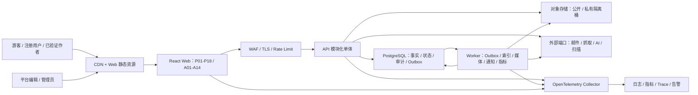
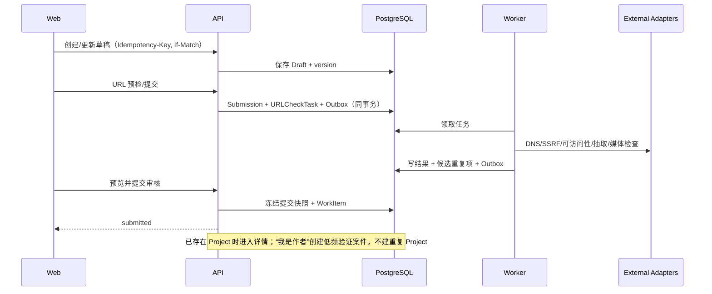

# VibeCheck 首期 MVP 技术实现方案

**版本：v1.0｜状态：已批准开发基线（WP-00）｜日期：2026-08-10**

## 1. 文档目的

本文把《VibeCheck 首期 MVP 开发级 PRD》v1.10、数据库设计、接口契约、状态机和后台管理规则组合为可执行的工程方案，明确系统边界、模块职责、运行拓扑、关键数据流、安全控制、研发工作包、质量门禁和上线顺序。

本文不修改已冻结产品需求，不把当前 React/Vite 原型视为生产实现，不指定尚未确认的云厂商、AI/抓取供应商或正式 SLA。本文与四份同版技术文档共同构成技术设计基线：

- `VibeCheck首期MVP数据库设计-v1.0.md`
- `VibeCheck首期MVP接口清单与契约-v1.0.md`
- `VibeCheck首期MVP状态机技术规格-v1.0.md`
- `VibeCheck首期MVP后台管理规则-v1.0.md`

## 2. 输入基线与适用范围

| 基线 | 标识 | 本文使用方式 |
| --- | --- | --- |
| 开发级 PRD | `docs/VibeCheck首期MVP开发级PRD-v1.10.md` | 产品范围、角色、页面、字段、规则、埋点、指标和验收的上位规范 |
| 技术复审 | `VibeCheck开发级PRD技术可实现性复审报告-v1.9.md` | V19-01—V19-05 的收口输入 |
| 代码基线 | Git HEAD `3c1c4ef54f1a24368ef9d2f25bc52432556ad488` | 识别可迁移的 React UI、路由和测试；不作为生产业务事实来源 |
| 当前运行事实 | React 19 + Vite 7 + TypeScript 前端原型 | 无生产后端、数据库、认证、搜索、抓取、对象存储、通知和 Analytics |
| 版本范围 | P01—P18、A01—A14、双 Category Schema | P19/P20 仅保留冻结 ID、路由和职责，不进入 P0 开发验收 |

## 3. 设计原则

1. **产品事实优先**：代码缺失不降低 PRD 要求；Mock 行为不得作为后端规则。
2. **模块化单体先行**：首期用一个可拆分的领域代码库和少量运行进程交付，不提前引入分布式事务和微服务治理。
3. **Schema/状态机驱动**：HTTP 契约、队列消息、领域命令和前端类型均从版本化 Schema 生成或校验。
4. **同步事实、异步副作用**：核心事实、Version、Event、审计摘要和 Outbox 同事务；搜索、媒体、通知和指标异步投影。
5. **默认拒绝**：后端鉴权、对象级 Guard、字段级脱敏和资源可见性缺一不可；按钮隐藏不构成权限控制。
6. **可恢复优先**：所有非只读操作均具有幂等、乐观锁、任务状态、失败原因和重试边界。
7. **不可覆盖历史**：公开事实变化产生 Version/Event；已发布分析版本和审核决定不可原位改写。
8. **先满足 P0**：不建立 DecisionRecord，不实现跨品类比较，不把 P1/P2 字段塞入首期表单。

## 4. 技术决策记录

| Decision ID | 决策 | 理由 | 约束/退出条件 |
| --- | --- | --- | --- |
| TD-ARCH-001 | 首期采用 TypeScript 模块化单体，部署为 Web、API、Worker 三类进程 | 与现有 TypeScript 团队资产衔接，减少首期跨服务事务和运维面 | 模块只通过公开 application port 互调；不得跨模块直接写表 |
| TD-ARCH-002 | PostgreSQL 为唯一业务事实库；对象二进制进入对象存储 | 关系约束、版本、审计、事务和结构化检索均需要强一致事实源 | Redis、搜索索引和数仓不得成为业务真相 |
| TD-ARCH-003 | API 采用 JSON Schema 2020-12 + OpenAPI 3.1 契约优先 | 同一 Schema 可用于运行时校验、文档、类型生成和契约测试 | 合并接口前必须通过 breaking-change 检查 |
| TD-ARCH-004 | 结构化检索/FTS 与 pgvector 语义召回在 PostgreSQL 内完成 P0 | 降低首期系统数量，并保证过滤、可见性先于相似度 | 压测不达标或索引规模超过阈值时按 ADR 迁独立搜索服务 |
| TD-ARCH-005 | 业务副作用使用 Transactional Outbox；消费侧使用 Inbox/去重键 | 避免数据库提交成功而通知、索引、媒体任务丢失 | 不承诺 exactly-once；领域结果必须实现 effectively-once |
| TD-ARCH-006 | P0 采用邮箱一次性验证码 + 安全 Cookie 会话；后台敏感操作要求邮箱验证码短时再认证 | 避免浏览器持有长效 bearer token，满足已批准登录方式和高风险操作规则 | 邮件发送 adapter 可替换；验证码单次、10 分钟、5 次错误失效 |
| TD-ARCH-009 | 最快部署基线采用 Render Singapore Blueprint：Static Web + API + Worker + 托管 PostgreSQL 18 | 一个 IaC 文件可创建多运行单元和数据库，保留后台 Worker 与 pgvector 能力 | 生产备份/RPO/RTO、邮件/对象存储供应商仍须上线前冻结 |
| TD-ARCH-007 | Analytics Bridge Snapshot 和 Metric Version 为独立资源 | 修复 v1.9 V19-04；读取无副作用，构建/发布有明确控制面 | 已发布版本不可覆盖；发布需独立管理员确认 |
| TD-ARCH-008 | 复检 `apply` 是 Version 的合法第三分支 | 修复 v1.9 V19-01，保证任何公开事实修改均可追溯 | 必须先回写 PRD 和固定契约用例 |

技术候选基线为 Node.js 24 LTS、Fastify 5、PostgreSQL 18、pgvector 和 OpenTelemetry。正式开发在首次锁文件/镜像冻结时选择各自受支持的安全补丁版本，不使用浮动 `latest`。Node.js 官方发布表、PostgreSQL 当前发布文档、Fastify TypeScript/Schema 文档、OpenAPI 与 JSON Schema 规范、pgvector 官方仓库和 OpenTelemetry JavaScript 文档分别作为版本与能力依据：

- <https://nodejs.org/en/about/previous-releases>
- <https://www.postgresql.org/docs/current/release.html>
- <https://fastify.dev/docs/latest/Reference/TypeScript/>
- <https://spec.openapis.org/oas/>
- <https://json-schema.org/draft/2020-12>
- <https://github.com/pgvector/pgvector>
- <https://opentelemetry.io/docs/languages/js/>

## 5. 总体架构



### 5.1 运行单元

| 运行单元 | 职责 | 扩缩容键 | 不承担 |
| --- | --- | --- | --- |
| Web | P01—P18、A01—A14 UI，路由、缓存、表单、埋点发送 | 静态 CDN；无状态 | 产品事实持久化、权限裁决 |
| API | HTTP 契约、认证、授权、命令/查询、事务、Outbox | 请求率、P95、连接池占用 | 长时抓取、转码、指标重算 |
| Worker | Outbox 消费、媒体扫描、抓取、索引、通知、指标任务 | 队列积压、任务时长；按 worker type 独立扩容 | 对外同步 API |
| Migration Job | 版本化数据库迁移和校验 | 单实例、部署前后受控执行 | 运行期业务请求 |
| Scheduled Job | 状态监测、过期任务、迟到事件、清理与对账 | 单调度租约 | 直接覆盖领域终态 |

首期可由同一镜像按启动命令运行 API/Worker，但必须使用独立进程、独立服务账户、独立资源限额和独立健康检查。

## 6. 领域模块边界

| 模块 | 主要实体/能力 | 对外 Port | 禁止耦合 |
| --- | --- | --- | --- |
| `identity-access` | User、Session、Role、CreatorMembership、step-up | authenticate、authorize、session continuation | 不读取 UI 按钮状态推断权限 |
| `catalog` | Project、Version、Creator、Event、Asset、Relation、Evidence | project command/query、version publish | 不保存审核工作队列 |
| `publishing` | Submission、Draft、URL Check、Extraction、Review | submit、preview、review decision | 不直接覆盖 Project current fields |
| `ownership` | Verification、Ownership Case、Party、Evidence | open/withdraw/appeal/decide | 鉴权不依赖 `party_roles[]` 投影文本 |
| `community` | Favorite、Like、Follow、Comment、Notification | set interaction、moderate comment | 计数不以客户端增减值为准 |
| `comparison` | Comparison、Item、Dimension View、Save | add/remove/view/save/complete | 不创建 DecisionRecord，不跨品类 |
| `search` | Query、Intent、Snapshot、Candidate、Ranking | parse、search、similar analysis | 不输出商业成功或竞争强度结论 |
| `media` | Upload、Asset Blob、Scan、Derivative、Delete Saga | upload intent、finalize、serve | 私密身份材料不得进入公开桶 |
| `analytics` | Client Ingest、Bridge Snapshot、Metric Version | ingest、build、recompute、publish | GET 不建资源，不写分析版本 |
| `admin-ops` | WorkItem、Preview/Confirm/Execute、Config、Audit View | queue、high-risk operation | 不绕过领域 Guard |
| `notification` | Preference、Delivery、Read State | enqueue、deliver、set read | 不阻塞业务主事务发送站外消息 |

模块内部使用 `domain → application → infrastructure → transport` 单向依赖。跨模块同步调用只允许 application port；跨模块异步传播使用版本化领域事件。Repository 实现不得暴露给其他模块。

## 7. 推荐代码组织

```text
apps/
  web/                 # React 前台与后台壳；按路由拆包
  api/                 # Fastify bootstrap、HTTP adapter、health/readiness
  worker/              # Outbox dispatcher 和按任务类型注册的消费者
packages/
  contracts/           # OpenAPI、JSON Schema、生成类型、错误码、事件 Schema
  domain/              # 领域模块；不得依赖 Fastify/React/数据库驱动
  application/         # command/query handlers、ports、transaction coordinator
  infrastructure/      # PostgreSQL、对象存储、邮件、AI、抓取、通知 adapter
  observability/       # trace、metric、structured log、redaction
  config/              # 分层配置、feature flag、启动校验
  testing/             # fixture builders、contract harness、fake adapters
db/
  migrations/          # append-only migration
  verification/        # 约束、索引、RLS、回滚前置检查
docs/
  adr/                  # 架构决策记录
  runbooks/             # 告警与恢复手册
```

当前仓库迁移时先建立上述边界，再把可沿用页面组件迁入 `apps/web`。不得先复制 Mock 数据访问层，再把它包装成生产 API。

## 8. 契约优先实现

### 8.1 单一契约源

- `packages/contracts/openapi/v1.yaml` 是 HTTP Operation、路径、状态码和安全方案的规范源。
- `packages/contracts/schemas/*.schema.json` 是 DTO、事件、Category Schema 和埋点输入的规范源。
- TypeScript 类型由 Schema 生成；领域对象不得直接作为 HTTP 响应序列化。
- API 启动时编译请求/响应 Schema；生产响应也执行采样或全量校验，比例由性能测试决定。
- 前端 API client 从 OpenAPI 生成基础调用层；业务 hook 只封装缓存、状态和错误映射。

### 8.2 兼容规则

| 变更 | v1 内允许性 | 处理 |
| --- | --- | --- |
| 新增可选响应字段 | 允许 | 客户端忽略未知字段；更新契约快照 |
| 删除/重命名字段 | 禁止 | 新版本或 expand/deprecate/contract |
| 改必填、枚举删值、缩小长度 | 禁止 | 新版本与迁移窗口 |
| 增加枚举值 | 条件允许 | 客户端必须有 unknown fallback；先做兼容测试 |
| 改状态迁移语义 | 禁止静默修改 | ADR + PRD/状态机回写 + 合同版本 |
| 事件 payload 变化 | 仅向后兼容新增 | 保留 `event_schema_version` 和旧消费者回放测试 |

### 8.3 请求处理顺序

`request_id → 路由 Schema → 身份解析 → CSRF/来源检查 → RBAC → 对象级 Guard → 幂等预检 → command handler → transaction → response Schema → 审计/Trace`。

查询请求不得创建业务资源。命令成功但客户端断线时，客户端以相同 `Idempotency-Key` 重试并取得原结果。

## 9. 核心数据流

### 9.1 公开读取

1. Web 请求 Project/List/Search DTO；API 从公开投影读取。
2. API 始终追加 `publication_status=published`、访问状态和 Category 权限过滤。
3. `ETag` 来自投影版本或稳定内容哈希；相同条件支持 `If-None-Match`。
4. 已下架/合并对象返回稳定错误和 canonical successor，不把内部审核原因暴露给无权限用户。
5. 图片 URL 为短期签名或 CDN 派生地址；失败按媒体规则降级。

### 9.2 发布与作者关联



人工审核通过时，ReviewDecision、Project/Version/Event、WorkItem、审计摘要和 Outbox 同事务。外部通知、索引和媒体派生在提交后异步执行。

### 9.3 作品更新与复检

- 作者提交更新时冻结 `base_project_version` 和更新快照；审核期间公开 Project 仍指向旧 Version。
- `apply` 先校验任务 Project、base Version、当前 Version 与 ReviewDecision 一致，再在一个事务中写新 Version、Project pointer、Event、Task/WorkItem 终态和 Outbox。
- 任一前置版本不一致返回 `409 VERSION_CONFLICT`，不进行部分写入；后台需重新预览差异。
- 访问异常产生 RecheckTask；只读详情 GET 不触发复检写入，监测由异步调度任务负责。

### 9.4 Ownership 案件

- `party_roles[]` 仅是当前用户相对案件的排序去重展示投影，固定顺序为 `opened_by, appealed_account, relation_principal, evidence_submitter`。
- 后端每次从 Case opener、Appeal、Relation 和 Evidence 来源事实计算 `allowed_actions`。
- `opened_by` 可在裁决前撤回；`appealed_account`/`relation_principal` 可补证据；仅 `evidence_submitter` 只能查看自己提交的材料和允许公开的案件摘要。
- 私密材料读取必须产生独立审计记录，并使用私有存储签名 URL；URL 有效期和可下载性受 TBC-012 确认。

### 9.5 比较与创作推进

- 匿名比较使用服务端签名的 `anonymous_comparison_id` Cookie 或会话映射，不把完整比较事实只存 localStorage。
- 添加作品前校验 2—5 数量上限、同品类、公开可访问、非重复；重复加入返回原列表并标记 `duplicate=true`，不新增行。
- 登录时以服务器事务合并匿名与账户比较；同 Project 去重，超过 5 项按“已登录原项优先、匿名项按首次加入时间”保留，响应列出被舍弃项。
- `comparison_completed` 由服务端基于 2—5 个有效作品、四个不同维度组、累计可见停留不少于 30 秒计算并只触发一次。
- 保存比较、打开复用资产、进入发布和提交/更新作品是“推进动作”；不得创建或上报 `decision_submitted`。

### 9.6 Analytics 控制面

1. 浏览器只发送 `BatchEnvelope.v1` 中的 `ClientAnalyticsInput.v1`；不得发送可信 `user_id`、角色、环境、consent 或接收时间。
2. Collector 校验 origin/session 二选一、事件判别联合、批量限制和客户端时钟后，从会话与服务配置派生受保护字段。
3. 合法事件写入接收事实和 Outbox；逐项返回 accepted/duplicate/rejected，不因单项失败重发整个已接收批次。
4. Bridge Snapshot 使用 POST build 创建 `building` 资源；完成后由独立管理员 POST publish。GET 永远只读。
5. Metric Recompute 明确引用已发布 Snapshot、formula version、event watermark 和窗口；发布后版本不可覆盖。

## 10. 数据一致性与并发

### 10.1 事务规则

| 场景 | 同事务写入 | 异步副作用 |
| --- | --- | --- |
| 发布/更新/复检 apply | Decision、Version、Project pointer、Event、WorkItem、Audit summary、Outbox | 索引、通知、媒体刷新 |
| 互动设态 | Interaction 唯一行、计数投影版本、Outbox | 推荐/通知 |
| 比较合并 | Comparison、Items、merge result、Outbox | 埋点桥接 |
| 高风险后台操作 | Operation、Confirmations、领域变更、Audit、Outbox | 导出/通知/重建投影 |
| 评论裁决 | ReviewDecision、Comment state、WorkItem、Audit、Outbox | 通知、计数修正 |

### 10.2 并发控制

- 用户可编辑聚合使用 `If-Match`/`version` 乐观锁；失配返回当前版本摘要和可重试标记。
- 审核领取使用数据库行级原子条件更新或 `FOR UPDATE SKIP LOCKED`，租约过期可回收。
- 幂等记录的唯一键为 `actor_scope + operation_id/idempotency_key + operation_name`；相同键不同请求哈希返回冲突。
- 互动使用最终状态命令与唯一约束，不接收“计数 +1/-1”；计数由事实行变化计算。
- Outbox 以 `event_id` 唯一；Inbox 以 `consumer_name + event_id` 唯一；失败重试不得重做领域写入。

### 10.3 一致性目标

公开详情、当前 Version、权限和审核结果为强一致；搜索、通知、媒体派生、展示计数和分析指标为最终一致。响应需在适用时返回 `projection_version`、`indexed_at` 或 `data_freshness_at`，不得把旧投影视为提交失败。

## 11. 搜索、查同类与排序实现

### 11.1 查询流水线

`输入净化 → 模式识别 → 意图解析 → 低置信确认 → Category 约束 → 结构化过滤 → 关键词召回 → 语义召回 → 去重 → 规则排序 → 匹配理由 → 结果快照`。

### 11.2 P0 实现

- Project 可见投影建立规范化 title/summary/tags/category_data 受控字段和 `tsvector`；Category Schema 指定可检索字段，不对全部 JSONB 盲目索引。
- 语义向量只保存已发布、允许检索的文本快照；每条向量携带 model/version、dimension、source_hash 和 embedding status。
- 结构化 Guard 先剔除非公开、下架、类别不符和权限不匹配项，再计算 FTS/向量得分。
- 精确匹配与相邻结果分栏；精确结果少于 3 时补相邻结果但不伪装为精确结果。
- 匹配理由只能引用真实字段、规则命中和证据摘要；不生成“市场空白”“竞争激烈”“商业成功概率”等结论。
- 同类分析以快照计算，保存 query_id、parser version、ranking version、feature values 和候选集合哈希，保证验收可重放。

### 11.3 降级

| 失败 | 降级行为 | 前端提示/记录 |
| --- | --- | --- |
| 意图解析超时 | 回退关键词搜索并保留用户原词 | 标记“已使用关键词搜索”；记录 timeout |
| 低置信字段 | 进入 P06 意图确认；不隐式填充 | 展示原值、候选值和置信标记 |
| embedding 不可用 | 仅 FTS + 结构化排序 | 结果可用；响应 `semantic_degraded=true` |
| 排序超时 | 返回已过滤的确定性基础排序 | 记录 ranking timeout，不返回随机顺序 |
| 零结果 | 返回可删除筛选项和相邻建议 | 明确“未找到已收录结果”，不判断需求不存在 |

语义模型、正式权重、评估集、上线阈值和调参责任人受 TBC-003/TBC-007 约束；确认前只允许在测试环境用可替换 adapter。

## 12. URL 抓取与安全边界

### 12.1 URL 规范化

- 仅接受 `http/https`；禁止凭据、非标准控制字符、超长 host/path 和不支持端口。
- host 使用 IDNA 规范化，scheme/host 小写，移除默认端口和 fragment；query 仅按产品批准规则移除追踪参数，不擅自排序有语义参数。
- 每次重定向均重新解析、DNS 查询和地址分类；任一目标为 loopback、link-local、私网、保留地址、云 metadata 或不允许端口即终止。
- canonical URL 和规范化哈希用于查重，但保留用户提交原 URL 和重定向链审计。

### 12.2 抓取资源限制

抓取进程位于隔离网络和最小权限账户，无数据库直连；通过任务 API/队列领取请求并返回受限结果。必须设置 DNS/连接/首字节/总时长、重定向次数、响应体字节数、MIME、压缩比和并发上限。HTML 净化后再抽取；脚本不在主 API 运行。

P0 不实现 JS 渲染和自动截图。robots、版权合规、安全供应商及正式超时/字节阈值仍属于 TBC-004；确认前不开放生产外网抓取。自动提取失败不得阻止用户手工完成必填字段，但安全校验失败必须阻止提交。

## 13. 媒体与私密材料

### 13.1 上传流程

1. 客户端请求 upload intent，服务端校验业务用途、MIME、大小和配额。
2. 服务端生成短效单次上传凭证与 `upload_id`；客户端直传隔离暂存区。
3. 客户端 finalize；Worker 校验实际 MIME、哈希、尺寸、病毒/恶意内容并生成派生物。
4. 扫描通过后原子更新 Asset 状态；公开媒体进入可发布区，私密材料保持专用桶和专用密钥。
5. 引用计数归零只创建删除 Saga；对象删除成功后写墓碑和审计，不静默丢失引用。

### 13.2 展示失败

- 图片加载失败显示固定占位图并仅重试一次；视频失败显示封面、错误码和“在原站查看”条件动作。
- 外链资源必须显示域名和离站提示；新窗口使用 `noopener,noreferrer`。
- 媒体处理中的 Asset 返回 `processing`，不得返回永久 404；扫描拒绝和无权限使用不同错误码。

## 14. 认证、授权与安全

### 14.1 会话与回跳

- 浏览器会话使用 `Secure; HttpOnly; SameSite=Lax` Cookie；敏感命令叠加 CSRF token 和 Origin 校验。
- 登录前服务端签发一次性 continuation，绑定 session、允许的内部路径、动作类型、payload hash 和过期时间。
- 登录成功后服务端消费 continuation 一次；只允许站内白名单路由，禁止开放重定向。
- 游客触发收藏/关注等受限动作时只记录待回放的最终状态命令；登录后至多回放一次，并返回实际结果。

### 14.2 鉴权层次

`认证状态 → 全局角色 → 后台 capability → 资源可见性 → 对象关系 → 当前状态 → 字段级策略 → 高风险再认证/双人确认`。

所有修改接口必须在 application handler 内执行上述 Guard；数据库 RLS 只作为深度防御，不代替领域鉴权。平台编辑和管理员没有通用“绕过所有 Guard”能力。

### 14.3 安全控制

| 风险 | 控制 |
| --- | --- |
| SSRF | 隔离抓取、逐跳 DNS/IP 校验、端口/协议白名单、metadata 阻断、资源上限 |
| XSS | 富文本白名单净化、输出编码、CSP、禁用任意 HTML、外链隔离 |
| CSRF | SameSite Cookie、CSRF token、Origin 校验；只读 GET 无副作用 |
| IDOR | 对象级 Guard、opaque ID、最小 DTO、负向权限测试 |
| 上传攻击 | 暂存隔离、实际 MIME/哈希/压缩比检测、恶意内容扫描、不可执行存储 |
| 凭据泄露 | Secret manager、短期凭据、日志脱敏、禁止在前端构建变量放私钥 |
| 越权后台操作 | capability、step-up、双人确认、乐观锁、不可删除审计 |
| 隐私材料泄露 | 专表/专桶/专密钥/专服务账户、短效 URL、每次读取审计 |
| 供应链 | 锁文件、依赖审计、SBOM、镜像签名、最小基础镜像、固定 action 版本 |

## 15. 前端实现方案

### 15.1 应用壳与路由

- 保留 P01—P20 冻结 Page ID；本版实现 P01—P18，后台实现 A01—A14。
- 前台、后台共享认证和设计 token，不共享具有业务权限含义的按钮组件默认配置。
- 路由级 lazy loading；搜索、比较、发布、后台大型编辑器进一步按功能拆包。
- 每个 Page module 只通过 typed query/command client 访问 API；禁止生产路径导入 Mock fixture。

### 15.2 状态分层

| 状态 | 存放 | 规则 |
| --- | --- | --- |
| 服务端事实 | Query cache | 以资源 key/ETag/version 更新；mutation 成功按返回值定向更新 |
| 表单草稿 | Server draft + local encrypted/limited cache | 服务端为跨设备事实；本地只做断网恢复，不含私密材料 |
| URL 筛选/排序 | URL query | 返回后可恢复、可分享；游标不作为永久链接 |
| 比较栏 | Server Comparison + anonymous signed id | 页面切换保留；登录合并由服务端决定 |
| 登录回跳 | Server continuation | 一次性、短期、站内路径；不信任 raw return_to |
| UI 瞬时状态 | Component/store memory | Modal、展开、焦点等；不得代替业务事实 |

### 15.3 原型迁移清单

1. 删除/隔离运行期 Mock 数据层，建立生成型 API client 和统一错误映射。
2. 把本地假登录替换为真实会话、continuation 和后端权限摘要。
3. 将 Comparison 中的 DecisionRecord、显式决策表单和 `decision_submitted` 从 P0 路径移除。
4. 补齐 `portfolio.v1` 冻结字段与 Category Schema 渲染器，Learning 专属字段从 Project 固定槽位迁到 `category_data`。
5. 把收藏、点赞、关注、已读改为 set-state 命令；实现乐观更新、失败回滚和服务端实际计数覆盖。
6. 建立全局 Loading/Empty/Error/Toast/Modal/Confirm/404/网络状态组件并绑定标准错误码。
7. 补齐缺失后台路由；A08 占位页不得计入完成。
8. 为 P01—P18 路由建立 bundle、可访问性、错误态和 API 合同测试。

## 16. 后端实现模式

### 16.1 Command/Query

- Command 输入包含 actor、operation ID、expected version 和已校验 DTO；handler 返回明确领域结果，不返回 ORM 实体。
- Query 读取专用投影 DTO；后台查询默认带 scope、分页、排序和导出限制。
- 领域实体封装状态迁移；transport/controller 不直接 UPDATE 状态字段。
- 所有外部供应商通过 port/adapter；领域和 application 测试使用 deterministic fake。

### 16.2 Worker

| Worker type | 输入 | 成功输出 | 重试/终止 |
| --- | --- | --- | --- |
| outbox-dispatch | 未发布 Outbox | 发布记录/下游消息 | 指数退避；超过阈值进入 dead letter 并告警 |
| crawler | URLCheck/Extraction task | 访问、安全、重定向和抽取结果 | 仅瞬时错误重试；策略拒绝不重试 |
| media | upload finalize/delete task | scan/derivative/delete state | 同 blob hash 幂等；恶意内容终止 |
| search-index | Project/Event Outbox | projection/index watermark | 按 project_id 合并旧任务；版本倒退拒绝 |
| notification | Notification Outbox | delivery attempt/result | 按渠道策略；业务事务不回滚 |
| analytics | ingest/build/recompute | accepted event/snapshot/metric version | 已发布版本不可覆盖；水位 CAS |
| monitor | schedule lease | RecheckTask/expire command | 领导者租约；同资源同检查窗去重 |

## 17. 缓存与性能

- CDN 只缓存公开、非个性化 GET；缓存键包含路径、规范 query、语言和 schema/version，不包含 Cookie 全量值。
- API 公开 DTO 使用短缓存和 ETag；权限化/后台响应默认 `private, no-store`。
- 首期不强制 Redis。若压测证明数据库热点、限流或短租约需要 Redis，须建立 ADR、失效策略和故障降级；Redis 不保存唯一事实。
- PostgreSQL 连接池按实例和数据库上限反推，不以默认值上线；长任务不得占用 API 连接。
- 列表使用稳定 keyset cursor；禁止高页码 offset 扫描。
- 媒体经 CDN 自适应尺寸；首屏图片声明尺寸、懒加载非首屏资源，视频不自动下载完整文件。

性能验收以 PRD 各页/NFR 指标为准。测试报告至少分解客户端、边缘、API、数据库和外部依赖耗时，并分别报告冷/热缓存、P50/P95/P99、错误率和样本量。

## 18. 可观测性与审计

### 18.1 Telemetry

- Trace：入口 request、SQL、Outbox publish/consume、外部 adapter、关键状态迁移；异步消息传播 `traceparent`。
- Metric：吞吐、延迟、错误、连接池、队列积压/最老年龄、任务成功率、索引水位、抓取拒绝类型、媒体处理、通知失败、分析迟到事件。
- Log：结构化 JSON，含 timestamp、level、service、environment、request_id、trace_id、operation_id、actor_type、resource_type/id hash、error_code；禁止明文 token、Cookie、验证材料和完整敏感 URL query。
- Web：业务埋点与运维 telemetry 分离；浏览器实验性自动探针不得替代手工定义的 Web Vitals 和错误边界采集。

### 18.2 审计

审计记录至少包含 actor、capability、资源前后版本/哈希、reason code、confirmers、request/operation/trace ID、IP/UA 摘要和结果。修改公开事实、删除、合并、历史事件、身份争议、私密材料读取、配置发布、指标版本发布均不可缺失审计。

日志和审计用途不同：应用日志可按保留策略轮转；审计不可由普通运行账户修改或删除。正式保留期和归档介质受 TBC-006/TBC-012 约束。

## 19. 配置、Feature Flag 与版本

| 配置类型 | 例子 | 管理规则 |
| --- | --- | --- |
| 启动必需 | DB DSN、对象存储 endpoint、邮件发送凭据 | Secret manager 注入；缺失时生产启动失败，local/test 使用显式 fake adapter |
| 运行安全阈值 | 上传大小、抓取并发、批量事件上限 | 版本化配置；上下限硬编码保护；后台发布需审计 |
| 产品字典 | Category、Evidence type、Relation type | A06/A07 管理；有效期和引用检查；不通过环境变量修改 |
| 排序/模型版本 | parser/ranker/embedding/formula version | 不可变版本资源；灰度指针单独发布 |
| Feature flag | 新 adapter、降级开关、只读模式 | owner、环境、过期日、默认值、回滚计划必填 |

Feature flag 不得绕过权限、审计、字段校验或冻结产品范围。紧急 kill switch 只能关闭风险能力或切换安全降级，不创建隐藏功能。

## 20. 部署拓扑与环境

### 20.1 环境

| 环境 | 数据 | 外部依赖 | 用途 |
| --- | --- | --- | --- |
| local | 合成 fixture | fake/sandbox | 单元与组件开发 |
| test/CI | 每次隔离数据库 | deterministic fake | 迁移、合同、集成、E2E |
| staging | 脱敏/合成，不复制私密材料 | 供应商 sandbox | 发布候选、压测、演练 |
| production | 真实数据 | 生产 adapter | P0 服务 |

任何环境都不得共享会话密钥、对象桶、数据库账户或 webhook secret。测试/预发布不得连接生产写端点。

### 20.2 生产候选拓扑

- Render Singapore Blueprint 统一声明静态 Web、API Web Service、Background Worker 与 PostgreSQL 18；API/Worker 共享镜像/代码但使用独立启动命令、服务账户和资源限额。
- Web 使用全球 CDN；API/Worker/数据库同为 Singapore 区并使用私网连接。托管 PostgreSQL 的精确实例、HA、RPO/RTO、备份周期和跨区策略在 TBC-006 剩余项冻结。
- 公开媒体、私密材料和暂存区使用独立桶/前缀、密钥与服务账户。
- WAF/CDN 终止 TLS；API 只接受受信边缘或内部入口。
- Worker 按 crawler/media/analytics/notification 隔离资源与网络策略。

## 21. CI/CD 与供应链门禁

### 21.1 Pull Request 门禁

1. format/lint/typecheck；禁止新增未解释的 warning。
2. unit/component tests；变更行和关键领域分支覆盖率达到仓库冻结阈值。
3. JSON Schema/OpenAPI 校验、Operation ID 唯一、生成类型无未提交差异。
4. API breaking-change 检查和消费者契约测试。
5. 数据库迁移在空库、前一发布快照和代表性数据集上执行；约束/索引验证通过。
6. 状态机固定表、负向权限、幂等/并发和审计断言通过。
7. secret、依赖、许可证、SAST 和容器扫描；高危无已批准例外不得合并。
8. Web bundle budget、路由冒烟、可访问性和基础性能检查。

### 21.2 发布门禁

- 生成 SBOM、签名不可变镜像并记录 Git SHA、PRD SHA、Schema/迁移版本。
- 先执行兼容性 expand migration，再部署向后兼容应用；破坏性 contract 只在观察窗后执行。
- staging 完成核心旅程、权限、迁移、回滚、队列积压和故障注入演练。
- 生产先 canary/小流量，监控错误率、P95、数据库、队列和业务成功口径，再分批扩大。
- 数据迁移后若无法安全回滚，应用回滚改为 roll-forward；运行手册必须事先注明。

## 22. 测试策略

| 层级 | 必测内容 | 主要执行点 |
| --- | --- | --- |
| Unit | 领域 Guard、状态迁移、排序规则、URL 规范化、计数变化 | 每次 PR |
| Schema/Contract | 138 个 PRD Operation + 8 个分析控制面 Operation、错误码、事件判别联合 | 每次 PR |
| Integration | PostgreSQL 约束/事务、Outbox/Inbox、对象存储和 adapter contract | 每次 PR/夜间 |
| Component | P01—P18/A01—A14 Loading/Empty/Error/权限/交互 | 每次 PR |
| E2E | 广场→详情→互动→搜索→比较→复用→推进→发布→回流 | 发布候选 |
| Security | IDOR、CSRF、SSRF、XSS、上传、step-up、双人确认、私密材料 | 发布候选/定期 |
| Concurrency | 重复提交、同键异载荷、版本冲突、并发审核、匿名合并 | 发布候选 |
| Performance | 列表/详情/搜索/写入、抓取/媒体/指标队列、长稳 | 里程碑/发布候选 |
| Recovery | DB 恢复、对象删除 Saga、Outbox 重放、供应商降级、回滚/前滚 | 上线前演练 |

测试 fixture 必须同时覆盖 `learning.v1` 和 `portfolio.v1`、各状态终态、下架/合并、过期 continuation、五种角色及无角色账户。任何权限测试至少包含一个允许和一个拒绝断言。

## 23. 研发工作包与依赖

| Work Package | 范围 | 前置 | 完成定义 |
| --- | --- | --- | --- |
| WP-00 基线冻结 | PRD v1.10 回写、五份技术文档评审、TBC owner | 无 | V19-01—04 决策已批准；版本文件/Git/PRD SHA 基线记录提交 |
| WP-01 工程底座 | monorepo、contracts、API/Worker、DB migration、CI、observability | WP-00 | 健康检查、首个 migration、Schema 生成、部署到 test |
| WP-02 身份与通用能力 | session、continuation、RBAC/Guard、错误、Outbox、对象存储 | WP-01 | 五角色正负向测试、幂等、审计和媒体最小闭环 |
| WP-03 目录与发现 | Project/Version/Creator/Event/Asset/Evidence/Relation、P01—P09、搜索/比较 | WP-02 | 双品类公开读取、搜索降级、同品类比较和完成口径通过 |
| WP-04 供给与身份 | P10—P13、发布、更新、审核、验证/争议、URL/抽取 | WP-03、抓取安全门 | 发布到回流、复检 apply、Ownership 权限用例通过 |
| WP-05 社区与个人 | P14—P18、Interaction、Comment、Notification | WP-02/03 | 幂等计数、评论审核、站内通知和登录回放通过 |
| WP-06 运营后台 | A01—A14、队列、高风险操作、配置、指标控制面 | WP-03/04/05 | 所有后台路由、双人确认、导出、审计和 A13 版本资源通过 |
| WP-07 上线准备 | 迁移、压测、安全、恢复、监控、数据初始化、runbook | WP-01—06 | 上线清单全部有证据；无阻断级开放风险 |

工作包可在前置契约冻结后并行，但公共表、状态枚举和错误码由对应模块 owner 管理，不允许多分支各自定义同名事实。

## 24. 分阶段迁移

### Phase 1：隔离原型与建立真实骨架

- 保持现有原型可运行，新增生产目录和 contracts；用 feature flag 切换真实 API。
- 建立数据库空库迁移、fixture、会话、错误包络、request/trace/operation ID。
- 建立 CI 质量门禁，不改变冻结页面职责。

### Phase 2：读路径先行

- 导入受控种子字典和合成/审核过 Project 数据。
- 实现 P01—P09 的公开投影、搜索、详情和比较；对照原型视觉与最终原型验收。
- 搜索索引支持重建、水位和降级，不依赖写路径临时 Mock。

### Phase 3：写路径与后台闭环

- 实现发布、更新、验证、Ownership、互动和通知。
- 同步实现对应 A01—A14 工作队列，不上线“有前台提交、无后台处理”的半闭环。
- 高风险操作必须走 Preview/Confirm/Execute，不开放直接数据库修数作为常规流程。

### Phase 4：可观测与生产硬化

- 端到端埋点校验、Bridge Snapshot/Metric Version、指标回算和发布。
- 性能、安全、恢复、供应商故障、Outbox 重放与数据对账演练。
- 移除生产构建中的 Mock/实验路由和 `decision_submitted` 发送路径。

## 25. 上线、回滚与运维

### 25.1 上线前必须成立

- 所有数据库 migration、Schema、镜像、配置、Category/证据字典均有不可变版本和哈希。
- P01—P18、A01—A14 路由不存在占位页面；P19/P20 不出现在 P0 导航和验收集合。
- 138 个 PRD Operation 与 8 个分析控制面 Operation 均有服务端实现或明确“不产生/已废弃”的合同状态。
- 发布、复检、Ownership、合并、删除、历史编辑和指标发布均有审计与失败恢复证据。
- `decision_submitted` 在客户端、API、事件 Schema 和指标任务中均不可产生。
- 监控、告警路由、值班联系人、runbook、RPO/RTO 和数据保留期已确认。

### 25.2 回滚

- Web 静态资源保留上一版本并可切回；API 至少兼容前一 Web 合同观察窗。
- 应用使用 canary 回滚；数据库遵循 expand/contract，禁止在同一发布立即删除旧列/旧枚举。
- 队列消费者回滚前验证旧版本能忽略新可选字段；不兼容事件需双消费者过渡。
- 已产生的新 Version/审核决定/审计不因应用回滚而删除；使用补偿命令或 roll-forward。

### 25.3 对账任务

每日或按确认频率对账：Project current pointer 与 Version、Interaction 事实与计数、Outbox/Inbox、搜索水位、Asset 引用与 blob、WorkItem 与领域状态、通知发送、Analytics 水位/版本。发现差异创建受审计修复任务，不由对账脚本直接静默改公开事实。

## 26. 技术风险与缓解

| Risk ID | 风险 | 影响 | 缓解/门禁 |
| --- | --- | --- | --- |
| R-01 | PRD 未回写 V19-01—04 | 合同和实现可能分叉 | WP-00 阻断对应开发；联合评审固定用例 |
| R-02 | 双品类字段迁移不完整 | Portfolio 丢字段、Learning 固化继续扩散 | Category Schema 合同、双 fixture、旧固定字段只读迁移 |
| R-03 | 抓取形成 SSRF/合规风险 | 内网访问、法律和成本风险 | 隔离 worker、逐跳校验；TBC-004 未确认不开放生产抓取 |
| R-04 | 搜索/AI 质量不可测 | 同类结果不可验收 | 固定评估集、版本快照、降级；TBC-003/007 上线门禁 |
| R-05 | 高风险后台操作直接修数 | 公开事实和审计失真 | Preview/Confirm/Execute、双人、Version/Event、DB 最小权限 |
| R-06 | Analytics 身份边界错误 | 指标污染/隐私泄露 | 精确 ClientAnalyticsInput、服务端派生身份、Bridge 版本资源 |
| R-07 | 当前原型被误判为已实现 | 工作量和上线风险被低估 | 生产路径禁止 Mock；按 A—E 追踪和 WP DoD 验收 |
| R-08 | 模块化单体退化为跨模块 SQL | 难拆分、Guard 绕过 | schema ownership、Repository 边界、架构测试和 code owner |
| R-09 | 异步积压导致投影陈旧 | 搜索/通知/指标延迟 | 水位、最老消息告警、合并任务、重放和背压 |
| R-10 | 未冻结备份/保留/SLA | 无法做生产验收 | TBC-006/012 必须在上线候选前关闭 |

## 27. 待确认事项与开发门禁

| TBC | 待确认事项 | Owner | 阻断范围 | 可先行工作 |
| --- | --- | --- | --- | --- |
| TBC-001 | 双品类首页权重、频道冷启动配额 | 产品/运营 | P01 生产排序 | 候选生成、配置结构、合成测试 |
| TBC-002 | P19/P20 最终优先级 | 产品 | 已关闭：不进入首期 P0 | 保留 Page ID/路由职责，不加入导航或验收 |
| TBC-003 | 语义解析/embedding 供应商、成本、SLA | 产品/技术/采购 | 生产语义能力 | adapter、fake、FTS 降级 |
| TBC-004 | robots/版权/生产抓取合规、安全供应商和资源阈值 | 法务/安全/技术 | 生产外网抓取 | P0 已排除 JS/截图；隔离架构、URL 规范化、sandbox fake 可开发 |
| TBC-005 | 邮件发送供应商与风控运营阈值 | 安全/技术 | 真实邮件送达 | 邮箱 OTP、Cookie/continuation 合同和 fake mail adapter 已冻结 |
| TBC-006 | Render 实例、备份、RPO/RTO、密钥和审计保留 | 技术/安全/运维 | 生产上线 | 区域/平台/PostgreSQL 18 已关闭；Blueprint、环境契约和演练框架可开发 |
| TBC-007 | 搜索评估集、阈值、权重和调参责任人 | 产品/算法/测试 | 搜索生产验收 | 快照、可解释特征、确定性基础排序 |
| TBC-008 | 站外通知渠道、重试期限 | 产品/运营/技术 | 已关闭首期范围：P0 不提供 | 站内通知和 Outbox 正常开发；未来另立项 |
| TBC-009 | 仓库外真人可用性证据 | 产品/设计 | 真人结论表述/相关门槛 | 自动化最终原型验收作为既有证据 |
| TBC-010 | v1.9 四项技术决策回写 | 产品/架构 | Recheck、Ownership、Analytics 合同冻结 | 评审技术候选、准备固定用例 |
| TBC-011 | 技术文件发布治理：文件名版本、Git SHA、PRD SHA | 产品/技术负责人 | 正式基线发布 | 使用本文日期与代码 SHA 暂存候选 |
| TBC-012 | 数据保留、隐私删除、私密材料下载和通知日志期限 | 法务/安全/产品 | 删除/归档生产验收 | 状态、Saga、策略接口和合成测试 |

“可先行工作”不等于可绕过阻断范围上线。TBC 关闭必须记录决定、日期、批准角色、受影响文档、Schema/配置版本和迁移动作。

## 28. 跨文档追踪

| 关注面 | 规范源 | 本文落点 | 开发证据 |
| --- | --- | --- | --- |
| 物理表、约束、索引、事务 | 数据库设计 v1.0 | 5、9、10、16 | migration、DB integration、约束查询 |
| 146 个 Operation、Schema、错误、幂等 | 接口清单与契约 v1.0 | 8、9、21、22 | OpenAPI diff、contract test、生成 client |
| 状态与迁移 Guard | 状态机技术规格 v1.0 | 6、9、10、22 | transition table tests、event assertions |
| A01—A14、高风险操作 | 后台管理规则 v1.0 | 6、14、16、23、25 | capability tests、Preview/Confirm/Execute E2E |
| 页面、字段、埋点、指标、验收 | PRD v1.10 | 2、7—25 | Requirement trace、E2E、analytics replay |
| V19-01—05 | 技术复审 v1.9 | 4、9、23、27 | 回写记录、发布清单、固定用例 |

## 29. 技术验收标准

### TA-01 架构边界

**Given** 任一模块需要改变其他模块拥有的实体，**When** 进行静态架构检查和代码评审，**Then** 只能通过公开 application port 或版本化事件完成，且不存在跨模块 Repository 引用或直接写表。

### TA-02 发布原子性

**Given** 发布/更新/复检裁决为 apply，**When** 在任一写入点注入数据库失败，**Then** Decision、Version、Project pointer、Event、WorkItem、Audit summary 和 Outbox 全部回滚；重试同 operation ID 至多形成一个结果。

### TA-03 查询无副作用

**Given** 任一 GET，特别是详情、监测、Bridge Snapshot 和 Metric Version 查询，**When** 连续调用，**Then** 除运维访问日志/trace 外不创建领域资源、不改变状态、不推进水位。

### TA-04 权限

**Given** 五种产品角色及无权限账户，**When** 调用全部写接口和后台敏感读取，**Then** 前端可见性与后端 Guard 均符合权限矩阵；直接构造请求不能绕过对象级/字段级限制。

### TA-05 契约

**Given** OpenAPI 和 JSON Schema 基线，**When** CI 执行，**Then** Operation ID 唯一、引用无悬空、生成类型无漂移、事件判别联合完整，breaking change 被阻断。

### TA-06 异步恢复

**Given** 数据库已提交而下游暂时不可用，**When** Worker 恢复并重放 Outbox，**Then** 索引/通知/媒体/指标达到目标状态且不重复领域结果；dead letter 有告警和人工恢复路径。

### TA-07 双品类

**Given** `learning.v1` 和 `portfolio.v1` fixture，**When** 完成发布、详情、搜索、同品类比较和更新，**Then** ProjectCore 与 category_data 均通过对应 Schema；Learning 专属字段不再要求固定 Project 列，Portfolio 冻结字段无缺失。

### TA-08 Analytics

**Given** 合法、重复、过期、篡改和混合结果 Batch，**When** Collector 接收，**Then** 受保护身份全部由服务端派生、逐项结果可重试；Snapshot/Metric 构建使用 POST，GET 只读，已发布版本不可覆盖。

### TA-09 原型清理

**Given** production build，**When** 扫描依赖和运行核心旅程，**Then** 不导入 Mock 事实源、不产生 `decision_submitted`、P19/P20 不进入 P0 路由验收、A08 等后台页面无占位实现被标记完成。

### TA-10 上线证据

**Given** 发布候选，**When** 执行 WP-07 检查，**Then** Git SHA、PRD SHA、Schema/迁移/镜像/配置版本、测试报告、安全扫描、压测、恢复演练、告警与 runbook 均可追溯且无阻断级开放项。

## 30. 实现方案自检表

| 检查项 | 结果 | 证据 |
| --- | --- | --- |
| 总体架构与运行单元 | 完成 | 第 5 章 |
| 模块边界与代码组织 | 完成 | 第 6—7 章 |
| 契约、幂等、错误与版本 | 完成 | 第 8、10 章；接口契约 v1.0 |
| 发布、更新、身份、比较、Analytics 数据流 | 完成 | 第 9 章 |
| 搜索/查同类及降级 | 完成 | 第 11 章 |
| URL/SSRF 与媒体安全 | 完成 | 第 12—13 章 |
| 登录、鉴权与高风险控制 | 完成 | 第 14 章；后台规则 v1.0 |
| 前端原型迁移 | 完成 | 第 15、24 章 |
| 后端/Worker 模式 | 完成 | 第 16 章 |
| 性能、可观测、审计 | 完成 | 第 17—18 章 |
| 配置、部署、CI/CD、测试 | 完成 | 第 19—22 章 |
| 工作包、迁移、上线/回滚 | 完成 | 第 23—25 章 |
| 风险与待确认门禁 | 完成 | 第 26—27 章 |
| 跨文档追踪与技术验收 | 完成 | 第 28—29 章 |
| v1.9 V19-01—04 收口 | 技术候选完成，待 PRD 回写 | TD-ARCH-007/008、第 9.3—9.6 节、TBC-010 |
| v1.9 V19-05 发布治理 | 规则完成，待正式签发 | 第 21、25、27 章，TBC-011 |
