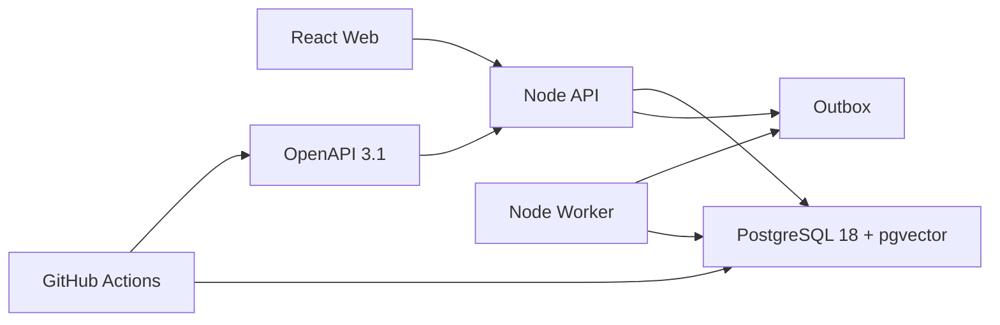

# WP-01：VibeCheck 首期 MVP 工程基础

**状态：已实现并进入自动验证｜日期：2026-08-10｜上位基线：PRD v1.10 / ADR-0001**

## 1. 交付边界

WP-01 建立可持续开发、测试和部署的工程底座，不声称业务页面已接入生产数据。交付物包括：

- npm workspaces：`config`、`contracts`、`database`、`observability`、`api`、`worker`；
- OpenAPI 3.1 契约检查器，以及平台存活/就绪接口的首份可执行契约；
- PostgreSQL 18、`pgcrypto`、`pg_trgm`、`vector` 扩展和 IAM/Outbox/Audit 首批迁移；
- API 进程、数据库就绪检查、标准错误包、请求 ID、结构化脱敏日志和优雅停机；
- Outbox Worker 的租约恢复、按处理器白名单领取、至少一次处理、指数退避和死信边界；
- 本地 PostgreSQL Compose、GitHub Actions 质量门和 Render Singapore Blueprint。

本工作包不包含邮箱供应商接入、业务领域接口、现有原型 Mock 替换、正式搜索索引或生产环境创建；这些在对应后续工作包中按已冻结契约实施。

## 2. 运行结构



API 只在 `/health/live` 返回进程存活；`/health/ready` 必须成功执行数据库探针后才返回 200。Render 的流量健康检查绑定 ready，而不是 live。

Worker 只领取已经注册处理器的 `event_name`。WP-01 尚无业务处理器，因此不会误领业务事件，但仍恢复已过期租约；后续模块以显式 handler map 接入。

## 3. 本地启动

前置条件为 Node `24.14.1` 和可运行 Docker Compose 的环境。

```powershell
Copy-Item .env.example .env
docker compose up -d postgres
npm ci
npm run db:migrate
npm run dev:api
```

另开终端运行：

```powershell
npm run dev:worker
npm run dev
```

验证地址：

- Web：`http://localhost:5173`
- API live：`http://localhost:3001/health/live`
- API ready：`http://localhost:3001/health/ready`

## 4. 迁移规则

- 文件名严格为六位递增序号加 snake_case；已进入共享环境的文件不可改写。
- Runner 以 SHA-256 校验已应用文件；同名内容变化直接失败。
- 全局 advisory lock 防止并发迁移；每个迁移单独事务提交。
- `npm run db:migrate` 可重复执行；第二次必须报告全部为 existing。
- Render 仅由 API 服务执行 `preDeployCommand`，避免 API 与 Worker 竞争迁移入口。
- 生产数据库禁止公网访问；Blueprint 的 `ipAllowList` 为空。

## 5. 质量门

每次进入 `main` 或 `codex/**` 的 push，以及所有 Pull Request，必须依次通过：

1. `npm ci`；
2. `npm run contracts:check`；
3. `npm run lint`；
4. `npm run typecheck`；
5. 原型测试 `npm test`；
6. 基础包测试 `npm run test:foundation`；
7. `npm run build`；
8. 在 PostgreSQL 18 + pgvector 上连续执行两次迁移并验证 migration head 为 2。

任何一步失败均阻断 Render 的 `checksPass` 自动部署。

## 6. Render 首次部署

`render.yaml` 一次创建静态 Web、API、Worker 和 PostgreSQL，区域为 Singapore。首次 Blueprint 创建时输入：

| 变量 | 服务 | 输入规则 |
| --- | --- | --- |
| `VITE_API_BASE_URL` | Web | API 实际 HTTPS 公网 URL，不带尾部 `/` |
| `WEB_ORIGINS` | API | Web 实际 HTTPS origin；多个值用英文逗号分隔 |

Blueprint 使用 PostgreSQL 18 `basic-256mb`、API/Worker `starter`。这是当前最快形成完整可部署拓扑的默认配置；正式容量、备份、恢复目标和费用批准仍按上线门执行，不能把首部署成功等同于生产放量批准。

## 7. 安全与失败边界

- `.env`、验证码、令牌、Cookie、邮件地址和完整敏感 URL 不进入 Git 或日志。
- API 不回显数据库就绪错误；未知路由使用冻结标准错误包。
- Outbox 领取使用 `FOR UPDATE SKIP LOCKED` 和 60 秒租约；第 8 次失败进入 dead letter。
- PostgreSQL 内网连接设置 `DATABASE_SSL=false`；公网数据库入口被 Blueprint 禁用。
- 邮箱 OTP 的代码、尝试次数和有效期已在产品基线及数据模型冻结，但发送供应商密钥仅在供应商决策后通过部署密钥注入。

## 8. WP-01 完成判据

- 六个 workspace 均能独立构建并通过类型检查；
- 平台 OpenAPI 无重复 Operation ID，所有 Operation 有响应定义；
- API 三类测试覆盖 live/ready、数据库失败和 404 标准错误；
- Worker 测试覆盖成功发布、失败重试和空 handler 安全行为；
- 迁移在真实 PostgreSQL 18 + pgvector 上首跑成功、二次幂等成功；
- 根项目原有测试、类型检查和生产构建无回归；
- Render Blueprint 通过当前 Schema/CLI 校验后，方可把 WP-01 标记为验证完成。
