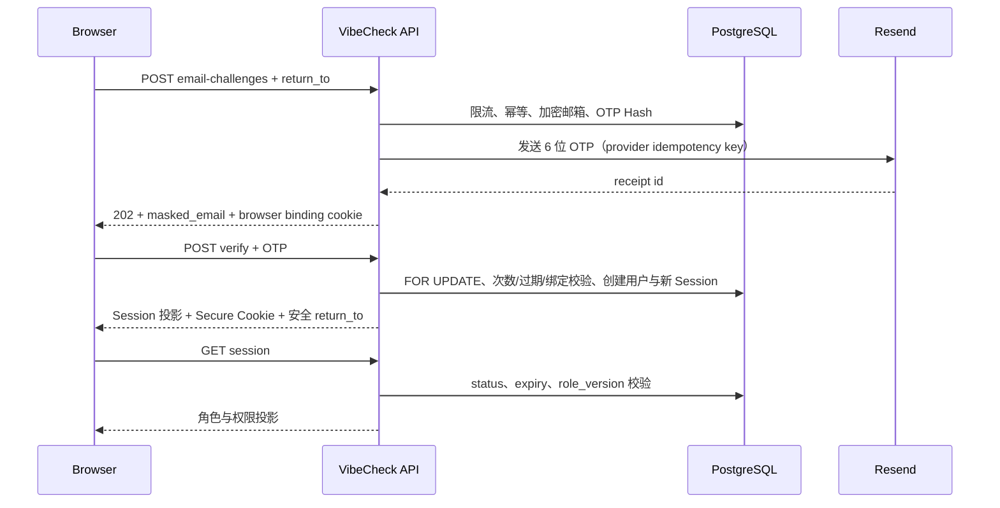

# WP-02：邮箱 OTP、真实 Session、登录回跳与权限基础

**状态：实现完成，待远端 PostgreSQL 质量门｜日期：2026-08-11｜上位基线：PRD v1.10 / ADR-0002**

## 1. 交付范围

WP-02 已实现：

- `@vibecheck/identity` 独立包及可替换 `EmailSender`；首个适配器为 Resend；
- 邮箱规范化/脱敏、AES-256-GCM 加密、Pepper HMAC 检索、OTP 哈希、Opaque Token；
- OTP 创建/验证、60 秒重发、时间窗限流、5 次错误、过期/取消/已使用状态；
- 用户首次验证创建、默认 `user` 角色、角色版本、active/restricted/disabled 账号边界；
- Session 创建/旋转/读取/撤销、CSRF、浏览器绑定、签名匿名主体和安全事件；
- `admin_confirm` 的原 Session 绑定、工作人员角色检查及 5 分钟 Reauth Grant；
- OpenAPI 的 `OP-AUTH-START`、`OP-AUTH-CALLBACK`、Session GET/DELETE；
- P17 邮箱 OTP 两步页面、服务端 Session 启动恢复、`return_to`、登录门和生产环境禁止本地持久化身份；
- 同源 Web/API 静态托管与 Render Blueprint。

不在本工作包内：收藏/关注/评论的生产数据库写接口、匿名比较与账户比较的服务端合并、发布领域接口、站外通知、生产环境创建和真实邮件投递验收。

## 2. 请求流程



## 3. HTTP 与 Cookie

| Operation ID | 方法与路径 | 成功 | 关键保护 |
| --- | --- | --- | --- |
| `OP-AUTH-START` | `POST /api/v1/auth/email-challenges` | 202 | Origin、严格 JSON、签名匿名主体、幂等、限流 |
| `OP-AUTH-CALLBACK` | `POST /api/v1/auth/email-challenges/{id}/verify` | 200 | Origin、浏览器绑定、OTP 原子消费、Session 旋转 |
| `OP-AUTH-SESSION-GET` | `GET /api/v1/auth/session` | 200 | Session/CSRF Hash、账号状态、角色版本 |
| `OP-AUTH-SESSION-DELETE` | `DELETE /api/v1/auth/session` | 204 | Origin、双提交 CSRF、Session 乐观版本 |

所有失败响应使用 `{ error: { code, message_key, request_id, retryable, retry_after_ms } }`。邮件供应商正文、原始邮箱、OTP、Cookie 和 Token 不进入响应错误或结构化日志。

## 4. 数据迁移

`000003_identity_access.sql` 增加/完善：

- `iam.user_roles`；
- Session CSRF、版本、认证方式、最后访问、IP/UA Hash；
- Challenge 浏览器绑定、匿名主体、邮箱密文、客户端幂等、回跳、投递/取消时间；
- `iam.identity_links`；
- `iam.admin_reauth_grants`；
- `audit.security_events`。

迁移仍遵循不可改写、SHA-256、全局锁和逐文件事务规则。当前 migration head 为 3。

## 5. 本地运行

复制 `.env.example` 后，正式测试邮件需要设置 `AUTH_ENABLED=true` 并提供全部身份变量。开发前端默认访问 `VITE_API_BASE_URL`；生产构建为空并使用同源 `/api/v1`。

生成本地邮箱加密密钥示例：

```powershell
[Convert]::ToBase64String([Security.Cryptography.RandomNumberGenerator]::GetBytes(32))
```

所有 Pepper/Token Secret 至少 32 字符。真实 Resend Key 不得写入 `.env.example`、测试快照或提交记录。

## 6. 已验证项

- OpenAPI：5 paths / 6 operations，无悬空引用；
- API：健康检查、标准错误、CORS、Origin、严格字段、完整 OTP HTTP 流、Cookie、Session、CSRF 退出、SPA 静态托管；
- Identity：加密/解密、OTP Hash、邮箱/回跳规范化、Resend 幂等/错误脱敏、有效/无效 OTP；
- Frontend：邮箱 OTP 正常流、游客分支、安全回跳、登录门、旧页面回跳与回归；
- Render Blueprint：通过当前官方 Schema 校验。

## 7. 远端门与上线前条件

GitHub Actions 必须在 PostgreSQL 18 + pgvector 上：

1. 连续执行两次 `npm run db:migrate`；
2. 验证 migration head 为 3；
3. 通过 lint、typecheck、全部 Web/基础包测试和生产构建。

部署前还需配置并验证 `EMAIL_FROM`、`RESEND_API_KEY`、`EMAIL_ENCRYPTION_KEY`，完成 Resend 发件域 DNS 验证，并以真实邮箱验证发送、重发、错误次数、过期、退出和 Session 恢复。未完成这些步骤时只能标记“代码可部署”，不能标记“生产邮件验收通过”。
